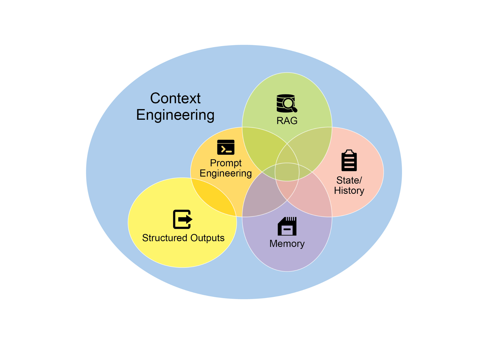
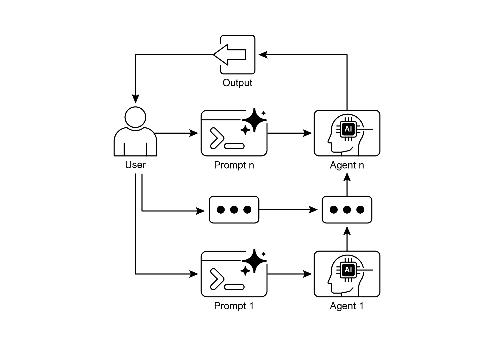

# 第 1 章:提示鏈(Prompt Chaining)

## 提示鏈模式總覽

提示鏈(Prompt Chaining),有時又稱為管線模式(Pipeline pattern),是運用大型語言模型(LLM)處理複雜任務時的一種強大範式。與其期望 LLM 在單一、龐大的步驟中解決一個複雜問題,提示鏈主張採取「分而治之」的策略。其核心理念是把原本龐大而棘手的問題,拆解成一連串較小、較易掌控的子問題。每個子問題都透過一個專門設計的提示來個別處理,而某個提示所產生的輸出,會被策略性地當作鏈中下一個提示的輸入。

這種循序處理的技巧,本質上為與 LLM 的互動帶來了模組化與清晰度。透過拆解複雜任務,理解與除錯每一個獨立步驟都變得更容易,使整體流程更穩健、更具可解釋性。鏈中的每一步都能被精心設計與最佳化,專注於整體大問題的某個特定面向,從而帶來更精準、更聚焦的輸出。

某一步的輸出作為下一步的輸入,這一點至關重要。這種資訊的傳遞建立起一條依賴鏈(dependency chain),「鏈」這個名稱便由此而來——先前操作的情境與結果,引導著後續的處理。這讓 LLM 能夠在先前成果的基礎上繼續推進、精煉其理解,並逐步逼近所期望的解答。

此外,提示鏈不僅是把問題拆開而已;它也讓外部知識與工具的整合成為可能。在每一步中,LLM 都可以被指示去與外部系統、API 或資料庫互動,從而讓它的知識與能力超越其內部訓練資料的範圍。這項能力大幅擴展了 LLM 的潛力,使它們不再只是孤立的模型,而能成為更廣大、更智慧系統中不可或缺的組成元件。

提示鏈的意義遠超過單純的問題解決。它是建構精密 AI 代理(AI agent)的基礎技術。這些代理能利用提示鏈,在動態環境中自主地規劃、推理與行動。透過策略性地安排提示的順序,代理便能投入需要多步推理、規劃與決策的任務。這類代理的工作流程能更貼近地模擬人類的思考歷程,讓它在面對複雜領域與系統時,得以進行更自然、更有效的互動。

**單一提示的侷限:** 對於多面向的任務,使用單一、複雜的提示來驅動 LLM 可能效率不彰,會讓模型難以兼顧各種限制與指令,並可能導致以下問題:指令忽略(instruction neglect),即提示中的部分內容被忽視;情境漂移(contextual drift),即模型逐漸偏離原本的情境;錯誤傳播(error propagation),即早期的錯誤被不斷放大;需要更長情境視窗(context window)的提示,使模型獲得的資訊不足以回應;以及幻覺(hallucination),即認知負荷增加而提高了產生錯誤資訊的機率。舉例來說,一個要求「分析一份市場研究報告、摘要其發現、找出有數據支撐的趨勢,並草擬一封電子郵件」的查詢,很可能失敗——模型也許能把摘要做得不錯,卻無法妥善地擷取數據或草擬郵件。

**透過循序拆解提升可靠性:** 提示鏈正是藉由把複雜任務拆解成聚焦、循序的工作流程來應對這些挑戰,從而大幅提升可靠性與可控性。以上述例子而言,管線式或鏈式的做法可以描述如下:

1. **第一個提示(摘要):**「請摘要以下市場研究報告的關鍵發現:[文字]。」模型唯一的焦點就是摘要,這提高了這個起始步驟的準確度。
2. **第二個提示(趨勢辨識):**「根據此摘要,找出前三大新興趨勢,並擷取支撐每項趨勢的具體數據:[步驟 1 的輸出]。」這個提示現在受到更明確的約束,且直接建立在一個已驗證的輸出之上。
3. **第三個提示(撰寫郵件):**「請撰寫一封簡潔的電子郵件給行銷團隊,概述以下趨勢及其支撐數據:[步驟 2 的輸出]。」

這樣的拆解讓我們能對流程進行更細緻的掌控。每一步都更簡單、更不模稜兩可,這降低了模型的認知負荷,帶來更準確、更可靠的最終輸出。這種模組化,就好比一條運算管線——每個函式各自執行特定操作,再把結果傳遞給下一個。為了確保每個特定任務都能得到準確的回應,我們還可以在每個階段賦予模型一個明確的角色。例如在上述情境中,第一個提示可指定為「市場分析師」,後續的提示為「交易分析師」,第三個提示為「專家文件撰寫者」,依此類推。

**結構化輸出的角色:** 提示鏈的可靠性,高度仰賴於各步驟之間所傳遞資料的完整性。如果某個提示的輸出含糊不清或格式不佳,後續的提示就可能因輸入有誤而失敗。為了緩解這個問題,指定一種結構化的輸出格式(例如 JSON 或 XML)至關重要。

舉例來說,趨勢辨識步驟的輸出可以格式化為一個 JSON 物件:

```json
{
  "trends": [
    {
      "trend_name": "AI-Powered Personalization",
      "supporting_data": "73% of consumers prefer to do business with brands that use personal information to make their shopping experiences more relevant."
    },
    {
      "trend_name": "Sustainable and Ethical Brands",
      "supporting_data": "Sales of products with ESG-related claims grew 28% over the last five years, compared to 20% for products without."
    }
  ]
}
```

> 上述 JSON 欄位中譯:`trends` 為趨勢清單;每一筆的 `trend_name`(趨勢名稱)與 `supporting_data`(支撐數據)分別為——「AI 驅動的個人化」,支撐數據:「73% 的消費者偏好與會運用個人資訊、使購物體驗更貼近自身需求的品牌往來。」;以及「永續且符合道德的品牌」,支撐數據:「過去五年間,帶有 ESG 相關訴求的產品銷售成長了 28%,相較之下,不帶此類訴求的產品則為 20%。」

這種結構化格式確保資料是機器可讀的,能被精確地解析並插入下一個提示中,不致產生歧義。這項做法把因詮釋自然語言而可能產生的錯誤降到最低,是建構穩健、多步驟 LLM 系統的關鍵元件。

## 實務應用與使用案例

在建構代理系統時,提示鏈是一種適用範圍廣泛的模式。它的核心效用在於把複雜問題拆解成循序、可掌控的步驟。以下是幾個實務應用與使用案例:

**1. 資訊處理工作流程:** 許多任務都涉及把原始資訊經過多次轉換來處理。例如:摘要一份文件、擷取關鍵實體,接著再用這些實體去查詢資料庫或生成報告。一條提示鏈可能長這樣:

- 提示 1:從指定的 URL 或文件中擷取文字內容。
- 提示 2:摘要清理過後的文字。
- 提示 3:從摘要或原始文字中擷取特定實體(例如人名、日期、地點)。
- 提示 4:用這些實體去搜尋內部知識庫。
- 提示 5:整合摘要、實體與搜尋結果,生成最終報告。

這套方法被應用於自動化內容分析、AI 驅動研究助理的開發,以及複雜報告生成等領域。

**2. 複雜問題回答:** 回答那些需要多步推理或多次資訊檢索的複雜問題,是一個絕佳的使用案例。例如:「1929 年股市崩盤的主要成因為何?政府政策又是如何回應的?」

- 提示 1:辨識使用者查詢中的核心子問題(崩盤成因、政府回應)。
- 提示 2:針對 1929 年崩盤的成因進行研究或檢索資訊。
- 提示 3:針對政府對 1929 年股市崩盤的政策回應進行研究或檢索資訊。
- 提示 4:把步驟 2 與步驟 3 的資訊綜合成一個連貫的答案,回應原始查詢。

這種循序處理方法,是開發具備多步推論與資訊綜整能力之 AI 系統的核心。當一個查詢無法靠單一資料點回答,而是需要一連串邏輯步驟,或是整合來自不同來源的資訊時,就需要這類系統。

舉例來說,一個用來針對特定主題生成完整報告的自動化研究代理,執行的是一種混合式的運算工作流程。一開始,系統會檢索眾多相關文章。從每篇文章中擷取關鍵資訊的後續工作,可以針對每個來源平行進行——這個階段非常適合平行處理,讓彼此獨立的子任務同時執行,以最大化效率。

然而,一旦個別的擷取工作完成,流程便轉為本質上的循序進行。系統必須先彙整擷取到的資料,接著綜整成一份連貫的初稿,最後再審閱並精煉這份初稿以產出最終報告。後面這些階段在邏輯上各自依賴於前一階段的成功完成。這正是提示鏈派上用場之處:彙整後的資料作為綜整提示的輸入,而綜整後產出的文字又成為最終審閱提示的輸入。因此,複雜的操作經常會把「用於獨立資料蒐集的平行處理」與「用於綜整、精煉等相依步驟的提示鏈」結合起來。

**3. 資料擷取與轉換:** 把非結構化文字轉換成結構化格式,通常是透過一個迭代過程來達成,需要循序的修正以提升輸出的準確度與完整度。

- 提示 1:嘗試從一份發票文件中擷取特定欄位(例如姓名、地址、金額)。
- 處理:檢查是否所有必填欄位都已擷取,且符合格式要求。
- 提示 2(條件式):若有欄位缺漏或格式錯誤,擬定一個新提示,要求模型專門去尋找缺漏或格式錯誤的資訊,或許可附上前次失敗嘗試的情境作為參考。
- 處理:再次驗證結果。必要時重複進行。
- 輸出:提供已擷取、已驗證的結構化資料。

這種循序處理方法特別適用於從表單、發票或電子郵件等非結構化來源進行資料擷取與分析。舉例而言,解決複雜的光學字元辨識(OCR)問題——例如處理一份 PDF 表單——透過拆解式的多步驟方法會更為有效。

一開始,先運用大型語言模型對文件影像進行主要的文字擷取。接著,模型會處理原始輸出以正規化資料,這一步它可能會把諸如「一千零五十」這樣的數字文字,轉換成其等值的數值 1050。對 LLM 而言,執行精確的數學運算是一大挑戰。因此,在後續步驟中,系統可以把任何必要的算術運算委派給外部的計算機工具。LLM 辨識出需要進行的計算,把正規化後的數字餵給工具,再把精確的結果整合回來。這一連串「文字擷取、資料正規化、外部工具使用」的鏈式流程,能達成單靠一次 LLM 查詢往往難以穩定取得的最終準確結果。

**4. 內容生成工作流程:** 複雜內容的撰寫是一項程序性的任務,通常會被拆解成數個不同階段,包括初步發想、結構大綱、撰寫初稿,以及後續的修訂。

- 提示 1:根據使用者的整體興趣,生成 5 個主題構想。
- 處理:讓使用者選擇其中一個構想,或自動挑選最佳者。
- 提示 2:根據選定的主題,生成一份詳細的大綱。
- 提示 3:根據大綱的第一個重點撰寫一段初稿。
- 提示 4:根據大綱的第二個重點撰寫一段初稿,並提供前一段作為情境。針對所有大綱重點持續進行。
- 提示 5:審閱並精煉整份初稿的連貫性、語氣與文法。

這套方法被用於各式各樣的自然語言生成任務,包括創意敘事、技術文件,以及其他形式之結構化文字內容的自動撰寫。

**5. 具狀態的對話式代理:** 雖然完整的狀態管理架構所採用的方法比循序串接更為複雜,提示鏈仍提供了維繫對話連續性的基礎機制。這項技巧透過把每一輪對話建構成一個新的提示——其中有系統地納入對話序列中先前互動所得的資訊或所擷取的實體——來維持情境。

- 提示 1:處理使用者的第一段話語,辨識意圖與關鍵實體。
- 處理:用該意圖與實體更新對話狀態。
- 提示 2:根據當前狀態,生成回應,以及/或辨識下一個所需的資訊。
- 針對後續各輪重複進行,每一段新的使用者話語都會啟動一條鏈,並運用持續累積的對話歷史(狀態)。

這個原則是開發對話式代理的根本所在,使它們能在綿延、多輪的對話中維持情境與連貫性。透過保留對話歷史,系統便能理解並適切地回應那些依賴於先前所交換資訊的使用者輸入。

**6. 程式碼生成與精煉:** 生成可運作的程式碼通常是一個多階段的過程,需要把一個問題拆解成一連串各自獨立的邏輯操作,並逐步執行。

- 提示 1:理解使用者對某個程式碼函式的需求。生成虛擬碼或大綱。
- 提示 2:根據大綱撰寫初版程式碼。
- 提示 3:找出程式碼中潛在的錯誤或可改進之處(或許可使用靜態分析工具或另一次 LLM 呼叫)。
- 提示 4:根據找出的問題重寫或精煉程式碼。
- 提示 5:加入文件說明或測試案例。

在 AI 輔助軟體開發這類應用中,提示鏈的效用源自它能把複雜的編碼任務拆解成一系列可掌控的子問題。這種模組化結構,降低了 LLM 在每一步的操作複雜度。關鍵在於,這種做法也允許在模型呼叫之間插入確定性(deterministic)的邏輯,讓工作流程中得以進行中介資料處理、輸出驗證與條件分支。透過這種方式,一個原本可能導致不可靠或不完整結果的單一、多面向請求,就被轉換成由底層執行框架所管理的一系列結構化操作。

**7. 多模態與多步推理:** 分析具有多種模態(modality)的資料集,需要把問題拆解成更小、以提示為基礎的任務。舉例來說,要解讀一張影像——其中包含一張帶有嵌入文字的圖片、標示特定文字片段的標籤,以及解釋各標籤的表格資料——就需要這樣的做法。

- 提示 1:從使用者的影像請求中擷取並理解文字。
- 提示 2:把擷取出的影像文字與其對應的標籤連結起來。
- 提示 3:運用表格來詮釋蒐集到的資訊,以判定所需的輸出。

## 動手實作範例

實作提示鏈的方式,小至在腳本中直接、循序地呼叫函式,大至運用專為管理控制流程、狀態與元件整合而設計的專門框架。LangChain、LangGraph、Crew AI 以及 Google 的 Agent Development Kit(ADK)等框架,提供了結構化的環境來建構與執行這些多步驟流程,對於複雜架構尤其有利。

為了示範,LangChain 與 LangGraph 是合適的選擇,因為它們的核心 API 明確地針對「組合操作的鏈與圖」而設計。LangChain 為線性序列提供了基礎抽象,而 LangGraph 則進一步擴展這些能力,以支援具狀態與循環性的運算——這些是實作更精密代理行為所必需的。本範例將聚焦於一個基本的線性序列。

以下程式碼實作了一條兩步驟的提示鏈,作為一條資料處理管線。第一階段的設計是要解析非結構化文字並擷取特定資訊;第二階段則接收這個擷取出的輸出,並把它轉換成結構化的資料格式。

要重現此程序,必須先安裝所需的函式庫。可使用以下指令完成:

```bash
pip install langchain langchain-community langchain-openai langgraph
```

請注意,`langchain-openai` 可替換成對應於其他模型供應商的適當套件。接著,執行環境必須設定好所選語言模型供應商(例如 OpenAI、Google Gemini 或 Anthropic)所需的 API 憑證。

```python
import os
from langchain_openai import ChatOpenAI
from langchain_core.prompts import ChatPromptTemplate
from langchain_core.output_parsers import StrOutputParser

# 為了更高的安全性,從 .env 檔案載入環境變數
# from dotenv import load_dotenv
# load_dotenv()
# 請確認你的 OPENAI_API_KEY 已設定在 .env 檔案中

# 初始化語言模型(建議使用 ChatOpenAI)
llm = ChatOpenAI(temperature=0)

# --- 提示 1:擷取資訊 ---
# 提示詞中譯:從以下文字中擷取技術規格:\n\n{text_input}
prompt_extract = ChatPromptTemplate.from_template(
    "Extract the technical specifications from the following text:\n\n{text_input}"
)

# --- 提示 2:轉換成 JSON ---
# 提示詞中譯:請將以下規格轉換成一個 JSON 物件,
# 以 'cpu'、'memory' 與 'storage' 作為鍵:\n\n{specifications}
prompt_transform = ChatPromptTemplate.from_template(
    "Transform the following specifications into a JSON object with "
    "'cpu', 'memory', and 'storage' as keys:\n\n{specifications}"
)

# --- 使用 LCEL 建構鏈 ---
# StrOutputParser() 會把 LLM 的訊息輸出轉換成單純的字串。
extraction_chain = prompt_extract | llm | StrOutputParser()

# 完整的鏈會把擷取鏈的輸出,傳入轉換提示的 'specifications' 變數。
full_chain = (
    {"specifications": extraction_chain}
    | prompt_transform
    | llm
    | StrOutputParser()
)

# --- 執行鏈 ---
input_text = "The new laptop model features a 3.5 GHz octa-core processor, 16GB of RAM, and a 1TB NVMe SSD."

# 用輸入文字的字典來執行這條鏈。
final_result = full_chain.invoke({"text_input": input_text})

print("\n--- Final JSON Output ---")
print(final_result)
```

這段 Python 程式碼示範了如何使用 LangChain 函式庫來處理文字。它運用了兩個獨立的提示:一個用來從輸入字串中擷取技術規格,另一個則把這些規格格式化成 JSON 物件。語言模型的互動使用 `ChatOpenAI` 模型,而 `StrOutputParser` 則確保輸出是可用的字串格式。範例使用 LangChain 表達式語言(LangChain Expression Language,LCEL)來優雅地把這些提示與語言模型串接在一起。第一條鏈 `extraction_chain` 負責擷取規格;`full_chain` 接著取得擷取的輸出,並把它當作轉換提示的輸入。範例提供了一段描述筆記型電腦的輸入文字,並以此文字呼叫 `full_chain`,讓它經過這兩個步驟的處理。最終結果是一個包含已擷取並已格式化規格的 JSON 字串,接著被印出。

## 情境工程與提示工程

情境工程(Context Engineering,見圖 1)是一門系統化的學科,旨在於模型生成 token 之前,為其設計、建構並交付一個完整的資訊環境。這套方法主張:模型輸出的品質,較少取決於模型架構本身,而更多取決於所提供情境的豐富程度。



*圖 1:情境工程是一門為 AI 建構豐富、完整資訊環境的學科,因為此情境的品質是促成進階代理(Agentic)表現的首要因素。*

相較於主要著重於最佳化使用者當下查詢措辭的傳統提示工程(Prompt Engineering),情境工程是一項重大的演進。情境工程把範圍擴展到涵蓋多個資訊層次,例如系統提示(system prompt)——這是一組定義 AI 運作參數的基礎指令,例如「你是一位技術文件撰寫者;你的語氣必須正式且精確。」情境還會進一步以外部資料加以豐富,這包括檢索到的文件(AI 主動從知識庫擷取資訊以輔助回應,例如為某專案調出技術規格),也包括工具輸出(AI 使用外部 API 取得即時資料的結果,例如查詢行事曆以判斷使用者是否有空)。這些顯性資料,還會與關鍵的隱性資料結合,例如使用者身分、互動歷史與環境狀態。其核心原則是:即使是先進的模型,在只獲得對運作環境之有限或拙劣建構之視野時,也會表現不佳。

因此,這項實務把任務從「單純回答問題」重新定位為「為代理建構一幅完整的運作全貌」。舉例來說,一個經過情境工程的代理,不會只是回應查詢,而會先整合使用者的行事曆空檔(工具輸出)、與某封郵件收件人之間的專業關係(隱性資料),以及先前會議的筆記(檢索到的文件)。這讓模型得以產生高度相關、個人化且在實務上真正有用的輸出。其中「工程」的部分,涉及建立穩健的管線以在執行階段擷取並轉換這些資料,並建立回饋迴路以持續改善情境品質。

要實作這一點,可以運用專門的調校系統,以大規模地自動化改善過程。舉例來說,像 Google 的 Vertex AI prompt optimizer 這類工具,能透過依據一組範例輸入與預先定義的評估指標來有系統地評估回應,藉此提升模型表現。這種做法對於在不同模型之間調適提示與系統指令、而無需大量人工重寫,相當有效。只要提供這類最佳化工具範例提示、系統指令與一個範本,它便能以程式化的方式精煉情境輸入,為實作精密情境工程所需的回饋迴路,提供一套結構化的方法。

這種結構化的做法,正是區分「簡陋 AI 工具」與「更精密、具情境感知系統」的關鍵所在。它把情境本身視為首要元件,高度重視代理知道什麼、何時知道,以及它如何運用該資訊。這項實務確保模型對使用者的意圖、歷史與當前環境有全面的理解。歸根究柢,情境工程是把無狀態(stateless)聊天機器人推進為高能力、具情境感知系統的關鍵方法。

## 重點速覽

**是什麼(What):** 當複雜任務被塞進單一提示中處理時,往往會讓 LLM 不堪負荷,導致顯著的效能問題。模型的認知負荷增加,會提高各種錯誤的可能性,例如忽略指令、遺失情境,以及產生錯誤資訊。一個龐大的單體式提示,難以有效管理多重限制與循序的推理步驟。這會造成不可靠、不準確的輸出,因為 LLM 無法兼顧這個多面向請求的所有面向。

**為什麼(Why):** 提示鏈提供了一套標準化的解法,把複雜問題拆解成一連串較小、彼此相連的子任務。鏈中的每一步都用一個聚焦的提示來執行特定操作,大幅提升可靠性與可控性。某個提示的輸出會作為下一個提示的輸入,構成一條邏輯工作流程,逐步朝最終解答推進。這種模組化、分而治之的策略,讓流程更易於管理、更易於除錯,並允許在各步驟之間整合外部工具或結構化資料格式。此模式是開發能夠規劃、推理並執行複雜工作流程之精密、多步驟代理系統的基礎。

**經驗法則(Rule of thumb):** 當一個任務複雜到單一提示無法勝任、涉及多個不同的處理階段、需要在各步驟之間與外部工具互動,或是當你正在建構需要進行多步推理並維持狀態的代理系統時,就使用此模式。

## 視覺摘要



*圖 2:提示鏈模式——代理從使用者處接收一系列提示,每個代理的輸出都作為鏈中下一個代理的輸入。*

## 重點整理

以下是一些重點:

- 提示鏈把複雜任務拆解成一連串較小、聚焦的步驟。這有時被稱為管線(Pipeline)模式。
- 鏈中的每一步都涉及一次 LLM 呼叫或處理邏輯,並以前一步的輸出作為輸入。
- 此模式提升了與語言模型進行複雜互動時的可靠性與可管理性。
- LangChain/LangGraph 與 Google ADK 等框架,提供了穩健的工具來定義、管理並執行這些多步驟序列。

## 結論

透過把複雜問題解構成一連串較簡單、較易掌控的子任務,提示鏈為引導大型語言模型提供了一套穩健的框架。這種「分而治之」的策略,藉由讓模型一次只專注於一個特定操作,大幅提升了輸出的可靠性與可控性。作為一種基礎模式,它使開發出具備多步推理、工具整合與狀態管理能力的精密 AI 代理成為可能。歸根究柢,精通提示鏈,是建構能執行複雜工作流程之穩健、具情境感知系統的關鍵——其能耐遠遠超越單一提示所能企及。

## 參考資料

1. LangChain Documentation on LCEL:
   <https://python.langchain.com/v0.2/docs/core_modules/expression_language/>
2. LangGraph Documentation: <https://langchain-ai.github.io/langgraph/>
3. Prompt Engineering Guide - Chaining Prompts:
   <https://www.promptingguide.ai/techniques/chaining>
4. OpenAI API Documentation (General Prompting Concepts):
   <https://platform.openai.com/docs/guides/gpt/prompting>
5. Crew AI Documentation (Tasks and Processes): <https://docs.crewai.com/>
6. Google AI for Developers (Prompting Guides):
   <https://cloud.google.com/discover/what-is-prompt-engineering?hl=en>
7. Vertex Prompt Optimizer:
   <https://cloud.google.com/vertex-ai/generative-ai/docs/learn/prompts/prompt-optimizer>
