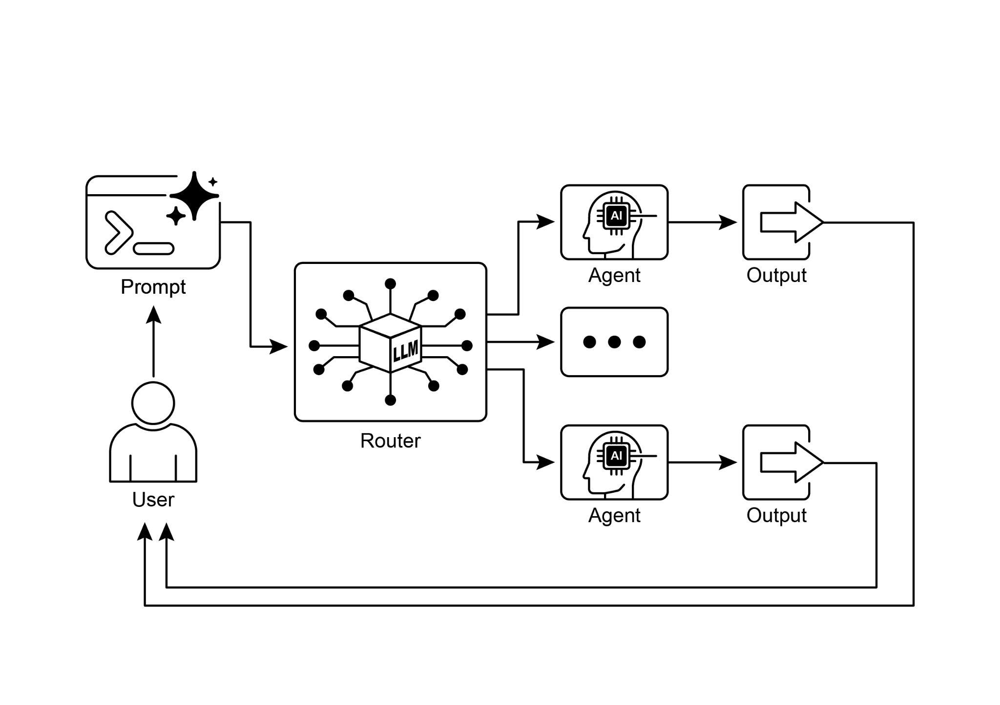

# 第 2 章:路由(Routing)

## 路由模式總覽

透過提示鏈(Prompt Chaining)進行的循序處理,是用語言模型執行確定性、線性工作流程的一項基礎技術;然而,在需要適應性回應的情境中,它的適用性便受到侷限。真實世界的代理系統(agentic system)往往必須根據各種突發因素來在多種可能的行動之間做出裁決,例如環境的狀態、使用者的輸入,或前一個操作的結果。這種動態決策的能力,主導著控制流程如何導向不同的專門函式、工具或子流程,而這正是透過一種稱為路由(Routing)的機制來達成的。

路由為代理的運作框架引入了條件邏輯(conditional logic),讓系統得以從固定的執行路徑,轉變為一種代理會動態評估特定條件、並從一組可能的後續行動中做出選擇的模式。這使得系統能展現更靈活、更具情境感知能力的行為。

舉例來說,一個為處理客戶查詢而設計的代理,若配備了路由功能,便能先對傳入的查詢進行分類,以判定使用者的意圖。根據這個分類結果,它接著可以把查詢導向一個專責直接問答的專門代理、一個用於擷取帳戶資訊的資料庫檢索工具,或是一道處理複雜問題的升級程序,而不必一律退回到單一、預先設定好的回應路徑。因此,一個更精密、運用路由的代理可以:

1. 分析使用者的查詢。
2. 根據其意圖路由該查詢:
   - 若意圖為「查詢訂單狀態」,便路由到一個會與訂單資料庫互動的子代理或工具鏈。
   - 若意圖為「產品資訊」,便路由到一個會搜尋產品型錄的子代理或鏈。
   - 若意圖為「技術支援」,便路由到另一條會存取疑難排解指南、或升級給真人處理的鏈。
   - 若意圖不明確,便路由到一個負責釐清的子代理或提示鏈。

路由模式的核心元件,是一個執行評估並導引流程的機制。這個機制可以用幾種方式來實作:

- **以 LLM 為基礎的路由(LLM-based Routing):** 可以提示語言模型本身去分析輸入,並輸出一個特定的識別字或指令,以指出下一步或目的地。舉例來說,提示可能要求 LLM「分析以下使用者查詢,並只輸出類別:『Order Status』、『Product Info』、『Technical Support』或『Other』。」代理系統接著讀取這個輸出,並據此導引工作流程。
- **以嵌入為基礎的路由(Embedding-based Routing):** 可以把輸入查詢轉換成一個向量嵌入(vector embedding,見第 14 章 RAG)。這個嵌入接著會與代表不同路由或能力的嵌入進行比較,查詢便被路由到嵌入最相似的那條路由。這種做法適用於語意路由(semantic routing),亦即決策是根據輸入的意義,而非僅僅根據關鍵字。
- **以規則為基礎的路由(Rule-based Routing):** 這涉及使用預先定義的規則或邏輯(例如 if-else 陳述式、switch case),其依據是從輸入中擷取出的關鍵字、模式或結構化資料。比起以 LLM 為基礎的路由,這種做法可以更快、更具確定性,但在處理細膩或新穎的輸入時較不靈活。
- **以機器學習模型為基礎的路由(Machine Learning Model-Based Routing):** 它採用一個判別式模型(discriminative model),例如分類器,該模型已針對路由任務,在一小批標註資料的語料庫上經過專門訓練。雖然這在概念上與以嵌入為基礎的方法有相似之處,但其關鍵特徵在於監督式微調(supervised fine-tuning)的過程——此過程會調整模型的參數,以建立一個專門的路由函式。這項技術有別於以 LLM 為基礎的路由,因為其決策元件並不是一個在推論時(inference time)執行提示的生成式模型;相反地,路由邏輯被編碼在這個經微調模型所學到的權重之中。雖然 LLM 可能會被用於前處理步驟,以生成合成資料來擴增訓練集,但它們並不參與即時的路由決策本身。

路由機制可以在代理運作週期中的多個節點上實作。它們可以在一開始就被用來分類主要任務,可以在處理鏈的中間節點上被用來判定後續行動,也可以在某個子程序中被用來從一組工具裡選出最合適的那一個。LangChain、LangGraph 以及 Google 的 Agent Development Kit(ADK)等運算框架,提供了明確的建構元件來定義並管理這類條件邏輯。憑藉其以狀態為基礎的圖架構,LangGraph 特別適合用於複雜的路由情境——在這些情境中,決策取決於整個系統所累積的狀態。同樣地,Google 的 ADK 提供了用以建構代理能力與互動模型的基礎元件,而這些元件正是實作路由邏輯的基礎。在這些框架所提供的執行環境中,開發者會定義各種可能的操作路徑,以及那些主導運算圖中節點之間轉換的函式或以模型為基礎的評估。

路由的實作,使一個系統得以超越確定性的循序處理。它促成了更具適應性之執行流程的開發,讓系統能對更廣泛的輸入與狀態變化做出動態且適切的回應。

## 實務應用與使用案例

路由模式是設計適應性代理系統時的一項關鍵控制機制,讓系統得以因應多變的輸入與內部狀態,動態地改變其執行路徑。它透過提供一層必要的條件邏輯,使其效用橫跨多個領域。

在人機互動領域,例如虛擬助理或 AI 驅動的家教中,路由被用來解讀使用者意圖。對自然語言查詢的初步分析,會判定最適切的後續行動——無論是呼叫某個特定的資訊檢索工具、升級給真人操作員,或是根據使用者表現挑選課程中的下一個模組。這讓系統得以超越線性的對話流程,並能依情境做出回應。

在自動化的資料與文件處理管線中,路由扮演著分類與分派的功能。傳入的資料,例如電子郵件、支援工單或 API 載荷(payload),會根據其內容、中繼資料(metadata)或格式被加以分析。系統接著會把每一項資料導向對應的工作流程,例如業務開發潛在客戶(sales lead)的匯入流程、針對 JSON 或 CSV 格式的特定資料轉換函式,或是緊急問題的升級路徑。

在涉及多個專門工具或代理的複雜系統中,路由扮演著高階分派器(high-level dispatcher)的角色。一個由負責搜尋、摘要與分析資訊等不同代理所組成的研究系統,會使用一個路由器,根據當前目標把任務指派給最合適的代理。同樣地,AI 編碼助理會運用路由來辨識程式語言與使用者的意圖——是要除錯、解釋,還是翻譯——然後再把程式碼片段傳給正確的專門工具。

歸根究柢,路由提供了進行邏輯裁決的能力,而這正是打造功能多元、具情境感知能力之系統所不可或缺的。它把一個代理,從預先定義序列的靜態執行者,轉變為一個能在變動條件下、針對「完成某項任務的最有效方法」做出決策的動態系統。

## 動手實作範例(LangChain)

在程式碼中實作路由,涉及定義各種可能的路徑,以及決定要走哪一條路徑的邏輯。LangChain 與 LangGraph 這類框架,為此提供了特定的元件與結構。LangGraph 以狀態為基礎的圖結構,在視覺化與實作路由邏輯方面尤其直觀。

這段程式碼示範了一個使用 LangChain 與 Google Generative AI 的簡易類代理(agent-like)系統。它建立了一個「協調者(coordinator)」,根據請求的意圖(訂位、資訊查詢,或不明確),把使用者請求路由到不同的模擬「子代理(sub-agent)」處理常式。系統運用一個語言模型來分類請求,接著把它委派給適當的處理函式,模擬出在多代理(multi-agent)架構中常見的基本委派模式。

首先,請確認你已安裝必要的函式庫:

```bash
pip install langchain langgraph google-cloud-aiplatform langchain-google-genai google-adk deprecated pydantic
```

你也需要為所選的語言模型(例如 OpenAI、Google Gemini 或 Anthropic)設定好環境中的 API 金鑰。

```python
# Copyright (c) 2025 Marco Fago
# https://www.linkedin.com/in/marco-fago/
#
# This code is licensed under the MIT License.
# See the LICENSE file in the repository for the full license text.
from langchain_google_genai import ChatGoogleGenerativeAI
from langchain_core.prompts import ChatPromptTemplate
from langchain_core.output_parsers import StrOutputParser
from langchain_core.runnables import RunnablePassthrough, RunnableBranch

# --- Configuration ---
# Ensure your API key environment variable is set (e.g., GOOGLE_API_KEY)
try:
    llm = ChatGoogleGenerativeAI(model="gemini-2.5-flash", temperature=0)
    print(f"Language model initialized: {llm.model}")
except Exception as e:
    print(f"Error initializing language model: {e}")
    llm = None

# --- Define Simulated Sub-Agent Handlers (equivalent to ADK sub_agents) ---
def booking_handler(request: str) -> str:
    """Simulates the Booking Agent handling a request."""
    print("\n--- DELEGATING TO BOOKING HANDLER ---")
    return f"Booking Handler processed request: '{request}'. Result: Simulated booking action."

def info_handler(request: str) -> str:
    """Simulates the Info Agent handling a request."""
    print("\n--- DELEGATING TO INFO HANDLER ---")
    return f"Info Handler processed request: '{request}'. Result: Simulated information retrieval."

def unclear_handler(request: str) -> str:
    """Handles requests that couldn't be delegated."""
    print("\n--- HANDLING UNCLEAR REQUEST ---")
    return f"Coordinator could not delegate request: '{request}'. Please clarify."

# --- Define Coordinator Router Chain (equivalent to ADK coordinator's instruction) ---
# This chain decides which handler to delegate to.
# 提示詞中譯(system 訊息):
# 分析使用者的請求,判斷應由哪一個專門處理常式來處理。
# - 若請求與訂機票或飯店有關,輸出 'booker'。
# - 對於其他所有一般資訊問題,輸出 'info'。
# - 若請求不明確或不屬於上述任一類別,輸出 'unclear'。
# 只輸出一個字:'booker'、'info' 或 'unclear'。
coordinator_router_prompt = ChatPromptTemplate.from_messages([
    ("system", """Analyze the user's request and determine which specialist handler should process it.
- If the request is related to booking flights or hotels, output 'booker'.
- For all other general information questions, output 'info'.
- If the request is unclear or doesn't fit either category, output 'unclear'.
ONLY output one word: 'booker', 'info', or 'unclear'."""),
    ("user", "{request}")
])

if llm:
    coordinator_router_chain = coordinator_router_prompt | llm | StrOutputParser()

# --- Define the Delegation Logic (equivalent to ADK's Auto-Flow based on sub_agents) ---
# Use RunnableBranch to route based on the router chain's output.

# Define the branches for the RunnableBranch
branches = {
    "booker": RunnablePassthrough.assign(output=lambda x: booking_handler(x['request']['request'])),
    "info": RunnablePassthrough.assign(output=lambda x: info_handler(x['request']['request'])),
    "unclear": RunnablePassthrough.assign(output=lambda x: unclear_handler(x['request']['request'])),
}

# Create the RunnableBranch. It takes the output of the router chain
# and routes the original input ('request') to the corresponding handler.
delegation_branch = RunnableBranch(
    (lambda x: x['decision'].strip() == 'booker', branches["booker"]), # Added .strip()
    (lambda x: x['decision'].strip() == 'info', branches["info"]),     # Added .strip()
    branches["unclear"] # Default branch for 'unclear' or any other output
)

# Combine the router chain and the delegation branch into a single runnable
# The router chain's output ('decision') is passed along with the original input ('request')
# to the delegation_branch.
coordinator_agent = {
    "decision": coordinator_router_chain,
    "request": RunnablePassthrough()
} | delegation_branch | (lambda x: x['output']) # Extract the final output

# --- Example Usage ---
def main():
    if not llm:
        print("\nSkipping execution due to LLM initialization failure.")
        return

    print("--- Running with a booking request ---")
    request_a = "Book me a flight to London."
    result_a = coordinator_agent.invoke({"request": request_a})
    print(f"Final Result A: {result_a}")

    print("\n--- Running with an info request ---")
    request_b = "What is the capital of Italy?"
    result_b = coordinator_agent.invoke({"request": request_b})
    print(f"Final Result B: {result_b}")

    print("\n--- Running with an unclear request ---")
    request_c = "Tell me about quantum physics."
    result_c = coordinator_agent.invoke({"request": request_c})
    print(f"Final Result C: {result_c}")

if __name__ == "__main__":
    main()
```

如前所述,這段 Python 程式碼使用 LangChain 函式庫與 Google 的 Generative AI 模型(具體而言為 gemini-2.5-flash)建構了一個簡易的類代理系統。詳細來說,它定義了三個模擬的子代理處理常式:`booking_handler`、`info_handler` 與 `unclear_handler`,各自負責處理特定類型的請求。

其核心元件是 `coordinator_router_chain`,它運用一個 `ChatPromptTemplate` 來指示語言模型,把傳入的使用者請求歸類為三個類別之一:『booker』、『info』或『unclear』。這個路由鏈的輸出,接著被一個 `RunnableBranch` 用來把原始請求委派給對應的處理函式。`RunnableBranch` 會檢查來自語言模型的決策,並把請求資料導向 `booking_handler`、`info_handler` 或 `unclear_handler`。`coordinator_agent` 把這些元件組合起來,先路由請求以取得決策,接著把請求傳給選定的處理常式。最終輸出則從處理常式的回應中擷取出來。

`main` 函式以三個範例請求示範了系統的用法,展現出不同的輸入是如何被路由與處理的。其中也納入了語言模型初始化的錯誤處理,以確保穩健性。整體程式碼結構模擬了一個基本的多代理框架——由一個中央協調者根據意圖,把任務委派給專門的代理。

## 動手實作範例(Google ADK)

Agent Development Kit(ADK)是一個用於打造代理系統的框架,提供了一個結構化的環境來定義代理的能力與行為。相較於以明確運算圖為基礎的架構,在 ADK 範式中,路由通常是透過定義一組離散的「工具(tools)」來實作的,而這些工具代表了代理的各項功能。回應使用者查詢時對適當工具的選擇,則由框架的內部邏輯來管理——它會運用底層的模型,把使用者意圖對應到正確的功能處理常式。

這段 Python 程式碼示範了一個使用 Google ADK 函式庫的 Agent Development Kit(ADK)應用範例。它建立了一個「Coordinator(協調者)」代理,根據所定義的指令,把使用者請求路由到專門的子代理(處理訂位的「Booker」與處理一般資訊的「Info」)。子代理接著會使用特定的工具來模擬處理這些請求,展現出代理系統中的一種基本委派模式。

```python
# Copyright (c) 2025 Marco Fago
#
# This code is licensed under the MIT License.
# See the LICENSE file in the repository for the full license text.
import uuid
from typing import Dict, Any, Optional
from google.adk.agents import Agent
from google.adk.runners import InMemoryRunner
from google.adk.tools import FunctionTool
from google.genai import types
from google.adk.events import Event

# --- Define Tool Functions ---
# These functions simulate the actions of the specialist agents.
def booking_handler(request: str) -> str:
    """
    Handles booking requests for flights and hotels.
    Args:
        request: The user's request for a booking.
    Returns:
        A confirmation message that the booking was handled.
    """
    print("-------------------------- Booking Handler Called ----------------------------")
    return f"Booking action for '{request}' has been simulated."

def info_handler(request: str) -> str:
    """
    Handles general information requests.
    Args:
        request: The user's question.
    Returns:
        A message indicating the information request was handled.
    """
    print("-------------------------- Info Handler Called ----------------------------")
    return f"Information request for '{request}'. Result: Simulated information retrieval."

def unclear_handler(request: str) -> str:
    """Handles requests that couldn't be delegated."""
    return f"Coordinator could not delegate request: '{request}'. Please clarify."

# --- Create Tools from Functions ---
booking_tool = FunctionTool(booking_handler)
info_tool = FunctionTool(info_handler)

# Define specialized sub-agents equipped with their respective tools
booking_agent = Agent(
    name="Booker",
    model="gemini-2.0-flash",
    # 提示詞中譯(description):一個專門的代理,透過呼叫訂位工具來處理所有機票與飯店的訂位請求。
    description="A specialized agent that handles all flight and hotel booking requests by calling the booking tool.",
    tools=[booking_tool]
)

info_agent = Agent(
    name="Info",
    model="gemini-2.0-flash",
    # 提示詞中譯(description):一個專門的代理,透過呼叫資訊工具來提供一般資訊並回答使用者的問題。
    description="A specialized agent that provides general information and answers user questions by calling the info tool.",
    tools=[info_tool]
)

# Define the parent agent with explicit delegation instructions
coordinator = Agent(
    name="Coordinator",
    model="gemini-2.0-flash",
    # 提示詞中譯(instruction):
    # 你是主要的協調者。你唯一的任務是分析傳入的使用者請求,
    # 並把它們委派給適當的專門代理。不要試圖直接回答使用者。
    # - 對於任何與訂機票或飯店有關的請求,委派給 'Booker' 代理。
    # - 對於其他所有一般資訊問題,委派給 'Info' 代理。
    instruction=(
        "You are the main coordinator. Your only task is to analyze incoming user requests "
        "and delegate them to the appropriate specialist agent. Do not try to answer the user directly.\n"
        "- For any requests related to booking flights or hotels, delegate to the 'Booker' agent.\n"
        "- For all other general information questions, delegate to the 'Info' agent."
    ),
    # 提示詞中譯(description):一個協調者,將使用者請求路由到正確的專門代理。
    description="A coordinator that routes user requests to the correct specialist agent.",
    # The presence of sub_agents enables LLM-driven delegation (Auto-Flow) by default.
    sub_agents=[booking_agent, info_agent]
)

# --- Execution Logic ---
async def run_coordinator(runner: InMemoryRunner, request: str):
    """Runs the coordinator agent with a given request and delegates."""
    print(f"\n--- Running Coordinator with request: '{request}' ---")
    final_result = ""
    try:
        user_id = "user_123"
        session_id = str(uuid.uuid4())
        await runner.session_service.create_session(
            app_name=runner.app_name, user_id=user_id, session_id=session_id
        )

        for event in runner.run(
            user_id=user_id,
            session_id=session_id,
            new_message=types.Content(
                role='user',
                parts=[types.Part(text=request)]
            ),
        ):
            if event.is_final_response() and event.content:
                # Try to get text directly from event.content
                # to avoid iterating parts
                if hasattr(event.content, 'text') and event.content.text:
                    final_result = event.content.text
                elif event.content.parts:
                    # Fallback: Iterate through parts and extract text (might trigger warning)
                    text_parts = [part.text for part in event.content.parts if part.text]
                    final_result = "".join(text_parts)
                # Assuming the loop should break after the final response
                break

        print(f"Coordinator Final Response: {final_result}")
        return final_result
    except Exception as e:
        print(f"An error occurred while processing your request: {e}")
        return f"An error occurred while processing your request: {e}"

async def main():
    """Main function to run the ADK example."""
    print("--- Google ADK Routing Example (ADK Auto-Flow Style) ---")
    print("Note: This requires Google ADK installed and authenticated.")
    runner = InMemoryRunner(coordinator)

    # Example Usage
    result_a = await run_coordinator(runner, "Book me a hotel in Paris.")
    print(f"Final Output A: {result_a}")

    result_b = await run_coordinator(runner, "What is the highest mountain in the world?")
    print(f"Final Output B: {result_b}")

    result_c = await run_coordinator(runner, "Tell me a random fact.") # Should go to Info
    print(f"Final Output C: {result_c}")

    result_d = await run_coordinator(runner, "Find flights to Tokyo next month.") # Should go to Booker
    print(f"Final Output D: {result_d}")

if __name__ == "__main__":
    import nest_asyncio
    nest_asyncio.apply()
    await main()
```

這段腳本由一個主要的 Coordinator 代理與兩個專門的子代理(`sub_agents`)組成:Booker 與 Info。每個專門代理都配備了一個 `FunctionTool`,用以包裝一個模擬某項動作的 Python 函式。`booking_handler` 函式模擬處理機票與飯店訂位,而 `info_handler` 函式則模擬擷取一般資訊。`unclear_handler` 則被納入作為一個後備(fallback),用於協調者無法委派的請求,儘管在主要的 `run_coordinator` 函式中,目前的協調者邏輯並未明確地在委派失敗時使用它。

如其指令中所定義,Coordinator 代理的主要角色,是分析傳入的使用者訊息,並把它們委派給 Booker 或 Info 代理。由於 Coordinator 定義了 `sub_agents`,這項委派便由 ADK 的 Auto-Flow 機制自動處理。`run_coordinator` 函式會建立一個 `InMemoryRunner`,建立使用者與工作階段(session)ID,接著運用該 runner 透過協調者代理來處理使用者的請求。`runner.run` 方法會處理請求並產出(yield)事件,程式碼則從 `event.content` 中擷取最終回應文字。

`main` 函式以不同的請求執行協調者,以示範系統的用法,展現出它如何把訂位請求委派給 Booker、把資訊請求委派給 Info 代理。

## 重點速覽

**是什麼(What):** 代理系統往往必須回應各式各樣、無法靠單一線性流程處理的輸入與情境。一個單純的循序工作流程,缺乏根據情境做出決策的能力。若沒有一個機制能為特定任務選擇正確的工具或子流程,系統便會維持僵化、缺乏適應性。這項侷限使得我們難以打造出能夠駕馭真實世界使用者請求之複雜性與多變性的精密應用。

**為什麼(Why):** 路由模式提供了一套標準化的解法,為代理的運作框架引入條件邏輯。它讓系統得以先分析傳入的查詢,以判定其意圖或本質。根據這項分析,代理會動態地把控制流程導向最適切的專門工具、函式或子代理。這項決策可以由多種方法驅動,包括提示 LLM、套用預先定義的規則,或使用以嵌入為基礎的語意相似度。歸根究柢,路由把靜態、預先設定的執行路徑,轉變為一個靈活、具情境感知能力、且能選擇最佳可行行動的工作流程。

**經驗法則(Rule of thumb):** 當一個代理必須根據使用者輸入或當前狀態,在多個不同的工作流程、工具或子代理之間做出抉擇時,就使用路由模式。對於那些需要對傳入請求進行分流(triage)或分類,以處理不同類型任務的應用而言,它至關重要——例如一個能區分業務諮詢、技術支援與帳戶管理問題的客服機器人。

## 視覺摘要



*圖 1:路由器(Router)模式——使用一個 LLM 作為路由器。*

## 重點整理

- 路由讓代理得以根據條件,針對工作流程中的下一步做出動態決策。
- 它讓代理能夠處理多樣的輸入並調整其行為,超越線性的執行。
- 路由邏輯可以使用 LLM、以規則為基礎的系統,或嵌入相似度來實作。
- LangGraph 與 Google ADK 這類框架,提供了結構化的方式來定義並管理代理工作流程中的路由,儘管採用的架構途徑各有不同。

## 結論

路由模式是建構真正動態、具回應能力之代理系統的關鍵一步。透過實作路由,我們得以超越簡單、線性的執行流程,讓代理能就「如何處理資訊、如何回應使用者輸入,以及如何運用可用的工具或子代理」做出明智的決策。

我們已看見路由如何被應用於各種領域,從客服聊天機器人到複雜的資料處理管線皆是。分析輸入並有條件地導引工作流程的能力,是打造能夠應對真實世界任務之內在多變性之代理的根本所在。

使用 LangChain 與 Google ADK 的程式碼範例,示範了兩種不同卻同樣有效的路由實作途徑。LangGraph 以圖為基礎的結構,提供了一種視覺化、明確的方式來定義狀態與轉換,使其非常適合具有錯綜路由邏輯的複雜多步驟工作流程。另一方面,Google ADK 往往著重於定義各項不同的能力(工具),並仰賴框架把使用者請求路由到適當工具處理常式的能力——對於擁有一組定義明確之離散動作的代理而言,這種做法可能更為簡單。

精通路由模式,對於打造能夠明智地穿梭於不同情境、並根據情境提供量身打造之回應或行動的代理而言,至關重要。它是建構多功能且穩健之代理應用的關鍵元件。

## 參考資料

1. LangGraph Documentation: <https://www.langchain.com/>
2. Google Agent Development Kit Documentation: <https://google.github.io/adk-docs/>
