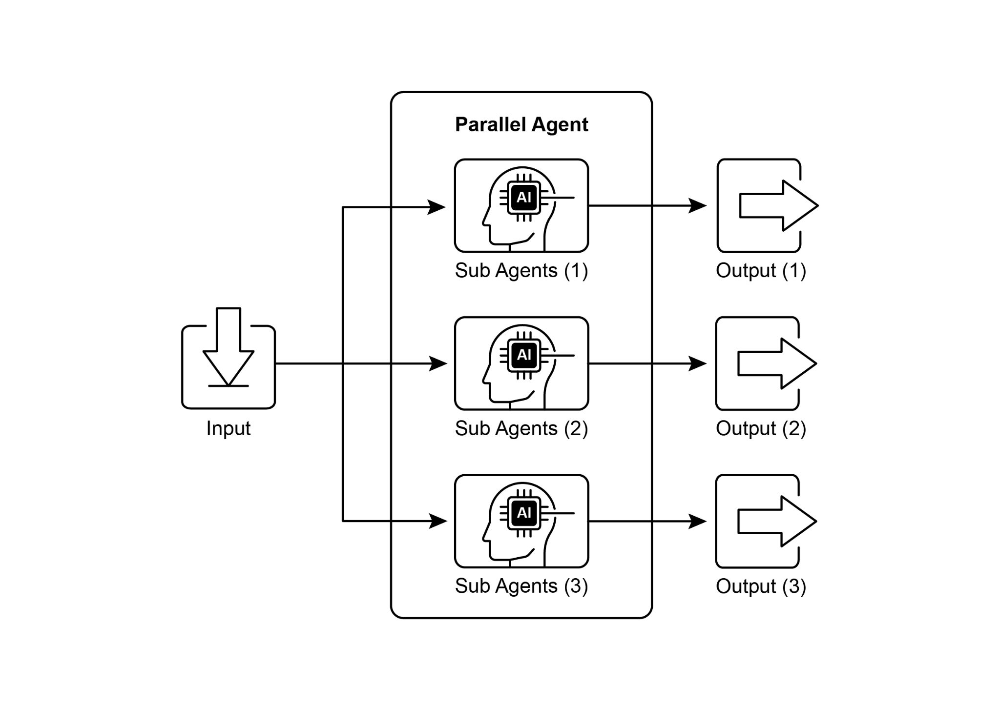
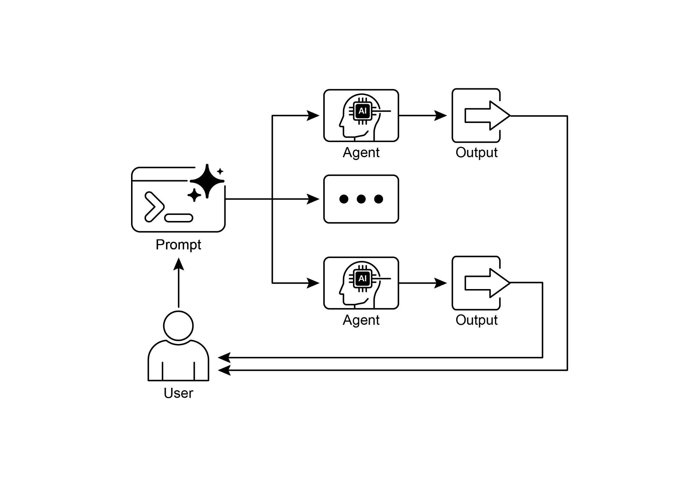

# 第 3 章:平行化(Parallelization)

## 平行化模式總覽

在前面的章節中,我們探討了用於循序工作流程的提示鏈(Prompt Chaining),以及用於動態決策與在不同路徑之間切換的路由(Routing)。這些模式固然不可或缺,然而許多複雜的代理(agentic)任務,都包含可以同時執行、而非一個接一個依序執行的多個子任務。這正是平行化(Parallelization)模式變得至關重要的時刻。

平行化的做法,是同時(concurrently)執行多個元件,例如 LLM 呼叫、工具使用,甚至是整個子代理(sub-agent)(見圖 1)。與其等待某一步驟完成後才開始下一步,平行執行讓彼此獨立的任務能夠同時進行,對於可以拆解成多個獨立部分的任務而言,能大幅縮短整體執行時間。

設想一個被設計來研究某個主題並摘要其發現的代理。循序的做法可能是:

1. 搜尋來源 A。
2. 摘要來源 A。
3. 搜尋來源 B。
4. 摘要來源 B。
5. 從摘要 A 與摘要 B 綜整出最終答案。

而平行化的做法則可以是:

1. 同時搜尋來源 A 與搜尋來源 B。
2. 一旦兩項搜尋都完成,同時摘要來源 A 與摘要來源 B。
3. 從摘要 A 與摘要 B 綜整出最終答案(這一步通常是循序的,需等待平行步驟完成)。

其核心理念,是找出工作流程中不依賴於其他部分輸出的環節,並將它們平行執行。當需要與具有延遲(latency)的外部服務(例如 API 或資料庫)互動時,這項做法格外有效,因為你可以同時發出多個請求。

實作平行化通常需要支援非同步(asynchronous)執行或多執行緒(multi-threading)/多行程(multi-processing)的框架。現代的代理框架在設計時就考量了非同步操作,讓你能輕鬆定義出可以平行運行的步驟。



*圖 1:使用子代理進行平行化的範例。*

LangChain、LangGraph 與 Google ADK 等框架,都提供了平行執行的機制。在 LangChain 表達式語言(LangChain Expression Language,LCEL)中,你可以透過運算子(例如 `|`,代表循序)組合可執行(runnable)物件,並把鏈或圖建構成具有可同時執行之分支的結構,來達成平行執行。LangGraph 憑藉其圖(graph)結構,讓你能定義出可從單一狀態轉移觸發的多個節點,從而在工作流程中有效啟用平行分支。Google ADK 則提供了穩健、原生的機制,用以促進並管理代理的平行執行,大幅提升了複雜多代理系統的效率與可擴展性。ADK 框架內建的這項能力,讓開發者能設計並實作出讓多個代理同時運作(而非循序運作)的解決方案。

平行化模式對於提升代理系統的效率與回應速度至關重要,尤其是在處理涉及多項獨立查詢、運算或與外部服務互動的任務時。它是最佳化複雜代理工作流程效能的一項關鍵技術。

## 實務應用與使用案例

平行化是一種強大的模式,可在各種應用中最佳化代理的效能:

**1. 資訊蒐集與研究:** 同時從多個來源蒐集資訊是一個經典的使用案例。

- 使用案例:一個用來研究某家公司的代理。
  - 平行任務:同時搜尋新聞文章、拉取股價資料、檢查社群媒體上的提及,並查詢公司資料庫。
  - 效益:相較於循序查詢,能更快地蒐集到全面的視野。

**2. 資料處理與分析:** 同時套用不同的分析技術,或同時處理不同的資料區段。

- 使用案例:一個用來分析顧客回饋的代理。
  - 平行任務:針對一批回饋條目,同時執行情緒分析、擷取關鍵字、將回饋分類,並找出緊急問題。
  - 效益:迅速提供多面向的分析。

**3. 多 API 或工具互動:** 呼叫多個獨立的 API 或工具,以蒐集不同類型的資訊或執行不同的動作。

- 使用案例:一個旅遊規劃代理。
  - 平行任務:同時查詢機票價格、搜尋飯店空房、查找當地活動,並尋找餐廳推薦。
  - 效益:更快地呈現一份完整的旅遊計畫。

**4. 具多個元件的內容生成:** 平行生成一份複雜內容的不同部分。

- 使用案例:一個用來撰寫行銷電子郵件的代理。
  - 平行任務:同時生成主旨列、草擬郵件內文、尋找相關圖片,並撰寫行動呼籲(call-to-action)按鈕的文字。
  - 效益:更有效率地組裝出最終的郵件。

**5. 驗證與查核:** 同時執行多項獨立的檢查或驗證。

- 使用案例:一個用來驗證使用者輸入的代理。
  - 平行任務:同時檢查電子郵件格式、驗證電話號碼、比對資料庫核對地址,並檢查是否含有不雅字眼。
  - 效益:對輸入的有效性提供更快速的回饋。

**6. 多模態處理:** 同時處理同一份輸入的不同模態(modality)(文字、影像、音訊)。

- 使用案例:一個用來分析含有文字與影像之社群媒體貼文的代理。
  - 平行任務:同時針對文字分析情緒與關鍵字,並針對影像分析物件與場景描述。
  - 效益:更快地整合來自不同模態的洞見。

**7. A/B 測試或多選項生成:** 平行生成回應或輸出的多個變體,以從中挑選最佳者。

- 使用案例:一個用來生成不同創意文案選項的代理。
  - 平行任務:同時使用略有差異的提示或模型,為一篇文章生成三個不同的標題。
  - 效益:讓你能快速比較並選出最佳選項。

平行化是代理設計中一項基礎的最佳化技術,讓開發者能藉由對獨立任務運用同時執行,建構出效能更高、回應更靈敏的應用程式。

## 動手實作範例(LangChain)

在 LangChain 框架中,平行執行是透過 LangChain 表達式語言(LCEL)來達成的。其主要做法是把多個可執行元件組織在一個字典(dictionary)或清單(list)結構中。當這個集合被當作輸入傳遞給鏈中後續的元件時,LCEL 執行階段(runtime)便會同時執行其中所包含的可執行物件。

在 LangGraph 的脈絡中,這個原則被套用於圖的拓樸(topology)。平行工作流程的定義方式,是把圖架構成讓多個彼此沒有直接循序依賴關係的節點,能夠從單一共同節點被觸發。這些平行路徑會各自獨立執行,直到它們的結果在圖中後續的匯流點(convergence point)被彙整為止。

以下的實作示範了一個以 LangChain 框架建構的平行處理工作流程。這個工作流程被設計成回應單一使用者查詢時,同時執行兩項彼此獨立的操作。這些平行行程被實例化為各自獨立的鏈或函式,而它們各自的輸出隨後會被彙整成一個統一的結果。

此實作的先決條件包括安裝必要的 Python 套件,例如 `langchain`、`langchain-community`,以及一個模型供應商函式庫(例如 `langchain-openai`)。此外,所選語言模型的有效 API 金鑰必須設定在本機環境中以供驗證之用。

```python
import os
import asyncio
from typing import Optional
from langchain_openai import ChatOpenAI
from langchain_core.prompts import ChatPromptTemplate
from langchain_core.output_parsers import StrOutputParser
from langchain_core.runnables import Runnable, RunnableParallel, RunnablePassthrough

# --- 設定 ---
# 請確認你的 API 金鑰環境變數已設定(例如 OPENAI_API_KEY)
try:
    llm: Optional[ChatOpenAI] = ChatOpenAI(model="gpt-4o-mini", temperature=0.7)
except Exception as e:
    print(f"Error initializing language model: {e}")
    llm = None

# --- 定義彼此獨立的鏈 ---
# 這三條鏈代表可以平行執行的不同任務。
summarize_chain: Runnable = (
    ChatPromptTemplate.from_messages([
        # 提示詞中譯:請精簡地摘要以下主題:
        ("system", "Summarize the following topic concisely:"),
        ("user", "{topic}")
    ])
    | llm
    | StrOutputParser()
)

questions_chain: Runnable = (
    ChatPromptTemplate.from_messages([
        # 提示詞中譯:請針對以下主題生成三個有趣的問題:
        ("system", "Generate three interesting questions about the following topic:"),
        ("user", "{topic}")
    ])
    | llm
    | StrOutputParser()
)

terms_chain: Runnable = (
    ChatPromptTemplate.from_messages([
        # 提示詞中譯:請從以下主題中辨識出 5 到 10 個關鍵詞,並以逗號分隔:
        ("system", "Identify 5-10 key terms from the following topic, separated by commas:"),
        ("user", "{topic}")
    ])
    | llm
    | StrOutputParser()
)

# --- 建構「平行 + 綜整」鏈 ---
# 1. 定義要平行執行的任務區塊。這些任務的結果,
#    連同原始 topic,會一起被餵入下一步。
map_chain = RunnableParallel(
    {
        "summary": summarize_chain,
        "questions": questions_chain,
        "key_terms": terms_chain,
        "topic": RunnablePassthrough(),  # 把原始 topic 直接傳遞下去
    }
)

# 2. 定義最終的綜整提示,用來組合平行的各項結果。
# 提示詞中譯(system):
# 根據以下資訊:
# 摘要:{summary}
# 相關問題:{questions}
# 關鍵詞:{key_terms}
# 綜整出一個全面的答案。
# 提示詞中譯(user):原始主題:{topic}
synthesis_prompt = ChatPromptTemplate.from_messages([
    ("system", """Based on the following information:
Summary: {summary}
Related Questions: {questions}
Key Terms: {key_terms}
Synthesize a comprehensive answer."""),
    ("user", "Original topic: {topic}")
])

# 3. 把平行結果直接導入綜整提示,接著串上 LLM 與輸出解析器,
#    建構出完整的鏈。
full_parallel_chain = map_chain | synthesis_prompt | llm | StrOutputParser()

# --- 執行鏈 ---
async def run_parallel_example(topic: str) -> None:
    """
    以特定主題非同步地呼叫平行處理鏈,並印出綜整後的結果。

    Args:
        topic: 要交由 LangChain 鏈處理的輸入主題。
    """
    if not llm:
        print("LLM not initialized. Cannot run example.")
        return

    print(f"\n--- Running Parallel LangChain Example for Topic: '{topic}' ---")
    try:
        # `ainvoke` 的輸入是單一的 'topic' 字串,
        # 隨後會被傳遞給 `map_chain` 中的每一個可執行物件。
        response = await full_parallel_chain.ainvoke(topic)
        print("\n--- Final Response ---")
        print(response)
    except Exception as e:
        print(f"\nAn error occurred during chain execution: {e}")

if __name__ == "__main__":
    test_topic = "The history of space exploration"
    # 在 Python 3.7+ 中,asyncio.run 是執行非同步函式的標準做法。
    asyncio.run(run_parallel_example(test_topic))
```

上述提供的 Python 程式碼實作了一個 LangChain 應用程式,其設計目的是藉由運用平行執行,有效率地處理某個給定的主題。請注意,asyncio 提供的是並行(concurrency),而非平行(parallelism)。它在單一執行緒上,透過一個事件迴圈(event loop)達成這一點——當某個任務閒置時(例如等待網路請求),事件迴圈會聰明地切換到其他任務。這營造出多個任務同時推進的效果,但程式碼本身仍然只由單一執行緒執行,受限於 Python 的全域直譯器鎖(Global Interpreter Lock,GIL)。

這段程式碼一開始先從 `langchain_openai` 與 `langchain_core` 匯入必要的模組,包括語言模型、提示、輸出解析,以及可執行結構等元件。程式碼接著嘗試初始化一個 `ChatOpenAI` 實例,具體使用「gpt-4o-mini」模型,並指定一個用以控制創意程度的 temperature。初始化語言模型時使用了 try-except 區塊以增加穩健性。接著定義了三條彼此獨立的 LangChain「鏈」,每一條都被設計來對輸入主題執行一項不同的任務。第一條鏈用來精簡地摘要主題,使用一則系統訊息與一則包含主題佔位符的使用者訊息。第二條鏈被設定來生成三個與主題相關的有趣問題。第三條鏈則被設定來從輸入主題中辨識出 5 到 10 個關鍵詞,並要求以逗號分隔。這些獨立的鏈,每一條都由一個針對其特定任務量身打造的 `ChatPromptTemplate`,接續已初始化的語言模型,再接上一個將輸出格式化為字串的 `StrOutputParser` 所組成。

接著建構一個 `RunnableParallel` 區塊,把這三條鏈綑綁在一起,讓它們得以同時執行。這個平行的可執行物件也納入了一個 `RunnablePassthrough`,以確保原始的輸入主題在後續步驟中仍可取用。另外定義了一個獨立的 `ChatPromptTemplate` 作為最終的綜整步驟,它以摘要、問題、關鍵詞與原始主題作為輸入,生成一個全面的答案。名為 `full_parallel_chain` 的端到端完整處理鏈,是透過把 `map_chain`(平行區塊)依序接入綜整提示,再接上語言模型與輸出解析器而建立的。範例提供了一個非同步函式 `run_parallel_example`,用以示範如何呼叫這條 `full_parallel_chain`。這個函式以主題作為輸入,並使用 invoke 來執行這條非同步鏈。最後,標準的 Python `if __name__ == "__main__":` 區塊展示了如何以一個範例主題(本例為「The history of space exploration」)執行 `run_parallel_example`,並使用 `asyncio.run` 來管理非同步的執行。

本質上,這段程式碼建立了一個工作流程:針對某個給定的主題,讓多個 LLM 呼叫(摘要、問題與關鍵詞)同時發生,接著再由最後一次 LLM 呼叫把它們的結果組合起來。這展現了使用 LangChain 在代理工作流程中進行平行化的核心理念。

## 動手實作範例(Google ADK)

好,現在讓我們把注意力轉向一個具體範例,以說明這些概念在 Google ADK 框架中的運用。我們將檢視如何運用 ADK 的基本元件(primitive),例如 `ParallelAgent` 與 `SequentialAgent`,來建構一個善用同時執行以提升效率的代理流程。

```python
from google.adk.agents import LlmAgent, ParallelAgent, SequentialAgent
from google.adk.tools import google_search

GEMINI_MODEL="gemini-2.0-flash"

# --- 1. 定義研究員子代理(將平行執行)---

# 研究員 1:再生能源
researcher_agent_1 = LlmAgent(
    name="RenewableEnergyResearcher",
    model=GEMINI_MODEL,
    # 提示詞中譯(instruction):
    # 你是一位專精於能源領域的 AI 研究助理。
    # 請研究「再生能源來源」的最新進展。
    # 請使用所提供的 Google 搜尋工具。
    # 請精簡地(1 到 2 句)摘要你的關鍵發現。
    # 只輸出摘要本身。
    instruction="""You are an AI Research Assistant specializing in energy.
Research the latest advancements in 'renewable energy sources'.
Use the Google Search tool provided.
Summarize your key findings concisely (1-2 sentences).
Output *only* the summary.
""",
    # 提示詞中譯(description):研究再生能源來源。
    description="Researches renewable energy sources.",
    tools=[google_search],
    # 把結果存入 state,供 merger 代理使用
    output_key="renewable_energy_result"
)

# 研究員 2:電動車
researcher_agent_2 = LlmAgent(
    name="EVResearcher",
    model=GEMINI_MODEL,
    # 提示詞中譯(instruction):
    # 你是一位專精於交通運輸領域的 AI 研究助理。
    # 請研究「電動車技術」的最新發展。
    # 請使用所提供的 Google 搜尋工具。
    # 請精簡地(1 到 2 句)摘要你的關鍵發現。
    # 只輸出摘要本身。
    instruction="""You are an AI Research Assistant specializing in transportation.
Research the latest developments in 'electric vehicle technology'.
Use the Google Search tool provided.
Summarize your key findings concisely (1-2 sentences).
Output *only* the summary.
""",
    # 提示詞中譯(description):研究電動車技術。
    description="Researches electric vehicle technology.",
    tools=[google_search],
    # 把結果存入 state,供 merger 代理使用
    output_key="ev_technology_result"
)

# 研究員 3:碳捕捉
researcher_agent_3 = LlmAgent(
    name="CarbonCaptureResearcher",
    model=GEMINI_MODEL,
    # 提示詞中譯(instruction):
    # 你是一位專精於氣候解決方案的 AI 研究助理。
    # 請研究「碳捕捉方法」的現況。
    # 請使用所提供的 Google 搜尋工具。
    # 請精簡地(1 到 2 句)摘要你的關鍵發現。
    # 只輸出摘要本身。
    instruction="""You are an AI Research Assistant specializing in climate solutions.
Research the current state of 'carbon capture methods'.
Use the Google Search tool provided.
Summarize your key findings concisely (1-2 sentences).
Output *only* the summary.
""",
    # 提示詞中譯(description):研究碳捕捉方法。
    description="Researches carbon capture methods.",
    tools=[google_search],
    # 把結果存入 state,供 merger 代理使用
    output_key="carbon_capture_result"
)

# --- 2. 建立 ParallelAgent(讓研究員們同時執行)---
# 這個代理負責協調研究員們的同時執行。
# 一旦所有研究員都完成並把結果存入 state,它便結束。
parallel_research_agent = ParallelAgent(
    name="ParallelWebResearchAgent",
    sub_agents=[researcher_agent_1, researcher_agent_2, researcher_agent_3],
    # 提示詞中譯(description):平行執行多個研究代理以蒐集資訊。
    description="Runs multiple research agents in parallel to gather information."
)

# --- 3. 定義 Merger 代理(在平行代理之*後*執行)---
# 這個代理接收平行代理存入 session state 的結果,
# 並把它們綜整成一份單一、結構化、附帶出處的回應。
merger_agent = LlmAgent(
    name="SynthesisAgent",
    model=GEMINI_MODEL,  # 若綜整需要,也可改用更強大的模型
    # 提示詞中譯(instruction):
    # 你是一位負責將研究發現組合成結構化報告的 AI 助理。
    #
    # 你的主要任務是綜整以下這些研究摘要,並清楚地將各項發現歸屬到其來源領域。
    # 請為每個主題使用標題來組織你的回應。確保報告連貫,並順暢地整合各項重點。
    #
    # 至關重要:你的整份回應「必須」「僅」以下方「輸入摘要」中所提供的資訊為依據。
    # 請勿加入任何未出現在這些特定摘要中的外部知識、事實或細節。
    #
    # 輸入摘要:
    #
    # *   再生能源:
    #     {renewable_energy_result}
    #
    # *   電動車:
    #     {ev_technology_result}
    #
    # *   碳捕捉:
    #     {carbon_capture_result}
    #
    # 輸出格式:
    #
    # ## 近期永續科技進展摘要
    #
    # ### 再生能源發現
    # (依據 RenewableEnergyResearcher 的發現)
    # [僅就上方提供的再生能源輸入摘要進行綜整與闡述。]
    #
    # ### 電動車發現
    # (依據 EVResearcher 的發現)
    # [僅就上方提供的電動車輸入摘要進行綜整與闡述。]
    #
    # ### 碳捕捉發現
    # (依據 CarbonCaptureResearcher 的發現)
    # [僅就上方提供的碳捕捉輸入摘要進行綜整與闡述。]
    #
    # ### 整體結論
    # [提供一段簡短(1 到 2 句)的結語,僅連結上方所呈現的各項發現。]
    #
    # 只輸出依循此格式的結構化報告。請勿在此結構之外加入引言或結語性的語句,
    # 並嚴格遵守僅使用所提供之輸入摘要內容的規定。
    instruction="""You are an AI Assistant responsible for combining research findings into a structured report.

Your primary task is to synthesize the following research summaries, clearly attributing findings to their source areas. Structure your response using headings for each topic. Ensure the report is coherent and integrates the key points smoothly.

**Crucially: Your entire response MUST be grounded *exclusively* on the information provided in the 'Input Summaries' below. Do NOT add any external knowledge, facts, or details not present in these specific summaries.**

**Input Summaries:**

*   **Renewable Energy:**
    {renewable_energy_result}

*   **Electric Vehicles:**
    {ev_technology_result}

*   **Carbon Capture:**
    {carbon_capture_result}

**Output Format:**

## Summary of Recent Sustainable Technology Advancements

### Renewable Energy Findings
(Based on RenewableEnergyResearcher's findings)
[Synthesize and elaborate *only* on the renewable energy input summary provided above.]

### Electric Vehicle Findings
(Based on EVResearcher's findings)
[Synthesize and elaborate *only* on the EV input summary provided above.]

### Carbon Capture Findings
(Based on CarbonCaptureResearcher's findings)
[Synthesize and elaborate *only* on the carbon capture input summary provided above.]

### Overall Conclusion
[Provide a brief (1-2 sentence) concluding statement that connects *only* the findings presented above.]

Output *only* the structured report following this format. Do not include introductory or concluding phrases outside this structure, and strictly adhere to using only the provided input summary content.
""",
    # 提示詞中譯(description):將平行代理的研究發現組合成一份結構化、附帶出處的報告,並嚴格以所提供的輸入為依據。
    description="Combines research findings from parallel agents into a structured, cited report, strictly grounded on provided inputs.",
    # 合併不需要工具
    # 此處不需要 output_key,因為它的直接回應就是整個序列的最終輸出
)

# --- 4. 建立 SequentialAgent(協調整體流程)---
# 這是將被執行的主代理。它會先執行 ParallelAgent
# 以填充 state,接著執行 MergerAgent 以產出最終輸出。
sequential_pipeline_agent = SequentialAgent(
    name="ResearchAndSynthesisPipeline",
    # 先進行平行研究,然後合併
    sub_agents=[parallel_research_agent, merger_agent],
    # 提示詞中譯(description):協調平行研究並綜整其結果。
    description="Coordinates parallel research and synthesizes the results."
)

root_agent = sequential_pipeline_agent
```

這段程式碼定義了一個多代理系統,用來研究並綜整有關永續科技進展的資訊。它設置了三個 `LlmAgent` 實例,扮演各有專長的研究員。`ResearcherAgent_1` 專注於再生能源,`ResearcherAgent_2` 研究電動車技術,而 `ResearcherAgent_3` 則調查碳捕捉方法。每個研究員代理都被設定為使用 `GEMINI_MODEL` 與 `google_search` 工具。它們被指示要精簡地(1 到 2 句)摘要其發現,並使用 `output_key` 把這些摘要存入 session state。

接著建立了一個名為 `ParallelWebResearchAgent` 的 `ParallelAgent`,以同時執行這三個研究員代理。這讓研究得以平行進行,有望節省時間。一旦其所有子代理(研究員們)都完成並填充了 state,這個 `ParallelAgent` 便結束執行。

接下來,定義了一個 `MergerAgent`(同樣是 `LlmAgent`)來綜整研究結果。這個代理把平行研究員存入 session state 的摘要作為輸入。它的指令強調輸出必須嚴格僅以所提供的輸入摘要為依據,禁止加入外部知識。`MergerAgent` 被設計來把組合後的發現,結構化成一份每個主題各有標題、並附帶一段簡短整體結論的報告。

最後,建立了一個名為 `ResearchAndSynthesisPipeline` 的 `SequentialAgent`,以協調整個工作流程。作為主要的控制者,這個主代理會先執行 `ParallelAgent` 來進行研究。一旦 `ParallelAgent` 完成,`SequentialAgent` 接著便執行 `MergerAgent` 來綜整所蒐集到的資訊。`sequential_pipeline_agent` 被設定為 `root_agent`,代表執行這個多代理系統的進入點。整個流程的設計,旨在有效率地平行從多個來源蒐集資訊,接著再把它們組合成一份單一、結構化的報告。

## 重點速覽

**是什麼(What):** 許多代理工作流程都包含多個必須完成才能達成最終目標的子任務。純粹循序的執行方式——每項任務都得等待前一項完成——往往效率低落且緩慢。當任務依賴於外部 I/O 操作(例如呼叫不同的 API 或查詢多個資料庫)時,這種延遲會成為顯著的瓶頸。在缺乏同時執行機制的情況下,總處理時間就等於所有個別任務耗時的總和,妨礙了系統整體的效能與回應速度。

**為什麼(Why):** 平行化模式提供了一套標準化的解法,讓彼此獨立的任務得以同時執行。它的運作方式是找出工作流程中不依賴於彼此即時輸出的元件,例如工具使用或 LLM 呼叫。LangChain 與 Google ADK 等代理框架,提供了內建的結構來定義並管理這些同時進行的操作。舉例來說,一個主行程可以觸發數個平行執行的子任務,並等待它們全部完成後才進入下一步。藉由讓這些獨立任務同時執行(而非一個接一個),此模式大幅縮短了總執行時間。

**經驗法則(Rule of thumb):** 當一個工作流程包含多個可以同時執行的獨立操作時,就使用此模式,例如:從數個 API 擷取資料、處理不同的資料區塊,或生成多份內容以供後續綜整。

## 視覺摘要



*圖 2:平行化設計模式。*

## 重點整理

以下是一些重點:

- 平行化是一種同時執行獨立任務以提升效率的模式。
- 當任務涉及等待外部資源(例如 API 呼叫)時,它格外有用。
- 採用並行或平行的架構,會引入可觀的複雜度與成本,影響設計、除錯與系統日誌記錄等關鍵的開發階段。
- LangChain 與 Google ADK 等框架,提供了用以定義並管理平行執行的內建支援。
- 在 LangChain 表達式語言(LCEL)中,`RunnableParallel` 是用來讓多個可執行物件並排運行的一項關鍵結構。
- Google ADK 可以透過「LLM 驅動的委派(LLM-Driven Delegation)」促成平行執行,亦即由一個協調者(Coordinator)代理的 LLM 找出獨立的子任務,並觸發各有專長的子代理同時加以處理。
- 平行化有助於降低整體延遲,讓代理系統在面對複雜任務時更具回應力。

## 結論

平行化模式是一種最佳化運算工作流程的方法,做法是同時執行彼此獨立的子任務。這個做法降低了整體延遲,在涉及多次模型推論或呼叫外部服務的複雜操作中尤其明顯。

不同框架提供了實作此模式的不同機制。在 LangChain 中,`RunnableParallel` 之類的結構被用來明確地定義並同時執行多條處理鏈。相對地,Google Agent Developer Kit(ADK)這類框架,則可透過多代理委派(multi-agent delegation)達成平行化——由一個主要的協調者模型把不同的子任務指派給各有專長、能夠同時運作的代理。

藉由把平行處理與循序(鏈式)及條件(路由)控制流程整合在一起,我們便有可能建構出精密、高效能的運算系統,有能力高效地處理多樣而複雜的任務。

## 參考資料

以下是一些可供延伸閱讀的資源,涵蓋平行化模式及相關概念:

1. LangChain Expression Language(LCEL)Documentation(Parallelism):
   <https://python.langchain.com/docs/concepts/lcel/>
2. Google Agent Developer Kit(ADK)Documentation(Multi-Agent Systems):
   <https://google.github.io/adk-docs/agents/multi-agents/>
3. Python asyncio Documentation: <https://docs.python.org/3/library/asyncio.html>
