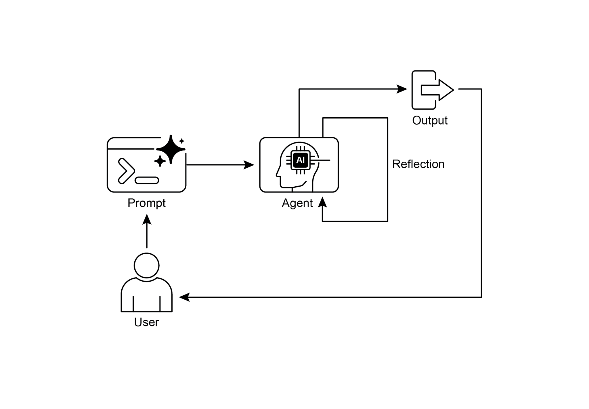
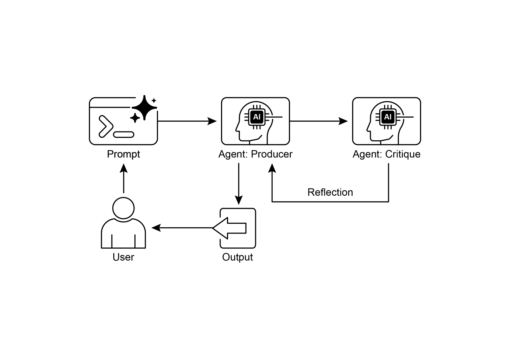

# 第 4 章:反思(Reflection)

## 反思模式總覽

在前面幾章中,我們探討了幾個基礎的代理(agentic)模式:用於循序執行的鏈接(Chaining)、用於動態路徑選擇的路由(Routing),以及用於平行任務執行的平行化(Parallelization)。這些模式讓代理能夠更有效率、更靈活地執行複雜任務。然而,即便擁有精密的工作流程,代理最初的輸出或計畫也未必是最佳、最準確或最完整的。這正是反思(Reflection)模式登場之處。

反思模式的核心,是讓代理評估自身的工作、輸出或內部狀態,並運用該評估結果來提升表現或精煉回應。它是一種自我修正(self-correction)或自我改進(self-improvement)的形式,讓代理能夠根據回饋、內部批判,或與期望標準的比較,反覆地精煉其輸出或調整其做法。有時,反思也可以由另一個專責分析初始代理輸出的獨立代理來促成。

不同於單純的循序鏈接(輸出直接傳遞給下一個步驟)或路由(選擇一條路徑),反思引入了一個回饋迴路(feedback loop)。代理不只是產生一個輸出;它接著會檢視那個輸出(或產生該輸出的過程),找出潛在的問題或可改進之處,再運用這些洞見來產生更好的版本,或修正其後續的行動。

這個過程通常包含:

1. **執行(Execution):** 代理執行一項任務或產生初始輸出。
2. **評估/批判(Evaluation/Critique):** 代理(通常是透過另一次 LLM 呼叫或一組規則)分析前一步的結果。這個評估可能會檢查事實準確性、連貫性、風格、完整度、是否遵循指令,或其他相關標準。
3. **反思/精煉(Reflection/Refinement):** 根據批判結果,代理判定該如何改進。這可能涉及產生一個精煉後的輸出、調整後續步驟的參數,甚至修改整體計畫。
4. **迭代(Iteration,選用但常見):** 精煉後的輸出或調整後的做法,接著可以再次執行,反思過程也可以重複進行,直到取得令人滿意的結果,或達到某個停止條件為止。

反思模式有一種關鍵且極為有效的實作方式,是把整個過程拆分成兩個截然不同的邏輯角色:生產者(Producer)與批判者(Critic)。這通常被稱為「生成者—批判者(Generator-Critic)」或「生產者—審閱者(Producer-Reviewer)」模型。雖然單一代理也能進行自我反思,但運用兩個專門的代理(或兩次帶有不同系統提示的獨立 LLM 呼叫)往往能產生更穩健、更不帶偏誤的結果。

1. **生產者代理(Producer Agent):** 這個代理的主要職責是執行任務的初始實作。它完全專注於生成內容,無論是撰寫程式碼、草擬一篇部落格文章,或是制定一份計畫。它接收初始提示,並產生第一版的輸出。
2. **批判者代理(Critic Agent):** 這個代理唯一的目的,是評估由生產者所產生的輸出。它被賦予一組不同的指令,通常還搭配一個獨特的角色設定(例如「你是一位資深軟體工程師」「你是一位一絲不苟的事實查核員」)。批判者的指令會引導它依據特定標準來分析生產者的工作,例如事實準確性、程式碼品質、風格要求或完整度。它的設計宗旨,就是找出瑕疵、提出改進建議,並提供結構化的回饋。

這種關注點分離(separation of concerns)之所以強大,是因為它避免了代理審閱自身工作時的「認知偏誤(cognitive bias)」。批判者代理以全新的視角看待輸出,完全專注於找出錯誤與可改進之處。批判者的回饋接著被傳回給生產者代理,後者把它當作指引,生成一個全新、精煉後的輸出版本。本章提供的 LangChain 與 ADK 程式碼範例都實作了這種雙代理模型:LangChain 範例使用一個特定的「reflector_prompt」來建立批判者角色,而 ADK 範例則明確地定義了一個生產者代理與一個審閱者代理。

實作反思時,往往需要把代理的工作流程架構成包含這些回饋迴路。這可以透過程式碼中的迭代迴圈來達成,或運用支援狀態管理(state management)與依評估結果進行條件轉移(conditional transition)的框架來實現。雖然單一步驟的評估與精煉可以在 LangChain/LangGraph、ADK 或 Crew.AI 的鏈中實作,但真正的迭代式反思通常涉及更複雜的編排(orchestration)。

反思模式對於建構能產出高品質輸出、處理細膩任務,並展現一定程度自我覺察(self-awareness)與適應力的代理至關重要。它讓代理超越單純執行指令的層次,邁向一種更精密的問題解決與內容生成形式。

反思與目標設定及監控(見第 11 章)的交集值得注意。目標為代理的自我評估提供了最終的衡量基準,而監控則追蹤其進展。在許多實務情境中,反思接著可以扮演修正引擎的角色,利用被監控到的回饋來分析偏差並調整其策略。這種協同效應,把代理從一個被動的執行者,轉化為一個會自適應地努力達成目標的目的性系統。

此外,當 LLM 保有對話的記憶(見第 8 章)時,反思模式的成效會顯著提升。這份對話歷史為評估階段提供了關鍵的情境,讓代理不只是在孤立狀態下評估其輸出,而能在先前互動、使用者回饋與不斷演進之目標的背景下進行評估。它讓代理能從過往的批判中學習,避免重蹈覆轍。沒有記憶,每一次反思都是一個自成一體的事件;有了記憶,反思便成為一個累積性的過程,每一個循環都奠基於前一個之上,帶來更有智慧、更具情境感知的精煉。

## 實務應用與使用案例

在輸出品質、準確性,或是否遵循複雜限制至關重要的情境中,反思模式極具價值:

**1. 創意寫作與內容生成:**
精煉所生成的文字、故事、詩作或行銷文案。

- **使用案例:** 一個撰寫部落格文章的代理。
  - **反思:** 生成一份初稿,針對其流暢度、語氣與清晰度進行批判,接著根據批判結果重寫。重複進行,直到文章達到品質標準。
  - **效益:** 產出更精煉、更有效果的內容。

**2. 程式碼生成與除錯:**
撰寫程式碼、找出錯誤,並加以修正。

- **使用案例:** 一個撰寫 Python 函式的代理。
  - **反思:** 撰寫初版程式碼,執行測試或靜態分析,找出錯誤或低效之處,接著根據發現修改程式碼。
  - **效益:** 生成更穩健、更具功能性的程式碼。

**3. 複雜問題解決:**
在多步推理任務中,評估中間步驟或所提出的解法。

- **使用案例:** 一個解邏輯謎題的代理。
  - **反思:** 提出一個步驟,評估它是否更接近解答或引入了矛盾,必要時回溯或選擇另一個步驟。
  - **效益:** 提升代理在複雜問題空間中探索的能力。

**4. 摘要與資訊綜整:**
就準確性、完整度與簡潔性精煉摘要。

- **使用案例:** 一個摘要長篇文件的代理。
  - **反思:** 生成一份初步摘要,將其與原始文件中的關鍵重點比對,精煉摘要以納入缺漏的資訊或提升準確性。
  - **效益:** 產出更準確、更全面的摘要。

**5. 規劃與策略:**
評估一份所提出的計畫,並找出潛在的瑕疵或改進之處。

- **使用案例:** 一個為達成目標而規劃一系列行動的代理。
  - **反思:** 生成一份計畫,模擬其執行或依限制條件評估其可行性,根據評估結果修訂計畫。
  - **效益:** 發展出更有效、更切合實際的計畫。

**6. 對話式代理:**
審閱對話中先前的輪次,以維持情境、修正誤解,或提升回應品質。

- **使用案例:** 一個客戶支援聊天機器人。
  - **反思:** 在使用者回應之後,審閱對話歷史與最近一則生成的訊息,確保連貫性並準確回應使用者最新的輸入。
  - **效益:** 帶來更自然、更有效的對話。

反思為代理系統增添了一層後設認知(meta-cognition),讓它們能從自身的輸出與過程中學習,進而帶來更有智慧、更可靠、更高品質的結果。

## 動手實作範例(LangChain)

要實作一個完整、迭代式的反思過程,必須具備狀態管理與循環執行的機制。雖然這些在像 LangGraph 這類以圖為基礎的框架中是原生支援,或可透過自訂的程序性程式碼來處理,但單一反思循環的基本原理,可以運用 LCEL(LangChain 表達式語言,LangChain Expression Language)的組合式語法有效地示範出來。

這個範例使用 LangChain 函式庫與 OpenAI 的 GPT-4o 模型,實作了一個反思迴圈,以迭代方式生成並精煉一個計算數字階乘(factorial)的 Python 函式。整個過程從一個任務提示開始,生成初始程式碼,接著根據一個模擬的資深軟體工程師角色所提出的批判,反覆地對程式碼進行反思,並在每一次迭代中精煉程式碼,直到批判階段判定程式碼已臻完美,或達到最大迭代次數為止。最後,它會印出精煉後的程式碼結果。

首先,請確認你已安裝所需的函式庫:

```bash
pip install langchain langchain-community langchain-openai
```

你還需要為所選的語言模型(例如 OpenAI、Google Gemini 或 Anthropic)設定好環境中的 API 金鑰。

```python
import os
from dotenv import load_dotenv
from langchain_openai import ChatOpenAI
from langchain_core.prompts import ChatPromptTemplate
from langchain_core.messages import SystemMessage, HumanMessage

# --- 設定 ---
# 從 .env 檔案載入環境變數(用於 OPENAI_API_KEY)
load_dotenv()

# 檢查 API 金鑰是否已設定
if not os.getenv("OPENAI_API_KEY"):
    raise ValueError("OPENAI_API_KEY not found in .env file. Please add it.")

# 初始化 Chat LLM。我們使用 gpt-4o 以獲得更好的推理能力。
# 採用較低的 temperature 以取得更具確定性的輸出。
llm = ChatOpenAI(model="gpt-4o", temperature=0.1)


def run_reflection_loop():
    """
    Demonstrates a multi-step AI reflection loop to progressively
    improve a Python function.
    """
    # --- 核心任務 ---
    # 提示詞中譯:
    #   你的任務是建立一個名為 `calculate_factorial` 的 Python 函式。
    #   這個函式應該完成下列事項:
    #   1. 接受單一整數 `n` 作為輸入。
    #   2. 計算它的階乘(n!)。
    #   3. 包含一個清楚的 docstring,說明這個函式的用途。
    #   4. 處理邊界情況:0 的階乘是 1。
    #   5. 處理無效輸入:當輸入為負數時,丟出 ValueError。
    task_prompt = """
    Your task is to create a Python function named `calculate_factorial`.
    This function should do the following:
    1. Accept a single integer `n` as input.
    2. Calculate its factorial (n!).
    3. Include a clear docstring explaining what the function does.
    4. Handle edge cases: The factorial of 0 is 1.
    5. Handle invalid input: Raise a ValueError if the input is a negative number.
    """

    # --- 反思迴圈 ---
    max_iterations = 3
    current_code = ""
    # 我們會建構一份對話歷史,以在每一步中提供情境。
    message_history = [HumanMessage(content=task_prompt)]

    for i in range(max_iterations):
        print("\n" + "="*25 + f" REFLECTION LOOP: ITERATION {i + 1} " + "="*25)

        # --- 1. 生成 / 精煉階段 ---
        # 在第一次迭代中,它進行生成。在後續的迭代中,它進行精煉。
        if i == 0:
            print("\n>>> STAGE 1: GENERATING initial code...")
            # 第一則訊息就只是任務提示。
            response = llm.invoke(message_history)
            current_code = response.content
        else:
            print("\n>>> STAGE 1: REFINING code based on previous critique...")
            # 此時對話歷史已包含任務、上一版程式碼,以及上一次的批判。
            # 我們指示模型套用這些批判。
            # 提示詞中譯:請依據所提供的批判來精煉這段程式碼。
            message_history.append(HumanMessage(content="Please refine the code using the critiques provided."))
            response = llm.invoke(message_history)
            current_code = response.content

        print("\n--- Generated Code (v" + str(i + 1) + ") ---\n" + current_code)
        message_history.append(response)  # 把生成的程式碼加入歷史

        # --- 2. 反思階段 ---
        print("\n>>> STAGE 2: REFLECTING on the generated code...")
        # 為 reflector 代理建立一個特定的提示。
        # 這會要求模型扮演一位資深的程式碼審閱者。
        # 提示詞中譯(系統訊息):
        #   你是一位資深軟體工程師,也是 Python 專家。
        #   你的職責是執行一絲不苟的程式碼審查。
        #   請依據原始任務需求,嚴格評估所提供的 Python 程式碼。
        #   找出錯誤、風格問題、遺漏的邊界情況,以及可改進之處。
        #   如果程式碼完美無瑕且滿足所有需求,就只回覆「CODE_IS_PERFECT」這個短語。
        #   否則,請以條列清單的方式提供你的批判。
        reflector_prompt = [
            SystemMessage(content="""
                You are a senior software engineer and an expert in Python.
                Your role is to perform a meticulous code review.
                Critically evaluate the provided Python code based on the original task requirements.
                Look for bugs, style issues, missing edge cases, and areas for improvement.
                If the code is perfect and meets all requirements, respond with the single phrase 'CODE_IS_PERFECT'.
                Otherwise, provide a bulleted list of your critiques.
            """),
            # 提示詞中譯:原始任務:\n{task_prompt}\n\n待審查的程式碼:\n{current_code}
            HumanMessage(content=f"Original Task:\n{task_prompt}\n\nCode to Review:\n{current_code}")
        ]
        critique_response = llm.invoke(reflector_prompt)
        critique = critique_response.content

        # --- 3. 停止條件 ---
        if "CODE_IS_PERFECT" in critique:
            print("\n--- Critique ---\nNo further critiques found. The code is satisfactory.")
            break

        print("\n--- Critique ---\n" + critique)
        # 把批判加入歷史,供下一次精煉迴圈使用。
        # 提示詞中譯:對上一版程式碼的批判:\n{critique}
        message_history.append(HumanMessage(content=f"Critique of the previous code:\n{critique}"))

    print("\n" + "="*30 + " FINAL RESULT " + "="*30)
    print("\nFinal refined code after the reflection process:\n")
    print(current_code)


if __name__ == "__main__":
    run_reflection_loop()
```

這段程式碼一開始會設定環境、載入 API 金鑰,並初始化一個強大的語言模型(如 GPT-4o),並使用較低的 temperature 以取得聚焦的輸出。核心任務由一個提示定義,要求撰寫一個計算數字階乘的 Python 函式,其中包含對 docstring、邊界情況(0 的階乘)以及負數輸入錯誤處理的特定要求。`run_reflection_loop` 函式負責編排這個迭代精煉的過程。在迴圈內,第一次迭代時,語言模型會根據任務提示生成初始程式碼。在後續的迭代中,它會根據前一步的批判來精煉程式碼。一個獨立的「reflector」角色——同樣由語言模型扮演,但搭配不同的系統提示——會以資深軟體工程師的身分,依據原始任務要求來批判所生成的程式碼。這份批判會以一份條列式的問題清單呈現,若未發現任何問題,則回應「CODE_IS_PERFECT」這個短語。迴圈會持續進行,直到批判結果指出程式碼已臻完美,或達到最大迭代次數為止。對話歷史會被維護下來,並在每一步傳遞給語言模型,以同時為生成/精煉階段與反思階段提供情境。最後,在迴圈結束之後,腳本會印出最後生成的程式碼版本。

## 動手實作範例(ADK)

現在,讓我們來看一個使用 Google ADK 實作的概念性程式碼範例。具體而言,這段程式碼透過採用生成者—批判者(Generator-Critic)結構來展示此模式:其中一個元件(生成者)產生初始的結果或計畫,而另一個元件(批判者)則提供關鍵性的回饋或批判,引導生成者朝向更精煉或更準確的最終輸出。

```python
from google.adk.agents import SequentialAgent, LlmAgent

# 第一個代理負責生成初始草稿。
generator = LlmAgent(
    name="DraftWriter",
    # 提示詞中譯(description):針對給定的主題,生成初始的草稿內容。
    description="Generates initial draft content on a given subject.",
    # 提示詞中譯(instruction):針對使用者的主題,撰寫一段簡短而具資訊性的段落。
    instruction="Write a short, informative paragraph about the user's subject.",
    output_key="draft_text"  # 輸出會被儲存到這個 state key。
)

# 第二個代理負責批判第一個代理產生的草稿。
reviewer = LlmAgent(
    name="FactChecker",
    # 提示詞中譯(description):審查給定的文字是否具備事實準確性,並提供結構化的批判。
    description="Reviews a given text for factual accuracy and provides a structured critique.",
    # 提示詞中譯(instruction):
    #   你是一位一絲不苟的事實查核員。
    #   1. 閱讀 state key 'draft_text' 中所提供的文字。
    #   2. 仔細驗證所有主張的事實準確性。
    #   3. 你的最終輸出必須是一個包含兩個鍵的字典:
    #      - "status":一個字串,其值為 "ACCURATE"(準確)或 "INACCURATE"(不準確)。
    #      - "reasoning":一個字串,為你的 status 提供清楚的解釋;若發現任何問題,請引用具體的問題點。
    instruction="""
    You are a meticulous fact-checker.
    1. Read the text provided in the state key 'draft_text'.
    2. Carefully verify the factual accuracy of all claims.
    3. Your final output must be a dictionary containing two keys:
       - "status": A string, either "ACCURATE" or "INACCURATE".
       - "reasoning": A string providing a clear explanation for your status, citing specific issues if any are found.
    """,
    output_key="review_output"  # 結構化的字典會被儲存在這裡。
)

# SequentialAgent 確保 generator 會在 reviewer 之前執行。
review_pipeline = SequentialAgent(
    name="WriteAndReview_Pipeline",
    sub_agents=[generator, reviewer]
)

# 執行流程:
# 1. generator 執行 -> 把它的段落儲存到 state['draft_text']。
# 2. reviewer 執行 -> 讀取 state['draft_text'],並把它的字典輸出儲存到 state['review_output']。
```

這段程式碼示範了如何在 Google ADK 中運用循序代理管線(sequential agent pipeline)來生成並審閱文字。它定義了兩個 `LlmAgent` 實例:`generator` 與 `reviewer`。`generator` 代理的設計目的,是針對給定的主題建立一段初始的草稿段落。它被指示要撰寫一段簡短而具資訊性的文字,並把輸出儲存到 state key `draft_text`。`reviewer` 代理則扮演由 `generator` 所產生文字的事實查核員。它被指示要從 `draft_text` 讀取文字,並驗證其事實準確性。`reviewer` 的輸出是一個帶有兩個鍵的結構化字典:`status` 與 `reasoning`。`status` 指出該文字是「ACCURATE」或「INACCURATE」,而 `reasoning` 則為該狀態提供解釋。這個字典會被儲存到 state key `review_output`。一個名為 `review_pipeline` 的 `SequentialAgent` 被建立來管理這兩個代理的執行順序,確保 `generator` 先執行,接著才是 `reviewer`。整體的執行流程是:`generator` 產生文字,該文字隨後被儲存到 state 中;接著,`reviewer` 從 state 讀取這段文字,執行其事實查核,再把它的發現(`status` 與 `reasoning`)存回 state。這個管線運用了各自獨立的代理,實現了一套結構化的內容創作與審閱流程。注意:對於有興趣的讀者,另有一個運用 ADK 的 `LoopAgent` 的替代實作可供參考。

在作結之前,有一點很重要必須納入考量:雖然反思模式能顯著提升輸出品質,但它也伴隨著重要的取捨。這個迭代過程雖然強大,卻可能導致更高的成本與延遲(latency),因為每一個精煉迴圈都可能需要一次新的 LLM 呼叫,這使它在對時間敏感的應用中並非最佳選擇。此外,此模式相當耗用記憶體;隨著每一次迭代,對話歷史會不斷膨脹,包含初始輸出、批判,以及後續的各次精煉。

## 重點速覽

**是什麼(What):** 代理最初的輸出往往不是最佳的,可能會有不準確、不完整,或無法滿足複雜要求的問題。基本的代理工作流程缺乏一個內建的機制,讓代理得以辨識並修正自身的錯誤。這個問題的解法,是讓代理評估自身的工作;或者更穩健地,引入一個獨立的邏輯代理來扮演批判者,以避免無論品質如何、初始回應就直接成為最終答案。

**為什麼(Why):** 反思模式藉由引入一套自我修正與精煉的機制,提供了解方。它建立起一個回饋迴路:由一個「生產者」代理生成輸出,接著由一個「批判者」代理(或生產者本身)依據預先定義的標準加以評估。這份批判隨後被用來生成一個改進後的版本。這個「生成、評估、精煉」的迭代過程,逐步提升最終結果的品質,帶來更準確、更連貫、更可靠的成果。

**經驗法則(Rule of thumb):** 當最終輸出的品質、準確性與細節比速度和成本更重要時,就使用反思模式。它對於生成精煉的長篇內容、撰寫與除錯程式碼,以及制定詳盡計畫等任務尤其有效。當任務需要高度客觀性,或需要泛用型生產者代理可能忽略的專業評估時,就採用一個獨立的批判者代理。

## 視覺摘要



*圖 1:反思設計模式——自我反思(self-reflection)。代理接收使用者的提示後產生輸出,並透過反思迴路檢視自身的輸出以進行精煉,最終把結果回傳給使用者。*



*圖 2:反思設計模式——生產者(Producer)與批判者(Critique)代理。生產者代理產生輸出,由批判者代理進行反思與批判,並把回饋傳回生產者以精煉結果。*

## 重點整理

以下是一些重點:

- 反思模式最主要的優勢,在於它能夠迭代地自我修正並精煉輸出,帶來顯著更高的品質、準確性,以及對複雜指令的遵循度。
- 它涉及一個由執行、評估/批判與精煉所構成的回饋迴路。對於需要高品質、準確或細膩輸出的任務,反思至關重要。
- 一種強大的實作方式是生產者—批判者(Producer-Critic)模型,其中由一個獨立的代理(或被提示扮演的角色)來評估初始輸出。這種關注點分離提升了客觀性,並讓更專業、更結構化的回饋成為可能。
- 然而,這些好處的代價是延遲與運算開銷的增加,以及更高的風險——可能超出模型的情境視窗(context window),或被 API 服務限流(throttle)。
- 雖然完整的迭代式反思往往需要具狀態的工作流程(如 LangGraph),但單一的反思步驟可以在 LangChain 中使用 LCEL 來實作,以傳遞輸出供批判與後續精煉之用。
- Google ADK 可以透過循序工作流程來促成反思,讓一個代理的輸出由另一個代理批判,從而允許進行後續的精煉步驟。
- 此模式讓代理能夠執行自我修正,並隨著時間提升其表現。

## 結論

反思模式為代理的工作流程提供了一套關鍵的自我修正機制,讓改進得以超越單次執行,以迭代的方式進行。這是透過建立一個迴圈來達成的:系統生成一個輸出,依據特定標準加以評估,接著運用該評估結果來產生一個精煉後的成果。這項評估可以由代理本身執行(自我反思),或者——往往更有效地——由一個獨立的批判者代理來執行,而這正代表了此模式中一項關鍵的架構選擇。

雖然一個完全自主、多步驟的反思過程需要一套穩健的狀態管理架構,但它的核心原理在單一的「生成—批判—精煉」循環中便能有效地展現。作為一種控制結構,反思可以與其他基礎模式整合,以建構更穩健、功能更複雜的代理系統。

## 參考資料

以下是一些關於反思模式及相關概念的延伸閱讀資源:

1. Training Language Models to Self-Correct via Reinforcement Learning:
   <https://arxiv.org/abs/2409.12917>
2. LangChain Expression Language (LCEL) Documentation:
   <https://python.langchain.com/docs/introduction/>
3. LangGraph Documentation: <https://www.langchain.com/langgraph>
4. Google Agent Developer Kit (ADK) Documentation (Multi-Agent Systems):
   <https://google.github.io/adk-docs/agents/multi-agents/>
