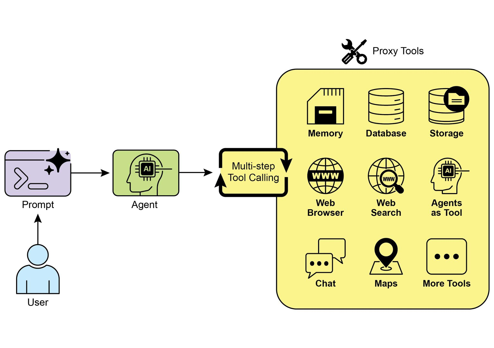
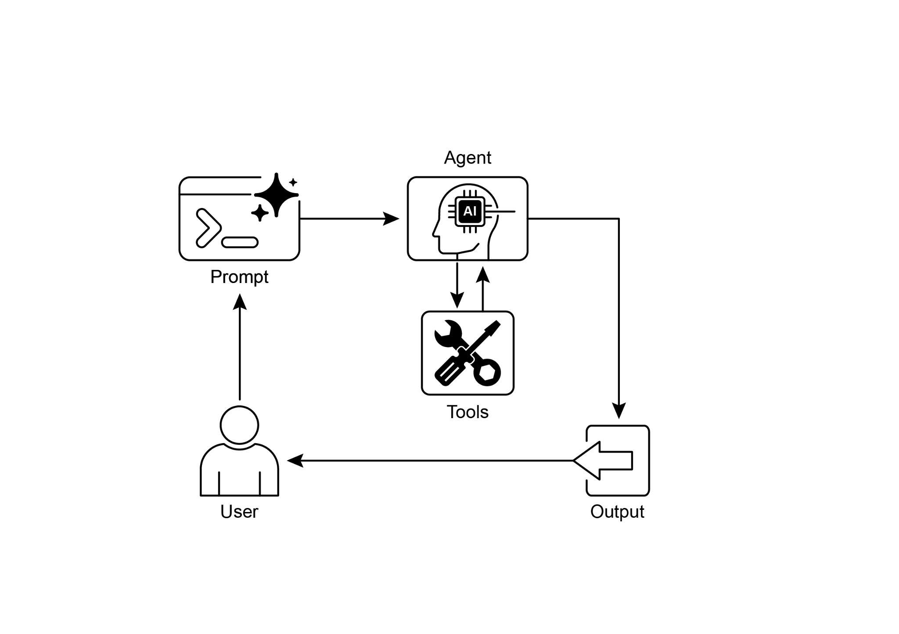

# 第 5 章:工具使用(Tool Use,函式呼叫 Function Calling)

## 工具使用模式總覽

到目前為止,我們所討論的代理模式(agentic pattern)主要都涉及編排語言模型之間的互動,以及管理代理內部工作流程中的資訊流動(包括串接 Chaining、路由 Routing、平行化 Parallelization、反思 Reflection)。然而,要讓代理真正發揮用處、能與真實世界或外部系統互動,它們就必須具備使用工具(Tool)的能力。

工具使用(Tool Use)模式通常透過一種稱為函式呼叫(Function Calling)的機制來實作,它讓代理得以與外部 API、資料庫、服務互動,甚至執行程式碼。它讓位於代理核心的大型語言模型(LLM)能夠根據使用者的請求或任務的當前狀態,自行決定何時、以及如何使用某個特定的外部函式。

這個流程通常包含以下步驟:

1. **工具定義(Tool Definition):** 把外部函式或能力定義出來,並向 LLM 加以描述。這份描述包含函式的用途、名稱、它所接受的參數,以及這些參數的型別與說明。
2. **LLM 決策(LLM Decision):** LLM 接收使用者的請求與可用的工具定義。根據它對請求與工具的理解,LLM 會判斷是否需要呼叫一個或多個工具才能滿足這個請求。
3. **函式呼叫生成(Function Call Generation):** 如果 LLM 決定使用某個工具,它會生成一個結構化的輸出(通常是一個 JSON 物件),指明要呼叫的工具名稱,以及要傳入的引數(參數)——這些引數是從使用者的請求中擷取出來的。
4. **工具執行(Tool Execution):** 代理框架或編排層會攔截這個結構化輸出。它會辨識出被請求的工具,並以提供的引數實際執行那個外部函式。
5. **觀察/結果(Observation/Result):** 工具執行所產生的輸出或結果會被回傳給代理。
6. **LLM 處理(LLM Processing,選用但常見):** LLM 接收工具的輸出作為情境,並用它來擬定給使用者的最終回應,或決定工作流程中的下一步(這可能涉及呼叫另一個工具、進行反思,或是提供最終答案)。

這個模式之所以基礎而重要,是因為它打破了 LLM 訓練資料的侷限,讓它能夠取得最新資訊、執行它內部無法完成的計算、與使用者特定的資料互動,或觸發真實世界中的行動。函式呼叫正是那座技術橋樑,銜接起 LLM 的推理能力與外部各式各樣可用功能之間的鴻溝。

雖然「函式呼叫(function calling)」一詞貼切地描述了去呼叫特定、預先定義的程式碼函式,但思考一個更為寬廣的概念「工具呼叫(tool calling)」也很有意義。這個更廣義的詞彙承認了代理的能力可以遠遠超越單純的函式執行。一個「工具」可以是一個傳統的函式,但它也可以是一個複雜的 API 端點、一個對資料庫的請求,甚至是一道下達給另一個專門代理的指令。這個觀點讓我們得以設想更精密的系統:舉例來說,一個主要代理可能把複雜的資料分析任務委派給一個專屬的「分析師代理」,或是透過 API 去查詢一個外部知識庫。以「工具呼叫」的角度來思考,更能完整捕捉代理作為編排者(orchestrator)的全部潛力——讓它得以橫跨由各種數位資源與其他智慧實體所組成的多元生態系進行協作。

LangChain、LangGraph 以及 Google Agent Developer Kit(ADK)等框架,為定義工具、並把它們整合進代理工作流程提供了穩健的支援,通常還會運用 Gemini 或 OpenAI 系列等現代 LLM 原生的函式呼叫能力。在這些框架的「畫布(canvas)」上,你可以定義工具,然後設定代理(通常是 LLM 代理)使其知曉並能夠使用這些工具。

工具使用是建構強大、可互動、且具備外部感知能力之代理的基石模式。

## 實務應用與使用案例

幾乎在任何情境中,只要代理需要超越單純生成文字、進而執行某項行動或檢索特定的動態資訊,工具使用模式都派得上用場:

**1. 從外部來源檢索資訊:**

取用 LLM 訓練資料中所沒有的即時資料或資訊。

- 使用案例:一個天氣代理。
  - 工具:一個天氣 API,輸入地點即回傳當前的天氣狀況。
  - 代理流程:使用者詢問「倫敦的天氣如何?」,LLM 辨識出需要使用天氣工具,以「London」呼叫該工具,工具回傳資料,LLM 再把資料整理成對使用者友善的回應。

**2. 與資料庫和 API 互動:**

對結構化資料執行查詢、更新或其他操作。

- 使用案例:一個電子商務代理。
  - 工具:用來檢查商品庫存、查詢訂單狀態或處理付款的 API 呼叫。
  - 代理流程:使用者詢問「商品 X 還有庫存嗎?」,LLM 呼叫庫存 API,工具回傳庫存數量,LLM 再告知使用者庫存狀況。

**3. 執行計算與資料分析:**

使用外部計算機、資料分析函式庫或統計工具。

- 使用案例:一個金融代理。
  - 工具:一個計算機函式、一個股市資料 API、一個試算表工具。
  - 代理流程:使用者詢問「AAPL 目前的股價是多少?如果我以每股 150 美元買進 100 股,潛在獲利會是多少?」,LLM 呼叫股票 API 取得當前股價,接著呼叫計算機工具取得結果,再整理出回應。

**4. 發送通訊:**

發送電子郵件、訊息,或對外部通訊服務發出 API 呼叫。

- 使用案例:一個個人助理代理。
  - 工具:一個發送電子郵件的 API。
  - 代理流程:使用者說「寄一封關於明天會議的電子郵件給 John。」,LLM 以從請求中擷取出的收件人、主旨與內文呼叫電子郵件工具。

**5. 執行程式碼:**

在安全的環境中執行程式碼片段,以完成特定任務。

- 使用案例:一個程式設計助理代理。
  - 工具:一個程式碼直譯器(code interpreter)。
  - 代理流程:使用者提供一段 Python 程式碼並詢問「這段程式碼是做什麼的?」,LLM 使用直譯器工具來執行這段程式碼並分析其輸出。

**6. 控制其他系統或裝置:**

與智慧家庭裝置、物聯網(IoT)平台或其他連網系統互動。

- 使用案例:一個智慧家庭代理。
  - 工具:一個用來控制智慧燈具的 API。
  - 代理流程:使用者說「關掉客廳的燈。」,LLM 以該指令與目標裝置呼叫智慧家庭工具。

工具使用,正是把語言模型從一個文字生成器,轉變為一個能在數位或實體世界中感知、推理並行動之代理的關鍵(見圖 1)。



*圖 1:代理使用工具的一些範例。*

## 動手實作範例(LangChain)

在 LangChain 框架中實作工具使用是一個兩階段的過程。一開始,先定義一個或多個工具,通常是透過封裝既有的 Python 函式或其他可執行元件。接著,把這些工具綁定(bind)到一個語言模型上,從而賦予模型一種能力:當它判斷需要呼叫外部函式才能滿足使用者查詢時,便能生成一個結構化的工具使用請求。

以下的實作將透過示範這個原則來說明:首先定義一個簡單的函式來模擬一個資訊檢索工具;接著,建構並設定一個代理,使它能夠運用這個工具來回應使用者的輸入。要執行這個範例,需要安裝 LangChain 的核心函式庫,以及一個特定於模型供應商的套件。此外,正確地對所選的語言模型服務進行身分驗證(通常是透過在本機環境中設定一組 API 金鑰)也是必要的先決條件。

```python
import os, getpass
import asyncio
import nest_asyncio
from typing import List
from dotenv import load_dotenv
import logging
from langchain_google_genai import ChatGoogleGenerativeAI
from langchain_core.prompts import ChatPromptTemplate
from langchain_core.tools import tool as langchain_tool
from langchain.agents import create_tool_calling_agent, AgentExecutor

# UNCOMMENT
# 安全地提示使用者輸入,並把 API 金鑰設為環境變數
os.environ["GOOGLE_API_KEY"] = getpass.getpass("Enter your Google API key: ")
os.environ["OPENAI_API_KEY"] = getpass.getpass("Enter your OpenAI API key: ")

try:
    # 需要一個具備函式/工具呼叫能力的模型。
    llm = ChatGoogleGenerativeAI(model="gemini-2.0-flash", temperature=0)
    print(f"✅ Language model initialized: {llm.model}")
except Exception as e:
    print(f"🛑 Error initializing language model: {e}")
    llm = None

# --- 定義一個工具 ---
@langchain_tool
def search_information(query: str) -> str:
    # 提示詞中譯(工具描述):提供關於指定主題的事實性資訊。使用此工具來尋找
    # 類似「法國的首都」或「倫敦的天氣?」這類問句的答案。
    """
    Provides factual information on a given topic. Use this tool to find answers to phrases
    like 'capital of France' or 'weather in London?'.
    """
    print(f"\n--- 🛠️ Tool Called: search_information with query: '{query}' ---")
    # 用一個含有預定義結果的字典來模擬一個搜尋工具。
    simulated_results = {
        "weather in london": "The weather in London is currently cloudy with a temperature of 15°C.",
        "capital of france": "The capital of France is Paris.",
        "population of earth": "The estimated population of Earth is around 8 billion people.",
        "tallest mountain": "Mount Everest is the tallest mountain above sea level.",
        "default": f"Simulated search result for '{query}': No specific information found, but the topic seems interesting."
    }
    result = simulated_results.get(query.lower(), simulated_results["default"])
    print(f"--- TOOL RESULT: {result} ---")
    return result

tools = [search_information]

# --- 建立一個工具呼叫代理 ---
if llm:
    # 這個提示範本需要一個 `agent_scratchpad` 佔位符,用來放置代理的內部步驟。
    agent_prompt = ChatPromptTemplate.from_messages([
        # 提示詞中譯:你是一個樂於助人的助理。
        ("system", "You are a helpful assistant."),
        ("human", "{input}"),
        ("placeholder", "{agent_scratchpad}"),
    ])
    # 建立代理,把 LLM、工具與提示綁定在一起。
    agent = create_tool_calling_agent(llm, tools, agent_prompt)
    # AgentExecutor 是用來呼叫代理並執行其所選工具的執行階段(runtime)。
    # 此處不需要 'tools' 引數,因為它們已經綁定到代理上了。
    agent_executor = AgentExecutor(agent=agent, verbose=True, tools=tools)

async def run_agent_with_tool(query: str):
    """Invokes the agent executor with a query and prints the final response."""
    print(f"\n--- 🏃 Running Agent with Query: '{query}' ---")
    try:
        response = await agent_executor.ainvoke({"input": query})
        print("\n--- ✅ Final Agent Response ---")
        print(response["output"])
    except Exception as e:
        print(f"\n🛑 An error occurred during agent execution: {e}")

async def main():
    """Runs all agent queries concurrently."""
    tasks = [
        # 提示詞中譯:法國的首都是哪裡?
        run_agent_with_tool("What is the capital of France?"),
        # 提示詞中譯:倫敦的天氣如何?
        run_agent_with_tool("What's the weather like in London?"),
        # 提示詞中譯:跟我說一些關於狗的事。
        run_agent_with_tool("Tell me something about dogs.") # 應該會觸發預設的工具回應
    ]
    await asyncio.gather(*tasks)

nest_asyncio.apply()
asyncio.run(main())
```

這段程式碼使用 LangChain 函式庫與 Google Gemini 模型,設定了一個工具呼叫代理。它定義了一個 `search_information` 工具,用來模擬針對特定查詢提供事實性的答案。這個工具對「weather in london」、「capital of france」與「population of earth」有預先定義好的回應,並對其他查詢提供一個預設回應。程式碼初始化了一個 `ChatGoogleGenerativeAI` 模型,確保它具備工具呼叫能力。接著建立一個 `ChatPromptTemplate` 來引導代理的互動。`create_tool_calling_agent` 函式則被用來把語言模型、工具與提示組合成一個代理。然後設定一個 `AgentExecutor` 來管理代理的執行與工具的呼叫。程式碼定義了 `run_agent_with_tool` 這個非同步函式,用來以給定的查詢呼叫代理並印出結果。`main` 這個非同步函式準備了多個查詢以平行(concurrently)執行。這些查詢的設計同時用來測試 `search_information` 工具的特定回應與預設回應。最後,`asyncio.run(main())` 的呼叫會執行所有代理任務。這段程式碼在進行代理設定與執行之前,也包含了對 LLM 是否成功初始化的檢查。

## 動手實作範例(CrewAI)

這段程式碼提供了一個實務範例,說明如何在 CrewAI 框架中實作函式呼叫(工具)。它設定了一個簡單的情境:一個代理被配備了一個用來查詢資訊的工具。這個範例具體示範了如何使用此代理與工具來抓取一檔模擬的股價。

```python
# pip install crewai langchain-openai
import os
from crewai import Agent, Task, Crew
from crewai.tools import tool
import logging

# --- 最佳實務:設定日誌記錄 ---
# 基本的日誌設定有助於對 crew 的執行進行除錯與追蹤。
logging.basicConfig(level=logging.INFO, format='%(asctime)s - %(levelname)s - %(message)s')

# --- 設定你的 API 金鑰 ---
# 在正式環境中,建議使用更安全的金鑰管理方式,
# 例如在執行階段載入環境變數,或使用密鑰管理工具(secret manager)。
#
# 為你所選的 LLM 供應商設定環境變數(例如 OPENAI_API_KEY)
# os.environ["OPENAI_API_KEY"] = "YOUR_API_KEY"
# os.environ["OPENAI_MODEL_NAME"] = "gpt-4o"

# --- 1. 重構後的工具:回傳乾淨的資料 ---
# 這個工具現在會回傳原始資料(一個 float),或拋出一個標準的 Python 錯誤。
# 這讓它更具可重用性,並迫使代理妥善地處理各種結果。
@tool("Stock Price Lookup Tool")
def get_stock_price(ticker: str) -> float:
    # 提示詞中譯(工具描述):擷取指定股票代碼的最新模擬股價。
    # 以浮點數回傳該股價。若找不到該代碼,則拋出 ValueError。
    """
    Fetches the latest simulated stock price for a given stock ticker symbol.
    Returns the price as a float. Raises a ValueError if the ticker is not found.
    """
    logging.info(f"Tool Call: get_stock_price for ticker '{ticker}'")
    simulated_prices = {
        "AAPL": 178.15,
        "GOOGL": 1750.30,
        "MSFT": 425.50,
    }
    price = simulated_prices.get(ticker.upper())
    if price is not None:
        return price
    else:
        # 拋出一個明確的錯誤,比回傳一個字串更好。
        # 代理已被配備來處理例外,並能決定下一步該採取什麼行動。
        raise ValueError(f"Simulated price for ticker '{ticker.upper()}' not found.")

# --- 2. 定義代理 ---
# 代理的定義維持不變,但它現在會運用改良後的工具。
financial_analyst_agent = Agent(
    # 提示詞中譯(角色):資深金融分析師
    role='Senior Financial Analyst',
    # 提示詞中譯(目標):使用提供的工具分析股票資料,並回報關鍵價格。
    goal='Analyze stock data using provided tools and report key prices.',
    # 提示詞中譯(背景設定):你是一位經驗豐富的金融分析師,擅長運用各種資料來源來尋找股票資訊。你會提供清楚、直接的答案。
    backstory="You are an experienced financial analyst adept at using data sources to find stock information. You provide clear, direct answers.",
    verbose=True,
    tools=[get_stock_price],
    # 允許委派(delegation)可能有用,但對這個簡單的任務並非必要。
    allow_delegation=False,
)

# --- 3. 精煉後的任務:更清楚的指示與錯誤處理 ---
# 任務描述更為具體,並引導代理該如何回應
# 資料檢索成功與可能發生錯誤這兩種情況。
analyze_aapl_task = Task(
    # 提示詞中譯(任務描述):蘋果公司(股票代碼:AAPL)目前的模擬股價是多少?
    # 請使用「Stock Price Lookup Tool」工具來查詢。
    # 如果找不到該股票代碼,你必須回報你無法取得該股價。
    description=(
        "What is the current simulated stock price for Apple (ticker: AAPL)? "
        "Use the 'Stock Price Lookup Tool' to find it. "
        "If the ticker is not found, you must report that you were unable to retrieve the price."
    ),
    # 提示詞中譯(期望輸出):用一句清楚的話陳述 AAPL 的模擬股價。
    # 例如:「The simulated stock price for AAPL is $178.15.」(AAPL 的模擬股價為 178.15 美元。)
    # 如果無法找到該股價,請清楚說明這一點。
    expected_output=(
        "A single, clear sentence stating the simulated stock price for AAPL. "
        "For example: 'The simulated stock price for AAPL is $178.15.' "
        "If the price cannot be found, state that clearly."
    ),
    agent=financial_analyst_agent,
)

# --- 4. 組建 Crew ---
# crew 負責編排代理與任務如何協同運作。
financial_crew = Crew(
    agents=[financial_analyst_agent],
    tasks=[analyze_aapl_task],
    verbose=True # 在正式環境中設為 False 以減少詳細日誌
)

# --- 5. 在主執行區塊中執行 Crew ---
# 使用 __name__ == "__main__": 區塊是標準的 Python 最佳實務。
def main():
    """Main function to run the crew."""
    # 在開始之前檢查 API 金鑰,以避免執行階段錯誤。
    if not os.environ.get("OPENAI_API_KEY"):
        print("ERROR: The OPENAI_API_KEY environment variable is not set.")
        print("Please set it before running the script.")
        return
    print("\n## Starting the Financial Crew...")
    print("---------------------------------")
    # kickoff 方法會啟動執行。
    result = financial_crew.kickoff()
    print("\n---------------------------------")
    print("## Crew execution finished.")
    print("\nFinal Result:\n", result)

if __name__ == "__main__":
    main()
```

這段程式碼示範了一個使用 Crew.ai 函式庫的簡單應用,用來模擬一項金融分析任務。它定義了一個自訂工具 `get_stock_price`,用來模擬查詢預先定義之股票代碼的股價。這個工具的設計是:對於有效的代碼回傳一個浮點數,對於無效的代碼則拋出 `ValueError`。程式碼建立了一個名為 `financial_analyst_agent` 的 Crew.ai 代理,賦予它資深金融分析師(Senior Financial Analyst)的角色。這個代理被賦予 `get_stock_price` 工具來進行互動。接著定義了一個任務 `analyze_aapl_task`,具體指示代理使用該工具去查詢 AAPL 的模擬股價。任務描述中包含了清楚的指示,說明在使用工具時該如何處理成功與失敗的情況。隨後組建一個 Crew,由 `financial_analyst_agent` 與 `analyze_aapl_task` 所構成。代理與 crew 都啟用了 verbose 設定,以便在執行期間提供詳細的日誌。腳本的主要部分在標準的 `if __name__ == "__main__":` 區塊中,使用 `kickoff()` 方法執行 crew 的任務。在啟動 crew 之前,它會檢查代理運作所必需的 `OPENAI_API_KEY` 環境變數是否已設定。crew 執行的結果(也就是任務的輸出)接著會被印到主控台。程式碼也包含了基本的日誌設定,以便更好地追蹤 crew 的動作與工具呼叫。它使用環境變數來管理 API 金鑰,不過也指出在正式環境中建議採用更安全的方法。簡而言之,其核心邏輯展示了如何定義工具、代理與任務,以在 Crew.ai 中打造一個協作式的工作流程。

## 動手實作範例(Google ADK)

Google Agent Developer Kit(ADK)內建了一個原生整合的工具函式庫,可以直接納入代理的能力之中。

**Google 搜尋(Google search):** 這類元件的一個主要範例就是 Google Search 工具。這個工具作為 Google 搜尋引擎的直接介面,讓代理具備執行網路搜尋並檢索外部資訊的功能。

```python
from google.adk.agents import Agent
from google.adk.runners import Runner
from google.adk.sessions import InMemorySessionService
from google.adk.tools import google_search
from google.genai import types
import nest_asyncio
import asyncio

# 定義 Session 設定與 Agent 執行所需的變數
APP_NAME="Google Search_agent"
USER_ID="user1234"
SESSION_ID="1234"

# 定義一個可存取搜尋工具的 Agent
root_agent = ADKAgent(
    name="basic_search_agent",
    model="gemini-2.0-flash-exp",
    # 提示詞中譯(描述):使用 Google 搜尋來回答問題的代理。
    description="Agent to answer questions using Google Search.",
    # 提示詞中譯(指示):我可以透過搜尋網際網路來回答你的問題。儘管問我任何事吧!
    instruction="I can answer your questions by searching the internet. Just ask me anything!",
    tools=[google_search] # Google Search 是一個用來執行 Google 搜尋的預建工具。
)

# Agent 互動
async def call_agent(query):
    """
    Helper function to call the agent with a query.
    """
    # Session 與 Runner
    session_service = InMemorySessionService()
    session = await session_service.create_session(app_name=APP_NAME, user_id=USER_ID, session_id=SESSION_ID)
    runner = Runner(agent=root_agent, app_name=APP_NAME, session_service=session_service)
    content = types.Content(role='user', parts=[types.Part(text=query)])
    events = runner.run(user_id=USER_ID, session_id=SESSION_ID, new_message=content)
    for event in events:
        if event.is_final_response():
            final_response = event.content.parts[0].text
            print("Agent Response: ", final_response)

nest_asyncio.apply()
# 提示詞中譯:最新的 AI 新聞有哪些?
asyncio.run(call_agent("what's the latest ai news?"))
```

這段程式碼示範了如何使用 Python 版的 Google ADK 來建立並使用一個基本代理。這個代理的設計是透過運用 Google Search 作為工具來回答問題。首先,匯入來自 IPython、`google.adk` 與 `google.genai` 的必要函式庫。接著定義應用程式名稱、使用者 ID 與工作階段 ID 等常數。程式碼建立了一個名為「basic_search_agent」的 Agent 實例,並附上描述與指示以表明它的用途。它被設定為使用 Google Search 工具,這是 ADK 所提供的一個預建工具。接著初始化一個 `InMemorySessionService`(見第 8 章)來管理代理的工作階段。為指定的應用程式、使用者與工作階段 ID 建立一個新的工作階段。再實例化一個 Runner,把所建立的代理與工作階段服務連結起來。這個 runner 負責在一個工作階段中執行代理的互動。程式碼定義了一個輔助函式 `call_agent`,以簡化向代理發送查詢並處理回應的過程。在 `call_agent` 內部,使用者的查詢會被格式化為一個角色為「user」的 `types.Content` 物件。接著以使用者 ID、工作階段 ID 與新訊息內容呼叫 `runner.run` 方法。`runner.run` 方法會回傳一個事件(event)清單,代表代理的動作與回應。程式碼會走訪這些事件以找出最終回應。如果某個事件被辨識為最終回應,就擷取該回應的文字內容。擷取出的代理回應接著會被印到主控台。最後,以查詢「what's the latest ai news?」呼叫 `call_agent` 函式,以實際展示代理的運作。

**程式碼執行(Code execution):** Google ADK 內建了用於特定任務的整合元件,其中包括一個用於動態執行程式碼的環境。`built_in_code_execution` 工具為代理提供了一個沙箱化(sandboxed)的 Python 直譯器。這讓模型得以撰寫並執行程式碼,以執行運算任務、操作資料結構,以及執行程序性的腳本。這類功能對於處理那些需要確定性(deterministic)邏輯與精確計算的問題至關重要,而這些都超出了單靠機率性語言生成所能企及的範圍。

````python
import os, getpass
import asyncio
import nest_asyncio
from typing import List
from dotenv import load_dotenv
import logging
from google.adk.agents import Agent as ADKAgent, LlmAgent
from google.adk.runners import Runner
from google.adk.sessions import InMemorySessionService
from google.adk.tools import google_search
from google.adk.code_executors import BuiltInCodeExecutor
from google.genai import types

# 定義 Session 設定與 Agent 執行所需的變數
APP_NAME="calculator"
USER_ID="user1234"
SESSION_ID="session_code_exec_async"

# 代理定義
code_agent = LlmAgent(
    name="calculator_agent",
    model="gemini-2.0-flash",
    code_executor=BuiltInCodeExecutor(),
    # 提示詞中譯(指示):你是一個計算機代理。
    # 當收到一個數學運算式時,撰寫並執行 Python 程式碼來計算結果。
    # 只以純文字回傳最終的數值結果,不要使用 markdown 或程式碼區塊。
    instruction="""You are a calculator agent.
When given a mathematical expression, write and execute Python code to calculate the result.
Return only the final numerical result as plain text, without markdown or code blocks.
""",
    # 提示詞中譯(描述):執行 Python 程式碼以進行計算。
    description="Executes Python code to perform calculations.",
)

# 代理互動(非同步)
async def call_agent_async(query):
    # Session 與 Runner
    session_service = InMemorySessionService()
    session = await session_service.create_session(app_name=APP_NAME, user_id=USER_ID, session_id=SESSION_ID)
    runner = Runner(agent=code_agent, app_name=APP_NAME, session_service=session_service)
    content = types.Content(role='user', parts=[types.Part(text=query)])
    print(f"\n--- Running Query: {query} ---")
    final_response_text = "No final text response captured."
    try:
        # 使用 run_async
        async for event in runner.run_async(user_id=USER_ID, session_id=SESSION_ID, new_message=content):
            print(f"Event ID: {event.id}, Author: {event.author}")
            # --- 先檢查特定的 parts ---
            # has_specific_part = False
            if event.content and event.content.parts and event.is_final_response():
                for part in event.content.parts: # 走訪所有 parts
                    if part.executable_code:
                        # 透過 .code 取得實際的程式碼字串
                        print(f" Debug: Agent generated code:\n```python\n{part.executable_code.code}\n```")
                        has_specific_part = True
                    elif part.code_execution_result:
                        # 正確地取得執行結果(outcome)與輸出(output)
                        print(f" Debug: Code Execution Result: {part.code_execution_result.outcome} Output:\n{part.code_execution_result.output}")
                        has_specific_part = True
                    # 同時印出任何事件中找到的文字 part,以便除錯
                    elif part.text and not part.text.isspace():
                        print(f" Text: '{part.text.strip()}'")
                        # 此處不要設定 has_specific_part=True,因為我們想要下方的最終回應邏輯
                # --- 在處理完特定 parts 之後,再檢查最終回應 ---
                text_parts = [part.text for part in event.content.parts if part.text]
                final_result = "".join(text_parts)
                print(f"==> Final Agent Response: {final_result}")
    except Exception as e:
        print(f"ERROR during agent run: {e}")
    print("-" * 30)

# 用來執行範例的主非同步函式
async def main():
    # 提示詞中譯:計算 (5 + 7) * 3 的值。
    await call_agent_async("Calculate the value of (5 + 7) * 3")
    # 提示詞中譯:10 的階乘是多少?
    await call_agent_async("What is 10 factorial?")

# 執行主非同步函式
try:
    nest_asyncio.apply()
    asyncio.run(main())
except RuntimeError as e:
    # 處理在已執行中的事件迴圈(如 Jupyter/Colab)裡呼叫 asyncio.run 時的特定錯誤
    if "cannot be called from a running event loop" in str(e):
        print("\nRunning in an existing event loop (like Colab/Jupyter).")
        print("Please run `await main()` in a notebook cell instead.")
        # 如果是在像 notebook 這樣的互動式環境中,你可能需要執行:
        # await main()
    else:
        raise e # 重新拋出其他執行階段錯誤
````

這個腳本使用 Google 的 Agent Development Kit(ADK)建立了一個代理,藉由撰寫並執行 Python 程式碼來解決數學問題。它定義了一個 `LlmAgent`,並特別指示它扮演計算機的角色,同時為它配備了 `built_in_code_execution` 工具。主要的邏輯位於 `call_agent_async` 函式中,它把使用者的查詢發送給代理的 runner,並處理由此產生的事件。在這個函式內部,一個非同步迴圈會走訪各個事件,印出生成的 Python 程式碼及其執行結果以便除錯。程式碼仔細地區分了這些中間步驟,以及那個含有數值答案的最終事件。最後,一個 `main` 函式以兩個不同的數學運算式來執行代理,以展示它執行計算的能力。

**企業搜尋(Enterprise search):** 這段程式碼使用 Python 中的 `google.adk` 函式庫定義了一個 Google ADK 應用程式。它特別使用了一個 `VSearchAgent`,其設計是透過搜尋一個指定的 Vertex AI Search 資料儲存庫(datastore)來回答問題。程式碼初始化了一個名為「q2_strategy_vsearch_agent」的 `VSearchAgent`,並提供了描述、所使用的模型(「gemini-2.0-flash-exp」),以及 Vertex AI Search 資料儲存庫的 ID。`DATASTORE_ID` 預期會被設為一個環境變數。接著為該代理設定一個 Runner,使用 `InMemorySessionService` 來管理對話歷史。程式碼定義了一個非同步函式 `call_vsearch_agent_async` 來與代理互動。這個函式接收一個查詢,建構一個訊息內容物件,並呼叫 runner 的 `run_async` 方法把查詢發送給代理。該函式接著會把代理的回應隨著它陸續抵達而串流(stream)回主控台。它也會印出關於最終回應的資訊,包括來自資料儲存庫的任何來源歸屬(source attribution)。程式碼包含了錯誤處理,以捕捉代理執行期間的例外,並就資料儲存庫 ID 錯誤或權限缺漏等潛在問題提供有用的訊息。另外還提供了一個非同步函式 `run_vsearch_example`,示範如何以範例查詢呼叫代理。主執行區塊會檢查 `DATASTORE_ID` 是否已設定,然後使用 `asyncio.run` 執行範例。它也包含了一項檢查,用來處理在已有執行中事件迴圈的環境(如 Jupyter notebook)裡執行程式碼的情況。

```python
import asyncio
from google.genai import types
from google.adk import agents
from google.adk.runners import Runner
from google.adk.sessions import InMemorySessionService
import os

# --- 設定 ---
# 請確認你已設定 GOOGLE_API_KEY 與 DATASTORE_ID 環境變數
# 例如:
# os.environ["GOOGLE_API_KEY"] = "YOUR_API_KEY"
# os.environ["DATASTORE_ID"] = "YOUR_DATASTORE_ID"
DATASTORE_ID = os.environ.get("DATASTORE_ID")

# --- 應用程式常數 ---
APP_NAME = "vsearch_app"
USER_ID = "user_123" # 範例使用者 ID
SESSION_ID = "session_456" # 範例工作階段 ID

# --- 代理定義(已更新為指南中較新的模型) ---
vsearch_agent = agents.VSearchAgent(
    name="q2_strategy_vsearch_agent",
    # 提示詞中譯(描述):使用 Vertex AI Search 回答關於第二季策略文件的問題。
    description="Answers questions about Q2 strategy documents using Vertex AI Search.",
    model="gemini-2.0-flash-exp", # 根據指南範例更新的模型
    datastore_id=DATASTORE_ID,
    model_parameters={"temperature": 0.0}
)

# --- Runner 與 Session 初始化 ---
runner = Runner(
    agent=vsearch_agent,
    app_name=APP_NAME,
    session_service=InMemorySessionService(),
)

# --- 代理呼叫邏輯 ---
async def call_vsearch_agent_async(query: str):
    """Initializes a session and streams the agent's response."""
    print(f"User: {query}")
    print("Agent: ", end="", flush=True)
    try:
        # 正確地建構訊息內容
        content = types.Content(role='user', parts=[types.Part(text=query)])
        # 隨著事件從非同步 runner 抵達而逐一處理
        async for event in runner.run_async(
            user_id=USER_ID,
            session_id=SESSION_ID,
            new_message=content
        ):
            # 用於回應文字的逐 token 串流
            if hasattr(event, 'content_part_delta') and event.content_part_delta:
                print(event.content_part_delta.text, end="", flush=True)
            # 處理最終回應及其相關的中繼資料
            if event.is_final_response():
                print() # 串流回應之後換行
                if event.grounding_metadata:
                    print(f" (Source Attributions: {len(event.grounding_metadata.grounding_attributions)} sources found)")
                else:
                    print(" (No grounding metadata found)")
                print("-" * 30)
    except Exception as e:
        print(f"\nAn error occurred: {e}")
        print("Please ensure your datastore ID is correct and that the service account has the necessary permissions.")
        print("-" * 30)

# --- 執行範例 ---
async def run_vsearch_example():
    # 請替換成與「你的」資料儲存庫內容相關的問題
    # 提示詞中譯:摘要說明第二季策略文件的主要重點。
    await call_vsearch_agent_async("Summarize the main points about the Q2 strategy document.")
    # 提示詞中譯:文件中針對實驗室 X 提到了哪些安全程序?
    await call_vsearch_agent_async("What safety procedures are mentioned for lab X?")

# --- 執行 ---
if __name__ == "__main__":
    if not DATASTORE_ID:
        print("Error: DATASTORE_ID environment variable is not set.")
    else:
        try:
            asyncio.run(run_vsearch_example())
        except RuntimeError as e:
            # 這會處理在已有執行中事件迴圈的環境
            # (如 Jupyter notebook)裡呼叫 asyncio.run 的情況。
            if "cannot be called from a running event loop" in str(e):
                print("Skipping execution in a running event loop. Please run this script directly.")
            else:
                raise e
```

整體而言,這段程式碼為建構一個對話式 AI 應用程式提供了一個基本框架,它運用 Vertex AI Search 根據儲存在資料儲存庫中的資訊來回答問題。它示範了如何定義代理、設定 runner,並以非同步方式與代理互動,同時串流回應。其重點在於從一個特定的資料儲存庫中檢索並綜整資訊,以回答使用者的查詢。

**Vertex 擴充功能(Vertex Extensions):** Vertex AI 擴充功能是一個結構化的 API 包裝器(wrapper),它讓模型能夠連接外部 API,以進行即時資料處理與行動執行。擴充功能提供了企業級的安全性、資料隱私與效能保證。它們可用於諸如生成並執行程式碼、查詢網站,以及分析來自私有資料儲存庫之資訊等任務。Google 為常見的使用案例(如 Code Interpreter 與 Vertex AI Search)提供了預建的擴充功能,同時也提供建立自訂擴充功能的選項。擴充功能的主要好處包括強大的企業控管,以及與其他 Google 產品的無縫整合。擴充功能與函式呼叫之間的關鍵差異在於它們的執行方式:Vertex AI 會自動執行擴充功能,而函式呼叫則需要由使用者或客戶端手動執行。

## 重點速覽

**是什麼(What):** 大型語言模型是強大的文字生成器,但它們本質上與外部世界是脫節的。它們的知識是靜態的,僅限於它們所受訓練的資料,而且它們缺乏執行行動或檢索即時資訊的能力。這種與生俱來的侷限,使它們無法完成那些需要與外部 API、資料庫或服務互動的任務。少了通往這些外部系統的橋樑,它們在解決真實世界問題上的效用便受到嚴重限制。

**為什麼(Why):** 工具使用模式通常透過函式呼叫來實作,為這個問題提供了一套標準化的解法。它的運作方式,是以 LLM 能夠理解的方式向它描述可用的外部函式(或稱「工具」)。接著,代理式的 LLM 便能根據使用者的請求,判斷是否需要某個工具,並生成一個結構化的資料物件(如 JSON),指明要呼叫哪個函式、以及要傳入什麼引數。一個編排層會執行這個函式呼叫,檢索結果,再把它回饋給 LLM。這讓 LLM 得以把最新的外部資訊、或某項行動的結果整合進它的最終回應中,從而有效地賦予它行動的能力。

**經驗法則(Rule of thumb):** 每當一個代理需要跳脫 LLM 的內部知識、去與外部世界互動時,就使用工具使用模式。對於需要即時資料(例如查詢天氣、股價)、取用私有或專屬資訊(例如查詢公司的資料庫)、執行精確計算、執行程式碼,或在其他系統中觸發行動(例如發送電子郵件、控制智慧裝置)的任務來說,這個模式是不可或缺的。

**視覺摘要:**



*圖 2:工具使用設計模式。*

## 重點整理

以下是一些重點:

- 工具使用(函式呼叫)讓代理得以與外部系統互動,並取用動態資訊。
- 它涉及定義工具,並為其附上 LLM 能夠理解的清楚描述與參數。
- 由 LLM 決定何時使用工具,並生成結構化的函式呼叫。
- 由代理框架實際執行這些工具呼叫,並把結果回傳給 LLM。
- 對於建構能夠執行真實世界行動、並提供最新資訊的代理而言,工具使用是不可或缺的。
- LangChain 使用 `@tool` 裝飾器(decorator)簡化了工具的定義,並提供 `create_tool_calling_agent` 與 `AgentExecutor` 來建構能使用工具的代理。
- Google ADK 擁有許多非常有用的預建工具,例如 Google Search、Code Execution 與 Vertex AI Search 工具。

## 結論

工具使用模式是一項關鍵的架構原則,用以把大型語言模型的功能範疇擴展到它與生俱來的文字生成能力之外。藉由賦予模型與外部軟體及資料來源對接的能力,這個範式讓代理得以執行行動、進行運算,並從其他系統檢索資訊。這個過程涉及模型在判斷有必要呼叫外部工具才能滿足使用者查詢時,生成一個結構化的請求來呼叫該工具。LangChain、Google ADK 與 Crew AI 等框架,提供了有助於整合這些外部工具的結構化抽象與元件。這些框架負責管理「向模型揭露工具規格」以及「解析模型隨後發出之工具使用請求」的過程。這簡化了精密代理系統的開發——使其能夠與外部數位環境互動並在其中採取行動。

## 參考資料

1. LangChain Documentation(Tools):
   <https://python.langchain.com/docs/integrations/tools/>
2. Google Agent Developer Kit(ADK)Documentation(Tools):
   <https://google.github.io/adk-docs/tools/>
3. OpenAI Function Calling Documentation:
   <https://platform.openai.com/docs/guides/function-calling>
4. CrewAI Documentation(Tools): <https://docs.crewai.com/concepts/tools>
