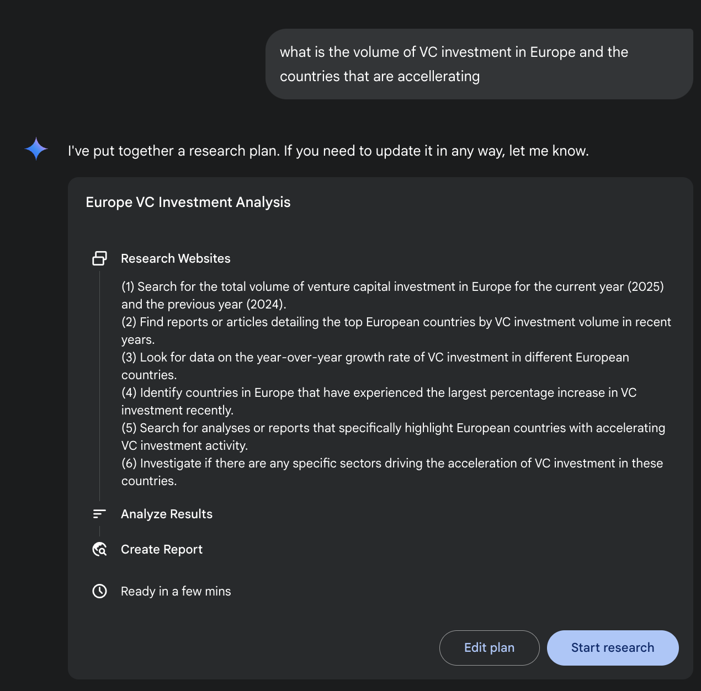
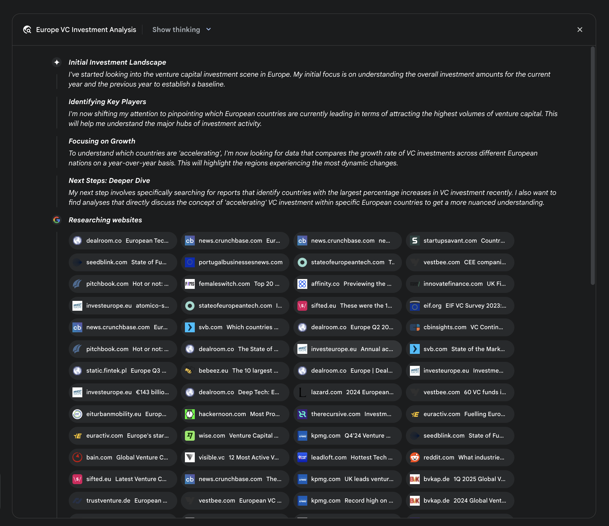
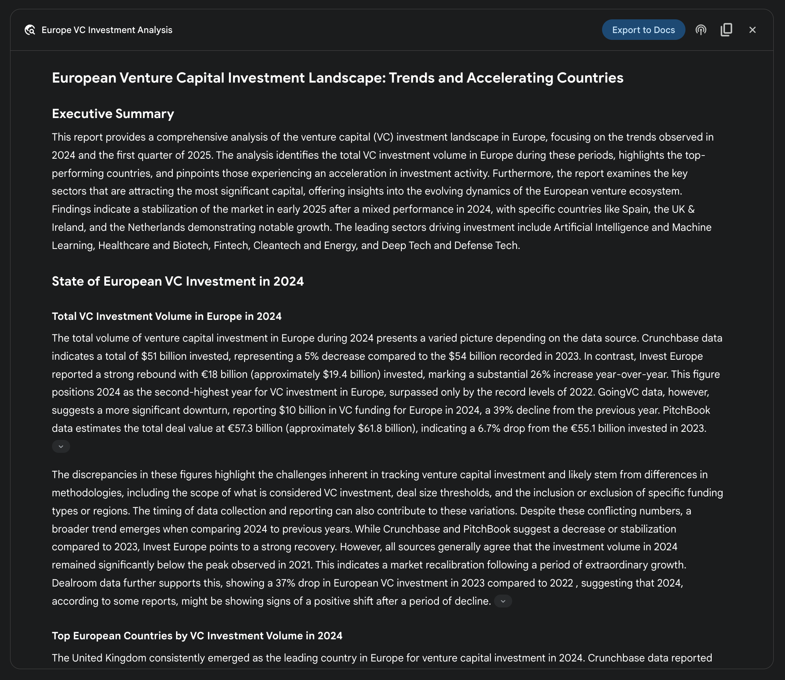
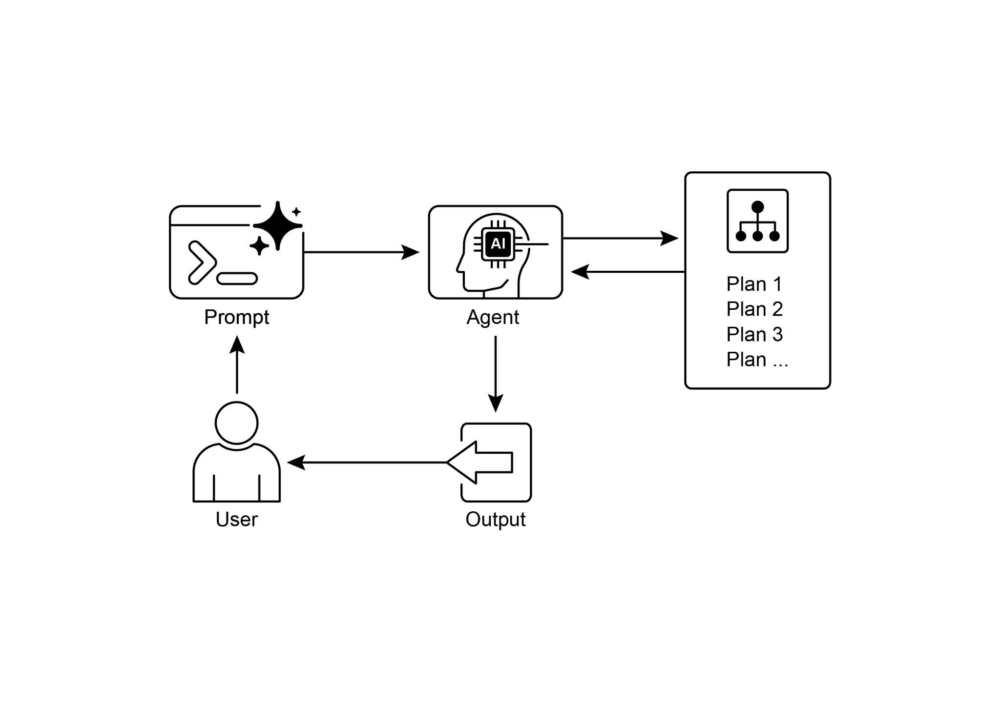

# 第 6 章:規劃(Planning)

智慧行為往往不只是對眼前輸入做出反應而已。它需要前瞻性的眼光、把複雜任務拆解成較小且易於掌控的步驟,並擬定達成目標的策略。這正是規劃(Planning)模式登場之處。就其核心而言,規劃指的是一個代理(agent)或一個代理系統,能夠制定出一連串行動,以便從初始狀態邁向目標狀態的能力。

## 規劃模式總覽

在人工智慧(AI)的脈絡下,把一個規劃代理想像成一位你可以委以複雜目標的專家,會很有幫助。當你要求它「籌辦一場團隊外出活動」時,你定義的是「做什麼(what)」——也就是目標及其限制——而非「怎麼做(how)」。代理的核心任務,就是自主地規劃出一條通往該目標的路徑。它必須先理解初始狀態(例如預算、參與人數、期望的日期)與目標狀態(成功訂好的外出活動),然後找出能把兩者連接起來的最佳行動序列。這份計畫並非事先就已知曉;它是因應請求而被創造出來的。

這個過程的一大特徵就是適應力。一份初始計畫只是起點,而非一份僵硬的腳本。代理真正的威力,在於它能夠納入新資訊,並引導整個專案繞過障礙。舉例來說,如果原本中意的場地變得無法使用,或是選定的外燴業者已被預訂一空,一個有能力的代理不會就此失敗。它會適應。它會登錄這個新的限制、重新評估各種選項,並制定出一份新計畫,或許是建議替代的場地或日期。

然而,認清彈性與可預測性之間的取捨至關重要。動態規劃是一種特定工具,而非萬用解法。當一個問題的解法已經被充分理解、且可重複時,把代理約束在一個預先決定、固定的工作流程中會更為有效。這種做法限制了代理的自主性,以降低不確定性與不可預測行為的風險,從而保證可靠且一致的結果。因此,究竟要使用規劃代理還是單純的任務執行代理,取決於一個關鍵問題:究竟「怎麼做」需要被探索出來,還是它早已為人所知?

## 實務應用與使用案例

規劃模式是自主系統中的一項核心運算過程,它讓代理能夠綜整出一連串行動以達成指定目標,在動態或複雜的環境中尤其如此。這個過程把高層次的目標轉化為一份由離散、可執行步驟所組成的結構化計畫。

在程序性任務自動化(procedural task automation)這類領域中,規劃被用來協調複雜的工作流程。舉例來說,像「新進員工到職」這樣的商業流程,可以被分解為一連串有方向性的子任務,例如建立系統帳號、指派訓練模組,以及與不同部門協調。代理會生成一份計畫,以合乎邏輯的順序執行這些步驟,並在過程中呼叫必要的工具或與各種系統互動以管理彼此間的依賴關係。

在機器人學與自主導航的領域裡,規劃對於狀態空間遍歷(state-space traversal)而言是根本所在。一個系統,無論是實體機器人還是虛擬實體,都必須生成一條路徑或一連串行動,以便從初始狀態過渡到目標狀態。這牽涉到針對時間或能源消耗等指標進行最佳化,同時遵守環境上的限制,例如避開障礙物或遵循交通規則。

這個模式對於結構化資訊綜整(structured information synthesis)也同樣關鍵。當被指派生成像研究報告這類複雜輸出時,代理可以制定一份計畫,當中包含資訊蒐集、資料摘要、內容結構化,以及迭代式精煉等不同階段。同樣地,在涉及多步驟問題解決的客戶支援情境中,代理也可以針對診斷、解決方案實作與問題升級,建立並遵循一套有系統的計畫。

本質上,規劃模式讓代理得以超越單純、被動反應的行動,邁向以目標為導向的行為。它提供了解決那些「需要一連串相互依賴之操作」的問題所必需的邏輯框架。

## 動手實作範例(Crew AI)

以下這一節將示範如何使用 Crew AI 框架來實作規劃者(Planner)模式。這個模式牽涉到一個代理,它會先針對一個複雜的查詢制定出一份多步驟計畫,然後循序地執行該計畫。

```python
import os
from dotenv import load_dotenv
from crewai import Agent, Task, Crew, Process
from langchain_openai import ChatOpenAI

# 為了安全性,從 .env 檔案載入環境變數
load_dotenv()

# 1. 為了清晰起見,明確定義語言模型
llm = ChatOpenAI(model="gpt-4-turbo")

# 2. 定義一個清楚且聚焦的代理
planner_writer_agent = Agent(
    # 提示詞中譯:文章規劃者與撰寫者
    role='Article Planner and Writer',
    # 提示詞中譯:針對指定主題進行規劃,然後撰寫一份簡潔、引人入勝的摘要。
    goal='Plan and then write a concise, engaging summary on a specified topic.',
    # 提示詞中譯:
    # 你是一位專業的技術寫作者兼內容策略師。
    # 你的強項在於動筆之前先擬定一份清楚、可付諸行動的計畫,
    # 確保最終的摘要既具有資訊性又易於消化吸收。
    backstory=(
        'You are an expert technical writer and content strategist. '
        'Your strength lies in creating a clear, actionable plan before writing, '
        'ensuring the final summary is both informative and easy to digest.'
    ),
    verbose=True,
    allow_delegation=False,
    llm=llm  # 把這個特定的 LLM 指派給代理
)

# 3. 定義一個任務,並給予更結構化、更具體的預期輸出
# 提示詞中譯:強化學習在 AI 中的重要性
topic = "The importance of Reinforcement Learning in AI"
high_level_task = Task(
    # 提示詞中譯:
    # 1. 針對主題「{topic}」的摘要,建立一份條列式的計畫。
    # 2. 根據你的計畫撰寫摘要,字數維持在 200 字左右。
    description=(
        f"1. Create a bullet-point plan for a summary on the topic: '{topic}'.\n"
        f"2. Write the summary based on your plan, keeping it around 200 words."
    ),
    # 提示詞中譯:
    # 一份最終報告,包含兩個明確區分的段落:
    #
    # ### Plan(計畫)
    # - 一份條列清單,概述摘要的主要重點。
    #
    # ### Summary(摘要)
    # - 一份針對該主題、簡潔且結構良好的摘要。
    expected_output=(
        "A final report containing two distinct sections:\n\n"
        "### Plan\n"
        "- A bulleted list outlining the main points of the summary.\n\n"
        "### Summary\n"
        "- A concise and well-structured summary of the topic."
    ),
    agent=planner_writer_agent,
)

# 用一個清楚的流程建立 crew
crew = Crew(
    agents=[planner_writer_agent],
    tasks=[high_level_task],
    process=Process.sequential,
)

# 執行任務
print("## Running the planning and writing task ##")
result = crew.kickoff()
print("\n\n---\n## Task Result ##\n---")
print(result)
```

這段程式碼使用 CrewAI 函式庫建立了一個 AI 代理,讓它針對指定主題進行規劃並撰寫摘要。它一開始先匯入必要的函式庫,包括 CrewAI 與 langchain_openai,並從 .env 檔案載入環境變數。程式碼明確地定義了一個 ChatOpenAI 語言模型供代理使用。接著建立一個名為 planner_writer_agent 的代理(Agent),賦予它特定的角色與目標:先規劃、再撰寫一份簡潔的摘要。代理的背景故事(backstory)強調了它在規劃與技術寫作方面的專長。程式碼定義了一個任務(Task),並給予清楚的描述:先針對主題「The importance of Reinforcement Learning in AI」建立一份計畫,然後撰寫摘要,並指定了預期輸出的特定格式。隨後組建一個 crew,納入該代理與任務,並設定為循序處理。最後,呼叫 `crew.kickoff()` 方法來執行所定義的任務,並印出結果。

## Google DeepResearch

Google Gemini DeepResearch(見圖 1)是一套以代理為基礎的系統,專為自主的資訊檢索與綜整而設計。它透過一條多步驟的代理式管線(agentic pipeline)運作,動態且迭代地查詢 Google 搜尋,以有系統地探索複雜主題。這套系統的設計目的,是處理一大批以網路為基礎的來源、評估所蒐集到的資料的相關性與知識缺口,並進行後續搜尋以填補這些缺口。最終輸出會把經過檢核的資訊,彙整成一份附有引用來源的結構化、多頁摘要。

進一步來說,這套系統的運作並非單次的「查詢—回應」事件,而是一個受到管理、長時間運行的過程。它一開始會把使用者的提示解構成一份多重要點的研究計畫(見圖 1),接著把這份計畫呈現給使用者審閱與修改。這讓研究的走向得以在執行前進行協作式的塑形。一旦計畫獲得核准,代理式管線便會啟動它那迭代式的「搜尋—分析」迴圈。這不只是執行一系列預先定義好的搜尋而已;代理會根據它所蒐集到的資訊,動態地制定並精煉它的查詢,主動找出知識缺口、佐證各個資料點,並化解彼此矛盾之處。



*圖 1:Google Deep Research 代理正在生成一份執行計畫,以便把 Google 搜尋當作工具來使用。*

這套系統的一項關鍵架構元件,在於它能夠以非同步(asynchronously)的方式管理這個過程。這項設計確保了這項可能牽涉到分析數百個來源的調查,能夠對單點故障(single-point failures)保持韌性,並讓使用者得以抽身離開,並在完成時收到通知。系統也可以整合使用者提供的文件,把來自私有來源的資訊與它以網路為基礎的研究結合起來。最終輸出並非只是把各項發現串接成一份清單,而是一份結構化、多頁的報告。在綜整階段,模型會對所蒐集到的資訊進行批判性評估,辨識主要的主題,並把內容組織成一段帶有合乎邏輯之章節的連貫敘事。這份報告被設計成可互動的,通常包含像語音概覽(audio overview)、圖表,以及連往原始引用來源的連結等功能,讓使用者得以進行查證與進一步探索。除了綜整後的結果之外,模型還會明確地回傳它所搜尋與參考過的完整來源清單(見圖 2)。這些來源以引用(citations)的形式呈現,提供完整的透明度與通往第一手資訊的直接管道。整個過程把一個簡單的查詢,轉化成一個全面、經過綜整的知識體系。



*圖 2:Deep Research 計畫被執行的範例,過程中把 Google 搜尋當作工具來搜尋各種網路來源。*

藉由減少手動進行資料取得與綜整所需投入的大量時間與資源,Gemini DeepResearch 為資訊探索提供了一種更結構化、更詳盡的方法。這套系統的價值,在橫跨各種領域、複雜且多面向的研究任務中尤其明顯。

舉例來說,在競爭分析中,可以指示代理有系統地蒐集並彙整關於市場趨勢、競爭對手產品規格、來自各種線上來源的公眾情緒,以及行銷策略等資料。這個自動化過程取代了手動追蹤多個競爭對手的繁瑣工作,讓分析師能夠專注於更高層次的策略性詮釋,而非資料蒐集(見圖 3)。



*圖 3:Google Deep Research 代理所生成的最終輸出,它代替我們分析了透過把 Google 搜尋當作工具而取得的各種來源。*

同樣地,在學術探索方面,這套系統是進行廣泛文獻回顧的一項強大工具。它能夠辨識並摘要奠基性的論文、追溯概念在眾多出版品中的發展,並描繪出特定領域中正在浮現的研究前沿,從而加速學術探究中最初也最耗時的階段。

這種做法的高效率,源自於把迭代式「搜尋—篩選」迴圈自動化——而這正是手動研究中的一個核心瓶頸。其全面性,則來自於系統有能力在相當的時間範圍內,處理比人類研究者通常所能負荷的資訊來源更大的數量與更多的種類。這種更寬廣的分析範圍,有助於減少選擇偏誤(selection bias)的可能性,並提高揭露那些較不顯眼但潛在關鍵之資訊的機率,進而對所研究的主題形成更穩健、更有依據的理解。

## OpenAI Deep Research API

OpenAI Deep Research API 是一項專門設計來自動化複雜研究任務的工具。它運用了一個先進的代理式模型,能夠獨立地推理、規劃,並從真實世界的來源綜整資訊。與單純的問答(Q&A)模型不同,它會接收一個高層次的查詢,並自主地把它拆解成一個個子問題,使用其內建工具進行網路搜尋,並交付一份結構化、富含引用的最終報告。這個 API 提供對整個過程的直接程式化存取,在撰寫本文時,它使用像 o3-deep-research-2025-06-26 這樣的模型來進行高品質的綜整,以及速度更快的 o4-mini-deep-research-2025-06-26 來因應對延遲敏感的應用。

Deep Research API 之所以有用,是因為它把原本需要數小時手動研究的工作自動化,交付專業等級、以資料為驅動的報告,適合用來為商業策略、投資決策或政策建議提供資訊。它的主要好處包括:

- **結構化、附引用的輸出:** 它會產出組織良好的報告,內含與來源中介資料(metadata)連結的行內引用(inline citations),確保各項主張都是可查證、有資料支撐的。
- **透明度:** 與 ChatGPT 中那種被抽象化的過程不同,這個 API 會揭露所有的中間步驟,包括代理的推理、它所執行的特定網路搜尋查詢,以及它所運行的任何程式碼。這讓詳盡的除錯、分析,以及對「最終答案是如何被建構出來的」之更深入理解成為可能。
- **可擴充性:** 它支援模型情境協定(Model Context Protocol,MCP),讓開發者能把代理連接到私有知識庫與內部資料來源,把公開的網路研究與專有資訊融合在一起。

要使用這個 API,你需向 `client.responses.create` 端點發送一個請求,指定一個模型、一個輸入提示,以及代理可以使用的工具。輸入通常包含一個用來定義代理人格與期望輸出格式的 system_message,以及 user_query。你還必須納入 web_search_preview 工具,並可選擇性地加入像 code_interpreter 或自訂的 MCP 工具(見第 10 章)等其他工具以存取內部資料。

````python
from openai import OpenAI

# 用你的 API key 初始化 client
client = OpenAI(api_key="YOUR_OPENAI_API_KEY")

# 定義代理的角色與使用者的研究問題
# 提示詞中譯:
# 你是一位專業研究者,正在準備一份結構化、以資料為驅動的報告。
# 著重於資料豐富的洞見、使用可靠的來源,並納入行內引用。
system_message = """You are a professional researcher preparing a structured, data-driven report.
Focus on data-rich insights, use reliable sources, and include inline citations."""

# 提示詞中譯:研究司美格魯肽(semaglutide)對全球醫療體系的經濟影響。
user_query = "Research the economic impact of semaglutide on global healthcare systems."

# 建立 Deep Research API 呼叫
response = client.responses.create(
    model="o3-deep-research-2025-06-26",
    input=[
        {
            "role": "developer",
            "content": [{"type": "input_text", "text": system_message}]
        },
        {
            "role": "user",
            "content": [{"type": "input_text", "text": user_query}]
        }
    ],
    reasoning={"summary": "auto"},
    tools=[{"type": "web_search_preview"}]
)

# 從回應中存取並印出最終報告
final_report = response.output[-1].content[0].text
print(final_report)

# --- 存取行內引用與中介資料 ---
print("--- CITATIONS ---")
annotations = response.output[-1].content[0].annotations
if not annotations:
    print("No annotations found in the report.")
else:
    for i, citation in enumerate(annotations):
        # 該引用所指向的文字段落
        cited_text = final_report[citation.start_index:citation.end_index]
        print(f"Citation {i+1}:")
        print(f"  Cited Text: {cited_text}")
        print(f"  Title: {citation.title}")
        print(f"  URL: {citation.url}")
        print(f"  Location: chars {citation.start_index}–{citation.end_index}")
        print("\n" + "="*50 + "\n")

# --- 檢視中間步驟 ---
print("--- INTERMEDIATE STEPS ---")

# 1. 推理步驟:模型所生成的內部計畫與摘要。
try:
    reasoning_step = next(item for item in response.output if item.type == "reasoning")
    print("\n[Found a Reasoning Step]")
    for summary_part in reasoning_step.summary:
        print(f"  - {summary_part.text}")
except StopIteration:
    print("\nNo reasoning steps found.")

# 2. 網路搜尋呼叫:代理所執行的確切搜尋查詢。
try:
    search_step = next(item for item in response.output if item.type == "web_search_call")
    print("\n[Found a Web Search Call]")
    print(f"  Query Executed: '{search_step.action['query']}'")
    print(f"  Status: {search_step.status}")
except StopIteration:
    print("\nNo web search steps found.")

# 3. 程式碼執行:代理使用程式碼直譯器(code interpreter)所運行的任何程式碼。
try:
    code_step = next(item for item in response.output if item.type == "code_interpreter_call")
    print("\n[Found a Code Execution Step]")
    print("  Code Input:")
    print(f"    ```python\n{code_step.input}\n    ```")
    print("  Code Output:")
    print(f"    {code_step.output}")
except StopIteration:
    print("\nNo code execution steps found.")
````

這段程式碼片段運用 OpenAI API 來執行一項「Deep Research」任務。它一開始先用你的 API key 初始化 OpenAI client,這對於身分驗證至關重要。接著,它把 AI 代理的角色定義為一位專業研究者,並設定使用者關於司美格魯肽(semaglutide)經濟影響的研究問題。程式碼建構了一個對 o3-deep-research-2025-06-26 模型的 API 呼叫,提供所定義的系統訊息與使用者查詢作為輸入。它也要求自動產生推理的摘要,並啟用網路搜尋功能。在發出 API 呼叫之後,它擷取並印出最終生成的報告。

隨後,它嘗試從報告的標註(annotations)中存取並顯示行內引用與中介資料,包括被引用的文字、標題、URL,以及該引用在報告中的位置。最後,它檢視並印出模型所採取之中間步驟的細節,例如推理步驟、網路搜尋呼叫(包含所執行的查詢),以及若使用了程式碼直譯器則包含任何程式碼執行步驟。

## 重點速覽

**是什麼(What):** 複雜問題往往無法靠單一行動就解決,而需要前瞻性的眼光才能達成期望的結果。少了結構化的做法,代理系統便難以處理那些涉及多重步驟與依賴關係的多面向請求。這使得把高層次目標拆解成一系列易於掌控、可執行之較小任務變得困難。因此,當面對錯綜複雜的目標時,系統便無法有效地擬定策略,導致不完整或不正確的結果。

**為什麼(Why):** 規劃模式提供了一套標準化的解法,做法是讓代理系統先針對一個目標建立一份連貫的計畫。它牽涉到把高層次目標分解成一連串較小、可付諸行動的步驟或子目標。這讓系統能夠管理複雜的工作流程、協調各種工具,並以合乎邏輯的順序處理依賴關係。大型語言模型(LLM)特別適合這項工作,因為它們能夠根據其龐大的訓練資料,生成看似合理且有效的計畫。這種結構化的做法,把一個單純被動反應的代理,轉化為一個能夠主動朝複雜目標推進、甚至在必要時調整計畫的策略性執行者。

**經驗法則(Rule of thumb):** 當使用者的請求複雜到無法靠單一行動或工具來處理時,就使用此模式。它非常適合用來自動化多步驟流程,例如生成一份詳盡的研究報告、新進員工到職,或執行競爭分析。每當一個任務需要一連串相互依賴的操作才能達到最終的、經過綜整的結果時,就套用規劃模式。

## 視覺摘要



*圖 4:規劃設計模式*

## 重點整理

- 規劃讓代理能夠把複雜目標拆解成可付諸行動的循序步驟。
- 它對於處理多步驟任務、工作流程自動化,以及在複雜環境中導航而言,都是不可或缺的。
- LLM 能夠藉由根據任務描述生成逐步的做法來進行規劃。
- 明確地提示或設計任務以要求其進行規劃步驟,能在代理框架中鼓勵這種行為。
- Google Deep Research 是一個代理,它代替我們分析透過把 Google 搜尋當作工具而取得的各種來源。它會反思、規劃,並執行。

## 結論

總結來說,規劃模式是一項基礎元件,它把代理系統從單純的被動回應者,提升為具策略性、以目標為導向的執行者。現代的大型語言模型為此提供了核心能力,能自主地把高層次目標分解成連貫、可付諸行動的步驟。這個模式的適用範圍,小至直接、循序的任務執行(如 CrewAI 代理建立並遵循一份寫作計畫所示範的),大至更複雜且動態的系統。Google DeepResearch 代理正是這種進階應用的典範,它建立的是迭代式的研究計畫,並能根據持續不斷的資訊蒐集而調整、演化。歸根究柢,規劃為人類意圖與針對複雜問題的自動化執行之間,提供了不可或缺的橋樑。藉由把解決問題的做法加以結構化,這個模式讓代理能夠管理錯綜複雜的工作流程,並交付全面、經過綜整的結果。

## 參考資料

1. Google DeepResearch(Gemini 功能):<https://gemini.google.com>
2. OpenAI, Introducing deep research:<https://openai.com/index/introducing-deep-research/>
3. Perplexity, Introducing Perplexity Deep Research:<https://www.perplexity.ai/hub/blog/introducing-perplexity-deep-research>
