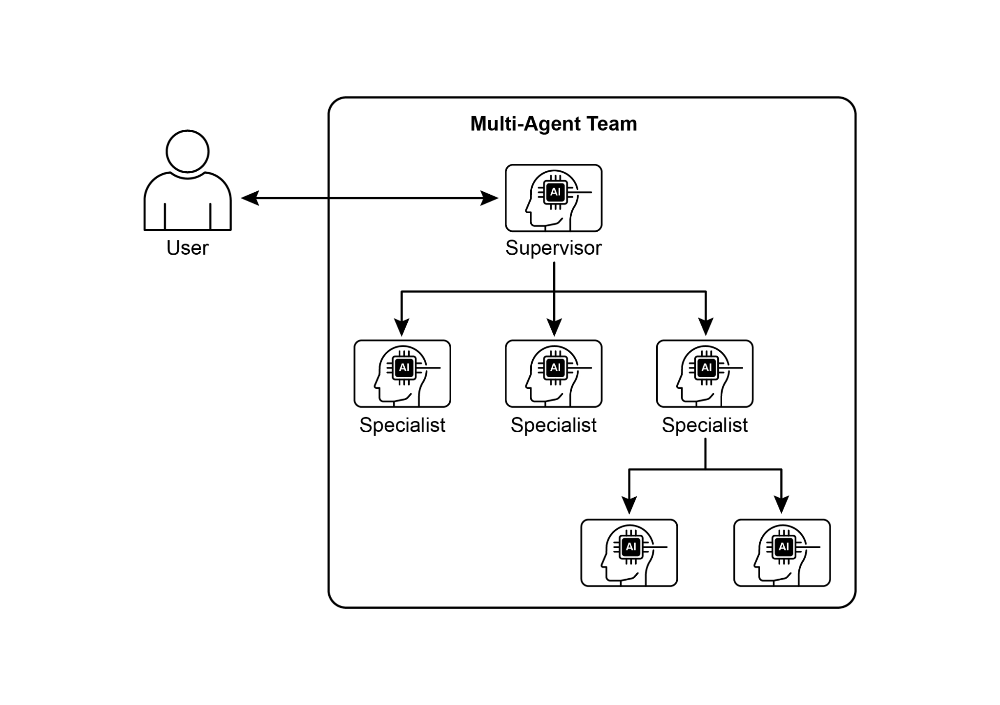
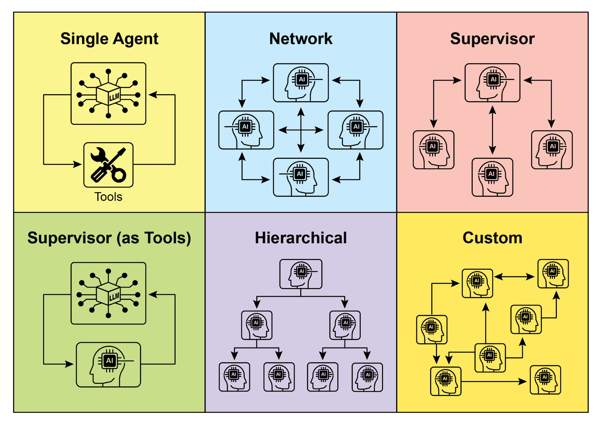
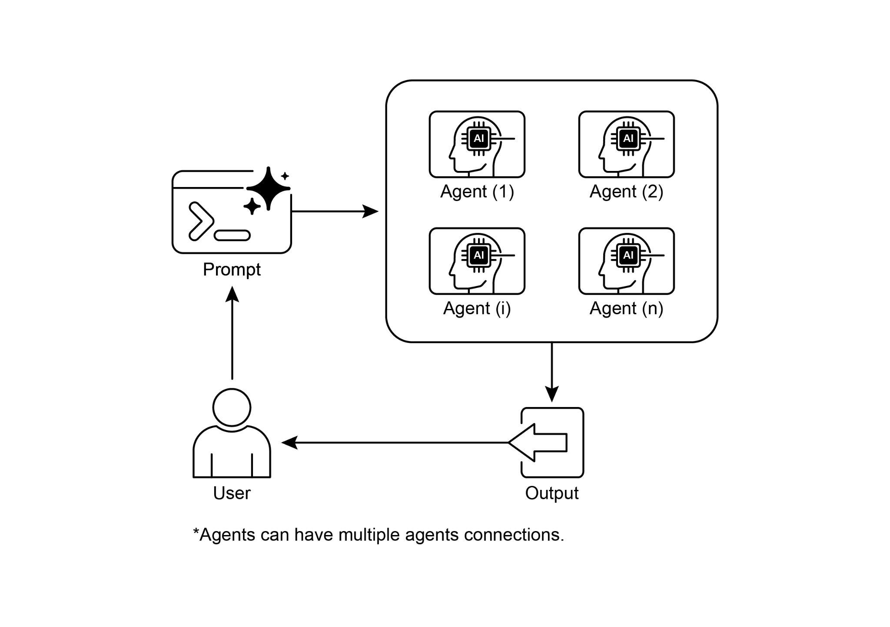

# 第 7 章:多代理協作(Multi-Agent Collaboration)

雖然單體式(monolithic)的代理架構對於定義明確的問題可能相當有效,但當面對複雜、跨領域的任務時,其能力往往會受到限制。多代理協作(Multi-Agent Collaboration)模式正是透過把系統建構成一組由不同專精代理(specialized agents)所組成的合作群體,來克服這些侷限。這套方法奠基於任務拆解(task decomposition)的原則:把一個高層次的目標分解成數個離散的子問題,接著再把每個子問題指派給最適合該任務、擁有特定工具、資料存取權或推理能力的代理。

舉例來說,一個複雜的研究查詢可以被拆解,並分別指派給負責資訊檢索的研究代理(Research Agent)、負責統計處理的資料分析代理(Data Analysis Agent),以及負責生成最終報告的綜整代理(Synthesis Agent)。這類系統的成效,並不只是源於分工,更關鍵地取決於代理之間的溝通機制。這需要一套標準化的溝通協定(communication protocol)與共享的本體論(shared ontology),讓代理們得以交換資料、委派子任務,並協調彼此的行動,以確保最終輸出是連貫一致的。

這種分散式架構帶來了數項優勢,包括更強的模組化、可擴展性與穩健性——因為單一代理的失效,未必會導致整個系統全面崩潰。這種協作能達成一種綜效(synergistic)的成果:多代理系統的整體表現,超越了群體中任何單一代理所能企及的潛在能力。

## 多代理協作模式總覽

多代理協作模式涉及設計一種系統,讓多個獨立或半獨立的代理協同合作以達成共同目標。每個代理通常都有明確界定的角色、與整體目標一致的特定目標,並可能擁有不同工具或知識庫的存取權。這個模式的威力,正在於這些代理之間的互動與綜效。

協作可以採取多種形式:

- **循序交接(Sequential Handoffs):** 一個代理完成某項任務後,把其輸出傳遞給另一個代理,以進行管線中的下一個步驟(類似於規劃模式,但明確地涉及不同的代理)。
- **平行處理(Parallel Processing):** 多個代理同時處理一個問題的不同部分,其結果稍後再加以合併。
- **辯論與共識(Debate and Consensus):** 一種多代理協作形式,讓擁有不同觀點與資訊來源的代理們投入討論,以評估各種選項,最終達成共識或做出更明智的決策。
- **階層式結構(Hierarchical Structures):** 一個管理者代理(manager agent)可以根據工作代理(worker agents)的工具存取權或外掛能力,動態地把任務委派給它們,並綜整它們的結果。每個代理也可以負責處理相關的一組工具,而非由單一代理掌管所有工具。
- **專家團隊(Expert Teams):** 在不同領域擁有專精知識的代理(例如研究員、寫手、編輯)協同合作,以產出複雜的輸出。
- **評論者—審查者(Critic-Reviewer):** 一組代理先建立初步的輸出,例如計畫、初稿或答案。接著,第二組代理會以批判性的角度評估這些輸出,檢視其是否符合政策、安全性、合規性、正確性、品質,以及與組織目標的契合度。原始的建立者或某個最終代理,再根據這些回饋來修訂輸出。這個模式特別適用於程式碼生成、研究寫作、邏輯檢查,以及確保倫理上的契合。這種做法的優點包括:更高的穩健性、更佳的品質,以及更低的幻覺(hallucination)或錯誤發生機率。

一個多代理系統(見圖 1)基本上由以下要素構成:代理角色與職責的界定、代理之間用以交換資訊的溝通管道之建立,以及一套用以引導其協作行動的任務流程或互動協定之制定。



*圖 1:多代理系統範例。*

Crew AI 與 Google ADK 等框架的設計目的,正是為了促成這套範式——它們提供了用以規範代理、任務及其互動程序的結構。對於那些需要多種專精知識、涵蓋多個離散階段,或是能從平行處理與跨代理資訊相互佐證中獲益的挑戰而言,這套方法格外有效。

## 實務應用與使用案例

多代理協作是一種威力強大的模式,適用於眾多領域:

- **複雜研究與分析:** 一支代理團隊可以協作進行一項研究專案。其中一個代理可能專精於搜尋學術資料庫,另一個負責摘要研究發現,第三個負責辨識趨勢,而第四個則負責把資訊綜整成一份報告。這正反映了一支人類研究團隊的運作方式。
- **軟體開發:** 想像有一群代理協作建構軟體。其中一個代理可以擔任需求分析師,另一個是程式碼生成者,第三個是測試人員,第四個是文件撰寫者。它們可以彼此傳遞輸出,以建構並驗證各個元件。
- **創意內容生成:** 製作一檔行銷活動可以涉及一個市場研究代理、一個文案撰寫代理、一個平面設計代理(使用影像生成工具),以及一個社群媒體排程代理,全部協同運作。
- **金融分析:** 一個多代理系統可以分析金融市場。各代理可能分別專精於擷取股票資料、分析新聞情緒、執行技術分析,以及生成投資建議。
- **客戶支援升級:** 第一線的支援代理可以處理初步的查詢,並在必要時把複雜的問題升級給專家代理(例如技術專家或帳務專員),這展現了一種基於問題複雜度的循序交接。
- **供應鏈最佳化:** 各代理可以代表供應鏈中的不同節點(供應商、製造商、配銷商),並協同合作,以因應需求變化或突發中斷,最佳化庫存水準、物流與排程。
- **網路分析與修復:** 自主化營運(autonomous operations)能從代理式架構中獲益良多,在故障定位方面尤其如此。多個代理可以協作來分診(triage)並修復問題,提出最佳的處置行動。這些代理也能與傳統的機器學習模型及工具整合,在運用既有系統的同時,提供生成式 AI(Generative AI)所帶來的優勢。

界定專精代理並縝密地編排其相互關係的能力,使開發者得以建構出具備更高模組化、可擴展性,以及能夠應對單一整合型代理難以克服之複雜性的系統。

## 多代理協作:探討相互關係與溝通結構

理解代理之間互動與溝通的種種微妙方式,是設計有效多代理系統的根本。如圖 2 所示,存在著一整個光譜的相互關係與溝通模型,從最簡單的單一代理情境,到複雜的、量身打造的協作框架皆涵蓋其中。每種模型都各有其獨特的優勢與挑戰,並影響著多代理系統的整體效率、穩健性與適應性。

**1. 單一代理(Single Agent):** 在最基本的層級,「單一代理」自主運作,不與其他實體直接互動或溝通。雖然這種模型實作與管理都很直觀,但其能力本質上受限於該單一代理的範疇與資源。它適用於那些可被拆解成各自獨立、且每個皆能由單一、自給自足的代理解決之子問題的任務。

**2. 網路(Network):** 「網路」模型代表著朝協作邁進的重要一步,其中多個代理以去中心化(decentralized)的方式彼此直接互動。溝通通常以點對點(peer-to-peer)的形式進行,使資訊、資源乃至於任務得以共享。這種模型能培養出韌性,因為單一代理的失效未必會癱瘓整個系統。然而,在一個龐大、無結構的網路中,要管理溝通開銷(communication overhead)並確保決策的連貫一致,可能相當具有挑戰性。

**3. 監督者(Supervisor):** 在「監督者」模型中,有一個專責的代理——也就是「監督者」——負責督導並協調一群下屬代理的活動。監督者扮演著溝通、任務分配與衝突調解的中央樞紐。這種階層式結構提供了清晰的權責劃分,並能簡化管理與控制。然而,它引入了單點故障(single point of failure,即監督者本身),且當監督者因下屬數量龐大或任務過於複雜而不堪負荷時,可能成為瓶頸。

**4. 監督者作為工具(Supervisor as a Tool):** 這個模型是「監督者」概念的一種細緻延伸,其中監督者的角色較少在於直接的指揮與控制,而更多在於為其他代理提供資源、指引或分析支援。監督者可能提供工具、資料或運算服務,使其他代理能更有效地執行任務,而不必然要主導它們的一舉一動。這種做法旨在運用監督者的能力,同時又不強加僵化的由上而下控制。

**5. 階層式(Hierarchical):** 「階層式」模型在監督者概念的基礎上進一步擴展,以建立一個多層次的組織結構。這涉及多層的監督者,由較高層的監督者督導較低層的監督者,而最底層則是一組執行操作的代理。這種結構非常適合那些可被拆解成子問題的複雜問題,讓每個子問題都由階層中的某個特定層級來管理。它為可擴展性與複雜度管理提供了一套有結構的做法,並允許在既定的界限內進行分散式決策。



*圖 2:代理以各種不同的方式進行溝通與互動。*

**6. 自訂(Custom):** 「自訂」模型代表著多代理系統設計中的終極彈性。它允許建立獨一無二的相互關係與溝通結構,精準地依特定問題或應用的需求量身打造。這可以涉及混合式的做法——結合前述各模型的元素——也可以是源於環境獨特限制與機會而生的全新設計。自訂模型往往是出於以下需求而產生:針對特定效能指標進行最佳化、處理高度動態的環境,或把領域特定的知識納入系統架構之中。設計並實作自訂模型,通常需要對多代理系統原則有深入的理解,並謹慎考量溝通協定、協調機制與湧現行為(emergent behaviors)。

總而言之,為一個多代理系統選擇相互關係與溝通模型,是一項關鍵的設計決策。每種模型都各有其鮮明的優缺點,而最佳選擇取決於諸多因素,例如任務的複雜度、代理的數量、所期望的自主程度、對穩健性的需求,以及可接受的溝通開銷。多代理系統未來的進展,很可能會持續探索並精煉這些模型,同時發展出協作智慧(collaborative intelligence)的新範式。

## 動手實作範例(Crew AI)

這段 Python 程式碼運用 CrewAI 框架,定義了一個由 AI 驅動的團隊(crew),用來生成一篇關於 AI 趨勢的部落格文章。它從設定環境、自 `.env` 檔案載入 API 金鑰開始。此應用程式的核心,在於定義兩個代理:一個負責尋找並摘要 AI 趨勢的研究員(researcher),以及一個根據研究結果撰寫部落格文章的寫手(writer)。

接著,程式相應地定義了兩個任務:一個用於研究趨勢,另一個用於撰寫部落格文章,其中寫作任務依賴於研究任務的輸出。這些代理與任務隨後被組裝成一個團隊(Crew),並指定一個循序流程(sequential process),讓各任務按順序執行。這個團隊以代理、任務以及一個語言模型(具體而言是「gemini-2.0-flash」模型)進行初始化。`main` 函式透過 `kickoff()` 方法執行這個團隊,編排各代理之間的協作以產出所期望的輸出。最後,程式印出團隊執行的最終結果,也就是所生成的部落格文章。

```python
import os
from dotenv import load_dotenv
from crewai import Agent, Task, Crew, Process
from langchain_google_genai import ChatGoogleGenerativeAI

def setup_environment():
    """Loads environment variables and checks for the required API key."""
    load_dotenv()
    if not os.getenv("GOOGLE_API_KEY"):
        raise ValueError("GOOGLE_API_KEY not found. Please set it in your .env file.")

def main():
    """
    Initializes and runs the AI crew for content creation using the
    latest Gemini model.
    """
    setup_environment()

    # 定義要使用的語言模型。
    # 已更新為 Gemini 2.0 系列的模型,以獲得更佳的效能與功能。
    # 若需要最前沿的(預覽版)能力,可改用 "gemini-2.5-flash"。
    llm = ChatGoogleGenerativeAI(model="gemini-2.0-flash")

    # 定義具備特定角色與目標的代理
    researcher = Agent(
        # 提示詞中譯:資深研究分析師
        role='Senior Research Analyst',
        # 提示詞中譯:尋找並摘要 AI 領域的最新趨勢。
        goal='Find and summarize the latest trends in AI.',
        # 提示詞中譯:你是一位經驗豐富的研究分析師,擅長辨識關鍵趨勢並綜整資訊。
        backstory="You are an experienced research analyst with a knack for identifying key trends and synthesizing information.",
        verbose=True,
        allow_delegation=False,
    )

    writer = Agent(
        # 提示詞中譯:技術內容寫手
        role='Technical Content Writer',
        # 提示詞中譯:根據研究發現撰寫一篇清晰且引人入勝的部落格文章。
        goal='Write a clear and engaging blog post based on research findings.',
        # 提示詞中譯:你是一位技藝精湛的寫手,能把複雜的技術主題轉化為淺顯易懂的內容。
        backstory="You are a skilled writer who can translate complex technical topics into accessible content.",
        verbose=True,
        allow_delegation=False,
    )

    # 為各代理定義任務
    research_task = Task(
        # 提示詞中譯:研究 2024-2025 年人工智慧領域前三大新興趨勢。聚焦於實際應用與潛在影響。
        description="Research the top 3 emerging trends in Artificial Intelligence in 2024-2025. Focus on practical applications and potential impact.",
        # 提示詞中譯:一份關於前三大 AI 趨勢的詳細摘要,包含重點與來源。
        expected_output="A detailed summary of the top 3 AI trends, including key points and sources.",
        agent=researcher,
    )

    writing_task = Task(
        # 提示詞中譯:根據研究發現撰寫一篇 500 字的部落格文章。文章應引人入勝,且讓一般大眾易於理解。
        description="Write a 500-word blog post based on the research findings. The post should be engaging and easy for a general audience to understand.",
        # 提示詞中譯:一篇關於最新 AI 趨勢、完整的 500 字部落格文章。
        expected_output="A complete 500-word blog post about the latest AI trends.",
        agent=writer,
        context=[research_task],
    )

    # 建立團隊(Crew)
    blog_creation_crew = Crew(
        agents=[researcher, writer],
        tasks=[research_task, writing_task],
        process=Process.sequential,
        llm=llm,
        verbose=2  # 設定詳細程度,以取得詳細的團隊執行日誌
    )

    # 執行團隊
    print("## Running the blog creation crew with Gemini 2.0 Flash... ##")
    try:
        result = blog_creation_crew.kickoff()
        print("\n------------------\n")
        print("## Crew Final Output ##")
        print(result)
    except Exception as e:
        print(f"\nAn unexpected error occurred: {e}")

if __name__ == "__main__":
    main()
```

接下來,我們將深入探討 Google ADK 框架中的更多範例,特別著重於階層式、平行與循序的協調範式,以及把代理當作操作工具來實作的做法。

## 動手實作範例(Google ADK)

以下程式碼範例示範了如何透過建立父子關係(parent-child relationship),在 Google ADK 中建構一個階層式的代理結構。程式碼定義了兩種類型的代理:`LlmAgent`,以及一個由 `BaseAgent` 衍生而來的自訂 `TaskExecutor` 代理。`TaskExecutor` 是為特定的、非 LLM 的任務而設計的,在本範例中,它只是單純地產生(yield)一個「Task finished successfully」事件。一個名為 `greeter` 的 `LlmAgent` 以指定的模型與指令進行初始化,扮演一個友善的問候者角色。自訂的 `TaskExecutor` 被實體化為 `task_doer`。接著建立一個名為 `coordinator` 的父 `LlmAgent`,同樣帶有模型與指令。`coordinator` 的指令引導它把問候工作委派給 `greeter`,把任務執行委派給 `task_doer`。`greeter` 與 `task_doer` 被加入為 `coordinator` 的子代理(sub-agents),藉此建立起父子關係。程式碼接著斷言(assert)這個關係已正確設定。最後,它印出一則訊息,表示代理階層已成功建立。

```python
from google.adk.agents import LlmAgent, BaseAgent
from google.adk.agents.invocation_context import InvocationContext
from google.adk.events import Event
from typing import AsyncGenerator

# 透過擴充 BaseAgent 來正確地實作一個自訂代理
class TaskExecutor(BaseAgent):
    """A specialized agent with custom, non-LLM behavior."""
    name: str = "TaskExecutor"
    # 提示詞中譯:執行一項預先定義好的任務。
    description: str = "Executes a predefined task."

    async def _run_async_impl(self, context: InvocationContext) -> AsyncGenerator[Event, None]:
        """Custom implementation logic for the task."""
        # 你的自訂邏輯會放在這裡。
        # 在本範例中,我們只是產生一個簡單的事件。
        yield Event(author=self.name, content="Task finished successfully.")

# 定義各別的代理,並進行適當的初始化
# LlmAgent 需要指定一個模型。
greeter = LlmAgent(
    name="Greeter",
    model="gemini-2.0-flash-exp",
    # 提示詞中譯:你是一位友善的問候者。
    instruction="You are a friendly greeter."
)

task_doer = TaskExecutor()  # 實體化我們具體的自訂代理

# 建立一個父代理,並指派其子代理
# 父代理的描述與指令應引導其委派邏輯。
coordinator = LlmAgent(
    name="Coordinator",
    model="gemini-2.0-flash-exp",
    # 提示詞中譯:一個能問候使用者並執行任務的協調者。
    description="A coordinator that can greet users and execute tasks.",
    # 提示詞中譯:當被要求問候時,委派給 Greeter。當被要求執行任務時,委派給 TaskExecutor。
    instruction="When asked to greet, delegate to the Greeter. When asked to perform a task, delegate to the TaskExecutor.",
    sub_agents=[
        greeter,
        task_doer
    ]
)

# ADK 框架會自動建立父子關係。
# 在初始化之後檢查時,這些斷言將會通過。
assert greeter.parent_agent == coordinator
assert task_doer.parent_agent == coordinator

print("Agent hierarchy created successfully.")
```

這段程式碼節錄示範了如何運用 Google ADK 框架中的 `LoopAgent` 來建立迭代式工作流程。程式碼定義了兩個代理:`ConditionChecker` 與 `ProcessingStep`。`ConditionChecker` 是一個自訂代理,它會檢查工作階段狀態(session state)中的「status」值。如果「status」為「completed」,`ConditionChecker` 便升級(escalate)一個事件以停止迴圈;否則,它會產生一個事件以繼續迴圈。`ProcessingStep` 是一個使用「gemini-2.0-flash-exp」模型的 `LlmAgent`。它的指令是執行一項任務,並在它是最後一步時把工作階段的「status」設為「completed」。程式建立了一個名為 `StatusPoller` 的 `LoopAgent`,並設定其 `max_iterations=10`。`StatusPoller` 同時包含 `ProcessingStep` 與一個 `ConditionChecker` 實例作為其子代理。這個 `LoopAgent` 會循序執行子代理,最多進行 10 次迭代,若 `ConditionChecker` 發現狀態為「completed」便停止。

```python
import asyncio
from typing import AsyncGenerator
from google.adk.agents import LoopAgent, LlmAgent, BaseAgent
from google.adk.events import Event, EventActions
from google.adk.agents.invocation_context import InvocationContext

# 最佳實務:把自訂代理定義為完整、能自我描述的類別。
class ConditionChecker(BaseAgent):
    """A custom agent that checks for a 'completed' status in the session state."""
    name: str = "ConditionChecker"
    # 提示詞中譯:檢查某個流程是否已完成,並發出訊號讓迴圈停止。
    description: str = "Checks if a process is complete and signals the loop to stop."

    async def _run_async_impl(
        self, context: InvocationContext
    ) -> AsyncGenerator[Event, None]:
        """Checks state and yields an event to either continue or stop the loop."""
        status = context.session.state.get("status", "pending")
        is_done = (status == "completed")

        if is_done:
            # 當條件達成時,升級以終止迴圈。
            yield Event(author=self.name, actions=EventActions(escalate=True))
        else:
            # 產生一個簡單的事件以繼續迴圈。
            yield Event(author=self.name, content="Condition not met, continuing loop.")

# 修正:LlmAgent 必須有一個模型與明確的指令。
process_step = LlmAgent(
    name="ProcessingStep",
    model="gemini-2.0-flash-exp",
    # 提示詞中譯:你是一段較長流程中的一個步驟。執行你的任務。
    # 如果你是最後一個步驟,請把工作階段狀態中的「status」設為「completed」以更新狀態。
    instruction="You are a step in a longer process. Perform your task. If you are the final step, update session state by setting 'status' to 'completed'."
)

# LoopAgent 負責編排這個工作流程。
poller = LoopAgent(
    name="StatusPoller",
    max_iterations=10,
    sub_agents=[
        process_step,
        ConditionChecker()  # 實體化這個定義良好的自訂代理。
    ]
)

# 這個 poller 現在會執行 'process_step',
# 接著執行 'ConditionChecker',
# 並反覆進行,直到狀態為 'completed' 或已達 10 次迭代為止。
```

這段程式碼節錄闡明了 Google ADK 中的 `SequentialAgent` 模式,它是為了建構線性工作流程而設計的。這段程式碼使用 `google.adk.agents` 函式庫定義了一條循序的代理管線。該管線由兩個代理組成:`step1` 與 `step2`。`step1` 命名為「Step1_Fetch」,其輸出會被儲存在工作階段狀態中,鍵為「data」。`step2` 命名為「Step2_Process」,被指示去分析儲存在 `session.state["data"]` 中的資訊並提供摘要。名為「MyPipeline」的 `SequentialAgent` 負責編排這些子代理的執行。當這條管線以初始輸入執行時,`step1` 會先執行,其回應會依鍵「data」被儲存進工作階段狀態中。接著,`step2` 會執行,並依其指令運用 `step1` 放入狀態中的資訊。這種結構讓我們得以建構出「某個代理的輸出成為下一個代理輸入」的工作流程。這在建立多步驟 AI 或資料處理管線時是一種常見的模式。

```python
from google.adk.agents import SequentialAgent, Agent

# 這個代理的輸出會被儲存到 session.state["data"]
step1 = Agent(name="Step1_Fetch", output_key="data")

# 這個代理會使用前一步的資料。
# 我們指示它如何尋找並使用這份資料。
step2 = Agent(
    name="Step2_Process",
    # 提示詞中譯:分析 state['data'] 中所找到的資訊,並提供一份摘要。
    instruction="Analyze the information found in state['data'] and provide a summary."
)

pipeline = SequentialAgent(
    name="MyPipeline",
    sub_agents=[step1, step2]
)

# 當這條管線以初始輸入執行時,Step1 會先執行,
# 其回應會被儲存到 session.state["data"],接著
# Step2 會執行,並依指示使用狀態中的資訊。
```

以下程式碼範例示範了 Google ADK 中的 `ParallelAgent` 模式,它能促成多個代理任務的平行執行。`data_gatherer` 被設計成平行執行兩個子代理:`weather_fetcher` 與 `news_fetcher`。`weather_fetcher` 代理被指示去取得指定地點的天氣,並把結果儲存在 `session.state["weather_data"]` 中。同樣地,`news_fetcher` 代理被指示去檢索指定主題的頭條新聞,並把它儲存在 `session.state["news_data"]` 中。每個子代理都被設定為使用「gemini-2.0-flash-exp」模型。`ParallelAgent` 負責編排這些子代理的執行,讓它們得以平行運作。`weather_fetcher` 與 `news_fetcher` 兩者的結果都會被蒐集起來,並儲存到工作階段狀態中。最後,這個範例展示了在代理執行完成後,如何從 `final_state` 存取所蒐集到的天氣與新聞資料。

```python
from google.adk.agents import Agent, ParallelAgent

# 把擷取邏輯定義為代理的工具會更好
# 為了讓本範例保持簡單,我們把邏輯直接嵌入代理的指令中。
# 在實際的場景中,你應該使用工具。

# 定義將以平行方式執行的各別代理
weather_fetcher = Agent(
    name="weather_fetcher",
    model="gemini-2.0-flash-exp",
    # 提示詞中譯:取得指定地點的天氣,並只回傳天氣報告。
    instruction="Fetch the weather for the given location and return only the weather report.",
    output_key="weather_data"  # 結果將被儲存在 session.state["weather_data"]
)

news_fetcher = Agent(
    name="news_fetcher",
    model="gemini-2.0-flash-exp",
    # 提示詞中譯:取得指定主題的頭條新聞,並只回傳那則新聞。
    instruction="Fetch the top news story for the given topic and return only that story.",
    output_key="news_data"  # 結果將被儲存在 session.state["news_data"]
)

# 建立 ParallelAgent 來編排這些子代理
data_gatherer = ParallelAgent(
    name="data_gatherer",
    sub_agents=[
        weather_fetcher,
        news_fetcher
    ]
)
```

所提供的這段程式碼範例,展現了 Google ADK 中的「代理作為工具(Agent as a Tool)」範式,它讓一個代理能以類似函式呼叫的方式,運用另一個代理的能力。具體而言,這段程式碼使用 Google 的 `LlmAgent` 與 `AgentTool` 類別定義了一個影像生成系統。它由兩個代理組成:父代理 `artist_agent` 與子代理 `image_generator_agent`。`generate_image` 函式是一個簡單的工具,用來模擬影像的建立,並回傳假造的(mock)影像資料。`image_generator_agent` 負責根據它所收到的文字提示來使用這個工具。`artist_agent` 的角色,是先構思一個富有創意的影像提示;接著,它透過一個 `AgentTool` 包裝器來呼叫 `image_generator_agent`。`AgentTool` 扮演橋樑的角色,讓一個代理能把另一個代理當作工具來使用。當 `artist_agent` 呼叫 `image_tool` 時,`AgentTool` 便以該藝術家構思的提示去調用 `image_generator_agent`。`image_generator_agent` 接著以該提示使用 `generate_image` 函式。最後,所生成的影像(或假造資料)便沿著代理往上回傳。這種架構展示了一個分層的代理系統,其中較高層的代理負責編排一個較低層、專精的代理來執行任務。

```python
from google.adk.agents import LlmAgent
from google.adk.tools import agent_tool
from google.genai import types

# 1. 一個用於核心能力的簡單函式工具。
# 這遵循了「把行動與推理分離」的最佳實務。
def generate_image(prompt: str) -> dict:
    """
    Generates an image based on a textual prompt.
    Args:
        prompt: A detailed description of the image to generate.
    Returns:
        A dictionary with the status and the generated image bytes.
    """
    print(f"TOOL: Generating image for prompt: '{prompt}'")
    # 在實際的實作中,這裡會呼叫一個影像生成 API。
    # 在本範例中,我們回傳假造的影像資料。
    mock_image_bytes = b"mock_image_data_for_a_cat_wearing_a_hat"
    return {
        "status": "success",
        # 工具回傳原始位元組,代理會負責處理 Part 的建立。
        "image_bytes": mock_image_bytes,
        "mime_type": "image/png"
    }

# 2. 把 ImageGeneratorAgent 重構為一個 LlmAgent。
# 它現在會正確地使用傳遞給它的輸入。
image_generator_agent = LlmAgent(
    name="ImageGen",
    model="gemini-2.0-flash",
    # 提示詞中譯:根據一段詳細的文字提示生成一張影像。
    description="Generates an image based on a detailed text prompt.",
    # 提示詞中譯:你是一位影像生成專家。你的任務是接收使用者的請求,
    # 並使用 `generate_image` 工具來建立影像。
    # 應把使用者的整段請求作為該工具的「prompt」參數。
    # 在工具回傳影像位元組之後,你「必須」輸出該影像。
    instruction=(
        "You are an image generation specialist. Your task is to take the user's request "
        "and use the `generate_image` tool to create the image. "
        "The user's entire request should be used as the 'prompt' argument for the tool. "
        "After the tool returns the image bytes, you MUST output the image."
    ),
    tools=[generate_image]
)

# 3. 把修正後的代理包裝在一個 AgentTool 中。
# 這裡的描述,就是父代理所看到的內容。
image_tool = agent_tool.AgentTool(
    agent=image_generator_agent,
    # 提示詞中譯:使用這個工具來生成一張影像。輸入應為一段描述所欲影像的提示。
    description="Use this tool to generate an image. The input should be a descriptive prompt of the desired image."
)

# 4. 父代理維持不變。它的邏輯本來就是正確的。
artist_agent = LlmAgent(
    name="Artist",
    model="gemini-2.0-flash",
    # 提示詞中譯:你是一位富有創意的藝術家。首先,為一張影像構思一段富有創意且具描述性的提示。
    # 接著,使用 `ImageGen` 工具,以你構思的提示來生成該影像。
    instruction=(
        "You are a creative artist. First, invent a creative and descriptive prompt for an image. "
        "Then, use the `ImageGen` tool to generate the image using your prompt."
    ),
    tools=[image_tool]
)
```

## 重點速覽

**是什麼(What):** 複雜問題往往超出單一、單體式 LLM 代理的能力範圍。一個獨力作戰的代理,可能缺乏多元、專精的技能,或缺少處理一項多面向任務各個部分所需的特定工具存取權。這項侷限會造成瓶頸,降低系統的整體效能與可擴展性。其結果是,處理精密的、跨領域的目標變得效率低落,並可能導致不完整或次佳的成果。

**為什麼(Why):** 多代理協作模式透過建立一個由多個合作代理所組成的系統,提供了一套標準化的解法。一個複雜問題被拆解成較小、較易管理的子問題,接著每個子問題都被指派給一個具備所需精確工具與能力的專精代理來解決。這些代理透過既定的溝通協定,以及循序交接、平行工作流或階層式委派等互動模型,協同合作。這種代理式、分散式的做法產生了一種綜效,使整個群體得以達成任何單一代理都不可能做到的成果。

**經驗法則(Rule of thumb):** 當一項任務對單一代理而言過於複雜,且可被拆解成需要專精技能或工具的數個不同子任務時,就使用此模式。它非常適合那些能從多元專業、平行處理,或具備多個階段之結構化工作流程中獲益的問題,例如複雜研究與分析、軟體開發,或創意內容生成。

## 視覺摘要



*圖 3:多代理設計模式。*

## 重點整理

- 多代理協作涉及多個代理協同合作,以達成一個共同目標。
- 此模式運用了專精的角色、分散的任務,以及代理之間的溝通。
- 協作可以採取循序交接、平行處理、辯論,或階層式結構等形式。
- 此模式非常適合需要多元專業或多個不同階段的複雜問題。

## 結論

本章探討了多代理協作模式,展示了在系統中編排多個專精代理所帶來的益處。我們檢視了各種協作模型,並強調此模式在橫跨多元領域、處理複雜而多面向問題時所扮演的關鍵角色。對代理協作的理解,自然會引導我們進一步探究它們與外部環境之間的互動。

## 參考資料

1. Multi-Agent Collaboration Mechanisms: A Survey of LLMs,
   <https://arxiv.org/abs/2501.06322>
2. Multi-Agent System — The Power of Collaboration,
   <https://aravindakumar.medium.com/introducing-multi-agent-frameworks-the-power-of-collaboration-e9db31bba1b6>
