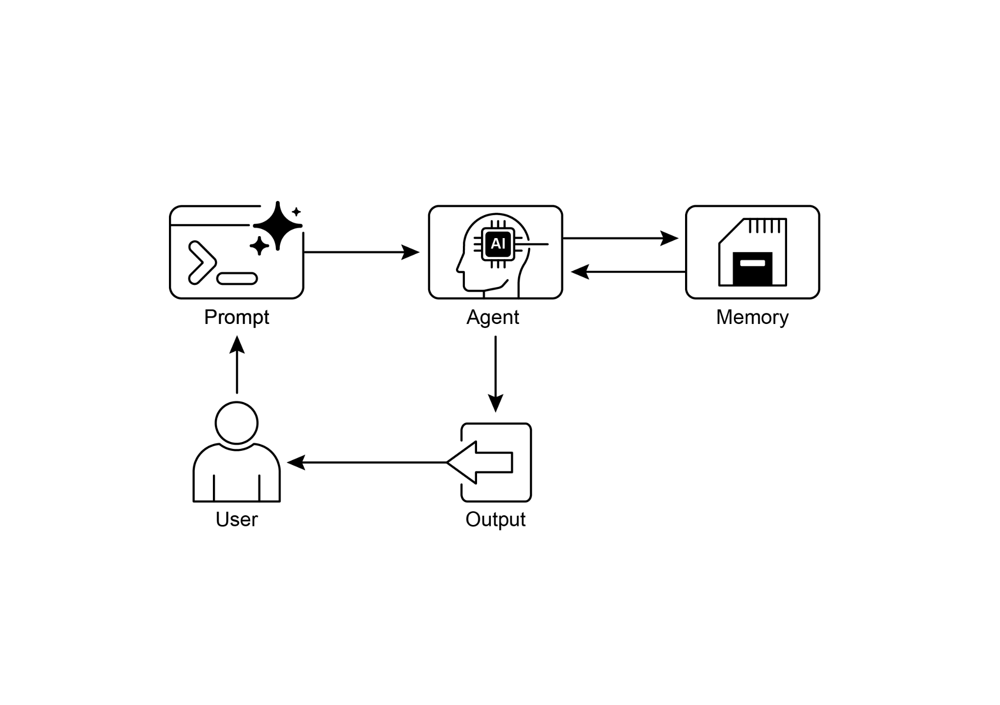

# 第 8 章:記憶管理(Memory Management)

有效的記憶管理(Memory Management)對於智慧代理(intelligent agent)保留資訊至關重要。代理就像人類一樣,需要不同類型的記憶才能有效率地運作。本章將深入探討記憶管理,特別著重在代理對即時(短期)記憶與持久(長期)記憶的需求。

在代理系統中,記憶指的是代理保留並運用「過往互動、觀察與學習經驗」之資訊的能力。這項能力讓代理能做出明智的決策、維持對話情境,並隨時間推移而持續改善。代理的記憶大致可分為兩大類:

- **短期記憶(Short-Term Memory,情境記憶):** 類似於工作記憶(working memory),這類記憶保存著當下正在處理或最近存取過的資訊。對於使用大型語言模型(LLM)的代理而言,短期記憶主要存在於情境視窗(context window)之中。這個視窗包含當前互動中最近的訊息、代理的回覆、工具使用的結果,以及代理的反思,這些全都會影響 LLM 後續的回應與行動。情境視窗的容量有限,限制了代理可直接存取之最近資訊的數量。有效率的短期記憶管理,在於把最相關的資訊保留在這個有限的空間裡,做法可能包括摘要較舊的對話片段,或是強調關鍵細節等技巧。具備「長情境(long context)」視窗之模型的問世,只是單純地擴大了這種短期記憶的容量,讓單次互動中能容納更多資訊。然而,這種情境仍是短暫(ephemeral)的,一旦工作階段(session)結束便會遺失,而且每次都要處理它,成本高昂又缺乏效率。因此,代理需要另外的記憶類型,才能達成真正的持久性、回想起過往互動的資訊,並建立起持久的知識庫。

- **長期記憶(Long-Term Memory,持久記憶):** 這類記憶扮演著資訊儲存庫的角色,用以存放代理在各種互動、任務或長時間跨度中都需要保留的資訊,類似於長期知識庫。資料通常儲存在代理當下處理環境之外,常見於資料庫、知識圖譜(knowledge graph)或向量資料庫(vector database)。在向量資料庫中,資訊會被轉換成數值向量(numerical vector)並加以儲存,使代理能夠依據語意相似度(semantic similarity)而非精確的關鍵字比對來檢索資料,這個過程稱為語意搜尋(semantic search)。當代理需要來自長期記憶的資訊時,它會查詢外部儲存空間、檢索出相關資料,並把它整合進短期情境中以供即時使用,如此便把先前的知識與當前的互動結合起來。

## 實務應用與使用案例

記憶管理對於代理追蹤資訊並隨時間推移地展現智慧行為至關重要,這也是代理超越基本問答能力的關鍵。應用包括:

- **聊天機器人與對話式 AI(Chatbots and Conversational AI):** 維持對話流程仰賴短期記憶。聊天機器人需要記住先前的使用者輸入,才能提供連貫的回應。長期記憶則讓聊天機器人能回想起使用者的偏好、過去的問題或先前的討論,從而提供個人化且連續的互動。

- **任務導向代理(Task-Oriented Agents):** 管理多步驟任務的代理,需要短期記憶來追蹤先前的步驟、當前的進度,以及整體的目標。這類資訊可能存放在任務的情境中,或是暫時性的儲存空間裡。長期記憶則對於存取「不在當下情境中」的特定使用者相關資料至關重要。

- **個人化體驗(Personalized Experiences):** 提供量身打造之互動的代理,會運用長期記憶來儲存並檢索使用者偏好、過往行為與個人資訊。這讓代理能夠調整其回應與建議。

- **學習與改善(Learning and Improvement):** 代理可以透過從過往互動中學習來精進自身表現。成功的策略、犯過的錯誤以及新的資訊,都會被儲存在長期記憶中,以促成未來的調適。強化學習(reinforcement learning)代理便是以這種方式儲存所學到的策略或知識。

- **資訊檢索(Information Retrieval,RAG):** 用於回答問題的代理會存取知識庫(也就是它的長期記憶),這通常是透過檢索增強生成(Retrieval Augmented Generation,RAG)來實作。代理會檢索出相關的文件或資料,以輔助其回應。

- **自主系統(Autonomous Systems):** 機器人或自動駕駛車輛需要記憶來儲存地圖、路線、物體位置以及學習到的行為。這牽涉到用於掌握即時周遭環境的短期記憶,以及用於儲存一般環境知識的長期記憶。

記憶讓代理能夠維持歷史紀錄、進行學習、個人化互動,並處理複雜、隨時間變化的問題。

## 動手實作:Google Agent Developer Kit(ADK)中的記憶管理

Google Agent Developer Kit(ADK)提供了一套結構化的方法來管理情境與記憶,並內含可供實務應用的元件。要建構出需要保留資訊的代理,紮實地掌握 ADK 的 Session、State 與 Memory 至關重要。

就如同人類互動一般,代理需要具備回想起先前交流內容的能力,才能進行連貫且自然的對話。ADK 透過三個核心概念及其相關的服務,簡化了情境管理。

與代理的每一次互動,都可以被視為一個獨特的對話執行緒(conversation thread)。代理可能需要存取來自先前互動的資料。ADK 把這套機制建構如下:

- **Session(工作階段):** 一個獨立的聊天執行緒,記錄該次特定互動的訊息與動作(Events),同時也儲存與該對話相關的暫時性資料(State)。
- **State(`session.state`):** 儲存在某個 Session 之內的資料,包含僅與當前作用中之聊天執行緒相關的資訊。
- **Memory(記憶):** 一個可供搜尋的資訊儲存庫,其資訊來源為各種過往的聊天或外部來源,作為一種「超越當下對話」之資料檢索的資源。

ADK 提供了專責的服務,用以管理建構複雜、具狀態(stateful)且具情境感知之代理所不可或缺的關鍵元件。`SessionService` 負責管理聊天執行緒(Session 物件),處理它們的啟動、記錄與終止;而 `MemoryService` 則負責監管長期知識(Memory)的儲存與檢索。

`SessionService` 與 `MemoryService` 都提供了多種設定選項,讓使用者能依據應用需求選擇儲存方式。系統提供了用於測試目的的記憶體內(in-memory)選項,不過這類資料無法在重新啟動後保留。為了達成持久儲存與可擴展性,ADK 也支援以資料庫與雲端為基礎的服務。

### Session:追蹤每一段聊天

ADK 中的 Session 物件,是設計用來追蹤並管理個別的聊天執行緒。當與代理啟動一段對話時,`SessionService` 會產生一個 Session 物件,以 `google.adk.sessions.Session` 表示。這個物件封裝了與某段特定對話執行緒相關的所有資料,包括唯一識別碼(`id`、`app_name`、`user_id`)、以 Event 物件呈現的依時間排序之事件紀錄、一個用於存放工作階段專屬暫時性資料(稱為 state)的儲存區,以及一個指出最後更新時間的時間戳記(`last_update_time`)。

開發者通常是透過 `SessionService` 間接地與 Session 物件互動。`SessionService` 負責管理對話工作階段的生命週期,這包括啟動新的工作階段、回復(resume)先前的工作階段、記錄工作階段的活動(包含狀態更新)、辨識作用中的工作階段,以及管理工作階段資料的移除。ADK 提供了數種 `SessionService` 實作,對於工作階段歷史與暫時性資料採用不同的儲存機制,例如 `InMemorySessionService`,它適合用於測試,但無法在應用程式重新啟動後維持資料的持久性。

```python
# 範例:使用 InMemorySessionService
# 這適合用於本機開發與測試,在不需要「資料於應用程式重新啟動後
# 仍持久存在」的情況下使用。
from google.adk.sessions import InMemorySessionService
session_service = InMemorySessionService()
```

接著,如果你想要可靠地儲存到自己管理的資料庫中,可以使用 `DatabaseSessionService`。

```python
# 範例:使用 DatabaseSessionService
# 這適合用於正式環境(production),或是需要持久儲存的開發環境。
# 你需要設定一個資料庫 URL(例如 SQLite、PostgreSQL 等)。
# 需要:pip install google-adk[sqlalchemy] 以及一個資料庫驅動程式
# (例如用於 PostgreSQL 的 psycopg2)
from google.adk.sessions import DatabaseSessionService
# 使用本機 SQLite 檔案的範例:
db_url = "sqlite:///./my_agent_data.db"
session_service = DatabaseSessionService(db_url=db_url)
```

此外,還有 `VertexAiSessionService`,它運用 Vertex AI 基礎設施,在 Google Cloud 上進行可擴展的正式環境部署。

```python
# 範例:使用 VertexAiSessionService
# 這適合用於 Google Cloud Platform 上可擴展的正式環境部署,
# 運用 Vertex AI 基礎設施來進行工作階段管理。
# 需要:pip install google-adk[vertexai] 以及 GCP 的設定與身分驗證
from google.adk.sessions import VertexAiSessionService
PROJECT_ID = "your-gcp-project-id" # 替換成你的 GCP 專案 ID
LOCATION = "us-central1" # 替換成你想要的 GCP 位置
# 與此服務搭配使用的 app_name 應對應到 Reasoning Engine 的 ID 或名稱
REASONING_ENGINE_APP_NAME = "projects/your-gcp-project-id/locations/us-central1/reasoningEngines/your-engine-id" # 替換成你的 Reasoning Engine 資源名稱
session_service = VertexAiSessionService(project=PROJECT_ID, location=LOCATION)
# 使用此服務時,請把 REASONING_ENGINE_APP_NAME 傳遞給各個服務方法:
# session_service.create_session(app_name=REASONING_ENGINE_APP_NAME, ...)
# session_service.get_session(app_name=REASONING_ENGINE_APP_NAME, ...)
# session_service.append_event(session, event, app_name=REASONING_ENGINE_APP_NAME)
# session_service.delete_session(app_name=REASONING_ENGINE_APP_NAME, ...)
```

選擇一個合適的 `SessionService` 至關重要,因為它決定了代理的互動歷史與暫時性資料如何被儲存,以及它們的持久性。

每一次訊息交換都涉及一個循環的過程:接收到一則訊息後,Runner 會使用 `SessionService` 來檢索或建立一個 Session;代理運用該 Session 的情境(state 與歷史互動)處理該訊息;代理生成回應,並可能更新 state;Runner 把這整個過程封裝成一個 Event;`session_service.append_event` 方法則記錄這個新的事件,並更新儲存空間中的 state。接著 Session 便等待下一則訊息。理想情況下,當互動結束時,會使用 `delete_session` 方法來終止該工作階段。這個過程說明了 `SessionService` 如何透過管理「Session 專屬的歷史與暫時性資料」來維持連續性。

### State:Session 的暫存便條本

在 ADK 中,每一個代表聊天執行緒的 Session,都包含一個 state 元件,類似於代理在該段特定對話期間的暫時性工作記憶。`session.events` 記錄的是整段聊天歷史,而 `session.state` 則儲存並更新與作用中聊天相關的動態資料點。

從根本上說,`session.state` 的運作方式就像一個字典(dictionary),以鍵值對(key-value pair)的形式儲存資料。它的核心功能是讓代理能夠保留並管理「連貫對話所需的關鍵細節」,例如使用者偏好、任務進度、漸進式的資料蒐集,或是影響代理後續行動的條件旗標(conditional flag)。

State 的結構由「字串鍵」搭配「可序列化(serializable)之 Python 型別的值」所組成,這些型別包括字串、數字、布林值、串列(list),以及包含這些基本型別的字典。State 是動態的,會在整段對話過程中不斷演變。這些變更的持久程度,則取決於所設定的 `SessionService`。

可以運用鍵的前綴(key prefix)來組織 State,以界定資料的作用範圍與持久性。沒有前綴的鍵是工作階段專屬的。

- `user:` 前綴會把資料與某個使用者 ID 關聯起來,橫跨該使用者的所有工作階段。
- `app:` 前綴指定的是「在應用程式所有使用者之間共享」的資料。
- `temp:` 前綴表示「僅在當前處理回合(turn)中有效」的資料,且不會被持久儲存。

代理透過單一的 `session.state` 字典存取所有的 state 資料。`SessionService` 負責處理資料的檢索、合併與持久化。State 應該在透過 `session_service.append_event()` 把一個 Event 加入工作階段歷史時一併更新。這能確保準確的追蹤、在持久性服務中得到妥善的儲存,以及對狀態變更的安全處理。

1. **簡易做法:使用 `output_key`(用於代理的文字回覆):** 如果你只是想把代理最終的文字回應直接存進 state 中,這是最簡單的方法。當你設定 `LlmAgent` 時,只要告訴它你想使用的 `output_key` 即可。Runner 看到這個設定後,會在它附加事件時,自動建立把回應存入 state 所需的動作。讓我們來看一個透過 `output_key` 更新 state 的程式碼範例。

```python
# 從 Google Agent Developer Kit(ADK)匯入必要的類別
from google.adk.agents import LlmAgent
from google.adk.sessions import InMemorySessionService, Session
from google.adk.runners import Runner
from google.genai.types import Content, Part

# 定義一個帶有 output_key 的 LlmAgent。
greeting_agent = LlmAgent(
    name="Greeter",
    model="gemini-2.0-flash",
    # 提示詞中譯:產生一段簡短、友善的問候語。
    instruction="Generate a short, friendly greeting.",
    output_key="last_greeting"
)

# --- 設定 Runner 與 Session ---
app_name, user_id, session_id = "state_app", "user1", "session1"
session_service = InMemorySessionService()
runner = Runner(
    agent=greeting_agent,
    app_name=app_name,
    session_service=session_service
)
session = session_service.create_session(
    app_name=app_name,
    user_id=user_id,
    session_id=session_id
)
print(f"Initial state: {session.state}")

# --- 執行代理 ---
user_message = Content(parts=[Part(text="Hello")])
print("\n--- Running the agent ---")
for event in runner.run(
    user_id=user_id,
    session_id=session_id,
    new_message=user_message
):
    if event.is_final_response():
        print("Agent responded.")

# --- 檢查更新後的 State ---
# 在 runner 處理完所有事件「之後」,才正確地檢查 state。
updated_session = session_service.get_session(app_name, user_id, session_id)
print(f"\nState after agent run: {updated_session.state}")
```

在幕後,Runner 看到你的 `output_key` 後,會在它呼叫 `append_event` 時,自動建立帶有 `state_delta` 的必要動作。

2. **標準做法:使用 `EventActions.state_delta`(用於較複雜的更新):** 當你需要做一些較複雜的事情時——例如同時更新多個鍵、儲存不只是文字的東西、鎖定特定的作用範圍(像是 `user:` 或 `app:`),或是進行「不與代理最終文字回覆綁定」的更新——你就要手動建構一個包含你所有狀態變更的字典(也就是 `state_delta`),並把它納入你所附加之 Event 的 `EventActions` 中。讓我們來看一個範例:

```python
import time
from google.adk.tools.tool_context import ToolContext
from google.adk.sessions import InMemorySessionService

# --- 定義建議採用的「以工具為基礎」的做法 ---
def log_user_login(tool_context: ToolContext) -> dict:
    """
    在使用者登入事件發生時更新工作階段狀態。
    這個工具封裝了所有與使用者登入相關的狀態變更。

    Args:
        tool_context: 由 ADK 自動提供,讓我們能存取工作階段狀態。

    Returns:
        一個確認該動作成功的字典。
    """
    # 透過所提供的 context 直接存取 state。
    state = tool_context.state

    # 取得目前的值或預設值,接著更新 state。
    # 這樣的寫法乾淨許多,也把相關邏輯集中在一處。
    login_count = state.get("user:login_count", 0) + 1
    state["user:login_count"] = login_count
    state["task_status"] = "active"
    state["user:last_login_ts"] = time.time()
    state["temp:validation_needed"] = True

    print("State updated from within the `log_user_login` tool.")

    return {
        "status": "success",
        "message": f"User login tracked. Total logins: {login_count}."
    }

# --- 用法示範 ---
# 在實際應用中,會由一個 LLM 代理決定要呼叫這個工具。
# 在這裡,我們為了示範目的,模擬一次直接呼叫。

# 1. 設定
session_service = InMemorySessionService()
app_name, user_id, session_id = "state_app_tool", "user3", "session3"
session = session_service.create_session(
    app_name=app_name,
    user_id=user_id,
    session_id=session_id,
    state={"user:login_count": 0, "task_status": "idle"}
)
print(f"Initial state: {session.state}")

# 2. 模擬一次工具呼叫(在實際應用中,由 ADK Runner 執行此動作)
# 我們僅為了這個獨立範例而手動建立一個 ToolContext。
from google.adk.tools.tool_context import InvocationContext
mock_context = ToolContext(
    invocation_context=InvocationContext(
        app_name=app_name, user_id=user_id, session_id=session_id,
        session=session, session_service=session_service
    )
)

# 3. 執行工具
log_user_login(mock_context)

# 4. 檢查更新後的 state
updated_session = session_service.get_session(app_name, user_id, session_id)
print(f"State after tool execution: {updated_session.state}")

# 預期的輸出會顯示出與「之前(Before)」情況相同的狀態變更,
# 但程式碼的組織方式明顯更乾淨、更穩健。
```

這段程式碼示範了一種「以工具為基礎」的做法,用以管理應用程式中的使用者工作階段狀態。它定義了一個函式 `log_user_login`,作為一個工具。這個工具負責在使用者登入時更新工作階段狀態。

這個函式接收一個由 ADK 提供的 `ToolContext` 物件,以存取並修改工作階段的 state 字典。在這個工具內部,它會遞增 `user:login_count`、把 `task_status` 設為 `"active"`、記錄 `user:last_login_ts`(時間戳記),並加入一個暫時性旗標 `temp:validation_needed`。

程式碼的示範部分模擬了這個工具會如何被使用。它設定了一個記憶體內的工作階段服務,並建立了一個帶有若干預先定義之狀態的初始工作階段。接著手動建立一個 `ToolContext`,以模擬 ADK Runner 執行該工具時所處的環境。`log_user_login` 函式便以這個模擬 context 被呼叫。最後,程式碼再次檢索該工作階段,以顯示其狀態已被該工具的執行所更新。此處的目的是要展示:相較於在工具之外直接操作 state,把狀態變更封裝在工具之內,能讓程式碼更乾淨、更有條理。

請注意,在檢索一個工作階段之後直接修改 `session.state` 字典是強烈不建議的,因為這會繞過標準的事件處理機制。這類直接的變更不會被記錄在工作階段的事件歷史中、可能不會被所選的 `SessionService` 持久化、可能導致並行(concurrency)問題,而且也不會更新時間戳記等重要的中介資料(metadata)。更新工作階段狀態建議採用的方法是:在 `LlmAgent` 上使用 `output_key` 參數(專門用於代理最終的文字回應),或是在透過 `session_service.append_event()` 附加事件時,把狀態變更納入 `EventActions.state_delta` 之中。`session.state` 應主要用於讀取既有的資料。

總結來說,在設計你的 state 時,請保持簡單、使用基本資料型別、為你的鍵取清楚的名稱並正確使用前綴、避免深層的巢狀結構,並且務必使用 `append_event` 的流程來更新 state。

### Memory:以 MemoryService 管理長期知識

在代理系統中,Session 元件維護著當前聊天歷史(events)以及某段單一對話專屬的暫時性資料(state)。然而,為了讓代理能跨多次互動保留資訊,或是存取外部資料,長期知識管理是必要的。這項工作便是由 `MemoryService` 來促成。

```python
# 範例:使用 InMemoryMemoryService
# 這適合用於本機開發與測試,在不需要「資料於應用程式重新啟動後
# 仍持久存在」的情況下使用。
# 當應用程式停止時,記憶內容就會遺失。
from google.adk.memory import InMemoryMemoryService
memory_service = InMemoryMemoryService()
```

Session 與 State 可以被理解為單一聊天工作階段的短期記憶,而由 `MemoryService` 管理的長期知識(Long-Term Knowledge)則扮演著一個持久且可供搜尋之儲存庫的角色。這個儲存庫可能包含來自多次過往互動或外部來源的資訊。`MemoryService`(由 `BaseMemoryService` 介面所定義)為「管理這種可供搜尋的長期知識」確立了一套標準。它的主要功能包括:新增資訊,這牽涉到從一個工作階段中擷取內容,並使用 `add_session_to_memory` 方法加以儲存;以及檢索資訊,這讓代理能夠使用 `search_memory` 方法查詢該儲存庫並接收相關資料。

ADK 提供了數種實作來建立這個長期知識儲存庫。`InMemoryMemoryService` 提供了一個適合測試目的的暫時性儲存方案,但資料不會在應用程式重新啟動後保留下來。對於正式環境,通常會採用 `VertexAiRagMemoryService`。這項服務運用 Google Cloud 的檢索增強生成(RAG)服務,可達成可擴展、持久且具語意搜尋能力的檢索(此外,亦可參閱第 14 章關於 RAG 的內容)。

```python
# 範例:使用 VertexAiRagMemoryService
# 這適合用於 GCP 上可擴展的正式環境部署,運用
# Vertex AI RAG(檢索增強生成)來達成持久、可供搜尋的記憶。
# 需要:pip install google-adk[vertexai]、GCP 的設定與身分驗證,
# 以及一個 Vertex AI RAG Corpus(語料庫)。
from google.adk.memory import VertexAiRagMemoryService
# 你的 Vertex AI RAG Corpus 的資源名稱
RAG_CORPUS_RESOURCE_NAME = "projects/your-gcp-project-id/locations/us-central1/ragCorpora/your-corpus-id" # 替換成你的 Corpus 資源名稱
# 用於檢索行為的選擇性設定
SIMILARITY_TOP_K = 5 # 要檢索的前幾筆結果數量
VECTOR_DISTANCE_THRESHOLD = 0.7 # 向量相似度的門檻
memory_service = VertexAiRagMemoryService(
    rag_corpus=RAG_CORPUS_RESOURCE_NAME,
    similarity_top_k=SIMILARITY_TOP_K,
    vector_distance_threshold=VECTOR_DISTANCE_THRESHOLD
)
# 使用此服務時,add_session_to_memory 與 search_memory 等方法
# 會與所指定的 Vertex AI RAG Corpus 互動。
```

## 動手實作:LangChain 與 LangGraph 中的記憶管理

在 LangChain 與 LangGraph 中,記憶(Memory)是建立「智慧且具自然感受之對話式應用」的關鍵元件。它讓 AI 代理能記住來自過往互動的資訊、從回饋中學習,並適應使用者的偏好。LangChain 的記憶功能為此奠定了基礎,做法是參考所儲存的歷史以豐富當前的提示,接著再記錄下最新的交流以供日後使用。隨著代理處理愈來愈複雜的任務,這項能力對於效率與使用者滿意度而言都變得不可或缺。

**短期記憶(Short-Term Memory):** 這是以執行緒為範圍(thread-scoped)的,意思是它追蹤的是單一工作階段或執行緒內進行中的對話。它提供即時的情境,但完整的歷史可能會對 LLM 的情境視窗構成挑戰,進而可能導致錯誤或低落的效能。LangGraph 把短期記憶作為代理狀態(state)的一部分來管理,並透過一個檢查點機制(checkpointer)加以持久化,讓某個執行緒能夠隨時被回復。

**長期記憶(Long-Term Memory):** 這類記憶跨工作階段儲存使用者專屬或應用程式層級的資料,並在不同的對話執行緒之間共享。它儲存在自訂的「命名空間(namespace)」中,可以在任何執行緒、於任何時候被回想起來。LangGraph 提供了儲存庫(store)來儲存並回想長期記憶,使代理能夠無限期地保留知識。

LangChain 提供了數種管理對話歷史的工具,範圍從手動控制,到在鏈(chain)中的自動化整合都有。

`ChatMessageHistory`:手動記憶管理。對於在正式的鏈之外,要對某段對話的歷史進行直接而簡單的控制,`ChatMessageHistory` 類別是理想之選。它允許手動追蹤對話的交流。

```python
from langchain.memory import ChatMessageHistory
# 初始化歷史物件
history = ChatMessageHistory()
# 加入使用者與 AI 的訊息
history.add_user_message("I'm heading to New York next week.")
history.add_ai_message("Great! It's a fantastic city.")
# 存取訊息串列
print(history.messages)
```

`ConversationBufferMemory`:用於鏈的自動化記憶。要把記憶直接整合進鏈中,`ConversationBufferMemory` 是常見的選擇。它持有一個對話的緩衝區(buffer),並把它提供給你的提示。它的行為可以透過兩個關鍵參數來自訂:

- `memory_key`:一個字串,指定你提示中要用來存放聊天歷史的變數名稱。它的預設值為 `"history"`。
- `return_messages`:一個布林值,決定歷史的格式。
  - 若為 `False`(預設值),它會回傳單一格式化過的字串,這對於標準的 LLM 而言是理想的。
  - 若為 `True`,它會回傳一個訊息物件的串列,這是用於聊天模型(Chat Models)的建議格式。

```python
from langchain.memory import ConversationBufferMemory
# 初始化記憶
memory = ConversationBufferMemory()
# 儲存一輪對話
memory.save_context({"input": "What's the weather like?"}, {"output": "It's sunny today."})
# 以字串形式載入記憶
print(memory.load_memory_variables({}))
```

把這個記憶整合進一個 `LLMChain` 中,能讓模型存取對話的歷史,並提供與情境相關的回應。

```python
from langchain_openai import OpenAI
from langchain.chains import LLMChain
from langchain.prompts import PromptTemplate
from langchain.memory import ConversationBufferMemory

# 1. 定義 LLM 與提示
llm = OpenAI(temperature=0)
# 提示詞中譯:
# 你是一位樂於助人的旅遊專員。
# 先前的對話:
# {history}
# 新的問題:{question}
# 回應:
template = """You are a helpful travel agent.
Previous conversation:
{history}
New question: {question}
Response:"""
prompt = PromptTemplate.from_template(template)

# 2. 設定記憶
# memory_key "history" 與提示中的變數相符
memory = ConversationBufferMemory(memory_key="history")

# 3. 建構鏈
conversation = LLMChain(llm=llm, prompt=prompt, memory=memory)

# 4. 執行對話
response = conversation.predict(question="I want to book a flight.")
print(response)
response = conversation.predict(question="My name is Sam, by the way.")
print(response)
response = conversation.predict(question="What was my name again?")
print(response)
```

為了讓聊天模型發揮更好的效果,建議透過設定 `return_messages=True` 來使用結構化的訊息物件串列。

```python
from langchain_openai import ChatOpenAI
from langchain.chains import LLMChain
from langchain.memory import ConversationBufferMemory
from langchain_core.prompts import (
    ChatPromptTemplate,
    MessagesPlaceholder,
    SystemMessagePromptTemplate,
    HumanMessagePromptTemplate,
)

# 1. 定義聊天模型與提示
llm = ChatOpenAI()
prompt = ChatPromptTemplate(
    messages=[
        # 提示詞中譯:你是一位友善的助理。
        SystemMessagePromptTemplate.from_template("You are a friendly assistant."),
        MessagesPlaceholder(variable_name="chat_history"),
        HumanMessagePromptTemplate.from_template("{question}")
    ]
)

# 2. 設定記憶
# return_messages=True 對聊天模型而言是不可或缺的
memory = ConversationBufferMemory(memory_key="chat_history", return_messages=True)

# 3. 建構鏈
conversation = LLMChain(llm=llm, prompt=prompt, memory=memory)

# 4. 執行對話
response = conversation.predict(question="Hi, I'm Jane.")
print(response)
response = conversation.predict(question="Do you remember my name?")
print(response)
```

**長期記憶的類型:** 長期記憶讓系統能夠跨不同的對話保留資訊,提供更深層次的情境與個人化。它可以類比於人類記憶,拆解成三種類型:

- **語意記憶(Semantic Memory):記住事實:** 這牽涉到保留特定的事實與概念,例如使用者偏好或領域知識。它被用來為代理的回應提供事實依據(ground),從而帶來更個人化、更相關的互動。這類資訊可以被管理成一份持續更新的使用者「設定檔(profile)」(一份 JSON 文件),或是一個由個別事實文件構成的「集合(collection)」。
- **情節記憶(Episodic Memory):記住經驗:** 這牽涉到回想起過去的事件或動作。對 AI 代理而言,情節記憶經常被用來記住「如何完成某項任務」。在實務上,它常透過少樣本範例提示(few-shot example prompting)來實作,讓代理從過往成功的互動序列中學習,以正確地執行任務。
- **程序記憶(Procedural Memory):記住規則:** 這是關於「如何執行任務」的記憶——也就是代理的核心指令與行為,通常包含在它的系統提示(system prompt)中。代理修改自己的提示以進行調適與改善是很常見的。一種有效的技巧是「反思(Reflection)」,做法是把代理當前的指令與最近的互動提供給它,然後要求它精煉自己的指令。

以下是一段虛擬碼(pseudo-code),示範代理可能如何運用反思來更新它儲存在 LangGraph `BaseStore` 中的程序記憶。

```python
# 更新代理指令的節點(node)
def update_instructions(state: State, store: BaseStore):
    namespace = ("instructions",)
    # 從 store 中取得當前的指令
    current_instructions = store.search(namespace)[0]
    # 建立一個提示,要求 LLM 對這段對話進行反思,
    # 並生成新的、改進過的指令
    prompt = prompt_template.format(
        instructions=current_instructions.value["instructions"],
        conversation=state["messages"]
    )
    # 從 LLM 取得新的指令
    output = llm.invoke(prompt)
    new_instructions = output['new_instructions']
    # 把更新後的指令存回 store 中
    store.put(("agent_instructions",), "agent_a", {"instructions": new_instructions})

# 使用指令來生成回應的節點
def call_model(state: State, store: BaseStore):
    namespace = ("agent_instructions", )
    # 從 store 中檢索出最新的指令
    instructions = store.get(namespace, key="agent_a")[0]
    # 使用檢索出的指令來格式化提示
    prompt = prompt_template.format(instructions=instructions.value["instructions"])
    # ... 應用程式邏輯繼續進行
```

LangGraph 把長期記憶以 JSON 文件的形式儲存在一個 store 中。每一則記憶都被組織在一個自訂的命名空間(像是資料夾)以及一個獨特的鍵(像是檔名)之下。這種階層式結構讓資訊的組織與檢索變得容易。以下程式碼示範如何使用 `InMemoryStore` 來放入(put)、取得(get)與搜尋(search)記憶。

```python
from langgraph.store.memory import InMemoryStore

# 一個真實嵌入函式(embedding function)的佔位替身
def embed(texts: list[str]) -> list[list[float]]:
    # 在實際應用中,請使用適當的嵌入模型
    return [[1.0, 2.0] for _ in texts]

# 初始化一個記憶體內 store。在正式環境中,請使用以資料庫為後盾的 store。
store = InMemoryStore(index={"embed": embed, "dims": 2})

# 為特定的使用者與應用程式情境定義一個命名空間
user_id = "my-user"
application_context = "chitchat"
namespace = (user_id, application_context)

# 1. 把一則記憶放入 store 中
store.put(
    namespace,
    "a-memory", # 這則記憶的鍵
    {
        "rules": [
            "User likes short, direct language",
            "User only speaks English & python",
        ],
        "my-key": "my-value",
    },
)

# 2. 透過命名空間與鍵取得這則記憶
item = store.get(namespace, "a-memory")
print("Retrieved Item:", item)

# 3. 在命名空間中搜尋記憶,依內容過濾
#    並依與查詢的向量相似度排序。
items = store.search(
    namespace,
    filter={"my-key": "my-value"},
    query="language preferences"
)
print("Search Results:", items)
```

## Vertex Memory Bank

Memory Bank 是 Vertex AI Agent Engine 中的一項受管理服務(managed service),為代理提供持久的長期記憶。這項服務運用 Gemini 模型,以非同步(asynchronously)的方式分析對話歷史,以擷取出關鍵事實與使用者偏好。

這些資訊會被持久地儲存、依照像是使用者 ID 這樣定義好的範圍加以組織,並被智慧地更新,以整併新資料並化解相互矛盾之處。在開始一個新的工作階段時,代理會透過「完整的資料回想」或「使用嵌入向量的相似度搜尋」來檢索相關的記憶。這個過程讓代理能跨工作階段維持連續性,並依據所回想起的資訊來個人化其回應。

代理的 runner 會與 `VertexAiMemoryBankService` 互動,這個服務會先被初始化。它負責自動儲存代理對話過程中所產生的記憶。每一則記憶都會被標記上一個獨特的 `USER_ID` 與 `APP_NAME`,以確保未來能準確地檢索。

```python
from google.adk.memory import VertexAiMemoryBankService
agent_engine_id = agent_engine.api_resource.name.split("/")[-1]
memory_service = VertexAiMemoryBankService(
    project="PROJECT_ID",
    location="LOCATION",
    agent_engine_id=agent_engine_id
)
session = await session_service.get_session(
    app_name=app_name,
    user_id="USER_ID",
    session_id=session.id
)
await memory_service.add_session_to_memory(session)
```

Memory Bank 與 Google ADK 能無縫整合,提供開箱即用的即時體驗。對於使用其他代理框架(例如 LangGraph 與 CrewAI)的使用者,Memory Bank 也透過直接的 API 呼叫提供支援。示範這些整合方式的線上程式碼範例,有興趣的讀者都能輕易取得。

## 重點速覽

**是什麼(What):** 代理系統需要記住來自過往互動的資訊,才能執行複雜的任務並提供連貫的體驗。若沒有記憶機制,代理便是無狀態(stateless)的,無法維持對話情境、無法從經驗中學習,也無法為使用者個人化其回應。這從根本上把它們侷限於簡單的、一次性(one-shot)的互動,無法處理多步驟的流程或不斷演變的使用者需求。核心問題在於:如何有效地同時管理「單一對話的即時、暫時性資訊」與「隨時間累積之龐大、持久的知識」。

**為什麼(Why):** 標準化的解法是實作一套雙元件的記憶系統,以區分短期與長期儲存。短期的情境記憶,把最近的互動資料保存在 LLM 的情境視窗中,以維持對話流程。對於必須持久存在的資訊,長期記憶解決方案則使用外部資料庫(通常是向量儲存庫)來進行高效率的語意檢索。像 Google ADK 這樣的代理框架,提供了特定的元件來管理這套機制,例如用於對話執行緒的 Session,以及用於其暫時性資料的 State。另有一個專責的 MemoryService,用以與長期知識庫對接,讓代理能檢索並把相關的過往資訊納入其當前的情境之中。

**經驗法則(Rule of thumb):** 當一個代理需要做的不只是回答單一問題時,就使用此模式。對於那些必須在整段對話中維持情境、追蹤多步驟任務之進度,或是透過回想使用者偏好與歷史來個人化互動的代理而言,此模式不可或缺。每當預期代理要依據過往的成功、失敗或新取得的資訊來學習或調適時,就應該實作記憶管理。

## 視覺摘要



*圖 1:記憶管理設計模式——使用者(User)送出提示(Prompt)給代理(Agent),代理與記憶(Memory)進行雙向互動,接著產生輸出(Output)回傳給使用者。*

## 重點整理

以下快速回顧關於記憶管理的重點:

- 記憶對於代理追蹤事物、進行學習以及個人化互動而言極為重要。
- 對話式 AI 同時仰賴「用於單一聊天中即時情境」的短期記憶,以及「用於跨多個工作階段之持久知識」的長期記憶。
- 短期記憶(即時的部分)是暫時性的,經常受限於 LLM 的情境視窗,或是框架傳遞情境的方式。
- 長期記憶(會留存下來的部分)使用向量資料庫等外部儲存空間,跨不同的聊天儲存資訊,並透過搜尋來存取。
- 像 ADK 這樣的框架,有特定的部件來管理記憶,例如 Session(聊天執行緒)、State(暫時性聊天資料)以及 MemoryService(可供搜尋的長期知識)。
- ADK 的 `SessionService` 處理一段聊天工作階段的整個生命週期,包括它的歷史(events)與暫時性資料(state)。
- ADK 的 `session.state` 是一個用於暫時性聊天資料的字典。前綴(`user:`、`app:`、`temp:`)告訴你資料屬於何處,以及它是否會留存下來。
- 在 ADK 中,你應該在新增事件時使用 `EventActions.state_delta` 或 `output_key` 來更新 state,而非直接變更 state 字典。
- ADK 的 `MemoryService` 用於把資訊放入長期儲存空間,並讓代理對它進行搜尋,通常會運用工具來達成。
- LangChain 提供了像 `ConversationBufferMemory` 這樣實用的工具,能自動把單一對話的歷史注入提示中,讓代理能回想起即時的情境。
- LangGraph 透過使用一個 store 來儲存並檢索語意事實、情節經驗,甚至是可更新的程序規則,跨不同的使用者工作階段地實現進階的長期記憶。
- Memory Bank 是一項受管理服務,它透過自動擷取、儲存並回想使用者專屬的資訊,為代理提供持久的長期記憶,從而跨 Google ADK、LangGraph 與 CrewAI 等框架,實現個人化、連續的對話。

## 結論

本章深入探討了代理系統中極為重要的記憶管理工作,展示了「短暫的情境」與「會長期留存的知識」之間的區別。我們談到了這些記憶類型如何被建立起來,以及在建構「能記住事物之更聰明代理」時,你會在哪些地方看到它們的應用。我們也詳細地檢視了 Google ADK 如何提供 Session、State 與 MemoryService 等特定部件來處理這項工作。既然我們已涵蓋了代理如何記住事物(短期與長期皆然),接下來便可進入它們如何學習與調適的主題。下一個模式「學習與調適(Learning and Adaptation)」,談的便是代理如何依據新的經驗或資料,改變它思考、行動的方式,或是它所知道的內容。

## 參考資料

1. ADK Memory:<https://google.github.io/adk-docs/sessions/memory/>
2. LangGraph Memory:<https://langchain-ai.github.io/langgraph/concepts/memory/>
3. Vertex AI Agent Engine Memory Bank:<https://cloud.google.com/blog/products/ai-machine-learning/vertex-ai-memory-bank-in-public-preview>
