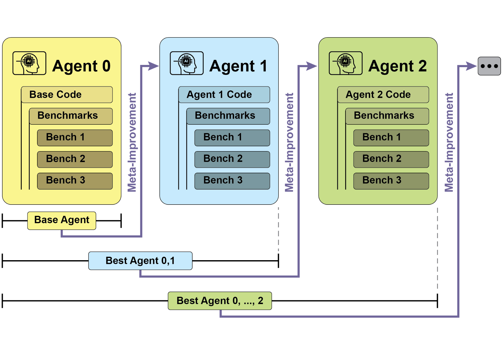
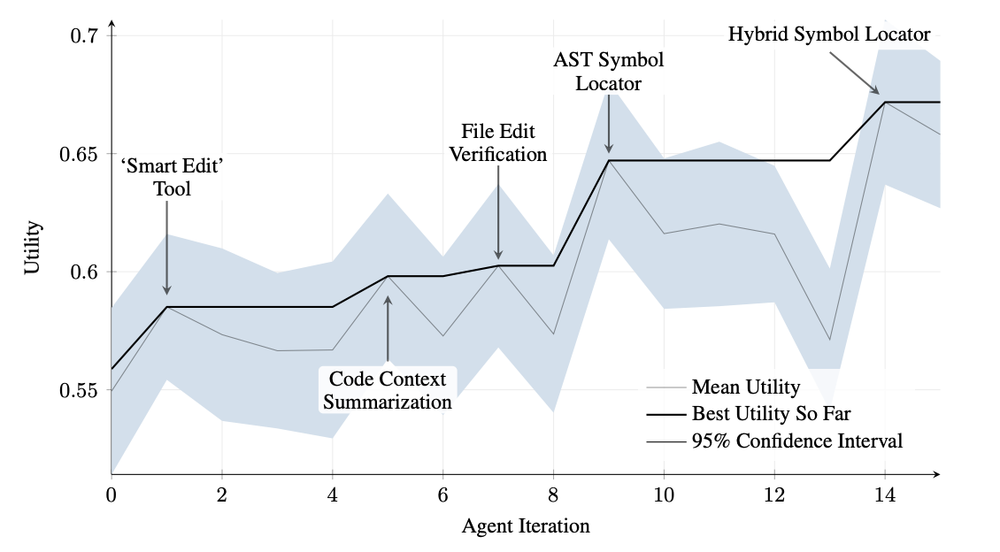
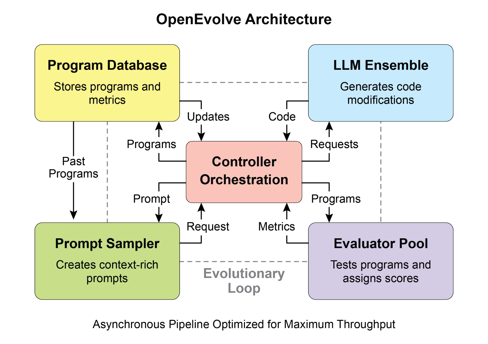
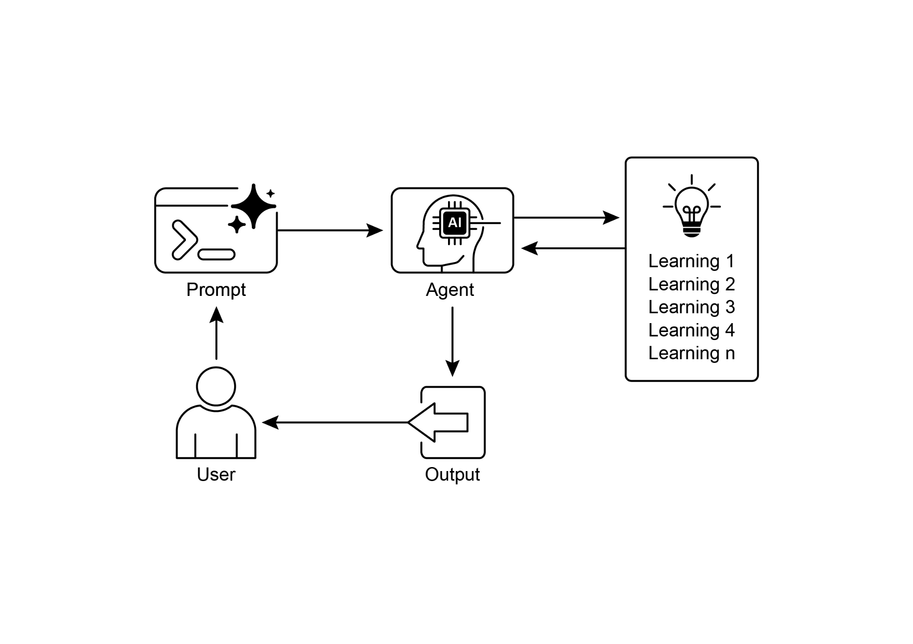

# 第 9 章:學習與適應(Learning and Adaptation)

學習與適應對於提升人工智慧代理(AI agent)的能力至關重要。這些歷程使代理得以超越預先定義的參數而持續演進,讓它們能透過經驗與環境互動自主精進。藉由學習與適應,代理能夠有效因應全新的情境,並在無須持續人工介入的情況下最佳化自身表現。本章將詳細探討支撐代理學習與適應的原理與機制。

## 宏觀圖像

代理會根據新的經驗與資料來改變其思考、行動或知識,藉此進行學習與適應。這讓代理得以從單純遵循指令,逐步演化為隨時間愈來愈聰明的系統。

- **強化學習(Reinforcement Learning):** 代理嘗試各種行動,在正向結果獲得獎勵、負向結果受到懲罰,從而在不斷變動的情境中學會最佳行為。適用於控制機器人或玩遊戲的代理。
- **監督式學習(Supervised Learning):** 代理從有標記的範例中學習,把輸入與期望的輸出連結起來,使其能執行決策與模式辨識等任務。非常適合用於分類電子郵件或預測趨勢的代理。
- **非監督式學習(Unsupervised Learning):** 代理在無標記的資料中發掘隱藏的關聯與模式,有助於洞察、組織,並為其環境建構一幅心智地圖。適用於在沒有特定引導下探索資料的代理。
- **以 LLM 為基礎之代理的少樣本／零樣本學習(Few-Shot/Zero-Shot Learning):** 運用大型語言模型(LLM)的代理,能以極少的範例或清楚的指令,迅速適應新任務,使其能對新指令或新情境快速作出反應。
- **線上學習(Online Learning):** 代理持續以新資料更新知識,這對於在動態環境中即時反應與持續適應至關重要。對於處理連續資料流的代理而言尤為關鍵。
- **以記憶為基礎的學習(Memory-Based Learning):** 代理回想過往經驗,以調整在相似情境下的當前行動,從而強化情境感知與決策能力。對於具備記憶回想能力的代理相當有效。

代理會依據所學,改變其策略、理解或目標來進行適應。對於身處不可預測、不斷變動或全新環境中的代理而言,這一點至關重要。

近端策略最佳化(Proximal Policy Optimization,PPO)是一種強化學習演算法,用於在具有連續動作範圍的環境中訓練代理,例如控制機器人的關節或遊戲中的角色。它的主要目標是可靠且穩定地改進代理的決策策略,亦即其「策略(policy)」。

PPO 背後的核心理念,是對代理的策略進行小幅、謹慎的更新。它避免可能導致表現崩潰的劇烈變動。其運作方式如下:

1. **蒐集資料:** 代理使用其當前策略與環境互動(例如玩一場遊戲),並蒐集一批經驗(狀態、動作、獎勵)。
2. **評估「替代」目標:** PPO 計算某個潛在的策略更新會如何改變預期獎勵。然而,它並非單純地最大化此獎勵,而是使用一種特殊的「裁剪(clipped)」目標函式。
3. **「裁剪」機制:** 這正是 PPO 之所以穩定的關鍵。它在當前策略周圍建立一個「信賴區域(trust region)」或安全區。演算法會被禁止進行與當前策略差異過大的更新。這種裁剪就像一道安全煞車,確保代理不會踏出可能抹煞其學習成果的巨大、高風險的一步。

簡而言之,PPO 在「改善表現」與「貼近已知可行的策略」之間取得平衡,從而避免訓練過程中發生災難性的失敗,並帶來更穩定的學習。

直接偏好最佳化(Direct Preference Optimization,DPO)是一種較新的方法,專為將大型語言模型(LLM)與人類偏好對齊而設計。對於這項任務,它提供了一種比使用 PPO 更簡單、更直接的替代方案。

要理解 DPO,先理解傳統以 PPO 為基礎的對齊方法會有幫助:

- **PPO 做法(兩步驟流程):**
  1. **訓練一個獎勵模型(Reward Model):** 首先,你要蒐集人類回饋資料,讓人們對不同的 LLM 回應進行評分或比較(例如「回應 A 比回應 B 更好」)。這些資料被用來訓練另一個獨立的 AI 模型,稱為獎勵模型,其任務是預測人類會給任何新回應打出什麼樣的分數。
  2. **以 PPO 進行微調(Fine-Tune):** 接著,使用 PPO 對 LLM 進行微調。LLM 的目標是生成能從獎勵模型那裡獲得盡可能高分的回應。在這場訓練賽局中,獎勵模型扮演著「裁判」的角色。

這個兩步驟流程可能既複雜又不穩定。舉例來說,LLM 也許會找到漏洞,學會「駭入(hack)」獎勵模型,讓糟糕的回應反而拿到高分。

- **DPO 做法(直接流程):** DPO 完全跳過獎勵模型。它不把人類偏好轉譯成獎勵分數、再針對該分數進行最佳化,而是直接運用偏好資料來更新 LLM 的策略。
- 它的運作方式,是利用一種把偏好資料直接連結到最佳策略的數學關係。它本質上是在教導模型:「提高生成『與被偏好者相似之回應』的機率,並降低生成『與不被青睞者相似之回應』的機率。」

本質上,DPO 透過直接在人類偏好資料上對語言模型進行最佳化,簡化了對齊的過程。這避免了訓練與使用一個獨立獎勵模型所帶來的複雜性與潛在的不穩定性,使對齊過程更有效率、也更穩健。

## 實務應用與使用案例

適應型代理透過由經驗資料所驅動的迭代更新,在多變的環境中展現出更佳的表現。

- **個人化助理代理**透過對個別使用者行為進行長期分析來精煉互動協定,確保產生高度最佳化的回應。
- **交易機器人代理**根據高解析度的即時市場資料動態調整模型參數,藉此最佳化決策演算法,從而最大化財務報酬並降低風險因子。
- **應用程式代理**根據觀察到的使用者行為進行動態修改,藉此最佳化使用者介面與功能,進而提升使用者參與度與系統的直覺性。
- **機器人與自動駕駛車輛代理**透過整合感測器資料與歷史行動分析來強化導航與反應能力,使其能在各式各樣的環境條件下安全、有效率地運作。
- **詐欺偵測代理**透過以新發現的詐欺模式精煉預測模型來改進異常偵測,強化系統安全性並將財務損失降到最低。
- **推薦代理**透過運用使用者偏好學習演算法來提升內容選取的精準度,提供高度個人化且符合情境脈絡的推薦。
- **遊戲 AI 代理**透過動態調整策略演算法來提升玩家的參與度,從而增加遊戲的複雜度與挑戰性。
- **知識庫學習代理(Knowledge Base Learning Agents):** 代理可以運用檢索增強生成(Retrieval Augmented Generation,RAG)來維護一個由問題描述與已驗證解法所構成的動態知識庫(參見第 14 章)。透過儲存成功的策略與曾遭遇的挑戰,代理便能在決策時參照這些資料,藉由套用先前成功的模式或避開已知的陷阱,更有效地適應新情境。

## 案例研究:自我改進的程式設計代理(SICA)

自我改進的程式設計代理(Self-Improving Coding Agent,SICA)由 Maxime Robeyns、Laurence Aitchison 與 Martin Szummer 開發,代表了以代理為基礎之學習的一項進展,展現了代理修改自身原始碼的能力。這與傳統做法形成對比——傳統上可能是由一個代理去訓練另一個代理;而 SICA 既是修改者、也是被修改的實體,它會迭代式地精煉自己的程式碼庫,以提升其在各種程式設計挑戰上的表現。

SICA 的自我改進透過一個迭代循環來運作(參見圖 1)。一開始,SICA 會檢視一份由其過往版本及它們在基準測試上之表現所構成的封存檔(archive)。它會選出表現分數最高的版本——該分數是依據一條綜合考量成功率、耗時與運算成本的加權公式所計算出來的。被選中的版本接著展開下一輪的自我修改。它會分析封存檔以找出潛在的改進之處,然後直接更動自己的程式碼庫。修改後的代理隨後會接受基準測試,結果再記錄回封存檔。這個過程不斷重複,促成直接從過往表現中學習。這套自我改進機制讓 SICA 得以在不需要傳統訓練範式的情況下演進其能力。



*圖 1:SICA 的自我改進——依據其過往版本進行學習與適應。*

SICA 經歷了顯著的自我改進,帶來了程式碼編輯與導覽方面的進展。最初,SICA 採用一種基本的「檔案覆寫」做法來進行程式碼變更。它後來發展出一個能進行更智慧、更具情境感知之編輯的「智慧編輯器(Smart Editor)」。這進一步演化為「差異增強智慧編輯器(Diff-Enhanced Smart Editor)」,納入差異比對(diff)以進行針對性的修改與基於模式的編輯,以及一個用以降低處理需求的「快速覆寫工具(Quick Overwrite Tool)」。

SICA 還進一步實作了「最小差異輸出最佳化(Minimal Diff Output Optimization)」與「情境敏感差異最小化(Context-Sensitive Diff Minimization)」,運用抽象語法樹(Abstract Syntax Tree,AST)解析來提升效率。此外,它還新增了一個「智慧編輯器輸入正規化器(SmartEditor Input Normalizer)」。在導覽方面,SICA 自主地建立了一個「AST 符號定位器(AST Symbol Locator)」,運用程式碼的結構地圖(AST)來辨識程式碼庫中的各種定義。後來,它又開發出一個「混合式符號定位器(Hybrid Symbol Locator)」,結合了快速搜尋與 AST 檢查。這又進一步透過「混合式符號定位器中的最佳化 AST 解析(Optimized AST Parsing in Hybrid Symbol Locator)」加以最佳化,使其聚焦於相關的程式碼區段,從而提升搜尋速度(參見圖 2)。



*圖 2:歷次迭代的表現。關鍵的改進都標註了其對應的工具或代理修改。(圖片由 Maxime Robeyns、Martin Szummer、Laurence Aitchison 提供)*

SICA 的架構包含一套基礎工具組,用於基本的檔案操作、指令執行與算術計算。它也包含用於提交結果,以及呼叫專門子代理(sub-agent,涵蓋程式設計、問題解決與推理)的機制。這些子代理會分解複雜任務,並管理 LLM 的情境長度(context length),在漫長的改進循環期間尤其如此。

一個非同步的監督者(overseer)——另一個 LLM——會監控 SICA 的行為,辨識諸如迴圈或停滯等潛在問題。它會與 SICA 溝通,必要時可以介入以中止執行。監督者會收到一份關於 SICA 行動的詳細報告,包括呼叫圖(callgraph)以及訊息與工具行動的紀錄,以辨識其中的模式與低效之處。

SICA 的 LLM 會在其情境視窗(context window,亦即它的短期記憶)中以一種結構化的方式來組織資訊,這對其運作至關重要。這套結構包含:一個定義代理目標、工具與子代理文件,以及系統指令的「系統提示(System Prompt)」;一個包含問題陳述或指令、開啟檔案之內容,以及目錄地圖的「核心提示(Core Prompt)」;以及記錄代理逐步推理、工具與子代理呼叫紀錄與結果,以及監督者通訊的「助理訊息(Assistant Messages)」。這樣的組織方式促進了高效的資訊流動,提升了 LLM 的運作效能,並降低了處理時間與成本。最初,檔案變更會以差異(diff)形式記錄,只顯示修改之處,並會定期加以彙整。

**SICA:程式碼一瞥(A Look at the Code):** 更深入探究 SICA 的實作,可以揭示出幾項支撐其能力的關鍵設計選擇。如前所述,這套系統採用模組化架構,納入了數個子代理,例如程式設計代理、問題解決代理與推理代理。這些子代理由主代理呼叫,其運作方式很像工具呼叫,用以分解複雜任務並有效管理情境長度,在那些漫長的元改進(meta-improvement)迭代期間尤其如此。

這個專案正在積極開發中,目標是為那些有興趣在工具使用及其他代理式任務上對 LLM 進行後訓練(post-training)的人,提供一套穩健的框架。完整的程式碼可在 GitHub 儲存庫 <https://github.com/MaximeRobeyns/self_improving_coding_agent/> 取得,供進一步探索與貢獻。

為了安全起見,此專案強烈強調 Docker 容器化(containerization),意即代理是在一個專屬的 Docker 容器中執行。鑑於代理具備執行 shell 指令的能力,這是一項至關重要的措施,因為它提供了與主機(host machine)之間的隔離,降低了諸如無意間竄改檔案系統等風險。

為了確保透明度與可控性,這套系統具備穩健的可觀測性(observability),透過一個互動式網頁來視覺化呈現事件匯流排(event bus)上的事件以及代理的呼叫圖。這提供了對代理行動的全面洞察,讓使用者能檢視個別事件、閱讀監督者訊息,並可摺疊子代理的軌跡(trace)以求更清晰的理解。

在其核心智慧方面,這套代理框架支援整合來自不同供應商的 LLM,讓使用者得以實驗不同的模型,以為特定任務找到最契合者。最後,一個關鍵的組成元件是那個非同步的監督者,它是一個與主代理平行運作的 LLM。這個監督者會定期評估代理的行為是否出現病態偏差(pathological deviation)或停滯,並可透過發送通知、甚至在必要時取消代理的執行來進行介入。它會收到一份關於系統狀態的詳細文字描述,包括呼叫圖,以及由 LLM 訊息、工具呼叫與回應所構成的事件流(event stream),這讓它能偵測出低效的模式或重複進行的工作。

在 SICA 最初的實作中,一項值得注意的挑戰是:如何促使這個以 LLM 為基礎的代理,在每一次元改進迭代中,自主地提出新穎、創新、可行且引人入勝的修改。這項侷限——尤其是在 LLM 代理身上培養開放式學習(open-ended learning)與真正的創造力——至今仍是當前研究中的一個關鍵探索領域。

## AlphaEvolve 與 OpenEvolve

AlphaEvolve 是由 Google 開發的一個 AI 代理,旨在發掘與最佳化演算法。它運用了 LLM(具體而言是 Gemini 模型的 Flash 與 Pro)、自動化評估系統,以及一套演化演算法(evolutionary algorithm)框架的組合。這套系統的目標是同時推進理論數學與實務運算應用。

AlphaEvolve 採用了一組 Gemini 模型的集成(ensemble)。Flash 用於生成範圍廣泛的初步演算法提案,而 Pro 則提供更深入的分析與精煉。所提出的演算法接著會根據預先定義的標準自動接受評估與評分。這項評估提供了回饋,被用來迭代式地改進這些解法,從而帶來經過最佳化的新穎演算法。

在實務運算方面,AlphaEvolve 已被部署於 Google 的基礎設施之中。它在資料中心排程上展現出改進,使全球運算資源的使用量減少了 0.7%。它也對硬體設計有所貢獻,為即將推出的張量處理單元(Tensor Processing Unit,TPU)中的 Verilog 程式碼建議了最佳化方案。此外,AlphaEvolve 還加速了 AI 的效能,包括讓 Gemini 架構中某個關鍵核心(kernel)的速度提升了 23%,以及為 FlashAttention 最佳化了多達 32.5% 的低階 GPU 指令。

在基礎研究的領域,AlphaEvolve 對矩陣乘法新演算法的發掘有所貢獻,其中包括一種針對 4×4 複數值矩陣、只使用 48 次純量乘法的方法,超越了先前已知的解法。在更廣泛的數學研究中,它在 75% 的案例中重新發掘出超過 50 個開放問題的現有最先進(state-of-the-art)解法,並在 20% 的案例中改進了現有解法,例子包括在親吻數問題(kissing number problem)上的進展。

OpenEvolve 是一個演化式程式設計代理,它運用 LLM(參見圖 3)來迭代式地最佳化程式碼。它編排了一條由 LLM 驅動的「程式碼生成、評估與選取」管線,以針對範圍廣泛的任務持續強化程式。OpenEvolve 的一個關鍵特點,是它能夠演化整個程式碼檔案,而不僅限於單一函式。這個代理為求通用性而設計,支援多種程式設計語言,並能與任何 LLM 的 OpenAI 相容 API 相容。此外,它納入了多目標最佳化(multi-objective optimization)、允許彈性的提示工程(prompt engineering),並能進行分散式評估(distributed evaluation),以有效率地處理複雜的程式設計挑戰。



*圖 3:OpenEvolve 的內部架構由一個控制器(controller)所管理。此控制器編排了數個關鍵元件:程式取樣器(program sampler)、程式資料庫(Program Database)、評估器池(Evaluator Pool)與 LLM 集成(LLM Ensembles)。其主要功能是促進它們的學習與適應歷程,以提升程式碼品質。*

以下這段程式碼片段使用 OpenEvolve 函式庫,對一支程式進行演化式最佳化。它以指向初始程式、評估檔與設定檔的路徑來初始化 OpenEvolve 系統。`evolve.run(iterations=1000)` 這一行啟動了演化過程,執行 1000 次迭代以找出程式的改進版本。最後,它印出在演化過程中找到的最佳程式之各項指標,並格式化為小數點後四位。

```python
from openevolve import OpenEvolve

# 初始化系統
evolve = OpenEvolve(
    initial_program_path="path/to/initial_program.py",
    evaluation_file="path/to/evaluator.py",
    config_path="path/to/config.yaml"
)

# 執行演化
best_program = await evolve.run(iterations=1000)

print(f"Best program metrics:")
for name, value in best_program.metrics.items():
    print(f"  {name}: {value:.4f}")
```

## 重點速覽

**是什麼(What):** AI 代理經常在動態、不可預測的環境中運作,在這些環境裡,預先寫死的邏輯並不足夠。當面對初始設計時未曾預料到的全新情境時,它們的表現可能會退化。若缺乏從經驗中學習的能力,代理便無法隨時間最佳化其策略或個人化其互動。這種僵化限制了它們的效用,並使它們無法在複雜的真實世界情境中達成真正的自主性。

**為什麼(Why):** 標準化的解法是整合學習與適應機制,把靜態的代理轉變為動態、不斷演進的系統。這讓代理得以根據新的資料與互動,自主地精煉其知識與行為。代理式系統可以運用各式各樣的方法,從強化學習,到如自我改進的程式設計代理(SICA)中所見的自我修改(self-modification)等更進階的技術。像 Google 的 AlphaEvolve 這類進階系統,則運用 LLM 與演化演算法,為複雜問題發掘出全新且更有效率的解法。透過持續學習,代理能夠精通新任務、提升其表現,並在無須持續人工重新編程的情況下適應變動的條件。

**經驗法則(Rule of thumb):** 當你正在建構必須在動態、不確定或不斷演進的環境中運作的代理時,就使用此模式。對於需要個人化、持續提升表現,以及能自主因應全新情境之能力的應用而言,它至關重要。

## 視覺摘要



*圖 4:學習與適應模式。*

## 重點整理

- 學習與適應的重點,在於代理運用其經驗,把自己的工作做得愈來愈好,並能因應新情境。
- 「適應」指的是源自學習的、代理在行為或知識上可見的改變。
- SICA(自我改進的程式設計代理)透過依據過往表現修改自身程式碼來進行自我改進。這帶來了如智慧編輯器與 AST 符號定位器這類工具。
- 擁有專門的「子代理(sub-agents)」與一個「監督者(overseer)」,有助於這些自我改進的系統管理龐大的任務並維持正軌。
- LLM 的「情境視窗」的設定方式(包含系統提示、核心提示與助理訊息),對於代理運作的效率極為重要。
- 對於那些需要在不斷變動、不確定,或需要個人化觸感之環境中運作的代理而言,此模式至關重要。
- 建構會學習的代理,往往意味著要把它們與機器學習工具連接起來,並管理資料如何流動。
- 一個配備了基本程式設計工具的代理系統,能夠自主地編輯自己,從而提升其在基準任務上的表現。
- AlphaEvolve 是 Google 的 AI 代理,它運用 LLM 與一套演化框架來自主地發掘與最佳化演算法,大幅推進了基礎研究與實務運算應用。

## 結論

本章探討了學習與適應在人工智慧中的關鍵角色。AI 代理透過持續取得資料與經驗來提升其表現。自我改進的程式設計代理(SICA)正是這方面的典範,它透過程式碼修改自主地改進自身能力。

我們已回顧了代理式 AI 的各項基礎組成元件,包括架構、應用、規劃、多代理協作、記憶管理,以及學習與適應。學習原理對於多代理系統中的協調性改進尤其重要。為了達成這一點,調校資料(tuning data)必須準確反映完整的互動軌跡,捕捉每一個參與代理的個別輸入與輸出。

這些元素共同促成了諸如 Google AlphaEvolve 這般的重大進展。這套 AI 系統透過 LLM、自動化評估與一套演化方法,自主地發掘與精煉演算法,推動了科學研究與運算技術的進步。這類模式可以相互結合,以建構出精密的 AI 系統。像 AlphaEvolve 這樣的發展證明了:由 AI 代理進行的自主演算法發掘與最佳化,是可以實現的。

## 參考資料

1. Sutton, R. S., & Barto, A. G. (2018). Reinforcement Learning: An Introduction. MIT Press.
2. Goodfellow, I., Bengio, Y., & Courville, A. (2016). Deep Learning. MIT Press.
3. Mitchell, T. M. (1997). Machine Learning. McGraw-Hill.
4. Proximal Policy Optimization Algorithms, by John Schulman, Filip Wolski, Prafulla Dhariwal, Alec Radford, and Oleg Klimov. arXiv: <https://arxiv.org/abs/1707.06347>
5. Robeyns, M., Aitchison, L., & Szummer, M. (2025). A Self-Improving Coding Agent. arXiv:2504.15228v2. <https://arxiv.org/pdf/2504.15228> ; <https://github.com/MaximeRobeyns/self_improving_coding_agent>
6. AlphaEvolve blog: <https://deepmind.google/discover/blog/alphaevolve-a-gemini-powered-coding-agent-for-designing-advanced-algorithms/>
7. OpenEvolve: <https://github.com/codelion/openevolve>
