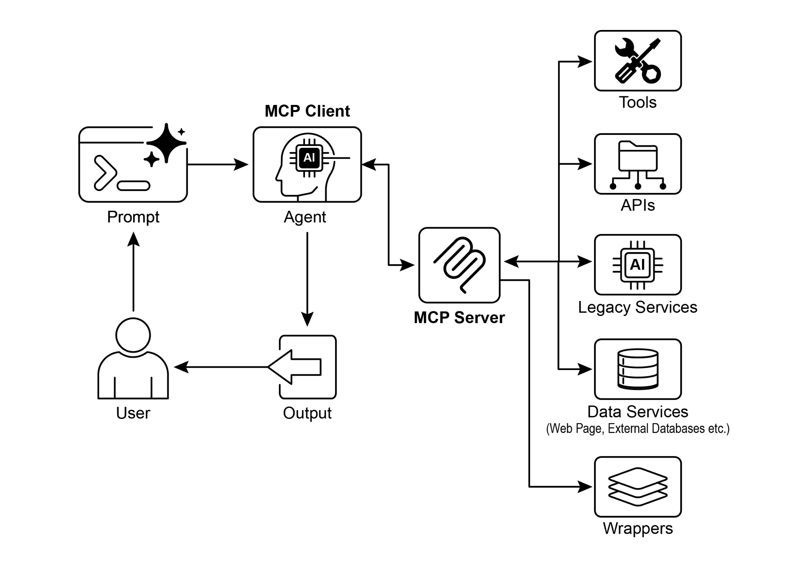

# 第 10 章:模型情境協定(Model Context Protocol)

要讓大型語言模型(LLM)有效地扮演代理(agent)的角色,它們的能力就必須超越多模態生成。與外部環境互動是必要的,包括存取最新資料、運用外部軟體,以及執行特定的操作任務。模型情境協定(Model Context Protocol,MCP)正是為了滿足這項需求而生——它提供一個標準化的介面,讓 LLM 得以與外部資源對接。這套協定是促成一致且可預測之整合的關鍵機制。

## MCP 模式總覽

想像有一個萬用轉接頭,能讓任何 LLM 插接到任何外部系統、資料庫或工具上,而不必為每一個對象量身打造客製化整合。這基本上就是模型情境協定(MCP)的功用。它是一套開放標準,目的在於統一像 Gemini、OpenAI 的 GPT 模型、Mixtral 以及 Claude 這類 LLM,與外部應用程式、資料來源及工具溝通的方式。可以把它想成一種萬用連接機制,簡化了 LLM 取得情境、執行動作,以及與各式系統互動的方式。

MCP 採用主從式(client-server)架構運作。它定義了不同元素如何由 MCP 伺服器(server)對外揭露——這些元素包括資料(稱為資源,resources)、互動式範本(本質上就是提示,prompts),以及可執行動作的函式(稱為工具,tools)。這些元素接著由 MCP 用戶端(client)來消費,而用戶端可以是一個 LLM 宿主應用程式,或是 AI 代理本身。這種標準化的做法,大幅降低了把 LLM 整合進各種操作環境的複雜度。

然而,MCP 是一份關於「代理介面(agentic interface)」的契約,其成效高度取決於它所揭露之底層 API 的設計。這裡存在一個風險:開發者可能未經修改,就直接把既有的舊式(legacy)API 包裝起來,而這對代理而言往往並非最佳做法。舉例來說,如果一個工單系統的 API 只允許逐一取得完整的工單明細,那麼當代理被要求摘要高優先度的工單時,在大量資料下就會既緩慢又不準確。要真正發揮成效,底層 API 應該以過濾(filtering)與排序(sorting)這類確定性(deterministic)功能加以改善,協助這個非確定性(non-deterministic)的代理有效率地運作。這凸顯了一點:代理並不會神奇地取代確定性的工作流程;它們往往需要更強的確定性支援才能成功。

此外,MCP 也可能包裝一個其輸入或輸出對代理而言本質上仍難以理解的 API。一個 API 唯有在其資料格式對代理友善時才有用,而這正是 MCP 本身並不會強制保證的事。舉例來說,為一個文件儲存庫建立一個會把檔案以 PDF 形式回傳的 MCP 伺服器,如果消費端的代理無法解析 PDF 內容,那麼這個伺服器大致上是沒有用處的。更好的做法是先建立一個會回傳文件文字版本(例如 Markdown)的 API,讓代理真正能夠讀取與處理。這說明了開發者不能只考慮「連接」這件事,還必須考量所交換資料的本質,才能確保真正的相容性。

## MCP 與工具函式呼叫(Tool Function Calling)的比較

模型情境協定(MCP)與工具函式呼叫(tool function calling)是兩種截然不同的機制,二者都讓 LLM 能與外部能力(包括工具)互動並執行動作。雖然它們都用於把 LLM 的能力擴展到文字生成之外,但在做法與抽象層次上有所不同。

工具函式呼叫可以想成是 LLM 對某個特定、預先定義好的工具或函式所發出的直接請求。請注意,在這個脈絡下我們把「工具(tool)」與「函式(function)」兩個詞交替使用。這種互動的特徵是一種一對一(one-to-one)的溝通模型:LLM 根據它對使用者意圖(該意圖需要外部動作)的理解,格式化出一個請求。接著,應用程式的程式碼會執行這個請求,並把結果回傳給 LLM。這個過程通常是專有的(proprietary),而且在不同的 LLM 供應商之間各有差異。

相對地,模型情境協定(MCP)則作為一個標準化的介面運作,讓 LLM 得以發現、溝通並運用外部能力。它扮演的是一套開放協定,促成與各式各樣工具及系統的互動,目標是建立一個生態系——任何符合規範的工具,都能被任何符合規範的 LLM 存取。這促進了不同系統與實作之間的互通性(interoperability)、可組合性(composability)與可重用性(reusability)。藉由採用聯邦式(federated)模型,我們大幅改善了互通性,並釋放了既有資產的價值。這套策略讓我們只需把各自獨立、彼此分散的舊式服務包裝在符合 MCP 規範的介面中,就能把它們帶進現代化的生態系。這些服務仍各自獨立運作,但如今可以被組合進新的應用程式與工作流程中,並由 LLM 來協調它們的協作。這在無需對基礎系統進行昂貴重寫的情況下,促成了敏捷性與可重用性。

以下拆解 MCP 與工具函式呼叫之間的根本差異:

| 特性 | 工具函式呼叫(Tool Function Calling) | 模型情境協定(MCP) |
| --- | --- | --- |
| 標準化(Standardization) | 專有且與供應商綁定。格式與實作在不同的 LLM 供應商之間各有差異。 | 一套開放、標準化的協定,促進不同 LLM 與工具之間的互通性。 |
| 範疇(Scope) | 一種讓 LLM 請求執行某個特定、預先定義好之函式的直接機制。 | 一個更廣泛的框架,規範 LLM 與外部工具如何彼此發現與溝通。 |
| 架構(Architecture) | LLM 與應用程式之工具處理邏輯之間的一對一互動。 | 一種主從式架構,讓由 LLM 驅動的應用程式(用戶端)能連接並運用各式各樣的 MCP 伺服器(工具)。 |
| 發現(Discovery) | LLM 是在特定對話的情境中被明確告知有哪些工具可用。 | 能對可用工具進行動態發現。MCP 用戶端可以查詢伺服器,以了解它提供哪些能力。 |
| 可重用性(Reusability) | 工具整合往往與所使用的特定應用程式及 LLM 緊密耦合。 | 促進可重用、獨立式「MCP 伺服器」的開發,這些伺服器可被任何符合規範的應用程式存取。 |

可以把工具函式呼叫想成是給 AI 一組特定、客製打造的工具,就像某把特定的扳手與螺絲起子。對於任務固定的工作坊來說,這很有效率。而 MCP(模型情境協定)則像是建立一套萬用、標準化的電源插座系統。它本身並不提供工具,但它讓任何廠商生產的任何符合規範的工具都能插上去運作,從而打造出一個動態且不斷擴充的工作坊。

簡而言之,函式呼叫提供了對少數幾個特定函式的直接存取,而 MCP 則是一套標準化的溝通框架,讓 LLM 得以發現並使用範圍極為廣泛的外部資源。對於簡單的應用程式,特定工具就已足夠;但對於需要持續調適、複雜且彼此互連的 AI 系統而言,像 MCP 這樣的萬用標準便不可或缺。

## MCP 的其他考量

雖然 MCP 提供了一套強大的框架,但要做出周全的評估,仍需考量幾個會影響它是否適用於特定使用案例的關鍵面向。讓我們更詳細地看看其中幾個面向:

- **工具(Tool)vs. 資源(Resource)vs. 提示(Prompt):** 理解這些元件各自的特定角色很重要。資源是靜態資料(例如一份 PDF 檔案、一筆資料庫紀錄)。工具是執行某個動作的可執行函式(例如寄送電子郵件、查詢一個 API)。提示則是一個範本,引導 LLM 該如何與資源或工具互動,確保互動有結構且有效。
- **可發現性(Discoverability):** MCP 的一項關鍵優勢在於,MCP 用戶端可以動態查詢伺服器,以得知它提供哪些工具與資源。這種「即時(just-in-time)」的發現機制,對於需要在不重新部署的情況下調適新能力的代理而言相當強大。
- **安全性(Security):** 透過任何協定揭露工具與資料,都需要穩固的安全措施。一個 MCP 實作必須納入身分驗證(authentication)與授權(authorization),以控制哪些用戶端可以存取哪些伺服器、以及它們被允許執行哪些特定動作。
- **實作(Implementation):** 雖然 MCP 是一套開放標準,但其實作可能相當複雜。不過,供應商已開始著手簡化這個過程。舉例來說,某些模型供應商(如 Anthropic)或 FastMCP 提供了 SDK,把大量樣板程式碼(boilerplate code)抽象化,讓開發者更容易建立並連接 MCP 用戶端與伺服器。
- **錯誤處理(Error Handling):** 一套完備的錯誤處理策略至關重要。協定必須定義錯誤(例如工具執行失敗、伺服器不可用、請求無效)如何回傳給 LLM,好讓它能理解這次失敗,並可能嘗試另一種替代做法。
- **本機 vs. 遠端伺服器(Local vs. Remote Server):** MCP 伺服器可以部署在與代理相同的本機機器上,也可以部署在不同的遠端伺服器上。當處理敏感資料時,可能會為了速度與安全而選擇本機伺服器;而遠端伺服器架構則允許整個組織共享、可擴展地存取通用工具。
- **隨選 vs. 批次(On-demand vs. Batch):** MCP 可以同時支援隨選的互動式工作階段,以及更大規模的批次處理。要如何選擇取決於應用程式,從一個需要立即存取工具的即時對話式代理,到一個以批次方式處理紀錄的資料分析管線,皆有可能。
- **傳輸機制(Transportation Mechanism):** 協定也定義了底層用於溝通的傳輸層(transport layers)。對於本機互動,它使用透過 STDIO(標準輸入/輸出)的 JSON-RPC,以達成高效率的行程間通訊(inter-process communication)。對於遠端連線,它則運用對網路友善的協定,例如 Streamable HTTP 與伺服器推送事件(Server-Sent Events,SSE),以促成持久且高效率的主從式通訊。

模型情境協定使用主從式模型來標準化資訊流。理解各元件之間的互動,是掌握 MCP 進階代理行為的關鍵:

1. **大型語言模型(LLM):** 核心智慧。它處理使用者請求、擬定計畫,並決定何時需要存取外部資訊或執行某個動作。
2. **MCP 用戶端(MCP Client):** 這是一個包覆在 LLM 外層的應用程式或封裝層。它扮演中介者的角色,把 LLM 的意圖轉譯成一個符合 MCP 標準的正式請求。它負責發現、連接 MCP 伺服器並與之溝通。
3. **MCP 伺服器(MCP Server):** 這是通往外部世界的閘道。它向任何獲得授權的 MCP 用戶端揭露一組工具、資源與提示。每個伺服器通常負責某個特定領域,例如連接到公司的內部資料庫、一項電子郵件服務,或是一個公開的 API。
4. **選擇性的第三方(3P)服務(Optional Third-Party Service):** 這代表 MCP 伺服器所管理並揭露的、實際的外部工具、應用程式或資料來源。它是真正執行所請求動作的最終端點(endpoint),例如查詢一個專有資料庫、與某個 SaaS 平台互動,或呼叫一個公開的天氣 API。

互動的流程如下:

1. **發現(Discovery):** MCP 用戶端代表 LLM,向某個 MCP 伺服器查詢它提供哪些能力。伺服器以一份清單(manifest)回應,列出它可用的工具(例如 `send_email`)、資源(例如 `customer_database`)與提示。
2. **請求擬定(Request Formulation):** LLM 判定它需要使用其中一個被發現的工具。舉例來說,它決定要寄送一封電子郵件。它會擬定一個請求,指定要使用的工具(`send_email`)以及必要的參數(收件人、主旨、內文)。
3. **用戶端通訊(Client Communication):** MCP 用戶端接收 LLM 擬定的請求,並把它作為一個標準化的呼叫,傳送給對應的 MCP 伺服器。
4. **伺服器執行(Server Execution):** MCP 伺服器接收到請求。它會驗證用戶端身分、驗證請求,接著透過與底層軟體對接來執行所指定的動作(例如呼叫某個電子郵件 API 的 `send()` 函式)。
5. **回應與情境更新(Response and Context Update):** 執行完畢後,MCP 伺服器把一個標準化的回應傳回給 MCP 用戶端。這個回應會指出該動作是否成功,並包含任何相關的輸出(例如已寄出郵件的確認 ID)。用戶端接著把這個結果傳回給 LLM,更新它的情境,讓它得以推進其任務的下一個步驟。

## 實務應用與使用案例

MCP 大幅拓展了 AI/LLM 的能力,使它們更為多才多藝且更強大。以下是九個關鍵的使用案例:

- **資料庫整合(Database Integration):** MCP 讓 LLM 與代理能無縫地存取資料庫中的結構化資料並與之互動。舉例來說,使用「MCP Toolbox for Databases」,代理可以查詢 Google BigQuery 資料集以取得即時資訊、生成報告或更新紀錄,而這一切都由自然語言指令驅動。
- **生成式媒體協調(Generative Media Orchestration):** MCP 讓代理能與先進的生成式媒體服務整合。透過「MCP Tools for Genmedia Services」,代理可以協調涉及 Google Imagen(影像生成)、Google Veo(影片製作)、Google Chirp 3 HD(擬真語音)或 Google Lyria(音樂創作)的工作流程,讓 AI 應用程式得以進行動態的內容創作。
- **外部 API 互動(External API Interaction):** MCP 提供了一種標準化的方式,讓 LLM 能呼叫任何外部 API 並接收其回應。這意味著代理可以擷取即時天氣資料、拉取股價、寄送電子郵件,或與 CRM 系統互動,把它的能力擴展到遠超其核心語言模型的範圍。
- **基於推理的資訊擷取(Reasoning-Based Information Extraction):** 借助 LLM 強大的推理能力,MCP 能促成有效、依查詢而定的資訊擷取,其表現超越傳統的搜尋與檢索系統。代理不會像傳統搜尋工具那樣回傳一整份文件,而是能分析文字,並擷取出直接回答使用者複雜問題的那一個精確條款、資料或陳述。
- **客製化工具開發(Custom Tool Development):** 開發者可以建構客製化工具,並透過 MCP 伺服器把它們揭露出來(例如使用 FastMCP)。這讓專門的內部函式或專有系統,能以一種標準化、易於消費的格式提供給 LLM 與其他代理使用,而無需直接修改 LLM。
- **標準化的 LLM 對應用程式通訊(Standardized LLM-to-Application Communication):** MCP 確保 LLM 與其互動之應用程式之間存在一個一致的通訊層。這降低了整合的負擔、促進了不同 LLM 供應商與宿主應用程式之間的互通性,並簡化了複雜代理系統的開發。
- **複雜工作流程協調(Complex Workflow Orchestration):** 藉由組合各種由 MCP 揭露的工具與資料來源,代理可以協調高度複雜的多步驟工作流程。舉例來說,代理可以從資料庫擷取客戶資料、生成一張個人化的行銷影像、草擬一封量身打造的電子郵件,然後把它寄出——這一切都是透過與不同的 MCP 服務互動來完成。
- **物聯網裝置控制(IoT Device Control):** MCP 可以促成 LLM 與物聯網(IoT)裝置的互動。代理可以使用 MCP 向智慧家居設備、工業感測器或機器人發送指令,實現對實體系統的自然語言控制與自動化。
- **金融服務自動化(Financial Services Automation):** 在金融服務領域,MCP 可以讓 LLM 與各種金融資料來源、交易平台或合規系統互動。代理可以分析市場資料、執行交易、生成個人化的理財建議,或將法規申報自動化——而這一切都在維持安全且標準化的通訊之下進行。

簡而言之,模型情境協定(MCP)讓代理能從資料庫、API 與網路資源存取即時資訊。它也讓代理能執行各種動作,例如寄送電子郵件、更新紀錄、控制裝置,以及透過整合並處理來自各方來源的資料來執行複雜任務。此外,MCP 也支援供 AI 應用程式使用的媒體生成工具。

## 使用 ADK 的動手實作範例

本節將說明如何連接到一個提供檔案系統操作的本機 MCP 伺服器,使一個 ADK 代理能與本機檔案系統互動。

### 使用 MCPToolset 設定代理

要設定一個能與檔案系統互動的代理,必須建立一個 `agent.py` 檔案(例如放在 `./adk_agent_samples/mcp_agent/agent.py`)。`MCPToolset` 會在 `LlmAgent` 物件的 `tools` 清單中被實例化。關鍵在於,你必須把 `args` 清單中的 `"/path/to/your/folder"` 替換成本機系統上某個 MCP 伺服器能存取之目錄的絕對路徑。這個目錄將成為代理所執行之檔案系統操作的根目錄。

```python
import os
from google.adk.agents import LlmAgent
from google.adk.tools.mcp_tool.mcp_toolset import MCPToolset, StdioServerParameters

# 建立一個指向名為 'mcp_managed_files' 之資料夾的可靠絕對路徑,
# 該資料夾與這個代理腳本位於同一個目錄中。
# 這確保了代理在示範時可以開箱即用。
# 在正式環境中,你會把這個路徑指向一個更具持久性且更安全的位置。
TARGET_FOLDER_PATH = os.path.join(os.path.dirname(os.path.abspath(__file__)), "mcp_managed_files")

# 在代理需要使用之前,確保目標目錄已經存在。
os.makedirs(TARGET_FOLDER_PATH, exist_ok=True)

root_agent = LlmAgent(
    model='gemini-2.0-flash',
    name='filesystem_assistant_agent',
    # 提示詞中譯:協助使用者管理他們的檔案。你可以列出檔案、讀取檔案以及寫入檔案。
    # 你正在以下這個目錄中操作:{TARGET_FOLDER_PATH}
    instruction=(
        'Help the user manage their files. You can list files, read files, and write files. '
        f'You are operating in the following directory: {TARGET_FOLDER_PATH}'
    ),
    tools=[
        MCPToolset(
            connection_params=StdioServerParameters(
                command='npx',
                args=[
                    "-y",  # 給 npx 的引數,用來自動確認安裝
                    "@modelcontextprotocol/server-filesystem",
                    # 這裡「必須」是一個指向某個資料夾的絕對路徑。
                    TARGET_FOLDER_PATH,
                ],
            ),
            # 選擇性:你可以過濾 MCP 伺服器揭露出來的工具。
            # 例如,若只允許讀取:
            # tool_filter=['list_directory', 'read_file']
        )
    ],
)
```

`npx`(Node Package Execute)隨附於 npm(Node Package Manager)5.2.0 及之後的版本,是一個能直接從 npm registry 執行 Node.js 套件的工具程式。這免去了全域安裝的需要。本質上,`npx` 扮演的是 npm 套件執行器(package runner)的角色,而它常被用來執行眾多社群開發的 MCP 伺服器——這些伺服器是以 Node.js 套件的形式發布的。

建立一個 `__init__.py` 檔案是必要的,這能確保 `agent.py` 檔案被識別為 Agent Development Kit(ADK)可發現之 Python 套件的一部分。這個檔案應與 `agent.py` 放在同一個目錄中。

```python
# ./adk_agent_samples/mcp_agent/__init__.py
from . import agent
```

當然,也可以使用其他受支援的指令。舉例來說,要連接到 `python3` 可以這樣做:

```python
connection_params = StdioConnectionParams(
    server_params={
        "command": "python3",
        "args": ["./agent/mcp_server.py"],
        "env": {
            "SERVICE_ACCOUNT_PATH": SERVICE_ACCOUNT_PATH,
            "DRIVE_FOLDER_ID": DRIVE_FOLDER_ID
        }
    }
)
```

UVX 在 Python 的脈絡下,指的是一個運用 `uv` 在暫時、隔離的 Python 環境中執行指令的命令列工具。本質上,它讓你能執行 Python 工具與套件,而無需全域安裝它們,也無需安裝在你專案的環境中。你可以透過 MCP 伺服器來執行它。

```python
connection_params = StdioConnectionParams(
    server_params={
        "command": "uvx",
        "args": ["mcp-google-sheets@latest"],
        "env": {
            "SERVICE_ACCOUNT_PATH": SERVICE_ACCOUNT_PATH,
            "DRIVE_FOLDER_ID": DRIVE_FOLDER_ID
        }
    }
)
```

一旦 MCP 伺服器建立完成,下一步就是連接到它。

### 透過 ADK Web 連接 MCP 伺服器

首先,執行 `adk web`。在你的終端機中切換到 `mcp_agent` 的上層目錄(例如 `adk_agent_samples`),然後執行:

```bash
cd ./adk_agent_samples # 或你對應的上層目錄
adk web
```

當 ADK Web UI 在你的瀏覽器中載入後,從代理選單中選擇 `filesystem_assistant_agent`。接著,試試以下這類提示:

- "Show me the contents of this folder."(顯示這個資料夾的內容。)
- "Read the `sample.txt` file."(讀取 `sample.txt` 檔案。)(這假設 `sample.txt` 位於 `TARGET_FOLDER_PATH`。)
- "What's in `another_file.md`?"(`another_file.md` 裡有什麼?)

### 使用 FastMCP 建立 MCP 伺服器

FastMCP 是一個高階的 Python 框架,旨在簡化 MCP 伺服器的開發。它提供了一個抽象層,把協定的複雜性簡化掉,讓開發者得以專注於核心邏輯。

這個函式庫能讓開發者使用簡單的 Python 裝飾器(decorator),快速定義工具、資源與提示。一項重要的優勢是它能自動生成綱要(schema):它會聰明地解讀 Python 函式的簽名(signature)、型別提示(type hints)與說明字串(documentation strings),藉此建構出必要的 AI 模型介面規格。這種自動化把手動設定降到最低,也減少了人為錯誤。

除了基本的工具建立之外,FastMCP 還能促成更進階的架構模式,例如伺服器組合(server composition)與代理轉送(proxying)。這讓複雜、多元件系統的模組化開發成為可能,也讓既有服務得以無縫整合進一個 AI 可存取的框架中。此外,FastMCP 還包含了針對高效率、分散式且可擴展之 AI 驅動應用程式的最佳化。

### 使用 FastMCP 設定伺服器

為了說明,我們來看一個由伺服器提供的基本「greet」(問候)工具。一旦這個工具啟用,ADK 代理與其他 MCP 用戶端就能透過 HTTP 與它互動。

```python
# fastmcp_server.py
# 這個腳本示範如何使用 FastMCP 建立一個簡單的 MCP 伺服器。
# 它揭露了單一一個用來產生問候語的工具。

# 1. 請先確認你已安裝 FastMCP:
# pip install fastmcp

from fastmcp import FastMCP, Client

# 初始化 FastMCP 伺服器。
mcp_server = FastMCP()

# 定義一個簡單的工具函式。
# `@mcp_server.tool` 裝飾器會把這個 Python 函式註冊為一個 MCP 工具。
# 說明字串(docstring)會成為這個工具給 LLM 看的描述。
@mcp_server.tool
def greet(name: str) -> str:
    # 提示詞中譯(此 docstring 會成為提供給 LLM 的工具描述):
    # 產生一句個人化的問候語。
    #
    # 參數:
    #     name:要問候的對象姓名。
    #
    # 回傳:
    #     一個問候字串。
    """
    Generates a personalized greeting.

    Args:
        name: The name of the person to greet.

    Returns:
        A greeting string.
    """
    return f"Hello, {name}! Nice to meet you."

# 或者,如果你想從腳本中執行它:
if __name__ == "__main__":
    mcp_server.run(
        transport="http",
        host="127.0.0.1",
        port=8000
    )
```

這段 Python 腳本定義了單一一個名為 `greet` 的函式,它接收一個人的名字,並回傳一句個人化的問候語。這個函式上方的 `@tool()` 裝飾器,會自動把它註冊為一個 AI 或另一個程式可以使用的工具。函式的說明字串與型別提示會被 FastMCP 用來告訴代理:這個工具如何運作、它需要哪些輸入,以及它會回傳什麼。

當這個腳本被執行時,它會啟動 FastMCP 伺服器,該伺服器會在 `localhost:8000` 上監聽請求。這讓 `greet` 函式得以作為一項網路服務對外提供。接著,可以設定一個代理來連接到這個伺服器,並把 `greet` 工具當作某個更大型任務的一部分來使用,以產生問候語。伺服器會持續運行,直到被手動停止為止。

### 使用 ADK 代理消費 FastMCP 伺服器

可以把一個 ADK 代理設定成 MCP 用戶端,來使用一個正在運行的 FastMCP 伺服器。這需要設定 `HttpServerParameters`,並填入 FastMCP 伺服器的網路位址,該位址通常是 `http://localhost:8000`。

可以加入一個 `tool_filter` 參數,把代理的工具使用限制在伺服器所提供的特定工具上,例如 `'greet'`。當收到像「Greet John Doe」(問候 John Doe)這樣的請求提示時,代理內嵌的 LLM 會辨識出透過 MCP 可用的 `'greet'` 工具,以引數「John Doe」呼叫它,並回傳伺服器的回應。這個過程示範了如何把透過 MCP 揭露的使用者自訂工具,與一個 ADK 代理整合起來。

要建立這項設定,需要一個代理檔案(例如位於 `./adk_agent_samples/fastmcp_client_agent/` 的 `agent.py`)。這個檔案會實例化一個 ADK 代理,並使用 `HttpServerParameters` 來與運行中的 FastMCP 伺服器建立連線。

```python
# ./adk_agent_samples/fastmcp_client_agent/agent.py
import os
from google.adk.agents import LlmAgent
from google.adk.tools.mcp_tool.mcp_toolset import MCPToolset, HttpServerParameters

# 定義 FastMCP 伺服器的位址。
# 請確認你的 fastmcp_server.py(先前定義過的)正在這個連接埠上運行。
FASTMCP_SERVER_URL = "http://localhost:8000"

root_agent = LlmAgent(
    model='gemini-2.0-flash',  # 或你偏好的模型
    name='fastmcp_greeter_agent',
    # 提示詞中譯:你是一個友善的助理,可以依照人們的名字向他們問候。請使用「greet」工具。
    instruction='You are a friendly assistant that can greet people by their name. Use the "greet" tool.',
    tools=[
        MCPToolset(
            connection_params=HttpServerParameters(
                url=FASTMCP_SERVER_URL,
            ),
            # 選擇性:過濾 MCP 伺服器揭露出來的工具
            # 在這個範例中,我們預期只有 'greet'
            tool_filter=['greet']
        )
    ],
)
```

這段腳本定義了一個名為 `fastmcp_greeter_agent` 的代理,它使用一個 Gemini 語言模型。它被賦予一道明確的指令,要扮演一個友善的助理,目的是問候人們。關鍵在於,這段程式碼為這個代理配備了一個工具來執行它的任務。它設定了一個 `MCPToolset`,連接到一個運行在 `localhost:8000` 上的獨立伺服器,而這個伺服器預期就是前一個範例中的 FastMCP 伺服器。這個代理被明確地授予了存取該伺服器上所託管之 `greet` 工具的權限。本質上,這段程式碼設定了系統的用戶端部分,建立出一個聰明的代理——它了解自己的目標是問候人們,也清楚知道該使用哪一個外部工具來達成這個目標。

在 `fastmcp_client_agent` 目錄中建立一個 `__init__.py` 檔案是必要的。這能確保代理被識別為 ADK 可發現的 Python 套件。

首先,開啟一個新的終端機,執行 `python fastmcp_server.py` 來啟動 FastMCP 伺服器。接著,在終端機中前往 `fastmcp_client_agent` 的上層目錄(例如 `adk_agent_samples`),並執行 `adk web`。當 ADK Web UI 在你的瀏覽器中載入後,從代理選單中選擇 `fastmcp_greeter_agent`。接著你可以輸入像「Greet John Doe」這樣的提示來測試它。代理將會使用你 FastMCP 伺服器上的 `greet` 工具來產生一個回應。

## 重點速覽

**是什麼(What):** 要扮演有效的代理,LLM 必須超越單純的文字生成。它們需要具備與外部環境互動的能力,以存取最新資料並運用外部軟體。若沒有一種標準化的溝通方法,LLM 與每一個外部工具或資料來源之間的整合,都會變成一項客製化、複雜且無法重用的工作。這種臨時拼湊(ad-hoc)的做法阻礙了可擴展性,使得建構複雜、彼此互連的 AI 系統既困難又缺乏效率。

**為什麼(Why):** 模型情境協定(MCP)提供了一套標準化的解法,它扮演 LLM 與外部系統之間的萬用介面。它建立了一套開放、標準化的協定,定義了外部能力如何被發現與使用。MCP 以主從式模型運作,讓伺服器得以向任何符合規範的用戶端揭露工具、資料資源與互動式提示。由 LLM 驅動的應用程式扮演這些用戶端的角色,以可預測的方式動態發現可用資源並與之互動。這種標準化的做法,孕育出一個由可互通、可重用之元件所構成的生態系,大幅簡化了複雜代理工作流程的開發。

**經驗法則(Rule of thumb):** 當你在建構複雜、可擴展或企業級的代理系統,且該系統需要與一組多樣化且不斷演進的外部工具、資料來源及 API 互動時,就使用模型情境協定(MCP)。當不同 LLM 與工具之間的互通性是優先考量,以及當代理需要在不重新部署的情況下動態發現新能力時,它都是理想的選擇。對於那些函式數量固定且有限、預先定義好的較簡單應用程式,直接使用工具函式呼叫可能就已足夠。

## 視覺摘要



*圖 1:模型情境協定(Model Context Protocol)。使用者送出提示,作為 MCP 用戶端的代理透過 MCP 伺服器連接到工具(Tools)、API、舊式服務(Legacy Services)、資料服務(Data Services,如網頁、外部資料庫等)與包裝層(Wrappers),並把處理後的輸出回傳給使用者。*

## 重點整理

以下是一些重點:

- 模型情境協定(MCP)是一套開放標準,促進 LLM 與外部應用程式、資料來源及工具之間的標準化溝通。
- 它採用主從式架構,定義了揭露與消費資源、提示與工具的方法。
- Agent Development Kit(ADK)同時支援運用既有的 MCP 伺服器,以及透過 MCP 伺服器揭露 ADK 工具。
- FastMCP 簡化了 MCP 伺服器的開發與管理,尤其適用於揭露以 Python 實作的工具。
- MCP Tools for Genmedia Services 讓代理能與 Google Cloud 的生成式媒體能力(Imagen、Veo、Chirp 3 HD、Lyria)整合。
- MCP 讓 LLM 與代理能與真實世界的系統互動、存取動態資訊,並執行超越文字生成的動作。

## 結論

模型情境協定(MCP)是一套開放標準,促進大型語言模型(LLM)與外部系統之間的溝通。它採用主從式架構,讓 LLM 得以透過標準化的工具存取資源、運用提示並執行動作。MCP 讓 LLM 能與資料庫互動、管理生成式媒體工作流程、控制 IoT 裝置,並將金融服務自動化。本章的實務範例示範了如何設定代理來與 MCP 伺服器溝通,包括檔案系統伺服器以及以 FastMCP 建構的伺服器,並說明了它與 Agent Development Kit(ADK)的整合。MCP 是開發互動式 AI 代理的關鍵元件,讓這些代理的能耐得以超越基本的語言能力。

## 參考資料

1. Model Context Protocol (MCP) Documentation. (Latest). Model Context Protocol (MCP). <https://google.github.io/adk-docs/mcp/>
2. FastMCP Documentation. FastMCP. <https://github.com/jlowin/fastmcp>
3. MCP Tools for Genmedia Services. MCP Tools for Genmedia Services. <https://google.github.io/adk-docs/mcp/#mcp-servers-for-google-cloud-genmedia>
4. MCP Toolbox for Databases Documentation. (Latest). MCP Toolbox for Databases. <https://google.github.io/adk-docs/mcp/databases/>
