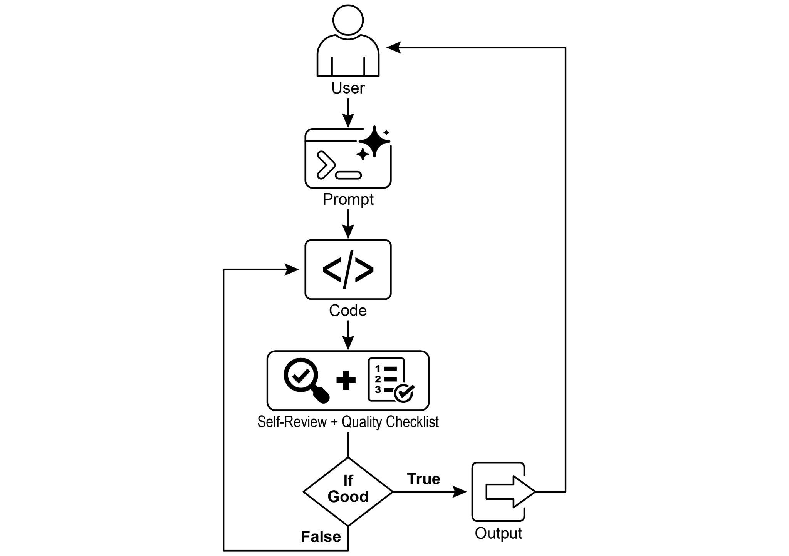
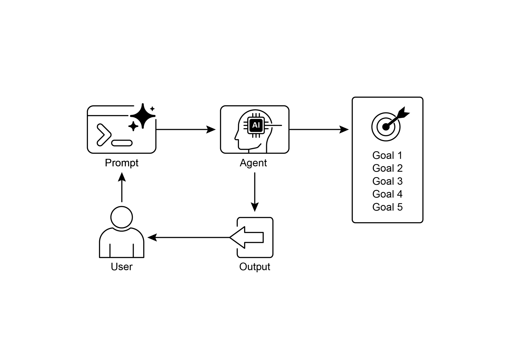

# 第 11 章:目標設定與監控(Goal Setting and Monitoring)

要讓 AI 代理(AI agent)真正有效且具有目的性,它們需要的不只是處理資訊或使用工具的能力;它們還需要清楚的方向感,以及一種能知道自己是否真的有所進展的方法。這正是目標設定與監控(Goal Setting and Monitoring)模式登場之處。它的重點在於賦予代理具體的目標去努力達成,並為它們配備能追蹤進度、判定這些目標是否已達成的手段。

## 目標設定與監控模式總覽

想想規劃一趟旅行。你不會憑空就出現在目的地。你會先決定想去哪裡(目標狀態),弄清楚自己從何處出發(初始狀態),考量可用的選項(交通方式、路線、預算),接著再規劃出一連串步驟:訂票、打包行李、前往機場或車站、登上交通工具、抵達、找住宿等等。這種逐步進行、通常還會考量相依關係與限制的過程,本質上就是我們所說的代理系統中的「規劃(planning)」。

在 AI 代理的脈絡中,規劃通常涉及代理接收一個高層次的目標,並自主或半自主地生成一系列中間步驟或子目標(sub-goal)。這些步驟接著可以循序執行,或以更複雜的流程執行,過程中可能還會涉及其他模式,例如工具使用(tool use)、路由(routing)或多代理協作(multi-agent collaboration)。規劃機制可能涉及精密的搜尋演算法、邏輯推理,或愈來愈常見地,運用大型語言模型(LLM)的能力,依據其訓練資料與對任務的理解,生成合理而有效的計畫。

良好的規劃能力讓代理得以處理那些並非單純、單一步驟查詢的問題。它使代理能夠處理多面向的請求、藉由重新規劃(replanning)來適應變化的情境,並協調複雜的工作流程。這是一種基礎模式,支撐著許多進階的代理行為,把一個單純的反應式(reactive)系統,轉變為能夠主動朝向既定目標努力的系統。

## 實務應用與使用案例

目標設定與監控模式,對於建構能在複雜的真實世界情境中自主且可靠運作的代理而言至關重要。以下是一些實務應用:

- **客戶支援自動化(Customer Support Automation):** 代理的目標可能是「解決客戶的帳單疑問」。它會監控對話、查核資料庫項目,並運用工具來調整帳單。成功與否的監控方式,是確認帳單已變更並收到客戶的正面回饋。若問題未獲解決,它就會升級處理(escalate)。
- **個人化學習系統(Personalized Learning Systems):** 學習代理的目標可能是「提升學生對代數的理解」。它會監控學生在練習題上的進度、調整教材,並追蹤準確率與完成時間等表現指標,在學生遇到困難時調整其教學方式。
- **專案管理助理(Project Management Assistants):** 代理可以被指派「確保專案里程碑 X 在 Y 日期前完成」的任務。它會監控任務狀態、團隊溝通與資源可用性,在目標面臨風險時標示出延遲並提出修正措施建議。
- **自動化交易機器人(Automated Trading Bots):** 交易代理的目標可能是「在維持於風險承受度之內的前提下,最大化投資組合的收益」。它會持續監控市場資料、當前的投資組合價值與風險指標,在條件符合其目標時執行交易,並在風險門檻被突破時調整策略。
- **機器人與自駕車(Robotics and Autonomous Vehicles):** 自駕車的首要目標是「安全地把乘客從 A 地運送到 B 地」。它會持續監控周遭環境(其他車輛、行人、交通號誌)、自身狀態(車速、油量),以及沿著既定路線的行進進度,並調整其駕駛行為,以安全且高效地達成目標。
- **內容審核(Content Moderation):** 代理的目標可以是「辨識並移除平台 X 上的有害內容」。它會監控傳入的內容、套用分類模型,並追蹤誤判(false positives/negatives)等指標,調整其過濾標準,或把模稜兩可的案例升級給人工審核者。

此模式對於那些需要可靠運作、達成特定成果並適應動態條件的代理而言是根本的,為智慧化的自我管理提供了必要的框架。

## 動手實作範例

為了說明目標設定與監控模式,我們有一個使用 LangChain 與 OpenAI API 的範例。這支 Python 腳本勾勒出一個自主 AI 代理,專門用來生成並精煉 Python 程式碼。它的核心功能是針對指定的問題產出解決方案,同時確保符合使用者定義的品質基準。

它採用了一種「目標設定與監控」模式:它不會只生成一次程式碼,而是進入一個由「創作、自我評估、改善」所構成的迭代循環。代理是否成功,是由它自己以 AI 驅動的判斷來衡量——判定所生成的程式碼是否成功滿足最初的目標。最終的輸出,是一個經過潤飾、附上註解、可立即使用的 Python 檔案,代表了這個精煉過程的最終成果。

相依套件:

```bash
pip install langchain_openai openai python-dotenv
```

附帶金鑰 `OPENAI_API_KEY` 的 `.env` 檔案。

要理解這支腳本,最好的方式是把它想像成一位被指派到某個專案的自主 AI 程式設計師(見圖 1)。整個過程始於你交給這個 AI 一份詳細的專案說明書(project brief),也就是它需要解決的具體程式設計問題。

```python
# MIT License
# Copyright (c) 2025 Mahtab Syed
# https://www.linkedin.com/in/mahtabsyed/

"""
Hands-On Code Example - Iteration 2
- To illustrate the Goal Setting and Monitoring pattern, we have an
example using LangChain and OpenAI APIs:

Objective: Build an AI Agent which can write code for a specified
use case based on specified goals:
- Accepts a coding problem (use case) in code or can be as input.
- Accepts a list of goals (e.g., "simple", "tested", "handles edge
cases") in code or can be input.
- Uses an LLM (like GPT-4o) to generate and refine Python code
until the goals are met. (I am using max 5 iterations, this could
be based on a set goal as well)
- To check if we have met our goals I am asking the LLM to judge
this and answer just True or False which makes it easier to stop
the iterations.
- Saves the final code in a .py file with a clean filename and a
header comment.
"""

import os
import random
import re
from pathlib import Path
from langchain_openai import ChatOpenAI
from dotenv import load_dotenv, find_dotenv

# 🔐 載入環境變數
_ = load_dotenv(find_dotenv())
OPENAI_API_KEY = os.getenv("OPENAI_API_KEY")
if not OPENAI_API_KEY:
    raise EnvironmentError("❌ Please set the OPENAI_API_KEY environment variable.")

# 📡 初始化 OpenAI 模型
print("✅ Initializing OpenAI LLM (gpt-4o)...")
llm = ChatOpenAI(
    model="gpt-4o",  # If you dont have access to got-4o use other OpenAI LLMs
    temperature=0.3,
    openai_api_key=OPENAI_API_KEY,
)


# --- Utility Functions ---
def generate_prompt(
    use_case: str, goals: list[str], previous_code: str = "", feedback: str = ""
) -> str:
    print("📝 Constructing prompt for code generation...")
    # 提示詞中譯:
    # 你是一個 AI 程式設計代理。你的工作是根據以下使用案例撰寫 Python 程式碼:
    #
    # 使用案例:{use_case}
    #
    # 你的目標是:
    # {（逐條列出各項目標）}
    base_prompt = f"""
You are an AI coding agent. Your job is to write Python code based
on the following use case:

Use Case: {use_case}

Your goals are:
{chr(10).join(f"- {g.strip()}" for g in goals)}
"""
    if previous_code:
        print("🔄 Adding previous code to the prompt for refinement.")
        # 提示詞中譯:先前產生的程式碼:{previous_code}
        base_prompt += f"\nPreviously generated code:\n{previous_code}"
    if feedback:
        print("📋 Including feedback for revision.")
        # 提示詞中譯:對前一版本的回饋:{feedback}
        base_prompt += f"\nFeedback on previous version:\n{feedback}\n"

    # 提示詞中譯:請只回傳修訂後的 Python 程式碼。不要在程式碼之外加入註解或說明。
    base_prompt += "\nPlease return only the revised Python code. Do not include comments or explanations outside the code."
    return base_prompt


def get_code_feedback(code: str, goals: list[str]) -> str:
    print("🔍 Evaluating code against the goals...")
    # 提示詞中譯:
    # 你是一位 Python 程式碼審查員。下方顯示了一段程式碼片段。
    # 根據以下的目標:
    # {（逐條列出各項目標）}
    #
    # 請評論這段程式碼,並指出這些目標是否已達成。
    # 說明是否需要在清晰度、簡潔性、正確性、邊界情況處理或測試
    # 覆蓋率方面加以改進。
    #
    # 程式碼:
    # {code}
    feedback_prompt = f"""
You are a Python code reviewer. A code snippet is shown below.
Based on the following goals:
{chr(10).join(f"- {g.strip()}" for g in goals)}

Please critique this code and identify if the goals are met.
Mention if improvements are needed for clarity, simplicity,
correctness, edge case handling, or test coverage.

Code:
{code}
"""
    return llm.invoke(feedback_prompt)


def goals_met(feedback_text: str, goals: list[str]) -> bool:
    """
    Uses the LLM to evaluate whether the goals have been met based
    on the feedback text.
    Returns True or False (parsed from LLM output).
    """
    # 提示詞中譯:
    # 你是一位 AI 審查員。
    #
    # 以下是目標:
    # {（逐條列出各項目標）}
    #
    # 以下是針對程式碼的回饋:
    # """
    # {feedback_text}
    # """
    #
    # 根據上述回饋,這些目標是否已達成?
    # 只用一個詞回答:True 或 False。
    review_prompt = f"""
You are an AI reviewer.

Here are the goals:
{chr(10).join(f"- {g.strip()}" for g in goals)}

Here is the feedback on the code:
\"\"\"
{feedback_text}
\"\"\"

Based on the feedback above, have the goals been met?
Respond with only one word: True or False.
"""
    response = llm.invoke(review_prompt).content.strip().lower()
    return response == "true"


def clean_code_block(code: str) -> str:
    lines = code.strip().splitlines()
    if lines and lines[0].strip().startswith("```"):
        lines = lines[1:]
    if lines and lines[-1].strip() == "```":
        lines = lines[:-1]
    return "\n".join(lines).strip()


def add_comment_header(code: str, use_case: str) -> str:
    comment = f"# This Python program implements the following use case:\n# {use_case.strip()}\n"
    return comment + "\n" + code


def to_snake_case(text: str) -> str:
    text = re.sub(r"[^a-zA-Z0-9 ]", "", text)
    return re.sub(r"\s+", "_", text.strip().lower())


def save_code_to_file(code: str, use_case: str) -> str:
    print("💾 Saving final code to file...")
    # 提示詞中譯:請把以下使用案例摘要成一個全小寫的單字或片語,
    # 不超過 10 個字元,適合做為 Python 檔名:\n\n{use_case}
    summary_prompt = (
        f"Summarize the following use case into a single lowercase word or phrase, "
        f"no more than 10 characters, suitable for a Python filename:\n\n{use_case}"
    )
    raw_summary = llm.invoke(summary_prompt).content.strip()
    short_name = re.sub(r"[^a-zA-Z0-9_]", "", raw_summary.replace(" ", "_").lower())[:10]
    random_suffix = str(random.randint(1000, 9999))
    filename = f"{short_name}_{random_suffix}.py"
    filepath = Path.cwd() / filename
    with open(filepath, "w") as f:
        f.write(code)

    print(f"✅ Code saved to: {filepath}")
    return str(filepath)


# --- Main Agent Function ---
def run_code_agent(use_case: str, goals_input: str, max_iterations: int = 5) -> str:
    goals = [g.strip() for g in goals_input.split(",")]

    print(f"\n🎯 Use Case: {use_case}")
    print("🎯 Goals:")
    for g in goals:
        print(f" - {g}")

    previous_code = ""
    feedback = ""

    for i in range(max_iterations):
        print(f"\n=== 🔁 Iteration {i + 1} of {max_iterations} ===")
        prompt = generate_prompt(
            use_case, goals, previous_code,
            feedback if isinstance(feedback, str) else feedback.content
        )

        print("🚧 Generating code...")
        code_response = llm.invoke(prompt)
        raw_code = code_response.content.strip()
        code = clean_code_block(raw_code)
        print("\n🧾 Generated Code:\n" + "-" * 50 + f"\n{code}\n" + "-" * 50)

        print("\n📤 Submitting code for feedback review...")
        feedback = get_code_feedback(code, goals)
        feedback_text = feedback.content.strip()
        print("\n📥 Feedback Received:\n" + "-" * 50 + f"\n{feedback_text}\n" + "-" * 50)

        if goals_met(feedback_text, goals):
            print("✅ LLM confirms goals are met. Stopping iteration.")
            break

        print("🛠️ Goals not fully met. Preparing for next iteration...")
        previous_code = code

    final_code = add_comment_header(code, use_case)
    return save_code_to_file(final_code, use_case)


# --- CLI Test Run ---
if __name__ == "__main__":
    print("\n🧠 Welcome to the AI Code Generation Agent")

    # Example 1
    use_case_input = "Write code to find BinaryGap of a given positive integer"
    goals_input = "Code simple to understand, Functionally correct, Handles comprehensive edge cases, Takes positive integer input only, prints the results with few examples"
    run_code_agent(use_case_input, goals_input)

    # Example 2
    # use_case_input = "Write code to count the number of files in current directory and all its nested sub directories, and print the total count"
    # goals_input = (
    #     "Code simple to understand, Functionally correct, Handles comprehensive edge cases, Ignore recommendations for performance, Ignore recommendations for test suite use like unittest or pytest"
    # )
    # run_code_agent(use_case_input, goals_input)

    # Example 3
    # use_case_input = "Write code which takes a command line input of a word doc or docx file and opens it and counts the number of words, and characters in it and prints all"
    # goals_input = "Code simple to understand, Functionally correct, Handles edge cases"
    # run_code_agent(use_case_input, goals_input)
```

除了這份說明書,你還會提供一份嚴格的品質檢查清單(quality checklist),它代表了最終程式碼必須滿足的目標——例如「解決方案必須簡單」、「它必須在功能上正確」,或是「它需要能處理意料之外的邊界情況」等準則。



*圖 1:目標設定與監控範例*

拿著這份任務指派,這位 AI 程式設計師便開始動工,產出它的第一版程式碼草稿。然而,它不會立刻提交這個初版,而是會暫停下來執行一個關鍵步驟:嚴謹的自我審查(self-review)。它會一絲不苟地把自己的作品對照你所提供的品質檢查清單上的每一個項目,扮演起自己的品質保證(quality assurance)檢查員。在這番檢查之後,它會對自己的進度做出一個簡單、不偏不倚的裁決:若作品符合所有標準,就回答「True」;若有所不足,就回答「False」。

如果裁決是「False」,這個 AI 並不會放棄。它會進入一個審慎的修訂階段,運用自我批判所得的洞見來精準找出弱點,並聰明地重寫程式碼。這個「起草、自我審查、精煉」的循環會持續下去,每一次迭代都力求更接近目標。這個過程會不斷重複,直到 AI 最終藉由滿足每一項要求而達成「True」的狀態,或者直到它觸及預先定義的嘗試次數上限——就像一位趕著截止期限工作的開發者一樣。一旦程式碼通過這最終的檢查,腳本便會把這份潤飾過的解決方案打包,加上有幫助的註解,並把它存成一個乾淨、全新的 Python 檔案,隨時可供使用。

**注意事項與考量(Caveats and Considerations):** 必須指出的是,這是一個示範性的說明,而非可用於正式生產環境(production-ready)的程式碼。對於真實世界的應用,有數個因素必須納入考量。LLM 可能無法完全掌握某個目標所要表達的意涵,並可能錯誤地把自己的表現評估為成功。即使目標被充分理解,模型仍可能產生幻覺(hallucinate)。當同一個 LLM 同時負責撰寫程式碼與評判其品質時,它可能更難察覺自己正走向錯誤的方向。

歸根究柢,LLM 並不會像變魔術般產出毫無瑕疵的程式碼;你仍然需要實際執行並測試所產出的程式碼。此外,這個簡單範例中的「監控」相當基礎,並且帶來了一個潛在風險——這個過程可能會永遠跑下去。

```text
Act as an expert code reviewer with a deep commitment to producing
clean, correct, and simple code. Your core mission is to eliminate
code "hallucinations" by ensuring every suggestion is grounded in
reality and best practices.

When I provide you with a code snippet, I want you to:
-- Identify and Correct Errors: Point out any logical flaws, bugs, or
potential runtime errors.
-- Simplify and Refactor: Suggest changes that make the code more
readable, efficient, and maintainable without sacrificing
correctness.
-- Provide Clear Explanations: For every suggested change, explain
why it is an improvement, referencing principles of clean code,
performance, or security.
-- Offer Corrected Code: Show the "before" and "after" of your
suggested changes so the improvement is clear.

Your feedback should be direct, constructive, and always aimed at
improving the quality of the code.
```

**提示詞中譯:**

> 請以一位資深程式碼審查員的身分行事,並深切致力於產出乾淨、正確且簡單的程式碼。你的核心使命,是藉由確保每一項建議都立基於現實與最佳實務,來消除程式碼的「幻覺(hallucinations)」。
>
> 當我提供一段程式碼片段給你時,我希望你:
> -- 找出並修正錯誤:指出任何邏輯上的瑕疵、臭蟲(bug),或潛在的執行期錯誤。
> -- 簡化與重構:在不犧牲正確性的前提下,提出能讓程式碼更易讀、更有效率、更易維護的修改。
> -- 提供清楚的說明:對於每一項建議的修改,說明它為何是一種改進,並援引乾淨程式碼、效能或安全性的原則。
> -- 提供修正後的程式碼:展示你所建議修改的「修改前」與「修改後」,讓改進之處一目瞭然。
>
> 你的回饋應當直接、有建設性,並始終以提升程式碼品質為目標。

一個更為穩健的做法,是藉由賦予一組(crew)代理各自特定的角色,來把這些不同的職責分離開來。舉例來說,我曾用 Gemini 建立了一組屬於自己的 AI 代理團隊,其中每一個都有特定的角色:

- **同儕程式設計師(The Peer Programmer):** 協助撰寫程式碼並進行腦力激盪。
- **程式碼審查員(The Code Reviewer):** 抓出錯誤並提出改進建議。
- **文件撰寫者(The Documenter):** 生成清晰而精簡的文件。
- **測試撰寫者(The Test Writer):** 建立全面的單元測試。
- **提示精煉者(The Prompt Refiner):** 最佳化與 AI 的互動。

在這個多代理系統中,程式碼審查員作為獨立於程式設計師代理的另一個實體,擁有一個與前述範例中那位評判者類似的提示,這大幅提升了客觀評估的品質。這樣的結構自然而然地帶來更好的實務做法,因為測試撰寫者代理能夠滿足「為同儕程式設計師所產出的程式碼撰寫單元測試」這項需求。

我把「加入這些更為精密的控制機制、並讓程式碼更接近可用於正式生產環境」這項任務,留給有興趣的讀者去完成。

## 重點速覽

**是什麼(What):** AI 代理往往缺乏明確的方向,使它們無法在簡單的反應式任務之外帶著目的性去行動。在沒有既定目標的情況下,它們無法獨立處理複雜的多步驟問題,也無法協調精密的工作流程。此外,它們本身並沒有內建的機制來判斷自己的行動是否正導向成功的結果。這限制了它們的自主性,也使它們無法在那些「單純執行任務並不足夠」的動態真實世界情境中真正發揮效用。

**為什麼(Why):** 目標設定與監控模式提供了一套標準化的解法,把目的感與自我評估能力嵌入代理系統之中。它涉及為代理明確地定義出清楚、可衡量的待達成目標。同時,它建立起一套監控機制,持續地對照這些目標來追蹤代理的進度與其所處環境的狀態。這形成了一個關鍵的回饋迴路(feedback loop),讓代理得以評估自己的表現、修正方向,並在偏離通往成功的路徑時調整其計畫。透過實作此模式,開發者能把單純的反應式代理,轉變為能夠自主且可靠運作、以目標為導向的主動式系統。

**經驗法則(Rule of thumb):** 當一個 AI 代理必須自主地執行多步驟任務、適應動態條件,並在沒有持續人工介入的情況下可靠地達成某個特定的高層次目標時,就使用此模式。

## 視覺摘要



*圖 2:目標設計模式*

## 重點整理

以下是一些重點:

- 目標設定與監控為代理配備了目的感,以及追蹤進度的機制。
- 目標應該是具體的(Specific)、可衡量的(Measurable)、可達成的(Achievable)、相關的(Relevant),且有時限的(Time-bound)(亦即 SMART)。
- 清楚地定義指標與成功標準,對於有效的監控至關重要。
- 監控涉及觀察代理的行動、環境狀態與工具輸出。
- 來自監控的回饋迴路,讓代理得以適應、修訂計畫,或把問題升級處理。
- 在 Google 的 ADK 中,目標通常透過代理指令(agent instructions)來傳達,而監控則藉由狀態管理(state management)與工具互動來達成。

## 結論

本章聚焦於目標設定與監控這項關鍵範式。我強調了這個概念如何把 AI 代理從單純的反應式系統,轉變為主動的、目標驅動的實體。內文著重於定義清楚、可衡量之目標的重要性,以及建立嚴謹的監控程序以追蹤進度。實務應用展示了這項範式如何在各種領域中支撐可靠的自主運作,包括客戶服務與機器人。一個概念性的程式碼範例,說明了如何在一個結構化的框架內實作這些原則,運用代理指令與狀態管理,來引導並評估代理對其既定目標的達成情況。歸根究柢,賦予代理制定並監督目標的能力,是朝著建構真正智慧且可究責(accountable)的 AI 系統邁進的根本一步。

## 參考資料

1. SMART Goals Framework:
   <https://en.wikipedia.org/wiki/SMART_criteria>
