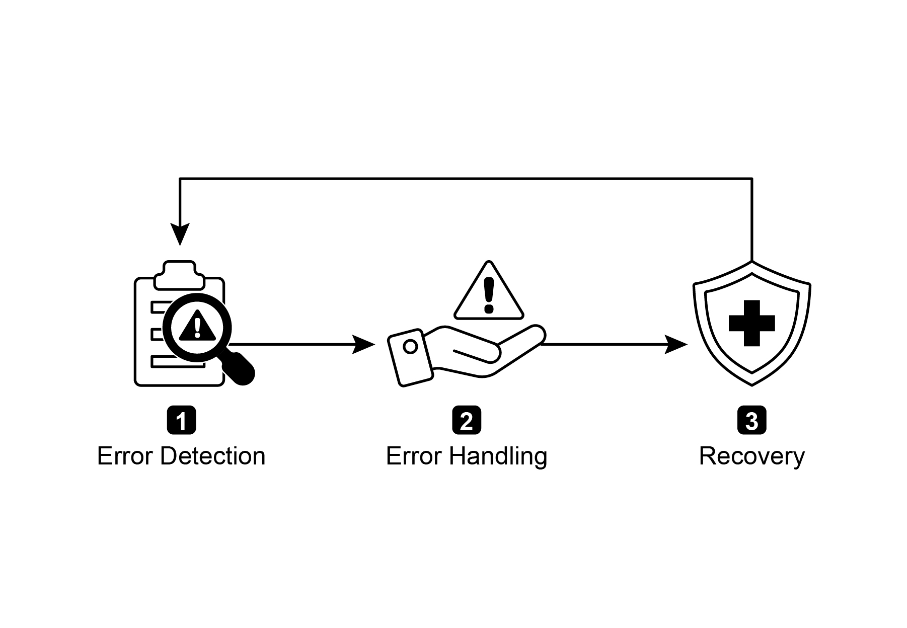
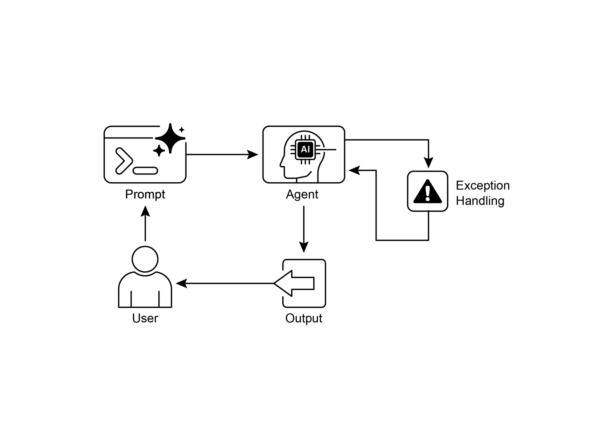

# 第 12 章:例外處理與復原(Exception Handling and Recovery)

對於要在多樣化的真實環境中可靠運作的 AI 代理(AI agent)而言,它們必須能夠應對無法預見的情況、錯誤與故障。正如人類會適應意料之外的障礙,智慧型代理也需要穩健的系統來偵測問題、啟動復原程序,或至少確保以可控的方式失敗。這項根本需求,正是例外處理與復原(Exception Handling and Recovery)模式的基礎。

這個模式聚焦於開發出格外耐用且具韌性的代理,使其能在面對各種困難與異常時,仍維持不中斷的功能與運作完整性。它強調的是:同時兼顧主動式的準備與反應式的策略,以確保即使遭遇挑戰,仍能持續運作。這種適應力對於代理要在複雜且難以預測的環境中順利運作至關重要,最終能提升它們整體的效能與可信賴度。

處理意外事件的能力,確保了這些 AI 系統不僅聰明,而且穩定可靠,從而讓人們對其部署與表現更具信心。整合全面的監控與診斷工具,能進一步強化代理快速辨識並處理問題的能力,防止潛在的中斷,並確保在不斷變動的環境中能更順暢地運作。這些進階系統對於維持 AI 運作的完整性與效率至關重要,也強化了它們管理複雜性與不可預測性的能力。

這個模式有時可能與反思(reflection)搭配使用。舉例來說,如果初次嘗試失敗並引發例外(exception),反思的過程便能分析這次失敗,並以更精煉的做法(例如改良過的提示)重新嘗試任務,以解決該錯誤。

## 例外處理與復原模式總覽

例外處理與復原模式,因應的是 AI 代理管理運作失敗的需求。這個模式涉及預先設想潛在的問題(例如工具錯誤或服務無法使用),並擬定緩解這些問題的策略。這些策略可能包括錯誤記錄(error logging)、重試(retries)、後備(fallbacks)、優雅降級(graceful degradation)與通知(notifications)。此外,這個模式也強調復原機制,例如狀態回滾(state rollback)、診斷(diagnosis)、自我修正(self-correction)與升級轉介(escalation),以將代理恢復到穩定的運作狀態。實作這個模式能提升 AI 代理的可靠性與穩健性,讓它們得以在難以預測的環境中運作。實務應用的例子包括:處理資料庫錯誤的聊天機器人、應對金融錯誤的交易機器人,以及處理裝置故障的智慧家庭代理。這個模式確保代理即使遭遇複雜情況與失敗,仍能持續有效運作。



*圖 1:AI 代理之例外處理與復原的關鍵組成元件。*

**錯誤偵測(Error Detection):** 這涉及在問題發生時審慎地加以辨識。問題可能表現為:無效或格式不正確的工具輸出、特定的 API 錯誤(例如 404(Not Found,找不到)或 500(Internal Server Error,內部伺服器錯誤)代碼)、來自服務或 API 的反應時間異常過長,或是偏離預期格式的不連貫、無意義回應。此外,也可以導入由其他代理或專門監控系統進行的監控,以更主動地偵測異常,讓系統能在潛在問題擴大之前就將其攔截。

**錯誤處理(Error Handling):** 一旦偵測到錯誤,擬定一個經過縝密思考的回應計畫便至關重要。這包括:在日誌(log)中審慎記錄錯誤細節,以供日後除錯與分析(記錄)。重試該動作或請求——有時會稍微調整參數——可能是一種可行的策略,對於暫時性錯誤(transient errors)尤其如此(重試)。運用替代策略或方法(後備)可以確保部分功能得以維持。在無法立即完全復原的情況下,代理可以維持部分功能,以至少提供一些價值(優雅降級)。最後,對於需要人工介入或協作的情況,警示人類操作員或其他代理可能至關重要(通知)。

**復原(Recovery):** 這個階段的重點,在於錯誤發生後將代理或系統恢復到穩定且可運作的狀態。它可能涉及還原近期的變更或交易,以撤銷錯誤所造成的影響(狀態回滾)。徹底調查錯誤的成因,對於防止錯誤再次發生至關重要。可能需要透過自我修正機制或重新規劃(replanning)程序,來調整代理的計畫、邏輯或參數,以避免未來再犯同樣的錯誤。在複雜或嚴重的情況下,將問題委派給人類操作員或更高層級的系統(升級轉介),可能是最佳的因應之道。

實作這套穩健的例外處理與復原模式,能把 AI 代理從脆弱、不可靠的系統,轉變為穩健、可信賴的元件,使其能在充滿挑戰且高度難以預測的環境中,有效且具韌性地運作。這確保了代理能維持其功能、將停機時間降到最低,並在面對意外問題時,仍提供順暢且可靠的體驗。

## 實務應用與使用案例

對於任何部署在無法保證完美條件之真實情境中的代理而言,例外處理與復原都至關重要。

- **客戶服務聊天機器人:** 如果聊天機器人試圖存取客戶資料庫,而資料庫暫時離線,它不應該當機。相反地,它應該偵測到該 API 錯誤、告知使用者這是暫時性的問題、或許建議稍後再試,或是將該查詢升級轉介給人類客服。

- **自動化金融交易:** 一個試圖執行交易的交易機器人,可能會遇到「資金不足」(insufficient funds)錯誤或「市場休市」(market closed)錯誤。它必須處理這些例外,做法包括記錄錯誤、不反覆嘗試同一筆無效的交易,並可能通知使用者或調整其策略。

- **智慧家庭自動化:** 一個控制智慧燈具的代理,可能會因為網路問題或裝置故障而無法開燈。它應該偵測到這次失敗、或許重試,而如果仍未成功,則通知使用者該燈無法開啟,並建議進行手動介入。

- **資料處理代理:** 一個負責處理一批文件的代理,可能會遇到一個損毀的檔案。它應該略過該損毀檔案、記錄錯誤、繼續處理其他檔案,並在最後回報被略過的檔案,而非讓整個程序停擺。

- **網頁爬取代理:** 當網頁爬取代理遇到 CAPTCHA(驗證碼)、網站結構變動或伺服器錯誤(例如 404 Not Found、503 Service Unavailable,服務無法使用)時,它必須優雅地加以處理。這可能涉及暫停、改用代理伺服器(proxy),或回報失敗的特定 URL。

- **機器人技術與製造業:** 一支執行組裝任務的機械手臂,可能會因為對位不正而無法夾取某個零件。它必須偵測到這次失敗(例如透過感測器回饋)、嘗試重新校準、重試夾取,而若問題持續存在,則警示人類操作員或改用另一個零件。

簡而言之,這個模式是建構代理的根本所在——這樣的代理不僅聰明,而且在面對真實世界的複雜性時,也是可靠、具韌性且對使用者友善的。

## 動手實作範例(ADK)

例外處理與復原對於系統的穩健性與可靠性至關重要。舉例來說,試想代理對一次失敗的工具呼叫所做的回應。這類失敗可能源於不正確的工具輸入,或是工具所依賴之外部服務的問題。

```python
from google.adk.agents import Agent, SequentialAgent

# 代理 1:嘗試使用主要工具。它的職責範圍狹窄而明確。
primary_handler = Agent(
    name="primary_handler",
    model="gemini-2.0-flash-exp",
    # 提示詞中譯:
    # 你的工作是取得精確的地點資訊。
    # 請使用 get_precise_location_info 工具,並帶入使用者提供的
    # 地址。
    instruction="""
    Your job is to get precise location information.
    Use the get_precise_location_info tool with the user's provided
    address.
    """,
    tools=[get_precise_location_info]
)

# 代理 2:作為後備處理器,檢查狀態以決定其動作。
fallback_handler = Agent(
    name="fallback_handler",
    model="gemini-2.0-flash-exp",
    # 提示詞中譯:
    # 透過檢視 state["primary_location_failed"],判斷主要的地點查詢
    # 是否失敗。
    # - 如果為 True,從使用者原始的查詢中擷取城市,並
    # 使用 get_general_area_info 工具。
    # - 如果為 False,則不採取任何動作。
    instruction="""
    Check if the primary location lookup failed by looking at
    state["primary_location_failed"].
    - If it is True, extract the city from the user's original query and
    use the get_general_area_info tool.
    - If it is False, do nothing.
    """,
    tools=[get_general_area_info]
)

# 代理 3:從狀態中呈現最終結果。
response_agent = Agent(
    name="response_agent",
    model="gemini-2.0-flash-exp",
    # 提示詞中譯:
    # 審視儲存在 state["location_result"] 中的地點資訊。
    # 將這項資訊清楚而簡潔地呈現給使用者。
    # 如果 state["location_result"] 不存在或為空,則為無法
    # 取得該地點向使用者致歉。
    instruction="""
    Review the location information stored in state["location_result"].
    Present this information clearly and concisely to the user.
    If state["location_result"] does not exist or is empty, apologize
    that you could not retrieve the location.
    """,
    tools=[]  # 這個代理只針對最終狀態進行推理。
)

# SequentialAgent 確保這些處理器以有保證的順序執行。
robust_location_agent = SequentialAgent(
    name="robust_location_agent",
    sub_agents=[primary_handler, fallback_handler, response_agent]
)
```

這段程式碼使用 ADK 的 `SequentialAgent` 搭配三個子代理(sub-agent),定義了一個穩健的地點檢索系統。`primary_handler` 是第一個代理,負責使用 `get_precise_location_info` 工具嘗試取得精確的地點資訊。`fallback_handler` 作為後備,透過檢查一個狀態變數來判斷主要查詢是否失敗。如果主要查詢失敗,後備代理會從使用者的查詢中擷取城市,並使用 `get_general_area_info` 工具。`response_agent` 是序列中的最後一個代理。它會審視儲存在狀態中的地點資訊。這個代理的設計目的是向使用者呈現最終結果。如果沒有找到任何地點資訊,它就會道歉。`SequentialAgent` 確保這三個代理依照預先定義的順序執行。這種結構讓地點資訊的檢索得以採用分層式的做法。

## 重點速覽

**是什麼(What):** 在真實環境中運作的 AI 代理,無可避免地會遇到無法預見的情況、錯誤與系統故障。這些干擾的範圍涵蓋工具失敗、網路問題乃至無效資料,都會威脅到代理完成任務的能力。若沒有一套有結構的方式來管理這些問題,代理在面對意外障礙時,可能會變得脆弱、不可靠,並容易完全失敗。這種不可靠性,使得在那些需要穩定表現的關鍵或複雜應用中部署它們變得困難重重。

**為什麼(Why):** 例外處理與復原模式提供了一套標準化的解法,用以建構穩健且具韌性的 AI 代理。它賦予代理一種代理式(agentic)能力,得以預先設想、管理運作失敗並從中復原。這個模式涉及主動式的錯誤偵測(例如監控工具輸出與 API 回應),以及反應式的處理策略(例如為診斷而記錄、重試暫時性失敗,或運用後備機制)。對於更嚴重的問題,它定義了復原協定,包括還原至穩定狀態、透過調整計畫進行自我修正,或將問題升級轉介給人類操作員。這種有系統的做法,確保代理能維持運作完整性、從失敗中學習,並在難以預測的環境中可靠地運作。

**經驗法則(Rule of thumb):** 當 AI 代理部署於動態的真實環境中,可能發生系統失敗、工具錯誤、網路問題或不可預測的輸入,且運作可靠性是關鍵需求時,就使用此模式。

## 視覺摘要



*圖 2:例外處理模式。*

## 重點整理

需要記住的要點:

- 例外處理與復原,對於建構穩健且可靠的代理至關重要。
- 這個模式涉及偵測錯誤、優雅地處理錯誤,以及實作復原策略。
- 錯誤偵測可以涉及驗證工具輸出、檢查 API 錯誤代碼,以及使用逾時(timeouts)。
- 處理策略包括記錄、重試、後備、優雅降級與通知。
- 復原聚焦於透過診斷、自我修正或升級轉介,來恢復穩定的運作。
- 這個模式確保代理即使在難以預測的真實環境中,也能有效運作。

## 結論

本章探討例外處理與復原模式,這對於開發穩健且可信賴的 AI 代理至關重要。這個模式因應的是:AI 代理如何辨識並管理意外問題、實作適切的回應,並復原至穩定的運作狀態。本章討論了這個模式的各個面向,包括錯誤的偵測、透過記錄、重試與後備等機制來處理這些錯誤,以及用來將代理或系統恢復到正常運作的各種策略。例外處理與復原模式的實務應用,跨越數個領域加以說明,以展現其在處理真實世界複雜性與潛在失敗時的相關性。這些應用顯示,為 AI 代理配備例外處理能力,如何能在動態環境中提升它們的可靠性與適應力。

## 參考資料

1. McConnell, S. (2004). *Code Complete* (2nd ed.). Microsoft Press.
2. Shi, Y., Pei, H., Feng, L., Zhang, Y., & Yao, D. (2024). Towards Fault Tolerance in Multi-Agent Reinforcement Learning. arXiv preprint arXiv:2412.00534.
3. O'Neill, V. (2022). Improving Fault Tolerance and Reliability of Heterogeneous Multi-Agent IoT Systems Using Intelligence Transfer. *Electronics*, 11(17), 2724.
