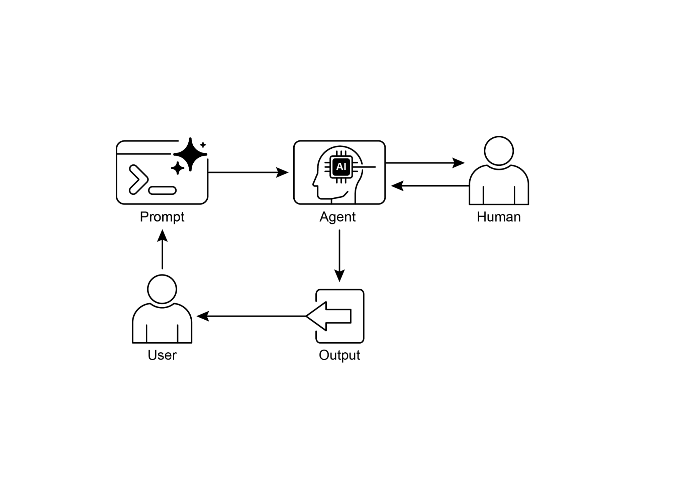

# 第 13 章:人在迴路中(Human-in-the-Loop)

人在迴路中(Human-in-the-Loop,HITL)模式,代表了在開發與部署代理(Agent)時的一項關鍵策略。它刻意地把人類認知的獨特優勢——例如判斷力、創造力與細膩的理解——與 AI 的運算能力和效率交織在一起。這種策略性的整合不僅僅是一個選項,更往往是一種必要,尤其是在 AI 系統日益深入關鍵決策流程的當下。

HITL 的核心原則,是確保 AI 在符合倫理的界線內運作、遵循安全協定,並以最佳效能達成其目標。在那些以複雜性、模糊性或重大風險為特徵的領域中,這些考量尤其迫切,因為 AI 一旦出錯或誤判,所造成的影響可能極為深遠。在這類情境下,完全自主——也就是 AI 系統在沒有任何人類介入下獨立運作——可能反而是不智之舉。HITL 正視了這個現實,並強調即便 AI 技術正快速進步,人類的監督、策略性的投入以及協作式的互動仍然不可或缺。

HITL 的做法,從根本上圍繞著人工智慧與人類智慧之間「協同綜效(synergy)」的理念。HITL 並不把 AI 視為人類工作者的替代品,而是把 AI 定位為一種能擴增並強化人類能力的工具。這種擴增可以有多種形式,從自動化例行任務,到提供以資料為依據的洞見以協助人類做出決策。最終目標是打造一個協作生態系,讓人類與 AI 代理都能發揮各自獨特的優勢,達成單靠任何一方都無法企及的成果。

在實務上,HITL 可以用多種方式實作。一種常見的做法是讓人類擔任驗證者或審查者,檢視 AI 的輸出以確保準確性並找出潛在錯誤。另一種實作方式則是讓人類主動引導 AI 的行為,即時提供回饋或做出修正。在更複雜的設定中,人類可能會以夥伴的身分與 AI 協作,透過互動式對話或共享介面,共同解決問題或做出決策。無論具體的實作方式為何,HITL 模式都強調維持人類掌控與監督的重要性,確保 AI 系統始終與人類的倫理、價值觀、目標以及社會期待保持一致。

## 人在迴路中模式總覽

人在迴路中(HITL)模式,把人工智慧與人類的投入整合在一起,以強化代理的能力。這種做法承認:最佳的 AI 表現往往需要結合自動化處理與人類洞見,尤其是在高度複雜或涉及倫理考量的情境中。HITL 的目的並非取代人類的投入,而是透過確保關鍵的判斷與決策能以人類的理解為依據,來擴增人類的能力。

HITL 涵蓋了幾個關鍵面向:

- **人類監督(Human Oversight):** 涉及監控 AI 代理的表現與輸出(例如透過日誌審查或即時儀表板),以確保其遵循準則並防止不良後果。
- **介入與修正(Intervention and Correction):** 當 AI 代理遭遇錯誤或模糊情境時,可能會請求人類介入;人類操作者可以修正錯誤、補上缺漏的資料,或引導代理,這同時也有助於代理未來的改進。
- **供學習用的人類回饋(Human Feedback for Learning):** 蒐集並用以精煉 AI 模型,這在「以人類回饋進行的強化學習(reinforcement learning with human feedback)」這類方法論中尤為突出,其中人類的偏好直接影響代理的學習軌跡。
- **決策擴增(Decision Augmentation):** 由 AI 代理提供分析與建議給人類,再由人類做出最終決策,透過 AI 生成的洞見來強化人類的決策能力,而非交由 AI 完全自主。
- **人機協作(Human-Agent Collaboration):** 一種人類與 AI 代理各自貢獻所長的合作式互動;例行的資料處理可交由代理處理,而具創造性的問題解決或複雜的協商則由人類負責。
- **升級政策(Escalation Policies):** 已建立的協定,規範代理應在何時、以何種方式把任務升級給人類操作者,以防止在超出代理能力範圍的情境中發生錯誤。

實作 HITL 模式,使得在那些完全自主並不可行或不被允許的敏感領域中運用代理成為可能。它也透過回饋迴路提供了持續改進的機制。舉例來說,在金融領域,一筆大型企業貸款的最終核准,需要由人類放款專員來評估諸如領導者品格這類質性因素。同樣地,在法律領域,正義與問責的核心原則要求由人類法官對量刑這類涉及複雜道德推理的關鍵決策保有最終裁量權。

**注意事項(Caveats):** 儘管 HITL 模式好處眾多,它仍有顯著的注意事項,其中最主要的便是缺乏可擴展性(scalability)。雖然人類監督能提供高度準確性,但操作者無法處理數以百萬計的任務,這形成了一種根本性的權衡取捨,往往需要採取一種混合做法——結合自動化以追求規模、並以 HITL 來確保準確性。此外,這個模式的有效性高度仰賴人類操作者的專業能力;舉例來說,雖然 AI 能生成軟體程式碼,但唯有技術純熟的開發者才能準確地辨識出細微的錯誤,並提供修正它們的正確指引。當運用 HITL 來生成訓練資料時,同樣也需要這種專業能力,因為人類標註者可能需要接受特別訓練,才能學會以一種能產出高品質資料的方式去修正 AI。最後,實作 HITL 引發了重大的隱私疑慮,因為敏感資訊往往必須經過嚴謹的匿名化處理,才能呈現給人類操作者檢視,這又增添了一層流程上的複雜度。

## 實務應用與使用案例

人在迴路中模式在眾多產業與應用中都至關重要,尤其是在準確性、安全性、倫理或細膩理解居於首位的場景。

- **內容審核(Content Moderation):** AI 代理能快速過濾海量的線上內容以找出違規之處(例如仇恨言論、垃圾訊息)。然而,模糊不清的案例或處於邊界的內容,則會升級給人類審核員審查並做出最終決定,以確保細膩的判斷以及對複雜政策的遵循。
- **自動駕駛(Autonomous Driving):** 雖然自動駕駛車輛能自主處理大部分的駕駛任務,但它們被設計成在 AI 無法有把握地應對的複雜、不可預測或危險情境中(例如極端天氣、異常的道路狀況),把控制權交還給人類駕駛。
- **金融詐欺偵測(Financial Fraud Detection):** AI 系統能根據模式標記出可疑交易。然而,高風險或模糊的警示往往會被送交人類分析師,由他們做進一步調查、聯繫客戶,並對某筆交易是否屬於詐欺做出最終判定。
- **法律文件審查(Legal Document Review):** AI 能快速掃描並分類數以千計的法律文件,以辨識相關的條款或證據。接著由人類法律專業人員審查 AI 的發現,以確認其準確性、情境與法律意涵,在關鍵案件中尤其如此。
- **客戶支援(複雜問題):** 聊天機器人或許能處理例行的客戶詢問。如果使用者的問題過於複雜、情緒激動,或需要 AI 無法提供的同理心,對話便會無縫地交接給人類支援人員。
- **資料標記與標註(Data Labeling and Annotation):** AI 模型在訓練時往往需要大量已標記資料的資料集。人類被納入迴路中,以準確地標記影像、文字或音訊,提供 AI 學習所依據的真實標準(ground truth)。隨著模型不斷演進,這是一個持續進行的過程。
- **生成式 AI 的精煉(Generative AI Refinement):** 當 LLM 生成創意內容(例如行銷文案、設計構想)時,人類編輯或設計師會審查並精煉其輸出,確保它符合品牌準則、能引起目標受眾的共鳴,並維持品質。
- **自主網路(Autonomous Networks):** AI 系統能藉由運用關鍵績效指標(KPI)與已辨識出的模式,來分析警示並預測網路問題與流量異常。儘管如此,關鍵決策——例如處理高風險警示——仍經常被升級給人類分析師。這些分析師會進行進一步調查,並對是否核准網路變更做出最終判定。

這個模式體現了一種務實的 AI 實作方法。它善用 AI 來提升可擴展性與效率,同時維持人類監督以確保品質、安全與倫理上的合規。

「人在迴路上(Human-on-the-loop)」是這個模式的一種變體,其中由人類專家定義總體政策,接著由 AI 處理即時的行動以確保合規。讓我們來看兩個例子:

- **自動化金融交易系統:** 在這個情境中,由人類金融專家設定總體的投資策略與規則。例如,人類可能把政策定義為:「維持一個由 70% 科技股與 30% 債券組成的投資組合,任一單一公司的投資不得超過 5%,並自動賣出任何跌破其買進價 10% 的股票。」接著 AI 即時監控股市,在符合這些預先定義的條件時立即執行交易。AI 處理的是基於人類操作者所設定之較慢、較具策略性政策的即時、高速行動。
- **現代客服中心(Call Center):** 在這個設定中,由人類經理為客戶互動建立高層級的政策。例如,經理可能設定這樣的規則:「任何提及『服務中斷(service outage)』的來電,都應立即轉接給技術支援專員」,或是「若客戶的語氣顯示出高度挫折,系統應主動提議直接為其轉接人類客服。」接著 AI 系統處理初始的客戶互動,即時聆聽並理解他們的需求。它會自主地執行經理的政策——即時轉接來電或提供升級選項——而無需就每一個別案例都尋求人類介入。這讓 AI 得以依照人類操作者所提供之較慢、較具策略性的指引,來管理大量的即時行動。

## 動手實作範例

為了示範人在迴路中模式,一個 ADK 代理可以辨識出需要人類審查的情境,並啟動一個升級流程。這讓人類得以在代理自主決策能力受限、或需要進行複雜判斷的情境中介入。這並非單一框架獨有的功能;其他熱門框架也採用了類似的能力。例如,LangChain 同樣提供了實作這類互動的工具。

```python
from google.adk.agents import Agent
from google.adk.tools.tool_context import ToolContext
from google.adk.callbacks import CallbackContext
from google.adk.models.llm import LlmRequest
from google.genai import types
from typing import Optional

# 工具的佔位實作(在需要時請替換成實際的實作)
def troubleshoot_issue(issue: str) -> dict:
    return {"status": "success", "report": f"Troubleshooting steps for {issue}."}

def create_ticket(issue_type: str, details: str) -> dict:
    return {"status": "success", "ticket_id": "TICKET123"}

def escalate_to_human(issue_type: str) -> dict:
    # 在真實系統中,這通常會把案件轉移到人類處理佇列
    return {"status": "success", "message": f"Escalated {issue_type} to a human specialist."}

technical_support_agent = Agent(
    name="technical_support_specialist",
    model="gemini-2.0-flash-exp",
    # 提示詞中譯:
    # 你是我們這家電子產品公司的技術支援專員。
    #
    # 首先,檢查使用者在 state["customer_info"]["support_history"] 中是否有支援歷史。
    # 若有,請在你的回應中參照這段歷史。
    #
    # 針對技術問題:
    # 1. 使用 troubleshoot_issue 工具來分析問題。
    # 2. 引導使用者完成基本的疑難排解步驟。
    # 3. 若問題仍然存在,使用 create_ticket 記錄此問題。
    #
    # 針對超出基本疑難排解範圍的複雜問題:
    # 1. 使用 escalate_to_human 轉接給人類專員。
    #
    # 維持專業但具同理心的語氣。在提供清晰的解決步驟的同時,
    # 體諒技術問題可能造成的挫折感。
    instruction="""
You are a technical support specialist for our electronics company.

FIRST, check if the user has a support history in state["customer_info"]["support_history"]. If they do, reference this history in your responses.

For technical issues:
1. Use the troubleshoot_issue tool to analyze the problem.
2. Guide the user through basic troubleshooting steps.
3. If the issue persists, use create_ticket to log the issue.

For complex issues beyond basic troubleshooting:
1. Use escalate_to_human to transfer to a human specialist.

Maintain a professional but empathetic tone. Acknowledge the frustration technical issues can cause, while providing clear steps toward resolution.
""",
    tools=[troubleshoot_issue, create_ticket, escalate_to_human]
)

def personalization_callback(
    callback_context: CallbackContext, llm_request: LlmRequest
) -> Optional[LlmRequest]:
    """Adds personalization information to the LLM request."""
    # 從 state 取得客戶資訊
    customer_info = callback_context.state.get("customer_info")
    if customer_info:
        customer_name = customer_info.get("name", "valued customer")
        customer_tier = customer_info.get("tier", "standard")
        recent_purchases = customer_info.get("recent_purchases", [])
        # 提示詞中譯(以下文字會以系統訊息形式注入提示):
        # 重要個人化資訊:
        # 客戶姓名:{customer_name}
        # 客戶層級:{customer_tier}
        # (若有近期購買紀錄)近期購買:...
        personalization_note = (
            f"\nIMPORTANT PERSONALIZATION:\n"
            f"Customer Name: {customer_name}\n"
            f"Customer Tier: {customer_tier}\n"
        )
        if recent_purchases:
            personalization_note += f"Recent Purchases: {', '.join(recent_purchases)}\n"

        if llm_request.contents:
            # 在第一段內容之前,加入一則系統訊息
            system_content = types.Content(
                role="system",
                parts=[types.Part(text=personalization_note)]
            )
            llm_request.contents.insert(0, system_content)

    return None  # 回傳 None 以使用修改後的請求繼續執行
```

這段程式碼提供了一份藍圖,示範如何運用 Google 的 ADK 建立一個圍繞 HITL 框架設計的技術支援代理。這個代理扮演著智慧型第一線支援的角色,它配置了特定的指令,並裝備了 `troubleshoot_issue`、`create_ticket` 與 `escalate_to_human` 等工具,以管理一套完整的支援工作流程。其中升級工具是 HITL 設計的核心部分,確保複雜或敏感的案例能被交付給人類專員。

這套架構的一項關鍵特色,是它透過一個專屬的回呼(callback)函式所達成的深度個人化能力。在聯繫 LLM 之前,這個函式會動態地從代理的狀態(state)中擷取客戶特定的資料——例如他們的姓名、層級與購買歷史。接著這個情境會以系統訊息的形式被注入提示中,使代理得以提供高度量身打造、且能參照使用者歷史的知情回應。透過把結構化的工作流程,與不可或缺的人類監督以及動態的個人化結合在一起,這段程式碼成為一個實務範例,展現了 ADK 如何促成精密而穩健的 AI 支援解決方案之開發。

## 重點速覽

**是什麼(What):** AI 系統(包括先進的 LLM)在面對需要細膩判斷、倫理推理,或對複雜、模糊情境有深刻理解的任務時,往往力有未逮。在高風險環境中部署完全自主的 AI 帶有重大風險,因為錯誤可能導致嚴重的安全、財務或倫理後果。這些系統缺乏人類所擁有的固有創造力與常識推理。因此,在關鍵決策流程中僅僅仰賴自動化,往往並不明智,並可能損及系統整體的有效性與可信賴度。

**為什麼(Why):** 人在迴路中(HITL)模式提供了一套標準化的解法,藉由策略性地把人類監督整合進 AI 工作流程之中。這種代理式(agentic)的做法創造出一種共生的夥伴關係——AI 負責繁重的運算與資料處理,而人類則提供關鍵的驗證、回饋與介入。如此一來,HITL 確保了 AI 的行動能與人類的價值觀及安全協定保持一致。這個協作框架不僅減輕了完全自動化的風險,更透過持續從人類投入中學習來強化系統的能力。最終,這帶來了更穩健、更準確且更合乎倫理的成果——而這是人類或 AI 單獨都無法達成的。

**經驗法則(Rule of thumb):** 當你要在錯誤會帶來重大安全、倫理或財務後果的領域(例如醫療、金融或自主系統)中部署 AI 時,使用此模式。對於涉及 LLM 無法可靠處理之模糊性與細微差異的任務(例如內容審核或複雜的客戶支援升級),它也是不可或缺的。當目標是要以高品質、由人類標記的資料持續改進 AI 模型,或是要精煉生成式 AI 的輸出以符合特定品質標準時,也應採用 HITL。

**視覺摘要:**



*圖 1:人在迴路中設計模式。*

## 重點整理

重點整理如下:

- 人在迴路中(HITL)把人類的智慧與判斷整合進 AI 工作流程之中。
- 在複雜或高風險的情境中,它對於安全、倫理與有效性至關重要。
- 關鍵面向包括人類監督、介入、供學習用的回饋,以及決策擴增。
- 升級政策對於讓代理知道何時該把任務交接給人類而言不可或缺。
- HITL 使負責任的 AI 部署與持續改進成為可能。
- 人在迴路中的主要缺點,在於它本質上缺乏可擴展性——這在準確性與處理量之間形成了權衡取捨——以及它對高度熟練的領域專家進行有效介入的依賴。
- 它的實作帶來了營運上的挑戰,包括需要訓練人類操作者以進行資料生成,以及需要透過匿名化敏感資訊來處理隱私疑慮。

## 結論

本章探討了至關重要的人在迴路中(HITL)模式,強調它在打造穩健、安全且合乎倫理的 AI 系統中所扮演的角色。我們討論了把人類監督、介入與回饋整合進代理工作流程中,如何能顯著提升其表現與可信賴度,尤其是在複雜而敏感的領域。各項實務應用展現了 HITL 廣泛的效用,從內容審核、醫療診斷,到自動駕駛與客戶支援。概念性的程式碼範例則讓我們得以一窺 ADK 如何透過升級機制促成這些人機互動。隨著 AI 能力持續精進,HITL 仍是負責任之 AI 開發的基石,確保人類的價值觀與專業始終居於智慧型系統設計的核心。

## 參考資料

1. A Survey of Human-in-the-loop for Machine Learning, Xingjiao Wu, Luwei Xiao, Yixuan Sun, Junhang Zhang, Tianlong Ma, Liang He. <https://arxiv.org/abs/2108.00941>
