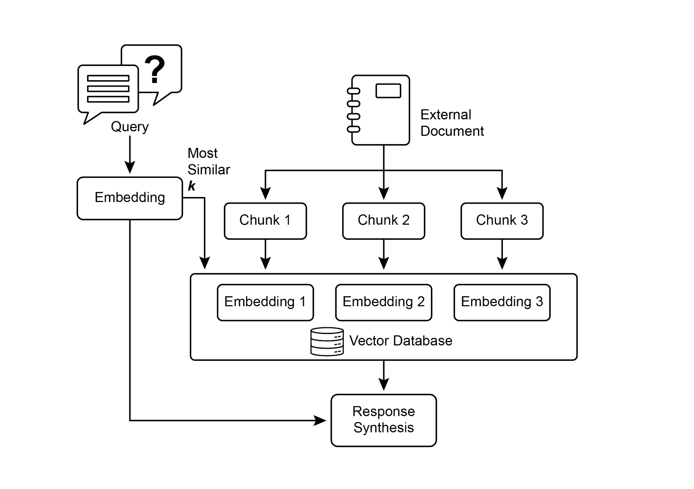
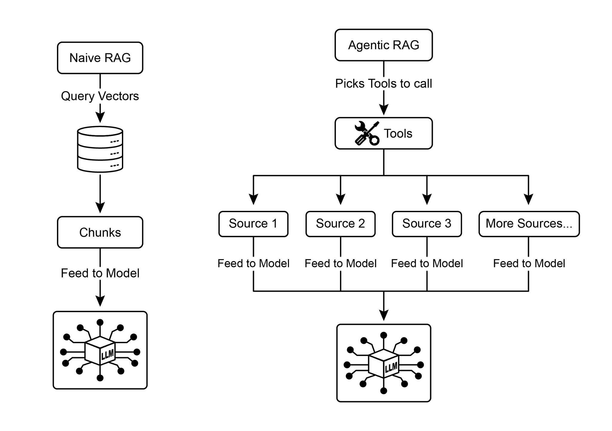
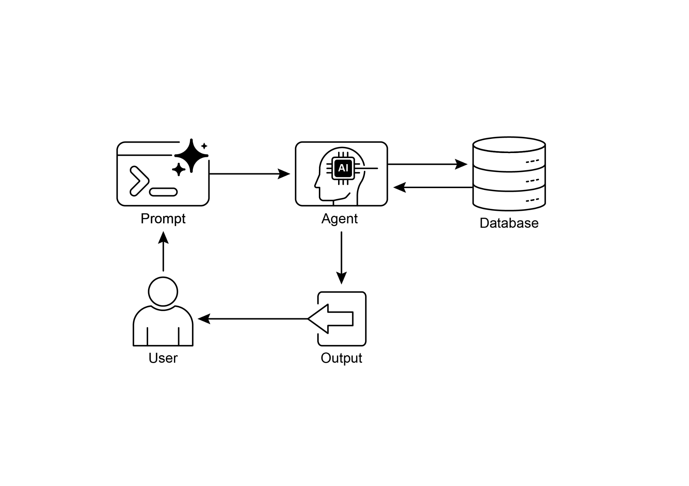
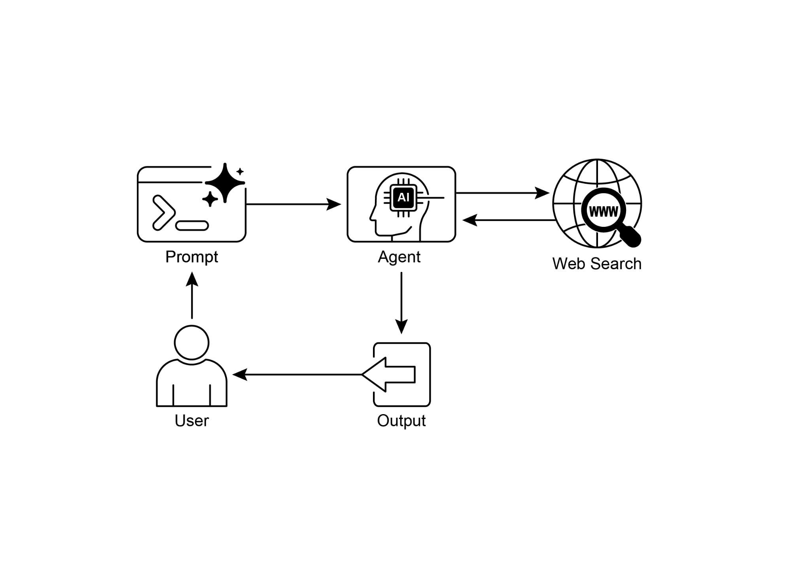

# 第 14 章:知識檢索(Knowledge Retrieval, RAG)

大型語言模型(LLM)在生成擬人化文字方面展現了強大的能力。然而,它們的知識庫通常侷限於訓練時所使用的資料,這限制了它們取得即時資訊、特定公司資料或高度專業細節的能力。知識檢索(Knowledge Retrieval,RAG,即檢索增強生成,Retrieval Augmented Generation)正是為了解決這項侷限而生。RAG 讓 LLM 能夠存取並整合外部的、最新的、且具情境特定性的資訊,從而提升其輸出的準確度、相關性與事實依據。

對 AI 代理(AI agent)而言,這一點至關重要,因為它讓代理能夠把自身的行動與回應奠基在即時、可驗證的資料上,而不只是侷限於靜態的訓練內容。這項能力使代理得以準確地執行複雜任務,例如存取最新的公司政策以回答某個特定問題,或在下單前先確認當前的庫存量。透過整合外部知識,RAG 把代理從單純的對話者,轉變為能夠執行有意義工作的高效、資料驅動工具。

## 知識檢索(RAG)模式總覽

知識檢索(RAG)模式在 LLM 生成回應之前,先賦予它存取外部知識庫的能力,從而大幅強化 LLM 的表現。RAG 不再讓 LLM 單純依賴其內部的、預先訓練好的知識,而是允許 LLM「查閱」資訊,就如同人類可能會去翻書或上網搜尋一樣。這個過程賦予 LLM 提供更準確、更即時且可驗證之答案的能力。

當使用者向一個採用 RAG 的 AI 系統提出問題或下達提示時,這個查詢並不會被直接送往 LLM。相反地,系統會先在一個龐大的外部知識庫——一個高度組織化的文件、資料庫或網頁的資料庫——中搜尋相關資訊。這項搜尋並非單純的關鍵字比對;它是一種「語意搜尋(semantic search)」,能理解使用者的意圖以及文字背後的意義。這次初步搜尋會擷取出最切題的片段,也就是資訊的「區塊(chunks)」。接著,這些擷取出的片段會被「增強(augmented)」,也就是被添加進原始的提示裡,構成一個更豐富、資訊更充分的查詢。最後,這個經過強化的提示才會被送往 LLM。有了這份額外的情境,LLM 便能生成一個不僅流暢自然、更在事實上奠基於所檢索資料的回應。

RAG 框架帶來了數項重要的好處。它讓 LLM 能夠存取最新資訊,從而克服其靜態訓練資料的限制。這種做法也藉由把回應奠基在可驗證的資料上,降低了「幻覺(hallucination)」——即生成錯誤資訊——的風險。此外,LLM 還能運用內部公司文件或維基(wiki)中所蘊含的專業知識。這個過程的一項關鍵優勢在於能夠提供「引用(citations)」,精準指出資訊的確切來源,從而提升 AI 回應的可信度與可驗證性。

要充分理解 RAG 如何運作,有幾個核心概念是必須掌握的(見圖 1):

**嵌入(Embeddings):** 在 LLM 的脈絡中,嵌入是文字(例如單字、片語或整份文件)的數值表示形式。這些表示形式採取向量(vector)的形式,也就是一串數字。其核心理念是在一個數學空間中,捕捉不同文字片段之間的語意與彼此的關係。意義相近的單字或片語,在這個向量空間中的嵌入也會彼此靠近。舉例來說,想像一張簡單的 2D 圖。單字「cat」也許會以座標 (2, 3) 來表示,而「kitten」則會非常靠近,位於 (2.1, 3.1)。相對地,單字「car」則會有一個距離較遠的座標,例如 (8, 1),反映出它截然不同的意義。在現實中,這些嵌入存在於一個維度高得多的空間裡,擁有數百甚至數千個維度,讓系統得以對語言有極為細膩的理解。

**文字相似度(Text Similarity):** 文字相似度指的是衡量兩段文字有多麼相似。這可以是表面層次的,著眼於單字的重疊(詞彙相似度,lexical similarity),也可以是更深層、以意義為基礎的層次。在 RAG 的脈絡中,文字相似度對於在知識庫裡找出與使用者查詢最相關的資訊至關重要。舉例來說,考慮這兩個句子:「What is the capital of France?」與「Which city is the capital of France?」。儘管措辭不同,它們問的卻是同一個問題。一個好的文字相似度模型會辨識出這一點,並為這兩個句子賦予很高的相似度分數,即使它們只共用了寥寥幾個單字。這通常是透過文字的嵌入來計算的。

**語意相似度與距離(Semantic Similarity and Distance):** 語意相似度是文字相似度更進階的形式,它純粹聚焦於文字的意義與情境,而非僅僅看所用的字詞。它的目標是去理解兩段文字是否傳達了相同的概念或想法。語意距離(semantic distance)則是它的反面;高語意相似度意味著低語意距離,反之亦然。在 RAG 中,語意搜尋仰賴於找出與使用者查詢之間語意距離最小的文件。舉例來說,片語「a furry feline companion」與「a domestic cat」除了「a」之外沒有任何共同的字詞。然而,一個能理解語意相似度的模型會辨識出它們指涉的是同一件事物,並認定它們高度相似。這是因為它們的嵌入在向量空間中會非常靠近,代表著很小的語意距離。這正是讓 RAG 即使在使用者措辭與知識庫文字並不完全相符時,仍能找到相關資訊的「智慧搜尋(smart search)」。



*圖 1:RAG 核心概念:區塊化(Chunking)、嵌入(Embeddings)與向量資料庫(Vector Database)。*

**文件的區塊化(Chunking of Documents):** 區塊化是把大型文件拆解成較小、較易管理的片段(即「區塊」)的過程。一個 RAG 系統若要有效率地運作,就不能把整份龐大的文件餵給 LLM,而是會處理這些較小的區塊。文件被切分的方式,對於保留資訊的情境與意義相當重要。舉例來說,與其把一份 50 頁的使用者手冊當成單一一大塊文字來處理,區塊化策略可能會把它拆解成數個章節、段落,甚至是句子。例如,「Troubleshooting(疑難排解)」章節會是一個與「Installation Guide(安裝指南)」分開的獨立區塊。當使用者針對某個特定問題提問時,RAG 系統便能檢索出最相關的疑難排解區塊,而非整份手冊。這讓檢索過程更快,且提供給 LLM 的資訊也更聚焦、更貼近使用者當下的需求。

文件一旦被區塊化,RAG 系統就必須採用某種檢索技術,針對特定查詢找出最相關的片段。主要的方法是向量搜尋(vector search),它運用嵌入與語意距離來找出在概念上與使用者問題相似的區塊。另一種較為老舊、但仍具價值的技術是 BM25,這是一種以關鍵字為基礎的演算法,它根據詞頻來為區塊排序,而不理解語意。為了兼得兩者之長,人們經常採用混合搜尋(hybrid search)的做法,把 BM25 的關鍵字精準度與語意搜尋的情境理解能力結合起來。這種融合讓檢索能更穩健、更準確,同時捕捉到字面上的吻合與概念上的相關性。

**向量資料庫(Vector databases):** 向量資料庫是一種專門設計用來高效率儲存與查詢嵌入的資料庫。當文件被區塊化並轉換成嵌入後,這些高維向量便會被儲存在向量資料庫中。傳統的檢索技術,例如以關鍵字為基礎的搜尋,雖然非常擅長找出包含查詢中確切字詞的文件,卻欠缺對語言的深層理解。它們無法辨識出「furry feline companion」其實指的就是「cat」。這正是向量資料庫的擅長之處。它們是專為語意搜尋而打造的。透過把文字儲存為數值向量,它們能夠根據概念上的意義來尋找結果,而不僅僅是關鍵字的重疊。當使用者的查詢同樣被轉換成向量後,資料庫便會運用高度最佳化的演算法(例如 HNSW,Hierarchical Navigable Small World,階層式可導航小世界圖),在數百萬個向量中快速搜尋,找出在意義上「最接近」的那些。這種做法對 RAG 而言遠為優越,因為即使使用者的措辭與來源文件完全不同,它仍能發掘出相關的情境。本質上,當其他技術在搜尋字詞時,向量資料庫搜尋的是意義。這項技術以各種形式被實作出來,從 Pinecone、Weaviate 這類受管理的資料庫,到 Chroma DB、Milvus、Qdrant 等開源解決方案皆有。甚至連既有的資料庫也能被增添向量搜尋的能力,如 Redis、Elasticsearch 與 Postgres(使用 pgvector 擴充套件)所展示的那樣。其核心檢索機制往往由 Meta AI 的 FAISS 或 Google Research 的 ScaNN 這類函式庫所驅動,它們是這些系統得以高效運作的根本所在。

**RAG 的挑戰(RAG's Challenges):** 儘管 RAG 威力強大,這個模式並非毫無挑戰。一個主要的問題出現在:回答某個查詢所需的資訊並不侷限於單一區塊,而是散佈在一份文件的多個部分、甚至好幾份文件之中。在這類情況下,檢索器可能無法蒐集到所有必要的情境,導致答案不完整或不準確。系統的成效也高度仰賴區塊化與檢索過程的品質;若檢索到的是不相關的區塊,就可能引入雜訊並混淆 LLM。此外,有效地綜整來自可能相互矛盾之來源的資訊,對這些系統而言仍是一道重大的難關。除此之外,另一項挑戰在於:RAG 要求整個知識庫都必須經過預先處理,並儲存在向量資料庫或圖資料庫等專門的資料庫中,這是一項相當可觀的工程。因此,這些知識需要定期進行校準與調和,才能保持最新——在面對公司維基這類不斷演變的來源時,這是一項至關重要的任務。整個過程可能對效能造成明顯的影響,增加延遲(latency)、營運成本,以及最終提示所使用的 token 數量。

總結來說,檢索增強生成(RAG)模式代表著讓 AI 變得更博學、更可靠的一大躍進。透過把一個外部知識檢索步驟無縫地整合進生成過程中,RAG 解決了獨立 LLM 的若干核心侷限。嵌入與語意相似度這些基礎概念,結合關鍵字搜尋與混合搜尋等檢索技術,讓系統得以智慧地找出相關資訊,而這又是透過策略性的區塊化來使其變得可管理。整個檢索過程則由專門的向量資料庫所驅動,這些資料庫被設計來大規模地儲存並高效查詢數百萬個嵌入。儘管在檢索零碎或相互矛盾的資訊上仍存在挑戰,RAG 賦予了 LLM 生成不僅在情境上恰當、更奠基於可驗證事實之答案的能力,從而提升了人們對 AI 的信任與其實用性。

**Graph RAG:** GraphRAG 是檢索增強生成的一種進階形式,它運用知識圖譜(knowledge graph),而非單純的向量資料庫,來進行資訊檢索。它透過在這個結構化知識庫中,沿著資料實體(節點,nodes)之間的明確關係(邊,edges)進行導航,來回答複雜的查詢。它的一項關鍵優勢,在於有能力從散佈於多份文件的零碎資訊中綜整出答案,而這正是傳統 RAG 常見的失敗之處。透過理解這些連結,GraphRAG 能提供在情境上更準確、更細膩的回應。

它的使用案例包括複雜的金融分析、把公司與市場事件相連結,以及在科學研究中發掘基因與疾病之間的關係。然而,它的主要缺點在於:建立並維護一個高品質的知識圖譜所需的複雜度、成本與專業能力都相當可觀。相較於較單純的向量搜尋系統,這套架構也比較缺乏彈性,並可能引入更高的延遲。系統的成效完全取決於底層圖譜結構的品質與完整性。因此,GraphRAG 為錯綜複雜的問題提供了卓越的情境推理能力,但代價是高出許多的實作與維護成本。總結來說,當深入、相互連結的洞察比標準 RAG 的速度與簡潔更為關鍵時,GraphRAG 便能大放異彩。

**Agentic RAG:** 這個模式的一種演進形式,稱為 Agentic RAG(代理式 RAG,見圖 2),它引入了一個推理與決策層,以大幅提升資訊擷取的可靠性。它不再只是檢索並增強,而是讓一個「代理(agent)」——一個專門的 AI 元件——扮演關鍵的把關者與知識精煉者角色。這個代理不會被動地接受最初檢索到的資料,而是會主動地審視其品質、相關性與完整性,如以下幾種情境所示。

第一,代理擅長於反思與來源驗證。如果使用者問:「我們公司對遠距工作的政策是什麼?」一個標準的 RAG 可能會把一篇 2020 年的部落格文章,連同官方的 2025 年政策文件一起拉出來。然而,代理會分析這些文件的中繼資料(metadata),辨識出 2025 年的政策才是最即時、最具權威性的來源,並在把正確的情境送往 LLM 以取得精準答案之前,先捨棄那篇過時的部落格文章。



*圖 2:Agentic RAG 引入了一個推理代理,它會主動地評估、調和並精煉所檢索到的資訊,以確保最終回應更準確、更值得信賴。*

第二,代理善於調和知識衝突。想像一位財務分析師問:「Project Alpha 的第一季預算是多少?」系統檢索到兩份文件:一份初始提案載明預算為 €50,000,以及一份定案的財務報告將其列為 €65,000。Agentic RAG 會辨識出這項矛盾,把財務報告視為較可靠的來源而優先採用,並把這個經過驗證的數字提供給 LLM,以確保最終答案是奠基於最準確的資料。

第三,代理能進行多步推理,以綜整出複雜的答案。如果使用者問:「我們產品的功能與定價,跟競爭對手 X 相比如何?」代理會把這個問題分解成數個獨立的子查詢。它會分別針對自家產品的功能、自家的定價、競爭對手 X 的功能,以及競爭對手 X 的定價發起不同的搜尋。在蒐集到這些個別的資訊片段後,代理會把它們綜整成一份結構化的、比較性的情境,然後才餵給 LLM,從而促成一個單靠簡單檢索無法產生的全面性回應。

第四,代理能辨識知識缺口,並運用外部工具。假設使用者問:「我們昨天推出的新產品,市場的即時反應如何?」代理搜尋了每週更新一次的內部知識庫,卻找不到任何相關資訊。在察覺到這個缺口後,它便能啟動一項工具——例如一個即時網頁搜尋的 API——去尋找近期的新聞文章與社群媒體上的輿論情緒。代理接著運用這份剛蒐集到的外部資訊,提供一個分秒同步的最新答案,克服其靜態內部資料庫的侷限。

**Agentic RAG 的挑戰(Challenges of Agentic RAG):** 雖然威力強大,這個代理層也帶來了它自身的一系列挑戰。主要的缺點是複雜度與成本的顯著增加。設計、實作並維護代理的決策邏輯與工具整合,需要可觀的工程投入,並增加運算開銷。這種複雜度也可能導致延遲增加,因為代理的反思、工具使用與多步推理等循環,所花費的時間比標準、直接的檢索過程更多。此外,代理本身也可能成為新的錯誤來源;一個有瑕疵的推理過程,可能會讓它陷入無用的迴圈、誤解任務,或不當地捨棄相關資訊,最終反而降低了最終回應的品質。

總結來說:Agentic RAG 代表著標準檢索模式的一種精密演進,把它從一條被動的資料管線,轉變為一個主動的、解決問題的框架。透過嵌入一個能夠評估來源、調和衝突、分解複雜問題並運用外部工具的推理層,代理大幅提升了所生成答案的可靠性與深度。這項進展讓 AI 變得更值得信賴、更有能力,儘管它伴隨著系統複雜度、延遲與成本上的重要權衡,必須謹慎地加以管理。

## 實務應用與使用案例

知識檢索(RAG)正在改變大型語言模型(LLM)在各行各業的運用方式,強化它們提供更準確、更切合情境之回應的能力。

應用範圍包括:

- **企業搜尋與問答(Enterprise Search and Q&A):** 組織可以開發內部聊天機器人,運用 HR 政策、技術手冊與產品規格等內部文件來回應員工的詢問。RAG 系統會從這些文件中擷取相關段落,以輔助 LLM 形成回應。
- **客戶支援與服務台(Customer Support and Helpdesks):** 以 RAG 為基礎的系統,能透過存取產品手冊、常見問題(FAQ)與支援工單中的資訊,為客戶查詢提供精準且一致的回應。這能減少例行問題對人工直接介入的需求。
- **個人化內容推薦(Personalized Content Recommendation):** RAG 不再只做基本的關鍵字比對,而能辨識並檢索出在語意上與使用者偏好或先前互動相關的內容(文章、產品),帶來更切合的推薦。
- **新聞與時事摘要(News and Current Events Summarization):** LLM 可以與即時新聞動態整合。當被問及某個當前事件時,RAG 系統會檢索近期的文章,讓 LLM 得以產出一份最新的摘要。

透過納入外部知識,RAG 把 LLM 的能力從單純的溝通,延伸到能夠作為知識處理系統來運作。

## 動手實作範例(ADK)

為了示範知識檢索(RAG)模式,讓我們來看三個範例。

第一個範例,說明如何運用 Google 搜尋來進行 RAG,並把 LLM 奠基(ground)於搜尋結果之上。由於 RAG 涉及存取外部資訊,Google Search 工具正是一個內建檢索機制的直接範例,能夠用來增強 LLM 的知識。

```python
from google.adk.tools import google_search
from google.adk.agents import Agent

search_agent = Agent(
    name="research_assistant",
    model="gemini-2.0-flash-exp",
    # 提示詞中譯:你協助使用者研究各種主題。當被要求時,請使用 Google 搜尋工具。
    instruction="You help users research topics. When asked, use the Google Search tool",
    tools=[google_search]
)
```

第二個範例,本節說明如何在 Google ADK 中運用 Vertex AI 的 RAG 能力。所提供的程式碼示範了如何從 ADK 初始化 `VertexAiRagMemoryService`。這讓我們得以建立一條通往 Google Cloud Vertex AI RAG Corpus(語料庫)的連線。此服務透過指定語料庫的資源名稱,以及 `SIMILARITY_TOP_K` 與 `VECTOR_DISTANCE_THRESHOLD` 等選用參數來進行設定。這些參數會影響檢索過程。`SIMILARITY_TOP_K` 定義了要檢索的前幾筆最相似結果的數量。`VECTOR_DISTANCE_THRESHOLD` 則為所檢索結果的語意距離設定一個上限。這套設定讓代理能夠從指定的 RAG Corpus 中,執行可擴展且持久的語意知識檢索。這個過程有效地把 Google Cloud 的 RAG 功能整合進 ADK 代理中,從而支援開發出奠基於事實資料的回應。

```python
# 從 google.adk.memory 模組匯入所需的 VertexAiRagMemoryService 類別。
from google.adk.memory import VertexAiRagMemoryService

RAG_CORPUS_RESOURCE_NAME = "projects/your-gcp-project-id/locations/us-central1/ragCorpora/your-corpus-id"

# 定義一個選用參數,用來指定要檢索的前幾筆最相似結果的數量。
# 這控制了 RAG 服務會回傳多少個相關的文件區塊。
SIMILARITY_TOP_K = 5

# 定義一個選用參數,用來設定向量距離的門檻值。
# 此門檻值決定了所檢索結果所允許的最大語意距離;
# 距離大於此值的結果可能會被過濾掉。
VECTOR_DISTANCE_THRESHOLD = 0.7

# 初始化一個 VertexAiRagMemoryService 的實例。
# 這會建立通往你的 Vertex AI RAG Corpus 的連線。
# - rag_corpus:指定你的 RAG Corpus 的唯一識別碼。
# - similarity_top_k:設定要擷取的最相似結果數量上限。
# - vector_distance_threshold:定義用於過濾結果的相似度門檻。
memory_service = VertexAiRagMemoryService(
    rag_corpus=RAG_CORPUS_RESOURCE_NAME,
    similarity_top_k=SIMILARITY_TOP_K,
    vector_distance_threshold=VECTOR_DISTANCE_THRESHOLD
)
```

## 動手實作範例(LangChain)

第三個範例,讓我們透過一個使用 LangChain 的完整範例來逐步走過整個流程。

```python
import os
import requests
from typing import List, Dict, Any, TypedDict
from langchain_community.document_loaders import TextLoader
from langchain_core.documents import Document
from langchain_core.prompts import ChatPromptTemplate
from langchain_core.output_parsers import StrOutputParser
from langchain_community.embeddings import OpenAIEmbeddings
from langchain_community.vectorstores import Weaviate
from langchain_openai import ChatOpenAI
from langchain.text_splitter import CharacterTextSplitter
from langchain.schema.runnable import RunnablePassthrough
from langgraph.graph import StateGraph, END
import weaviate
from weaviate.embedded import EmbeddedOptions
import dotenv

# 載入環境變數(例如 OPENAI_API_KEY)
dotenv.load_dotenv()

# 設定你的 OpenAI API key(請確認它是從 .env 載入,或在此處設定)
# os.environ["OPENAI_API_KEY"] = "YOUR_OPENAI_API_KEY"

# --- 1. 資料準備(前處理)---
# 載入資料
url = "https://github.com/langchain-ai/langchain/blob/master/docs/docs/how_to/state_of_the_union.txt"
res = requests.get(url)
with open("state_of_the_union.txt", "w") as f:
    f.write(res.text)

loader = TextLoader('./state_of_the_union.txt')
documents = loader.load()

# 把文件切分成區塊
text_splitter = CharacterTextSplitter(chunk_size=500, chunk_overlap=50)
chunks = text_splitter.split_documents(documents)

# 把區塊嵌入並儲存到 Weaviate
client = weaviate.Client(
    embedded_options = EmbeddedOptions()
)
vectorstore = Weaviate.from_documents(
    client = client,
    documents = chunks,
    embedding = OpenAIEmbeddings(),
    by_text = False
)

# 定義檢索器(retriever)
retriever = vectorstore.as_retriever()

# 初始化 LLM
llm = ChatOpenAI(model_name="gpt-3.5-turbo", temperature=0)

# --- 2. 為 LangGraph 定義狀態(State)---
class RAGGraphState(TypedDict):
    question: str
    documents: List[Document]
    generation: str

# --- 3. 定義節點(函式)---
def retrieve_documents_node(state: RAGGraphState) -> RAGGraphState:
    """根據使用者的問題檢索文件。"""
    question = state["question"]
    documents = retriever.invoke(question)
    return {"documents": documents, "question": question, "generation": ""}

def generate_response_node(state: RAGGraphState) -> RAGGraphState:
    """根據檢索到的文件,使用 LLM 生成回應。"""
    question = state["question"]
    documents = state["documents"]

    # 來自 PDF 的提示範本
    # 提示詞中譯:
    # 你是一個負責問答任務的助理。
    # 請使用以下檢索到的情境片段來回答問題。
    # 如果你不知道答案,就直接說你不知道。
    # 最多使用三句話,並讓答案保持簡潔。
    # 問題:{question}
    # 情境:{context}
    # 答案:
    template = """You are an assistant for question-answering tasks.
Use the following pieces of retrieved context to answer the question.
If you don't know the answer, just say that you don't know.
Use three sentences maximum and keep the answer concise.
Question: {question}
Context: {context}
Answer:
"""
    prompt = ChatPromptTemplate.from_template(template)

    # 把文件格式化成情境
    context = "\n\n".join([doc.page_content for doc in documents])

    # 建立 RAG 鏈
    rag_chain = prompt | llm | StrOutputParser()

    # 呼叫此鏈
    generation = rag_chain.invoke({"context": context, "question": question})
    return {"question": question, "documents": documents, "generation": generation}

# --- 4. 建構 LangGraph 圖 ---
workflow = StateGraph(RAGGraphState)

# 加入節點
workflow.add_node("retrieve", retrieve_documents_node)
workflow.add_node("generate", generate_response_node)

# 設定進入點
workflow.set_entry_point("retrieve")

# 加入邊(轉換)
workflow.add_edge("retrieve", "generate")
workflow.add_edge("generate", END)

# 編譯此圖
app = workflow.compile()

# --- 5. 執行 RAG 應用程式 ---
if __name__ == "__main__":
    print("\n--- Running RAG Query ---")
    # 提示詞中譯:總統對 Breyer 大法官說了什麼
    query = "What did the president say about Justice Breyer"
    inputs = {"question": query}
    for s in app.stream(inputs):
        print(s)

    print("\n--- Running another RAG Query ---")
    # 提示詞中譯:總統對經濟說了什麼?
    query_2 = "What did the president say about the economy?"
    inputs_2 = {"question": query_2}
    for s in app.stream(inputs_2):
        print(s)
```

這段 Python 程式碼示範了一條以 LangChain 與 LangGraph 實作的檢索增強生成(RAG)管線。整個過程始於從一份文字文件建立知識庫,該文件會被切分成區塊並轉換成嵌入。這些嵌入接著被儲存到一個 Weaviate 向量儲存庫(vector store)中,以利於高效的資訊檢索。LangGraph 中的 `StateGraph` 被用來管理兩個關鍵函式之間的工作流程:`retrieve_documents_node` 與 `generate_response_node`。`retrieve_documents_node` 函式會查詢向量儲存庫,根據使用者的輸入辨識出相關的文件區塊。隨後,`generate_response_node` 函式會運用所檢索到的資訊與一個預先定義的提示範本,透過一個 OpenAI 大型語言模型(LLM)來產生回應。`app.stream` 方法讓查詢得以在這條 RAG 管線中執行,展示了系統生成切合情境之輸出的能力。

## 重點速覽

**是什麼(What):** LLM 具備令人印象深刻的文字生成能力,但從根本上受限於它們的訓練資料。這些知識是靜態的,意味著它不包含即時資訊或私有的、特定領域的資料。因此,它們的回應可能過時、不準確,或欠缺專業任務所需的特定情境。這道落差限制了它們在需要即時、事實性答案之應用上的可靠度。

**為什麼(Why):** 檢索增強生成(RAG)模式透過把 LLM 連接到外部知識來源,提供了一套標準化的解法。當收到一個查詢時,系統會先從指定的知識庫中檢索出相關的資訊片段。這些片段接著被附加到原始提示上,以即時且特定的情境加以豐富。這個經過增強的提示隨後被送往 LLM,讓它得以生成準確、可驗證且奠基於外部資料的回應。這個過程有效地把 LLM 從一個閉卷(closed-book)的推理者,轉變為一個開卷(open-book)的推理者,大幅提升了它的實用性與可信度。

**經驗法則(Rule of thumb):** 當你需要讓 LLM 根據特定的、最新的或專有的資訊(這些資訊並非其原始訓練資料的一部分)來回答問題或生成內容時,就使用此模式。它非常適合用來建構針對內部文件的問答系統、客戶支援機器人,以及需要附帶引用、可驗證、以事實為基礎之回應的應用。

## 視覺摘要



*知識檢索模式:一個 AI 代理向結構化資料庫查詢並檢索資訊。*



*圖 3:知識檢索模式:一個 AI 代理回應使用者查詢,從公開網際網路中尋找並綜整資訊。*

## 重點整理

以下是一些重點:

- 知識檢索(RAG)透過讓 LLM 存取外部的、最新的、且特定的資訊,來強化 LLM。
- 這個過程涉及檢索(Retrieval,在知識庫中搜尋相關片段)與增強(Augmentation,把這些片段添加到 LLM 的提示中)。
- RAG 協助 LLM 克服訓練資料過時等侷限,降低「幻覺」,並使特定領域的知識整合成為可能。
- RAG 讓答案得以被歸因(attributable),因為 LLM 的回應奠基於所檢索到的來源。
- GraphRAG 運用知識圖譜來理解不同資訊片段之間的關係,使它能夠回答那些需要綜整多個來源資料的複雜問題。
- Agentic RAG 超越了單純的資訊檢索,運用一個智慧代理來主動地對外部知識進行推理、驗證與精煉,確保答案更準確、更可靠。
- 實務應用橫跨企業搜尋、客戶支援、法律研究與個人化推薦等領域。

## 結論

總結而言,檢索增強生成(RAG)透過把大型語言模型連接到外部的、最新的資料來源,解決了 LLM 靜態知識這項核心侷限。這個過程的運作方式,是先檢索出相關的資訊片段,接著增強使用者的提示,讓 LLM 得以生成更準確、更具情境感知的回應。這之所以可行,是仰賴嵌入、語意搜尋與向量資料庫等基礎技術,它們根據意義而非僅僅關鍵字來尋找資訊。透過把輸出奠基於可驗證的資料,RAG 大幅減少了事實性錯誤,並使專有資訊的運用成為可能,透過引用提升了信任度。

一種進階的演進形式——Agentic RAG——引入了一個推理層,主動地驗證、調和並綜整所檢索到的知識,以達到更高的可靠性。同樣地,GraphRAG 這類專門的做法則運用知識圖譜來導航明確的資料關係,讓系統得以針對高度複雜、相互連結的查詢綜整出答案。這個代理能夠解決相互矛盾的資訊、執行多步查詢,並運用外部工具來尋找缺失的資料。儘管這些進階方法增添了複雜度與延遲,它們卻大幅提升了最終回應的深度與可信度。這些模式的實務應用已經在改變各行各業,從企業搜尋、客戶支援到個人化內容遞送皆然。儘管挑戰仍在,RAG 仍是讓 AI 變得更博學、更可靠、更實用的一個關鍵模式。歸根究柢,它把 LLM 從閉卷的對話者,轉變為強大的開卷推理工具。

## 參考資料

1. Lewis, P., et al. (2020). Retrieval-Augmented Generation for Knowledge-Intensive NLP Tasks. <https://arxiv.org/abs/2005.11401>
2. Google AI for Developers Documentation. Retrieval Augmented Generation. <https://cloud.google.com/vertex-ai/generative-ai/docs/rag-engine/rag-overview>
3. Retrieval-Augmented Generation with Graphs (GraphRAG). <https://arxiv.org/abs/2501.00309>
4. LangChain and LangGraph: Leonie Monigatti, "Retrieval-Augmented Generation (RAG): From Theory to LangChain Implementation." <https://medium.com/data-science/retrieval-augmented-generation-rag-from-theory-to-langchain-implementation-4e9bd5f6a4f2>
5. Google Cloud Vertex AI RAG Corpus. <https://cloud.google.com/vertex-ai/generative-ai/docs/rag-engine/manage-your-rag-corpus#corpus-management>
