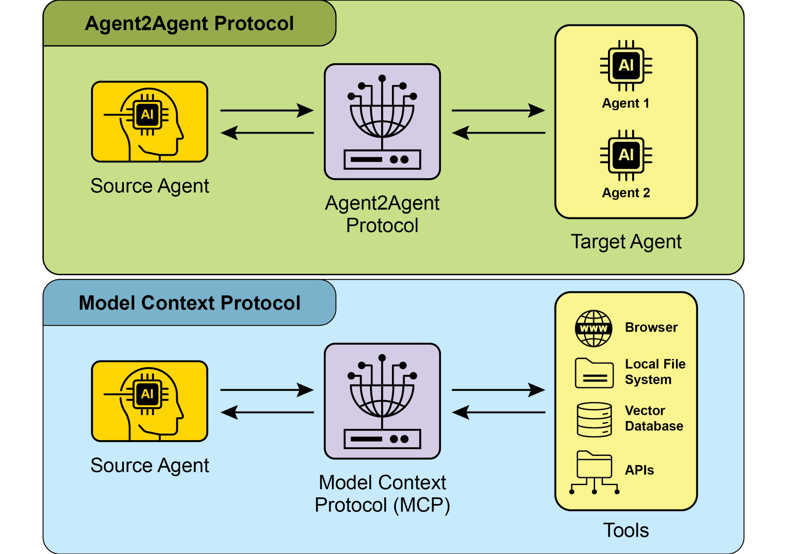
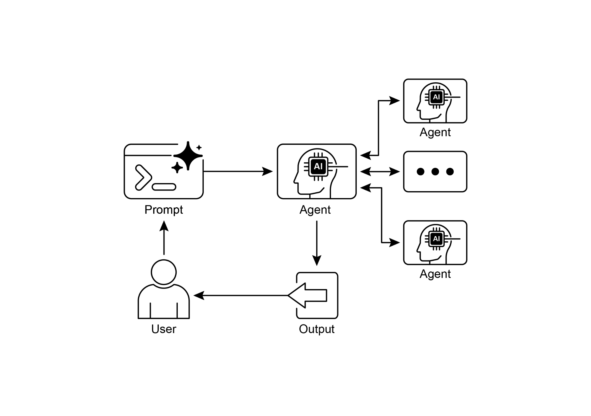

# 第 15 章:代理間通訊(Inter-Agent Communication, A2A)

即使具備先進的能力,單一的 AI 代理(AI agent)在處理複雜、多面向的問題時,往往仍會遭遇侷限。為了克服這一點,代理間通訊(Inter-Agent Communication, A2A)讓不同的 AI 代理——它們有可能是用不同框架建構的——得以有效協作。這種協作牽涉到無縫的協調、任務委派與資訊交換。

Google 的 A2A 協定是一項開放標準(open standard),旨在促成這種通用的通訊。本章將探討 A2A、它的實務應用,以及它在 Google ADK 中的實作。

## 代理間通訊模式總覽

Agent2Agent(A2A)協定是一項開放標準,旨在讓不同的 AI 代理框架之間能夠通訊與協作。它確保了互通性(interoperability),讓以 LangGraph、CrewAI 或 Google ADK 等技術開發的 AI 代理能夠協同運作,而不受其來源或框架差異的影響。

A2A 獲得眾多科技公司與服務供應商的支持,包括 Atlassian、Box、LangChain、MongoDB、Salesforce、SAP 與 ServiceNow。Microsoft 計畫將 A2A 整合進 Azure AI Foundry 與 Copilot Studio,展現其對開放協定的投入。此外,Auth0 與 SAP 也正將 A2A 支援整合進它們的平台與代理之中。

作為一項開源(open-source)協定,A2A 歡迎社群貢獻,以促進其演進與廣泛採用。

## A2A 的核心概念

A2A 協定為代理互動提供了一套結構化的做法,並建立在數個核心概念之上。對於任何要開發 A2A 相容系統、或與之整合的人而言,徹底掌握這些概念至關重要。A2A 的基礎支柱包括核心參與者(Core Actors)、代理卡(Agent Card)、代理探索(Agent Discovery)、通訊與任務(Communication and Tasks)、互動機制(Interaction mechanisms),以及安全性(Security),以下將逐一詳細說明。

**核心參與者(Core Actors):** A2A 牽涉三個主要實體:

- **使用者(User):** 發起對代理協助的請求。
- **A2A 用戶端(A2A Client,即 Client Agent):** 一個應用程式或 AI 代理,代表使用者去請求動作或資訊。
- **A2A 伺服器(A2A Server,即 Remote Agent):** 一個 AI 代理或系統,提供一個 HTTP 端點來處理用戶端請求並回傳結果。這個遠端代理(remote agent)以「不透明(opaque)」系統的方式運作,意味著用戶端不需要理解它內部的運作細節。

**代理卡(Agent Card):** 一個代理的數位身分,由它的代理卡所定義,通常是一個 JSON 檔案。這份檔案包含了供用戶端互動與自動探索所需的關鍵資訊,包括代理的身分、端點 URL 與版本。它也詳細說明了所支援的能力(例如串流或推播通知)、特定技能、預設的輸入/輸出模式,以及驗證需求。以下是一個 WeatherBot 的代理卡範例。

```json
{
  "name": "WeatherBot",
  "description": "Provides accurate weather forecasts and historical data.",
  "url": "http://weather-service.example.com/a2a",
  "version": "1.0.0",
  "capabilities": {
    "streaming": true,
    "pushNotifications": false,
    "stateTransitionHistory": true
  },
  "authentication": {
    "schemes": [
      "apiKey"
    ]
  },
  "defaultInputModes": [
    "text"
  ],
  "defaultOutputModes": [
    "text"
  ],
  "skills": [
    {
      "id": "get_current_weather",
      "name": "Get Current Weather",
      "description": "Retrieve real-time weather for any location.",
      "inputModes": [
        "text"
      ],
      "outputModes": [
        "text"
      ],
      "examples": [
        "What's the weather in Paris?",
        "Current conditions in Tokyo"
      ],
      "tags": [
        "weather",
        "current",
        "real-time"
      ]
    },
    {
      "id": "get_forecast",
      "name": "Get Forecast",
      "description": "Get 5-day weather predictions.",
      "inputModes": [
        "text"
      ],
      "outputModes": [
        "text"
      ],
      "examples": [
        "5-day forecast for New York",
        "Will it rain in London this weekend?"
      ],
      "tags": [
        "weather",
        "forecast",
        "prediction"
      ]
    }
  ]
}
```

> **提示詞與描述中譯:** 上方代理卡中的自然語言欄位翻譯如下。代理描述「Provides accurate weather forecasts and historical data.」意為「提供準確的天氣預報與歷史資料。」;技能「Get Current Weather」(取得目前天氣)描述「Retrieve real-time weather for any location.」意為「檢索任何地點的即時天氣。」,其範例提示「What's the weather in Paris?」/「Current conditions in Tokyo」意為「巴黎現在的天氣如何?」/「東京目前的天氣狀況」;技能「Get Forecast」(取得預報)描述「Get 5-day weather predictions.」意為「取得未來 5 天的天氣預測。」,其範例提示「5-day forecast for New York」/「Will it rain in London this weekend?」意為「紐約未來 5 天的預報」/「這個週末倫敦會下雨嗎?」。

**代理探索(Agent discovery):** 它讓用戶端能夠找到代理卡,而代理卡描述了可用 A2A 伺服器的能力。這個過程有數種策略:

- **眾所周知的 URI(Well-Known URI):** 代理把它的代理卡託管在一個標準化的路徑上(例如 `/.well-known/agent.json`)。這種做法提供了廣泛、且通常是自動化的存取性,適合公開或特定領域的用途。
- **策展註冊中心(Curated Registries):** 它們提供一個集中式的目錄,代理卡會發布於此,並可依特定條件查詢。這非常適合需要集中式管理與存取控制的企業環境。
- **直接設定(Direct Configuration):** 代理卡資訊被嵌入或私下分享。這種方法適用於緊密耦合或私有的系統,在這些情境中動態探索並非關鍵需求。

無論選擇哪一種方法,確保代理卡端點的安全性都很重要。這可以透過存取控制、相互 TLS(mutual TLS, mTLS)或網路限制來達成,尤其當代理卡含有敏感(雖非機密)資訊時更是如此。

**通訊與任務(Communications and Tasks):** 在 A2A 框架中,通訊是圍繞著非同步任務(asynchronous tasks)來組織的,這些任務代表了長時間執行流程的基本工作單位。每個任務都被指派一個唯一識別碼,並會經歷一系列狀態——例如 submitted、working 或 completed——這種設計支援複雜操作中的平行處理。代理之間的通訊則透過一個訊息(Message)來進行。

這種通訊包含屬性(attributes),也就是描述訊息的鍵值對中介資料(例如它的優先順序或建立時間),以及一個或多個部分(parts),負責承載實際傳遞的內容,例如純文字、檔案或結構化的 JSON 資料。代理在任務執行過程中所產生的具體輸出,稱為產物(artifacts)。如同訊息一般,產物同樣由一個或多個部分組成,並可在結果逐漸產生時以增量方式串流出來。A2A 框架內的所有通訊,都是透過 HTTP(S),並使用 JSON-RPC 2.0 協定來傳遞酬載(payload)。為了在多次互動之間維持連續性,系統會使用一個由伺服器產生的 contextId,把相關的任務分組在一起並保存情境。

**互動機制(Interaction Mechanisms):** 請求/回應(輪詢)與伺服器推送事件(Server-Sent Events, SSE)。A2A 提供了多種互動方法,以滿足各式各樣的 AI 應用需求,每一種都有其獨特的機制:

- **同步請求/回應(Synchronous Request/Response):** 適用於快速、即時的操作。在這個模型中,用戶端送出一個請求,並主動等待伺服器處理它,然後在單一、同步的交換中回傳一個完整的回應。
- **非同步輪詢(Asynchronous Polling):** 適用於需要較長時間處理的任務。用戶端送出一個請求,伺服器立即以「working」狀態與一個任務 ID 來確認。接著用戶端便可自由地去執行其他動作,並可週期性地透過送出新的請求來向伺服器輪詢(poll),以檢查任務的狀態,直到它被標記為「completed」或「failed」。
- **串流更新(Streaming Updates,即 Server-Sent Events, SSE):** 適合用於接收即時、增量的結果。這種方法會建立一條從伺服器到用戶端的持久性單向連線。它讓遠端代理能夠持續推送更新,例如狀態變化或部分結果,而用戶端不需要發出多次請求。
- **推播通知(Push Notifications,即 Webhooks):** 專為非常耗時或資源密集的任務而設計,在這類任務中,維持一條恆久連線或頻繁輪詢都是沒有效率的。用戶端可以註冊一個 webhook URL,當任務狀態出現顯著變化時(例如完成時),伺服器便會送出一個非同步通知(一次「推播」)到該 URL。

代理卡會明確指出某個代理是否支援串流或推播通知的能力。此外,A2A 是與模態無關的(modality-agnostic),意味著它不僅能為文字促成這些互動模式,也能用於其他資料類型,例如音訊與視訊,從而實現豐富的多模態(multimodal)AI 應用。串流與推播通知這兩種能力,都會在代理卡中加以指定。

```json
#Synchronous Request Example
{
  "jsonrpc": "2.0",
  "id": "1",
  "method": "sendTask",
  "params": {
    "id": "task-001",
    "sessionId": "session-001",
    "message": {
      "role": "user",
      "parts": [
        {
          "type": "text",
          "text": "What is the exchange rate from USD to EUR?"
        }
      ]
    },
    "acceptedOutputModes": ["text/plain"],
    "historyLength": 5
  }
}
```

> **提示詞中譯:** 上方請求中送給代理的使用者訊息提示詞「What is the exchange rate from USD to EUR?」意為「美元兌歐元的匯率是多少?」。

同步請求使用 `sendTask` 方法,在這種模式下,用戶端要求並期望對其查詢得到單一、完整的回答。相對地,串流請求則使用 `sendTaskSubscribe` 方法來建立一條持久性連線,讓代理能夠隨著時間回傳多筆增量的更新或部分結果。

```json
# Streaming Request Example
{
  "jsonrpc": "2.0",
  "id": "2",
  "method": "sendTaskSubscribe",
  "params": {
    "id": "task-002",
    "sessionId": "session-001",
    "message": {
      "role": "user",
      "parts": [
        {
          "type": "text",
          "text": "What's the exchange rate for JPY to GBP today?"
        }
      ]
    },
    "acceptedOutputModes": ["text/plain"],
    "historyLength": 5
  }
}
```

> **提示詞中譯:** 上方請求中送給代理的使用者訊息提示詞「What's the exchange rate for JPY to GBP today?」意為「今天日圓兌英鎊的匯率是多少?」。

**安全性(Security):** 代理間通訊(A2A)是系統架構中至關重要的一環,讓代理之間能夠安全且無縫地交換資料。它透過數種內建機制來確保穩健性與完整性。

**相互傳輸層安全性(Mutual Transport Layer Security, TLS):** 建立經加密與驗證的連線,以防止未經授權的存取與資料攔截,確保通訊的安全。

**全面的稽核日誌(Comprehensive Audit Logs):** 所有代理間的通訊都會被詳實記錄,涵蓋資訊流向、所涉及的代理,以及所執行的動作。這份稽核軌跡對於問責、疑難排解與安全分析至關重要。

**代理卡宣告(Agent Card Declaration):** 驗證需求會在代理卡中被明確宣告——代理卡是一份設定產物,概述代理的身分、能力與安全政策。這集中並簡化了驗證管理。

**憑證處理(Credential Handling):** 代理通常使用安全憑證來驗證,例如 OAuth 2.0 token 或 API 金鑰,透過 HTTP 標頭(header)傳遞。這種方法可避免憑證暴露在 URL 或訊息本體中,從而提升整體安全性。

## A2A 與 MCP

A2A 是一項與 Anthropic 的模型情境協定(Model Context Protocol, MCP)互補的協定(見圖 1)。MCP 著重於為代理建構情境、以及代理與外部資料和工具的互動,而 A2A 則促成代理之間的協調與通訊,讓任務委派與協作成為可能。



*圖 1:A2A 與 MCP 協定的比較*

A2A 的目標是提升效率、降低整合成本,並在複雜、多代理 AI 系統的開發中促進創新與互通性。因此,徹底理解 A2A 的核心元件與運作方法,對於在建構協作且可互通的 AI 代理系統時進行有效的設計、實作與應用,是不可或缺的。

## 實務應用與使用案例

代理間通訊對於在各種不同領域建構精密的 AI 解決方案而言不可或缺,它帶來了模組化、可擴展性與更強的智慧。

- **多框架協作(Multi-Framework Collaboration):** A2A 的首要使用案例,是讓獨立的 AI 代理——無論其底層框架為何(例如 ADK、LangChain、CrewAI)——都能夠通訊與協作。這對於建構複雜的多代理系統至關重要,在這類系統中,不同的代理各自專精於問題的不同面向。
- **自動化工作流程編排(Automated Workflow Orchestration):** 在企業環境中,A2A 可以透過讓代理委派與協調任務,來促成複雜的工作流程。舉例來說,某個代理可能負責初步的資料蒐集,接著委派給另一個代理進行分析,最後再交給第三個代理生成報告,這一切都透過 A2A 協定來通訊。
- **動態資訊檢索(Dynamic Information Retrieval):** 代理可以透過通訊來檢索並交換即時資訊。一個主要代理可能會向一個專門的「資料擷取代理」請求即時市場資料,後者接著使用外部 API 來蒐集資訊並回傳。

## 動手實作範例

讓我們來檢視 A2A 協定的實務應用。位於 https://github.com/google-a2a/a2a-samples/tree/main/samples 的儲存庫,提供了 Java、Go 與 Python 的範例,說明各種代理框架——例如 LangGraph、CrewAI、Azure AI Foundry 與 AG2——如何使用 A2A 來通訊。此儲存庫中的所有程式碼皆以 Apache 2.0 授權釋出。為了進一步說明 A2A 的核心概念,我們將檢視一些程式碼片段,聚焦於如何使用一個以 ADK 為基礎、並搭配 Google 驗證工具的代理來設定一個 A2A 伺服器。請參考 https://github.com/google-a2a/a2a-samples/blob/main/samples/python/agents/birthday_planner_adk/calendar_agent/adk_agent.py

```python
import datetime
from google.adk.agents import LlmAgent  # type: ignore[import-untyped]
from google.adk.tools.google_api_tool import CalendarToolset  # type: ignore[import-untyped]


async def create_agent(client_id, client_secret) -> LlmAgent:
    """Constructs the ADK agent."""
    toolset = CalendarToolset(client_id=client_id, client_secret=client_secret)
    return LlmAgent(
        model='gemini-2.0-flash-001',
        name='calendar_agent',
        # 提示詞中譯:一個能協助管理使用者行事曆的代理。
        description="An agent that can help manage a user's calendar",
        # 提示詞中譯:
        # 你是一個能協助管理使用者行事曆的代理。
        #
        # 使用者會請求關於其行事曆狀態的資訊,
        # 或是請求對其行事曆進行變更。請使用所提供的工具
        # 來與行事曆 API 互動。
        #
        # 若未特別指定,請假設使用者想要的行事曆是「primary」(主要)行事曆。
        #
        # 使用 Calendar API 工具時,請使用格式正確的 RFC3339 時間戳記。
        #
        # 今天是 {datetime.datetime.now()}。
        instruction=f"""
You are an agent that can help manage a user's calendar.

Users will request information about the state of their calendar
or to make changes to their calendar. Use the provided tools for
interacting with the calendar API.

If not specified, assume the calendar the user wants is the 'primary' calendar.

When using the Calendar API tools, use well-formed RFC3339 timestamps.

Today is {datetime.datetime.now()}.
""",
        tools=await toolset.get_tools(),
    )
```

這段 Python 程式碼定義了一個非同步函式 `create_agent`,它建構出一個 ADK 的 `LlmAgent`。它一開始會用所提供的用戶端憑證來初始化一個 `CalendarToolset`,以存取 Google Calendar API。接著,建立一個 `LlmAgent` 實例,並以指定的 Gemini 模型、一個具描述性的名稱,以及管理使用者行事曆的指令來設定它。這個代理被賦予了來自 `CalendarToolset` 的行事曆工具,使它能夠與 Calendar API 互動,並回應使用者關於行事曆狀態或修改的查詢。代理的指令會動態地納入當前日期,以提供時間上的情境。為了說明一個代理是如何被建構的,讓我們來檢視 GitHub 上 A2A 範例中 calendar_agent 的一個關鍵段落。

以下程式碼展示了該代理是如何以其特定的指令與工具來定義的。請注意,此處只顯示了用以說明這項功能所需的程式碼;你可以在這裡取得完整檔案:https://github.com/a2aproject/a2a-samples/blob/main/samples/python/agents/birthday_planner_adk/calendar_agent/__main__.py

```python
def main(host: str, port: int):
    # Verify an API key is set.
    # Not required if using Vertex AI APIs.
    if os.getenv('GOOGLE_GENAI_USE_VERTEXAI') != 'TRUE' and not os.getenv(
        'GOOGLE_API_KEY'
    ):
        raise ValueError(
            'GOOGLE_API_KEY environment variable not set and '
            'GOOGLE_GENAI_USE_VERTEXAI is not TRUE.'
        )

    skill = AgentSkill(
        id='check_availability',
        name='Check Availability',
        # 提示詞中譯:使用使用者的 Google Calendar 檢查其在某個時段是否有空。
        description="Checks a user's availability for a time using their Google Calendar",
        tags=['calendar'],
        # 提示詞中譯:我明天早上 10 點到 11 點有空嗎?
        examples=['Am I free from 10am to 11am tomorrow?'],
    )

    agent_card = AgentCard(
        name='Calendar Agent',
        # 提示詞中譯:一個能管理使用者行事曆的代理。
        description="An agent that can manage a user's calendar",
        url=f'http://{host}:{port}/',
        version='1.0.0',
        defaultInputModes=['text'],
        defaultOutputModes=['text'],
        capabilities=AgentCapabilities(streaming=True),
        skills=[skill],
    )

    adk_agent = asyncio.run(create_agent(
        client_id=os.getenv('GOOGLE_CLIENT_ID'),
        client_secret=os.getenv('GOOGLE_CLIENT_SECRET'),
    ))

    runner = Runner(
        app_name=agent_card.name,
        agent=adk_agent,
        artifact_service=InMemoryArtifactService(),
        session_service=InMemorySessionService(),
        memory_service=InMemoryMemoryService(),
    )

    agent_executor = ADKAgentExecutor(runner, agent_card)

    async def handle_auth(request: Request) -> PlainTextResponse:
        await agent_executor.on_auth_callback(
            str(request.query_params.get('state')), str(request.url)
        )
        return PlainTextResponse('Authentication successful.')

    request_handler = DefaultRequestHandler(
        agent_executor=agent_executor, task_store=InMemoryTaskStore()
    )

    a2a_app = A2AStarletteApplication(
        agent_card=agent_card, http_handler=request_handler
    )

    routes = a2a_app.routes()
    routes.append(
        Route(
            path='/authenticate',
            methods=['GET'],
            endpoint=handle_auth,
        )
    )

    app = Starlette(routes=routes)
    uvicorn.run(app, host=host, port=port)


if __name__ == '__main__':
    main()
```

這段 Python 程式碼示範了如何設定一個 A2A 相容的「Calendar Agent」,用以透過 Google Calendar 檢查使用者的空檔。它牽涉到為了驗證目的而檢驗 API 金鑰或 Vertex AI 設定。代理的能力——包括「check_availability」技能——定義在一個 `AgentCard` 之中,後者同時也指明了代理的網路位址。接著,建立一個 ADK 代理,並以記憶體內(in-memory)的服務來設定它,以管理產物、工作階段(session)與記憶體。程式碼隨後初始化一個 Starlette 網頁應用程式,納入了一個驗證回呼(callback)與 A2A 協定處理器,並使用 Uvicorn 來執行它,以透過 HTTP 對外公開該代理。

這些範例闡明了建構一個 A2A 相容代理的過程,從定義其能力,到把它當作網頁服務來執行。透過運用代理卡與 ADK,開發者可以建立可互通的 AI 代理,使其能夠與 Google Calendar 這類工具整合。這種實務做法展現了 A2A 在建立多代理生態系上的應用。

建議透過 https://www.trickle.so/blog/how-to-build-google-a2a-project 的程式碼示範,進一步探索 A2A。此連結提供的資源包括 Python 與 JavaScript 的 A2A 用戶端與伺服器範例、多代理網頁應用程式、命令列介面,以及各種代理框架的範例實作。

## 重點速覽

**是什麼(What):** 單一的 AI 代理,尤其是建構在不同框架上的那些,往往難以靠一己之力處理複雜、多面向的問題。主要的挑戰在於缺乏一種共通的語言或協定,讓它們能夠有效地通訊與協作。這種孤立狀態,阻礙了建立精密系統的可能——在這類系統中,多個專精代理本可結合各自獨特的技能來解決更大的任務。若沒有一套標準化的做法,整合這些彼此迥異的代理會耗費高昂的成本與時間,並妨礙更強大、更具凝聚力之 AI 解決方案的發展。

**為什麼(Why):** 代理間通訊(A2A)協定為這個問題提供了一套開放、標準化的解法。它是一項以 HTTP 為基礎的協定,促成了互通性,讓不同的 AI 代理能夠無縫地協調、委派任務並共享資訊,而不受其底層技術的影響。其中一個核心元件是代理卡,這是一份數位身分檔案,描述了代理的能力、技能與通訊端點,促進了探索與互動。A2A 定義了多種互動機制,包括同步與非同步通訊,以支援各式各樣的使用案例。透過為代理協作建立一套通用標準,A2A 培育出一個模組化且可擴展的生態系,用以建構複雜的多代理(Agentic)系統。

**經驗法則(Rule of thumb):** 當你需要編排兩個或更多 AI 代理之間的協作時,使用此模式——尤其是當它們是用不同框架(例如 Google ADK、LangGraph、CrewAI)建構時。它非常適合用於建構複雜、模組化的應用程式,其中由專精的代理各自處理工作流程的特定部分,例如把資料分析委派給某個代理,把報告生成委派給另一個代理。當一個代理需要動態地探索並運用其他代理的能力來完成任務時,此模式也不可或缺。

## 視覺摘要



*圖 2:A2A 代理間通訊模式*

## 重點整理

以下是一些重點:

- Google A2A 協定是一項開放、以 HTTP 為基礎的標準,促成以不同框架建構的 AI 代理之間的通訊與協作。
- AgentCard 作為代理的數位識別碼,讓其他代理能夠自動探索並理解它的能力。
- A2A 同時提供同步的請求-回應互動(使用 `tasks/send`)與串流更新(使用 `tasks/sendSubscribe`),以滿足不同的通訊需求。
- 此協定支援多輪對話,包括一個 `input-required` 狀態,讓代理能夠在互動過程中請求額外資訊並維持情境。
- A2A 鼓勵一種模組化架構,讓專精的代理能夠在不同的連接埠(port)上獨立運作,實現系統的可擴展性與分散性。
- Trickle AI 這類工具有助於將 A2A 通訊視覺化並加以追蹤,協助開發者監控、除錯並最佳化多代理系統。
- A2A 是一項用於管理不同代理之間任務與工作流程的高層級協定,而模型情境協定(MCP)則為 LLM 提供了一個與外部資源對接的標準化介面。

## 結論

代理間通訊(A2A)協定確立了一項至關重要的開放標準,用以克服單一 AI 代理與生俱來的孤立性。透過提供一套共通、以 HTTP 為基礎的框架,它確保了建構在不同平台上的代理之間能夠無縫協作與互通,例如 Google ADK、LangGraph 或 CrewAI。其中一個核心元件是代理卡,它作為數位身分,清楚地定義了代理的能力,並讓其他代理得以動態探索。此協定的彈性支援各種互動模式,包括同步請求、非同步輪詢與即時串流,滿足了廣泛的應用需求。

這使得建立模組化且可擴展的架構成為可能,讓專精的代理得以組合起來,編排出複雜的自動化工作流程。安全性是其根本面向之一,內建了 mTLS 與明確的驗證需求等機制來保護通訊。在與 MCP 等其他標準互補的同時,A2A 獨特的焦點在於代理之間高層級的協調與任務委派。來自各大科技公司的強力支持,以及實際實作的可得性,凸顯了它日益增長的重要性。此協定為開發者鋪平了道路,讓他們得以建構更精密、更分散、更智慧的多代理系統。歸根究柢,A2A 是培育一個創新且可互通之協作 AI 生態系的基礎支柱。

## 參考資料

1. Chen, B. (2025, April 22). How to Build Your First Google A2A Project: A Step-by-Step Tutorial. Trickle.so Blog. <https://www.trickle.so/blog/how-to-build-google-a2a-project>
2. Google A2A GitHub Repository. <https://github.com/google-a2a/A2A>
3. Google Agent Development Kit (ADK). <https://google.github.io/adk-docs/>
4. Getting Started with Agent-to-Agent (A2A) Protocol: <https://codelabs.developers.google.com/intro-a2a-purchasing-concierge#0>
5. Google AgentDiscovery: <https://a2a-protocol.org/latest/>
6. Communication between different AI frameworks such as LangGraph, CrewAI, and Google ADK: <https://www.trickle.so/blog/how-to-build-google-a2a-project>
7. Designing Collaborative Multi-Agent Systems with the A2A Protocol: <https://www.oreilly.com/radar/designing-collaborative-multi-agent-systems-with-the-a2a-protocol/>
