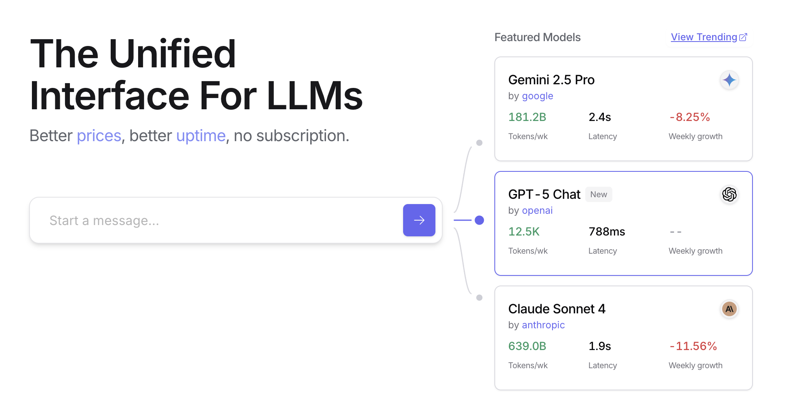
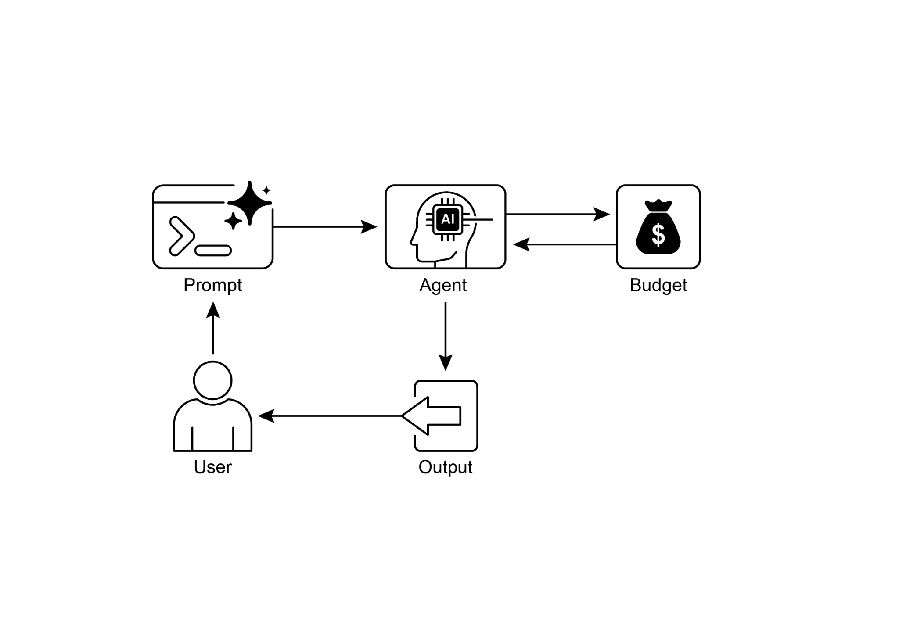

# 第 16 章:資源感知最佳化(Resource-Aware Optimization)

資源感知最佳化(Resource-Aware Optimization)讓智慧代理(intelligent agent)能在運作過程中動態地監控與管理運算、時間與財務資源。這與單純的規劃(planning)不同——後者主要聚焦於動作的排序。資源感知最佳化則要求代理針對動作的執行做出決策,以在指定的資源預算內達成目標,或是最佳化效率。這牽涉到在「較準確但較昂貴的模型」與「較快速、較低成本的模型」之間做選擇,或是決定要投入額外運算以取得更精煉的回應,還是回傳一個較快速、較不詳盡的答案。

舉例來說,設想有一個代理被指派去為某位財務分析師分析一個大型資料集。如果分析師立刻就需要一份初步報告,代理可能會使用一個較快速、較平價的模型來快速摘要關鍵趨勢。然而,如果分析師為了一項關鍵的投資決策而需要高度準確的預測,而且擁有較充裕的預算與時間,代理就會配置更多資源,改用一個強大、較慢但更精準的預測模型。此類別中的一項關鍵策略是備援機制(fallback mechanism),當偏好的模型因為過載(overloaded)或被限流(throttled)而無法使用時,它便扮演一道安全防線。為了確保優雅降級(graceful degradation),系統會自動切換到一個預設或較平價的模型,以維持服務的連續性,而不是徹底失敗。

## 實務應用與使用案例

實務上的使用案例包括:

- **成本最佳化的 LLM 使用:** 代理會根據預算限制,決定要為複雜任務使用龐大、昂貴的 LLM,還是為較簡單的查詢使用較小、較平價的模型。
- **對延遲敏感的操作:** 在即時系統中,代理會選擇一條較快速但可能較不完整的推理路徑,以確保及時回應。
- **能源效率:** 對於部署在邊緣裝置(edge device)或電力受限環境的代理,最佳化其處理流程以節省電池壽命。
- **服務可靠性的備援:** 當主要選擇無法使用時,代理會自動切換到備用模型,以確保服務連續性與優雅降級。
- **資料用量管理:** 代理選擇取得摘要過的資料,而非下載完整資料集,以節省頻寬或儲存空間。
- **自適應的任務分配:** 在多代理(multi-agent)系統中,代理會根據自身目前的運算負載或可用時間,自行指派任務。

## 動手實作範例

一個用來回答使用者問題的智慧系統,可以評估每個問題的難度。對於簡單的查詢,它會使用一個具成本效益的語言模型,例如 Gemini Flash。對於複雜的詢問,則會考慮使用更強大但更昂貴的語言模型(例如 Gemini Pro)。是否使用更強大模型的決定,也取決於資源的可用性,特別是預算與時間限制。這個系統會動態地選擇適當的模型。

舉例來說,設想一個用階層式代理(hierarchical agent)建構的旅遊規劃器。高層級的規劃——這牽涉到理解使用者的複雜請求、把它拆解成一個多步驟的行程,並做出合乎邏輯的決策——會交由一個精密且更強大的 LLM(例如 Gemini Pro)來管理。這就是「規劃器(planner)」代理,它需要對情境有深刻的理解,並具備推理的能力。

然而,一旦計畫確立,該計畫內的個別任務(例如查詢機票價格、確認飯店空房,或尋找餐廳評論)本質上就是簡單、重複的網路查詢。這些「工具函式呼叫(tool function calls)」可以由一個較快速、較平價的模型(例如 Gemini Flash)來執行。比較容易想像的是,平價模型可用於這些直截了當的網路搜尋,而錯綜複雜的規劃階段則需要更先進模型的更高智慧,以確保旅遊計畫的連貫與合理。

Google 的 ADK 透過其多代理架構支援這種做法,讓應用程式得以模組化且具可擴展性。不同的代理可以處理各自的專門任務。模型彈性(model flexibility)讓我們能直接使用各種 Gemini 模型(包括 Gemini Pro 與 Gemini Flash),或透過 LiteLLM 整合其他模型。ADK 的協調(orchestration)能力支援動態、由 LLM 驅動的路由(routing),以實現自適應行為。內建的評估功能讓我們能系統化地評量代理的表現,並可用於系統的精煉(詳見〈評估與監控〉一章)。

接下來,將定義兩個設定相同、但使用不同模型與成本的代理。

```python
# Conceptual Python-like structure, not runnable code
from google.adk.agents import Agent
# from google.adk.models.lite_llm import LiteLlm # If using models not directly supported by ADK's default Agent

# Agent using the more expensive Gemini Pro 2.5
gemini_pro_agent = Agent(
    name="GeminiProAgent",
    model="gemini-2.5-pro",  # Placeholder for actual model name if different
    # 提示詞中譯:一個能力高強、可處理複雜查詢的代理。
    description="A highly capable agent for complex queries.",
    # 提示詞中譯:你是一位擅長解決複雜問題的專家助理。
    instruction="You are an expert assistant for complex problem-solving."
)

# Agent using the less expensive Gemini Flash 2.5
gemini_flash_agent = Agent(
    name="GeminiFlashAgent",
    model="gemini-2.5-flash",  # Placeholder for actual model name if different
    # 提示詞中譯:一個快速且高效率、可處理簡單查詢的代理。
    description="A fast and efficient agent for simple queries.",
    # 提示詞中譯:你是一位處理直截了當問題的快速助理。
    instruction="You are a quick assistant for straightforward questions."
)
```

路由器代理(Router Agent)可以根據簡單的指標(例如查詢長度)來引導查詢,其中較短的查詢交給較不昂貴的模型,較長的查詢則交給能力較強的模型。然而,一個更精密的路由器代理可以運用 LLM 或機器學習(ML)模型來分析查詢的細微差異與複雜度。這種 LLM 路由器能判斷哪一個下游語言模型最為適合。舉例來說,一個要求事實性回憶(factual recall)的查詢會被路由到 flash 模型,而一個需要深度分析的複雜查詢則會被路由到 pro 模型。

最佳化技巧可以進一步提升 LLM 路由器的成效。提示調校(prompt tuning)涉及精心設計提示,以引導路由器 LLM 做出更佳的路由決策。在「查詢與其最佳模型選擇」的資料集上對 LLM 路由器進行微調(fine-tuning),則可提升其準確度與效率。這種動態路由能力,在回應品質與成本效益之間取得了平衡。

```python
# Conceptual Python-like structure, not runnable code
from google.adk.agents import Agent, BaseAgent
from google.adk.events import Event
from google.adk.agents.invocation_context import InvocationContext
import asyncio

class QueryRouterAgent(BaseAgent):
    name: str = "QueryRouter"
    # 提示詞中譯:依據複雜度,將使用者查詢路由到適當的 LLM 代理。
    description: str = "Routes user queries to the appropriate LLM agent based on complexity."

    async def _run_async_impl(self, context: InvocationContext) -> AsyncGenerator[Event, None]:
        user_query = context.current_message.text  # Assuming text input
        query_length = len(user_query.split())  # Simple metric: number of words

        if query_length < 20:  # Example threshold for simplicity vs. complexity
            print(f"Routing to Gemini Flash Agent for short query (length: {query_length})")
            # In a real ADK setup, you would 'transfer_to_agent' or directly invoke
            # For demonstration, we'll simulate a call and yield its response
            response = await gemini_flash_agent.run_async(context.current_message)
            yield Event(author=self.name, content=f"Flash Agent processed: {response}")
        else:
            print(f"Routing to Gemini Pro Agent for long query (length: {query_length})")
            response = await gemini_pro_agent.run_async(context.current_message)
            yield Event(author=self.name, content=f"Pro Agent processed: {response}")
```

評論者代理(Critique Agent)會評估來自語言模型的回應,並提供具備多重功能的回饋。在自我修正(self-correction)方面,它會找出錯誤或不一致之處,促使回答的代理精煉其輸出以提升品質。它也會為了效能監控(performance monitoring)而系統化地評估回應,追蹤準確度與相關性等指標,並用於最佳化。此外,它的回饋還能為強化學習(reinforcement learning)或微調提供訊號;舉例來說,若持續辨識出 Flash 模型回應不佳的情況,便可精煉路由器代理的邏輯。雖然評論者代理並不直接管理預算,但它透過辨識次佳的路由選擇(例如把簡單查詢導向 Pro 模型,或把複雜查詢導向 Flash 模型,從而導致不良結果),為間接的預算管理做出貢獻。這些資訊能引導出改善資源配置與節省成本的調整。

評論者代理可以被設定為只審閱回答代理所生成的文字,或是同時審閱原始查詢與生成的文字,以便全面地評估回應與最初問題的契合程度。

```python
# 提示詞中譯:
# 你是「評論者代理(Critic Agent)」,擔任我們這套協作式研究助理系統中的品質保證
# 一環。你的主要職責是「細緻地審查並挑戰」來自研究員代理(Researcher Agent)的
# 資訊,確保其「準確、完整且不偏頗的呈現」。
#
# 你的任務包括:
# * 評估研究發現的事實正確性、完整性與潛在的偏向。
# * 找出任何缺漏的資料或推理中的不一致之處。
# * 提出能精煉或拓展當前理解的關鍵問題。
# * 為強化內容或探索不同角度,提供建設性的建議。
# * 確認最終產出是全面且平衡的。
#
# 所有的批評都必須具建設性。你的目標是強化這份研究,而非否定它。請清楚地架構你的
# 回饋,凸顯出需要修訂的具體要點。你最終的目標,是確保最終的研究成果達到盡可能最高
# 的品質標準。
CRITIC_SYSTEM_PROMPT = """
You are the **Critic Agent**, serving as the quality assurance arm of
our collaborative research assistant system. Your primary function is
to **meticulously review and challenge** information from the
Researcher Agent, guaranteeing **accuracy, completeness, and unbiased
presentation**.

Your duties encompass:
* **Assessing research findings** for factual correctness,
thoroughness, and potential leanings.
* **Identifying any missing data** or inconsistencies in reasoning.
* **Raising critical questions** that could refine or expand the
current understanding.
* **Offering constructive suggestions** for enhancement or exploring
different angles.
* **Validating that the final output is comprehensive** and balanced.

All criticism must be constructive. Your goal is to fortify the
research, not invalidate it. Structure your feedback clearly, drawing
attention to specific points for revision. Your overarching aim is to
ensure the final research product meets the highest possible quality
standards.
"""
```

評論者代理會依據一個預先定義的系統提示(system prompt)來運作,該提示勾勒出它的角色、職責與回饋方式。一個為此代理精心設計的提示,必須清楚地確立它身為評估者的功能。它應該指明需要批判性聚焦的領域,並強調提供建設性的回饋而非單純的否定。提示也應該鼓勵同時辨識優點與缺點,並必須引導代理如何架構與呈現它的回饋。

## 動手實作:OpenAI 程式碼範例

這個系統採用資源感知最佳化策略來有效率地處理使用者查詢。它首先把每個查詢分類為三種類別之一,以判斷最適當、最具成本效益的處理路徑。這種做法避免了在簡單請求上浪費運算資源,同時確保複雜查詢能獲得必要的關注。這三種類別為:

- **simple:** 適用於可直接回答、無需複雜推理或外部資料的直截了當問題。
- **reasoning:** 適用於需要邏輯推演或多步驟思考過程的查詢,這類查詢會被路由到更強大的模型。
- **internet_search:** 適用於需要當前資訊的問題,它會自動觸發一次 Google 搜尋,以提供最新的答案。

這段程式碼採用 MIT 授權,並可在 GitHub 取得:
(https://github.com/mahtabsyed/21-Agentic-Patterns/blob/main/16_Resource_Aware_Opt_LLM_Reflection_v2.ipynb)

```python
# MIT License
# Copyright (c) 2025 Mahtab Syed
# https://www.linkedin.com/in/mahtabsyed/

import os
import requests
import json
from dotenv import load_dotenv
from openai import OpenAI

# 載入環境變數
load_dotenv()

OPENAI_API_KEY = os.getenv("OPENAI_API_KEY")
GOOGLE_CUSTOM_SEARCH_API_KEY = os.getenv("GOOGLE_CUSTOM_SEARCH_API_KEY")
GOOGLE_CSE_ID = os.getenv("GOOGLE_CSE_ID")

if not OPENAI_API_KEY or not GOOGLE_CUSTOM_SEARCH_API_KEY or not GOOGLE_CSE_ID:
    raise ValueError(
        "Please set OPENAI_API_KEY, GOOGLE_CUSTOM_SEARCH_API_KEY, and "
        "GOOGLE_CSE_ID in your .env file."
    )

client = OpenAI(api_key=OPENAI_API_KEY)


# --- Step 1: Classify the Prompt ---
def classify_prompt(prompt: str) -> dict:
    # 提示詞中譯:
    # 你是一個分類器,負責分析使用者的提示,並「只」回傳三種類別之一:
    # - simple
    # - reasoning
    # - internet_search
    # 規則:
    # - 對於不需推理或當前事件的直接事實性問題,使用 'simple'。
    # - 對於邏輯、數學或多步驟推論的問題,使用 'reasoning'。
    # - 若提示牽涉當前事件、近期資料,或不在你訓練資料中的內容,使用 'internet_search'。
    # 只能以如下的 JSON 回覆:
    # { "classification": "simple" }
    system_message = {
        "role": "system",
        "content": (
            "You are a classifier that analyzes user prompts and returns one of three categories ONLY:\n\n"
            "- simple\n"
            "- reasoning\n"
            "- internet_search\n\n"
            "Rules:\n"
            "- Use 'simple' for direct factual questions that need no reasoning or current events.\n"
            "- Use 'reasoning' for logic, math, or multi-step inference questions.\n"
            "- Use 'internet_search' if the prompt refers to current events, recent data, or things not in your training data.\n\n"
            "Respond ONLY with JSON like:\n"
            '{ "classification": "simple" }'
        ),
    }
    user_message = {"role": "user", "content": prompt}

    response = client.chat.completions.create(
        model="gpt-4o", messages=[system_message, user_message], temperature=1
    )
    reply = response.choices[0].message.content
    return json.loads(reply)


# --- Step 2: Google Search ---
def google_search(query: str, num_results=1) -> list:
    url = "https://www.googleapis.com/customsearch/v1"
    params = {
        "key": GOOGLE_CUSTOM_SEARCH_API_KEY,
        "cx": GOOGLE_CSE_ID,
        "q": query,
        "num": num_results,
    }

    try:
        response = requests.get(url, params=params)
        response.raise_for_status()
        results = response.json()

        if "items" in results and results["items"]:
            return [
                {
                    "title": item.get("title"),
                    "snippet": item.get("snippet"),
                    "link": item.get("link"),
                }
                for item in results["items"]
            ]
        else:
            return []
    except requests.exceptions.RequestException as e:
        return {"error": str(e)}


# --- Step 3: Generate Response ---
def generate_response(prompt: str, classification: str, search_results=None) -> str:
    if classification == "simple":
        model = "gpt-4o-mini"
        full_prompt = prompt
    elif classification == "reasoning":
        model = "o4-mini"
        full_prompt = prompt
    elif classification == "internet_search":
        model = "gpt-4o"
        # Convert each search result dict to a readable string
        if search_results:
            search_context = "\n".join(
                [
                    f"Title: {item.get('title')}\nSnippet: {item.get('snippet')}\nLink: {item.get('link')}"
                    for item in search_results
                ]
            )
        else:
            search_context = "No search results found."
        # 提示詞中譯:
        # 請利用以下的網路搜尋結果來回答使用者的查詢:
        #
        # {search_context}
        #
        # 查詢:{prompt}
        full_prompt = f"""Use the following web results to answer the user query:

{search_context}

Query: {prompt}"""

    response = client.chat.completions.create(
        model=model,
        messages=[{"role": "user", "content": full_prompt}],
        temperature=1,
    )
    return response.choices[0].message.content, model


# --- Step 4: Combined Router ---
def handle_prompt(prompt: str) -> dict:
    classification_result = classify_prompt(prompt)
    # Remove or comment out the next line to avoid duplicate printing
    # print("\n🔍 Classification Result:", classification_result)
    classification = classification_result["classification"]

    search_results = None
    if classification == "internet_search":
        search_results = google_search(prompt)
        # print("\n🔍 Search Results:", search_results)

    answer, model = generate_response(prompt, classification, search_results)
    return {"classification": classification, "response": answer, "model": model}


# 提示詞中譯:澳洲的首都是哪裡?
test_prompt = "What is the capital of Australia?"
# 提示詞中譯:請說明量子運算對密碼學的影響。
# test_prompt = "Explain the impact of quantum computing on cryptography."
# 提示詞中譯:2026 年澳洲網球公開賽何時開始?請給我完整日期。
# test_prompt = "When does the Australian Open 2026 start, give me full date?"

result = handle_prompt(test_prompt)
print("🧠 Classification:", result["classification"])
print("🧠 Model Used:", result["model"])
print("🔍 Response:\n", result["response"])
```

這段 Python 程式碼實作了一個提示路由系統來回答使用者問題。它首先從 `.env` 檔案載入 OpenAI 與 Google Custom Search 所需的 API 金鑰。核心功能在於把使用者的提示分類為三種類別:simple、reasoning 或 internet search。一個專責的函式會運用 OpenAI 模型來完成這個分類步驟。如果提示需要當前資訊,系統就會使用 Google Custom Search API 進行一次 Google 搜尋。接著另一個函式會生成最終回應,並根據分類結果選擇適當的 OpenAI 模型。對於網路搜尋類的查詢,搜尋結果會作為情境提供給模型。主要的 `handle_prompt` 函式負責協調這整套工作流程,在生成回應之前先呼叫分類與搜尋(若需要)函式。它會回傳分類結果、所使用的模型,以及生成的答案。這個系統能有效率地把不同類型的查詢導向最佳化的方法,以取得更好的回應。

## 動手實作範例(OpenRouter)

OpenRouter 透過單一 API 端點(endpoint),為數百種 AI 模型提供統一的介面。它提供自動化的故障轉移(failover)與成本最佳化功能,並可透過你偏好的 SDK 或框架輕鬆整合。

```python
import requests
import json

response = requests.post(
    url="https://openrouter.ai/api/v1/chat/completions",
    headers={
        "Authorization": "Bearer <OPENROUTER_API_KEY>",
        "HTTP-Referer": "<YOUR_SITE_URL>",  # Optional. Site URL for rankings on openrouter.ai.
        "X-Title": "<YOUR_SITE_NAME>",  # Optional. Site title for rankings on openrouter.ai.
    },
    data=json.dumps({
        "model": "openai/gpt-4o",  # Optional
        "messages": [
            {
                "role": "user",
                # 提示詞中譯:生命的意義是什麼?
                "content": "What is the meaning of life?"
            }
        ]
    })
)
```

這段程式碼片段使用 `requests` 函式庫來與 OpenRouter API 互動。它向聊天補全(chat completion)端點發送一個帶有使用者訊息的 POST 請求。該請求包含帶有 API 金鑰的授權標頭,以及可選的網站資訊。其目標是從指定的語言模型(在此例中為 `"openai/gpt-4o"`)取得回應。

OpenRouter 提供兩種不同的方法論,用於路由並決定處理特定請求所使用的運算模型。

- **自動化模型選擇(Automated Model Selection):** 此功能會把請求路由到一個從精選的可用模型集合中挑出的最佳化模型。其選擇取決於使用者提示的具體內容。最終處理該請求的模型識別碼,會回傳在回應的中介資料(metadata)中。

```json
{
  "model": "openrouter/auto",
  ... // Other params
}
```

- **循序模型備援(Sequential Model Fallback):** 此機制透過讓使用者指定一份階層式的模型清單,提供操作上的冗餘(redundancy)。系統會先嘗試用序列中指定的主要模型來處理請求。若該主要模型因任何錯誤狀況(例如服務無法使用、限流,或內容過濾)而未能回應,系統便會自動把請求重新路由到序列中的下一個指定模型。這個過程會持續進行,直到清單中有某個模型成功執行該請求,或清單被用盡為止。該操作的最終成本,以及回應中回傳的模型識別碼,都會對應到那個成功完成運算的模型。

```json
{
  "models": ["anthropic/claude-3.5-sonnet", "gryphe/mythomax-l2-13b"],
  ... // Other params
}
```

OpenRouter 提供一份詳盡的排行榜(https://openrouter.ai/rankings),它依據各 AI 模型的累計 token 產量來排名。它也提供來自不同供應商(ChatGPT、Gemini、Claude)的最新模型(見圖 1)。



*圖 1:OpenRouter 網站(https://openrouter.ai/)*

## 超越動態模型切換:代理資源最佳化的光譜

資源感知最佳化對於開發能在真實世界限制下高效且有效運作的智慧代理系統至關重要。讓我們來看看若干額外的技巧:

**動態模型切換(Dynamic Model Switching)** 是一項關鍵技巧,它涉及根據手邊任務的錯綜複雜程度與可用的運算資源,策略性地選擇大型語言模型。面對簡單查詢時,可以部署一個輕量、具成本效益的 LLM;而複雜、多面向的問題則需要動用更精密、更耗資源的模型。

**自適應工具使用與選擇(Adaptive Tool Use & Selection)** 確保代理能從一套工具中明智地挑選,為每個特定的子任務選出最適當、最有效率的工具,並仔細考量 API 使用成本、延遲與執行時間等因素。這種動態的工具選擇,透過最佳化外部 API 與服務的使用,提升了整體系統效率。

**情境修剪與摘要(Contextual Pruning & Summarization)** 在管理代理所處理的資訊量方面扮演著關鍵角色,它透過智慧地摘要互動歷史並選擇性地只保留其中最相關的資訊,策略性地把提示的 token 數量降到最低、降低推論成本,避免不必要的運算開銷。

**主動式資源預測(Proactive Resource Prediction)** 涉及透過預測未來的工作負載與系統需求來預判資源需求,這讓我們能主動地配置與管理資源,確保系統的回應能力並避免瓶頸。

**成本敏感的探索(Cost-Sensitive Exploration)** 在多代理系統中,把最佳化的考量延伸到「通訊成本」與傳統「運算成本」並重,進而影響代理協作與分享資訊所採用的策略,目標是把整體的資源支出降到最低。

**節能部署(Energy-Efficient Deployment)** 專為資源限制嚴苛的環境量身打造,目標是把智慧代理系統的能源足跡降到最低,以延長運作時間並降低整體運行成本。

**平行化與分散式運算意識(Parallelization & Distributed Computing Awareness)** 善用分散式資源來提升代理的處理能力與吞吐量,把運算工作負載分散到多台機器或多個處理器上,以達成更高的效率與更快的任務完成速度。

**習得的資源配置策略(Learned Resource Allocation Policies)** 引入一種學習機制,讓代理能根據回饋與效能指標,隨時間調適並最佳化其資源配置策略,透過持續精煉來提升效率。

**優雅降級與備援機制(Graceful Degradation and Fallback Mechanisms)** 確保即使在資源限制嚴峻時,智慧代理系統仍能繼續運作(也許是在能力縮減的狀態下),優雅地降低效能並退回到替代策略,以維持運作並提供必要功能。

## 重點速覽

**是什麼(What):** 資源感知最佳化要應對的是「在智慧系統中管理運算、時間與財務資源消耗」這項挑戰。以 LLM 為基礎的應用程式可能既昂貴又緩慢,而為每一項任務都挑選最佳的模型或工具,往往效率不彰。這在「系統輸出的品質」與「產生該輸出所需的資源」之間,形成了一個根本性的取捨。若缺乏動態的管理策略,系統就無法因應變動的任務複雜度,也無法在預算與效能限制內運作。

**為什麼(Why):** 標準化的解法是建構一個能根據手邊任務智慧地監控與配置資源的代理系統。此模式通常會運用一個「路由器代理(Router Agent)」來先對進入的請求進行複雜度分類。接著,該請求會被轉送到最適合的 LLM 或工具——簡單查詢交給快速、便宜的模型,複雜推理則交給更強大的模型。一個「評論者代理(Critique Agent)」可以透過評估回應的品質、提供回饋以隨時間改善路由邏輯,進一步精煉整個流程。這種動態、多代理的做法,確保系統高效運作,並在回應品質與成本效益之間取得平衡。

**經驗法則(Rule of thumb):** 在以下情況使用此模式:面對 API 呼叫或運算能力的嚴格財務預算時;建構快速回應至關重要、對延遲敏感的應用程式時;把代理部署在電池壽命有限的邊緣裝置等資源受限硬體上時;以程式化方式在回應品質與營運成本之間取得平衡時;以及管理「不同任務有不同資源需求」的複雜、多步驟工作流程時。

## 視覺摘要



*圖 2:資源感知最佳化設計模式*

## 重點整理

- **資源感知最佳化不可或缺:** 智慧代理能動態地管理運算、時間與財務資源。關於模型使用與執行路徑的決策,是依據即時的限制與目標來做出的。
- **多代理架構帶來可擴展性:** Google 的 ADK 提供一套多代理框架,實現模組化的設計。不同的代理(回答、路由、評論)各自處理特定任務。
- **動態、由 LLM 驅動的路由:** 路由器代理會根據查詢複雜度與預算,把查詢導向不同的語言模型(簡單查詢用 Gemini Flash,複雜查詢用 Gemini Pro)。這能最佳化成本與效能。
- **評論者代理的功能:** 一個專責的評論者代理會為自我修正、效能監控與精煉路由邏輯提供回饋,提升系統的成效。
- **透過回饋與彈性進行最佳化:** 用於評論的評估能力與模型整合的彈性,促成了自適應、自我改善的系統行為。
- **額外的資源感知最佳化:** 其他方法包括自適應工具使用與選擇、情境修剪與摘要、主動式資源預測、多代理系統中的成本敏感探索、節能部署、平行化與分散式運算意識、習得的資源配置策略、優雅降級與備援機制,以及關鍵任務的優先排序。

## 結論

資源感知最佳化對於智慧代理的開發至關重要,它讓代理能在真實世界的限制下高效運作。透過管理運算、時間與財務資源,代理便能達成最佳的效能與成本效益。動態模型切換、自適應工具使用與情境修剪等技巧,對於達成這些效率而言不可或缺。包括習得的資源配置策略與優雅降級在內的進階策略,則提升了代理在各種條件下的調適能力與韌性。把這些最佳化原則整合進代理設計之中,是建構可擴展、穩健且永續的 AI 系統的根本所在。

## 參考資料

1. Google's Agent Development Kit(ADK):<https://google.github.io/adk-docs/>
2. Gemini Flash 2.5 & Gemini 2.5 Pro:<https://aistudio.google.com/>
3. OpenRouter:<https://openrouter.ai/docs/quickstart>
