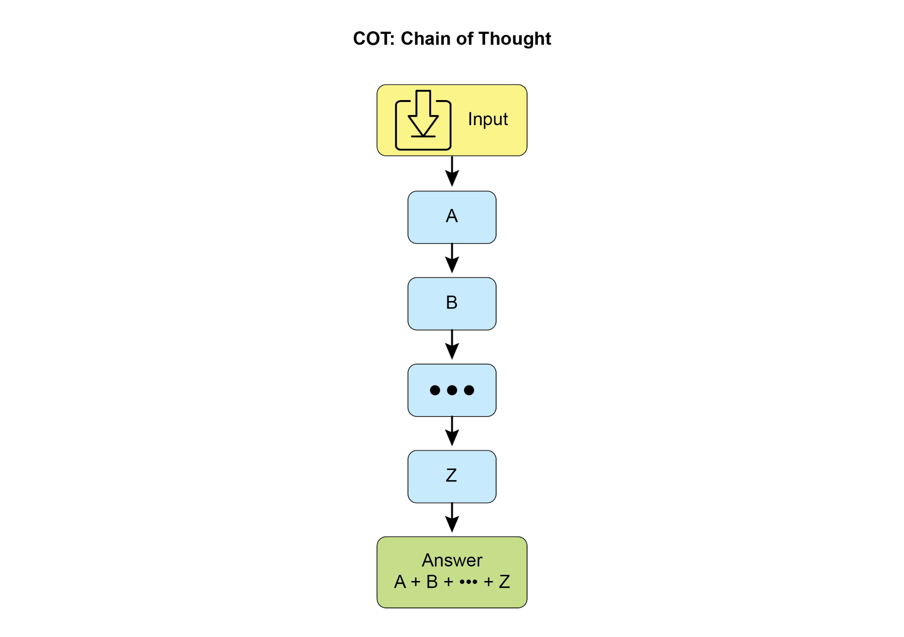
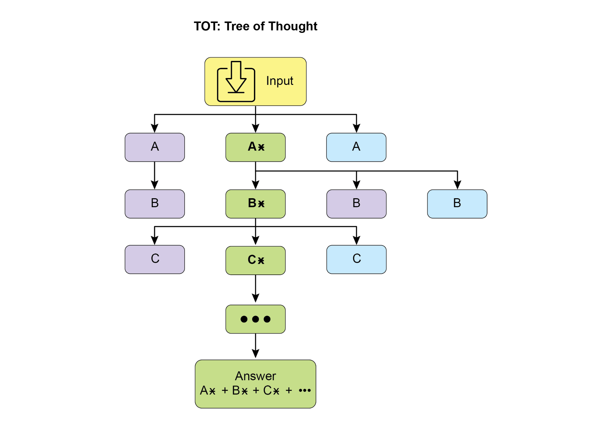
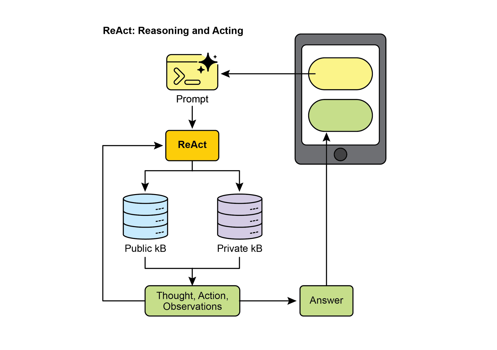
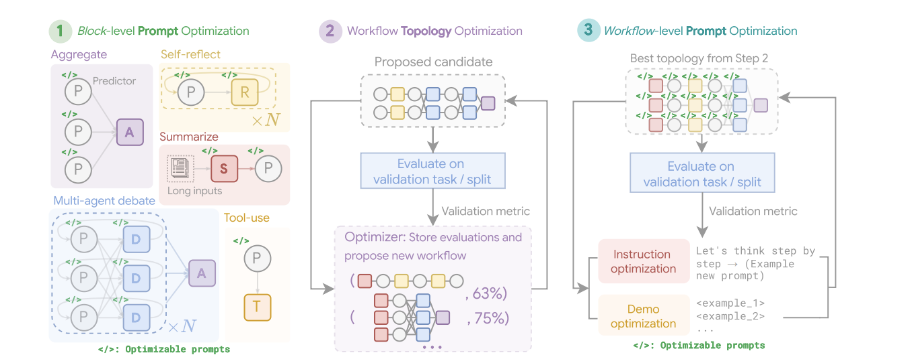
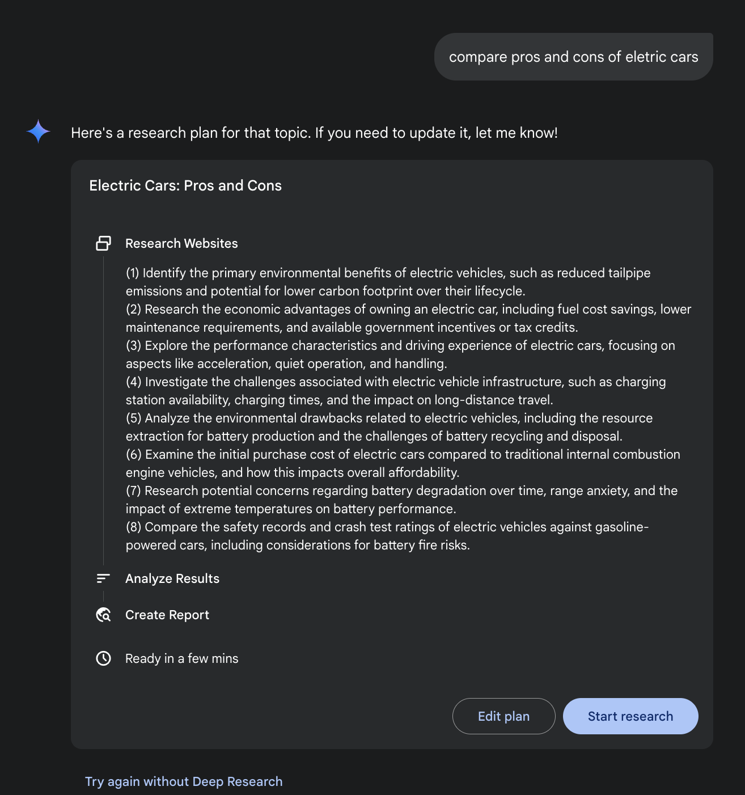
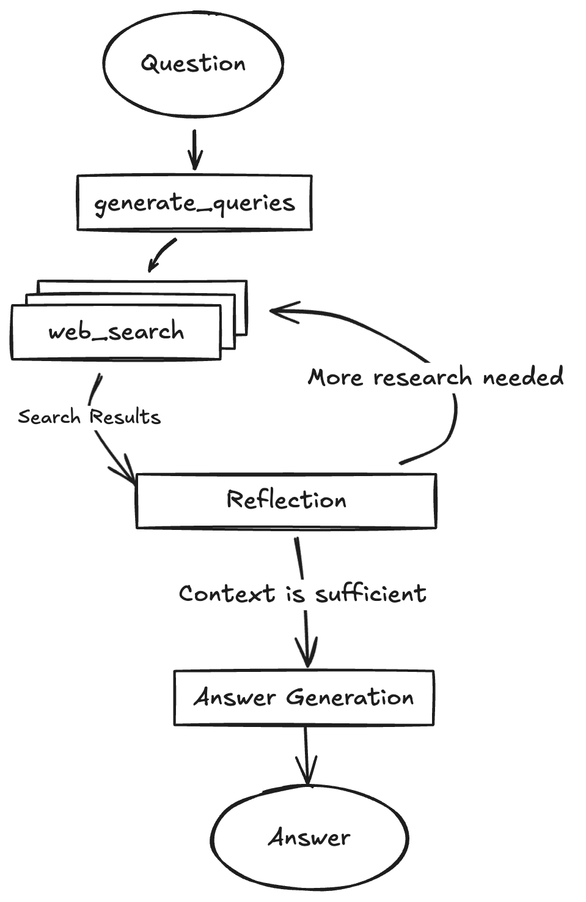
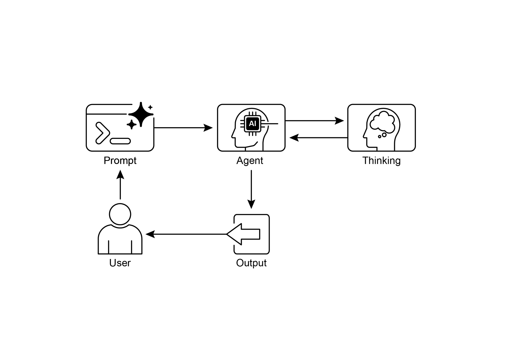

# 第 17 章:推理技巧(Reasoning Techniques)

本章深入探討智慧代理(intelligent agent)的進階推理方法論,聚焦於多步邏輯推論與問題解決。這些技巧超越了單純的循序操作,讓代理的內部推理變得明確可見。如此一來,代理便能拆解問題、考量中間步驟,並得出更穩健、更準確的結論。在這些進階方法之中,有一條核心原則:在推論(inference)階段配置更多運算資源。這意味著賦予代理或其底層的大型語言模型(LLM)更多處理時間或步驟,以處理查詢並生成回應。代理不再只是快速、單次地走過一遍,而是能投入迭代式的精煉、探索多條解題路徑,或運用外部工具。這種在推論階段延長的處理時間,往往能顯著提升準確度、連貫性與穩健性,對於需要更深入分析與審慎思考的複雜問題尤其如此。

## 實務應用與使用案例

實務應用包括:

- **複雜問題回答(Complex Question Answering):** 協助解決多跳(multi-hop)查詢——這類查詢需要整合來自不同來源的資料並執行邏輯推導,可能涉及檢視多條推理路徑,並能受益於延長的推論時間以綜整資訊。
- **數學問題求解(Mathematical Problem Solving):** 讓數學問題得以被拆分成較小、可解的組成部分,展示逐步的過程,並運用程式碼執行來進行精確運算;在此情境中,延長的推論能促成更精巧的程式碼生成與驗證。
- **程式碼除錯與生成(Code Debugging and Generation):** 支援代理說明其生成或修正程式碼的理由,循序地指出潛在問題,並根據測試結果迭代地精煉程式碼(自我修正,Self-Correction),藉由延長的推論時間進行徹底的除錯循環。
- **策略規劃(Strategic Planning):** 透過對各種選項、後果與前置條件進行推理,協助制定完整的計畫,並根據即時回饋調整計畫(ReAct);在此情境中,延長的審慎思考能帶來更有效、更可靠的計畫。
- **醫療診斷(Medical Diagnosis):** 協助代理有系統地評估症狀、檢驗結果與病患病史以做出診斷,在每個階段闡明其推理,並可能運用外部工具進行資料檢索(ReAct)。增加的推論時間能帶來更全面的鑑別診斷。
- **法律分析(Legal Analysis):** 支援分析法律文件與判例以形成論點或提供指引,詳述所採取的邏輯步驟,並透過自我修正確保邏輯一致性。增加的推論時間能帶來更深入的法律研究與論點建構。

## 推理技巧

首先,讓我們深入探討那些用來增強 AI 模型問題解決能力的核心推理技巧。

**思維鏈(Chain-of-Thought,CoT)提示**藉由模擬逐步的思考過程,大幅增強了 LLM 的複雜推理能力(見圖 1)。CoT 提示不直接給出答案,而是引導模型生成一連串中間推理步驟。這種明確的拆解,讓 LLM 得以把複雜問題分解成較小、較易掌控的子問題來處理。這項技巧顯著提升了模型在需要多步推理之任務上的表現,例如算術、常識推理與符號操作。CoT 的一大優勢,在於它能把一個困難的單步問題轉化成一系列較簡單的步驟,從而提高 LLM 推理過程的透明度。這種做法不僅提升準確度,還能對模型的決策提供寶貴的洞見,有助於除錯與理解。CoT 可以透過多種策略來實作,包括提供示範逐步推理的少樣本(few-shot)範例,或單純指示模型「一步一步思考」(think step by step)。它的有效性源自它能引導模型的內部處理,朝向更審慎、更合乎邏輯的推進方向。因此,思維鏈已成為在當代 LLM 中啟用進階推理能力的基石技術。這種增強的透明度,以及把複雜問題拆解成可掌控子問題的能力,對自主代理(autonomous agent)尤其重要,因為它讓代理得以在複雜環境中執行更可靠、更可稽核的行動。



*圖 1:CoT 提示,以及代理所生成之詳盡、逐步的回應。*

讓我們來看一個範例。它以一組指令開頭,告訴 AI 該如何思考,定義它的人物設定(persona)以及一套清晰的五步驟流程。這就是啟動結構化思考的提示。

接著,範例展示了 CoT 流程的實際運作。標示為「代理的思考過程(Agent's Thought Process)」的部分,是模型執行所被指示步驟時的內部獨白。這正是字面意義上的「思維鏈」。最後,「代理的最終答案(Agent's Final Answer)」則是經過那套審慎、逐步推理過程後所生成的、經過打磨且完整的輸出。

```text
You are an Information Retrieval Agent. Your goal is to answer the
user's question comprehensively and accurately by thinking
step-by-step.
Here's the process you must follow:

1. **Analyze the Query:** Understand the core subject and specific
requirements of the user's question. Identify key entities, keywords,
and the type of information being sought.
2. **Formulate Search Queries (for Knowledge Base):** Based on your
analysis, generate a list of precise search queries that you would
use to retrieve relevant information from a knowledge base or
external tools.
3. **Simulate Information Retrieval (Self-Correction/Reasoning):**
For each search query, mentally consider what kind of information you
expect to find. If you were to retrieve the content, what would be
the most relevant snippets? Think about potential ambiguities or
missing pieces.
4. **Synthesize Information:** Based on the simulated retrieval and
your understanding of the user's original query, synthesize the
gathered information into a coherent and complete answer. Ensure all
aspects of the query are addressed.
5. **Review and Refine:** Before finalizing, critically evaluate
your answer. Is it accurate? Is it comprehensive? Is it easy to
understand? Is it concise? If not, identify what needs to be improved
and how.

**User Query:** "Explain the main differences between classical
computers and quantum computers, and briefly describe a potential
application of quantum computing."

**Agent's Thought Process (Internal CoT Output - encouraged by the
prompt):**

**Thought 1 (Analyze Query):**
The user wants two things:
1. Main differences between classical and quantum computers.
2. One potential application of quantum computing.
Keywords: classical computers, quantum computers, differences,
potential application.

**Thought 2 (Formulate Search Queries):**
- "differences classical vs quantum computers"
- "how quantum computers work"
- "how classical computers work"
- "applications of quantum computing"

**Thought 3 (Simulate Information Retrieval & Identify Key
Concepts):**
- From "differences": Expect concepts like bits vs. qubits,
superposition, entanglement, probabilistic nature, computational
power for specific problems.
- From "how they work": Classical uses transistors/binary. Quantum
uses quantum mechanics.
- From "applications": Expect drug discovery, material science,
cryptography, optimization.

**Thought 4 (Synthesize Information):**
Classical computers use bits (0 or 1), processing information
sequentially. Quantum computers use qubits, which can be 0, 1, or
both simultaneously (superposition), and can be entangled, allowing
for vastly different computational approaches. This enables them to
solve certain problems (like factoring large numbers or simulating
complex molecules) far more efficiently than classical computers. A
potential application is in drug discovery, where quantum computers
could simulate molecular interactions with unprecedented accuracy,
accelerating the development of new medicines.

**Thought 5 (Review and Refine):**
- Differences are covered (bits vs qubits, superposition,
entanglement, processing).
- Application is given (drug discovery).
- Is it brief? Yes.
- Is it clear? Yes.
- Looks good.

**Agent's Final Answer (Output to User):**
Classical computers process information using bits, which can be
either a 0 or a 1 at any given time, performing operations
sequentially. In contrast, quantum computers utilize qubits, which
can exist in multiple states simultaneously through superposition and
can be linked through entanglement, allowing for exponentially more
complex computations. This fundamental difference enables quantum
machines to tackle certain problems, such as simulating molecular
structures or breaking complex encryption, that are intractable for
even the most powerful classical supercomputers. A significant
potential application of quantum computing lies in drug discovery,
where its ability to precisely model molecular behavior could
revolutionize the development of new pharmaceuticals.
```

**提示詞中譯:** 上方區塊中作為「提示詞」的指令與使用者查詢部分,中譯如下(其餘「代理的思考過程」與「代理的最終答案」為模型實際生成的示範輸出):

> 你是一個資訊檢索代理(Information Retrieval Agent)。你的目標是透過逐步思考,全面且準確地回答使用者的問題。
>
> 以下是你必須遵循的流程:
>
> 1. **分析查詢(Analyze the Query):** 理解使用者問題的核心主旨與具體需求。辨識出關鍵實體、關鍵字,以及所欲尋求的資訊類型。
> 2. **擬定搜尋查詢(供知識庫使用)(Formulate Search Queries):** 根據你的分析,產生一份精確的搜尋查詢清單,作為你從知識庫或外部工具檢索相關資訊時所使用的查詢。
> 3. **模擬資訊檢索(自我修正/推理)(Simulate Information Retrieval):** 針對每一條搜尋查詢,在心中設想你預期會找到何種資訊。若你要檢索內容,最相關的片段會是什麼?思考可能存在的歧義或缺漏之處。
> 4. **綜整資訊(Synthesize Information):** 根據模擬的檢索結果與你對使用者原始查詢的理解,把所蒐集的資訊綜整成一個連貫而完整的答案。確保查詢的所有面向都得到處理。
> 5. **審視與精煉(Review and Refine):** 在定稿之前,批判性地評估你的答案。它準確嗎?它周全嗎?它易於理解嗎?它精簡嗎?若否,找出需要改進之處以及如何改進。
>
> **使用者查詢:**「請說明傳統電腦與量子電腦之間的主要差異,並簡要描述量子運算的一個潛在應用。」

**思維樹(Tree-of-Thought,ToT)**是一種建立在思維鏈(CoT)之上的推理技巧。它讓大型語言模型得以藉由分岔成不同的中間步驟來探索多條推理路徑,形成一個樹狀結構(見圖 2)。這種做法透過支援回溯(backtracking)、自我修正,以及對替代解法的探索,來促成複雜問題的解決。維護一棵充滿可能性的樹,讓模型得以在敲定答案之前,評估各種不同的推理軌跡。這種迭代過程增強了模型處理那些需要策略規劃與決策之挑戰性任務的能力。



*圖 2:思維樹(Tree of Thoughts)範例。*

**自我修正(Self-correction)**,又稱為自我精煉(self-refinement),是代理推理過程中的一個關鍵面向,在思維鏈提示中尤其如此。它涉及代理對自身所生成內容與中間思考過程的內部評估。這種批判性的審視,讓代理得以辨識出其理解或解法中的歧義、資訊缺口或不準確之處。這種審視與精煉的迭代循環,讓代理得以調整其方法、提升回應品質,並在交付最終輸出之前確保準確性與周延性。這種內部批判,增強了代理產出可靠、高品質結果的能力,正如第 4 章中專門的範例所示。

這個範例展示了一套有系統的自我修正流程,對於精煉 AI 生成的內容至關重要。它涉及一個由「草擬、對照原始需求進行審視、實施具體改進」所構成的迭代迴圈。範例一開始先勾勒出 AI 作為「自我修正代理(Self-Correction Agent)」的功能,並定義了一套五步驟的分析與修訂工作流程。接著,呈現了一則品質欠佳的社群媒體貼文「初稿(Initial Draft)」。「自我修正代理的思考過程(Self-Correction Agent's Thought Process)」構成了這場示範的核心。在此,代理依照其指令批判性地評估這份初稿,指出諸如互動率低、行動呼籲(call to action)模糊等弱點。接著,它提出具體的改進建議,包括使用更具影響力的動詞與表情符號。流程以「最終修訂內容(Final Revised Content)」作結,這是一個經過打磨、明顯改善的版本,整合了它自行辨識出的調整。

```text
You are a highly critical and detail-oriented Self-Correction Agent.
Your task is to review a previously generated piece of content
against its original requirements and identify areas for improvement.
Your goal is to refine the content to be more accurate,
comprehensive, engaging, and aligned with the prompt.
Here's the process you must follow for self-correction:
1. **Understand Original Requirements:** Review the initial
prompt/requirements that led to the content's creation. What was the
*original intent*? What were the key constraints or goals?
2. **Analyze Current Content:** Read the provided content carefully.
3. **Identify Discrepancies/Weaknesses:** Compare the current
content against the original requirements. Look for:
* **Accuracy Issues:** Are there any factual errors or misleading
statements?
* **Completeness Gaps:** Does it fully address all aspects of the
original prompt? Is anything missing?
* **Clarity & Coherence:** Is the language clear, concise, and
easy to understand? Does it flow logically?
* **Tone & Style:** Does it match the desired tone and style
(e.g., professional, engaging, concise)?
* **Engagement:** Is it captivating? Does it hold the reader's
attention?
* **Redundancy/Verbosity:** Can any parts be condensed or removed
without losing meaning?
4. **Propose Specific Improvements:** For each identified weakness,
suggest concrete and actionable changes. Do not just state the
problem; propose a solution.
5. **Generate Revised Content:** Based on your proposed
improvements, rewrite the original content to incorporate all the
necessary changes. Ensure the revised content is polished and ready
for final use.

**Original Prompt/Requirements:** "Write a short, engaging social
media post (max 150 characters) announcing a new eco-friendly product
line: 'GreenTech Gadgets'."

**Initial Draft (Content to be corrected):**
"We have new products. They are green and techy. Buy GreenTech
Gadgets now!"

**Self-Correction Agent's Thought Process (Internal CoT Output -
encouraged by the prompt):**

**Thought 1 (Understand Original Requirements):**
- Short, engaging social media post.
- Max 150 characters.
- Announce "GreenTech Gadgets" - a new eco-friendly product line.

**Thought 2 (Analyze Current Content):**
"We have new products. They are green and techy. Buy GreenTech
Gadgets now!" (64 characters)

**Thought 3 (Identify Discrepancies/Weaknesses):**
- **Engaging:** Not very engaging. Sounds generic.
- **Eco-friendly:** Implied by "green," but not explicitly
highlighted as a benefit.
- **Call to Action:** "Buy now!" is okay, but could be more
compelling.
- **Conciseness:** It's short, but could use stronger verbs/phrasing.
- **Impact:** Lacks excitement for a new product launch.

**Thought 4 (Propose Specific Improvements):**
- Make it more dynamic and exciting.
- Emphasize "eco-friendly" and "innovation."
- Use stronger verbs and more active voice.
- Add a clear, engaging call to action.
- Ensure it stays under 150 characters.

**Thought 5 (Generate Revised Content):**
Original: "We have new products. They are green and techy. Buy
GreenTech Gadgets now!"
Revised idea 1: "🌱 Discover GreenTech Gadgets! Our new eco-friendly
line blends innovation with sustainability. Go green, go smart! Shop
now! #EcoFriendly #GreenTech" (148 characters)
This revision directly addresses eco-friendliness, uses emojis for
engagement, adds a stronger call to action, and includes relevant
hashtags while staying within the character limit.

**Self-Correction Agent's Final Revised Content (Output to User):**
🌱 Discover GreenTech Gadgets! Our new eco-friendly line blends
innovation with sustainability. Go green, go smart! Shop now!
#EcoFriendly #GreenTech
```

**提示詞中譯:** 上方區塊中作為「提示詞」的指令與原始需求部分,中譯如下(其餘「思考過程」與「最終修訂內容」為模型實際生成的示範輸出):

> 你是一個高度挑剔且注重細節的自我修正代理(Self-Correction Agent)。你的任務是根據先前所生成內容的原始需求來審視它,並找出可改進之處。你的目標是精煉該內容,使其更準確、更周全、更具吸引力,並更貼合提示詞的要求。
>
> 以下是你進行自我修正時必須遵循的流程:
>
> 1. **理解原始需求(Understand Original Requirements):** 回顧促成該內容產生的最初提示詞/需求。其*原始意圖*為何?有哪些關鍵限制或目標?
> 2. **分析當前內容(Analyze Current Content):** 仔細閱讀所提供的內容。
> 3. **找出落差/弱點(Identify Discrepancies/Weaknesses):** 將當前內容與原始需求進行比對,留意以下各點:
>     * **準確性問題(Accuracy Issues):** 是否有任何事實錯誤或誤導性陳述?
>     * **完整性缺口(Completeness Gaps):** 它是否完整處理了原始提示詞的所有面向?有沒有任何遺漏?
>     * **清晰度與連貫性(Clarity & Coherence):** 語言是否清楚、精簡、易於理解?敘述是否合乎邏輯地流暢?
>     * **語氣與風格(Tone & Style):** 是否符合所期望的語氣與風格(例如專業、引人入勝、精簡)?
>     * **吸引力(Engagement):** 它是否引人入勝?能否抓住讀者的注意力?
>     * **冗贅/累贅(Redundancy/Verbosity):** 是否有任何部分可以在不損及原意的前提下加以濃縮或刪除?
> 4. **提出具體改進建議(Propose Specific Improvements):** 針對每一個找出的弱點,提出具體且可行的修改建議。不要只是陳述問題;要提出解決方案。
> 5. **生成修訂後的內容(Generate Revised Content):** 根據你所提出的改進建議,重寫原始內容以納入所有必要的修改。確保修訂後的內容經過打磨,可供最終使用。
>
> **原始提示詞/需求:**「撰寫一則簡短、引人入勝的社群媒體貼文(最多 150 個字元),宣布一個新的環保產品線:『GreenTech Gadgets』。」
>
> **初稿(待修正的內容):**「我們有新產品。它們既綠色又科技。現在就購買 GreenTech Gadgets!」

從根本上說,這項技巧把一道品質管控機制直接整合進代理的內容生成之中,產出更精煉、更精確、更優越的結果,從而更有效地滿足使用者複雜的需求。

**程式輔助語言模型(Program-Aided Language Models,PALMs)**把 LLM 與符號推理(symbolic reasoning)能力整合在一起。這種整合讓 LLM 得以在其問題解決過程中,生成並執行程式碼(例如 Python)。PALMs 把複雜的計算、邏輯運算與資料操作,卸載(offload)到一個確定性(deterministic)的程式設計環境中。這種做法,在那些 LLM 可能在準確度或一致性上有所侷限的任務上,善用了傳統程式設計的長處。當面對符號性的挑戰時,模型可以產生程式碼、執行它,並把結果轉換成自然語言。這種混合式方法論,把 LLM 的理解與生成能力,與精確的計算結合在一起,讓模型得以用可能更高的可靠性與準確度,去處理範圍更廣的複雜問題。這對代理而言相當重要,因為它讓代理得以在運用理解與生成能力的同時,藉助精確的計算來執行更準確、更可靠的行動。一個例子是在 Google 的 ADK 中,運用外部工具來生成程式碼。

```python
from google.adk.tools import agent_tool
from google.adk.agents import Agent
from google.adk.tools import google_search
from google.adk.code_executors import BuiltInCodeExecutor

search_agent = Agent(
    model='gemini-2.0-flash',
    name='SearchAgent',
    # 提示詞中譯:你是 Google 搜尋方面的專家
    instruction="""
    You're a specialist in Google Search
    """,
    tools=[google_search],
)

coding_agent = Agent(
    model='gemini-2.0-flash',
    name='CodeAgent',
    # 提示詞中譯:你是程式碼執行方面的專家
    instruction="""
    You're a specialist in Code Execution
    """,
    code_executor=[BuiltInCodeExecutor],
)

root_agent = Agent(
    name="RootAgent",
    model="gemini-2.0-flash",
    # 提示詞中譯:根代理(Root Agent)
    description="Root Agent",
    tools=[agent_tool.AgentTool(agent=search_agent),
           agent_tool.AgentTool(agent=coding_agent)],
)
```

**可驗證獎勵的強化學習(Reinforcement Learning with Verifiable Rewards,RLVR):** 許多 LLM 所採用的標準思維鏈(CoT)提示雖然有效,卻是一種相對基本的推理方法。它會生成單一、預先決定的思路,而不會去因應問題的複雜度做出調整。為了克服這些侷限,一類新的專門「推理模型(reasoning models)」應運而生。這些模型的運作方式有所不同——它們在提供答案之前,會投入可變動的「思考(thinking)」時間。這個「思考」過程會產生一條更廣泛、更動態的思維鏈,長度可達數千個 token。這種延長的推理,讓自我修正與回溯等更複雜的行為成為可能,模型也會對更困難的問題投入更多心力。讓這些模型成為可能的關鍵創新,是一種稱為「可驗證獎勵的強化學習(Reinforcement Learning from Verifiable Rewards,RLVR)」的訓練策略。透過在具有已知正確答案的問題(例如數學或程式碼)上訓練模型,它便能透過反覆試誤(trial and error)來學習生成有效的長篇推理。這讓模型得以在沒有直接人類監督的情況下,進化其問題解決能力。歸根究柢,這些推理模型不只是產出一個答案;它們會生成一條「推理軌跡(reasoning trajectory)」,展現出規劃、監控與評估等進階技能。這種增強的推理與策略制定能力,是發展自主 AI 代理的根本所在——這些代理能在極少人類介入的情況下,拆解並解決複雜任務。

**ReAct(Reasoning and Acting,推理與行動,見圖 3,其中 KB 代表知識庫 Knowledge Base)**是一種範式,它把思維鏈(CoT)提示與代理透過工具與外部環境互動的能力整合在一起。與產出最終答案的生成式模型不同,ReAct 代理會去推理該採取哪些行動。這個推理階段涉及一個類似 CoT 的內部規劃過程,代理在其中決定下一步、考量可用的工具,並預判結果。在此之後,代理會藉由執行某個工具或函式呼叫來採取行動,例如查詢資料庫、執行計算,或與某個 API 互動。



*圖 3:推理與行動(Reasoning and Act)。*

ReAct 以一種交錯(interleaved)的方式運作:代理執行一個行動、觀察其結果,並把這個觀察納入後續的推理之中。這種「思考、行動、觀察、思考……(Thought, Action, Observation, Thought...)」的迭代迴圈,讓代理得以動態地調整其計畫、修正錯誤,並達成那些需要與環境進行多次互動的目標。相較於線性的 CoT,這提供了一種更穩健、更靈活的問題解決方法,因為代理會對即時回饋做出回應。透過把語言模型的理解與生成能力,跟使用工具的能力結合起來,ReAct 讓代理得以執行那些同時需要推理與實際執行的複雜任務。這種做法對代理至關重要,因為它讓代理不僅能推理,還能實際地執行步驟並與動態環境互動。

**辯論鏈(CoD,Chain of Debates)**是由 Microsoft 提出的一套正式 AI 框架,其中多個多元的模型會協作並進行辯論以解決問題,超越了單一 AI 的「思維鏈」。這個系統的運作就像一場 AI 議事會議,不同的模型提出初步構想、批判彼此的推理,並交換反駁論點。其主要目標是藉由善用集體智慧,來提升準確度、減少偏見,並改善最終答案的整體品質。這種方法作為 AI 版本的同儕審查(peer review),為推理過程創造出一份透明且可信的紀錄。歸根究柢,它代表著一種轉變:從「單一代理提供一個答案」,轉向「一支協作的代理團隊共同合作,以找出更穩健、更經過驗證的解法」。

**辯論圖(GoD,Graph of Debates)**是一套進階的代理(Agentic)框架,它把討論重新構想為一個動態、非線性的網路,而非單純的一條鏈。在這個模型中,論點是一個個獨立的節點(node),由代表「支持(supports)」或「反駁(refutes)」等關係的邊(edge)連接,反映出真實辯論中多線並進的本質。這種結構讓新的探究方向得以動態地分岔出去、獨立演化,甚至隨時間合併。結論不是在序列的末端得出,而是藉由在整張圖中辨識出最穩健、最有充分支撐的論點群集(cluster)而達成。在此情境中,「有充分支撐(well-supported)」指的是穩固確立且可驗證的知識。這可以包括被視為基準真相(ground truth)的資訊,意即它本質上正確且被廣泛接受為事實。此外,它也涵蓋透過搜尋接地(search grounding)所取得的事實證據,亦即資訊經由外部來源與真實世界資料加以驗證。最後,它還關乎多個模型在辯論過程中所達成的共識(consensus),這表示對於所呈現資訊有高度的一致認同與信心。這種全面的做法,確保了所討論資訊有更穩健、更可靠的基礎。這種做法為複雜、協作式的 AI 推理,提供了一個更全面、更貼近現實的模型。

**MASS(選讀進階主題):** 對多代理系統(multi-agent systems)設計的深入分析顯示,它們的成效關鍵地取決於兩件事:用來程式化(program)個別代理之提示的品質,以及主導其互動的拓樸結構(topology)。設計這類系統的複雜度相當可觀,因為它涉及一個龐大而錯綜的搜尋空間。為了應對這項挑戰,一個名為「多代理系統搜尋(Multi-Agent System Search,MASS)」的新穎框架應運而生,用以自動化並最佳化 MAS 的設計。

MASS 採用一套多階段最佳化策略,藉由交錯進行提示最佳化與拓樸最佳化,有系統地在這個複雜的設計空間中導航(見圖 4)。

1. **區塊層級提示最佳化(Block-Level Prompt Optimization):** 這個過程從對個別代理類型(或稱「區塊,blocks」)的提示進行局部最佳化開始,以確保每個元件在被整合進更大的系統之前,都能有效地扮演好自己的角色。這個初始步驟至關重要,因為它確保後續的拓樸最佳化是建立在表現良好的代理之上,而不會受到那些配置不佳之代理所造成的複合(compounding)負面影響。舉例來說,在針對 HotpotQA 資料集進行最佳化時,「辯論者(Debator)」代理的提示被創意地構想為:指示它扮演「某大型出版機構的專業事實查核員(expert fact-checker for a major publication)」。它經過最佳化的任務,是仔細審查其他代理所提出的答案,把它們與所提供的情境段落交叉比對,並找出任何不一致或缺乏支撐的論述。這個在區塊層級最佳化過程中所發掘出的專門角色扮演提示,旨在讓辯論者代理在被放入更大的工作流程之前,就已經非常善於綜整資訊。

2. **工作流程拓樸最佳化(Workflow Topology Optimization):** 在局部最佳化之後,MASS 會藉由從一個可客製化的設計空間中選擇並安排不同的代理互動方式,來最佳化工作流程的拓樸。為了讓這項搜尋更有效率,MASS 採用了一種影響力加權(influence-weighted)的方法。這個方法藉由衡量每種拓樸相對於某個基準代理的效能增益,來計算其「增量影響力(incremental influence)」,並運用這些分數來引導搜尋朝向更有前景的組合前進。舉例來說,在針對 MBPP 編碼任務進行最佳化時,拓樸搜尋發現某種特定的混合式工作流程最為有效。這個找到的最佳拓樸並非簡單的結構,而是「迭代式精煉過程」與「外部工具使用」的結合。具體而言,它由一個進行多輪反思(reflection)的預測者(predictor)代理所構成,其產出的程式碼會由一個執行者(executor)代理負責驗證——後者會把程式碼放到測試案例上執行。這個被發掘出的工作流程顯示,對於編碼任務而言,一個結合了「迭代式自我修正」與「外部驗證」的結構,優於較簡單的 MAS 設計。



*圖 4:(由作者提供)多代理系統搜尋(MASS)框架是一個三階段的最佳化過程,它在一個涵蓋「可最佳化提示」(指令與示範)與「可配置代理建構區塊」(Aggregate、Reflect、Debate、Summarize 與 Tool-use)的搜尋空間中導航。第一階段「區塊層級提示最佳化」,獨立地為每個代理模組最佳化提示。第二階段「工作流程拓樸最佳化」,從一個影響力加權的設計空間中抽樣出有效的系統配置,並整合已最佳化的提示。最後一個階段「工作流程層級提示最佳化」,則是在第二階段找出最佳工作流程之後,針對整個多代理系統進行第二輪的提示最佳化。*

3. **工作流程層級提示最佳化(Workflow-Level Prompt Optimization):** 最後一個階段涉及對整個系統的提示進行全域最佳化。在辨識出表現最佳的拓樸之後,這些提示會被當作單一、整合的整體來微調,以確保它們是為了協調(orchestration)而量身打造,並讓代理之間的相依關係得到最佳化。舉例來說,在針對 DROP 資料集找到最佳拓樸之後,最後的最佳化階段會精煉「預測者(Predictor)」代理的提示。最終經過最佳化的提示非常詳盡:它一開始先為代理提供資料集本身的摘要,指出其聚焦於「抽取式問答(extractive question answering)」與「數值資訊(numerical information)」。接著,它納入了正確問答行為的少樣本範例,並把核心指令構想為一個高風險情境:「你是一個高度專門化的 AI,負責為一則緊急新聞報導擷取關鍵的數值資訊。一場直播正仰賴你的準確度與速度(You are a highly specialized AI tasked with extracting critical numerical information for an urgent news report. A live broadcast is relying on your accuracy and speed)」。這個融合了後設知識(meta-knowledge)、範例與角色扮演的多面向提示,是專為最終的工作流程而調校,以最大化準確度。

**關鍵發現與原則:** 實驗證明,經由 MASS 最佳化的 MAS,在一系列任務上都顯著優於現有的人工設計系統,以及其他的自動化設計方法。從這項研究所推導出的有效 MAS 關鍵設計原則,共有三項:

- 在組合各個代理之前,先以高品質的提示對個別代理進行最佳化。
- 透過組合具影響力的拓樸來建構 MAS,而非在一個不受約束的搜尋空間中探索。
- 透過最後一輪工作流程層級的聯合最佳化,來建模並最佳化各代理之間的相依關係。

在我們討論完關鍵的推理技巧之後,讓我們先來檢視一條核心的效能原則:LLM 的推論擴展律(Scaling Inference Law)。這條定律指出,當配置給模型的運算資源增加時,模型的效能會以可預測的方式提升。我們可以在像 Deep Research(深度研究)這類複雜系統中看到這條原則的實際運作:其中,AI 代理運用這些資源,藉由把一個主題拆解成多個子問題、把網路搜尋當作工具,並綜整其發現,來自主地調查該主題。

**Deep Research(深度研究)。** 「Deep Research」一詞描述的是一類 AI 代理(Agentic)工具,旨在扮演不知疲倦、有條不紊的研究助理。這個領域的主要平台包括 Perplexity AI、Google 的 Gemini 研究能力,以及 OpenAI 在 ChatGPT 中的進階功能(見圖 5)。



*圖 5:用於資訊蒐集的 Google Deep Research。*

這些工具所帶來的一個根本性轉變,在於搜尋過程本身的改變。標準的搜尋會立即提供連結,把綜整的工作留給你自己。Deep Research 則以一種不同的模式運作。在這裡,你交付給 AI 一個複雜的查詢,並給予它一份「時間預算(time budget)」——通常是幾分鐘。作為對這份耐心的回報,你會收到一份詳盡的報告。

在這段時間裡,AI 會以一種代理的方式代你工作。它會自主地執行一系列精密的步驟,而這些步驟對一個人來說會極為耗時:

1. **初步探索(Initial Exploration):** 它會根據你最初的提示,執行多次有針對性的搜尋。
2. **推理與精煉(Reasoning and Refinement):** 它會閱讀並分析第一波結果、綜整其發現,並批判性地辨識出缺口、矛盾,或需要更多細節之處。
3. **後續探詢(Follow-up Inquiry):** 根據其內部推理,它會進行新的、更細緻入微的搜尋,以填補那些缺口並加深其理解。
4. **最終綜整(Final Synthesis):** 在經過數輪這種迭代式的搜尋與推理之後,它會把所有經過驗證的資訊,彙編成單一、連貫且結構化的摘要。

這種有系統的做法確保了全面且經過充分推理的回應,顯著提升了資訊蒐集的效率與深度,從而促成更具代理性的決策。

## 推論擴展律(Scaling Inference Law)

這條關鍵原則,主導著 LLM 的效能與其在運作階段(即推論,inference)所配置之運算資源之間的關係。推論擴展律(Inference Scaling Law)有別於我們更熟悉的訓練擴展律(scaling laws for training)——後者聚焦於在模型的建立過程中,模型品質如何隨著資料量與運算能力的增加而提升。相對地,這條定律專門檢視當 LLM 正在主動生成一個輸出或答案時,所發生的動態權衡。

這條定律的一塊基石,是一項揭示:藉由在推論階段增加運算投入,往往能從一個相對較小的 LLM 上,獲得更優越的結果。這不一定意味著要使用更強大的 GPU,而是要採用更精密或更耗資源的推論策略。這類策略的一個典型範例,是指示模型生成多個潛在答案——或許透過多樣化集束搜尋(diverse beam search)或自我一致性(self-consistency)方法等技巧——然後運用一套選擇機制來辨識出最理想的輸出。這種迭代式精煉或多候選生成的過程,需要更多的運算週期,但能顯著提升最終回應的品質。

這條原則為部署代理系統時做出明智且符合經濟效益的決策,提供了一個關鍵的框架。它挑戰了「更大的模型總是會帶來更好的效能」這個直覺式的觀念。這條定律主張:一個較小的模型,當在推論階段被賦予更充裕的「思考預算(thinking budget)」時,有時能超越一個依賴於較簡單、運算密集度較低之生成過程的、大得多的模型。此處的「思考預算」,指的是在推論階段所施加的額外運算步驟或複雜演算法,讓較小的模型得以在敲定一個答案之前,探索更廣泛的可能性,或施加更嚴謹的內部檢查。

因此,推論擴展律對於建構高效且具成本效益的代理系統,變得至關重要。它提供了一套方法論,用以細緻地平衡幾項相互關聯的因素:

- **模型大小(Model Size):** 較小的模型在記憶體與儲存空間方面的需求,本質上較低。
- **回應延遲(Response Latency):** 雖然增加推論階段的運算會增添延遲,但這條定律有助於辨識出「效能增益超過此延遲增加」的臨界點,或是如何策略性地施加運算以避免過度的延遲。
- **營運成本(Operational Cost):** 由於更高的電力消耗與基礎設施需求,部署並運行較大的模型,通常會帶來較高的持續性營運成本。這條定律展示了如何在不必要地推高這些成本的前提下,最佳化效能。

藉由理解並運用推論擴展律,開發者與組織得以做出策略性的選擇,為特定的代理應用帶來最佳效能,確保運算資源被配置在「對 LLM 輸出之品質與效用具有最顯著影響」之處。這讓 AI 部署得以採取更細緻入微、更符合經濟可行性的做法,超越了單純「越大越好(bigger is better)」的範式。

## 動手實作範例

由 Google 開源的 DeepSearch 程式碼,可透過 `gemini-fullstack-langgraph-quickstart` 儲存庫取得(見圖 6)。這個儲存庫提供了一個範本,讓開發者得以運用 Gemini 2.5 與 LangGraph 協調框架來建構全端(full-stack)AI 代理。這個開源技術堆疊,促進了對基於代理之架構的實驗,並且可以與諸如 Gemma 等本地 LLM 整合。它運用 Docker 與模組化的專案鷹架(scaffolding)來進行快速原型開發。需要注意的是,這次發布是作為一個結構良好的示範,而非意圖作為可直接投入生產(production-ready)的後端。



*圖 6:(由作者提供)具有多個反思(Reflection)步驟的 DeepSearch 範例。*

這個專案提供了一個全端應用,具備一個 React 前端與一個 LangGraph 後端,專為進階研究與對話式 AI 而設計。一個 LangGraph 代理會運用 Google Gemini 模型動態地生成搜尋查詢,並透過 Google Search API 整合網路研究。系統運用反思式推理(reflective reasoning)來辨識知識缺口、迭代地精煉搜尋,並綜整出帶有引用出處(citations)的答案。前端與後端都支援熱重載(hot-reloading)。

這個專案的結構包含分開的 `frontend/` 與 `backend/` 目錄。設定的需求包括 Node.js、npm、Python 3.8+,以及一把 Google Gemini API 金鑰。在後端的 `.env` 檔案中設定好 API 金鑰之後,即可安裝後端(使用 `pip install .`)與前端(`npm install`)兩者的相依套件。開發伺服器可以透過 `make dev` 同時運行,或個別運行。定義於 `backend/src/agent/graph.py` 中的後端代理,會生成初始搜尋查詢、進行網路研究、執行知識缺口分析、迭代地精煉查詢,並運用一個 Gemini 模型綜整出帶有引用的答案。生產環境的部署涉及由後端伺服器交付一個靜態的前端建置版本,並需要 Redis 來串流即時輸出,以及一個 Postgres 資料庫來管理資料。可以使用 `docker-compose up` 來建置並運行一個 Docker 映像檔(image),這也需要一把 LangSmith API 金鑰來搭配 `docker-compose.yml` 範例。這個應用運用了 React 搭配 Vite、Tailwind CSS、Shadcn UI、LangGraph,以及 Google Gemini。本專案以 Apache License 2.0 授權。

```python
# Create our Agent Graph
builder = StateGraph(OverallState, config_schema=Configuration)

# Define the nodes we will cycle between
builder.add_node("generate_query", generate_query)
builder.add_node("web_research", web_research)
builder.add_node("reflection", reflection)
builder.add_node("finalize_answer", finalize_answer)

# Set the entrypoint as `generate_query`
# This means that this node is the first one called
builder.add_edge(START, "generate_query")

# Add conditional edge to continue with search queries in a parallel branch
builder.add_conditional_edges(
    "generate_query", continue_to_web_research, ["web_research"]
)

# Reflect on the web research
builder.add_edge("web_research", "reflection")

# Evaluate the research
builder.add_conditional_edges(
    "reflection", evaluate_research, ["web_research", "finalize_answer"]
)

# Finalize the answer
builder.add_edge("finalize_answer", END)

graph = builder.compile(name="pro-search-agent")
```

*以 LangGraph 實作的 DeepSearch 範例(程式碼出自 `backend/src/agent/graph.py`)。*

## 那麼,代理在想些什麼?

總而言之,代理的思考過程,是一套結合了推理與行動以解決問題的結構化方法。這種方法讓代理得以明確地規劃其步驟、監控其進度,並與外部工具互動以蒐集資訊。在其核心,代理的「思考」是由一個強大的 LLM 所促成。這個 LLM 會生成一連串引導代理後續行動的思緒。這個過程通常遵循一個「思考—行動—觀察(thought-action-observation)」迴圈:

1. **思考(Thought):** 代理首先生成一段文字性的思緒,用以拆解問題、制定計畫,或分析當前的情況。這段內部獨白,讓代理的推理過程變得透明且可導引(steerable)。
2. **行動(Action):** 根據該思緒,代理從一組預先定義的離散選項中選擇一個行動。舉例來說,在問答情境中,行動空間(action space)可能包括線上搜尋、從特定網頁檢索資訊,或提供最終答案。
3. **觀察(Observation):** 接著,代理會根據所採取的行動,從其環境中接收回饋。這可能是網路搜尋的結果,或某個網頁的內容。

這個循環不斷重複,每一次觀察都會為下一個思緒提供資訊,直到代理判定它已經抵達一個最終解法,並執行一個「完成(finish)」行動為止。

這種做法的成效,仰賴於底層 LLM 的進階推理與規劃能力。為了引導代理,ReAct 框架經常運用少樣本學習(few-shot learning),也就是為 LLM 提供類似人類問題解決軌跡的範例。這些範例示範了如何有效地結合思緒與行動來解決類似的任務。

代理思考的頻率,可以依任務而調整。對於像事實查核這類知識密集型的推理任務,思緒通常會與每一個行動交錯進行,以確保資訊蒐集與推理的邏輯流暢。相對地,對於那些需要許多行動的決策任務(例如在一個模擬環境中導航),思緒則可能被更節制地使用,讓代理自行決定何時有思考的必要。

## 重點速覽

**是什麼(What):** 複雜的問題解決往往需要的不只是一個單一、直接的答案,這對 AI 構成了重大的挑戰。其核心問題,在於如何讓 AI 代理得以應付那些需要邏輯推論、拆解與策略規劃的多步任務。若缺乏一套結構化的做法,代理可能無法處理其中的錯綜複雜之處,導致不準確或不完整的結論。這些進階的推理方法論,旨在讓代理內部的「思考」過程變得明確,使它得以有系統地逐一克服各項挑戰。

**為什麼(Why):** 標準化的解法,是一套能為代理的問題解決過程提供結構化框架的推理技巧。像思維鏈(CoT)與思維樹(ToT)這樣的方法論,引導 LLM 拆解問題並探索多條解題路徑。自我修正(Self-Correction)允許對答案進行迭代式的精煉,確保更高的準確度。像 ReAct 這樣的代理框架,則把推理與行動整合在一起,讓代理得以與外部工具及環境互動,以蒐集資訊並調整其計畫。這種「明確推理、探索、精煉與工具使用」的結合,造就了更穩健、更透明、能力更強的 AI 系統。

**經驗法則(Rule of thumb):** 當一個問題複雜到無法靠單次(single-pass)就給出答案,且需要拆解、多步邏輯、與外部資料來源或工具互動,或是策略規劃與調適時,就使用這些推理技巧。對於那些「展示『過程』或思考歷程」與「最終答案」同等重要的任務,它們是理想的選擇。

## 視覺摘要



*圖 7:推理設計模式(Reasoning design pattern)。*

## 重點整理

- 藉由讓推理變得明確,代理便能制定透明、多步的計畫,這是自主行動與使用者信任的基礎能力。
- ReAct 框架為代理提供了其核心的運作迴圈,讓它們得以超越單純的推理,進而與外部工具互動,在環境中動態地行動與調適。
- 推論擴展律(Scaling Inference Law)意味著,代理的效能不僅關乎其底層的模型大小,更關乎所配置給它的「思考時間」,從而帶來更審慎、更高品質的自主行動。
- 思維鏈(CoT)扮演著代理的內部獨白,提供了一種結構化的方式,藉由把一個複雜目標拆解成一連串可掌控的行動,來制定計畫。
- 思維樹(ToT)與自我修正(Self-Correction)賦予代理至關重要的審慎思考能力,讓它們得以在執行之前評估多種策略、從錯誤中回溯,並改善自己的計畫。
- 像辯論鏈(CoD)這樣的協作框架,標誌著從「單一代理」邁向「多代理系統」的轉變——在後者中,代理團隊得以共同推理,以應付更複雜的問題並減少個別的偏見。
- 像 Deep Research 這樣的應用,展示了這些技巧如何匯聚成能完全自主地代使用者執行複雜、長時間運行任務(例如深入調查)的代理。
- 為了建構有效的代理團隊,像 MASS 這樣的框架,自動化了「如何指示個別代理」以及「它們如何互動」的最佳化,確保整個多代理系統能以最佳狀態運作。
- 藉由整合這些推理技巧,我們所建構的代理就不只是自動化的,而是真正自主的——能在沒有直接監督的情況下,被信任去規劃、行動並解決複雜問題。

## 結論

現代 AI 正從被動的工具,演進為能夠透過結構化推理來應付複雜目標的自主代理。這種代理行為始於一段內部獨白,由思維鏈(CoT)等技巧所驅動,讓代理得以在行動之前制定出一個連貫的計畫。真正的自主需要審慎的思考,而代理透過自我修正(Self-Correction)與思維樹(ToT)來達成這一點,使它們得以評估多種策略並獨立地改善自己的成果。邁向全代理系統的關鍵躍進,來自 ReAct 框架——它賦予代理超越思考、開始藉由使用外部工具來行動的能力。這建立起「思考、行動、觀察」的核心代理迴圈,讓代理得以根據環境回饋動態地調整其策略。

代理進行深度審慎思考的能力,是由推論擴展律(Scaling Inference Law)所驅動的——在此,更多的運算「思考時間」直接轉化為更穩健的自主行動。下一個前沿是多代理系統,在此,像辯論鏈(CoD)這樣的框架創造出協作式的代理社群,共同推理以達成一個共同目標。這並非紙上談兵;像 Deep Research 這樣的代理應用,早已展示出自主代理如何能代使用者執行複雜、多步的調查。整體目標,是打造出可靠且透明的自主代理,能被信任去獨立地管理並解決錯綜複雜的問題。歸根究柢,藉由把明確的推理與行動的能力結合起來,這些方法論正在完成 AI 邁向真正代理式問題解決者的轉變。

## 參考資料

相關研究包括:

1. "Chain-of-Thought Prompting Elicits Reasoning in Large Language Models" by Wei et al. (2022)
2. "Tree of Thoughts: Deliberate Problem Solving with Large Language Models" by Yao et al. (2023)
3. "Program-Aided Language Models" by Gao et al. (2023)
4. "ReAct: Synergizing Reasoning and Acting in Language Models" by Yao et al. (2023)
5. Inference Scaling Laws: An Empirical Analysis of Compute-Optimal Inference for LLM Problem-Solving, 2024
6. Multi-Agent Design: Optimizing Agents with Better Prompts and Topologies, <https://arxiv.org/abs/2502.02533>
