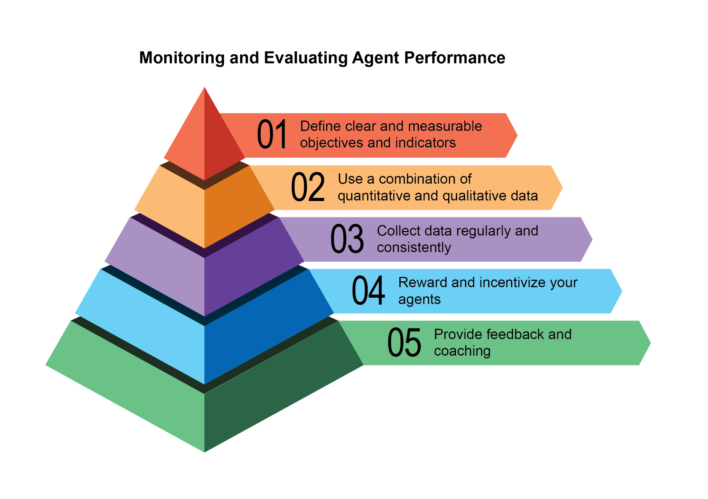
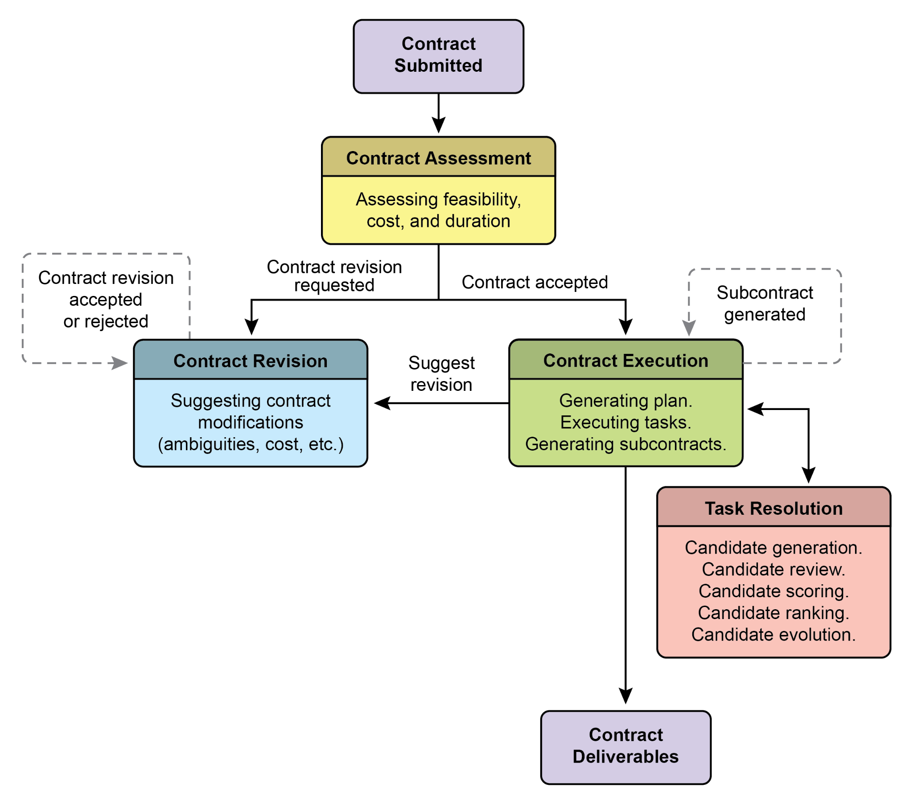
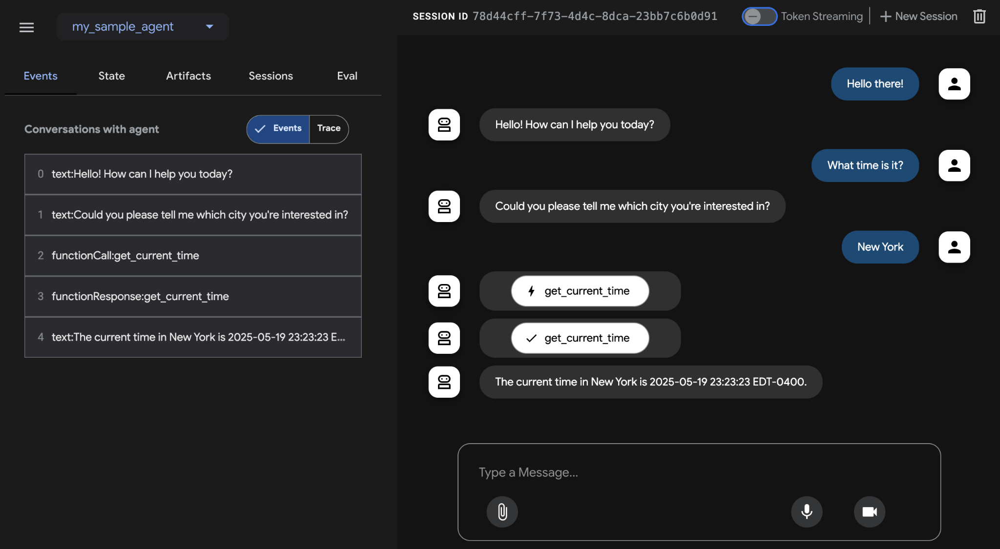
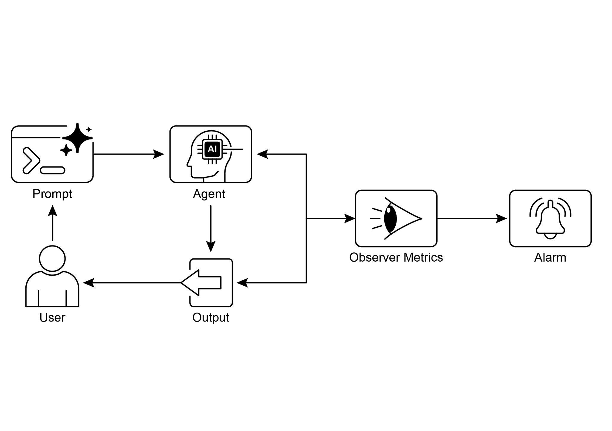

# 第 19 章:評估與監控(Evaluation and Monitoring)

本章探討一系列方法,讓智慧代理(intelligent agent)能夠有系統地評估自身表現、監控朝向目標的進展,並偵測運作上的異常。第 11 章勾勒了目標設定與監控,第 17 章則處理推理機制,而本章聚焦於對代理之有效性(effectiveness)、效率(efficiency)以及對需求遵循程度進行持續、且往往是外部的衡量。這包括定義各項指標、建立回饋迴路(feedback loop),以及實作報告系統,以確保代理在運作環境中的表現符合期望(見圖 1)。



*圖 1:評估與監控的最佳實務做法。*

## 實務應用與使用案例

最常見的應用與使用案例如下:

- **即時系統中的效能追蹤(Performance Tracking in Live Systems):** 持續監控部署於正式環境(production environment)中代理的準確度、延遲(latency)與資源消耗(例如客服聊天機器人的問題解決率、回應時間)。
- **代理改良的 A/B 測試(A/B Testing for Agent Improvements):** 平行地系統化比較不同代理版本或策略的表現,以找出最佳做法(例如為物流代理嘗試兩種不同的規劃演算法)。
- **合規與安全稽核(Compliance and Safety Audits):** 產生自動化的稽核報告,長期追蹤代理對倫理準則、法規要求與安全規範的遵循情形。這些報告可由「人在迴路中(human-in-the-loop)」或另一個代理來驗證,並能產生關鍵績效指標(KPI)或在發現問題時觸發警示。
- **企業系統(Enterprise systems):** 為了治理企業系統中的代理式 AI(Agentic AI),需要一種新的控制工具,即 AI「合約(Contract)」。這份動態協議把交付給 AI 的任務之目標、規則與控制機制明文化。
- **漂移偵測(Drift Detection):** 長期監控代理輸出的相關性或準確度,偵測其表現何時因輸入資料分布變化(概念漂移,concept drift)或環境變遷而退化。
- **代理行為的異常偵測(Anomaly Detection in Agent Behavior):** 辨識代理所採取的異常或非預期動作,這些動作可能代表錯誤、惡意攻擊,或某種衍生出的非預期行為。
- **學習進度評估(Learning Progress Assessment):** 對於設計用來學習的代理,追蹤其學習曲線、在特定技能上的進步,或在不同任務與資料集上的泛化(generalization)能力。

## 動手實作範例

為 AI 代理開發一套完整的評估框架是一項艱鉅的任務,其複雜程度堪比一門學術學科或一部份量十足的出版品。這項困難源自於需要考量的因素眾多,例如模型表現、使用者互動、倫理影響,以及更廣泛的社會衝擊。儘管如此,就實務落地而言,焦點可以收斂到對 AI 代理高效、有效運作至關重要的幾個關鍵使用案例上。

**代理回應評估(Agent Response Assessment):** 這個核心流程對於評估代理輸出的品質與準確度至關重要。它涉及判斷代理是否針對給定的輸入,提供切題、正確、合乎邏輯、不帶偏見且準確的資訊。評估指標可能包括事實正確性(factual correctness)、流暢度(fluency)、文法精確度,以及對使用者意圖的契合程度。

```python
def evaluate_response_accuracy(agent_output: str, expected_output: str) -> float:
    """Calculates a simple accuracy score for agent responses."""
    # 這是非常基本的完全比對;真實世界會使用更精密的指標
    return 1.0 if agent_output.strip().lower() == expected_output.strip().lower() else 0.0

# Example usage
agent_response = "The capital of France is Paris."
ground_truth = "Paris is the capital of France."
score = evaluate_response_accuracy(agent_response, ground_truth)
print(f"Response accuracy: {score}")
```

Python 函式 `evaluate_response_accuracy` 為 AI 代理的回應計算一個基本的準確度分數:它在去除前後空白後,對代理輸出與預期輸出進行完全、不分大小寫的比對。完全相符時回傳 1.0,否則回傳 0.0,代表一種「對或錯」的二元評估。這個方法對於簡單的檢查雖然直接明瞭,卻無法處理改寫(paraphrasing)或語意等價(semantic equivalence)等變化。

問題出在它的比對方式上。這個函式對兩個字串進行嚴格的、逐字元的比較。在所提供的範例中:

- `agent_response`:"The capital of France is Paris."
- `ground_truth`:"Paris is the capital of France."

即使去除空白並轉成小寫後,這兩個字串仍然不相同。因此,儘管兩個句子傳達相同的意義,函式仍會錯誤地回傳 0.0 的準確度分數。

直接的字串比較在評估語意相似度時力有未逮,只有在代理回應與預期輸出完全相符時才會成功。更有效的評估,需要進階的自然語言處理(Natural Language Processing,NLP)技術來辨別句子之間的意義。要在真實世界情境中對 AI 代理進行徹底評估,更精密的指標往往不可或缺。這些指標可以涵蓋:字串相似度量測(String Similarity Measures),例如萊文斯坦距離(Levenshtein distance)與傑卡德相似度(Jaccard similarity);關鍵字分析(Keyword Analysis),用以檢查特定關鍵字的存在與否;語意相似度(Semantic Similarity),運用嵌入模型(embedding model)的餘弦相似度(cosine similarity);LLM 即評審(LLM-as-a-Judge)評估(稍後討論,用以評估細緻入微的正確性與有用性);以及 RAG 專屬指標(RAG-specific Metrics),例如忠實度(faithfulness)與相關性(relevance)。

**延遲監控(Latency Monitoring):** 在 AI 代理回應或行動速度為關鍵因素的應用中,對代理動作進行延遲監控至關重要。這個流程量測代理處理請求並產生輸出所需的時間。過高的延遲會對使用者體驗及代理的整體有效性造成不利影響,在即時或互動式環境中尤其如此。在實務應用上,僅僅把延遲資料印到主控台(console)是不夠的。建議把這些資訊記錄(log)到持久性的儲存系統中。可選方案包括:結構化的日誌檔(例如 JSON)、時序資料庫(time-series database,例如 InfluxDB、Prometheus)、資料倉儲(data warehouse,例如 Snowflake、BigQuery、PostgreSQL),或可觀測性平台(observability platform,例如 Datadog、Splunk、Grafana Cloud)。

**追蹤 LLM 互動的 token 用量(Tracking Token Usage for LLM Interactions):** 對於由 LLM 驅動的代理而言,追蹤 token 用量對於管理成本與最佳化資源配置至關重要。LLM 互動的計費往往取決於所處理的 token 數量(輸入與輸出)。因此,有效率地使用 token 能直接降低營運開銷。此外,監控 token 數量有助於找出在提示工程(prompt engineering)或回應生成流程中可以改進的潛在環節。

```python
# 這只是概念性示意,實際的 token 計數取決於 LLM API
class LLMInteractionMonitor:
    def __init__(self):
        self.total_input_tokens = 0
        self.total_output_tokens = 0

    def record_interaction(self, prompt: str, response: str):
        # 在真實情境中,請使用 LLM API 的 token 計數器或一個 tokenizer
        input_tokens = len(prompt.split())  # Placeholder
        output_tokens = len(response.split())  # Placeholder
        self.total_input_tokens += input_tokens
        self.total_output_tokens += output_tokens
        print(f"Recorded interaction: Input tokens={input_tokens}, Output tokens={output_tokens}")

    def get_total_tokens(self):
        return self.total_input_tokens, self.total_output_tokens

# Example usage
monitor = LLMInteractionMonitor()
monitor.record_interaction("What is the capital of France?", "The capital of France is Paris.")
monitor.record_interaction("Tell me a joke.", "Why don't scientists trust atoms? Because they make up everything!")
input_t, output_t = monitor.get_total_tokens()
print(f"Total input tokens: {input_t}, Total output tokens: {output_t}")
```

本節介紹一個概念性的 Python 類別 `LLMInteractionMonitor`,用以追蹤大型語言模型互動中的 token 用量。這個類別內建了輸入與輸出 token 的計數器。它的 `record_interaction` 方法藉由分割(split)提示與回應字串來模擬 token 計數。在實務實作中,則會採用特定 LLM API 的 tokenizer 來取得精確的 token 數。隨著互動發生,監控器會累加輸入與輸出 token 的總數。`get_total_tokens` 方法則提供對這些累計總數的存取,這對於成本管理與 LLM 使用的最佳化至關重要。

**運用 LLM 即評審打造「有用性」的自訂指標(Custom Metric for "Helpfulness" using LLM-as-a-Judge):** 評估像 AI 代理「有用性(helpfulness)」這類主觀特質,所帶來的挑戰超出了標準客觀指標的範疇。一種可行的框架是運用 LLM 作為評估者(evaluator)。這種「LLM 即評審(LLM-as-a-Judge)」的做法,會依據預先定義的「有用性」準則來評估另一個 AI 代理的輸出。藉由善用 LLM 進階的語言能力,這個方法能對主觀特質提供細緻、近似人類的評估,勝過單純的關鍵字比對或基於規則的評估。儘管這項技術仍在發展中,它在自動化並擴大規模地進行質性評估方面展現了潛力。

```python
import google.generativeai as genai
import os
import json
import logging
from typing import Optional

# --- Configuration ---
logging.basicConfig(level=logging.INFO, format='%(asctime)s - %(levelname)s - %(message)s')

# 設定環境變數作為你的 API key 才能執行此腳本
# 例如,在你的終端機中:export GOOGLE_API_KEY='your_key_here'
try:
    genai.configure(api_key=os.environ["GOOGLE_API_KEY"])
except KeyError:
    logging.error("Error: GOOGLE_API_KEY environment variable not set.")
    exit(1)

# --- LLM 即評審用於法律問卷品質的評分準則(Rubric)---
# 提示詞中譯:
# 你是一位專精法律問卷的方法學專家,也是一位嚴格的法律審查者。你的任務是評估一道給定的
# 法律問卷題目的品質。請就整體品質給出 1 到 5 分,並附上詳細的理由與具體的回饋意見。
# 請聚焦於以下準則:
#
# 1. 清晰度與精確性(分數 1-5):
#    * 1:極度含糊、高度模稜兩可或令人困惑。
#    * 3:尚稱清楚,但仍有更精確的空間。
#    * 5:完全清楚、毫不含糊,且在法律術語(若適用)與意圖上都十分精確。
#
# 2. 中立性與偏見(分數 1-5):
#    * 1:高度誘導性或帶有偏見,明顯把受訪者導向特定答案。
#    * 3:略帶暗示性,或可能被解讀為誘導性。
#    * 5:完全中立、客觀,不含任何誘導性語言或預設立場的字眼。
#
# 3. 相關性與聚焦(分數 1-5):
#    * 1:與所述問卷主題無關,或超出範疇。
#    * 3:鬆散相關,但可以更聚焦。
#    * 5:與問卷目標直接相關,並妥善聚焦於單一概念。
#
# 4. 完整性(分數 1-5):
#    * 1:省略了準確作答所需的關鍵資訊,或提供的脈絡不足。
#    * 3:大致完整,但缺少一些次要細節。
#    * 5:提供受訪者徹底作答所需的一切脈絡與資訊。
#
# 5. 對受眾的適切性(分數 1-5):
#    * 1:使用目標受眾無法理解的行話,或對專家而言過於簡化。
#    * 3:大致適切,但某些用語可能偏難或過度簡化。
#    * 5:完美貼合目標問卷受眾所假定的法律知識與背景。
#
# 輸出格式:
# 你的回應「必須」是一個 JSON 物件,包含以下鍵:
# * `overall_score`:一個 1 到 5 的整數(各準則分數的平均,或你的整體判斷)。
# * `rationale`:一段簡潔的摘要,說明為何給出此分數,並點出主要優點與缺點。
# * `detailed_feedback`:一份條列清單,詳述對每項準則(清晰度、中立性、相關性、完整性、
#   受眾適切性)的回饋。請提出具體的改進建議。
# * `concerns`:一份清單,列出任何具體的法律、倫理或方法學上的疑慮。
# * `recommended_action`:一項簡短建議(例如:「為求中立而修改」、「照原樣核准」、
#   「釐清範疇」)。
LEGAL_SURVEY_RUBRIC = """
You are an expert legal survey methodologist and a critical legal reviewer. Your task is to evaluate the quality of a given legal survey question.
Provide a score from 1 to 5 for overall quality, along with a detailed rationale and specific feedback.
Focus on the following criteria:

1. **Clarity & Precision (Score 1-5):**
* 1: Extremely vague, highly ambiguous, or confusing.
* 3: Moderately clear, but could be more precise.
* 5: Perfectly clear, unambiguous, and precise in its legal terminology (if applicable) and intent.

2. **Neutrality & Bias (Score 1-5):**
* 1: Highly leading or biased, clearly influencing the respondent towards a specific answer.
* 3: Slightly suggestive or could be interpreted as leading.
* 5: Completely neutral, objective, and free from any leading language or loaded terms.

3. **Relevance & Focus (Score 1-5):**
* 1: Irrelevant to the stated survey topic or out of scope.
* 3: Loosely related but could be more focused.
* 5: Directly relevant to the survey's objectives and well-focused on a single concept.

4. **Completeness (Score 1-5):**
* 1: Omits critical information needed to answer accurately or provides insufficient context.
* 3: Mostly complete, but minor details are missing.
* 5: Provides all necessary context and information for the respondent to answer thoroughly.

5. **Appropriateness for Audience (Score 1-5):**
* 1: Uses jargon inaccessible to the target audience or is overly simplistic for experts.
* 3: Generally appropriate, but some terms might be challenging or oversimplified.
* 5: Perfectly tailored to the assumed legal knowledge and background of the target survey audience.

**Output Format:**
Your response MUST be a JSON object with the following keys:
* `overall_score`: An integer from 1 to 5 (average of criterion scores, or your holistic judgment).
* `rationale`: A concise summary of why this score was given, highlighting major strengths and weaknesses.
* `detailed_feedback`: A bullet-point list detailing feedback for each criterion (Clarity, Neutrality, Relevance, Completeness, Audience Appropriateness). Suggest specific improvements.
* `concerns`: A list of any specific legal, ethical, or methodological concerns.
* `recommended_action`: A brief recommendation (e.g., "Revise for neutrality", "Approve as is", "Clarify scope").
"""


class LLMJudgeForLegalSurvey:
    """A class to evaluate legal survey questions using a generative AI model."""

    def __init__(self, model_name: str = 'gemini-1.5-flash-latest', temperature: float = 0.2):
        """
        Initializes the LLM Judge.
        Args:
            model_name (str): The name of the Gemini model to use.
                              'gemini-1.5-flash-latest' is recommended for speed and cost.
                              'gemini-1.5-pro-latest' offers the highest quality.
            temperature (float): The generation temperature. Lower is better for deterministic evaluation.
        """
        self.model = genai.GenerativeModel(model_name)
        self.temperature = temperature

    def _generate_prompt(self, survey_question: str) -> str:
        """Constructs the full prompt for the LLM judge."""
        # 提示詞中譯:此處組出送給模型的完整提示,將評分準則與待評題目串接,
        # 其中內嵌的標籤「**LEGAL SURVEY QUESTION TO EVALUATE:**」意為「**待評估的法律問卷題目:**」。
        return f"{LEGAL_SURVEY_RUBRIC}\n\n---\n**LEGAL SURVEY QUESTION TO EVALUATE:**\n{survey_question}\n---"

    def judge_survey_question(self, survey_question: str) -> Optional[dict]:
        """
        Judges the quality of a single legal survey question using the LLM.
        Args:
            survey_question (str): The legal survey question to be evaluated.
        Returns:
            Optional[dict]: A dictionary containing the LLM's judgment, or None if an error occurs.
        """
        full_prompt = self._generate_prompt(survey_question)
        try:
            logging.info(f"Sending request to '{self.model.model_name}' for judgment...")
            response = self.model.generate_content(
                full_prompt,
                generation_config=genai.types.GenerationConfig(
                    temperature=self.temperature,
                    response_mime_type="application/json"
                )
            )
            # 檢查是否因內容審核或其他原因導致回應為空。
            if not response.parts:
                safety_ratings = response.prompt_feedback.safety_ratings
                logging.error(f"LLM response was empty or blocked. Safety Ratings: {safety_ratings}")
                return None
            return json.loads(response.text)
        except json.JSONDecodeError:
            logging.error(f"Failed to decode LLM response as JSON. Raw response: {response.text}")
            return None
        except Exception as e:
            logging.error(f"An unexpected error occurred during LLM judgment: {e}")
            return None


# --- Example Usage ---
if __name__ == "__main__":
    judge = LLMJudgeForLegalSurvey()

    # --- Good Example ---
    good_legal_survey_question = """
    To what extent do you agree or disagree that current intellectual property laws in Switzerland adequately protect emerging AI-generated content, assuming the content meets the originality criteria established by the Federal Supreme Court?
    (Select one: Strongly Disagree, Disagree, Neutral, Agree, Strongly Agree)
    """
    print("\n--- Evaluating Good Legal Survey Question ---")
    judgment_good = judge.judge_survey_question(good_legal_survey_question)
    if judgment_good:
        print(json.dumps(judgment_good, indent=2))

    # --- Biased/Poor Example ---
    biased_legal_survey_question = """
    Don't you agree that overly restrictive data privacy laws like the FADP are hindering essential technological innovation and economic growth in Switzerland?
    (Select one: Yes, No)
    """
    print("\n--- Evaluating Biased Legal Survey Question ---")
    judgment_biased = judge.judge_survey_question(biased_legal_survey_question)
    if judgment_biased:
        print(json.dumps(judgment_biased, indent=2))

    # --- Ambiguous/Vague Example ---
    vague_legal_survey_question = """
    What are your thoughts on legal tech?
    """
    print("\n--- Evaluating Vague Legal Survey Question ---")
    judgment_vague = judge.judge_survey_question(vague_legal_survey_question)
    if judgment_vague:
        print(json.dumps(judgment_vague, indent=2))
```

這段 Python 程式碼定義了一個類別 `LLMJudgeForLegalSurvey`,設計用來運用一個生成式 AI 模型評估法律問卷題目的品質。它利用 `google.generativeai` 函式庫來與 Gemini 模型互動。

其核心功能是把一道問卷題目連同一份詳細的評估準則(rubric)一起送給模型。這份準則指定了五項評判問卷題目的標準:清晰度與精確性(Clarity & Precision)、中立性與偏見(Neutrality & Bias)、相關性與聚焦(Relevance & Focus)、完整性(Completeness),以及對受眾的適切性(Appropriateness for Audience)。每項標準會給予 1 到 5 的分數,並要求在輸出中提供詳細的理由與回饋。程式碼會構建一個包含準則與待評估問卷題目的提示。

`judge_survey_question` 方法把這個提示送往設定好的 Gemini 模型,並要求依照所定義的結構回傳一個 JSON 回應。預期的輸出 JSON 包含一個整體分數、一段摘要理由、對每項標準的詳細回饋、一份疑慮清單,以及一項建議行動。這個類別會處理 AI 模型互動過程中可能發生的錯誤,例如 JSON 解碼問題或空回應。腳本透過評估幾個法律問卷題目的範例來示範其運作,展示 AI 如何依據預先定義的標準來評估品質。

在做結論之前,讓我們檢視各種評估方法,並考量它們的優點與缺點。

| 評估方法 | 優點 | 缺點 |
| --- | --- | --- |
| 人工評估(Human Evaluation) | 能捕捉細微的行為 | 難以規模化、成本高昂且耗時,因為它涉及主觀的人為因素。 |
| LLM 即評審(LLM-as-a-Judge) | 一致、有效率且可規模化。 | 可能忽略中間步驟。受限於 LLM 本身的能力。 |
| 自動化指標(Automated Metrics) | 可規模化、有效率且客觀。 | 在捕捉完整能力方面可能存在侷限。 |

## 代理軌跡(Agents trajectories)

評估代理的軌跡(trajectory)至關重要,因為傳統的軟體測試並不足夠。標準程式碼會產出可預測的通過/失敗結果,而代理則以機率性的方式運作,因此既需要對最終輸出、也需要對代理的軌跡——即它為達成解答所採取的一連串步驟——進行質性評估。評估多代理系統(multi-agent system)極具挑戰性,因為它們處於不斷變動之中。這要求開發出更精密的指標,超越個體表現,去衡量溝通與團隊協作的有效性。此外,環境本身並非靜態,這要求評估方法(包括測試案例)能隨時間調適。

這涉及檢視決策的品質、推理過程,以及整體結果。實作自動化評估很有價值,對於超越原型(prototype)階段之後的開發尤其如此。分析軌跡與工具使用,包括評估代理為達成目標所採用的步驟,例如工具選擇、策略與任務效率。舉例來說,一個處理顧客產品查詢的代理,理想上可能會遵循這樣的軌跡:判定意圖、使用資料庫搜尋工具、審閱結果,然後生成報告。我們會把代理的實際動作與這個預期的、或稱「基準真相(ground truth)」的軌跡相比較,以找出錯誤與低效之處。比較方法包括:完全比對(exact match,要求與理想序列完全相符)、依序比對(in-order match,正確的動作依序出現,允許有額外步驟)、任意順序比對(any-order match,正確的動作以任意順序出現,允許有額外步驟)、精確率(precision,衡量所預測動作的相關性)、召回率(recall,衡量有多少必要動作被涵蓋到),以及單一工具使用(single-tool use,檢查某個特定動作)。指標的選擇取決於特定代理的需求,高風險情境可能要求完全比對,而較有彈性的情況則可能採用依序或任意順序比對。

AI 代理的評估涉及兩種主要做法:使用測試檔(test files)與使用評估集檔(evalset files)。測試檔採 JSON 格式,代表單一、簡單的代理與模型互動或工作階段(session),適合在積極開發期間進行單元測試(unit testing),著重於快速執行與較單純的工作階段複雜度。每個測試檔包含單一工作階段及多個回合(turn),其中一個回合是一次使用者與代理的互動,包含使用者的查詢、預期的工具使用軌跡、中間的代理回應,以及最終回應。舉例來說,一個測試檔可能詳述使用者要求「Turn off device_2 in the Bedroom」,並指定代理使用 `set_device_info` 工具,參數如 location: Bedroom、device_id: device_2 以及 status: OFF,而預期的最終回應為「I have set the device_2 status to off.」。測試檔可以組織到資料夾中,並可包含一個 `test_config.json` 檔來定義評估準則。評估集檔則利用一個稱為「評估集(evalset)」的資料集來評估互動,內含多個可能很長的工作階段,適合模擬複雜的多回合對話與整合測試(integration test)。一個評估集檔由多個「評估(evals)」組成,每個評估代表一個獨立的工作階段,含一個或多個「回合(turns)」,其中包含使用者查詢、預期的工具使用、中間回應,以及一個參考最終回應(reference final response)。舉例來說,一個評估集可能包含這樣的工作階段:使用者先問「What can you do?」,接著說「Roll a 10 sided dice twice and then check if 9 is a prime or not」,並定義預期的 `roll_die` 工具呼叫與一個 `check_prime` 工具呼叫,以及一段彙整擲骰結果與質數檢查的最終回應。

**多代理(Multi-agents):** 評估一個含有多個代理的複雜 AI 系統,很像在評量一個團隊專案。由於其中有許多步驟與交接(handoff),它的複雜性反而是一項優勢,讓你能在每一個階段檢查工作的品質。你可以檢視每個獨立「代理」在其特定職務上的表現有多好,但你也必須評估整個系統作為一個整體的運作情況。

為此,你會就團隊的協作動態提出幾個關鍵問題,並輔以具體範例:

- **這些代理是否有效協作?** 舉例來說,當一個「訂機票代理(Flight-Booking Agent)」訂好航班後,它是否成功地把正確的日期與目的地傳遞給「訂飯店代理(Hotel-Booking Agent)」?協作上的失敗可能導致飯店被訂在錯誤的週次。
- **它們是否擬定了一個好計畫並貫徹執行?** 想像計畫是先訂機票、再訂飯店。如果「飯店代理」在航班尚未確認前就試圖訂房,它就偏離了計畫。你也要檢查代理是否陷入卡關,例如無止盡地搜尋一輛「完美」的租車,卻始終沒有進入下一個步驟。
- **是否為正確的任務選擇了正確的代理?** 如果使用者詢問旅程的天氣,系統應該使用一個提供即時資料的專門「天氣代理(Weather Agent)」。如果它改用一個「一般知識代理(General Knowledge Agent)」,給出像「夏天通常很溫暖」這種籠統答案,那它就為這項工作選錯了工具。
- **最後,增加更多代理是否能提升表現?** 如果你為團隊新增一個「餐廳訂位代理(Restaurant-Reservation Agent)」,它是否讓整體的旅程規劃變得更好、更有效率?還是說它製造了衝突並拖慢了系統,顯示出可擴展性(scalability)上的問題?

## 從代理到進階承包商(From Agents to Advanced Contractors)

近期有人提出(《Agent Companion》,gulli 等人),一種從簡單 AI 代理演進為進階「承包商(contractors)」的構想,從機率性、往往不可靠的系統,轉向為複雜、高風險環境而設計的、更具確定性與當責性(accountable)的系統(見圖 2)。

當今常見的 AI 代理是依據簡短、規格不足的指令來運作,這讓它們適合用於簡單的展示,但在正式環境中卻很脆弱——因為在那裡,模糊性會導致失敗。「承包商」模型藉由在使用者與 AI 之間建立一種嚴謹、形式化的關係來解決此問題,這種關係建立在清楚定義且雙方同意的條款之上,就如同人類世界中的法律服務協議。這項轉變由四大支柱所支撐,它們共同確保了任務的清晰性、可靠性與穩健執行,而這些任務在過去是自主系統力所不及的。

第一是**形式化合約(Formalized Contract)**的支柱,這是一份詳細的規格,作為某項任務的單一事實來源(single source of truth)。它遠遠超出一個簡單的提示。舉例來說,一份財務分析任務的合約不會只說「analyze last quarter's sales(分析上一季的銷售)」;它會要求「a 20-page PDF report analyzing European market sales from Q1 2025, including five specific data visualizations, a comparative analysis against Q1 2024, and a risk assessment based on the included dataset of supply chain disruptions(一份 20 頁的 PDF 報告,分析 2025 年第一季的歐洲市場銷售,包含五個特定的資料視覺化、與 2024 年第一季的對比分析,以及一份基於所附供應鏈中斷資料集的風險評估)」。這份合約明確定義了所需的交付成果(deliverables)、它們的精確規格、可接受的資料來源、工作範疇,甚至預期的運算成本與完成時間,使結果在客觀上可被驗證。

第二是**協商與回饋的動態生命週期(Dynamic Lifecycle of Negotiation and Feedback)**的支柱。合約並非靜態的命令,而是一段對話的起點。承包商代理可以分析最初的條款並進行協商。舉例來說,如果合約要求使用某個代理無法存取的特定專有資料來源,它可以回傳這樣的回饋:「The specified XYZ database is inaccessible. Please provide credentials or approve the use of an alternative public database, which may slightly alter the data's granularity(指定的 XYZ 資料庫無法存取。請提供憑證,或核准使用替代的公開資料庫,但這可能會略微改變資料的粒度)」。這個協商階段也讓代理能標示模糊之處或潛在風險,在執行開始前化解誤解,防止代價高昂的失敗,並確保最終輸出與使用者的真實意圖完美契合。



*圖 2:代理之間的合約執行範例。*

第三個支柱是**以品質為核心的迭代執行(Quality-Focused Iterative Execution)**。與為低延遲回應而設計的代理不同,承包商優先重視正確性與品質。它依循自我驗證(self-validation)與自我校正(correction)的原則運作。以一份程式碼生成合約為例,代理不會只是把程式碼寫出來;它會生成多種演算法做法,針對合約中定義的一整套單元測試進行編譯與執行,依效能、安全性與可讀性等指標為每個解法評分,並只提交通過所有驗證準則的版本。這種「生成、審閱、改進自身成果直到滿足合約規格」的內部迴路,對於建立人們對其輸出的信任至關重要。

最後,第四個支柱是**透過子合約進行階層式分解(Hierarchical Decomposition via Subcontracts)**。對於相當複雜的任務,一個主承包商代理可以扮演專案經理的角色,把主要目標拆解成更小、更易管理的子任務。它藉由生成新的、形式化的「子合約(subcontracts)」來達成這一點。舉例來說,一份「build an e-commerce mobile application(建構一個電子商務行動應用程式)」的主合約,可以被主代理分解為數個子合約:「designing the UI/UX(設計 UI/UX)」、「developing the user authentication module(開發使用者驗證模組)」、「creating the product database schema(建立產品資料庫綱要)」,以及「integrating a payment gateway(整合金流閘道)」。這些子合約中的每一個,都是一份完整、獨立的合約,有其自身的交付成果與規格,並可被指派給其他專門的代理。這種結構化的分解,讓系統能以高度組織化且可規模化的方式來處理龐大、多面向的專案,標誌著 AI 從一個簡單工具,轉變為一個真正自主且可靠的問題解決引擎。

歸根究柢,這套承包商框架重新構想了 AI 互動的樣貌:它把形式化規格、協商與可驗證執行的原則,直接嵌入代理的核心邏輯之中。這種有條不紊的做法,把人工智慧從一個前景看好但往往難以預測的助手,提升為一個能以可稽核的精確度自主管理複雜專案的可靠系統。透過解決模糊性與可靠性這些關鍵挑戰,這個模型為在「信任與當責至上」的關鍵任務領域中部署 AI 鋪平了道路。

## Google 的 ADK(Google's ADK)

在做結論之前,讓我們看一個支援評估的框架的具體例子。使用 Google 的 ADK 進行代理評估(見圖 3)可透過三種方法進行:基於網頁的使用者介面(`adk web`),用於互動式評估與資料集生成;使用 pytest 的程式化整合,以納入測試管線(testing pipeline);以及直接的命令列介面(`adk eval`),適用於自動化評估,例如定期的建置生成與驗證流程。



*圖 3:Google ADK 的評估支援。*

基於網頁的使用者介面讓使用者能進行互動式的工作階段建立,並儲存到既有或新的評估集中,同時顯示評估狀態。pytest 整合允許藉由呼叫 `AgentEvaluator.evaluate`(指定代理模組與測試檔路徑),把測試檔作為整合測試的一部分來執行。

命令列介面則藉由提供代理模組路徑與評估集檔來促成自動化評估,並可選擇指定設定檔或印出詳細結果。在較大的評估集中,可以透過在評估集檔名後以逗號分隔列出特定評估,來選取它們執行。

## 重點速覽

**是什麼(What):** 代理式系統與 LLM 運作於複雜、動態的環境中,其表現可能隨時間而退化。它們機率性、非確定性(non-deterministic)的本質,意味著傳統軟體測試不足以確保可靠性。評估動態的多代理系統是一項重大挑戰,因為它們與其環境不斷變動的本質,要求開發出可調適的測試方法,以及能衡量超越個體表現之協作成功的精密指標。資料漂移、非預期互動、工具呼叫,以及偏離既定目標等問題,都可能在部署之後浮現。因此,持續性的評估有其必要,以衡量代理的有效性、效率,以及對運作與安全要求的遵循程度。

**為什麼(Why):** 一套標準化的評估與監控框架,提供了一種有系統的方式來評估並確保智慧代理的持續表現。這涉及為準確度、延遲與資源消耗(例如 LLM 的 token 用量)定義清楚的指標。它也包括進階技術,例如分析代理軌跡以理解推理過程,以及運用 LLM 即評審進行細緻的質性評估。透過建立回饋迴路與報告系統,這套框架能促成持續改進、A/B 測試,以及對異常或效能漂移的偵測,確保代理始終與其目標保持一致。

**經驗法則(Rule of thumb):** 當你要在即時、正式的環境中部署代理,而即時表現與可靠性至關重要時,使用此模式。此外,當你需要系統化地比較代理或其底層模型的不同版本以推動改進時,以及當你在需要合規、安全與倫理稽核的受監管或高風險領域中運作時,也應使用它。當代理的表現可能因資料或環境的變化(漂移)而隨時間退化時,或當你在評估複雜的代理行為(包括一連串動作的軌跡,以及像有用性這類主觀輸出的品質)時,此模式同樣適用。

## 視覺摘要



*圖 4:評估與監控設計模式。*

## 重點整理

- 評估智慧代理超越了傳統測試的範疇,要持續衡量它們在真實世界環境中的有效性、效率,以及對需求的遵循程度。
- 代理評估的實務應用包括:即時系統中的效能追蹤、改良用的 A/B 測試、合規稽核,以及偵測行為上的漂移或異常。
- 基本的代理評估涉及評估回應準確度,而真實世界情境則要求更精密的指標,例如對由 LLM 驅動之代理的延遲監控與 token 用量追蹤。
- 代理軌跡——即代理所採取的一連串步驟——對評估至關重要,它把實際動作與理想的基準真相路徑相比較,以找出錯誤與低效之處。
- ADK 提供了結構化的評估方法,包括用於單元測試的個別測試檔,以及用於整合測試的完整評估集檔,兩者都定義了預期的代理行為。
- 代理評估可透過基於網頁的使用者介面進行互動式測試、以 pytest 進行程式化的 CI/CD 整合,或透過命令列介面執行自動化工作流程。
- 為了讓 AI 在複雜、高風險的任務上變得可靠,我們必須從簡單的提示轉向形式化的「合約」,以精確定義可驗證的交付成果與範疇。這種結構化的協議讓代理能夠協商、釐清模糊之處,並迭代地驗證自身的工作,把它從一個難以預測的工具,轉變為一個當責且值得信賴的系統。

## 結論

總結而言,要有效評估 AI 代理,需要超越單純的準確度檢查,轉而對它們在動態環境中的表現進行持續、多面向的評估。這涉及對延遲與資源消耗等指標的實務監控,以及透過軌跡對代理決策過程進行精密分析。對於像有用性這類細緻的特質,LLM 即評審等創新方法正變得不可或缺,而像 Google 的 ADK 這類框架則為單元測試與整合測試提供了結構化的工具。當面對多代理系統時,挑戰會更加劇烈,此時焦點轉移到評估協作的成功與有效的合作。

為了確保在關鍵應用中的可靠性,典範正從簡單、由提示驅動的代理,轉向受形式化協議約束的進階「承包商」。這些承包商代理依據明確、可驗證的條款運作,使它們能夠協商、分解任務,並自我驗證其工作,以符合嚴格的品質標準。這種結構化的做法,把代理從難以預測的工具,轉變為能夠處理複雜、高風險任務的當責系統。歸根究柢,這項演進對於建立部署精密代理式 AI 於關鍵任務領域所需的信任,至關重要。

## 參考資料

相關研究包括:

1. ADK Web:<https://github.com/google/adk-web>
2. ADK Evaluate:<https://google.github.io/adk-docs/evaluate/>
3. Survey on Evaluation of LLM-based Agents:<https://arxiv.org/abs/2503.16416>
4. Agent-as-a-Judge: Evaluate Agents with Agents:<https://arxiv.org/abs/2410.10934>
5. Agent Companion, gulli et al.:<https://www.kaggle.com/whitepaper-agent-companion>
