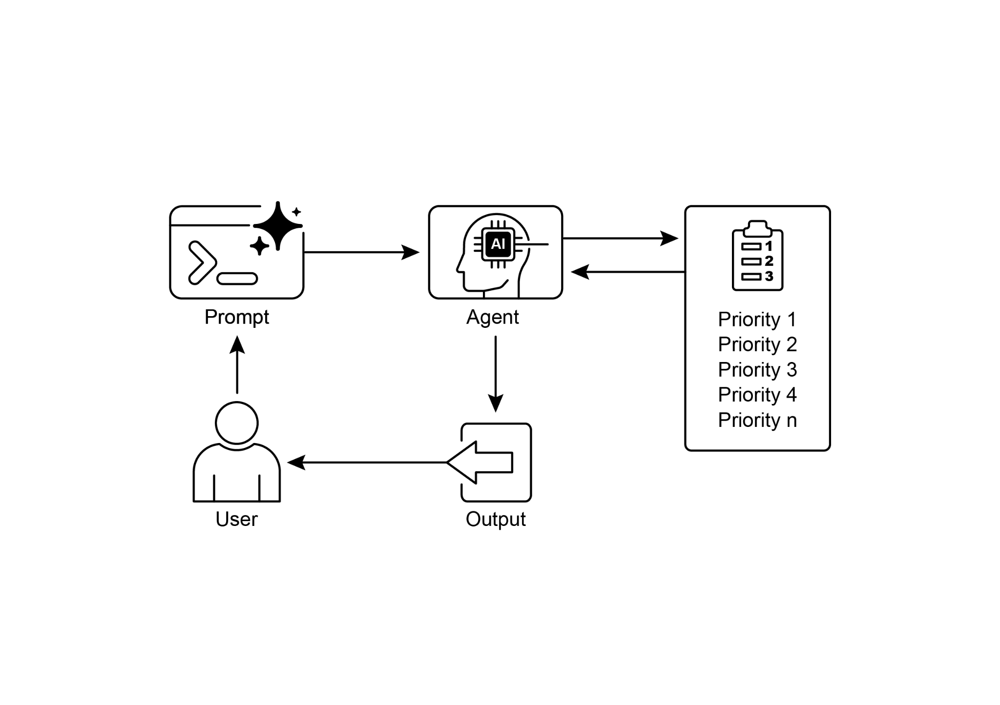

# 第 20 章:優先排序(Prioritization)

在複雜且動態的環境中,代理(Agent)經常會遇到眾多潛在的行動、相互衝突的目標,以及有限的資源。如果缺乏一套用來決定下一步行動的明確流程,代理可能會出現效率下降、運作延遲,或無法達成關鍵目標的情況。優先排序(Prioritization)模式正是用來解決這個問題:它讓代理能夠根據任務、目標或行動的重要性、急迫性、相依關係,以及既定的準則,對它們進行評估與排序。如此一來,便能確保代理把心力集中在最關鍵的任務上,進而提升整體成效並更貼合目標。

## 優先排序模式總覽

代理運用優先排序來有效管理任務、目標與子目標,藉此引導後續的行動。當需要同時面對多項需求時,這個流程能促成有依據的決策,讓重要或緊急的活動優先於較不關鍵者。在現實世界的情境中——資源受限、時間有限、目標彼此衝突——這一點格外重要。

代理優先排序的基本面向通常涉及數個要素。第一,準則定義(criteria definition)建立起評估任務所依據的規則或指標。這些可能包括:急迫性(urgency,任務的時間敏感度)、重要性(importance,對主要目標的影響)、相依關係(dependencies,該任務是否為其他任務的前置條件)、資源可用性(resource availability,必要工具或資訊是否就緒)、成本效益分析(cost/benefit analysis,投入心力與預期成果的比較),以及個人化代理的使用者偏好(user preferences)。第二,任務評估(task evaluation)是指針對這些既定準則來評估每一項潛在任務,所採用的方法可從簡單的規則,到由大型語言模型(LLM)進行的複雜評分或推理。第三,排程或選擇邏輯(scheduling or selection logic)是指根據這些評估結果,選出最佳的下一個行動或任務序列的演算法,過程中可能會運用一個佇列(queue)或一個進階的規劃元件。最後,動態重新排序(dynamic re-prioritization)讓代理能在情況改變時調整優先順序,例如出現新的關鍵事件或截止期限將近,藉此確保代理的適應力與回應能力。

優先排序可以發生在不同層級:選擇一個總體目標(高層級的目標優先排序)、為一份計畫中的各步驟排序(子任務優先排序),或從可用選項中挑選下一個立即要執行的行動(行動選擇)。有效的優先排序,能讓代理展現出更聰明、更有效率、更穩健的行為,尤其是在複雜、多目標的環境中。這與人類團隊的組織方式如出一轍——管理者會綜合所有成員的意見,來為任務排定優先順序。

## 實務應用與使用案例

在各種現實世界的應用中,AI 代理展現出對優先排序的精巧運用,以做出及時且有效的決策。

- **自動化客戶支援(Automated Customer Support):** 代理會把緊急請求(例如系統中斷的回報)排在例行事項(例如重設密碼)之前。它們也可能對高價值客戶給予優先處理。
- **雲端運算(Cloud Computing):** AI 透過在需求高峰期把資源優先配置給關鍵應用程式來管理與排程資源,同時把較不緊急的批次工作(batch jobs)挪到離峰時段,以最佳化成本。
- **自動駕駛系統(Autonomous Driving Systems):** 持續對行動進行優先排序,以確保安全與效率。舉例來說,為避免碰撞而煞車,其優先順序高於維持車道紀律或最佳化燃油效率。
- **金融交易(Financial Trading):** 交易機器人會分析市場狀況、風險承受度、利潤空間與即時新聞等因素來為交易排定優先順序,使高優先順序的交易得以即時執行。
- **專案管理(Project Management):** AI 代理會根據截止期限、相依關係、團隊可用性與策略重要性,為專案看板上的任務排定優先順序。
- **網路資安(Cybersecurity):** 監控網路流量的代理會透過評估威脅嚴重度、潛在影響與資產關鍵性來為警示排序,確保對最危險的威脅做出即時回應。
- **個人助理 AI(Personal Assistant AIs):** 運用優先排序來管理日常生活,根據使用者自訂的重要性、即將到來的截止期限與當前情境,來安排行事曆事件、提醒與通知。

這些例子共同說明了:在各式各樣的情境中,排定優先順序的能力,是 AI 代理之所以能提升表現與決策能力的根本所在。

## 動手實作範例

以下示範如何運用 LangChain 開發一個專案經理 AI 代理(Project Manager AI agent)。這個代理能協助建立、排序並指派任務給團隊成員,藉此展示如何把大型語言模型與量身打造的工具結合起來,以進行自動化的專案管理。

```python
import os
import asyncio
from typing import List, Optional, Dict, Type
from dotenv import load_dotenv
from pydantic import BaseModel, Field
from langchain_core.prompts import ChatPromptTemplate
from langchain_core.tools import Tool
from langchain_openai import ChatOpenAI
from langchain.agents import AgentExecutor, create_react_agent
from langchain.memory import ConversationBufferMemory

# --- 0. 組態與設定 ---
# 從 .env 檔案載入 OPENAI_API_KEY。
load_dotenv()

# ChatOpenAI 用戶端會自動從環境變數中讀取 API 金鑰。
llm = ChatOpenAI(temperature=0.5, model="gpt-4o-mini")

# --- 1. 任務管理系統 ---
class Task(BaseModel):
    """Represents a single task in the system."""
    id: str
    description: str
    priority: Optional[str] = None  # P0, P1, P2
    assigned_to: Optional[str] = None  # Name of the worker

class SuperSimpleTaskManager:
    """An efficient and robust in-memory task manager."""
    def __init__(self):
        # 使用字典(dictionary)以達成 O(1) 的查詢、更新與刪除。
        self.tasks: Dict[str, Task] = {}
        self.next_task_id = 1

    def create_task(self, description: str) -> Task:
        """Creates and stores a new task."""
        task_id = f"TASK-{self.next_task_id:03d}"
        new_task = Task(id=task_id, description=description)
        self.tasks[task_id] = new_task
        self.next_task_id += 1
        print(f"DEBUG: Task created - {task_id}: {description}")
        return new_task

    def update_task(self, task_id: str, **kwargs) -> Optional[Task]:
        """Safely updates a task using Pydantic's model_copy."""
        task = self.tasks.get(task_id)
        if task:
            # 使用 model_copy 來進行型別安全的更新。
            update_data = {k: v for k, v in kwargs.items() if v is not None}
            updated_task = task.model_copy(update=update_data)
            self.tasks[task_id] = updated_task
            print(f"DEBUG: Task {task_id} updated with {update_data}")
            return updated_task
        print(f"DEBUG: Task {task_id} not found for update.")
        return None

    def list_all_tasks(self) -> str:
        """Lists all tasks currently in the system."""
        if not self.tasks:
            return "No tasks in the system."
        task_strings = []
        for task in self.tasks.values():
            task_strings.append(
                f"ID: {task.id}, Desc: '{task.description}', "
                f"Priority: {task.priority or 'N/A'}, "
                f"Assigned To: {task.assigned_to or 'N/A'}"
            )
        return "Current Tasks:\n" + "\n".join(task_strings)

task_manager = SuperSimpleTaskManager()

# --- 2. 專案經理代理的工具 ---
# 使用 Pydantic 模型作為工具參數,以獲得更好的驗證與清晰度。
class CreateTaskArgs(BaseModel):
    # 提示詞中譯:該任務的詳細描述。
    description: str = Field(description="A detailed description of the task.")

class PriorityArgs(BaseModel):
    # 提示詞中譯:要更新的任務 ID,例如 'TASK-001'。
    task_id: str = Field(description="The ID of the task to update, e.g., 'TASK-001'.")
    # 提示詞中譯:要設定的優先順序。必須是以下其中之一:'P0'、'P1'、'P2'。
    priority: str = Field(description="The priority to set. Must be one of: 'P0', 'P1', 'P2'.")

class AssignWorkerArgs(BaseModel):
    # 提示詞中譯:要更新的任務 ID,例如 'TASK-001'。
    task_id: str = Field(description="The ID of the task to update, e.g., 'TASK-001'.")
    # 提示詞中譯:要指派該任務的工作者名稱。
    worker_name: str = Field(description="The name of the worker to assign the task to.")

def create_new_task_tool(description: str) -> str:
    """Creates a new project task with the given description."""
    task = task_manager.create_task(description)
    return f"Created task {task.id}: '{task.description}'."

def assign_priority_to_task_tool(task_id: str, priority: str) -> str:
    """Assigns a priority (P0, P1, P2) to a given task ID."""
    if priority not in ["P0", "P1", "P2"]:
        return "Invalid priority. Must be P0, P1, or P2."
    task = task_manager.update_task(task_id, priority=priority)
    return f"Assigned priority {priority} to task {task.id}." if task else f"Task {task_id} not found."

def assign_task_to_worker_tool(task_id: str, worker_name: str) -> str:
    """Assigns a task to a specific worker."""
    task = task_manager.update_task(task_id, assigned_to=worker_name)
    return f"Assigned task {task.id} to {worker_name}." if task else f"Task {task_id} not found."

# 專案經理代理可以使用的所有工具
pm_tools = [
    Tool(
        name="create_new_task",
        func=create_new_task_tool,
        # 提示詞中譯:先使用這個工具來建立一個新任務並取得它的 ID。
        description="Use this first to create a new task and get its ID.",
        args_schema=CreateTaskArgs
    ),
    Tool(
        name="assign_priority_to_task",
        func=assign_priority_to_task_tool,
        # 提示詞中譯:在任務建立之後,使用這個工具來為任務指派優先順序。
        description="Use this to assign a priority to a task after it has been created.",
        args_schema=PriorityArgs
    ),
    Tool(
        name="assign_task_to_worker",
        func=assign_task_to_worker_tool,
        # 提示詞中譯:在任務建立之後,使用這個工具來把任務指派給特定的工作者。
        description="Use this to assign a task to a specific worker after it has been created.",
        args_schema=AssignWorkerArgs
    ),
    Tool(
        name="list_all_tasks",
        func=task_manager.list_all_tasks,
        # 提示詞中譯:使用這個工具來列出所有目前的任務及其狀態。
        description="Use this to list all current tasks and their status."
    ),
]

# --- 3. 專案經理代理定義 ---
pm_prompt_template = ChatPromptTemplate.from_messages([
    # 提示詞中譯:
    # 你是一個專注的專案經理大型語言模型(LLM)代理。你的目標是有效率地管理專案任務。
    # 當你收到一個新的任務請求時,請依照下列步驟進行:
    # 1. 首先,使用 `create_new_task` 工具,以給定的描述建立任務。你必須先做這一步以取得 `task_id`。
    # 2. 接著,分析使用者的請求,看看是否提到了優先順序或指派對象。
    # - 如果提到了優先順序(例如「urgent(緊急)」、「ASAP(盡快)」、「critical(關鍵)」),就把它對應到 P0。使用 `assign_priority_to_task`。
    # - 如果提到了某位工作者,就使用 `assign_task_to_worker`。
    # 3. 如果有任何資訊(優先順序、指派對象)缺漏,你必須做出合理的預設指派(例如指派 P1 優先順序,並指派給 'Worker A')。
    # 4. 一旦任務處理完成,使用 `list_all_tasks` 來顯示最終狀態。
    # 可用的工作者:'Worker A'、'Worker B'、'Review Team'
    # 優先順序層級:P0(最高)、P1(中等)、P2(最低)
    ("system", """You are a focused Project Manager LLM agent. Your goal is to manage project tasks efficiently.
When you receive a new task request, follow these steps:
1. First, create the task with the given description using the `create_new_task` tool. You must do this first to get a `task_id`.
2. Next, analyze the user's request to see if a priority or an assignee is mentioned.
- If a priority is mentioned (e.g., "urgent", "ASAP", "critical"), map it to P0. Use `assign_priority_to_task`.
- If a worker is mentioned, use `assign_task_to_worker`.
3. If any information (priority, assignee) is missing, you must make a reasonable default assignment (e.g., assign P1 priority and assign to 'Worker A').
4. Once the task is fully processed, use `list_all_tasks` to show the final state.
Available workers: 'Worker A', 'Worker B', 'Review Team'
Priority levels: P0 (highest), P1 (medium), P2 (lowest)
"""),
    ("placeholder", "{chat_history}"),
    ("human", "{input}"),
    ("placeholder", "{agent_scratchpad}")
])

# 建立代理執行器(agent executor)
pm_agent = create_react_agent(llm, pm_tools, pm_prompt_template)
pm_agent_executor = AgentExecutor(
    agent=pm_agent,
    tools=pm_tools,
    verbose=True,
    handle_parsing_errors=True,
    memory=ConversationBufferMemory(memory_key="chat_history", return_messages=True)
)

# --- 4. 簡單的互動流程 ---
async def run_simulation():
    print("--- Project Manager Simulation ---")

    # 情境 1:處理一個新的緊急功能請求
    print("\n[User Request] I need a new login system implemented ASAP. It should be assigned to Worker B.")
    await pm_agent_executor.ainvoke({"input": "Create a task to implement a new login system. It's urgent and should be assigned to Worker B."})

    print("\n" + "-"*60 + "\n")

    # 情境 2:處理一個較不緊急、細節較少的內容更新
    print("[User Request] We need to review the marketing website content.")
    await pm_agent_executor.ainvoke({"input": "Manage a new task: Review marketing website content."})

    print("\n--- Simulation Complete ---")

# 執行模擬
if __name__ == "__main__":
    asyncio.run(run_simulation())
```

這段程式碼運用 Python 與 LangChain 實作了一個簡單的任務管理系統,設計目的是模擬一個由大型語言模型驅動的專案經理代理。

這個系統採用 `SuperSimpleTaskManager` 類別,在記憶體中有效地管理任務,並利用字典(dictionary)結構來快速取回資料。每一項任務都由一個 `Task` Pydantic 模型來表示,其中包含若干屬性,例如唯一識別碼、描述文字、選用的優先順序層級(P0、P1、P2),以及選用的指派對象。記憶體的使用量會依任務類型、工作者人數及其他影響因素而有所不同。任務管理器提供了建立任務、修改任務,以及取回所有任務的方法。

代理透過一組定義好的工具(Tools)與任務管理器互動。這些工具能協助建立新任務、為任務指派優先順序、把任務分配給人員,以及列出所有任務。每個工具都經過封裝,以便與 `SuperSimpleTaskManager` 的某個實例互動。範例運用 Pydantic 模型來界定工具所需的參數,從而確保資料的驗證。

`AgentExecutor` 配置了語言模型、工具集,以及一個對話記憶元件,用以維持情境的連續性。範例定義了一個特定的 `ChatPromptTemplate` 來引導代理在專案管理角色中的行為。這個提示指示代理先從建立任務開始,接著依指定情況指派優先順序與人員,最後再以一份完整的任務清單作結。對於資訊缺漏的情況,提示中明訂了預設的指派方式,例如 P1 優先順序與 'Worker A'。

這段程式碼納入了一個非同步性質的模擬函式(`run_simulation`),用以展示代理的運作能力。模擬執行了兩個截然不同的情境:一個是管理指定了人員的緊急任務,另一個是管理輸入極少、較不緊急的任務。由於在 `AgentExecutor` 中啟用了 `verbose=True`,代理的行動與邏輯推理過程都會被輸出到主控台(console)。

## 重點速覽

**是什麼(What):** 在複雜環境中運作的 AI 代理,會面臨眾多潛在的行動、相互衝突的目標,以及有限的資源。如果缺乏一套明確的方法來決定下一步,這些代理就有可能變得既無效率又無成效。這會導致顯著的運作延遲,甚至完全無法達成主要目標。核心挑戰在於:如何駕馭這龐大到令人不知所措的選項數量,以確保代理能有目的、有邏輯地行動。

**為什麼(Why):** 優先排序模式為此問題提供了一套標準化的解法,讓代理能夠為任務與目標排序。其做法是建立明確的準則,例如急迫性、重要性、相依關係與資源成本。代理接著針對這些準則來評估每一個潛在行動,以判定出最關鍵、最及時的行動方針。這項代理(Agentic)能力,讓系統得以動態地適應不斷變化的情況,並有效地管理受限的資源。透過聚焦於優先順序最高的項目,代理的行為會變得更聰明、更穩健,並更貼合其策略目標。

**經驗法則(Rule of thumb):** 當一個代理系統必須在資源受限的情況下,自主地管理多項(且經常相互衝突的)任務或目標,以便在動態環境中有效運作時,就使用優先排序模式。

**視覺摘要:**



*圖 1:優先排序設計模式*

## 重點整理

- 優先排序讓 AI 代理能在複雜、多面向的環境中有效運作。
- 代理運用既定準則(例如急迫性、重要性與相依關係)來評估任務並為其排序。
- 動態重新排序讓代理能因應即時的變化,調整其運作焦點。
- 優先排序發生在不同層級,涵蓋總體的策略目標,以及立即的戰術決策。
- 有效的優先排序,能提升 AI 代理的效率與運作穩健度。

## 結論

總結來說,優先排序模式是高效代理型 AI(agentic AI)的基石,它讓系統得以帶著目的與智慧,駕馭動態環境的種種複雜性。它讓代理能夠自主地評估眾多相互衝突的任務與目標,並就「該把有限資源投注在何處」做出有理據的決策。這項代理能力超越了單純的任務執行,使系統得以扮演一個主動、具策略性的決策者。透過權衡急迫性、重要性與相依關係等準則,代理展現出一種精巧、近乎人類的推理歷程。

這種代理行為的一個關鍵特徵是動態重新排序,它賦予代理在條件改變時即時調整焦點的自主性。正如程式碼範例所示,代理能詮釋含糊的請求、自主選用適當的工具,並以合乎邏輯的順序安排其行動以達成目標。這種自我管理工作流程的能力,正是真正的代理系統與單純自動化腳本之間的分野所在。歸根究柢,精通優先排序,是打造能在任何複雜、真實世界情境中有效且可靠運作之穩健、智慧型代理的根本所在。

## 參考資料

1. Examining the Security of Artificial Intelligence in Project Management: A Case Study of AI-driven Project Scheduling and Resource Allocation in Information Systems Projects: <https://www.irejournals.com/paper-details/1706160>
2. AI-Driven Decision Support Systems in Agile Software Project Management: Enhancing Risk Mitigation and Resource Allocation: <https://www.mdpi.com/2079-8954/13/3/208>
