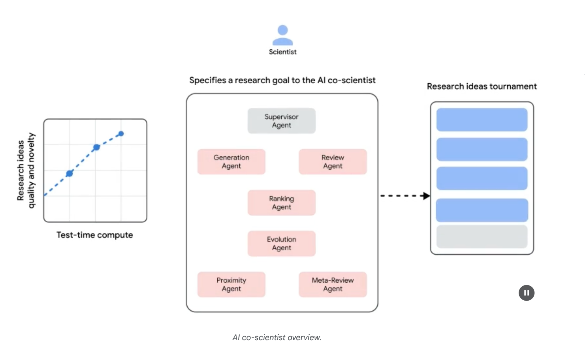
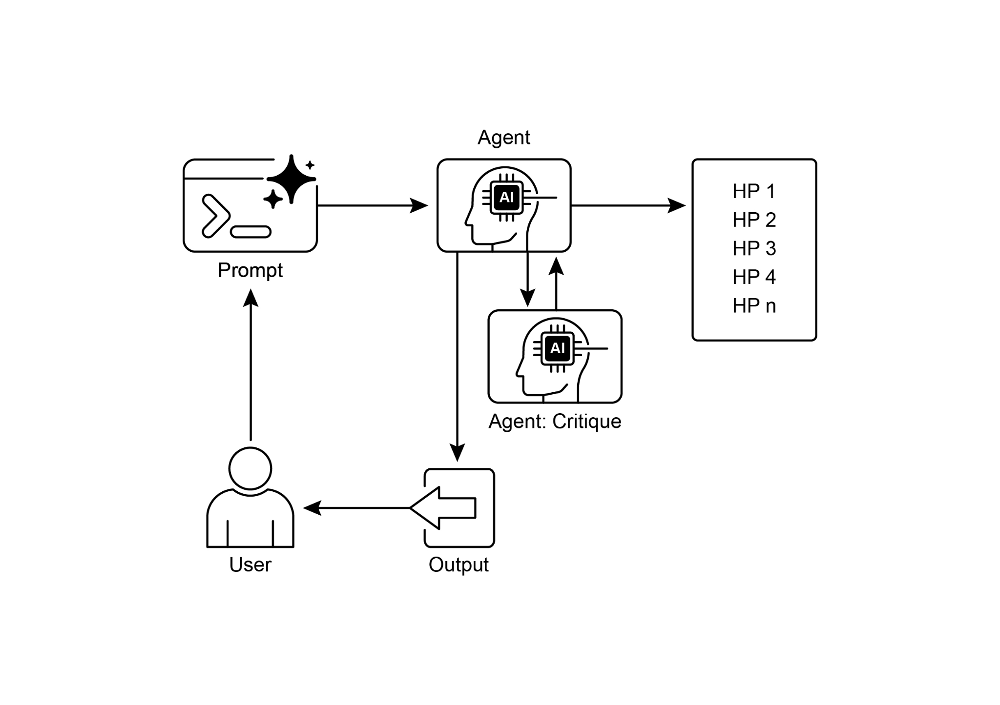

# 第 21 章:探索與發現(Exploration and Discovery)

本章探討一系列模式,讓智慧代理(intelligent agent)能夠主動地搜尋新穎的資訊、發掘新的可能性,並在其運作環境中辨識出「未知的未知(unknown unknowns)」。探索與發現,有別於反應式(reactive)行為,也不同於在一個預先定義好的解空間(solution space)內進行最佳化。相反地,它們著重於代理主動冒險進入陌生領域、實驗新的做法,並生成新的知識或理解。對於那些運作於開放式、複雜或快速演變領域的代理而言,當靜態知識或預先寫好的解法已不敷使用時,這個模式至關重要。它強調的是代理擴展其自身理解與能力的能耐。

## 實務應用與使用案例

AI 代理具備智慧地排定優先順序並進行探索的能力,這帶來了橫跨各種領域的應用。透過自主地評估並排序各種潛在行動,這些代理能夠在複雜環境中穿梭、發掘隱藏的洞見,並推動創新。這種具優先排序的探索能力,使它們得以最佳化流程、發現新知識,並生成內容。

範例:

- **科學研究自動化(Scientific Research Automation):** 代理設計並執行實驗、分析結果,並提出新的假說,以發現新穎的材料、候選藥物或科學原理。
- **遊戲對弈與策略生成(Game Playing and Strategy Generation):** 代理探索遊戲狀態,發掘湧現的策略,或辨識出遊戲環境中的弱點(例如 AlphaGo)。
- **市場研究與趨勢觀察(Market Research and Trend Spotting):** 代理掃描非結構化資料(社群媒體、新聞、報告),以辨識趨勢、消費者行為或市場機會。
- **資安漏洞發掘(Security Vulnerability Discovery):** 代理探查系統或程式碼庫,以找出安全缺陷或攻擊向量(attack vector)。
- **創意內容生成(Creative Content Generation):** 代理探索風格、主題或資料的各種組合,以生成藝術作品、音樂創作或文學作品。
- **個人化教育與訓練(Personalized Education and Training):** AI 家教根據學生的學習進度、學習風格與需要加強的領域,排定學習路徑與內容傳遞的優先順序。

## Google 共同科學家(Google Co-Scientist)

AI 共同科學家(AI co-scientist)是由 Google Research 開發的一套 AI 系統,被設計為一位運算層面的科學協作者(computational scientific collaborator)。它在研究的各個面向協助人類科學家,例如假說生成、提案精煉與實驗設計。這套系統運行於 Gemini 大型語言模型(LLM)之上。

AI 共同科學家的開發,正是為了因應科學研究中的種種挑戰。這些挑戰包括處理大量資訊、生成可驗證的假說,以及管理實驗規劃。AI 共同科學家透過執行涉及大規模資訊處理與綜整的任務來支援研究者,有可能揭示出資料之中的關聯性。它的目的,是藉由處理早期研究中對運算要求極高的部分,來增益人類的認知歷程。

**系統架構與方法論:** AI 共同科學家的架構,建立在一個多代理(multi-agent)框架之上,其結構旨在模擬協作且迭代的歷程。這項設計整合了多個專門化的 AI 代理,每一個都在達成研究目標的過程中扮演特定角色。一個監督代理(supervisor agent)在一個非同步任務執行框架內,管理並協調這些個別代理的活動,該框架能讓運算資源得以彈性地擴展。

核心代理及其功能包括(見圖 1):

- **生成代理(Generation agent):** 透過文獻探索與模擬的科學辯論,產生初步假說,藉此啟動整個歷程。
- **反思代理(Reflection agent):** 扮演同儕審查者(peer reviewer)的角色,批判性地評估所生成假說的正確性、新穎性與品質。
- **排序代理(Ranking agent):** 採用一種以 Elo 為基礎的錦標賽機制,透過模擬的科學辯論來比較、排序並排定假說的優先順序。
- **演化代理(Evolution agent):** 透過簡化概念、綜整想法,以及探索非傳統的推理路徑,持續精煉排名最高的假說。
- **鄰近代理(Proximity agent):** 計算一個鄰近圖(proximity graph),以將相似的想法分群,並協助探索整個假說地景(hypothesis landscape)。
- **後設審查代理(Meta-review agent):** 綜整來自所有審查與辯論的洞見,以辨識出共通的模式並提供回饋,使系統能夠持續改善。

系統的運作基礎仰賴 Gemini,它提供了語言理解、推理與生成的能力。系統納入了「測試時運算擴展(test-time compute scaling)」這項機制,會配置更多的運算資源來迭代地推理並強化輸出。系統會處理並綜整來自多元來源的資訊,包括學術文獻、網路資料與資料庫。



*圖 1:(由作者提供)AI 共同科學家:從發想(Ideation)到驗證(Validation)。*

這套系統依循一種迭代式的「生成、辯論、演化(generate, debate, and evolve)」做法,呼應著科學方法(scientific method)。在人類科學家輸入一個科學問題之後,系統便投入一個自我改善的循環,進行假說的生成、評估與精煉。假說會經歷系統化的評估,包括代理之間的內部評估,以及一個以錦標賽為基礎的排序機制。

**驗證與成果:** AI 共同科學家的效用,已在數項驗證研究中獲得展示,尤其是在生物醫學領域;這些研究透過自動化基準測試(benchmark)、專家審查,以及端到端的濕式實驗室(wet-lab)實驗來評估其表現。

**自動化與專家評估:** 在極具挑戰性的 GPQA 基準測試上,系統的內部 Elo 評分被證明與其結果的準確度相符,在艱難的「鑽石集(diamond set)」上達到了 78.4% 的 top-1 準確率。橫跨 200 多個研究目標的分析顯示,擴展測試時運算能持續提升假說的品質(以 Elo 評分衡量)。在一組經過精選、由 15 個具挑戰性問題組成的集合上,AI 共同科學家的表現勝過了其他最先進的 AI 模型,也勝過人類專家所提供的「最佳猜測(best guess)」解答。在一項小規模評估中,相較於其他基準模型,生物醫學專家認為共同科學家的輸出更具新穎性與影響力。系統針對藥物再利用(drug repurposing)所提出、並依 NIH「特定目標(Specific Aims)」頁面格式呈現的提案,也被一個由六位腫瘤科專家組成的小組評定為高品質。

**端到端實驗驗證:**

藥物再利用(Drug Repurposing):針對急性骨髓性白血病(acute myeloid leukemia,AML),系統提出了新穎的候選藥物。其中有些,例如 KIRA6,是全新的建議,在 AML 上並無先前的臨床前(preclinical)證據。後續的體外(in vitro)實驗證實,KIRA6 與其他建議的藥物,在臨床相關濃度下能於多種 AML 細胞株中抑制腫瘤細胞的存活力。

新穎標靶發現(Novel Target Discovery):系統辨識出了與肝纖維化(liver fibrosis)相關的新穎表觀遺傳(epigenetic)標靶。使用人類肝臟類器官(hepatic organoid)所進行的實驗室實驗驗證了這些發現,顯示針對所建議之表觀遺傳修飾因子(epigenetic modifier)的藥物具有顯著的抗纖維化活性。其中一種被辨識出的藥物,已獲美國 FDA 核准用於另一種病症,從而開啟了再利用的契機。

抗生素抗藥性(Antimicrobial Resistance):AI 共同科學家獨立地重現了尚未發表的實驗發現。它被賦予的任務是解釋為何某些可移動遺傳元件(mobile genetic elements,cf-PICIs)能跨越許多細菌物種存在。在兩天之內,系統排名最高的假說便是:cf-PICIs 會與多樣化的噬菌體尾部(phage tail)交互作用,以擴展其宿主範圍(host range)。這呼應了一個獨立研究團隊歷經十多年研究後才達成、且經過實驗驗證的新穎發現。

**增益、以及侷限:** AI 共同科學家背後的設計哲學,強調的是增益(augmentation)人類研究,而非完全自動化。研究者透過自然語言與系統互動並加以引導,提供回饋、貢獻自己的想法,並在一種「科學家在迴路中(scientist-in-the-loop)」的協作典範下,主導 AI 的探索歷程。然而,系統仍有一些侷限。它的知識受限於對開放取用(open-access)文獻的依賴,有可能遺漏付費牆(paywall)背後的關鍵先前研究。它對於負面實驗結果(negative experimental results)的取用也有限——這類結果鮮少被發表,但對於經驗豐富的科學家而言至關重要。此外,系統繼承了底層 LLM 的種種侷限,包括可能出現事實錯誤或「幻覺(hallucination)」。

**安全性:** 安全性是一項關鍵考量,系統納入了多重防護措施。所有研究目標在輸入時都會經過安全審查,所生成的假說也會受到檢查,以防止系統被用於不安全或不合倫理的研究。一項使用 1,200 個對抗性(adversarial)研究目標的初步安全評估發現,系統能夠穩健地拒絕危險的輸入。為了確保負責任的開發,系統正透過一項「信任測試者計畫(Trusted Tester Program)」逐步提供給更多科學家,以蒐集真實世界的回饋。

## 動手實作範例

讓我們來看一個探索與發現之代理式 AI(agentic AI)實際運作的具體範例:Agent Laboratory,這是一個由 Samuel Schmidgall 在 MIT 授權條款下所開發的專案。「Agent Laboratory」是一個自主研究工作流程框架,旨在增益人類的科學努力,而非取而代之。這套系統運用專門化的 LLM 來自動化科學研究歷程的各個階段,從而讓人類研究者能將更多的認知資源投注於概念建構與批判性分析。

此框架整合了「AgentRxiv」,一個供自主研究代理使用的去中心化儲存庫(decentralized repository)。AgentRxiv 促進了研究成果的存放、檢索與發展。

Agent Laboratory 透過幾個不同的階段來引導研究歷程:

1. **文獻回顧(Literature Review):** 在這個初始階段中,專門化、由 LLM 驅動的代理,被賦予自主蒐集並批判性分析相關學術文獻的任務。這涉及運用如 arXiv 等外部資料庫來辨識、綜整並分類相關研究,從而為後續階段有效建立起一個全面的知識基礎。
2. **實驗(Experimentation):** 這個階段涵蓋了實驗設計的協作擬定、資料準備、實驗執行,以及結果分析。代理運用如 Python(用於程式碼生成與執行)與 Hugging Face(用於存取模型)等整合工具,來進行自動化實驗。系統的設計支援迭代式精煉,讓代理能根據即時的成果調整並最佳化實驗程序。
3. **報告撰寫(Report Writing):** 在最後一個階段,系統會自動化生成全面的研究報告。這涉及將實驗階段的發現與文獻回顧的洞見加以綜整、依學術慣例建構文件結構,並整合如 LaTeX 等外部工具以進行專業排版與圖表生成。
4. **知識分享(Knowledge Sharing):** AgentRxiv 是一個讓自主研究代理得以分享、存取並協作推進科學發現的平台。它讓代理能夠在先前的發現之上繼續建構,從而培育出累積性的研究進展。

Agent Laboratory 的模組化架構確保了運算上的彈性。其目標是透過自動化各項任務來提升研究生產力,同時維持人類研究者的角色。

**程式碼分析:** 雖然全面的程式碼分析超出了本書的範圍,我仍想提供你一些關鍵的洞見,並鼓勵你自行深入鑽研這些程式碼。

**評判(Judgment):** 為了模擬人類的評估歷程,系統採用了一套三方代理評判機制(tripartite agentic judgment mechanism)來評估輸出。這涉及部署三個不同的自主代理,每一個都被設定為從一個特定的觀點來評估產出,從而共同模擬出人類評判那種細膩且多面向的本質。這種做法能達成更穩健、更全面的評鑑,超越了單一指標,以捕捉更豐富的質性評估。

```python
class ReviewersAgent:
    def __init__(self, model="gpt-4o-mini", notes=None,
                 openai_api_key=None):
        if notes is None: self.notes = []
        else: self.notes = notes
        self.model = model
        self.openai_api_key = openai_api_key

    def inference(self, plan, report):
        # 提示詞中譯:你是一位嚴格但公正的審查者,期望看到能為研究主題帶來洞見的優良實驗。
        reviewer_1 = "You are a harsh but fair reviewer and expect good experiments that lead to insights for the research topic."
        review_1 = get_score(outlined_plan=plan, latex=report,
            reward_model_llm=self.model, reviewer_type=reviewer_1,
            openai_api_key=self.openai_api_key)

        # 提示詞中譯:你是一位嚴格、挑剔但公正的審查者,正在尋找能對該領域產生重大影響的想法。
        reviewer_2 = "You are a harsh and critical but fair reviewer who is looking for an idea that would be impactful in the field."
        review_2 = get_score(outlined_plan=plan, latex=report,
            reward_model_llm=self.model, reviewer_type=reviewer_2,
            openai_api_key=self.openai_api_key)

        # 提示詞中譯:你是一位嚴格但公正、思想開放的審查者,正在尋找前所未有的新穎想法。
        reviewer_3 = "You are a harsh but fair open-minded reviewer that is looking for novel ideas that have not been proposed before."
        review_3 = get_score(outlined_plan=plan, latex=report,
            reward_model_llm=self.model, reviewer_type=reviewer_3,
            openai_api_key=self.openai_api_key)

        return f"Reviewer #1:\n{review_1}, \nReviewer #2:\n{review_2}, \nReviewer #3:\n{review_3}"
```

這些評判代理被設計搭配一個特定的提示,該提示緊密地模擬了人類審查者通常採用的認知框架與評估準則。這個提示引導代理透過一個近似於人類專家的視角來分析輸出,考量諸如相關性、連貫性、事實準確度與整體品質等因素。透過精心打造這些提示來反映人類的審查協定,系統旨在達成一種逼近人類洞察力的評估精細度。

````python
def get_score(outlined_plan, latex, reward_model_llm,
              reviewer_type=None, attempts=3, openai_api_key=None):
    e = str()
    for _attempt in range(attempts):
        try:
            # 提示詞中譯:
            # 請以下列格式回應:
            #
            # THOUGHT(思考):
            # <THOUGHT>
            #
            # REVIEW JSON(審查 JSON):
            # ```json
            # <JSON>
            # ```
            #
            # 在 <THOUGHT> 中,先簡要說明你對此次評估的直覺與推理。
            # 詳述你的高層次論點、必要的取捨,以及這次審查所期望達成的結果。
            # 此處不要做籠統的評論,而要針對你眼前這篇論文具體論述。
            # 把這當作審查的筆記階段。
            #
            # 在 <JSON> 中,以 JSON 格式依下列順序提供審查內容,欄位如下:
            # - "Summary":論文內容與其貢獻的摘要。
            # - "Strengths":論文優點的清單。
            # - "Weaknesses":論文缺點的清單。
            # - "Originality":1 到 4 的評分(低、中、高、非常高)。
            # - "Quality":1 到 4 的評分(低、中、高、非常高)。
            # - "Clarity":1 到 4 的評分(低、中、高、非常高)。
            # - "Significance":1 到 4 的評分(低、中、高、非常高)。
            # - "Questions":一組請論文作者回答的釐清性問題。
            # - "Limitations":這項研究的侷限以及潛在的負面社會影響清單。
            # - "Ethical Concerns":一個布林值,表示是否存在倫理疑慮。
            # - "Soundness":1 到 4 的評分(差、尚可、良好、優秀)。
            # - "Presentation":1 到 4 的評分(差、尚可、良好、優秀)。
            # - "Contribution":1 到 4 的評分(差、尚可、良好、優秀)。
            # - "Overall":1 到 10 的評分(非常強烈拒絕到得獎級別)。
            # - "Confidence":1 到 5 的評分(低、中、高、非常高、絕對)。
            # - "Decision":必須是下列其中之一的決定:接受(Accept)、拒絕(Reject)。
            #
            # 在 "Decision" 欄位,不要使用 Weak Accept、Borderline Accept、Borderline Reject 或 Strong Reject。
            # 而是只能使用 Accept 或 Reject。
            # 這份 JSON 會被自動解析,所以請確保格式精確無誤。
            template_instructions = """
Respond in the following format:

THOUGHT:
<THOUGHT>

REVIEW JSON:
```json
<JSON>
```

In <THOUGHT>, first briefly discuss your intuitions and reasoning for the evaluation.
Detail your high-level arguments, necessary choices and desired outcomes of the review.
Do not make generic comments here, but be specific to your current paper.
Treat this as the note-taking phase of your review.

In <JSON>, provide the review in JSON format with the following fields in the order:
- "Summary": A summary of the paper content and its contributions.
- "Strengths": A list of strengths of the paper.
- "Weaknesses": A list of weaknesses of the paper.
- "Originality": A rating from 1 to 4 (low, medium, high, very high).
- "Quality": A rating from 1 to 4 (low, medium, high, very high).
- "Clarity": A rating from 1 to 4 (low, medium, high, very high).
- "Significance": A rating from 1 to 4 (low, medium, high, very high).
- "Questions": A set of clarifying questions to be answered by the paper authors.
- "Limitations": A set of limitations and potential negative societal impacts of the work.
- "Ethical Concerns": A boolean value indicating whether there are ethical concerns.
- "Soundness": A rating from 1 to 4 (poor, fair, good, excellent).
- "Presentation": A rating from 1 to 4 (poor, fair, good, excellent).
- "Contribution": A rating from 1 to 4 (poor, fair, good, excellent).
- "Overall": A rating from 1 to 10 (very strong reject to award quality).
- "Confidence": A rating from 1 to 5 (low, medium, high, very high, absolute).
- "Decision": A decision that has to be one of the following: Accept, Reject.

For the "Decision" field, don't use Weak Accept, Borderline Accept, Borderline Reject, or Strong Reject.
Instead, only use Accept or Reject.
This JSON will be automatically parsed, so ensure the format is precise.
"""
````

在這套多代理系統中,研究歷程是圍繞著各種專門化角色來建構的,藉由模擬一個典型的學術階層,以順暢化工作流程並最佳化產出。

**教授代理(Professor Agent):** 教授代理扮演著主要的研究主任角色,負責建立研究議程、定義研究問題,並將任務委派給其他代理。這個代理設定策略方向,並確保與專案目標保持一致。

```python
class ProfessorAgent(BaseAgent):
    def __init__(self, model="gpt4omini", notes=None, max_steps=100,
                 openai_api_key=None):
        super().__init__(model, notes, max_steps, openai_api_key)
        self.phases = ["report writing"]

    def generate_readme(self):
        # 提示詞中譯:你是 {self.role_description()}。以下是已撰寫好的論文 {self.report}。
        # 任務指示:你的目標是整合提供給你的所有知識、程式碼、報告與筆記,
        # 為一個 github 儲存庫生成一份 readme.md。
        sys_prompt = f"""You are {self.role_description()} \n Here is the written paper \n{self.report}. Task instructions: Your goal is to integrate all of the knowledge, code, reports, and notes provided to you and generate a readme.md for a github repository."""
        history_str = "\n".join([_[1] for _ in self.history])
        # 提示詞中譯:
        # 歷史紀錄:{history_str}
        # ~~~~~~~~~~
        # 請在下方以 markdown 格式產出 readme:
        prompt = (
            f"""History: {history_str}\n{'~' * 10}\n"""
            f"Please produce the readme below in markdown:\n")
        model_resp = query_model(model_str=self.model,
            system_prompt=sys_prompt, prompt=prompt,
            openai_api_key=self.openai_api_key)
        return model_resp.replace("```markdown", "")
```

**博士後代理(PostDoc Agent):** 博士後代理的角色是執行研究。這包括進行文獻回顧、設計並實作實驗,以及生成如論文等研究產出。重要的是,博士後代理具備撰寫並執行程式碼的能力,使實驗協定與資料分析得以實際落實。這個代理是研究產物(research artifact)的主要生產者。

```python
class PostdocAgent(BaseAgent):
    def __init__(self, model="gpt4omini", notes=None, max_steps=100,
                 openai_api_key=None):
        super().__init__(model, notes, max_steps, openai_api_key)
        self.phases = ["plan formulation", "results interpretation"]

    def context(self, phase):
        sr_str = str()
        if self.second_round:
            # 提示詞中譯(以下為提供給模型的先前實驗背景資訊):
            # 以下是先前實驗的結果
            # 先前的實驗程式碼:{self.prev_results_code}
            # 先前的結果:{self.prev_exp_results}
            # 先前對結果的詮釋:{self.prev_interpretation}
            # 先前的報告:{self.prev_report}
            # {self.reviewer_response}
            sr_str = (
                f"The following are results from the previous experiments\n",
                f"Previous Experiment code: {self.prev_results_code}\n"
                f"Previous Results: {self.prev_exp_results}\n"
                f"Previous Interpretation of results: {self.prev_interpretation}\n"
                f"Previous Report: {self.prev_report}\n"
                f"{self.reviewer_response}\n\n\n"
            )
        if phase == "plan formulation":
            # 提示詞中譯:目前的文獻回顧:{self.lit_review_sum}
            return (
                sr_str,
                f"Current Literature Review: {self.lit_review_sum}",
            )
        elif phase == "results interpretation":
            # 提示詞中譯:
            # 目前的文獻回顧:{self.lit_review_sum}
            # 目前的計畫:{self.plan}
            # 目前的資料集程式碼:{self.dataset_code}
            # 目前的實驗程式碼:{self.results_code}
            # 目前的結果:{self.exp_results}
            return (
                sr_str,
                f"Current Literature Review: {self.lit_review_sum}\n"
                f"Current Plan: {self.plan}\n"
                f"Current Dataset code: {self.dataset_code}\n"
                f"Current Experiment code: {self.results_code}\n"
                f"Current Results: {self.exp_results}"
            )
        return ""
```

**審查代理(Reviewer Agents):** 審查代理對博士後代理的研究產出進行批判性評估,評鑑論文與實驗結果的品質、效度與科學嚴謹度。這個評估階段模擬了學術界的同儕審查歷程,以確保在定稿之前,研究產出能達到高水準。

**機器學習工程代理(ML Engineering Agents):** 機器學習工程代理擔任機器學習工程師,與一位博士生進行對話式的協作以開發程式碼。他們的核心功能是生成簡明的程式碼以進行資料前處理,並整合自所提供之文獻回顧與實驗協定中所得的洞見。這確保了資料能被妥善地格式化並為指定的實驗做好準備。

```
"You are a machine learning engineer being directed by a PhD student who will help you write the code, and you can interact with them through dialogue.\n"
"Your goal is to produce code that prepares the data for the provided experiment. You should aim for simple code to prepare the data, not complex code. You should integrate the provided literature review and the plan and come up with code to prepare data for this experiment.\n"
```

**提示詞中譯:**

> 你是一位機器學習工程師,由一位博士生指導你撰寫程式碼,而你可以透過對話與他們互動。
>
> 你的目標是產出能為所提供之實驗準備資料的程式碼。你應該以簡單的程式碼來準備資料,而非複雜的程式碼。你應該整合所提供的文獻回顧與計畫,並想出能為這項實驗準備資料的程式碼。

**軟體工程代理(SWEngineerAgents):** 軟體工程代理引導機器學習工程代理。它們的主要目的,是協助機器學習工程代理為特定實驗建立直觀的資料準備程式碼。軟體工程代理整合所提供的文獻回顧與實驗計畫,確保所生成的程式碼簡明且與研究目標直接相關。

```
"You are a software engineer directing a machine learning engineer, where the machine learning engineer will be writing the code, and you can interact with them through dialogue.\n"
"Your goal is to help the ML engineer produce code that prepares the data for the provided experiment. You should aim for very simple code to prepare the data, not complex code. You should integrate the provided literature review and the plan and come up with code to prepare data for this experiment.\n"
```

**提示詞中譯:**

> 你是一位指導機器學習工程師的軟體工程師,由機器學習工程師負責撰寫程式碼,而你可以透過對話與他們互動。
>
> 你的目標是協助這位機器學習工程師產出能為所提供之實驗準備資料的程式碼。你應該以非常簡單的程式碼來準備資料,而非複雜的程式碼。你應該整合所提供的文獻回顧與計畫,並想出能為這項實驗準備資料的程式碼。

總而言之,「Agent Laboratory」代表了一個用於自主科學研究的精密框架。它的設計目標是透過自動化關鍵研究階段,並促進協作式、由 AI 驅動的知識生成,來增益人類的研究能力。系統旨在透過管理例行性任務來提升研究效率,同時維持人類的監督。

## 重點速覽

**是什麼(What):** AI 代理往往在預先定義好的知識範圍內運作,這限制了它們處理新穎情況或開放式問題的能力。在複雜且動態的環境中,這種靜態、預先寫好的資訊不足以促成真正的創新或發現。其根本的挑戰在於:如何讓代理超越單純的最佳化,主動地搜尋新資訊並辨識出「未知的未知」。這需要一種典範轉移——從純粹的反應式行為,轉向能擴展系統自身理解與能力的主動式、代理式探索。

**為什麼(Why):** 標準化的解法,是建構專為自主探索與發現而設計的代理式 AI 系統。這些系統經常運用一個多代理框架,讓專門化的 LLM 協作以模擬如科學方法之類的歷程。舉例來說,可以將不同的代理分別賦予生成假說、批判性審查假說,以及演化最有前景之概念的任務。這種結構化、協作式的方法論,讓系統得以在浩瀚的資訊地景中智慧地穿梭、設計並執行實驗,並生成真正嶄新的知識。透過自動化探索中那些勞力密集的部分,這些系統增益了人類的智識,並大幅加速了發現的步伐。

**經驗法則(Rule of thumb):** 當你運作於開放式、複雜或快速演變、且解空間尚未被完全定義的領域時,就使用探索與發現模式。它非常適合需要生成新穎假說、策略或洞見的任務,例如科學研究、市場分析與創意內容生成。當目標是要揭露「未知的未知」、而不僅僅是最佳化一個已知的流程時,這個模式不可或缺。

## 視覺摘要



*圖 2:探索與發現設計模式。*

## 重點整理

- AI 中的探索與發現,讓代理能夠主動追求新資訊與新可能性,這對於在複雜且演變的環境中穿梭至關重要。
- 諸如 Google 共同科學家(Google Co-Scientist)等系統,展示了代理如何能夠自主地生成假說並設計實驗,以輔助人類的科學研究。
- 以 Agent Laboratory 的專門化角色為例的多代理框架,透過自動化文獻回顧、實驗與報告撰寫來改善研究。
- 歸根究柢,這些代理的目標是透過管理運算密集的任務,來提升人類的創造力與問題解決能力,從而加速創新與發現。

## 結論

總而言之,探索與發現模式正是一個真正具代理性(agentic)之系統的本質所在,它定義了該系統超越被動遵循指令、轉而主動探索其環境的能力。這種與生俱來的代理式驅力,正是讓 AI 能夠在複雜領域中自主運作的關鍵——它不僅僅是執行任務,更會獨立地設定子目標以揭露新穎的資訊。這種進階的代理式行為,在多代理框架中得到最強而有力的實現,因為其中每一個代理都在一個更大的協作歷程中體現出一個特定、主動的角色。舉例來說,Google 共同科學家這個高度代理化的系統,便具備了能自主生成、辯論並演化科學假說的代理。

像 Agent Laboratory 這樣的框架,藉由建立一個模擬人類研究團隊的代理式階層,進一步將這一點加以結構化,使系統能夠自我管理整個發現生命週期(discovery lifecycle)。這個模式的核心,在於編排湧現的代理式行為(emergent agentic behaviors),讓系統得以在最少的人類介入下,追求長期、開放式的目標。這提升了人類與 AI 的夥伴關係,將 AI 定位為一位真正的代理式協作者,由它來處理探索任務的自主執行。透過將這項主動式的發現工作委派給一個代理式系統,人類的智識得到了大幅的增益,從而加速創新。發展出如此強大的代理式能力,也必然要求對安全與倫理監督做出堅定的承諾。歸根究柢,這個模式為打造真正具代理性的 AI 提供了藍圖,把運算工具轉化為在追求知識的道路上獨立、以目標為導向的夥伴。

## 參考資料

1. Exploration-Exploitation Dilemma: A fundamental problem in reinforcement learning and decision-making under uncertainty.
   <https://en.wikipedia.org/wiki/Exploration%E2%80%93exploitation_dilemma>
2. Google Co-Scientist:
   <https://research.google/blog/accelerating-scientific-breakthroughs-with-an-ai-co-scientist/>
3. Agent Laboratory: Using LLM Agents as Research Assistants:
   <https://github.com/SamuelSchmidgall/AgentLaboratory>
4. AgentRxiv: Towards Collaborative Autonomous Research:
   <https://agentrxiv.github.io/>
