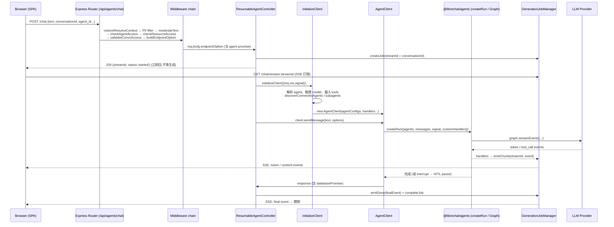

# 01. 整體架構總覽

> 本系列文件的讀者是準備用 **PostgreSQL + Hono + Next.js + pnpm + Redis + docker-compose** 從零打造 AI agent 平台的資深工程師。**AI agent 框架尚未定案**,四個候選:LangGraph / LangChain / deepagents / Vercel AI SDK(完整選型見 `19-framework-options.md`);其餘技術棧已定。LibreChat(MongoDB + Express + 自製 `@librechat/agents` + Vite/React)是我們的參考來源,不是要照抄的範本。本文負責「鳥瞰圖」:講清楚整個系統怎麼分層、一次 agent 聊天請求怎麼從 HTTP 走到 LLM 再串回瀏覽器、以及外部依賴與部署拓撲。各子系統的深入細節見後續文件。

---

## 定位

LibreChat 是一個「多供應商、多模型、可裝外掛工具」的 self-hosted ChatGPT 替代品。它要同時解決幾件事:

- **統一多個 LLM 供應商**(OpenAI / Anthropic / Google / Bedrock / 各種 custom endpoint)於單一聊天介面。
- **Agent 執行**:讓一則對話能呼叫工具(檔案搜尋、程式碼執行、MCP 工具、子 agent),並以 graph 形式編排多 agent。
- **企業級周邊**:認證(JWT / OAuth / LDAP / SAML)、權限(RBAC + ACL)、對話全文搜尋、檔案上傳與 RAG、多租戶隔離、計費與用量。

在整體架構中,本文描述的是**最外層的骨架**:一個 Express monolith(`/api`)作為 HTTP 入口與 orchestration 層,背後掛著一組 TypeScript packages(商業邏輯)、一個獨立的 agent runtime 套件(`@librechat/agents`,封裝 LangGraph),以及四個外部服務(MongoDB、Redis、MeiliSearch、RAG API)。前端是獨立的 Vite/React SPA,build 後由同一個 Express 靜態託管。

對我們的移植目標而言,這一層的價值不在它的實作(Express monolith + MongoDB 是包袱),而在它**踩過的坑**:resumable streaming、HITL(human-in-the-loop)pause/resume、abort 的競態、多 agent graph 的組裝順序。這些跟資料庫和框架無關,是 agent 平台的本質複雜度。

---

## 核心概念

在往下看流程之前,先建立幾個貫穿全系統的名詞與心智模型:

- **Workspace(monorepo 分層)**:`api`(JS legacy 後端)、`client`(React SPA)、`packages/*`(TypeScript,可共用)。npm workspaces 定義於 root `package.json:6-10`。
- **Endpoint**:一個「可聊天的目標」的抽象。可以是內建供應商(`openAI`、`anthropic`、`bedrock`…)、`agents`(持久化 agent)、或 `custom`(使用者自訂 base URL)。`EModelEndpoint` enum 定義在 `packages/data-provider`。
- **Agent**:一份持久化的設定(model、instructions、tools、tool_resources、子 agent 邊、能力旗標)。存在 MongoDB `agents` collection。**Ephemeral agent** 則是「沒有存檔的臨時 agent」:當使用者直接對某個 model endpoint 聊天時,後端動態組出一個 id 前綴為 ephemeral 的 agent(`build.js:11` 用 `Constants.EPHEMERAL_AGENT_ID`)。
- **Run / Graph**:一次 LLM 回合的執行單元。`@librechat/agents` 的 `createRun` 把一到多個 agent 組成一張 LangGraph 圖,`run.Graph` 是可 streamEvents 的執行體。
- **Generation Job**:把「一次生成」跟「HTTP 連線」解耦的核心抽象。`GenerationJobManager` 為每次請求建立一個 job(job id === conversationId === streamId),生成在背景跑,瀏覽器另外用 SSE 訂閱。這是 resumable streaming 的基礎,見 `14-streaming-resumability.md`(本文只描述它在整體流程中的位置)。
- **AppConfig(`req.config`)**:把 `librechat.yaml` + 環境變數 + 資料庫角色權限合併成的單一設定物件,經 middleware 掛到 `req.config`,幾乎每個 controller 都讀它。
- **HITL(human-in-the-loop)**:agent 執行到某個需要人工核准的工具時「暫停」,把 pending action 寫進 job metadata,等使用者按核准後透過 `/resume` 端點重建同一張 graph 繼續跑。

一個關鍵的心智模型:**`/api` 這層本身盡量薄**。專案的 `CLAUDE.md` 明文要求新後端邏輯寫在 `packages/api`(TypeScript),`/api` 只留 thin wrapper。實際上 `/api` 仍有大量歷史邏輯(controller、client),但方向是往 packages 遷移。

---

## 架構與流程

### monorepo 分層與依賴方向

```
┌──────────────────────────────────────────────────────────────────┐
│  client/  (Vite + React SPA, @librechat/frontend)                  │
│    └─ 依賴 packages/data-provider、packages/client                 │
└───────────────┬──────────────────────────────────────────────────┘
                │  HTTP / SSE  (build 後由 /api 靜態託管)
┌───────────────▼──────────────────────────────────────────────────┐
│  api/  (Express 5 monolith, JS legacy)                             │
│    server/index.js → routes → middleware → controllers → services │
│    依賴 ↓                                                          │
│  ┌────────────────────┬────────────────────┬───────────────────┐  │
│  │ packages/api (TS)  │ packages/           │ @librechat/agents │  │
│  │ 新後端邏輯:MCP、   │ data-schemas (TS)   │ (外部套件, 同團隊)│  │
│  │ stream、cache、    │ Mongoose models     │ LangGraph 封裝:   │  │
│  │ cluster、tools、   │ + methods           │ createRun / Graph │  │
│  │ agents、memory…    │                     │ streamEvents      │  │
│  └─────────┬──────────┴─────────┬──────────┴───────────────────┘  │
│            │                    │                                  │
│            ▼                    ▼                                  │
│      packages/data-provider (TS, 前後端共用)                      │
│        types / endpoints / schemas / data-service / keys          │
└───────────────────────────────────────────────────────────────────┘
```

依賴方向(嚴格單向,來源:root `package.json` workspaces + 各 package.json 的 `dependencies`,以及 `CLAUDE.md` 的 workspace 表):

| Workspace | 語言 | 職責 | 依賴 |
|---|---|---|---|
| `packages/data-provider` | TS | 前後端**共用**的型別、API endpoint 常數、zod schema、React Query keys、data-service | 無(最底層) |
| `packages/data-schemas` | TS | Mongoose schema / model / methods / migrations,可跨後端專案共用 | data-provider |
| `packages/api` | TS | **新後端邏輯**:MCP、resumable stream、cache/cluster、agents 組裝、memory、tools、middleware helpers | data-schemas、data-provider |
| `packages/client` | TS | 前端共用 React 元件與 utilities | data-provider |
| `api` | JS(legacy) | Express server、routes、controllers、既有 client 實作;呼叫上面三個 backend package | packages/api、data-schemas、data-provider、`@librechat/agents` |
| `client` | TS/React | 前端 SPA | data-provider、packages/client |

`@librechat/agents`(root `api/package.json` 依賴 `"^3.2.57"`)是**外部 npm 套件**但同團隊維護,封裝了 LangGraph 的 `createRun`、`Graph`、`createContentAggregator` 等。`/api` 直接 `require('@librechat/agents')`(見 `initialize.js:2`、`client.js:5`),它是整個 agent 執行的引擎。

> 移植提醒:這張依賴圖最值得學的是「**共用型別層在最底、資料庫層與 API 邏輯層分開**」。data-provider 同時被前端與後端 import,是單一真實來源(single source of truth)。我們用 Next.js + Hono 時,對應的作法是一個 `packages/shared`(zod schema + 型別 + endpoint 常數)被 web 與 api 同時吃。

### 伺服器啟動序列

`api/server/index.js` 的 `startServer()`(`index.js:88`)大致順序:

1. `connectDb()` 連 MongoDB(`index.js:97`),接著 `indexSync()` 背景同步 MeiliSearch 索引(fire-and-forget,`index.js:100`)。
2. `seedDatabase`、`getAppConfig({ baseOnly: true })`、初始化檔案儲存、部署 skills、啟動過期檔案清掃、`performStartupChecks`、`updateInterfacePermissions`(`index.js:114-130`)。這些都包在 `runAsSystem` 裡(繞過 tenant isolation 的系統上下文)。
3. **依序註冊 middleware**(`index.js:174-232`):metrics → noIndex → `express.json({ limit: '3mb' })` → mongoSanitize → cors → cookieParser → compression → 靜態資源 → passport → **`capabilityContextMiddleware`(per-request 能力快取,必須在任何用到 `hasCapability` 的 route 之前)**。
4. **掛載所有 route**(`index.js:236-278`),每條對應 `routes/index.js` 匯出的 router。
5. `configureGenerationStreams()`(`index.js:293` → `79`):建立 stream services(Redis 或 in-memory)並初始化 `GenerationJobManager`。
6. `app.listen`,在 listen callback 裡才做 `initializeMCPs()`、`initializeOAuthReconnectManager()`、`checkMigrations()`,全部成功後才把 `serverReady = true`(`index.js:328`)。

**Readiness gate 是這裡的一個關鍵設計**:`serverReady` 為 false 時,任何非 `/abort` 的 POST 都會被 `rejectChatStartsUntilReady`(`index.js:67-77`)擋下並回 503 + `Retry-After`。這條 middleware 只掛在 `/api/agents/chat`(`index.js:268`)。用意是:MCP 工具初始化很慢,server 可以先接受讀取類請求,但不讓聊天在工具還沒 ready 時啟動。`/health`、`/livez` 永遠 200,`/readyz` 綁 `serverReady`(`index.js:165-172`)—liveness 與 readiness 分離,給 k8s 用。

### 一次 agent 聊天請求的端到端生命週期

這是全文的核心。以「使用者送出一則訊息給某個 agent」為例(`POST /api/agents/chat` 或 `POST /api/agents/chat/:endpoint`):



逐步說明(檔案出處)：

1. **路由與 middleware chain**(`routes/agents/chat.js:74-80`):`/chat` 這條 router 依序套用 `restoreResumeContext`(只對 `/resume` 生效,把暫停回合的 graph 決定性設定 replay 回 `req.body`)、`createMessageFilterPii`、`moderateText`、`checkAgentAccess`(RBAC:`AGENTS` + `USE`)、`checkAgentResourceAccess`(ACL:agent 資源 `VIEW`)、`validateConvoAccess`、`buildEndpointOption`。上游還有 `routes/agents/index.js:50-52` 的 `requireJwtAuth`、`checkBan`、`uaParser`,以及 `chatRouter` 的 `configMiddleware` 與 rate limiter(`index.js:367-379`)。

2. **buildEndpointOption**(`middleware/buildEndpointOption.js`):把 compact 的 request body 解析成 `endpointOption`,並呼叫對應 endpoint 的 `buildOptions`。對 agents 而言是 `services/Endpoints/agents/build.js:9`,它**回傳一個 `agent` promise**(`loadAgent(...)`),把 DB 查詢延後、放進 `endpointOption.agent`。

3. **Controller 立即回應**:`ResumableAgentController`(`controllers/agents/request.js:189`)先 `checkAndIncrementPendingRequest`(併發上限,`request.js:221`),產生 `conversationId`(新對話用 `crypto.randomUUID()`,`request.js:231`),`createJob`(`request.js:245`),然後**立刻 `res.json({ streamId, conversationId, status:'started' })`**(`request.js:252`)。這是整個設計的樞紐:HTTP 請求在生成開始前就回覆了,瀏覽器拿到 streamId 後另開一條 SSE 連線訂閱。

4. **initializeClient**(`services/Endpoints/agents/initialize.js:113`):這是最重的一步。它:
   - 建 content aggregator、tool-end callback、event handlers(`initialize.js:138-299`)。
   - `await endpointOption.agent` 拿到 primary agent,`validateAgentModel` 驗證 model 權限(`initialize.js:305-318`)。
   - 用 `initializeAgent`(來自 `packages/api`)組出 `primaryConfig`:載入 tools(定義,event-driven mode)、tool_resources、skills、memory 能力等(`initialize.js:393`)。
   - `discoverConnectedAgents` 用 BFS 走 handoff 邊,組出多 agent graph 的 `agentConfigs` 與 `edges`(`initialize.js:443`)。
   - `resolveSubagentTrees` 遞迴載入子 agent,受 `MAX_SUBAGENT_DEPTH` / `MAX_SUBAGENT_GRAPH_NODES` 限制(`initialize.js:846-865`)。
   - 最後 `new AgentClient({...})`(`initialize.js:956`)並回傳 `{ client, userMCPAuthMap }`。

5. **背景生成 + streaming**:回到 controller,`startGeneration()`(`request.js:399`)呼叫 `client.sendMessage(text, messageOptions)`(`request.js:543`)。在 `AgentClient` 內部,`createRun`(`controllers/agents/client.js:1558`)把 agents 組成 graph,`run.Graph` 存進 job(`client.js:1604` `setGraph`),然後 `graph.streamEvents` 產生的 token / tool_call / content 事件,經由 event handlers 呼叫 `GenerationJobManager.emitChunk(streamId, event)`,由 SSE route(`routes/agents/index.js:66`)推給瀏覽器。

6. **HITL 分岔**:若工具需要核准,`AgentClient.handleRunInterrupt`(`client.js:1209`)把 pending action 寫進 job metadata、job 狀態轉 `requires_action`,controller 偵測到 `client.pendingApproval`(`request.js:567`)就把回合暫停(不寫 final、不 completeJob),交給 `/resume` 端點。resume 會重建**同一張 graph**(fingerprint 綁定,防止換 agent/工具),`run.resume(value)` 從 checkpoint 續跑(`client.js:1786` 附近)。

7. **收尾**:正常完成時 controller 先 `saveMessage`(user + response 都在發 final 事件**之前**寫進 DB,`request.js:691-706`,避免 client 收到 final 後立刻送 follow-up 造成 orphaned parentMessageId),再 `emitDone(finalEvent)`(`request.js:776`)、`completeJob`、`decrementPendingRequest`、`disposeClient`。標題生成可 immediate(與回應並行)或 final(等回應結束),由 `resolveTitleTiming` 決定(`request.js:374`)。

**這個「立即回 JSON + SSE 另訂閱 + job 背景執行」的三段式結構**,是 LibreChat 為了支援「關掉分頁後生成不中斷、重新連線可 resume、跨 replica 可續傳」而付出的複雜度代價。細節見 `14-streaming-resumability.md`(含 HITL 核准/恢復)。

### 外部依賴地圖

```
                          ┌─────────────┐
             Mongoose     │   MongoDB   │  主資料庫:users, conversations,
      ┌──────────────────▶│  (mongo:8)  │  messages, agents, files, acl…
      │                   └─────────────┘
      │                   ┌─────────────┐
      │   ioredis / keyv  │    Redis    │  快取、rate limit、job store(resumable
 ┌────┴────┐  (optional)  │  (optional) │  stream)、pub/sub、cluster leader election
 │ /api    │─────────────▶└─────────────┘
 │ Express │              ┌─────────────┐
 │ monolith│  MeiliSearch │ MeiliSearch │  對話 / 訊息全文搜尋索引
 │         │─────────────▶│  (v1.35)    │
 │         │              └─────────────┘
 │         │              ┌─────────────┐   ┌──────────────┐
 │         │  HTTP        │  RAG API    │──▶│  pgvector    │ 檔案 embedding
 │         │─────────────▶│ (Python)    │   │ (Postgres)   │ 與向量檢索
 │         │              └─────────────┘   └──────────────┘
 │         │              ┌─────────────┐
 │         │  HTTPS       │  Code API   │  沙箱程式碼執行(SaaS,execute_code
 │         │─────────────▶│(librechat.ai)│  能力用;非 docker-compose 內建)
 │         │              └─────────────┘
 │         │  require()   ┌──────────────────┐
 │         │─────────────▶│ @librechat/agents│  LangGraph agent runtime(in-process)
 └─────────┘              └──────────────────┘
```

- **MongoDB**(必要):主資料庫。schema 在 `packages/data-schemas/src/schema/`,model 在 `.../models/`(34 個 collection:`user`、`convo`、`message`、`agent`、`file`、`aclEntry`、`transaction`…)。連線在 `api/db/index.js`,注意 `createModels(mongoose)` **必須在** `require('./indexSync')` 之前跑,否則 MeiliSearch 同步會靜默失敗(`api/db/index.js:5-8` 有註解)。
- **Redis**(選用,強烈建議正式環境開):由 `USE_REDIS` 控制(`packages/api/src/cache/cacheConfig.ts:15`)。用於三大類:(a) 一般快取與 rate limit(透過 `keyv` / `ioredis`);(b) **resumable stream 的 job store 與 pub/sub**(`createStreamServices.ts:71`,由 `USE_REDIS_STREAMS` 控制,預設跟隨 `USE_REDIS`);(c) cluster 模式的 leader election(`packages/api/src/cluster/`)。沒開 Redis 時全部 fallback 到 in-memory(`createStreamServices.ts:119`),此時 resumable stream 只在單一 process 內有效。
- **MeiliSearch**(選用):全文搜尋。由 `SEARCH` 環境變數開關,`indexSync.js` 在啟動時背景同步。注意 `index.js:371-378` 的 uncaughtException handler 特別把 MeiliSearch 的 `fetch failed` 降級為 warn 並停用搜尋,不讓它拖垮整個 server。
- **RAG API**(選用):獨立的 Python 服務(docker image `librechat-rag-api-dev-lite`),背後接 `pgvector`(Postgres)。負責檔案上傳後的 embedding 與檢索。`/api` 透過 `RAG_API_URL` 以 HTTP 呼叫(`packages/api/src/files/rag.ts`、`api/server/services/Files/VectorDB/crud.js`)。**注意:LibreChat 的向量檢索是外包給獨立服務的,主 DB 仍是 MongoDB。**
- **Code API**(選用):沙箱程式碼執行,`execute_code` 能力用(`packages/api/src/tools/registry/definitions.ts`)。這是 LibreChat 官方的 SaaS(`api.librechat.ai`),不在 docker-compose 內,需 API key。
- **`@librechat/agents`**:in-process 的 npm 依賴,不是網路服務,但它是「LLM 供應商連線 + LangGraph 執行」的封裝,實質上是最重要的外部依賴。

### docker-compose 部署拓撲

`docker-compose.yml` 定義 6 個 service(注意檔頭警告「不要直接改這個檔,用 override」):

| Service | Image | 角色 | 依賴 |
|---|---|---|---|
| `api` | `librechat-dev:latest` | Express monolith + 靜態前端 | mongodb, rag_api |
| `admin-panel` | `librechat-admin-panel` | 獨立管理後台(Next 類) | api |
| `mongodb` | `mongo:8.0.20` | 主資料庫(`--noauth`) | — |
| `meilisearch` | `getmeili/meilisearch:v1.35.1` | 全文搜尋 | — |
| `vectordb` | `pgvector/pgvector:pg15` | RAG 的向量庫 | — |
| `rag_api` | `librechat-rag-api-dev-lite` | 檔案 embedding / 檢索 | vectordb |

觀察重點:

- **`api` 是單一容器同時服務前端(靜態)與後端 API**,前後端不分離部署。`ports: ${PORT}:${PORT}`(預設 3080)。
- **Redis 不在預設 compose 裡**——預設是 in-memory 快取與 stream。正式多副本部署才需要外掛 Redis(透過 override + `USE_REDIS=true`)。
- `NO_PROXY` 明確列出所有內部服務名(`docker-compose.yml:26,29`),避免內部呼叫走 proxy。
- `.env` 用 bind mount 進容器(`docker-compose.yml:31-33`),`images/` `uploads/` `logs/` `skill/` 都是 host 掛載卷,狀態不在容器內。
- MongoDB 用 `--noauth`(`docker-compose.yml:61`)——只適合信任的內網,正式環境必須改。

---

## 關鍵資料結構

以下是「整體流程」層級會反覆出現的幾個結構(各自的完整欄位見對應子系統文件)。

### `endpointOption`(request-scoped,由 buildOptions 產生)

`services/Endpoints/agents/build.js:22` 產生,掛在 `req.body.endpointOption`,是 controller 與 initializeClient 之間的契約。

| 欄位 | 型別 | 用途 |
|---|---|---|
| `endpoint` | `string` | 目標 endpoint(`agents` 或 ephemeral 的實際供應商) |
| `agent` | `Promise<Agent>` | 延後解析的 agent 文件;initializeClient 內 `await` 後 `delete` |
| `agent_id` | `string` | 持久化 agent id,或 `EPHEMERAL_AGENT_ID` |
| `spec` | `string?` | model spec 名稱(管理員預設的模型組合) |
| `model_parameters` | `object` | temperature / max tokens / model 等,由 rest spread 收集 |
| `iconURL` / `chatProjectId` | `string?` | UI 與多對話分組用 |
| `addedConvo` | `object?` | Multi-Convo 並行執行的第二個對話設定 |

### Generation Job(`GenerationJobManager` 管理)

job id === conversationId === streamId,是「生成」與「HTTP 連線」解耦的核心。metadata 由 controller 分階段寫入(`request.js:260`、`469`)。

| 欄位 | 型別 | 用途 |
|---|---|---|
| `streamId` / `conversationId` | `string` | 三位一體;abort / resume / SSE 都用它定位 |
| `userId` / `tenantId` | `string` | 授權檢查(SSE 訂閱、abort 都比對) |
| `status` | `'running' \| 'requires_action' \| 'completed'…` | HITL 暫停時為 `requires_action` |
| `createdAt` | `number` | **偵測 job 是否被新請求取代**(同一 conversationId 重送) |
| `metadata.userMessage` | `object` | 暫停 / abort 時重建 user 訊息的權威來源(含 files、skills) |
| `metadata.pendingAction` | `object?` | HITL 的待核准工具與 `resumeContext`(graph 決定性設定) |
| `abortController` | `AbortController` | `abortJob()` 觸發它來中止生成 |
| `emitter` | `EventEmitter` | `allSubscribersLeft` 事件觸發 partial 儲存 |

### AppConfig(`req.config`)

由 `getAppConfig`(`services/Config/app.js`)合併 yaml + env + DB 角色,經 `configMiddleware` 掛上。流程中被讀取的關鍵路徑:`req.config.endpoints.agents.capabilities`(能力旗標)、`.modelSpecs.list`、`.interfaceConfig`、`.memory`、`.summarization`。完整內容見 `02-config-system.md`。

---

## 關鍵實作細節與陷阱

- **`res.json` 早回 vs. 生成背景跑的競態**:controller 在生成開始前就回 200(`request.js:252`),之後所有錯誤都不能再用 HTTP status 表達,只能 `emitError` 進 SSE(`request.js:887`)。這是 resumable 設計的必然後果,任何「回應前的驗證」都必須在 `res.json` 之前完成。
- **job 被取代(job replacement)**:同一 conversationId 快速重送會建立新 job 並 bump `createdAt`。舊回合在多處都要檢查 `currentJob.createdAt !== jobCreatedAt`(`request.js:711`)才決定是否 emit / 存標題,否則舊回合會污染新回合的對話。這是「conversationId 當 job id」帶來的固有麻煩。
- **儲存順序**:user + response 訊息一定在 `emitDone` **之前** `saveMessage`(`request.js:691-706`),否則 client 收到 final 立刻送 follow-up 時,parentMessageId 還沒進 DB → orphaned 訊息。
- **HITL 暫停時的「標記 unfinished」競態**:回合暫停時要把已存的 response 標回 `unfinished`,但要先確認 job 仍停在**這一代**(`request.js:592-608`),否則快速 `/resume` 已經寫入完整回應時會被舊回合覆蓋。這段程式碼的註解密度反映了它有多容易出錯。
- **abort 的多來源**:abort 可能來自 SSE 連線關閉、`POST /chat/abort`(`routes/agents/index.js:236`)、或 server 端 signal。`/chat/abort` 甚至會在 job 找不到時 fallback 去查該 user 的 active jobs(`routes/agents/index.js:255-271`),因為前端可能還在送 `"new"` 佔位符。
- **`uncaughtException` 白名單降級**:`index.js:354-408` 把一堆「已知不可捕捉」的錯誤(GoogleGenerativeAI、MeiliSearch fetch failed、abort、`@librechat/agents` 內部錯)降級為 log 並繼續跑,只有其他情況才 `process.exit(1)`。這是 monolith 為了不因單一供應商 SDK 的 bug 而整個掛掉的權宜之計,但也意味著「server 還活著不代表功能正常」。
- **啟動 fail-fast vs. 執行期容錯的分裂**:`startServer().catch(() => process.exit(1))`(`index.js:348`)在 listen 前是 fail-fast;listen 後 callback 內的初始化失敗也 `process.exit(1)`(`index.js:333`);但 listen 後的執行期 `unhandledRejection` 卻只 log 不退出(`index.js:423`)。這個分裂是刻意的:半初始化的 process 該死掉重啟,但正在服務流量的 process 不該因一個 fire-and-forget 的 reject 崩潰。
- **Redis 是「軟性必要」**:沒 Redis 一切能跑,但 resumable stream 退化成單 process、多副本無法共享 job、cluster leader election 失效。這在 compose 預設關閉,是「開發簡單、正式要自己補」的取捨,移植時別誤以為 Redis 只是快取。
- **tenant isolation strict 模式**:`TENANT_ISOLATION_STRICT` 開啟後,未帶 tenant scope 的查詢會被拒(`index.js:107`),所以啟動期的系統操作要包 `runAsSystem`。`X-Tenant-Id` header 必須由 reverse proxy 設定,不能信任 client(`index.js:108-112` 的安全警告)。

---

## 設計決策分析

**為什麼是 Express monolith?** LibreChat 起於 2023 初,當時是單人專案快速迭代,monolith 讓「前端靜態 + API + agent orchestration」全在一個 process 內最簡單。代價是:`/api` 累積了大量 legacy JS,團隊現在得靠「新邏輯一律寫 TS packages」的紀律(`CLAUDE.md`)慢慢把肉從骨頭上剝下來。`request.js` 一個 controller 一千多行、註解比程式碼還密,就是這個歷史包袱的證據。

**為什麼把生成與 HTTP 連線解耦(Generation Job)?** 這是最有價值的架構決策。傳統作法是「一條 HTTP 長連線串到底」,但那樣關掉分頁 = 生成中斷、重連 = 從頭來、多副本 = 黏在某台機器。LibreChat 把生成變成一個有 id 的背景 job,HTTP 只負責啟動與訂閱,於是得到:關分頁不中斷、重連可 resume、Redis-backed 後跨副本可續傳、HITL 暫停可跨 session。缺點是複雜度爆炸(job replacement、儲存順序、abort 多來源、暫停競態),以及需要一個一致性的 job store。

**為什麼 MongoDB + 外包 pgvector?** 主資料是文件導向(對話樹、agent 設定、動態 message content parts),MongoDB 的無 schema 彈性很合;但向量檢索 MongoDB 早期不擅長,於是外包給獨立的 RAG API + pgvector。結果是**兩套資料庫**——這對維運是負擔。

**若重做會怎麼選?**(這正是我們移植目標的立場)

- **關聯式資料庫(PostgreSQL)取代 MongoDB**:對話樹、訊息、agent、ACL 其實高度關聯,用 pg 的外鍵 + JSONB(存 content parts 這種半結構化)反而更好維護,而且 pgvector 讓向量檢索回到同一個 DB,砍掉獨立 RAG service。LibreChat 的「MongoDB + 外包 pgvector」是歷史演化的結果,不是最佳設計。
- **Hono 取代 Express**:更薄、原生 TS、Web 標準 `Request/Response`、edge-ready。但要注意 LibreChat 大量依賴 Express 的 `res.write` streaming 與 middleware 生態,移植時 SSE 得改用 Web Streams。
- **保留「生成/連線解耦」的核心思想**:不管框架怎麼換,resumable job + SSE 訂閱這一層值得照抄概念(用 Redis Streams 或 pg + LISTEN/NOTIFY 實作 job store)。
- **AI 框架仍待定案(取代自製 `@librechat/agents`)**:四個候選各有取捨(LangGraph / LangChain / deepagents / Vercel AI SDK)。關鍵不對稱是 `@librechat/agents` 本身就是 LangGraph 封裝——若選 LangGraph 系(含 LangChain 的 `createAgent`、deepagents),LibreChat 的 graph 編排、checkpoint、interrupt 等做法可高度直接參考;若選 Vercel AI SDK(輕量 `streamText` / `stopWhen` agent loop),單 agent 一回合很省事,但多 agent graph、HITL、checkpoint 等較多能力要自建。完整比較見 `19-framework-options.md`。

---

## 移植到新技術棧的建議

> 技術棧中 PostgreSQL / Hono / Next.js / pnpm / Redis / docker-compose 已定案;**AI agent 框架尚未定案**(候選 LangGraph / LangChain / deepagents / Vercel AI SDK),故以下涉及框架的段落以「條件式對照」呈現,完整選型與 13 項能力矩陣見 `19-framework-options.md`。

### PostgreSQL schema 草案(對應 MongoDB collections)

LibreChat 的 34 個 collection,核心關聯用 pg 這樣起手(僅示意,詳見各子系統文件):

```sql
-- 使用者
CREATE TABLE users (
  id           UUID PRIMARY KEY DEFAULT gen_random_uuid(),
  email        CITEXT UNIQUE NOT NULL,
  role         TEXT NOT NULL DEFAULT 'user',
  tenant_id    UUID,                         -- 多租戶隔離
  created_at   TIMESTAMPTZ NOT NULL DEFAULT now()
);

-- 對話(conversationId 同時是 stream/job id)
CREATE TABLE conversations (
  id           UUID PRIMARY KEY DEFAULT gen_random_uuid(),
  user_id      UUID NOT NULL REFERENCES users(id) ON DELETE CASCADE,
  title        TEXT,
  endpoint     TEXT NOT NULL,
  agent_id     UUID REFERENCES agents(id),
  is_temporary BOOLEAN NOT NULL DEFAULT false,
  created_at   TIMESTAMPTZ NOT NULL DEFAULT now(),
  updated_at   TIMESTAMPTZ NOT NULL DEFAULT now()
);

-- 訊息:對話樹用 parent_message_id 自我參照;content parts 用 JSONB
CREATE TABLE messages (
  id                 UUID PRIMARY KEY DEFAULT gen_random_uuid(),
  conversation_id    UUID NOT NULL REFERENCES conversations(id) ON DELETE CASCADE,
  parent_message_id  UUID REFERENCES messages(id),
  is_created_by_user BOOLEAN NOT NULL,
  sender             TEXT,
  text               TEXT,
  content            JSONB,                  -- streaming content parts / tool calls
  unfinished         BOOLEAN NOT NULL DEFAULT false,
  metadata           JSONB,                  -- usage/cost、thoughtSignatures…
  created_at         TIMESTAMPTZ NOT NULL DEFAULT now()
);
CREATE INDEX ON messages (conversation_id, parent_message_id);

-- Agent 設定
CREATE TABLE agents (
  id             UUID PRIMARY KEY DEFAULT gen_random_uuid(),
  author_id      UUID NOT NULL REFERENCES users(id),
  name           TEXT,
  provider       TEXT NOT NULL,
  model          TEXT NOT NULL,
  instructions   TEXT,
  tools          JSONB,                      -- 工具名陣列 + 能力旗標
  tool_resources JSONB,
  edges          JSONB,                      -- 多 agent handoff 邊
  subagents      JSONB,
  created_at     TIMESTAMPTZ NOT NULL DEFAULT now()
);

-- ACL(取代 aclEntry collection):resource + principal + bitmask 權限
CREATE TABLE acl_entries (
  id             BIGSERIAL PRIMARY KEY,
  resource_type  TEXT NOT NULL,              -- 'agent' | 'skill' | 'prompt'…
  resource_id    UUID NOT NULL,
  principal_type TEXT NOT NULL,              -- 'user' | 'group' | 'role' | 'public'
  principal_id   UUID,
  permission_bits INT NOT NULL,              -- VIEW/EDIT/… 位元遮罩
  UNIQUE (resource_type, resource_id, principal_type, principal_id)
);
```

向量檢索直接用 pgvector 加一張 `document_chunks(embedding vector(1536), ...)`,砍掉獨立 RAG API。權限系統(RBAC + ACL bitmask)見 `16-permissions-sharing.md`。

### Hono route / middleware 對應

LibreChat 的 middleware chain 可幾乎一對一搬到 Hono:

```ts
// Express: app.use('/api/agents/chat', rejectChatStartsUntilReady) → routes.agents
const chat = new Hono();

chat.use('*', requireJwtAuth);         // passport-jwt → hono/jwt 或自訂
chat.use('*', checkBan, rateLimiter);  // 對應 checkBan + messageUserLimiter
chat.use('*', configMiddleware);       // 掛 c.set('config', appConfig)
chat.post('/', piiFilter, moderate, checkAgentAccess, buildEndpointOption, controller);

// readiness gate（對應 rejectChatStartsUntilReady）
app.use('/api/agents/chat', async (c, next) => {
  if (!serverReady && c.req.method === 'POST') {
    c.header('Retry-After', '1');
    return c.json({ code: 'SERVER_NOT_READY' }, 503);
  }
  await next();
});
```

Hono 的 `c.set/c.get` 取代 Express 的 `req.config` / `req.body.endpointOption` 掛載。SSE 用 Hono 的 `streamSSE` helper(對應 `routes/agents/index.js:66` 的手寫 `text/event-stream`)。

### AI 框架對應(四候選,見 `19-framework-options.md`)

框架尚未定案。關鍵不對稱:`@librechat/agents` 本身就是 LangGraph 封裝——選 LangGraph 系(含 LangChain 的 `createAgent`、deepagents)時 LibreChat 的做法可高度直接參考;選 Vercel AI SDK 時較多能力要自建。下表把 LibreChat 的核心概念對應到四個候選(完整 13 項能力矩陣與取捨討論見 `19-framework-options.md`):

| LibreChat / `@librechat/agents` | LangGraph | LangChain(`createAgent`) | deepagents | Vercel AI SDK |
|---|---|---|---|---|
| agent loop + 步數上限(`createRun` + recursionLimit) | 自建 StateGraph + recursionLimit(LibreChat 現制) | 內建 tool loop,底層同 recursionLimit | `createDeepAgent` 預組好完整 loop | `streamText`/`ToolLoopAgent` + `stopWhen: stepCountIs(N)` |
| 多 agent handoff / subagent graph | 原生:任意拓撲、subgraph、conditional edges(LibreChat edges 即此) | 單 agent 為主,多代理需下探 LangGraph | subagent 委派內建,圖狀 handoff 仍要下探 LangGraph | 無圖原語,需自建 orchestrator(handoff-as-tool + 外層 loop) |
| HITL pause/resume(工具核准) | `interrupt()` + `Command({resume})` + checkpointer | `humanInTheLoopMiddleware` 開箱 | `interruptOn` 參數開箱(底層即 LangGraph) | v7 tool approvals / WorkflowAgent;或無-execute tool + PG 自建(最透明) |
| checkpoint 持久化(Postgres/Redis) | 官方 `@langchain/langgraph-checkpoint-postgres` / `-redis` | 同 LangGraph | 同 LangGraph | 無 checkpointer;messages 陣列即狀態自存 PG |
| tool 定義 + `ON_TOOL_EXECUTE` | `@langchain/*` tool + `@langchain/mcp-adapters` | 同左 | 同左 | `tool({ description, inputSchema, execute })`(zod)+ `createMCPClient` |
| content aggregator / streaming | 六種 streamMode + streamEvents + subgraph namespace | `streamEvents({version:'v3'})` | 同 LangGraph | `fullStream` parts + UIMessage stream 協定(前端協定最完整) |
| token 用量 / cost | `usage_metadata`(含 cache 細目) | 同左 | 同左 | per-step usage + `totalUsage` |

不論選哪個框架,以下三塊都與框架相對獨立,正是 LibreChat 這些檔案值得研究的地方:(a)resumable job 層(我們自己的 job store + SSE);(b)HITL 攔截與 resume 的競態處理;(c)跨副本的可恢復串流。差別在於:選 LangGraph 系時 (b)(c) 可借力 checkpointer / `interrupt`(甚至照抄 LibreChat 的 graph fingerprint + resume);選 Vercel AI SDK 時這幾塊多半要自建(官方 `resumable-stream` 套件粒度較粗,status/active 查詢仍要自建)。

### Redis 的用途對照

| LibreChat 用途 | 我們的對應 | 對應 env |
|---|---|---|
| 一般快取 / rate limit(keyv) | Redis(或 pg + 短 TTL) | `USE_REDIS` |
| resumable stream job store + pub/sub | **Redis Streams / pub-sub**(核心) | `USE_REDIS_STREAMS` |
| cluster leader election | Redis 鎖 / Redlock | — |

我們的技術棧預設就有 Redis,建議**一開始就把 job store 建在 Redis 上**(用 Redis Streams 做事件重播 + pub/sub 做即時推送),不要走 LibreChat「先 in-memory 再補 Redis」的路——那會讓 resumable 邏輯寫兩套。

### Next.js 前端考量

LibreChat 前端是 Vite SPA,build 後由 Express 靜態託管(`index.js:132-163` 讀 `index.html` 再動態改 `base href` / `lang`)。移到 Next.js:

- **SSE 訂閱**:前端對 `/chat/stream/:streamId` 開 `EventSource`(或 `fetch` + `ReadableStream`)。這在 Next.js Client Component 用 hook 封裝即可,跟 SPA 無異。
- **不要把 agent 生成放進 Next.js API route / Server Action**:生成是長時間背景 job,應該在獨立的 Hono API server(或 worker)跑,Next.js 只負責 UI 與 BFF 轉發。這保留 LibreChat「生成與請求解耦」的精神。
- **共用型別**:對應 `packages/data-provider`,建一個 `packages/shared` 放 zod schema + 型別,Next.js 與 Hono 同時 import。
- **React Query**:LibreChat 用 `@tanstack/react-query`(`CLAUDE.md` 前端規則),這點可直接沿用,query key / mutation key 集中管理。
- **重新整理後 resume**:LibreChat 有 `GET /chat/active`、`GET /chat/status/:conversationId`(`routes/agents/index.js:173,187`)讓前端重載後找回進行中的生成並續訂閱。這個「重載可續看」的 UX 值得照抄,前端進對話頁時先打 status 再決定是否重連 SSE。

---

## 延伸閱讀

- Agent 資料模型與 CRUD → 見 `03-agent-data-model.md`
- AppConfig(yaml + env + DB 合併)→ 見 `02-config-system.md`
- 認證與 session → 見 `17-auth-security.md`
- 權限(RBAC + ACL)→ 見 `16-permissions-sharing.md`
- AI 框架選型(LangGraph / LangChain / deepagents / Vercel AI SDK 完整比較)→ 見 `19-framework-options.md`
- Agent 組裝與執行引擎 → 見 `04-execution-engine.md`
- 多 agent graph / subagent → 見 `05-multi-agent.md`
- 工具系統 → 見 `07-tool-system.md`;MCP → 見 `08-mcp-integration.md`
- Resumable streaming(GenerationJobManager 深入)與 HITL 核准 / resume → 見 `14-streaming-resumability.md`
</content>
</invoke>
