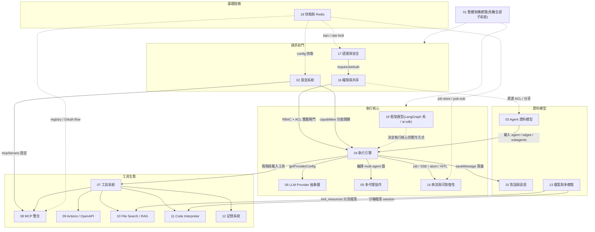

# 總覽與導讀

## 這套文件的目的

這是一套針對 **LibreChat** 原始碼的深度架構解析文件(共 19 份),目標讀者是要用以下技術棧**從零重建 AI agent 平台**的工程師:

> **PostgreSQL + Hono + Next.js + pnpm + Redis + docker-compose**
> **AI agent 框架尚未定案**,四個候選:LangGraph / LangChain / deepagents / Vercel AI SDK — 完整選型對照見 [19-framework-options.md](./19-framework-options.md)。

一個對選型影響重大的事實:LibreChat 的執行引擎 `@librechat/agents` 本身就是 **LangGraph 封裝**——選 LangGraph 系(含 LangChain/deepagents)時,本系列 04/05/14 的做法是「程式碼級參考」可近乎照搬;選 ai-sdk 時多代理圖、HITL 週邊需自建,但各文件的移植建議章節已是設計藍圖。

每份文件不是 LibreChat 的使用手冊,而是回答三個問題:

1. **它怎麼運作**:子系統的完整資料流與控制流,所有關鍵論述附原始碼出處(`檔案:行號`)。
2. **它為什麼這樣設計**:哪些是深思熟慮的取捨、哪些是遷就 MongoDB/Express/無 Redis 環境長出的歷史包袱。
3. **移植時該怎麼取捨**:哪些模式值得照搬(附 PostgreSQL DDL 草案、Hono middleware 對應、四個候選框架的能力對照),哪些複雜度在新技術棧下可以直接砍掉。

每份文件結構一致:`定位 → 核心概念 → 架構與流程 → 關鍵資料結構 → 關鍵實作細節與陷阱 → 設計決策分析 → 移植到新技術棧的建議`。

---

## 各文件一句話導覽

> 完整目錄與章節連結見側邊欄(index.md);下表補充每份文件的重點摘要。

| 編號 | 文件 | 一句話說明 |
|---|---|---|
| 01 | [整體架構總覽](./01-architecture-overview.md) | Monorepo 六 workspace 單向依賴、Express 啟動序列、一次 agent 請求的端到端生命週期、外部依賴地圖與部署拓撲 |
| 02 | [設定系統](./02-config-system.md) | librechat.yaml 的 Zod 驗證、AppService 純函式組裝 AppConfig、MongoDB 動態覆寫層的 priority deep-merge 與多層快取 |
| 03 | [Agent 資料模型](./03-agent-data-model.md) | Agent schema 全欄位、雙 ID 設計、內嵌 versions 版本機制、ephemeral agent 合成、多租戶隔離與 CRUD API |
| 04 | [執行引擎](./04-execution-engine.md) | 一個回合的完整執行鏈:GenerationJob 建立 → AgentClient 初始化 → LangGraph 圖執行 → 事件聚合 → token 計費與落盤 |
| 05 | [多代理協作](./05-multi-agent.md) | edges 有向圖(handoff/direct/condition)、subagents 隔離 spawn、deprecated sequential chain、BFS 發掘與孤兒修剪 |
| 06 | [LLM Provider 抽象層](./06-llm-providers.md) | endpoint/provider/model 三層語意、模型參數轉換、admin 與 user 金鑰管理、模型清單快取與 titling 次要模型 |
| 07 | [工具系統](./07-tool-system.md) | 四類工具(native/plugin/actions/MCP)統一抽象、兩階段載入(definition vs instance)、憑證解析、deferred tools |
| 08 | [MCP 整合](./08-mcp-integration.md) | MCP server 三層信任來源與生命週期、OAuth flow、app/user/ephemeral 連線 scope、`_mcp_` 命名協定與 SSRF 防護 |
| 09 | [Actions(OpenAPI 工具)](./09-actions-openapi.md) | 貼 OpenAPI spec 即成工具、domain 編碼歷史包袱、metadata 加密、三層 SSRF、OAuth 掛起-恢復 |
| 10 | [File Search / RAG](./10-file-search-rag.md) | 委外 Python RAG API + pgvector、embed 上傳管線、每檔並行查詢與 distance 排序、citations 錨點機制 |
| 11 | [Code Interpreter 沙箱](./11-code-interpreter.md) | 委外 codeapi 沙箱微服務、檔案 session 新鮮度檢查、產出檔原子認領、短效 JWT 認證橋接 |
| 12 | [記憶系統](./12-memory-system.md) | 跨對話 key-value 事實庫(非向量)、inline 工具與背景 memory agent 雙寫入路徑、四層權限閘門與 token 額度 |
| 13 | [檔案與多模態](./13-files-multimodal.md) | 儲存策略模式(local/S3/Azure/OCR/vectordb)、sharp 圖片處理三階段、tool_resources 分流、兩層 TTL 刪除 |
| 14 | [串流與可恢復性](./14-streaming-resumability.md) | 生成與 HTTP 連線解耦、GenerationJobManager 雙模式、斷線重連 replay、abort 保存部分回應、HITL 完整生命週期 |
| 15 | [對話與訊息模型](./15-conversations-messages.md) | parentMessageId 隱式訊息樹與兩套重建演算法、edit/regenerate 分支語意、fork/匯入匯出、MeiliSearch 旁路索引 |
| 16 | [權限與共享](./16-permissions-sharing.md) | 兩層權限:RBAC 功能開關 × 資源層 ACL 位元旗標,AND 疊加;分享流程、市集、people picker、群組同步 |
| 17 | [認證與安全](./17-auth-security.md) | 10 種 Passport 策略、access/refresh token 兩層設計、手寫 TOTP 2FA、violation→ban、rate limit 與內容過濾 |
| 18 | [快取與 Redis](./18-caching-redis.md) | getLogStores 統一入口、四種快取建構器、雙 Redis client、Lua CAS 模式、cluster-safe 操作與維運工具 |
| 19 | [AI 框架選型對照](./19-framework-options.md) | LangGraph / LangChain / deepagents / Vercel AI SDK 四候選:能力對照矩陣、與 LibreChat 架構的距離、組合可能性與選型決策樹 |

---

## 建議閱讀順序

### 先讀核心(掌握主幹,約六份)

1. **01 整體架構總覽** — 建立全局地圖,理解「生成與 HTTP 連線解耦」這個貫穿全系統的核心設計。
2. **19 AI 框架選型對照** — 讀 04 之前先掌握四個候選框架的能力邊界,後續文件的框架條件式陳述才有脈絡。
3. **04 執行引擎** — 最重要的一條路徑:一個回合怎麼跑完。所有其他子系統都掛在這條主幹上。
4. **14 串流與可恢復性** — 04 的孿生篇:job store、SSE 訂閱、斷線重連、abort、HITL。job store 這層各框架都要自建;HITL/checkpoint 在 LangGraph 系原生、ai-sdk 需自建。
5. **07 工具系統** — 工具生態的總綱,08/09/10/11/12 都是它的分支。
6. **03 Agent 資料模型** + **15 對話與訊息模型** — 兩大持久化模型,決定 PostgreSQL schema 設計。

### 按需深入

- **平台基礎**:02(設定)、17(認證)、16(權限)、18(Redis)— 做骨架與安全層時讀。
- **工具各論**:08(MCP)、09(Actions)、10(RAG)、11(Code Interpreter)、12(記憶)、13(檔案)— 實作到對應工具時讀。
- **進階編排**:05(多代理)、06(LLM Provider)— 單 agent 跑通後再讀。
- **框架選型**:19 — 決定執行核心用哪個框架前必讀;定案後回頭重讀 04/05/14 對應框架的條件式建議。

---

## 整體架構一頁圖

閱讀方式:實線是「一次請求的資料流」,虛線是「橫切支撐關係」。中央主幹是 **17 → 16 → 04 → 14**(認證 → 授權 → 執行 → 串流),工具生態與資料模型分別掛在 04 的兩側,18(Redis)托住所有需要跨副本狀態的子系統。

---

## 技術棧對應速查表

| LibreChat 元件 | 新專案對應 | 核心差異 / 建議 | 最相關文件 |
|---|---|---|---|
| MongoDB(34 collections) | PostgreSQL(JSONB + 遞迴 CTE + RLS) | 訊息樹用遞迴 CTE 取代手刻演算法;半結構化欄位進 JSONB;租戶隔離用 RLS 取代 ORM plugin | 03, 15, 16 |
| Express monolith(`/api` legacy JS) | Hono | middleware 幾乎一對一對應;生成放獨立 API server,不塞進 Next.js | 01, 02, 17 |
| `@librechat/agents`(LangGraph 封裝) | 候選框架四選一(見 **19**) | **LangGraph 系**(LangGraph/LangChain/deepagents):圖編排、interrupt/HITL、PostgresSaver checkpoint 皆原生,LibreChat 做法可近乎照搬;**ai-sdk**:單 agent loop 用 `stopWhen: stepCountIs(N)`、HITL 用無 `execute` 的 tool 中斷,多 agent 圖需自建 | 19, 04, 05, 14, 07 |
| Vite/React SPA + 同容器託管 | Next.js(僅 UI/BFF) | 生成與 SSE 由獨立 Hono server 承載,Next.js 不碰長連線 | 01, 14 |
| keyv 多後端 + `getLogStores` | 單一 Redis client library | 砍掉雙 client(ioredis + @keyv/redis)與記憶體 fallback;高頻短 TTL 資料只進 Redis 不進 PG | 18, 02 |
| GenerationJobManager(InMemory/Redis 雙模式,streamId === conversationId) | Redis Streams 單模式 job store,獨立 jobId | 從第一天就只做 Redis 模式;獨立 jobId 消滅六處世代比對 guard、解鎖同對話並發 | 14, 04, 01 |
| Passport.js 10 種策略 | Hono middleware + 自組 OAuth | 保留 access(無狀態)/refresh(可撤銷 session)分離與 domain allowlist 兩階段檢查;砍掉 OpenID 三層 token 儲存 | 17 |
| 獨立 Python RAG API + vectordb 容器 | 主庫 pgvector + AI SDK `embedMany` | RAG 收回單體,一句 `ORDER BY embedding <=> $q` SQL 取代每檔一次 query | 10 |
| MeiliSearch 旁路索引(旗標 + 全量掃描) | Postgres FTS 或 CDC/outbox 驅動的搜尋 | 「布林旗標 + 定期兜底掃描」是盡力而為,不要照抄 | 15 |
| codeapi 沙箱微服務 | **保留**委外沙箱架構 | 認證從第一天統一短效 JWT;session 狀態用閉包取代 Graph.sessions | 11 |
| Mongoose tenantIsolation plugin(AsyncLocalStorage 隱式注入) | PG RLS + 顯式 `tenant_id` 參數 | 隱式 context 是移植要避開的坑 | 03, 16 |
| Action domain base64 編碼 + 反查表 | UUID 工具名(`operationId::action_id`) | 新棧無 Azure 工具名長度限制,整套編碼碰撞複雜度直接砍掉 | 09, 07 |
| Cosmos 相容的 permBits 超集列舉 | `(perm_bits & required) = required` | PG 原生位元運算,砍掉整層 workaround | 16 |
| express-rate-limit(無 Redis 時退化為 per-instance) | Redis-backed 限流,**無 fallback** | 記憶體 fallback 在多副本下形同虛設 | 17, 18 |
| npm workspaces + Turborepo | pnpm workspace | 依賴方向沿用:shared types → schema → backend → app | 01 |
| docker-compose 六服務 | docker-compose(pg + redis + app + 沙箱) | vectordb/rag_api/meilisearch 三容器被 pgvector + FTS 收斂掉 | 01, 10 |

---

## 重建路線圖

依賴關係決定順序:**資料與身分先行 → 單 agent 生成鏈打通 → 工具逐個掛上 → 多代理與營運收尾**。

### 階段 0:骨架(無前置依賴)

- pnpm monorepo、docker-compose(PostgreSQL + Redis)、Hono app 與 Next.js UI 骨架。
- 設定系統:YAML + Zod strict 驗證 + 純組裝函式,DB 覆寫層可延後。 → **02**
- **AI 框架選型**:讀 **19** 做決策(要不要多代理圖?HITL 多重?輕量 vs 全家桶?),最晚在階段 2 開工前定案。

### 階段 1:身分與資料底座

- 認證:access/refresh 分離、refresh session 落 PG、domain allowlist。 → **17**
- 資料模型:conversations/messages(遞迴 CTE 樹)、agents(含 versions 表)。 → **15, 03**
- 權限:兩層 RBAC × ACL、owner-as-ACL-entry、`bit_or` 聚合。 → **16**

### 階段 2:核心生成鏈(最關鍵,先做單 agent)

- Provider 層:依框架選型——ai-sdk 用 `@ai-sdk/*` provider registry;LangGraph 系用 `ChatXxx` 類;皆搭配宣告式模型能力/價格表。 → **06, 19**
- 執行引擎:依框架選型——LangGraph 系參考 LibreChat 的 `createRun`/`processStream` 模式;ai-sdk 用 `streamText` + `stopWhen` + parts 聚合。token 計費共通(單一 PG 交易寫 transactions + balance)。 → **04, 19**
- 可恢復串流:**從第一天就用 Redis Streams job store**(POST 回 jobId + SSE 訂閱 + replay),不要做 InMemory 雙模式。 → **14, 18**

### 階段 3:工具生態(依賴階段 2)

- 工具註冊表 + capabilities 閘門(集中宣告,不要散落 if-else)。 → **07**
- 檔案子系統(策略模式 + 兩階段刪除排程) → RAG(pgvector) → Code Interpreter(委外沙箱)。 → **13, 10, 11**
- 記憶系統(key-value + 背景 agent)。 → **12**
- MCP(ai-sdk 的 `createMCPClient` 或 LangChain mcp adapters,連線治理都要自建)、Actions(UUID 工具名 + 三層 SSRF + OAuth 掛起-恢復)。 → **08, 09**

### 階段 4:進階編排與營運

- HITL pause/resume:LangGraph 系用原生 `interrupt`/`Command` + PostgresSaver;ai-sdk 用無 `execute` 的 tool 當中斷點、messages 陣列存 PG 即 checkpoint,`UPDATE...RETURNING` 做 CAS 認領。 → **14, 19**
- 多代理:LangGraph 系用原生 subgraph/handoff;ai-sdk 用 handoff-as-tool + 程式層編排;deepagents 內建 subagents。關聯表下沉約束到 DB。 → **05, 19**
- 分享/市集、moderation/ban、快取調優與維運工具。 → **16, 17, 18**

### 貫穿全程的三個原則(全系列文件的共同結論)

1. **生成是有 id 的背景 job,HTTP 只負責啟動與訂閱** — 這是 LibreChat 最值得照抄的核心思想(01, 04, 14)。
2. **所有狀態轉移用原子 CAS**(Redis Lua 或 PG `UPDATE...RETURNING`),不要樂觀比對(14, 18)。
3. **歷史包袱不搬**:雙模式 fallback、domain 編碼、Cosmos workaround、隱式租戶 context——理解其動機後在新棧用更直接的手段解決(各文件「移植建議」章節)。
