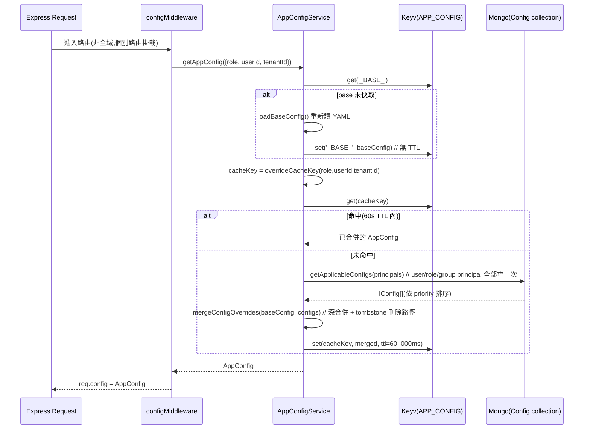

# 02. 設定系統

## 定位

LibreChat 是一個「單一部署可服務多種 LLM provider、多種功能開關、甚至多租戶差異化」的平台。這一切都收斂到一個問題:**執行期任何一段程式碼想知道「這個功能現在該不該開」「這個 endpoint 該用什麼 apiKey/baseURL」時,答案從哪裡來?**

設定系統就是回答這個問題的子系統。它做三件事:

1. **載入與驗證**:把 `librechat.yaml`(或遠端 URL、或 DB 覆寫)讀進來,用 Zod schema 驗證、補預設值,產出型別安全的物件。
2. **組裝**:把 YAML 結果、環境變數、系統工具清單、DB 覆寫等多來源資料,合併成單一的 `AppConfig` 物件——這是整個後端執行期查詢設定的唯一入口。
3. **快取與失效**:`AppConfig` 的組裝有成本(讀檔、驗證、DB 查詢),所以要快取;但設定會被 admin 面板修改,所以要有失效機制。

在整體架構中,設定系統的位置大致是:

```
啟動流程 ──► 設定系統 ──► Express 路由 / Agent 執行引擎 / 工具載入器
              ▲
              │ admin 面板寫入 DB 覆寫後觸發失效
```

它不處理「使用者可不可以用某個功能」這種 RBAC 問題(那是角色/權限系統,見 16-permissions-sharing.md),但它處理「這個部署有沒有打開某個功能的開關」——兩者常被誤認為同一件事,實務上必須分清楚(見下方陷阱)。

---

## 核心概念

| 名詞 | 說明 |
|---|---|
| `librechat.yaml` | 部署層級的宣告式設定檔,對應到 `TCustomConfig`(Zod 推導出的 TS 型別)。是「設計時」設定的唯一真實來源。 |
| `configSchema` | 定義在 `packages/data-provider/src/config.ts:1814`,是 `librechat.yaml` 的頂層 Zod schema,`.strict()` 模式驗證,多一個未知欄位就整份拒收。 |
| `AppService` | `packages/data-schemas/src/app/service.ts:109`,把驗證過的 YAML 物件 + 環境變數 + 系統工具清單「組裝」成 `AppConfig`。是 YAML → 執行期物件的轉換層。 |
| `AppConfig` | `packages/data-schemas/src/types/app.ts:48`,後端到處傳遞、查詢的單一設定物件。等同於「這次請求該用的完整設定快照」。 |
| `AppConfigService` | `packages/api/src/app/service.ts:94` 的 factory,提供 `getAppConfig()`/`clearAppConfigCache()`/`clearOverrideCache()`,是 `AppConfig` 的**快取與多租戶合併層**,包在 `AppService` 外面。 |
| DB 覆寫(`Config` collection) | 存在 MongoDB 的 `Config` document,型別是 `IConfig`(`packages/data-schemas/src/types/config.ts:10`)。讓 admin 可以「在 YAML 之上」針對特定 user/role/group/tenant 疊加差異化設定,不需要改檔案重啟。 |
| `AgentCapabilities` | `packages/data-provider/src/config.ts:562`,agents endpoint 的**功能開關**列舉(如 `execute_code`、`web_search`、`ocr`)。決定一個 agent 可以掛哪些「類別」的工具。 |
| `SystemCapabilities` | 定義在 `@librechat/data-schemas`,是**RBAC 權限**列舉(如 `MANAGE_CONFIGS`、`ACCESS_ADMIN`)。決定「使用者」能不能做某個管理動作。跟 `AgentCapabilities` 名字很像但完全是两回事,見「關鍵陷阱」。 |
| `TStartupConfig` / `TEndpointsConfig` | 前端消費的「瘦身版」設定,由 `GET /api/config`、`GET /api/endpoints` 提供,是 `AppConfig` 的過濾/整形結果,絕不會把完整 `AppConfig`(含 apiKey 等機密)直接吐給前端。 |

---

## 架構與流程

### 1. 啟動時:YAML → AppConfig(base)

```
process 啟動 (api/server/index.js)
  │
  ├─ getAppConfig({ baseOnly: true })                      // api/server/index.js:122
  │    │
  │    ▼
  │  AppConfigService.ensureBaseConfig()                    // packages/api/src/app/service.ts:129
  │    │  cache miss?
  │    ▼
  │  loadBaseConfig()                                       // api/server/services/Config/app.js:11
  │    ├─ loadCustomConfig()                                 // api/server/services/Config/loadCustomConfig.js:69
  │    │    ├─ 讀 CONFIG_PATH(檔案路徑 or http(s):// URL)或預設 librechat.yaml
  │    │    ├─ js-yaml 解析
  │    │    ├─ configSchema.strict().safeParse(...)          // 驗證失敗 → process.exit(1)(除非 CONFIG_BYPASS_VALIDATION=true)
  │    │    └─ addOpenRouterDefaults / parseCustomParams      // 針對 custom endpoints 的後製
  │    ├─ loadAndFormatTools(...)                             // 掃描系統內建工具清單
  │    └─ AppService({ config, paths, systemTools })          // packages/data-schemas/src/app/service.ts:109
  │         ├─ loadOCRConfig / loadWebSearchConfig / loadMemoryConfig / loadSummarizationConfig ...
  │         ├─ loadDefaultInterface(...)                       // interface 開關 + 預設值合併
  │         ├─ loadEndpoints(...)                              // 逐一組裝各 endpoint 設定
  │         └─ agentsConfigSetup(...)                          // capabilities 預設值等
  │    ▼
  │  AppConfig 物件(未含 DB 覆寫)
  │    ▼
  └─ cache.set('_BASE_', appConfig)   // Keyv namespace = CacheKeys.APP_CONFIG,無 TTL,永久快取直到手動失效
```

`AppService` 是**純函式風格**的組裝器:輸入 `DeepPartial<TCustomConfig>`(已驗證的 YAML)+ paths + systemTools,輸出 `AppConfig`。它不做 I/O(不讀檔、不查 DB),所有 I/O 由呼叫端(`loadCustomConfig`)先完成。這個切分讓 `AppService` 可以在單元測試中直接傳 mock 物件測試(`AppService.spec.ts`)。

### 2. 每次請求:base + DB 覆寫的合併與快取

這是本系統最有意思、也最容易被忽略的一層——一個**疊加在靜態 YAML 之上的動態多租戶覆寫層**:



關鍵函式:
- `overrideCacheKey`(`packages/api/src/app/service.ts:75`):快取鍵格式 `_OVERRIDE_:{tenant}:{role}:{userId}`,依有無 role/userId 有四種組合,沒有任何 principal 時退回 `_OVERRIDE_:{tenant}:_BASE_`。
- `mergeConfigOverrides`(`packages/data-schemas/src/app/resolution.ts:187`):把多筆 `IConfig`(不同 principal:role/user/group,可能同時命中)依 `priority` 升冪排序,逐筆 deep-merge 進 `baseConfig`。**後面(priority 高)贏**,也就是「更具體的設定覆蓋較泛用的設定」——例如 role 層設定先套用,user 層設定後套用並覆蓋掉衝突欄位。
- `configMiddleware`(`api/server/middleware/config/app.js:4`)**不是全域中介層**,是個別路由(`conversations`、`agents`、`assistants`、`files`、`memories`、`share`…)自行掛載的。這代表:不是每個 request 都保證有 `req.config`,寫新路由若用到設定要記得自己掛。

### 3. Admin 修改設定 → 快取失效

```
PUT /api/admin/configs/:principalType/:principalId          // api/server/routes/admin/config.js
  → requireCapability(SystemCapabilities.MANAGE_CONFIGS)      // RBAC 檢查,見核心概念表格
  → db.upsertConfig(...)                                       // 寫入 Mongo Config collection,configVersion++
  → invalidateConfigCaches(tenantId)                           // api/server/services/Config/app.js:38
       ├─ clearAppConfigCache()      // 清 '_BASE_'(YAML 若同時被改也一併重載)
       ├─ clearOverrideCache(tenantId) // 清該租戶所有 '_OVERRIDE_:*' key(僅限可列舉 key 的 store)
       ├─ invalidateCachedTools({invalidateGlobal:true})
       └─ clearMcpConfigCache()
```

### 4. Endpoints 設定的正規化(給前端消費)

`AppConfig.endpoints` 是「執行期用」的形狀(每個 provider 一把 key,裡面是完整設定含 apiKey 環境變數參照)。前端不需要、也不該拿到這份原始資料,所以有一層轉換:

```
createEndpointsConfigService.getEndpointsConfig(req)          // packages/api/src/endpoints/config/endpoints.ts:27
  ├─ loadDefaultEndpointsConfig(appConfig)                     // 內建 provider(openAI/anthropic/google/bedrock/azure/assistants/agents)
  │     依 ENDPOINTS 環境變數(getEnabledEndpoints, packages/data-provider/src/parsers.ts:76)過濾/排序
  ├─ loadCustomEndpointsConfig(appConfig.endpoints.custom)     // custom endpoints 陣列 → { [name]: {...} }
  ├─ 逐一補上 userProvide / disableBuilder / capabilities / availableRegions 等前端要用的欄位
  └─ orderEndpointsConfig(...)                                 // 依設定順序回傳
```

`GET /api/config`(`api/server/routes/config.js:206`)則是另一份更「瘦」的清單:登入前只給 social login 開關、註冊開關、LDAP/SAML/OIDC 是否啟用等;登入後才給 `interface`、`modelSpecs`、`balance`、`webSearch` 摘要等。**登入前後回傳的欄位刻意分成三個 builder 函式**(`buildPreLoginPayload` / `buildPublicSharePayload` / `buildPostLoginPayload`),避免未登入使用者拿到不該看的欄位。

### 5. Capabilities 如何 gate 功能(以 agents 工具載入為例)

`AgentCapabilities` 不是「這個 agent 掛了哪些工具」,是「這個部署允許哪些**類別**的工具存在」。真正決定一個 agent 能用哪些工具,是兩層過濾的交集:

```
agent.tools[]  (Agent document 上持久化的工具 id 清單,使用者在 UI 勾選)
        ×
resolveAgentCapabilities(req, appConfig, agentId)        // api/server/services/ToolService.js:166
   1. 先看 endpointsConfig.agents.capabilities(admin 在 librechat.yaml / DB 覆寫設的允許清單)
   2. 若為空且是 ephemeral agent(isEphemeralAgentId) → 退回 appConfig.endpoints.agents.capabilities
      ?? defaultAgentCapabilities(套件硬編碼預設,packages/data-provider/src/config.ts:679)
        ▼
   Set<AgentCapabilities>
        ▼
filteredTools = agent.tools.filter(tool => {
   Tools.file_search  → capabilities.has(AgentCapabilities.file_search)
   Tools.execute_code → capabilities.has(AgentCapabilities.execute_code)
   Tools.web_search   → capabilities.has(AgentCapabilities.web_search)
   Tools.memory       → capabilities.has(AgentCapabilities.memory)
   isActionTool(tool) → capabilities.has(AgentCapabilities.actions)
   MCP tool           → capabilities.has(AgentCapabilities.tools) && 使用者有權限用該 MCP server
   一般 function tool  → capabilities.has(AgentCapabilities.tools)
})
```

（`api/server/services/ToolService.js:542` `loadToolDefinitionsWrapper`,同樣模式在 `openai.js`/`responses.js`/`client.js`/`Endpoints/agents/initialize.js`/`Files/process.js` 重複出現多次——這是一個分散在多個 controller 的 ad-hoc 檢查模式,而不是單一集中的「工具註冊表 + 所需 capability」宣告,見設計決策分析。）

---

## 關鍵資料結構

### `AppConfig`(`packages/data-schemas/src/types/app.ts:48`,節錄)

| 欄位 | 型別 | 用途 |
|---|---|---|
| `config` | `Partial<TCustomConfig>` | 原始已驗證的 YAML(逃生艙,少數地方需要「未加工」版本) |
| `endpoints` | 物件,每個 endpoint 一個 key | 各 provider 的完整設定(apiKey 佔位符、baseURL、models、capabilities…) |
| `interfaceConfig` | `TCustomConfig['interface']` | UI 功能開關(部分欄位同時是 RBAC 權限欄位,見陷阱) |
| `registration` | `TCustomConfig['registration']` | social login 清單、允許的 email domain |
| `fileConfig` | `TFileConfig` | 檔案大小/數量/MIME 白名單,單位為 bytes(YAML 寫 MB) |
| `mcpConfig` / `mcpSettings` | `TCustomConfig['mcpServers']` / 網域白名單 | MCP server 清單與存取限制 |
| `balance` / `transactions` | 額度/交易紀錄開關 | 見 `getBalanceConfig`,`transactions.enabled=false` 但 `balance.enabled=true` 時會被強制修正並記警告(`packages/api/src/app/config.ts:43`) |
| `modelSpecs` | `TCustomConfig['modelSpecs']` | model preset 清單,可 `prioritize`/`enforce`,與 `interface.presets`/`modelSelect` 有已知衝突(見 `checkInterfaceConfig`) |
| `availableTools` | `Record<string, FunctionTool>` | 系統內建工具清單(掃描 `structuredTools` 目錄產生,非使用者定義) |
| `secureImageLinks` / `cloudfront` | — | 圖片簽章/CDN 相關 |

### `IConfig`(DB 覆寫文件,`packages/data-schemas/src/types/config.ts:10`)

| 欄位 | 型別 | 用途 |
|---|---|---|
| `principalType` | `PrincipalType`(user/role/group) | 這筆覆寫套用給誰 |
| `principalId` | `ObjectId \| string` | user/group 用 ObjectId,role 用字串(如 `ADMIN`) |
| `priority` | `number` | 合併順序,數字大者後套用、贏過先套用者 |
| `overrides` | `Partial<TCustomConfig>` | **YAML 格式**的部分覆寫(不是 `AppConfig` 格式,合併時要經 `OVERRIDE_KEY_MAP` 轉譯欄位名) |
| `tombstones` | `string[]` | dot-path 清單,合併時先「刪除」這些路徑,常用來清除 base 設的某個布林/陣列而不留殘值 |
| `isActive` | `boolean` | 停用但不刪除,方便暫時關閉某筆覆寫 |
| `configVersion` | `number` | 每次寫入遞增,用於除錯/稽核,不直接驅動快取失效(快取失效靠顯式呼叫) |
| `tenantId` | `string?` | 多租戶隔離,搭配 Mongoose tenant-isolation plugin 在查詢層自動加條件 |

### `agentsEndpointSchema`(`packages/data-provider/src/config.ts:843`)

| 欄位 | 型別 | 預設 | 用途 |
|---|---|---|---|
| `capabilities` | `AgentCapabilities[]` | `defaultAgentCapabilities`(14 項,`config.ts:679`) | 功能開關白名單,見上方流程 5 |
| `disableBuilder` | `boolean` | `false` | 關閉「建立/編輯 agent」UI |
| `allowedProviders` | `(string \| EModelEndpoint)[]?` | — | 限制 agent 底層可用的 LLM provider |
| `maxCitations` / `maxCitationsPerFile` / `minRelevanceScore` | `number` | 30 / 7 / 0.45 | file_search 引用檢索的上限與門檻 |
| `toolApproval` | `toolApprovalPolicySchema` | 關閉 | Human-in-the-loop 工具核准策略 |
| `checkpointer` | `checkpointerSchema` | — | HITL 用的持久化 checkpoint 後端(預設走內建 Mongo) |

### `fileConfigSchema`(`packages/data-provider/src/file-config.ts:477`)

| 欄位 | 型別 | 用途 |
|---|---|---|
| `endpoints[name]` | `{disabled, fileLimit, fileSizeLimit, totalSizeLimit, supportedMimeTypes}` | 逐 endpoint 覆寫檔案限制,YAML 單位是 **MB**,`mergeFileConfig`(`file-config.ts:665`)在合併時用 `mbToBytes` 轉為 bytes |
| `serverFileSizeLimit` | `number` | 全站上傳大小硬上限 |
| `imageGeneration` | `{percentage, px}` | 生圖工具輸出的縮圖策略 |
| `clientImageResize` | `{enabled, maxWidth, maxHeight, quality}` | 前端上傳前壓縮參數 |

### Cache 命名空間對應表(`api/cache/getLogStores.js`)

| CacheKeys | 儲存內容 | TTL | 備註 |
|---|---|---|---|
| `APP_CONFIG` | `_BASE_` 與 `_OVERRIDE_:*` 兩類 key | base 無 TTL;override 60s(可調) | `standardCache`,有 Redis 用 Redis,否則記憶體內單例 Map |
| `TOOL_CACHE` | 系統工具清單(全域)、每人每 MCP server 工具清單 | 12 小時 | admin 改設定後 `invalidateCachedTools({invalidateGlobal:true})` 主動清 |
| `CONFIG_STORE` | 其他雜項設定快取 | 依用途 | — |
| `ROLES` | 角色/權限快取 | — | 屬於 RBAC 子系統,非本文件範圍 |

---

## 關鍵實作細節與陷阱

1. **`configSchema.strict()` 會整份拒收**(`packages/data-provider/src/config.ts:1814` + `loadCustomConfig.js:112`):`librechat.yaml` 裡任何一個 AI 幫你多打或改版留下的過期欄位,都會讓**整個檔案**驗證失敗、預設走 `process.exit(1)`。可用 `CONFIG_BYPASS_VALIDATION=true` 繞過,但繞過後是直接回傳 `null`、後續全部吃 `AppService` 的內建預設值——**不是「忽略壞欄位、其餘照用」,而是「整份 YAML 視同不存在」**,這是最容易誤解、以為只是那個欄位沒生效的地方。

2. **base config 沒有 TTL,只能顯式清除**(`packages/api/src/app/service.ts:143`)。改了 `librechat.yaml` 檔案本身,行程不會自動重載,必須重啟或呼叫 `clearAppConfigCache()`(目前僅 admin 覆寫寫入時的 `invalidateConfigCaches` 會呼叫)。純改 YAML、不透過 admin API 的傳統部署方式,**唯一保證生效的方法是重啟服務**。

3. **override 快取的失效依賴「可列舉 key 的 store」**(`packages/api/src/app/service.ts:233`):`clearOverrideCache` 用 `store.opts.store.keys()` 列出所有 `_OVERRIDE_:*` key 逐一刪除。這在記憶體內 Keyv 完全沒問題,但若把 `APP_CONFIG` 設成走 Redis(且不在 `FORCED_IN_MEMORY_CACHE_NAMESPACES`),程式**刻意不做 Redis SCAN**(註解直接引用 issue #12410,SCAN 在高併發下可能卡 60 秒以上),此時 override 只能「等 60 秒 TTL 自然過期」。也就是說:**Redis 化的 APP_CONFIG namespace 會讓 admin 修改後最多延遲一個 TTL 週期才生效**,這是效能與即時性的刻意取捨,不是 bug。

4. **Deep merge 有防護但不是萬能**(`packages/data-schemas/src/app/resolution.ts`):`MAX_MERGE_DEPTH = 10` 防止惡意深巢狀 payload 拖垮效能;`UNSAFE_KEYS`(`__proto__`/`constructor`/`prototype`)防原型污染。但陣列預設是「整體覆蓋」而非合併,只有 `ARRAY_MERGE_KEYS = { 'endpoints.custom': 'name' }` 這一條路徑走「依 key 合併」邏輯——例如 `modelSpecs.list` 這種陣列,DB 覆寫會直接整份取代 base 的清單,而不是逐項合併。新增一個需要「按鍵合併」的陣列欄位,要記得把路徑加進 `ARRAY_MERGE_KEYS`,否則覆寫者必須每次重複整份陣列。

5. **`OVERRIDE_KEY_MAP` 是隱性契約**(`resolution.ts:38`):admin 覆寫寫入的 `overrides` 物件用的是 **YAML 層級**的欄位名(如 `interface`、`mcpServers`、`turnstile`),但合併目標是 `AppService` 處理過、部分欄位已改名的 `AppConfig`(`interfaceConfig`、`mcpConfig`、`turnstileConfig`)。這個映射表若沒有跟著 `AppService` 的欄位改名同步更新,結果是**覆寫被靜默忽略**(合併到一個 `AppConfig` 上不存在的舊 key,不會報錯,只是沒有任何效果)——沒有型別系統會在這裡救你,因為兩邊都是動態字串 key 的 object。

6. **`interface.*` 的權限型欄位在 DB 覆寫時被過濾掉**(`resolution.ts:211-247`,`INTERFACE_PERMISSION_FIELDS`/`PERMISSION_SUB_KEYS`):`interface` 底下一部分欄位(如各種布林權限開關)其實有另一條「真實來源」——獨立的角色/權限系統(`updateInterfacePermissions`,啟動時同步)。為避免兩個機制互相打架,`mergeConfigOverrides` 對 `interface` 段位做特殊處理:純布林權限欄位整個丟棄,複合欄位(如 `mcpServers`)只保留非權限的 UI-only 子欄位(如 `placeholder`)。這代表**用 admin config-override API 想覆寫某人的 interface 權限是無效的**,必須走角色/權限系統的 API。

7. **`AgentCapabilities` ≠ `SystemCapabilities`,一定要分清楚**:前者(`packages/data-provider/src/config.ts:562`)是「部署層級/租戶層級的功能開關」,決定 agent 能否掛某類工具(`execute_code`/`web_search`/`ocr`…),由 `librechat.yaml` 或 DB 覆寫的 `endpoints.agents.capabilities` 陣列控制,檢查方式是 `Set.has()`。後者(`@librechat/data-schemas` 的 `SystemCapabilities`)是「使用者層級的 RBAC 權限」,決定使用者能不能執行管理動作(`MANAGE_CONFIGS`/`ACCESS_ADMIN`…),透過 `requireCapability`/`hasCapability` 中介層檢查,背後查的是完全不同的資料表。兩者命名幾乎一樣("capability"),在程式碼搜尋時很容易誤植。

8. **capability 檢查邏輯分散在多個檔案、多次重寫**(`ToolService.js`、`openai.js`、`responses.js`、`client.js`、`Endpoints/agents/initialize.js`、`Files/process.js`):並沒有一個「工具註冊表,每個工具宣告自己需要哪個 capability」的集中宣告,而是每個工具載入/檔案處理路徑各自寫一段 `checkCapability(AgentCapabilities.xxx)` 的 if-else。新增一種工具類型時,容易漏掉某一條路徑的 gating(例如只在 `ToolService.js` 加了檢查,忘了 `Files/process.js` 對應的上傳前檢查)。

9. **env 變數有兩種讀取時機,容易誤判「改了怎麼沒生效」**:像 `EndpointService.js`(`api/server/services/Config/EndpointService.js`)是 **module load 時**一次性讀 `process.env` 並算出 `config` 物件,之後全程序共用、不會再讀;而很多地方是 `isEnabled(process.env.X)` **每次呼叫時**讀。前者改 `.env` 一定要重啟才生效,後者理論上「重啟就好」也一樣(Node 不會 live-reload `.env`),但兩者在測試/熱重載場景下行為差異很大,寫測試時要注意 module 快取。

10. **`allowedAddresses`(SSRF 白名單)的 schema 驗證只是 UX 防呆,不是安全邊界本身**(`packages/data-provider/src/config.ts:154`):Zod refine 只能擋「明顯錯誤格式」與「公開 IP 字面量」,對主機名(hostname)一律放行,因為主機名解析到什麼 IP 要等執行期 DNS 查詢才知道。真正的安全檢查在執行期的 `resolveHostnameSSRF`(`@librechat/api`),YAML 層的 schema 檢查是「開發者少打錯字」的第一道防線,兩邊邏輯必須保持同步(註解裡明講「Mirrors ... Keep the two implementations in sync」)。

---

## 設計決策分析

**1. 為什麼是「YAML 檔 + Zod schema」而不是全部丟 DB 或全部環境變數?**

`librechat.yaml` 承載的多是「結構性、跨請求不變」的設定(有哪些 endpoint、每個 endpoint 的 baseURL/apiKey 環境變數參照、有哪些工具類別開放)。這類設定適合宣告式、可版本控制(git diff 就能 code review)、可搭配 GitOps 流程部署。Zod schema 讓「驗證規則」與「TypeScript 型別」共用同一份定義,`configSchema` 用 `z.infer` 直接產出 `TCustomConfig`,避免手寫 interface 與執行期驗證各自維護、彼此漂移。

代價:YAML 天生不擅長「依租戶/依角色差異化」——總不能每個客戶一份 `librechat.yaml`。這正是他們在 YAML 之上又疊了一層 `Config` collection(DB 覆寫)的原因:**靜態結構留在 YAML,動態/差異化的部分留在 DB**,兩層各司其職而不是硬把全部塞進其中一種儲存。如果重新設計,這個「兩層」的分工本身是合理的,值得保留;但目前的實作(deepMerge + OVERRIDE_KEY_MAP 字串映射)屬於「先求能動,再補丁補正確性」的痕跡明顯——如果重做,會優先把 base 與 override 定義在**同一份 schema**上(而不是 YAML 用一套欄位名、AppConfig 用另一套),消除第 5 點陷阱提到的隱性映射表。

**2. 為什麼載入失敗要 `process.exit(1)` 而不是「忽略錯誤欄位、繼續用其餘設定」?**

這是刻意的 fail-fast 選擇:一個安全或計費相關的設定(例如 `balance`、`allowedAddresses`)如果驗證失敗卻靜默忽略,後果可能是「以為限制生效了,其實整組防護沒套用」。讓服務直接掛掉、逼運維正視錯誤,比「帶著不完整設定悄悄啟動」更安全。代價是必須提供 `CONFIG_BYPASS_VALIDATION` 逃生艙應付緊急情況(如第三方託管的 YAML 暫時抓取失敗),但逃生艙的語意是「整份視為不存在」而非「部分套用」,這個選擇偏保守、但一致。

**3. 為什麼 override 快取選擇「顯式失效 + 短 TTL 雙保險」,而不是純粹的檔案 watch 或純粹的 TTL 輪詢?**

純 TTL 輪詢(比如都設 60 秒過期)實作最簡單,但代表 admin 改了設定後使用者最多要等 60 秒,體驗不好;純檔案 watch/事件驅動能做到「改了立刻生效」,但需要額外的通知機制(尤其多副本部署時,不能只通知當前行程)。目前的做法是兩者混合:base config 靠顯式呼叫達到「幾乎立即生效」,per-principal override 用短 TTL 保底(萬一顯式失效因為 Redis 不可列舉 key 而失敗,60 秒後總會收斂)。如果重做且預算允許上 Redis pub/sub 或版本號機制,可以把 TTL 從「兜底」提升為「主要機制的一部分」,達到多副本環境下更一致的失效體驗(見移植建議)。

**4. 為什麼 capability 檢查是「散落各處的 if-else」而不是「工具註冊表 + 宣告式所需權限」?**

推測是歷史演進的結果:工具類型(file_search/execute_code/web_search/actions/mcp/…)本來彼此差異就不小(有的是純 function tool,有的需要額外的檔案校驗,有的需要 MCP 權限上下文),很難用單一宣告式規則覆蓋所有分支的時機與上下文。缺點已在陷阱第 8 點說明——新增工具類型時容易漏 gate。若重做,值得抽出一個「工具元資料表」`Map<ToolId, { requiredCapability: AgentCapabilities }>`,把「要不要檢查」這件事宣告化,但檢查發生的「時機」(工具載入 vs 檔案上傳前 vs 串流執行中)仍需各自處理,宣告表能減少的是「忘記檢查」而非「檢查邏輯重複」。

---

## 移植到新技術棧的建議

目標棧:**PostgreSQL + Hono + Next.js + pnpm + Redis + docker-compose**。AI 框架尚未定案,候選為 **LangGraph**、**LangChain**(1.x `createAgent`)、**deepagents**、**Vercel AI SDK**,四者對本文件涉及的能力(provider 抽象、tool gate、HITL/checkpointer、多代理委派)落差不小,完整比較見 19-framework-options.md;以下逐項僅在框架選擇會影響設計時才分框架標註。

### 1. 靜態設定(base config)

- 用一份 YAML 或 JSON(建議 YAML,方便加註解)作為部署層設定,啟動時用 **Zod** 驗證(`z.object({...}).strict()`),做法與 `configSchema` 完全一致——這一層不需要因為換了技術棧而改變思路,Zod 本身就是最佳選擇,直接把 `packages/data-provider/src/config.ts` 的 schema 設計思路(`.strict()`、`.default()`、`getSchemaDefaults` 取預設值)搬過去即可。
- 用一個純函式(對應 `AppService`)把「驗證過的 YAML + 環境變數 + 內建工具清單」組裝成一個 `AppConfig` 等價物,**不要在這個函式裡做 I/O**,方便單元測試直接灌 mock 輸入。

### 2. 多租戶/多角色覆寫(DB 層)——PostgreSQL DDL 草案

```sql
CREATE TABLE app_config_overrides (
  id            UUID PRIMARY KEY DEFAULT gen_random_uuid(),
  tenant_id     UUID NOT NULL,
  principal_type TEXT NOT NULL CHECK (principal_type IN ('user','role','group')),
  principal_id  TEXT NOT NULL,           -- role 用字串代碼,user/group 用其 id 的文字表示
  priority      INTEGER NOT NULL DEFAULT 0,
  overrides     JSONB NOT NULL DEFAULT '{}',   -- 與 base YAML 同一份 schema 的部分子集
  tombstones    TEXT[] NOT NULL DEFAULT '{}',  -- dot-path,合併前先刪除
  is_active     BOOLEAN NOT NULL DEFAULT true,
  config_version INTEGER NOT NULL DEFAULT 1,
  created_at    TIMESTAMPTZ NOT NULL DEFAULT now(),
  updated_at    TIMESTAMPTZ NOT NULL DEFAULT now(),
  UNIQUE (tenant_id, principal_type, principal_id)
);
CREATE INDEX idx_app_config_overrides_lookup
  ON app_config_overrides (tenant_id, principal_type, principal_id)
  WHERE is_active;
```

比 Mongo 版本多得到的好處:`overrides JSONB` 一樣能存任意結構,但可以額外用 `JSONB` 運算子/GIN index 做「哪些 tenant 覆寫了某個欄位」這類稽核查詢,Mongo 版本目前沒有這類索引。**deep-merge 演算法(依 priority 排序、逐層合併、tombstone 優先刪除)不會因為換成 Postgres 而變簡單**——這是純應用層邏輯,`packages/data-schemas/src/app/resolution.ts` 的演算法可以近乎原樣移植(語言從 TS 到 TS,只是資料源從 Mongo 查詢換成 SQL 查詢)。

### 3. Hono 對應

- `configMiddleware` 對應 Hono middleware:`app.use('/api/conversations/*', configMiddleware)` 這種按路徑掛載,而非全域 `app.use('*', ...)`——沿用 LibreChat「只在需要的路由掛」的做法,避免每個 request 都付出一次設定合併/快取查詢成本。
- 用 Hono 的 `Variables` 泛型宣告 `c.set('appConfig', appConfig)` / `c.get('appConfig')`,取代 `req.config`,型別在編譯期就能保證存在(比 Express 的 `req.config` 靠 JSDoc 註解更安全)。
- `GET /api/config`、`GET /api/endpoints` 這類「瘦身給前端」的 route,直接用 Hono route handler + Zod 驗證 response shape(可用 `@hono/zod-validator` 之類做輸出端 schema 斷言,減少「意外把 apiKey 吐給前端」的風險——這正是 LibreChat 現有程式碼刻意手動挑欄位組裝 `payload` 的目的,用 schema 白名單取代手動挑欄位更不容易漏)。

### 4. AI 框架對應(框架未定案,依候選逐項標註)

框架尚未選定,以下三點按「跟 AppConfig 組裝相關的能力」分別說明四個候選(LangGraph / LangChain / deepagents / Vercel AI SDK)的落差;完整能力矩陣見 19-framework-options.md,此處只摘要與設定系統直接相關的部分。

- **Custom endpoints(`endpoints.custom` 陣列)對應 provider 抽象**:若落在 LangGraph 系(LangGraph、LangChain 的 `createAgent`、deepagents 皆共用 `@langchain/*` provider 套件生態,與 LibreChat 現制同款,LangChain 另有 `anthropic:claude-sonnet-4-6` 這類 model 字串速記),`resolveProvider(appConfig, endpointName)` 的組裝邏輯可近乎直接沿用 `loadCustomEndpointsConfig`(`packages/api/src/endpoints/custom/config.ts:10`),只是最後回傳給框架的 model 物件形狀不同。若落在 Vercel AI SDK,則對應改為呼叫 provider 工廠函式:`createOpenAI({ baseURL, apiKey, headers })` / `createAnthropic({...})`,回傳一個可直接丟給 `streamText({ model })` 的 provider 實例;AI SDK 的官方 provider 矩陣是四者中最廣的。無論選哪個,「從 `AppConfig` 找到該 endpoint 設定、解析 `${ENV_VAR}` 占位符」這段輸入邏輯都相同,差異只在輸出物件。
- **`AgentCapabilities` 的 gate 邏輯**:這一步的本質是「組 tools 參數」,不屬於任何框架的執行期鉤子,四個候選做法一致——寫一個 `resolveEnabledTools(appConfig, agentRecord)`,對應 `loadToolDefinitionsWrapper`,在呼叫框架的 agent 執行入口之前,依 capability 白名單過濾掉不該出現的工具定義。差異只在回傳型別:LangGraph/LangChain/deepagents 是供 `bindTools`/`createAgent` 使用的 tool 陣列,Vercel AI SDK 則是供 `streamText`/`Agent` 使用的 `ToolSet` 物件。**gate 的位置永遠是「組 tool registry」那一刻**,不因框架而變。
- **HITL/`toolApproval`/`checkpointer`**:四個候選在這裡的落差最大,選擇會直接決定這部分要自建多少:

  | | LangGraph | LangChain | deepagents | Vercel AI SDK |
  |---|---|---|---|---|
  | interrupt/resume | `interrupt()` + `Command({resume})` + checkpointer,跨 process/replica resume(LibreChat 現制即此) | `humanInTheLoopMiddleware` 開箱 | `interruptOn` 參數開箱,底層即 LangGraph interrupt | v7 tool approvals(policy 級)+ `WorkflowAgent` durable resume;或無-execute tool + Postgres 存 messages 自建(最透明) |
  | checkpoint 持久化 | 官方 `@langchain/langgraph-checkpoint-postgres`(`PostgresSaver`)/ `-redis`(`RedisSaver`) | 同 LangGraph | 同 LangGraph | 無 checkpointer;messages 陣列即狀態,自存 Postgres 最透明;`WorkflowAgent` 另有 durable storage 抽象 |

  若選 LangGraph 系(含 LangChain/deepagents),`agentsEndpointSchema` 的 `toolApproval`/`checkpointer` 兩個欄位(見「關鍵資料結構」)與 LibreChat 現有的 checkpointer 組裝邏輯可高度直接參考。若選 Vercel AI SDK,則需要自己把「待核准的 tool call」序列化進 Postgres(一張 `pending_tool_approvals` 表),下一次請求帶著已核准的結果重新組 messages 陣列續跑——這是四者中唯一沒有跨 process/replica checkpointer 對應物、需要完全自建持久化中斷點機制的候選。

### 5. Redis 的用途

- **對應 `APP_CONFIG` namespace**:把「合併後的 per-tenant/per-role AppConfig」快取進 Redis,key 設計沿用 `tenant:{id}:role:{role}:user:{id}` 的組合模式,TTL 60 秒是合理起點。
- **解決 LibreChat 未解決的多副本一致性問題(陷阱 3)**:與其完全依賴 TTL,建議額外維護一支 `config:version:{tenantId}` 的 Redis key,admin 寫入覆寫時 `INCR` 它;每個 process 的本地快取(若你還想在 process 內再加一層 L1 cache 省 Redis 往返)在讀取前先比對這個版本號,版本不符就強制回源——這比 LibreChat 目前「Redis 模式下只能等 TTL」的做法更即時,且不需要 SCAN(直接用一支輕量 `GET` 就能判斷是否過期)。
- **工具清單快取**(對應 `TOOL_CACHE`):把組好的工具 JSON Schema 定義快取進 Redis,TTL 可以拉長(LibreChat 用 12 小時),因為工具定義變動頻率遠低於一般設定。

### 6. Next.js 前端考量

- LibreChat 的 `/api/config` 之所以要存在,是因為前端是 **client-side SPA(Vite/React)**,必須靠一次 fetch 拿到啟動設定再渲染。換成 **Next.js App Router**,登入前的靜態設定(social login 開關、隱私政策連結等)可以直接在 **Server Component / root layout** 內於伺服器端讀 `AppConfig` 並渲染,完全不需要一個對外的 REST endpoint,也不會有「白畫面等 fetch」的問題。
- 登入後才需要的、隨 session 變動的欄位(balance、per-user capability),仍建議保留一支輕量的 `/api/config` Route Handler(或直接用 Server Action),對應 LibreChat `buildPostLoginPayload` 的角色——這部分無法在 build time 決定,必須是 request-time 的伺服器端渲染或客戶端 fetch。
- 不需要複製 LibreChat「登入前/登入後/分享頁三種 payload 手動拼欄位」的模式;在 Next.js 可以用**同一個 Zod schema 定義三種角色各自的欄位子集**(`preLoginConfigSchema.pick({...})` 之類),讓「哪些欄位在哪個情境下可見」變成型別檢查得到的宣告,而不是分散在三個手寫函式裡靠 code review 把關(這是 LibreChat 現有做法中,若重做會優先改進的地方)。

### 7. 沒有直接對應、需要注意的部分

- **MongoDB 無 schema 特性 → Postgres `JSONB`**:兩者都能存任意巢狀結構,`overrides` 欄位改用 `JSONB` 是直覺的一對一替換,但 deep-merge/tombstone 演算法仍要在應用層手刻,資料庫本身不提供「依 priority 合併多筆 JSON」的原生能力——這點兩種資料庫都一樣,不是 Postgres 的劣勢,只是提醒不要預期換資料庫就能省掉這段邏輯。
- **`@librechat/agents` 的 `recursionLimit`/多輪工具呼叫遞迴上限與多代理委派**:若選 LangGraph(含 LangChain 的 `createAgent`、deepagents 的 `createDeepAgent`),`recursionLimit` 與 subgraph/conditional edges 的多代理拓撲可近乎直接沿用 LibreChat 現制,deepagents 更內建 subagent 委派(`task` 工具,隔離 context 回傳單一報告)。若選 Vercel AI SDK,`stopWhen: stepCountIs(N)`(預設 20)+ `prepareStep` 提供類似但更輕量的單一 agent 步數控制,語意上大致對應,但 AI SDK 沒有原生的「多 agent 圖狀委派/handoff」概念,LibreChat 跨多個 agent 互相委派(subagents capability)計算遞迴限制的做法需要自行在應用層以 handoff-as-tool + 外層 loop(`prepareStep` 可做輕量版)重建。四個候選的完整落差見 19-framework-options.md。
