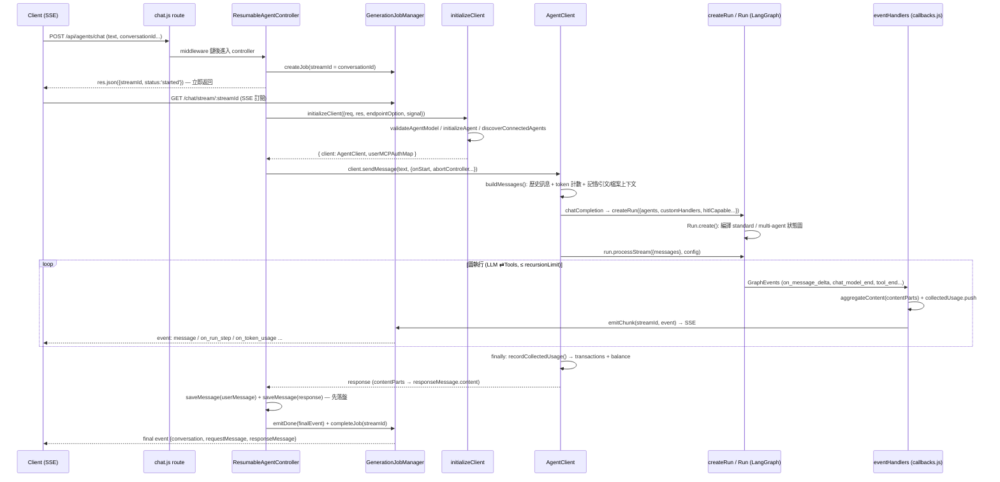

# 04. 執行引擎

## 定位

本文件涵蓋 LibreChat agent 對話「一個回合(turn)」的完整執行鏈:從 HTTP 請求進入 `AgentController`,到 client 初始化、LangGraph 狀態圖建立、串流事件聚合、token 用量計費,最後把回應訊息落盤。這是整個系統最核心的一條路徑,所有其他子系統(工具、記憶、HITL、串流續傳)都掛在這條主幹上。

執行鏈的四個主要檔案:

| 層 | 檔案 | 職責 |
|---|---|---|
| Controller | `api/server/controllers/agents/request.js` | 回合生命週期:併發控制、job 建立、背景生成、落盤、標題 |
| Initialization | `api/server/services/Endpoints/agents/initialize.js` | 組裝 AgentClient:載入 agent、工具、事件 handler、計費上下文 |
| Client | `api/server/controllers/agents/client.js` | `AgentClient`:訊息格式化 → `createRun` → `processStream` → 用量結算 |
| Callbacks | `api/server/controllers/agents/callbacks.js` | GraphEvents → 串流內容聚合 + SSE 轉發 + 計費收集 |

實際的 LLM 呼叫與工具迴圈由外部套件 `@librechat/agents`(LangGraph 封裝)執行;`packages/api/src/agents/run.ts` 的 `createRun` 是 host 與 SDK 的橋接層。

其他文件的邊界:agent 資料模型見 03-agent-data-model.md、權限見 16-permissions-sharing.md;工具系統見 07-tool-system.md;串流續傳(GenerationJobManager 內部)與 HITL 恢復流程見 14-streaming-resumability.md;本文件只講「執行一個回合」時它們如何被消費。

## 核心概念

- **Turn(回合)**:一次使用者送出訊息到 assistant 回應完成的完整週期。一個回合內可能有多次 LLM 呼叫(tool loop)、多個 agent(handoff/平行)、多個 subagent 子圖。
- **Run**:`@librechat/agents` 的 `Run` 實例,包裝一張編譯好的 LangGraph 狀態圖。`run.processStream()` 驅動 `streamEvents(version: 'v2')`,把圖執行過程轉成事件流。
- **GenerationJob**:與 HTTP 連線解耦的「生成任務」。`streamId === conversationId`,job 存活於 Redis(或 in-memory)job store,SSE client 憑 streamId 訂閱,斷線可重連(`api/server/routes/agents/index.js:66`)。
- **ResumableAgentController**:預設 controller。收到 POST 後**立即**回 `{ streamId, conversationId, status: 'started' }` JSON,生成在背景進行;client 另開 SSE 連到 `GET /agents/chat/stream/:streamId`(`request.js:252`)。
- **contentParts / aggregateContent**:`createContentAggregator()` 產生的一對物件。所有串流事件(文字 delta、reasoning、tool call 步驟)被聚合成 `contentParts` 陣列——這就是最終存入 DB 的 `message.content`(`initialize.js:138`)。
- **collectedUsage**:一個共享陣列。每次 `CHAT_MODEL_END` 事件把該次 LLM 呼叫的 `usage_metadata` push 進去,回合結束時一次結算計費(`callbacks.js:131`、`client.js:1725`)。
- **eventHandlers**:一張 `GraphEvents 事件名 → handler` 的映射表,`createRun` 時以 `customHandlers` 傳入 SDK。SDK 在圖執行時逐事件呼叫,host 藉此把 SDK 與 SSE/DB/計費解耦(`callbacks.js:293`)。
- **recursionLimit**:LangGraph 的 super-step 上限。每次「LLM 節點 → 工具節點」往返消耗步數,超限即拋 `GraphRecursionError`,防止 agent 無限迴圈(`packages/api/src/agents/config.ts:11`)。
- **HITL(Human-in-the-loop)**:工具執行前的人工審批。圖在 `interrupt()` 暫停、狀態存入 checkpointer,回合以 `requires_action` 掛起,`/resume` 路由重建圖並繼續(`client.js:1209`)。

## 架構與流程



### 步驟拆解

**1. Controller 前段(`request.js:189-273`)**

- 併發閘門:`checkAndIncrementPendingRequest(userId)`,超限回 429(`request.js:221`)。
- `conversationId` 不存在或為 `'new'` 時當場 `crypto.randomUUID()`;**streamId 恆等於 conversationId**(`request.js:230-232`)。
- `GenerationJobManager.createJob()` 建 job,並記下 `job.createdAt` 作為「本世代」的身分證——同一 conversation 的新請求會**取代**舊 job,所有後續副作用(final emit、checkpoint 清理、HITL pause)都要先驗證 `liveJob.createdAt === jobCreatedAt` 才能執行(`request.js:246`、`711`)。
- **立即** `res.json()` 返回。這是關鍵設計:工具載入(例如 MCP OAuth)可能需要對 client 發事件,所以 SSE 通道必須先於初始化建立(`request.js:250-252`)。
- 寫入 preliminary metadata(`userMessage`、`responseMessageId`、`agent_id`、`isTemporary`),讓「初始化階段就中止」或「極快的 HITL resume」也有足夠資訊還原回合(`request.js:260-273`)。
- 註冊 `allSubscribersLeft`:所有 SSE client 離線時,把目前聚合到的 `contentParts` 以 `unfinished: true` 存成部分回應,生成仍在背景繼續(`request.js:291-349`)。

**2. initializeClient(`initialize.js:113-997`)**

- 建立本回合共享狀態:`collectedUsage`、`contentParts`/`aggregateContent`、`artifactPromises`、`contextUsageSink`、`usageEmitSink`(`initialize.js:123-284`)。
- `getDefaultHandlers()` 產生事件 handler 映射,綁定上述所有 sink(`initialize.js:286`)。
- `validateAgentModel()` 驗證 agent 的 model 在允許清單內(`initialize.js:312`)。
- `createToolLoader(signal, streamId, definitionsOnly=true)`:**事件驅動模式**只載入可序列化的工具定義(schema),不建工具實例;實例延遲到 `ON_TOOL_EXECUTE` 事件時才由 `loadToolsForExecution` 建立(`initialize.js:60`、`216-251`)。
- `initializeAgent()`(`packages/api/src/agents/initialize.ts:570`)產出 `InitializedAgent`:解析 provider 設定、載入對話檔案、展開能力標記(`execute_code` → `bash_tool`+`read_file`、`memory` → `set_memory`+`delete_memory`)、注入 skill catalog、計算 `maxContextTokens`(model 上限 − maxOutputTokens,再扣 5% 保留,`initialize.ts:1313-1316`)。
- `discoverConnectedAgents()`:沿 `agent.edges` BFS 載入 handoff/平行 agent,逐一做 VIEW 權限與 model 驗證,剪掉不可達節點(`initialize.js:443-519`)。
- Subagent 樹解析:`resolveSubagentTrees` BFS 展開 `subagents.agent_ids`,深度上限 `MAX_SUBAGENT_DEPTH`、節點上限 `MAX_SUBAGENT_GRAPH_NODES`;「純 subagent」從 `agentConfigs` 剔除(不成為圖節點)但保留在 `agentToolContexts`(工具執行仍需其資源上下文)(`initialize.js:583-887`)。
- 建立 `endpointTokenConfigByAgentId`:多端點圖中每個 agent 用**自己端點**的費率計價(`initialize.js:943-954`)。
- `new AgentClient({...})` 把以上全部注入(`initialize.js:956-990`)。

**3. AgentClient.sendMessage → buildMessages(`client.js:303-614`)**

`sendMessage` 繼承自 `BaseClient`(`api/app/clients/BaseClient.js:536`):載入對話歷史 → `buildMessages` → 存 user message → `sendCompletion` → 組 responseMessage → 落盤。`buildMessages` 的重點:

- 依 `parentMessageId` 走出訊息鏈,格式化每則訊息並計算 token(`indexTokenCountMap`,DB 有快取的 `tokenCount` 直接用,有 quotes/檔案上下文則重算)(`client.js:373-474`)。
- 注入共享運行上下文:RAG augmented prompt、使用者記憶(memory)、per-agent 附件上下文,以 `applyContextToAgent` **就地修改** agent 物件的 `additional_instructions`(`client.js:519-611`)。

**4. chatCompletion → createRun → processStream(`client.js:1321-1780`)**

- 組 `config`(LangGraph `RunnableConfig`):

```js
// client.js:1339-1357
config = {
  runName: 'AgentRun',
  configurable: {
    thread_id: this.conversationId,        // checkpointer 的執行緒鍵
    user_id, hide_sequential_outputs,
    requestBody: { messageId, conversationId, parentMessageId },
    user: createSafeUser(req.user),
  },
  recursionLimit: resolveRecursionLimit(agentsEConfig, this.options.agent),
  signal: abortController.signal,
  streamMode: 'values',
  version: 'v2',
};
```

- `resolveRecursionLimit`(`packages/api/src/agents/config.ts:11`)三層決議:YAML 端點預設(fallback 50)→ per-agent `recursion_limit` 覆寫 → YAML `maxRecursionLimit` 全域封頂。
- `formatAgentMessages()` 把 payload 轉成 LangChain `BaseMessage[]`,並處理 skill priming 的插入與 token map 位移(`client.js:1414-1489`)。
- `createRun()`(`packages/api/src/agents/run.ts:872`)——host→SDK 的橋接:
  - `buildAgentInput()` 把每個 `InitializedAgent` 映射成 SDK 的 `AgentInputs`:provider 正規化、`llmConfig`(model_parameters + streaming 旗標;自訂 provider 關閉 `streamUsage` 改用 `usage: true`,`run.ts:1032-1041`)、instructions 合併(`toolContextMap` + `instructions` 為穩定前綴;`dynamicToolContextMap` + `additional_instructions` 為動態尾巴,`run.ts:1010-1017`)、`maxContextTokens`(套 summarization reserveRatio)、`reasoningKey` 決議(`run.ts:233`)。
  - deferred tool 補洞:從歷史訊息解析 `tool_search` 結果,把已發現工具的 `defer_loading` 翻回 false 並補進 `toolDefinitions`(`run.ts:954-971`、`1057-1072`)。
  - `buildSubagentConfigs()` 遞迴組 subagent 生成設定(含 self-spawn),循環防護 + 深度/數量上限(`run.ts:767-855`)。
  - 圖型別:`agentInputs.length > 1` 或有 `edges` → `'multi-agent'`,否則 `'standard'`(`run.ts:1149-1153`)。
  - HITL 佈線:僅當 `hitlCapable: true`(只有 AgentClient 傳)且端點開啟 `toolApproval` 時,掛 `PreToolUse` policy hook + `humanInTheLoop` 開關 + durable checkpointer(`run.ts:1182-1200`、`1254`)。
  - 其他 run 級設定:`eagerEventToolExecution`(投機性提前執行工具,排除 `create_file`/`edit_file`/`execute_code`/`bash_tool` 這類大參數副作用工具,`run.ts:1227-1235`)、`codeSessionToolNames`(檔案工具共享沙箱 session)、`toolOutputReferences`(任一 agent 有 code env 才開,`run.ts:1172`)、Langfuse trace。
  - `Run.create(runConfig)`(`run.ts:1256`)編譯狀態圖。
- `run.processStream({ messages }, config, { callbacks })`(`client.js:1622`)開始執行;圖事件全部流向 `customHandlers`。
- `handleRunInterrupt(run, streamId)`(`client.js:1631`、`1209-1319`):若 `run.getInterrupt()` 有 payload(HITL 暫停),做 CAS 檢查後把 job 轉 `requires_action`、持久化 pending action(含 request fingerprint 與 resume context)、提前釋放併發名額、發 `ON_PENDING_ACTION` 事件,設 `this.pendingApproval` 讓 controller 不做終局化。
- `finally` 區塊(`client.js:1692-1779`):擷取校準比率(context pruning EMA)、`finalizeSubagentContent()` 把 subagent 聚合內容掛回父 tool_call、flush subagent 用量 emit、**未中止才** `recordCollectedUsage()`(中止時由 abort middleware 計費,避免重複扣款,`client.js:1721-1734`)、非暫停時清理 HITL checkpoint(`thread_id` 跨回合穩定,不清會讓下一回合誤 resume 本回合狀態,`client.js:1746-1774`)。

**5. 事件聚合與轉發(`callbacks.js`)**

`getDefaultHandlers()` 回傳的映射表(`callbacks.js:344-448`):

| GraphEvent | 處理 |
|---|---|
| `CHAT_MODEL_END` | `ModelEndHandler`:usage push 進 `collectedUsage`(標 model/provider/agentId;summarize 節點標 `summarization`;隱藏的 sequential agent 標 `sequential`),emit `on_token_usage`(附權威 USD cost),擷取 Gemini thought signatures(`callbacks.js:37-196`) |
| `TOOL_END` | `ToolEndHandler(toolEndCallback)`:處理工具 artifact——file_search 引文、web_search、memory、ui_resources、base64 圖片落盤、code 輸出檔(`processCodeOutput`)+ 延遲 preview(`callbacks.js:647-904`) |
| `ON_RUN_STEP` / `_DELTA` / `_COMPLETED` | `aggregateContent` + 條件轉發(tool call 一律轉發;文字步驟依 `hide_sequential_outputs` × `checkIfLastAgent` 決定可見性,隱藏時改發 `on_agent_update` 狀態訊息)(`callbacks.js:351-415`) |
| `ON_MESSAGE_DELTA` / `ON_REASONING_DELTA` | `aggregateContent` + 同樣的可見性閘門(`callbacks.js:416-447`) |
| `ON_TOOL_EXECUTE` | `createToolExecuteHandler`:事件驅動工具執行——此刻才透過 `agentToolContexts` closure 載入真正的工具實例執行(`initialize.js:216-251`、`packages/api/src/agents/handlers.ts:3177`) |
| `ON_SUBAGENT_UPDATE` | 依 `parentToolCallId` 建立 per-subagent 聚合器,持久化子代理軌跡;可見性閘門同上(`callbacks.js:454-501`) |
| `ON_SUMMARIZE_*` | 聚合 + 轉發壓縮進度(`callbacks.js:503-530`) |
| `ON_CONTEXT_USAGE` | 快照進 `contextUsageSink`(context 儀表板持久化用)(`callbacks.js:535-569`) |

`emitEvent(res, streamId, eventData)`:resumable 模式走 `GenerationJobManager.emitChunk`(**await**,Redis 模式先 persist 再 publish 以保序);非 resumable 直接 `sendEvent(res)`(`callbacks.js:219-225`)。

**6. 用量結算與計費(`usage.ts` / `transactions.ts`)**

- `recordCollectedUsage`(`packages/api/src/agents/usage.ts:513`)把 `collectedUsage` 依 `usage_type` 分四組(primary/summarization/subagent/sequential),逐筆:
  - `splitUsage()`:cache-aware 拆分——「subset provider」(OpenAI/Anthropic/Google,cache 含在 input_tokens 內)vs「additive provider」(Bedrock,cache 另計)(`usage.ts:96-121`)。
  - `resolveCompletionTokens()`:修復 Vertex AI streaming 丟失 thinking tokens 的 undercount(`total - input` 補回),同時避開 Bedrock cache 造成的誤判(`usage.ts:61-83`)。
  - 有 cache → `prepareStructuredTokenSpend`(input/write/read 各自費率),否則 `prepareTokenSpend`(`transactions.ts:230-322`)。費率由 `getMultiplier`/`getCacheMultiplier` 決議(per-agent `endpointTokenConfig` 優先);`tokenValue` 為負數 credits(USD × 1e6);`context === 'incomplete'` 時 completion 打 `CANCEL_RATE` 折扣(`transactions.ts:102-106`)。
  - 全部文件湊齊後 `bulkWriteTransactions`:**一次** `updateBalance`(總增量)+ **一次** `insertMany`(`transactions.ts:324-347`)——不是逐筆寫。
- 回傳 `{ input_tokens, output_tokens }`;`output_tokens` **排除** subagent/sequential(它們的輸出不在可見訊息裡,計入會毀掉下一回合的 context 估算),此值成為 `responseMessage.tokenCount`(`usage.ts:656-679`、`BaseClient.js:756-758`)。
- 即時成本:`computeUsageCostUSD` 重用**同一套**計費函數算單次呼叫 USD,由 `on_token_usage` 事件帶給前端——前端只加總,不自行推導費率(`usage.ts:137-169`)。
- 持久化 rollup:`buildResponseMetadata()` 把 `usageEmitSink` 聚合成 `metadata.usage`、context 快照調和成 `metadata.contextUsage`,存在 responseMessage 上供 reload 還原(`client.js:955-1016`)。

## 關鍵資料結構

**GenerationJob(job store 內,Redis hash 或 in-memory)**

| 欄位 | 型別 | 用途 |
|---|---|---|
| `streamId` | string | 主鍵,恆等於 conversationId |
| `userId` / `tenantId` | string | 訂閱授權檢查(`routes/agents/index.js:78`) |
| `createdAt` | number | 世代身分:新請求取代舊 job 的 CAS 依據 |
| `status` | `running \| requires_action \| complete \| error` | HITL 掛起即 `requires_action` |
| `metadata.userMessage` | object | 還原/中止時重建 user bubble(text、quotes、files、skills) |
| `metadata.responseMessageId` / `sender` / `model` / `iconURL` | string | 部分回應落盤與 final event 組裝 |
| `metadata.pendingAction` | object | HITL:interruptId、requestFingerprint、resumeContext、TTL |
| `tokenUsage` / `contextUsage` | string (JSON) | 中止路徑重建 usage rollup(`usage.ts:426`) |
| (runtime) `abortController` | AbortController | 每 replica 本地;跨 replica 靠 pub/sub abort 訊號(`GenerationJobManager.ts:410-418`) |

**InitializedAgent(節錄,`packages/api/src/agents/initialize.ts:230-335`)**

| 欄位 | 型別 | 用途 |
|---|---|---|
| `tools` / `toolDefinitions` / `toolRegistry` | GenericTool[] / LCTool[] / Map | 實例(舊路徑)/ 可序列化 schema(事件驅動)/ 全量註冊表(deferred loading) |
| `toolContextMap` / `dynamicToolContextMap` | Record | 工具附帶的系統指令(穩定 / 動態) |
| `maxContextTokens` / `baseContextTokens` | number | 有效 context 預算 / 未扣 reserve 的原始預算 |
| `edges` / `subagentAgentConfigs` / `subagents` | — | 多 agent 圖拓撲 |
| `codeEnvAvailable` | boolean | admin 能力 AND agent 自列 `execute_code` 的交集 |
| `endpointTokenConfig` | object | 該 agent 端點的費率表(計費/計價共用) |
| `hasDeferredTools` / `recursion_limit` / `hide_sequential_outputs` | — | 執行期行為旗標 |

**createRun 的 RunConfig(`run.ts:1209-1255`)**

| 欄位 | 用途 |
|---|---|
| `graphConfig.agents: AgentInputs[]` + `edges` + `type` | 圖拓撲(standard / multi-agent) |
| `customHandlers` | GraphEvents → host handler 映射 |
| `indexTokenCountMap` / `tokenCounter` / `initialSummary` / `calibrationRatio` | context 修剪與壓縮的種子 |
| `subagentUsageSink` | 子圖用量回流(子圖不經 streamEvents 迴圈) |
| `humanInTheLoop` + `hooks` + `compileOptions.checkpointer` | HITL 三件套 |
| `eagerEventToolExecution` / `codeSessionToolNames` / `toolOutputReferences` | 工具執行最佳化 |

**UsageMetadata / usage_type 標籤**

| `usage_type` | 來源 | 計費 | 計入 `tokenCount` |
|---|---|---|---|
| (無,primary) | 可見 agent 的模型呼叫 | ✅ | ✅ |
| `summarization` | 壓縮節點(langgraph_node 前綴判定,`callbacks.js:1201`) | ✅ | ✅ |
| `sequential` | 被 `hide_sequential_outputs` 隱藏的中間 agent | ✅ | ❌ |
| `subagent` | 子圖模型呼叫(經 `subagentUsageSink`,`usage.ts:716`) | ✅ | ❌ |

**Transaction 文件(`transactions.ts:54-107`)**:`user`、`conversationId`、`messageId`、`model`、`context`(message/title/summarization/subagent/incomplete…)、`tokenType`(prompt/completion)、`rawAmount`(負 token 數)、`rate`、`rateDetail`(input/write/read 各費率)、`tokenValue`(負 credits)。Balance 是獨立文件,以 `incrementValue` 原子遞增。

## 關鍵實作細節與陷阱

1. **`streamId === conversationId` 造成的世代競態**。同一對話送新訊息會「取代」舊 job,於是每個延遲副作用都必須 CAS:final event 前(`request.js:710-739`)、HITL pause 前(`client.js:1257-1263`)、checkpoint 清理前(`client.js:1758-1767`)、標題 emit 前(`request.js:444-446`)。漏一處就會把舊回合的資料寫到新回合上。移植時若沿用此設計,務必把「job 世代檢查」做成統一 helper。
2. **雙重扣款防護**:中止時 `chatCompletion` 的 finally **跳過** `recordCollectedUsage`,由 abort middleware 負責計費(`client.js:1721-1734`)。兩邊都算會重複扣款;兩邊都不算就漏帳——狀態機必須明確唯一擁有者。
3. **先落盤、再發 final event**(`request.js:697-706`)。順序反了,前端收到 final 立刻追問,follow-up 的 `parentMessageId` 會指向還沒寫入的訊息,產生孤兒鏈。同理,`isUnpersistedPreliminaryParent` 檢查擋掉 parent 還在暫存狀態的追問(409,`request.js:204-213`)。
4. **HITL checkpoint 必須主動清理**:`thread_id = conversationId` 跨回合不變,正常完成的回合若留下 checkpoint,下一回合會 resume 到上一回合的圖狀態(`client.js:1746-1750`)。Mongo TTL 只是保底。
5. **事件順序**:resumable 模式的 `emitChunk` 必須 await(Redis 先 HSET persist 再 publish),否則斷線重連 replay 的 chunk log 會亂序或缺頁(`callbacks.js:213-221`)。subagent 用量 emit 是 fire-and-forget,所以 finally 要 `Promise.allSettled(pendingSubagentEmits)` 再返回,避免 job 清理跑贏 persist(`client.js:1707-1713`)。
6. **`recursionLimit` 語義**:LangGraph 的步數是「節點轉移」次數,一次工具往返吃兩步以上;預設 50 大約對應 20 多次工具呼叫。per-agent 可調高,但 `maxRecursionLimit` 讓管理員封頂,防止使用者自訂 agent 燒錢(`config.ts:11-30`)。
7. **`end_after_tools` 是個「殭屍設定」**:它是持久化欄位(`packages/data-schemas/src/schema/agent.ts:74`)、有 zod 驗證(`packages/api/src/agents/validation.ts:694`)、有能力開關(`packages/data-provider/src/config.ts:565`)與 UI,語意是「工具執行完直接結束、不把結果送回 LLM」(對應 SDK 的 `toolEnd`),但目前的 `createRun`/`buildAgentInput` **並未轉發它**——最初版本就是註解狀態(git `1a815f5e1` 的 `run.js:51`:`// toolEnd: agent.end_after_tools`)。移植時別照抄 schema 就以為功能存在;要嘛實作、要嘛移除。
8. **隱藏 sequential 輸出是三面一致的規則**:SSE 可見性(`callbacks.js:362-377`)、subagent 軌跡持久化(`callbacks.js:471-483`)、計費標籤(`callbacks.js:124-129`)都依同一條 `hide_sequential_outputs × checkIfLastAgent` 判定。只做其中一面,重新整理頁面就會洩漏本該隱藏的內容。
9. **Vertex/Bedrock 用量修復**(`usage.ts:61-83`):provider 回報的 `output_tokens` 不可盡信——Vertex streaming 丟 thinking tokens、Bedrock 的 cache 是 additive。計費前先按 provider 特性正規化,否則帳單誤差可達數量級。
10. **工具的兩段式生命週期**:初始化只載 schema(`definitionsOnly=true`),`ON_TOOL_EXECUTE` 才 lazily 建實例並注入 per-agent 上下文(auth、tool_resources、skill ACL)。好處是初始化快、MCP 連線延後;代價是執行期依賴 `agentToolContexts` closure,純 subagent 也必須留在該 map 中(`initialize.js:576-582`)。
11. **eager tool execution 排除清單**:投機執行對大型串流參數(檔案內容、bash heredoc)不安全——累積參數可能與最終 tool call 不一致,且寫檔可能在回合 commit 前落地,故 `create_file`/`edit_file`/`execute_code`/`bash_tool` 一律排除(`run.ts:1227-1235`)。
12. **記憶處理限時 3 秒**:`awaitMemoryWithTimeout` 防止 memory agent 卡住整個回合的收尾(`client.js:622-642`)。所有「順帶」的背景工作都應該有超時。

## 設計決策分析

**HTTP 立即返回 + SSE 憑 streamId 訂閱(resumable)**。相較傳統「POST 直接串流回應」:優點是生成與連線徹底解耦——頁面刷新、多分頁、行動網路斷線、多 replica 部署下都能重連續傳,`allSubscribersLeft` 保證離線也不丟部分回應;HITL 掛起數分鐘再 resume 也自然成立。代價是複雜度暴增:sync/replay 協定、chunk log、跨 replica abort、以及第 1 點的世代競態。LibreChat 保留了 legacy 直串流路徑但已不用(`request.js:911`)。若你的產品不需要「離開頁面生成不中斷」,傳統直串流簡單一個量級;需要的話,這個 job-store 模式是對的方向。

**事件 handler 映射表而非繼承/callback 地獄**。SDK 只知道「發事件」,host 用一張 `GraphEvents → handler` 表接住,聚合、轉發、計費、artifact 各自為政但共享 closure sinks。這使 OpenAI-compat、Responses API 等其他 controller 能重組同一批 handler(`callbacks.js:932`)。缺點是資料流隱晦——`collectedUsage` 這類共享可變陣列穿過四層檔案,追蹤困難。重做時建議把「回合上下文」做成顯式物件傳遞,而非散落的 closure 變數。

**計費採「收集後批次結算」**。每次模型呼叫只 push 陣列,回合結束一次 `insertMany` + 一次 `updateBalance`。優點:單回合多次呼叫(tool loop、多 agent)只有兩次 DB 寫;缺點:回合中途 crash 會漏帳(靠 abort middleware 補一部分)。金流敏感的系統可考慮 outbox pattern。

**LangGraph 作為執行核心**。換來:multi-agent 拓撲(edges/handoff)、`interrupt()` + checkpointer 的 HITL、streamEvents 的統一事件流、recursionLimit 保險絲。代價:巨大的抽象稅——本文件裡大量程式碼在「把 host 概念翻譯成圖概念」(thread_id、configurable、AgentInputs),以及 resume 時「用空 messages 重建圖、狀態從 checkpoint 還原」這種違反直覺的模式(`client.js:1892-1897`)。單 agent + 工具迴圈的場景,一個 while loop + 停止條件(如 ai-sdk 的 `stopWhen`、或 createAgent 底層的 `recursionLimit`)就足夠,不需要顯式狀態圖。

**若重做會怎麼選**(框架尚未定案,完整比較見 19-framework-options.md):需要 multi-agent handoff / 圖狀拓撲 / HITL 長暫停,且想沿用 LibreChat 現成做法 → **LangGraph 系**(LangGraph / LangChain / deepagents,底層皆 LangGraph,`createRun`/checkpointer 可照搬);若以單 agent + 工具迴圈為主、想要最輕量的實作與最完整的前端串流協定 → **Vercel AI SDK** 的內建 agent loop,圖與 checkpoint 能力則需自建。無論選哪個,若走自製顯式狀態機路線,狀態存 PostgreSQL 比 checkpointer 序列化透明得多。

## 移植到新技術棧的建議

> **AI 框架尚未定案**:PostgreSQL / Hono / Next.js / pnpm / Redis / docker-compose 已定,但 agent 框架仍有四個候選——**LangGraph**、**LangChain**、**deepagents**、**Vercel AI SDK**。關鍵不對稱:LibreChat 執行引擎 `@librechat/agents` 本身就是 LangGraph 封裝,故選 **LangGraph 系**(含 LangChain / deepagents,底層皆 LangGraph)時,本文的 `createRun` → `processStream` → eventHandlers 主幹可**近乎照搬**;選 **ai-sdk** 時 agent loop 有等價物,但 graph 拓撲、checkpointer、可恢復串流多需自建。以下 PostgreSQL / Hono / Redis 建議與框架無關;框架相關的對應集中在「AI 框架對應」小節,完整選型比較見 19-framework-options.md。

### PostgreSQL schema 草案

```sql
-- 生成任務(熱資料放 Redis,這裡是可查詢的落地鏡像;小規模可全放 PG)
CREATE TABLE generation_jobs (
  stream_id       uuid PRIMARY KEY,            -- 建議獨立 id,勿與 conversation_id 合一
  conversation_id uuid NOT NULL REFERENCES conversations(id),
  user_id         uuid NOT NULL,
  generation      bigint NOT NULL,             -- 世代號:取代 LibreChat 的 createdAt CAS
  status          text NOT NULL CHECK (status IN ('running','requires_action','complete','error')),
  metadata        jsonb NOT NULL DEFAULT '{}', -- userMessage / responseMessageId / pendingAction
  created_at      timestamptz NOT NULL DEFAULT now(),
  completed_at    timestamptz
);
CREATE UNIQUE INDEX one_active_job_per_convo
  ON generation_jobs (conversation_id) WHERE status IN ('running','requires_action');

-- 逐筆交易 + 餘額(對應 transactions.ts / balance)
CREATE TABLE token_transactions (
  id              bigserial PRIMARY KEY,
  user_id         uuid NOT NULL,
  conversation_id uuid,
  message_id      uuid,
  model           text,
  context         text NOT NULL,               -- message | title | summarization | subagent | incomplete
  token_type      text NOT NULL,               -- prompt | completion
  raw_amount      integer NOT NULL,            -- 負數 token
  rate            numeric(12,6) NOT NULL,
  rate_detail     jsonb,                       -- {input, write, read}
  token_value     numeric(14,4) NOT NULL,      -- 負數 credits (USD * 1e6)
  created_at      timestamptz NOT NULL DEFAULT now()
);
CREATE TABLE balances (
  user_id uuid PRIMARY KEY,
  credits numeric(14,4) NOT NULL DEFAULT 0
);
-- 結算:單一交易內 INSERT ... (多筆) + UPDATE balances SET credits = credits + $delta
-- —— 比 LibreChat 的 Mongo 兩次寫更強:PG 交易保證帳務原子性。

-- responseMessage.metadata 的對應:直接在 messages 表加 usage jsonb 欄位
ALTER TABLE messages ADD COLUMN usage jsonb;   -- {input, output, cacheWrite, cacheRead, cost}
```

### Hono 對應

- `POST /api/chat`:等價 `ResumableAgentController` 前段——驗證 → 併發閘門(Redis `INCR` + TTL)→ 建 job(`generation` 用 Redis `INCR` 取號)→ `c.json({ streamId })` 立即返回 → `queueMicrotask`/`waitUntil` 啟動背景生成。注意 serverless runtime 的執行時限;長生成建議跑在常駐 Node 服務或用 queue worker。
- `GET /api/chat/stream/:streamId`:用 Hono 的 `streamSSE()` 實作訂閱端,對應 `routes/agents/index.js:66`——先驗 job 所有權,`resume=true` 時回 sync 事件 + replay(從 Redis Stream `XRANGE` 讀 chunk log),再訂 pub/sub 收 live 事件。
- middleware 鏈對應:LibreChat 的 `moderateText → checkAgentAccess → validateConvoAccess → buildEndpointOption`(`chat.js:75-81`)在 Hono 就是一串 `app.use()`,把解析結果掛在 `c.set()`。
- `POST /api/chat/abort`:寫 Redis pub/sub abort channel,持有 AbortController 的 worker 收到後 `abort()`(對應 `GenerationJobManager.ts:410-418` 的跨 replica abort)。

### AI 框架對應

**關鍵事實**:LibreChat 執行引擎(`@librechat/agents`)就是 LangGraph 封裝。因此選 **LangGraph 系**(LangGraph / LangChain / deepagents,三者底層皆 LangGraph)時,本文前述的 `createRun` → `processStream` → eventHandlers → 用量結算主幹可**近乎照搬**;選 **Vercel AI SDK** 時 agent loop 有等價物,但 graph 拓撲、checkpointer、可恢復串流多需自建。下表對照本執行引擎涉及的能力(完整版見 19-framework-options.md):

| 能力 | LangGraph | LangChain | deepagents | Vercel AI SDK |
|---|---|---|---|---|
| agent loop + 步數上限 | 自建 StateGraph + `recursionLimit`(LibreChat 現制) | `createAgent` 內建 tool loop,底層同 `recursionLimit` | `createDeepAgent` 預組完整 loop,回傳編譯好的 LangGraph 圖 | `streamText`/`ToolLoopAgent` 內建,`stopWhen: stepCountIs(N)`(預設 20)+ `prepareStep` 每步調整 |
| multi-agent 圖 / handoff / 平行 | 原生:任意拓撲、subgraph、conditional edges(LibreChat `edges` 即此) | 單 agent 為主,多代理需下探 LangGraph 或組 subagent middleware | subagent 委派內建,圖狀 handoff 拓撲仍要下探 LangGraph | 無圖原語,需自建 orchestrator(handoff-as-tool + 外層 loop;`prepareStep` 可做輕量版) |
| subagents(隔離 context) | subgraph + 自建 spawn | 可掛 deepagents 的 `createSubAgentMiddleware` | 內建 `task` 工具 spawn ephemeral subagent,回傳單一報告 | tool 的 `execute` 內再跑一個 agent,usage 回流自理 |
| HITL interrupt/resume | `interrupt()` + `Command({resume})` + checkpointer,跨 process/replica resume | `humanInTheLoopMiddleware` 開箱 | `interruptOn` 參數開箱,底層即 LangGraph interrupt | v7 tool approvals + `WorkflowAgent` durable resume;或無-`execute` tool + PG 存 messages 自建(最透明) |
| checkpoint 持久化 | 官方 `-checkpoint-postgres`(PostgresSaver)/ `-redis`(RedisSaver) | 同 LangGraph(回傳物即圖,直接掛 checkpointer) | 同 LangGraph | 無 checkpointer;messages 陣列即狀態自存 PG,`WorkflowAgent` 另有 durable storage 抽象 |
| streaming 事件粒度 | 六種 `streamMode` 可疊加 + `streamEvents` + subgraph namespace | `streamEvents({version:'v3'})` | 同 LangGraph(編譯圖直接串流) | `fullStream` 細粒度 parts + UIMessage stream 協定(前端協定最完整) |
| 可恢復串流(斷線重連) | 需自建 job store + replay(LibreChat 14 現制可照抄) | 同左,需自建 | 同左,需自建 | 官方 `resumable-stream` + Redis + `useChat({resume})`;status/active 查詢仍要自建 |
| token usage 追蹤 | `usage_metadata`(含 cache 細目)+ 計費級校正(Vertex/Bedrock)自帶 | 同左 | 同左 | per-step usage + `totalUsage`;計費級校正同樣自帶 |

**選 LangGraph 系(LangGraph / LangChain / deepagents)時**:本文主幹幾乎原封不動——`createRun` 橋接、`processStream` 驅動 `streamEvents`、eventHandlers 映射表、`collectedUsage` 批次結算、`recursionLimit` 保險絲、`interrupt()` + checkpointer 的 HITL,都能直接對照 LibreChat 現有實作移植。checkpointer 直接用官方 `@langchain/langgraph-checkpoint-postgres`(PostgresSaver)/ `-redis`(RedisSaver),對應本文 HITL checkpoint 清理段(client.js:1746),跨回合 `thread_id` 清理陷阱同樣要處理。差異僅在:LangChain 的 `createAgent` / deepagents 的 `createDeepAgent` 把「編譯圖」封裝掉,你拿到的是編譯好的圖再掛 checkpointer / streamEvents;multi-agent handoff 拓撲若用 LangChain/deepagents 仍要下探底層 LangGraph 自組 edges。

**選 Vercel AI SDK 時**:

- **agent loop**:`streamText({ model, messages, tools, stopWhen: stepCountIs(N) })` 取代「standard 圖 + recursionLimit」——`stepCountIs(50)` 即 recursionLimit 的等價保險絲;`prepareStep` 做 per-step 換 model/工具(部分取代 handoff)。
- **事件流**:`result.fullStream` 的 `text-delta` / `reasoning-delta` / `tool-call` / `tool-result` / `finish-step` 對應 GraphEvents 的 `ON_MESSAGE_DELTA` / `ON_REASONING_DELTA` / `ON_RUN_STEP` / `TOOL_END` / `CHAT_MODEL_END`;`toUIMessageStream()` 產生的 UIMessage parts 直接就是持久化格式,不必自寫 aggregator(contentParts 等價物)。
- **用量收集**:`onStepFinish(({ usage }) => collected.push(usage))` 對應 `ModelEndHandler`,`onFinish` 的 `totalUsage` 對應 rollup。但 **provider 計費級校正(Vertex undercount、Bedrock cache)仍需自帶**——SDK 的 usage 正規化不涵蓋計費校正(此點兩系框架皆同)。
- **HITL**:無 checkpointer;用「工具不給 `execute`(或 `needsApproval`)→ 該 step 以 tool-call 結束 → 持久化 pending state → 使用者決定後把 tool result 附進 messages 再開新 `streamText`」的模式。messages 本身即完整狀態(存 PG),比 checkpoint 透明;v7 的 tool approvals / `WorkflowAgent` durable resume 是更進階的開箱選項。
- **需自建**:multi-agent 圖(edges/平行節點)——需自做 orchestrator(把「換 agent」建模成特殊 tool result,外層 while loop 切換 system prompt/工具集);subagent 隔離 context 則「在工具的 `execute` 裡再跑一個 `streamText`」即可,子呼叫 usage 記得像 `subagentUsageSink` 一樣回流計費但不計入父訊息 tokenCount。

### Redis 用途

1. **chunk log + 續傳**:每個 SSE 事件 `XADD stream:{streamId}`,重連用 `XRANGE` replay(LibreChat Redis 模式的等價物);設 TTL(完成後 5 分鐘,參考 `createStreamServices.ts:120`)。
2. **live 廣播**:`PUBLISH chan:{streamId}`,多 replica 下任何一台的訂閱端都收得到。
3. **跨 replica abort**:`PUBLISH abort:{streamId}`。
4. **併發限流**:per-user pending counter(`INCR`/`DECR` + 保底 TTL),對應 `checkAndIncrementPendingRequest`。
5. **job 熱狀態**:`HSET job:{streamId}` 存 status/metadata/tokenUsage 快照,PG 只在狀態轉移時落地。

### Next.js 前端考量

- 送出訊息:`fetch POST` 拿 `streamId` 後,用 `EventSource`(或 fetch + ReadableStream)連 `/api/chat/stream/{streamId}?resume=false`;`useChat` 若用自訂 transport 也能接同一協定。
- 頁面載入時打 `/api/chat/active` 等價端點查使用者進行中的 job,自動以 `resume=true` 重連——這是 resumable 架構在 UX 上的回報。
- final event 帶完整 `requestMessage`/`responseMessage`/`conversation`,前端直接覆蓋樂觀狀態,再配合 React Query invalidation;不要依賴「重新 fetch 一定拿得到」——這正是 LibreChat 「先落盤再 emit final」順序保證的消費端。

---

**引用檔案總覽**:`api/server/controllers/agents/request.js`、`api/server/controllers/agents/client.js`、`api/server/controllers/agents/callbacks.js`、`api/server/services/Endpoints/agents/initialize.js`、`api/server/routes/agents/chat.js`、`api/server/routes/agents/index.js`、`api/app/clients/BaseClient.js`、`packages/api/src/agents/run.ts`、`packages/api/src/agents/initialize.ts`、`packages/api/src/agents/config.ts`、`packages/api/src/agents/usage.ts`、`packages/api/src/agents/transactions.ts`、`packages/api/src/agents/discovery.ts`、`packages/api/src/stream/GenerationJobManager.ts`、`packages/api/src/stream/createStreamServices.ts`。
