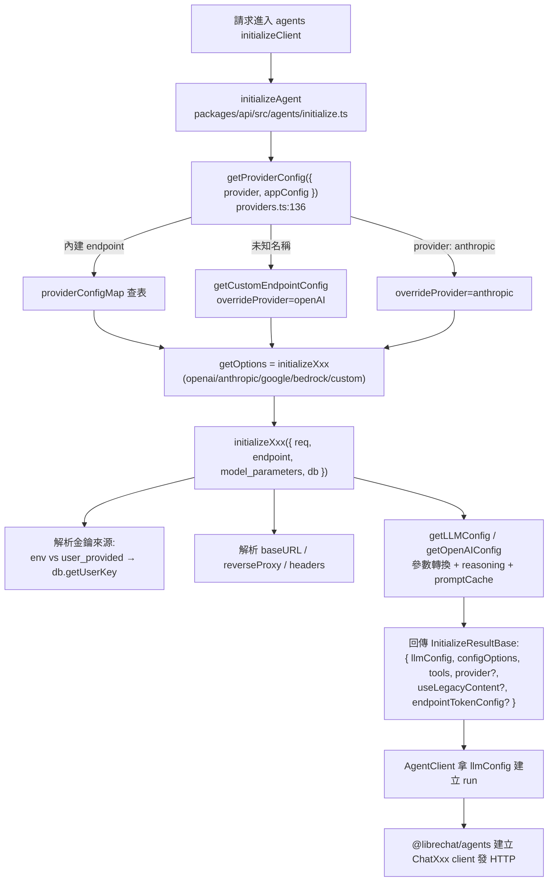

# 06. LLM Provider 抽象層

## 定位

這個子系統回答一個核心問題:**當使用者在前端選了一個「模型」並送出一段對話,後端要如何把它轉成對某一家 LLM 供應商(OpenAI / Anthropic / Google / Bedrock / Azure / 任意 OpenAI 相容 gateway)的正確 API 呼叫?**

在 LibreChat 的整體架構裡,這一層夾在兩者之間:

- 上游:對話請求控制器(agents 端點的 `initializeClient`,見 04-execution-engine.md)與模型清單 / endpoint 設定 API。
- 下游:`@librechat/agents` 套件(LangChain 系的 `ChatOpenAI` / `ChatAnthropic` / `ChatBedrockConverse` / `ChatGoogle` 等封裝),真正發出 HTTP 請求。

LibreChat 自己**不直接呼叫**各家 SDK 的 chat completion,而是負責產生「餵給 `@librechat/agents` 的設定物件」(`llmConfig` + `configOptions` + `tools` + `provider`)。所以這一層的產物幾乎全是**設定轉換**:把一個中立的 `model_parameters`(來自前端或 agent 文件),依 endpoint 種類轉成各 provider client 建構子期望的形狀,同時解決金鑰來源、reverse proxy、SSRF 防護、reasoning/thinking 參數、prompt cache、token 計費設定等橫切問題。

這一層在新專案裡的命運,取決於尚未定案的 AI 框架選擇(四個候選:LangGraph / LangChain / deepagents / Vercel AI SDK,完整比較見 19-framework-options.md):

- **LangChain 系(LangGraph / LangChain / deepagents)**:底層都用 `@langchain/*` 的 `ChatXxx` provider 套件——與 LibreChat 的 `@librechat/agents` **同款**。這意味 LibreChat 這整層的「設定轉換」(產生餵給 `ChatXxx` 建構子的 `llmConfig`)可以**高度直接沿用**,連 `initializeXxx` 的模型偵測都能大幅照搬。
- **Vercel AI SDK**:`@ai-sdk/openai`、`@ai-sdk/anthropic`、`@ai-sdk/google`、`@ai-sdk/amazon-bedrock` 各自是一個 provider package,`streamText({ model: openai('gpt-4o'), ... })` 直接吃統一的 `LanguageModelV2` 介面。這層「設定轉換」大部分會消失,取而代之的是「provider registry + 每個 provider 的 options 對應」,較多能力(如可恢復串流、checkpoint)需自建。

無論選哪個框架,真正**一定要你自己保留**的,是 LibreChat 額外承擔的四項周邊職責:**endpoint 設定管理、金鑰(admin 環境變數 vs 使用者自帶金鑰)管理、模型清單抓取與快取、titling 次要模型、計費 token config**。這些沒有任何框架代勞。

---

## 核心概念

### Endpoint vs Provider vs Model

這三個名詞在 LibreChat 常被混用,但語意不同,務必分清:

- **Endpoint**:使用者在 UI 上看到的「供應商入口」。內建 endpoint 由 `EModelEndpoint` enum 定義(`packages/data-provider/src/schemas.ts:18`):`openAI`、`azureOpenAI`、`google`、`anthropic`、`bedrock`、`assistants`、`azureAssistants`、`agents`、`custom`。使用者自訂的 OpenAI 相容服務(LiteLLM、OpenRouter、Groq、本地 Ollama…)全部歸類為 `custom`,以 `name` 區分。
- **Provider**:`@librechat/agents` 內部真正的 client 種類,由 `Providers` enum 鏡像(`schemas.ts` 內 `export enum Providers`):`openAI`、`anthropic`、`google`、`vertexai`、`bedrock`、`deepseek`、`moonshot`、`openrouter`、`xai` 等。一個 endpoint 不一定對應一個 provider:所有 custom endpoint 預設都走 `openAI`(OpenAI 相容 client),但若設定 `provider: anthropic` 就改走原生 Anthropic client。
- **Model**:字串,例如 `gpt-4o`、`claude-sonnet-4-5`、`anthropic.claude-3-5-sonnet-20240620-v1:0`。它只是 `model_parameters.model` 的一個欄位。

心智模型:**endpoint 決定「用哪把金鑰、哪個 baseURL、走哪套參數 schema」;provider 決定「用哪個 client class」;model 只是 request body 裡的一個字串。** 三者的橋接發生在 `getProviderConfig`(`packages/api/src/endpoints/config/providers.ts:136`)。

### model_parameters:中立參數包

前端送來的、或 agent 文件持久化的參數,統一放在 `model_parameters`(有時稱 `modelOptions`)。它是一個「盡量中立」的物件,例如 `{ model, temperature, topP, maxTokens, reasoning_effort, thinking, promptCache, web_search, ... }`。這一層的主要工作,就是把這個中立包轉成各 provider 的原生欄位(例如 OpenAI 的 `maxTokens`→有些模型要改成 `max_completion_tokens`;Anthropic 的 `maxOutputTokens`;把不支援的 sampling 參數整包刪掉)。

### 三種參數注入管道:addParams / dropParams / customParams

管理員在 `librechat.yaml` 為每個 endpoint 可配置:

- `addParams`:強制加上/覆寫的參數。
- `dropParams`:強制移除的參數(某些 gateway 不吃 `frequency_penalty` 之類)。
- `customParams.paramDefinitions`:UI 參數面板的定義,其 `default` 值會被抽成 `defaultParams`(見 `extractDefaultParams`,`packages/api/src/endpoints/openai/llm.ts:385`)。
- `customParams.defaultParamsEndpoint`:告訴系統「這個 custom endpoint 其實應該用哪一套參數 schema」(anthropic / google / openrouter)。

優先序(以 OpenAI 路徑為例):`defaultParams`(只在欄位 undefined 時填)→ `addParams`(可覆寫)→ 針對特定模型的 dropParams。

### 金鑰的兩種來源

- **Admin-provided**:環境變數直接給,例如 `OPENAI_API_KEY=sk-...`。
- **User-provided**:環境變數設成哨兵值 `user_provided`(或 Bedrock 的 `AuthType.USER_PROVIDED`),代表每個使用者要自己在 UI 填金鑰。使用者填的金鑰經 `updateUserKey` **加密後**存進 Mongo 的 `Key` collection(`packages/data-schemas/src/methods/key.ts:113`),可帶 `expiresAt`。

---

## 架構與流程

### 一次 agent 對話的 provider 初始化流程



### 逐步說明

1. **provider 解析**(`getProviderConfig`,`providers.ts:136`):輸入一個 `provider` 字串(可能是 `openAI`、`anthropic`、也可能是 custom endpoint 的 `name` 如 `groq`、`OpenRouter`)。
   - 先在 `providerConfigMap`(`providers.ts:39`)直接查表。這張表把每個 provider 對到一個 `initializeXxx` 函式。注意 `xai`/`deepseek`/`moonshot`/`openrouter` 全部映到 `initializeCustom`;`vertexai` 映到 `initializeGoogle`(因為兩者只差在認證方式)。
   - 查不到就轉小寫再查一次(處理 `OpenAI` 這種大小寫)。
   - 還查不到,當成 custom endpoint 名稱,呼叫 `getCustomEndpointConfig`,並把 `overrideProvider` 設成 `Providers.OPENAI`(custom 預設走 OpenAI 相容 client)。
   - 最後有個特例:若 custom endpoint 設定了 `provider: anthropic`,把 `overrideProvider` 改回 `anthropic`,讓它走原生 `/v1/messages`(`providers.ts:209`)。

2. **呼叫 `getOptions`**:即對應的 `initializeXxx`。所有 initialize 函式簽名一致(`BaseInitializeParams` → `InitializeResultBase`),接收 `{ req, endpoint, model_parameters, db }`,回傳統一結果。`db` 是注入的金鑰讀取函式(`getUserKey` / `getUserKeyValues`),讓 `packages/api`(純 TS,不依賴 mongoose)可以在測試中替換。

3. **金鑰 / baseURL / header 解析**(各 initialize 內部):判斷 admin 還是 user-provided、檢查金鑰過期、對 user-provided baseURL 做 SSRF 驗證(`validateEndpointURL`)。

4. **參數轉換**(`getLLMConfig` / `getOpenAIConfig` / `getOpenAILLMConfig`):把 `model_parameters` 轉成 provider 原生設定,處理 reasoning、thinking、prompt cache、web search 等。

5. **回傳並交給 `@librechat/agents`**:`AgentClient` 用 `llmConfig` 建立 LangChain client。`agent.model_parameters` 最後被覆寫成 `options.llmConfig`(`initialize.ts:1175`),供後續 titling 等重用。

### endpoint / model 清單 API(與對話流程平行的「探索」路徑)

前端啟動時需要知道「有哪些 endpoint 可用、每個 endpoint 有哪些 model」。這是三支 GET API:

- `GET /api/endpoints`(`EndpointController.js` → `getEndpointsConfig`):回傳每個 endpoint 的「能力描述」(是否 user-provide 金鑰、有哪些 capabilities),不含 model 清單。合併邏輯在 `createEndpointsConfigService`(`packages/api/src/endpoints/config/endpoints.ts:37`)。
- `GET /api/models`(`ModelController.js`):合併 `loadDefaultModels`(內建 endpoint,`api/server/services/Config/loadDefaultModels.js:18`)與 `loadConfigModels`(custom endpoint,`packages/api/src/endpoints/config/models.ts`)。
- `GET /api/endpoints/token-config`(`TokenConfigController.js`):回傳每個 model 的 context window 與(選配)價格,由 `resolveTokenConfigMap` 計算。

---

## 關鍵資料結構

### `InitializeResultBase`(各 initialize 的統一回傳)

| 欄位 | 型別 | 用途 |
|---|---|---|
| `llmConfig` | provider client options | 直接餵給 `@librechat/agents` 建 client 的主設定(model、temperature、apiKey、reasoning…) |
| `configOptions` | `OpenAIConfiguration` | client-level 設定:`baseURL`、`defaultHeaders`、`defaultQuery`、`fetch`、proxy dispatcher |
| `tools` | `BindToolsInput[]` | provider 原生工具(如 OpenAI `web_search`、Anthropic `web_search_20250305`) |
| `provider` | `Providers?` | 覆寫 provider(如 custom+OpenRouter → `openrouter`;custom+anthropic → `anthropic`) |
| `useLegacyContent` | `boolean?` | 是否用舊版 content 格式(custom endpoint、Azure serverless 為 true) |
| `endpointTokenConfig` | `EndpointTokenConfig?` | 該 endpoint 的 per-model context/計費設定,供計費與 context 上限計算 |

### `model_parameters`(中立參數包,節選)

| 欄位 | 型別 | 說明 |
|---|---|---|
| `model` | `string` | 模型 ID |
| `temperature` / `topP` / `topK` | `number` | sampling;reasoning 模型會被整包刪除 |
| `maxTokens` / `maxOutputTokens` | `number` | 輸出上限;OpenAI gpt-5+ 會轉成 `max_completion_tokens` / `max_output_tokens` |
| `reasoning_effort` / `reasoning_summary` | `string` | OpenAI o-series / gpt-5 reasoning |
| `thinking` / `thinkingBudget` / `effort` | `boolean/object/number/string` | Anthropic thinking(可能回存成完整物件) |
| `promptCache` / `promptCacheTtl` | `boolean` / `'5m'\|'1h'` | prompt caching |
| `web_search` | `boolean` | 是否啟用原生 web search 工具 |
| `user` | `string` | 使用者 ID,傳給 provider 做濫用追蹤 |

### `Key` collection(使用者自帶金鑰)

| 欄位 | 型別 | 說明 |
|---|---|---|
| `userId` | `ObjectId` | 擁有者 |
| `name` | `string` | endpoint 名稱(`openAI`、`anthropic`、custom endpoint name…) |
| `value` | `string` | **加密後**的金鑰或 JSON(多欄位如 Azure/Bedrock 會存 JSON 字串) |
| `expiresAt` | `Date?` | 過期時間;有 TTL index `expireAfterSeconds: 0` 自動清除 |
| `tenantId` | `string?` | 多租戶標記 |

來源:`packages/data-schemas/src/schema/key.ts`。注意 `value` 可以是「單一 API key」也可以是「JSON.stringify 過的多欄位物件」(Azure、Bedrock),由 `getUserKeyValues` 解析(`key.ts:60`)。

### `providerConfigMap`(provider → initialize 函式)

| Key | 值 | 備註 |
|---|---|---|
| `openAI` / `azureOpenAI` | `initializeOpenAI` | 共用同一支 |
| `anthropic` | `initializeAnthropic` | 支援 Vertex AI |
| `google` / `vertexai` | `initializeGoogle` | 共用,差在認證 |
| `bedrock` | `initializeBedrock` | AWS SigV4 / bearer |
| `xai` / `deepseek` / `moonshot` / `openrouter` | `initializeCustom` | 已知 custom provider |

來源:`packages/api/src/endpoints/config/providers.ts:39`。

---

## 關鍵實作細節與陷阱

### 1. 每家 provider 的參數轉換是一團「模型偵測」的 if-else

`getOpenAILLMConfig`(`openai/llm.ts:418`)有將近 400 行,核心複雜度全在「哪些模型不支援哪些參數」:

- **reasoning 模型**(`o1`/`o3`/`gpt-5` 但排除 `gpt-5-chat` 與 `gpt-5.1`)不支援 `temperature`/`topP`/`frequencyPenalty`/`presencePenalty`/`n`/`logprobs`/`logitBias`,整包刪掉(`openai/llm.ts:681`)。
- **gpt-4o search 模型**只吃 `max_tokens`,其他全刪(`openai/llm.ts:699`)。
- **gpt-5+** 的 `maxTokens` 要改名成 `max_completion_tokens`(chat completions)或 `max_output_tokens`(Responses API)(`openai/llm.ts:735`)。
- **DeepSeek** thinking 模式要強制 `includeReasoningContent`(`openai/llm.ts:669`)。
- **OpenRouter** 的 reasoning 走 `reasoning` 物件、web search 走 `plugins: [{ id: 'web' }]`,且 Anthropic 模型的 verbosity 要另外映射(`openai/llm.ts:606`、`245`)。

陷阱:這種「用 regex 比對 model 字串來決定行為」的做法非常脆弱,每出一個新模型就要改 regex。它散落在 `getOpenAILLMConfig` 各處,而非集中在一張表。

Anthropic 路徑(`anthropic/llm.ts:128`)同樣複雜:`thinking` 可能被回存成完整物件 `{ type: 'adaptive', display: 'omitted' }` 而非 boolean,要小心解析(`llm.ts:139`),否則使用者「關閉 thinking」會被誤判成開啟。`omitsSamplingParameters` 的模型要刪 `temperature`/`topP`/`topK`。

### 2. 「known params 進 llmConfig,其餘進 modelKwargs」的分流

每家 provider 都維護一個 `knownXxxParams` 集合(`openai/llm.ts:21` 的 `knownOpenAIParams`、`anthropic/llm.ts:91` 的 `knownAnthropicParams`)。分流規則:認識的參數放進 `llmConfig`(對應 client 建構子的具名參數),不認識的塞進 `modelKwargs`(會被原封不動送進 request body)。這是「讓管理員能傳任意自訂參數給 gateway」的逃生艙。

`transformToOpenAIConfig`(`openai/transform.ts:30`)是這套機制的極致:當一個 Anthropic 或 Google 的設定要「借用」OpenAI 相容 client(例如 custom endpoint 指定 `provider: anthropic` 但透過 OpenAI 格式送),它會把非 OpenAI 的欄位搬進 `modelKwargs`,把 `clientOptions` 拆進 `configOptions`,把 Google 專屬工具(`googleSearch`、`urlContext`)過濾掉。

### 3. 安全:user-provided baseURL 的 header 抑制與 SSRF 防護

這是最容易踩雷、也最重要的一組防護:

- **Header 抑制**:當 baseURL 由使用者提供時,admin 設定的自訂 headers **不可**轉發(`openai/initialize.ts:81`、`custom/initialize.ts:294`)。原因:那些 header 可能含 `${SECRET}` gateway 金鑰,或 `{{LIBRECHAT_OPENID_ID_TOKEN}}` 這種會 resolve 成使用者身分 token 的模板——送到使用者控制的 endpoint 等於洩漏憑證。
- **SSRF 防護**:user-provided baseURL 一律經 `validateEndpointURL` + `createSSRFSafeAgents` / `createSSRFSafeUndiciConnect`(`openai/config.ts:108`、`anthropic/llm.ts:412`),限制 redirect、封鎖內網位址(除非在 `allowedAddresses` 白名單)。
- **模型清單快取投毒**:`fetchModels` 的 `MODEL_QUERIES` cache 只以 `baseURL+apiKey` 為 key。若 header 會 resolve 成 per-user token,快取會把「A 使用者的過濾清單」餵給 B 使用者。解法是「同時帶 `headers` 與 `userObject` 時跳過快取」(`models.ts:193`),並讓 token-config cache key 也 user-scoped。

### 4. Token config cache 的 scope 地雷

`getTokenConfigKey`(`custom/initialize.ts:42`)決定計費用的 token config 快取在什麼粒度:

- 有靜態 `tokenConfig` → 用 endpoint 名(全域共享)。
- user-provided key/URL,或會轉發 user-scoped header → 需 user-scoped(`endpoint:userId` 或加 tenant)。
- 否則 tenant-scoped 或純 endpoint 名。

Scoped key 用 NUL 分隔前綴 + sha256(`endpoints/keys.ts`),確保不會跟 legacy 的 endpoint-name key 相撞。這裡的坑是:多個 custom endpoint 共用同一個 `baseURL+apiKey` 但 headers 不同時,`fetchModels` 的去重 key 還要混入 `headersFingerprint`(`config/models.ts:26`),否則會錯誤共用彼此的過濾清單。

### 5. 金鑰過期只在「有帶 expiresAt」時檢查

`checkUserKeyExpiry` 只在 request body 帶了 `key`(過期時間戳)時才跑。Agents API 送的是 OpenAI 相容 body,不帶 `key`,所以那條路徑 `expiresAt` 是 undefined、不檢查過期,但金鑰仍會被抓取(`custom/initialize.ts:208`)。這是刻意的,但容易誤以為「金鑰一定會驗過期」。

### 6. Bedrock 的認證有四種來源與 proxy 分岔

`initializeBedrock`(`bedrock/initialize.ts:107`)要處理:靜態 access key/secret、session token、bearer token、AWS profile(`fromNodeProviderChain`),還要判斷 user-provided(可能是雙層 JSON:`apiKey` 內再包一層 JSON)。有 proxy 或 bearer token 時,自己建 `BedrockRuntimeClient` 塞給 `ChatBedrockConverse` 的 `client` 參數;否則只傳 credentials 讓它自己建。`bedrockInputParser` / `bedrockOutputParser`(來自 data-provider)負責 model_parameters 的 zod 轉換。

---

## 設計決策分析

### 為什麼把這層抽成「設定產生器」而非直接呼叫 SDK?

LibreChat 的 agent 執行引擎在 `@librechat/agents`(LangChain 系),它已經有各家 `ChatXxx` 封裝。所以 `/packages/api` 這層只需產生「建構子參數」,不需自己管 streaming / tool loop。好處是關注點分離:參數轉換的複雜度集中在此,執行細節交給 agents 套件。壞處是**兩層之間的耦合非常隱性**——`llmConfig` 的每個欄位名都必須精確匹配某個 LangChain class 的建構子,改一邊要同步另一邊,而型別檢查跨 package 邊界時常被 `as Record<string, unknown>` 打洞(整份 code 大量出現)。

### 「custom endpoint = OpenAI 相容」的賭注

把所有未知供應商都當成 OpenAI 相容,是務實但有風險的決定。優點:一套 `initializeCustom` 支援 LiteLLM、OpenRouter、Groq、Ollama、vLLM…幾乎整個生態。缺點:一旦某家 API 有細微不相容(reasoning 格式、tool call 格式、content 格式),就得靠 `defaultParamsEndpoint` + `transformToOpenAIConfig` 這種「借殼」機制打補丁,愈補愈複雜。`provider: anthropic` 走原生 client 就是承認「純 OpenAI 相容不夠」的證據。

### 參數轉換用「model 字串 regex」而非「能力宣告表」

現況是 `getOpenAILLMConfig` 內散落 `/\b(o[13]|gpt-5)(?!\.|-chat)(?:-|$)/` 這類 regex。這讓「加一個新模型」變成「改核心轉換函式」,而且測試面很大(`openai/llm.spec.ts` 很長)。若重做,應改成**宣告式能力表**:每個 model pattern 對應一組 `supports: { temperature, reasoning, promptCache, maxTokensParam }`,轉換函式只讀表。這與各框架 provider 套件的走向一致——不論是 Vercel AI SDK 的 `@ai-sdk/*` package,或 LangChain 系的 `ChatXxx` 類,都傾向把「哪些參數合法」收斂進 provider 內部。

### 金鑰加密存 DB 是對的,但 scope 邏輯過重

user-provided key 加密存 Mongo、帶 TTL、支援多欄位 JSON,設計合理。但圍繞它的 token-config cache scope(tenant / tenant-user / user / endpoint 四種),加上 header 轉發安全判斷,累積成很難一眼看懂的條件樹。若重做,建議把「快取 scope」變成一個明確的 enum + 純函式,並用型別強制每條路徑都標明 scope。

---

## 移植到新技術棧的建議

已定案的技術棧:PostgreSQL + Hono + Next.js + pnpm + Redis + docker-compose。**AI agent 框架尚未定案**,四個候選:LangGraph、LangChain(1.x 的 `createAgent`)、deepagents、Vercel AI SDK(完整選型比較見 19-framework-options.md)。以下逐項對應;凡涉及框架差異處以四欄對照呈現,不預設任一框架為結論。

### provider 抽象:參數轉換層在各框架的命運

LibreChat 的 `getOpenAILLMConfig` / `getLLMConfig` / `transformToOpenAIConfig` 這幾百行的存廢,直接取決於框架選擇。四欄對照(provider 抽象做法):

| 框架 | provider 抽象做法 | 參數轉換層命運 |
|---|---|---|
| **LangGraph** | `@langchain/*` provider 套件群(`ChatOpenAI` / `ChatAnthropic` / `ChatBedrockConverse` / `ChatGoogle`),**與 LibreChat 同款** | 目標 client 建構子形狀相同,`initializeXxx` 的參數轉換與模型偵測可**幾乎直接沿用** |
| **LangChain** | 同 LangGraph + model 字串速記(如 `anthropic:claude-sonnet-4-6`) | 同 LangGraph,可沿用 |
| **deepagents** | 同 LangGraph(建於其上) | 同 LangGraph,可沿用 |
| **Vercel AI SDK** | 最廣的官方 provider 矩陣(`@ai-sdk/*`)+ v7 provider-agnostic 頂層 reasoning / usage 欄位 | 大部分**消失**,參數合法性收斂進 provider,改成 provider registry + `providerOptions.<provider>` |

不對稱要如實看待:**選 LangChain 系(LangGraph / LangChain / deepagents)時,LibreChat 這整層可高度直接參考;選 ai-sdk 時反而要放棄現有轉換邏輯、改換 SDK 的心智模型。**

**若選 LangChain 系**——底層與 `@librechat/agents` 相同,直接沿用 LibreChat 的 `providerConfigMap` + `initializeXxx` 結構:

```ts
import { ChatOpenAI } from '@langchain/openai';
import { ChatAnthropic } from '@langchain/anthropic';

// llmConfig 形狀與 LibreChat initializeXxx 的輸出一致,轉換邏輯可照搬
const model = new ChatOpenAI({ model: 'gpt-4o', temperature, maxTokens, configuration: { baseURL } });
```

custom / OpenAI 相容 endpoint 就是帶 `configuration.baseURL` 的 `ChatOpenAI`(對應 `initializeCustom`);`provider: anthropic` 的 custom endpoint 用 `ChatAnthropic({ anthropicApiUrl })`——與 LibreChat 現制幾乎一對一。

**若選 Vercel AI SDK**——參數轉換本體萎縮,保留的是 provider registry 這個概念:

```ts
import { openai } from '@ai-sdk/openai';
import { createAmazonBedrock } from '@ai-sdk/amazon-bedrock';
import { createOpenAICompatible } from '@ai-sdk/openai-compatible';
import { createProviderRegistry } from 'ai';

export const registry = createProviderRegistry({
  openai,
  bedrock: createAmazonBedrock({ /* creds */ }),
});
// registry.languageModel('openai:gpt-4o');各家特殊參數走 providerOptions.<provider>
// custom / OpenAI 相容用 createOpenAICompatible({ baseURL, apiKey, headers }),對應 initializeCustom
```

reasoning / thinking / prompt cache 交給 `providerOptions.<provider>`,不用自己 regex 偵測 model 字串。無論哪個框架,下面的 endpoint 設定管理、金鑰、模型清單、titling、計費 config 都要照樣自建。

### PostgreSQL schema 草案

LibreChat 的 endpoint 設定來自 `librechat.yaml`(檔案),使用者金鑰來自 Mongo `Key`。移到 pgsql 時,建議把 endpoint 設定也入庫(方便 admin UI 管理),並保留使用者金鑰表:

```sql
-- 供應商 endpoint 設定(取代 librechat.yaml 的 endpoints 區塊)
CREATE TABLE llm_endpoints (
  id              uuid PRIMARY KEY DEFAULT gen_random_uuid(),
  tenant_id       uuid,                       -- 多租戶(nullable = 全域)
  name            text NOT NULL,              -- 'openAI' / 'groq' / 'OpenRouter'
  provider        text NOT NULL,              -- provider id(ai-sdk provider 名 / LangChain 系對應 ChatXxx):'openai'|'anthropic'|'google'|'bedrock'|'openai-compatible'
  base_url        text,                       -- reverse proxy / gateway;NULL = 官方
  api_key_ref     text,                       -- 指向 secret manager 的 ref,或 'user_provided'
  default_params  jsonb NOT NULL DEFAULT '{}',-- addParams / customParams.default
  drop_params     text[] NOT NULL DEFAULT '{}',
  headers         jsonb NOT NULL DEFAULT '{}',-- 自訂 header 模板
  models_fetch    boolean NOT NULL DEFAULT true,
  default_models  text[] NOT NULL DEFAULT '{}',
  title_model     text,                       -- titling 次要模型
  enabled         boolean NOT NULL DEFAULT true,
  created_at      timestamptz NOT NULL DEFAULT now(),
  UNIQUE (tenant_id, name)
);

-- 使用者自帶金鑰(對應 Mongo Key collection)
CREATE TABLE user_provider_keys (
  id          uuid PRIMARY KEY DEFAULT gen_random_uuid(),
  user_id     uuid NOT NULL REFERENCES users(id) ON DELETE CASCADE,
  endpoint    text NOT NULL,                  -- 對應 llm_endpoints.name
  value_enc   bytea NOT NULL,                 -- 加密後的金鑰或 JSON(pgcrypto / app 層 AES-GCM)
  expires_at  timestamptz,                    -- 過期
  created_at  timestamptz NOT NULL DEFAULT now(),
  UNIQUE (user_id, endpoint)
);
CREATE INDEX ON user_provider_keys (expires_at) WHERE expires_at IS NOT NULL;
```

過期清理:LibreChat 靠 Mongo TTL index。pgsql 沒有原生 TTL,用一支 cron(或在讀取時判斷 `expires_at < now()` 視為無效)即可。加密建議在**應用層**用 AES-256-GCM(把 LibreChat 的 `encrypt`/`decrypt` 概念搬過來),金鑰材料放環境變數 / KMS,而非用 pgcrypto 把明文金鑰交給 DB。

### Hono route / middleware 對應

LibreChat 的三支探索 API 直接對應:

| LibreChat | Hono |
|---|---|
| `GET /api/endpoints`(EndpointController) | `app.get('/api/endpoints', authMiddleware, listEndpoints)` |
| `GET /api/models`(ModelController) | `app.get('/api/models', authMiddleware, listModels)` |
| `GET /api/endpoints/token-config` | `app.get('/api/endpoints/token-config', authMiddleware, tokenConfig)` |
| `PUT/DELETE/GET /api/keys`(keys.js) | `app.put('/api/keys', authMiddleware, upsertUserKey)` 等 |

`requireJwtAuth` → Hono 的 auth middleware(如 `hono/jwt` 或自訂)。`configMiddleware`(把 appConfig 掛到 `req.config`)→ Hono 用 `c.set('appConfig', ...)` context。SSRF 防護(user-provided baseURL)在 Hono 一樣要做:對 fetch 的 host 做白名單 / 私網封鎖,可用一個共用 `assertSafeUrl(url, allowlist)` helper,並在傳給 client 的 fetch 覆寫時掛上(ai-sdk 用 provider 的 `fetch` 選項、LangChain 系用 `configuration.fetch` 或 SSRF-safe agent,即 LibreChat 現制)。

### Redis 的用途

LibreChat 用內部 cache store(可背 Redis)做三件事,移植時全部落到 Redis:

- **模型清單快取**(`MODEL_QUERIES`,`models.ts`):`fetchModels` 抓 `/v1/models` 的結果,TTL 兩分鐘。key 要含 baseURL+apiKey;若 header 會 resolve 成 per-user token,**per-user key 或跳過快取**(重要安全點,見上文陷阱 3)。
- **token / 計費 config 快取**:per-model context window 與價格,scope 依 user/tenant。
- **titling 結果暫存**(`GEN_TITLE`,`title.js:69`):title 生成後先寫 Redis(120 秒),讓即時 UI 立刻看到,再非同步落 DB。

建議在 Redis key 設計上就把 scope 前綴寫死(`models:{endpoint}:{hash}`、`models:user:{userId}:{endpoint}` 二選一),避免 LibreChat 那種 scope 判斷散落各處的問題。

### Titling 次要模型

LibreChat 的 titling(`titleConvo`,`client.js:2072`)邏輯值得照抄其結構:

1. 預設用**當前對話的 endpoint/model** 生標題。
2. 若 endpoint 設定 `titleEndpoint`,切到那個(便宜的)endpoint。
3. 若設定 `titleModel` 且不是 `CURRENT_MODEL` 哨兵,覆寫成該小模型(如 `gpt-4o-mini`)。
4. 重新跑一次 `getOptions` 拿到 title 專用的 llmConfig,刪掉 `maxTokens` 等,再呼叫 `run.generateTitle`。
5. 用量記進計費(`recordCollectedUsage` 的 `context: 'title'`),並有 45 秒 timeout。

落到新框架,這就是一支獨立的生成呼叫配 `AbortSignal` timeout——ai-sdk 用 `generateText({ model: registry.languageModel(titleModelRef), prompt: titlePrompt(userText) })`;LangChain 系用 `titleModel.invoke(titlePrompt(userText))`(結構同 LibreChat 的 `run.generateTitle`)。把「title 用哪個模型」做成 endpoint 設定欄位(上表的 `title_model`),並支援全域 override。`titleTiming`(immediate vs final,`providers.ts:64`)可保留:immediate 模式與主回覆平行生成、先寫快取後落 DB,體感更快,但要處理「對話 row 還沒建立」的競態(LibreChat 用 `convoReady` promise 等待,見 `title.js:136`)。

### 沒有直接對應、要自己承擔的部分

- **model 能力表**:四個框架都幫你處理參數格式,但「這個 model 支不支援 reasoning / vision / tool call / context 上限多少」**沒有一個提供完整表**。你仍需一份 model metadata(context window、價格、能力旗標),對應 LibreChat 的 `defaultModels` + `tokenConfig` + `getModelMaxTokens`。建議入庫或做成一份可熱更新的 JSON,別像 LibreChat 那樣硬寫在多個檔案。
- **計費 token config**:各框架都回傳 usage(LangChain 系的 `usage_metadata` 含 cache 細目、ai-sdk 的 per-step usage + `totalUsage`),但價格與 context 上限要你自己算。保留 LibreChat 的 `endpointTokenConfig` 概念(per-endpoint per-model 的 rate map),見計費相關文件。
- **Vertex AI / Bedrock 的非 API-key 認證**:LangChain 系的 `ChatBedrockConverse` / `ChatVertexAI`(LibreChat 同款,周邊 credential 邏輯可沿用)與 ai-sdk 的 bedrock / google-vertex provider 都支援,但 credential 解析(profile chain、bearer、雙層 JSON user key)這種周邊邏輯還是要自己寫,對應 `initializeBedrock` / anthropic 的 `vertex.ts`。

---

### 小結

這一層的本質是「**中立參數包 → provider 原生設定**」的翻譯機,外加金鑰管理、模型清單、titling、計費 config 四項周邊職責。翻譯機本體會不會萎縮,取決於框架:選 LangChain 系(LangGraph / LangChain / deepagents)時,底層與 `@librechat/agents` 同款,這層可**高度直接沿用**;選 Vercel AI SDK 時翻譯機大幅萎縮(provider package 內建),但改為 provider registry。無論哪個框架,**四項周邊職責一項都不能少**,且 LibreChat 在安全性(user-provided baseURL 的 header 抑制、SSRF、快取投毒)上踩過的坑要原封不動地搬進新實作。若要比 LibreChat 做得更好,重點是把「model 能力偵測」從 regex 改成宣告式表格,把「快取 scope」從散落條件改成明確 enum + 純函式。
