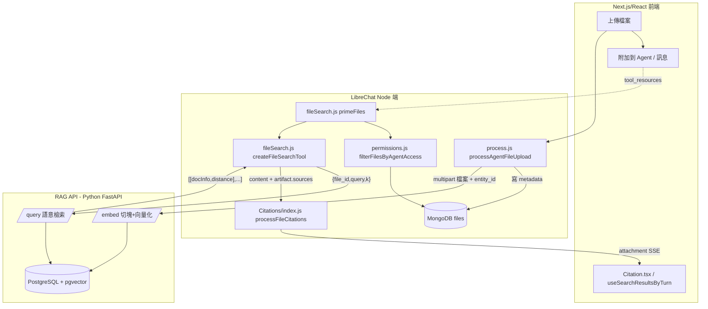

# 10. File Search / RAG

## 定位

File Search(檔案語意搜尋)是 LibreChat 讓 Agent 具備「讀懂使用者上傳文件」能力的子系統。它解決的是經典的 **RAG(Retrieval-Augmented Generation)** 問題:文件太大無法全文塞進 context window,於是把文件切塊、向量化、存進向量資料庫,對話時再依使用者問題做語意檢索,只把最相關的片段餵給 LLM。

在 LibreChat 的整體架構裡,這個子系統有兩個明顯特徵:

- **委外(delegation)**:LibreChat 本身**不做** embedding、chunking、向量檢索。這些全部委託給一個獨立的 Python 服務 **RAG API**(`registry.librechat.ai/danny-avila/librechat-rag-api-dev-lite`),透過 HTTP 溝通,由環境變數 `RAG_API_URL` 指向。Node 端只負責「轉發檔案」「發查詢」「把結果組成 tool output」與「權限把關」。
- **兩條使用路徑**:同一份 RAG 基礎設施被兩種上層機制共用:
  1. **`file_search` 工具**(本文主軸):Agent 主動決定何時搜尋,以 tool call 形式呼叫,回傳結果附帶 citations 錨點。程式在 `api/app/clients/tools/util/fileSearch.js`。
  2. **context 注入**(`createContextHandlers.js`):不走工具,而是在組 prompt 時就先用「使用者這句話」當 query 撈一次,把結果當成背景知識直接注入 system prompt。這是舊版 legacy client 的作法。

本文專注在 `file_search` 工具路徑,兼談 embedding 上傳管線、agent 檔案存取權限過濾、以及 citations 錨點機制。工具如何被 Agent 載入的通用流程見 07-tool-system.md;檔案儲存策略(S3/local/Azure)見檔案子系統文件;此處只守 RAG 相關範圍。

---

## 核心概念

### RAG API 是什麼、負責什麼

RAG API 是一個 FastAPI 服務,內部用 LangChain + PGVector(pgvector 擴充的 PostgreSQL)。它對外暴露幾個端點,LibreChat Node 端只認得這幾個:

| 端點 | 方法 | 用途 | Node 端呼叫處 |
|---|---|---|---|
| `/embed` | POST(multipart) | 收檔案 → 切塊 → 向量化 → 寫入 pgvector | `VectorDB/crud.js:88` `uploadVectors` |
| `/query` | POST(json) | 依 `{file_id, query, k}` 做語意檢索,回傳 top-k chunk | `fileSearch.js:127`、`createContextHandlers.js:33` |
| `/documents` | DELETE(body 為 file_id 陣列) | 刪除某檔案的所有向量 | `VectorDB/crud.js:27`、`rag.ts:38` |
| `/documents/{id}/context` | GET | 取整份文件的全文(`RAG_USE_FULL_CONTEXT`) | `createContextHandlers.js:25` |
| `/text` | POST(multipart) | 只做文字擷取、不向量化(context/OCR 用) | `packages/api/src/files/text.ts:95` |
| `/health` | GET | 健康檢查 | `checks.ts:144`、`text.ts:72` |

關鍵心智模型:**LibreChat 的 MongoDB 只存「檔案的中繼資料」(`files` collection),向量與 chunk 內容存在 RAG API 的 PostgreSQL。** 兩邊靠 `file_id`(LibreChat 產生的字串)當外鍵串起來。這是一個典型的「metadata 在主庫、向量在專用庫」的雙庫設計。

### 認證:short-lived JWT

Node 每次呼叫 RAG API,都用 `generateShortLivedToken(userId)`(`packages/api/src/crypto/jwt.ts:9`)簽一個 5 分鐘有效的 HS256 JWT,payload 只有 `{ id: userId }`,secret 是共用的 `JWT_SECRET`。RAG API 用同一個 secret 驗簽,取出 `id` 當作向量的租戶隔離鍵(`user` 欄位)。這代表 **embedding 預設是以「上傳者 user id」為隔離範圍**。

### entity_id:user scope vs agent scope

RAG API 的向量除了 `user` 之外,還可帶一個 `entity_id`。LibreChat 用它區分兩種檔案:

- **使用者臨時附加的檔案**(聊天視窗直接拖進來):`entity_id` 為 `undefined`,向量掛在 `user` 底下。
- **Agent 知識庫檔案**(建立 Agent 時上傳、存進 `agent.tool_resources.file_search`):`entity_id = agent.id`,向量額外標記屬於某 agent。

這個區分在 `processAgentFileUpload` 決定:`const entity_id = messageAttachment === true ? undefined : agent_id;`(`process.js:686`)。查詢時對應地,`createQueryBody` 只有在 `file.fromAgent === true` 才把 `entity_id` 帶進 `/query` body(`fileSearch.js:117`)。**踩雷點**:若對「使用者臨時檔案」誤帶 `entity_id`,RAG API 的 entity 過濾會查不到任何結果——這正是 `fileSearch.js:110-116` 那段長註解在防的坑。

### file_search 工具 vs context 注入

| 面向 | `file_search` 工具 | context 注入 |
|---|---|---|
| 觸發 | LLM 自主 tool call | 每則使用者訊息自動先撈 |
| query 來源 | LLM 生成的自然語言 query | 使用者原話 |
| k(取幾塊) | 5 / 檔案 | 4 / 檔案(全文模式取整份) |
| 結果去處 | tool output → 再進 LLM,附 citations | 直接拼進 system prompt |
| citations | 有(`turnXfileY` 錨點) | 無 |
| 程式 | `fileSearch.js` | `createContextHandlers.js` |

新版 Agent 走工具路徑;context 注入是 legacy client 的作法,兩者共用 RAG API。

### citations 錨點

當使用者有 `FILE_CITATIONS` 權限時,工具會在每筆結果前放一個私有區(private-use area)Unicode 錨點 `turn0file{index}`,並在工具描述裡教 LLM「引用檔案內容時把這個錨點原樣抄在句尾」。前端再解析這些錨點、對應回結構化的 source 資料,渲染成可 hover / 可點開預覽的引用標記。詳見下方〈citations 機制〉。

---

## 架構與流程

### 全景圖



### 流程 A:上傳與向量化(embed pipeline)

進入點 `processAgentFileUpload`(`process.js:665`),file_search 資源走的是「雙儲存」路徑(`process.js:868-908`):

1. **能力/型別把關**:`file_search` 不接受圖片(`process.js:676`);且要 `AgentCapabilities.file_search` 開啟(`process.js:734`)。
2. **先寫永久儲存**:用設定的 file strategy(S3 / local / Azure…)把原檔存一份做備份(`process.js:877`)。這是為了日後能重新 embedding 或讓使用者下載原檔。
3. **再寫向量庫**:`uploadVectors`(`crud.js:67`)用 `form-data` 把 `file_id`、檔案 stream、選擇性的 `entity_id`、`storage_metadata` POST 到 `RAG_API_URL/embed`。
4. **解讀回應**:RAG API 回 `{ status, known_type }`。`known_type === false` 代表副檔名不支援 → 丟錯;`embedded = Boolean(known_type)`(`crud.js:99-111`)。
5. **寫回 MongoDB**:檔案文件記 `embedded: true`、`source: 'vectordb'`(`FileSources.vectordb`),並呼叫 `addAgentResourceFile` 把 `file_id` 掛進 `agent.tool_resources.file_search.file_ids`(`process.js:934`)。

> 注意:向量庫的 `filepath` 欄位被填成字串常數 `'vectordb'`(`crud.js:110`),它不是真實路徑,而是「這檔案的內容在向量庫」的標記。真正的原檔備份 filepath 由步驟 2 的 storage 決定,存在 `storageMetadata`。

### 流程 B:priming(準備工具要搜哪些檔案)

Agent 執行前,工具載入器(`handleTools.js:309`)呼叫 `primeSearchFiles`(即 `primeFiles`,`fileSearch.js:32`):

1. 從 `tool_resources.file_search.file_ids` 取出 agent 綁定的檔案 id(`fileSearch.js:34`),另從 `.files` 取出「本次請求臨時附加」的檔案(`fileSearch.js:36`)。
2. 用 `getFiles({ file_id: { $in: file_ids } }, null, { text: 0 })` 從 MongoDB 撈檔案 metadata(投影掉 `text` 大欄位)。
3. **權限過濾**:若有 `req.user.id` 且有 `agentId`,呼叫 `filterFilesByAgentAccess`(`permissions.js:126`)。
4. 併入臨時附加檔(`dbFiles.concat(resourceFiles)`)。
5. 組出兩樣東西:
   - `files`:每筆帶 `{ file_id, filename, fromAgent }`,`fromAgent` 由「該 id 是否在 `agentResourceIds` 集合」決定(`fileSearch.js:73`)。
   - `toolContext`:一段給 LLM 的提示字串,列出「你可以搜尋這些檔案」;沒檔案時提示「請使用者上傳」(`fileSearch.js:56-69`)。這段會塞進 `dynamicToolContextMap`,注入 system prompt。

### 流程 C:query 與結果排序(核心)

`createFileSearchTool`(`fileSearch.js:89`)回傳一個 LangChain `tool`,`responseFormat: 'content_and_artifact'`(工具回傳 `[給模型看的文字, 給前端的結構化 artifact]`)。tool 被呼叫時(`fileSearch.js:91` 起):

1. 沒檔案 / 簽 token 失敗 → 早退回錯誤字串(`fileSearch.js:92-98`)。
2. **對每個檔案各發一次 `/query`**,並行(`Promise.all`):body 為 `{ file_id, query, k: 5 }`,依 `fromAgent` 決定是否加 `entity_id`(`fileSearch.js:104-140`)。每個請求各自 `.catch` 成 `null`,避免單一檔案失敗拖垮全部。
3. 過濾掉 `null` 結果;全失敗 → 回錯誤字串(`fileSearch.js:143-147`)。
4. **攤平 + 排序 + 截斷**(`fileSearch.js:149-160`):
   - RAG API `/query` 回傳格式是 `result.data = [[docInfo, distance], ...]`,`docInfo.page_content` 是 chunk 文字,`docInfo.metadata.source` 是路徑,`.metadata.page` 是頁碼。
   - `flatMap` 把所有檔案的所有 chunk 攤平成一維,每筆記 `{ filename, content, distance, file_id, page }`。
   - `.sort((a,b) => a.distance - b.distance)`:**distance 越小越相關**(pgvector 的距離度量),升冪排序。
   - `.slice(0, 10)`:全域只留最相關的 10 塊(跨所有檔案)。
5. **組 content 字串**(`fileSearch.js:169-176`):每塊輸出 `File / (Anchor) / Relevance / Content`。`Relevance = (1.0 - distance).toFixed(4)`——把距離轉成「相關度分數」。啟用 citations 時才輸出 `Anchor: turn0file{index}`。
6. **組 artifact.sources**(`fileSearch.js:178-186`):結構化資料,每筆 `{ type:'file', fileId, content, fileName, relevance, pages, pageRelevance }`。
7. 回傳 `[formattedString, { file_search: { sources, fileCitations } }]`(`fileSearch.js:188`)。

### 流程 D:citations 落地

工具 artifact 產生後,`createToolEndCallback`(`callbacks.js:647`)偵測到 `output.artifact.file_search`,呼叫 `processFileCitations`(`Citations/index.js:23`):

1. **權限**:再驗一次 `FILE_CITATIONS`(工具端已驗過會直接沿用 `fileCitations` 旗標;權限檢查出錯則保守回 `null` 不顯示)(`Citations/index.js:29-55`)。
2. **relevance 門檻**:過濾掉 `relevance < minRelevanceScore`(預設 0.45)的 source(`Citations/index.js:60-70`)。
3. **配額**:`applyCitationLimits`(`Citations/index.js:102`)先 group by `fileId`,每檔取相關度前 `maxCitationsPerFile`(預設 7)塊,再全域依相關度排序、截到 `maxCitations`(預設 30)。
4. **補 metadata**:`enhanceSourcesWithMetadata`(`Citations/index.js:127`)回 MongoDB 撈檔名、型別、大小、儲存位置補進 source。
5. 包成 `attachment`(`type: 'file_search'`、帶 `toolCallId`、`messageId`、`conversationId`),透過 `attachment` SSE 事件推給前端並持久化。

> **關鍵**:前端拿到的不是工具原始 artifact,而是 `processFileCitations` 重新排序/去重/截斷過的 sources。這造成一個微妙的錨點對齊問題,見下方陷阱。

---

## 關鍵資料結構

### `AgentToolResources` / `AgentFileResource`

`packages/data-provider/src/types/assistants.ts:186`:

| 欄位 | 型別 | 用途 |
|---|---|---|
| `file_search` | `AgentFileResource` | 語意搜尋資源 |
| `execute_code` | `ExecuteCodeResource` | 程式碼沙盒檔案 |
| `image_edit` / `context` / `ocr` | `AgentBaseResource` | 其他資源類別 |

`AgentFileResource extends AgentBaseResource`(`assistants.ts:200`):

| 欄位 | 型別 | 用途 |
|---|---|---|
| `file_ids` | `string[]` | 綁定到此 agent 的檔案 id(priming 的來源) |
| `files` | `TFile[]` | 已撈出的檔案物件(priming 時併入臨時附加檔) |
| `vector_store_ids` | `string[]` | **繼承自 OpenAI Assistants 的 vector store 概念,LibreChat 自製 RAG 路徑實際不使用**(見設計決策) |

### RAG API `/query` 回應

```
result.data: Array<[docInfo, distance]>
  docInfo.page_content: string          // chunk 文字
  docInfo.metadata.source: string       // 檔案路徑(取 basename 當 filename)
  docInfo.metadata.page: number | null  // 頁碼(PDF 才有)
  distance: number                      // 向量距離,越小越相關
```

### 工具 artifact 的 `source`

| 欄位 | 型別 | 用途 |
|---|---|---|
| `type` | `'file'` | 固定 |
| `fileId` | string | 對應 MongoDB / 前端預覽 |
| `content` | string | chunk 原文(snippet) |
| `fileName` | string | 顯示名 |
| `relevance` | number | `1.0 - distance` |
| `pages` | number[] | 命中頁碼(單塊只有一個) |
| `pageRelevance` | `{ [page]: number }` | 頁碼 → 相關度 |

### MongoDB `files` 文件(RAG 相關欄位)

| 欄位 | 用途 |
|---|---|
| `file_id` | 跨 Mongo / pgvector 的關聯鍵 |
| `embedded` | `true` 代表已向量化;`deleteVectors` 與 `file_search` priming 都看它 |
| `source` | `'vectordb'` 表示走向量路徑 |
| `user` | 擁有者;權限過濾與 RAG 租戶隔離的基準 |
| `text` | 純文字(context 路徑用);file_search priming 投影掉它省流量 |

---

## 關鍵實作細節與陷阱

### citations 錨點對齊的脆弱性(最重要)

錨點 `turn0file{index}` 的 `index` 是**工具輸出**中「依 distance 排序後」的位置(`fileSearch.js:159-173`)。但前端解析引用時走的是 `processFileCitations` 產出的持久化 sources,那份 sources 被 `applyCitationLimits` **重新 group by 檔案、每檔截頂、再全域重排**(`Citations/index.js:102-118`);前端 `useSearchResultsByTurn` 又進一步**依 `fileId` 去重合併**(`useSearchResultsByTurn.ts:59-92`)成 `references` 陣列。於是:

- LLM 抄的錨點 index(基於原始 distance 順序)去查 `references[index]`(基於去重後順序),兩者可能對不齊。
- 若同一檔案有多塊命中,去重後 `references` 變短,高 index 錨點可能解析成 `undefined`,`Citation` 元件就 `return null`,引用**靜默消失**(`Citation.tsx:326`)。

移植時務必讓「餵給模型的錨點順序」與「前端解析用的 source 陣列順序」是**同一份、不再重排**。

### turn 編號的錯位

工具端錨點 turn 永遠寫死 `turn0`(`fileSearch.js:173`),但前端 `useSearchResultsByTurn` 是**每個 file_search attachment 遞增 turn**(`agentFileSearchTurn++`,`useSearchResultsByTurn.ts:43,122`)。所以單次 file_search 呼叫沒問題(turn0 對 turn0);但**同一則助手訊息若做了兩次以上 file_search**,第二次工具輸出仍寫 `turn0`,前端卻把它放在 turn1——第二次的引用會全部對到第一次的來源或落空。`refType` 的 `'file'` 還會被 `refTypeMap` 轉成 `'references'`(`Context.tsx:31`),解析路徑是 `searchResults[turn]['references'][index]`。

### 每檔一次 query 的放大效應

`file_search` 對**每個檔案各發一次 `/query`**(`fileSearch.js:125`)。10 個檔案 = 10 個並行 HTTP + 10 次向量檢索。檔案數多時對 RAG API 是明顯壓力,且 `k=5` 是每檔各取 5,攤平後才截 10——檔案越多,截斷丟棄的比例越高、越浪費。RAG API 端沒有「跨檔案一次檢索」的批次介面,是明顯的效能天花板。

### 錯誤處理是「盡量不擋」

- 單檔 `/query` 失敗 → 該檔回 `null`,其餘照常(`fileSearch.js:133-139`)。
- `deleteVectors` 遇到 404 或非 2xx 但可容忍時只 warn 不 throw(`crud.js:40-47`);唯有真正 5xx 才擋下刪檔,避免向量殘留與 Mongo 不一致。
- `processFileCitations` 任何一步出錯都回 `null`,寧可不顯示引用也不讓對話崩掉。

這是「RAG 是加值功能、不該拖垮主對話」的一貫取捨。

### 權限過濾:`filterFilesByAgentAccess`

`permissions.js:126` 的邏輯:

1. ephemeral agent(臨時 agent)直接放行不檢查(`permissions.js:127`)。
2. 先分流:`file.user === userId` 的**自己的檔案直接信任**(`ownedFiles`),其餘才批次查權限(`permissions.js:135-141`)。
3. 非自有檔案透過 `hasAccessToFilesViaAgent`(`permissions.js:46`)判斷:必須「檔案掛在該 agent 的 tool_resources」**且**「檔案擁有者是 agent 作者」(`canInheritFromAgent`,`permissions.js:66`),再加上呼叫者對該 agent 有 `VIEW` 權限(刪除還要 `EDIT`)。

**核心安全模型**:分享 agent 給別人用時,對方能透過 agent 讀到「agent 作者上傳並綁在這個 agent 上」的檔案,但不能藉此讀到作者的其他檔案。注意 `openai.js:249` 與 `responses.js:371` 刻意**不傳** `filterFilesByAgentAccess`,因為那些路徑要另外處理(避免額外 DB 查詢),是有意的例外。

### `known_type` 與副檔名支援

embedding 是否成功由 RAG API 的 `known_type` 決定(`crud.js:99`)。不支援的型別會讓上傳直接失敗並回明確訊息。移植時要留意:embedding 服務對「支援哪些副檔名」有自己的白名單,Node 端無法預判,只能靠回應。

### 啟動健康檢查是「軟性」

`checkHealth`(`checks.ts:142`)只在啟動時 fetch 一次 `/health`,失敗只 warn 不擋啟動——RAG API 掛掉時 LibreChat 仍能跑,只是檔案功能會報錯。`parseText` 每次也會先探 `/health` 再決定用 RAG 還是 fallback 原生解析(`text.ts:72`)。

---

## 設計決策分析

### 為什麼把 RAG 拆成獨立 Python 服務

**優點**:

- **生態對齊**:embedding / chunking / 向量檢索的成熟工具鏈(LangChain、各家 embedding provider、pgvector、unstructured 文件解析)都在 Python。用 Node 重寫等於跟整個生態作對。
- **關注點分離**:向量庫是重狀態、重 CPU/記憶體的服務,獨立出去可以單獨擴縮、單獨換 embedding 模型,不影響主 Node 服務。
- **可替換**:只要實作 `/embed`、`/query`、`/documents` 幾個端點,任何向量後端都能接。

**缺點 / 代價**:

- **多一跳網路 + 多一份 JWT 簽驗**:每次搜尋都是跨服務 HTTP,延遲與失敗面變大。
- **雙庫一致性**:Mongo 的 `embedded` 旗標與 pgvector 的實際向量可能不同步(刪除失敗、embed 半途失敗),要靠寬鬆錯誤處理硬撐。
- **`file_id` 當隱式外鍵**:沒有真正的 referential integrity,靠約定俗成。

### `vector_store_ids` 的歷史包袱

`AgentFileResource.vector_store_ids` 是從 OpenAI Assistants API 的資料模型直接繼承下來的欄位——OpenAI 的 file_search 是「把檔案綁進一個 vector store,再把 vector store 綁進 assistant」。LibreChat 自製的 RAG 路徑改用「`file_id` + `entity_id`」直接定位,**根本用不到 vector_store_ids**;它只在相容 OpenAI Assistants endpoint 時才有意義。移植時可以直接砍掉這個概念,別被它誤導成「一定要有 vector store 抽象」。

### 錨點用 private-use Unicode 而非 markdown

citations 用 ``–``(Unicode 私有區)當標記,而不是 `[1]` 或 markdown 連結。理由:

- **不與正常文字碰撞**:私有區字元不會出現在自然語言,regex 掃描零誤判。
- **可雙格式容錯**:模型有時把 `` 原樣輸出(6 字元字面),有時轉成真正的 U+E202(1 字元),前端 regex 兩種都吃(`citations.ts:5-10,37`)。

代價是**極度依賴模型照抄**——工具描述裡三令五申「原樣輸出、別換成 † 之類符號」(`fileSearch.js:203`),仍然是脆弱的 prompt engineering。若重做,值得考慮讓模型只輸出穩定 id(如 `[[file:3]]`),由後端做確定性後處理。

### 若重做會怎麼選

在自建 pgsql + Hono 的單體架構下,**把 RAG 收回主服務**是更合理的選擇:你已經有 PostgreSQL,直接加 pgvector 擴充,省掉獨立 Python 服務、省掉 JWT 跨服務跳、省掉雙庫一致性問題。embedding 怎麼呼叫依所選 AI 框架而定(LangGraph/LangChain/deepagents 走 `Embeddings` 介面,ai-sdk 用 `embed`/`embedMany`;框架尚未定案,見 19-framework-options.md),chunking 則與框架無關,用成熟的 JS 函式庫即可。只有當「文件解析(PDF/docx/OCR)」的需求複雜到 JS 生態撐不住時,才把「解析」這一小塊外包成獨立服務,而不是把整個檢索層外包。

---

## 移植到新技術棧的建議

目標技術棧:PostgreSQL + Hono + Next.js + pnpm + Redis + docker-compose(已定案)。AI 框架則在 **LangGraph、LangChain、deepagents、Vercel AI SDK** 四者間尚未定案,完整比較見 19-framework-options.md;本節先講與框架無關的部分,框架相關的差異集中在後面〈框架整合對應〉一節。核心建議是**收斂成單體**:不要照抄「獨立 RAG API + JWT」那一跳,直接在 Hono 服務裡用 pgvector 做檢索——這個結論與框架選擇無關。

### PostgreSQL schema(pgvector)

LibreChat 把向量藏在 RAG API 的 PG 裡,你可以直接攤在自己的 PG。DDL 草案:

```sql
CREATE EXTENSION IF NOT EXISTS vector;

-- 檔案 metadata(對應 LibreChat 的 Mongo files)
CREATE TABLE files (
  file_id      text PRIMARY KEY,
  user_id      uuid NOT NULL REFERENCES users(id),
  agent_id     text,                    -- 對應 entity_id;NULL = 使用者臨時附加
  filename     text NOT NULL,
  mime_type    text NOT NULL,
  bytes        bigint,
  storage_key  text,                    -- 原檔備份位置(S3 key / 路徑)
  embedded     boolean NOT NULL DEFAULT false,
  created_at   timestamptz NOT NULL DEFAULT now()
);

-- 文件分塊 + 向量(對應 RAG API 的 langchain_pg_embedding)
CREATE TABLE file_chunks (
  id          bigserial PRIMARY KEY,
  file_id     text NOT NULL REFERENCES files(file_id) ON DELETE CASCADE,
  user_id     uuid NOT NULL,            -- 冗餘,查詢時省一次 join
  agent_id    text,                     -- 冗餘,支援 entity 過濾
  chunk_index int  NOT NULL,
  content     text NOT NULL,
  page        int,
  embedding   vector(1536) NOT NULL,    -- 維度依 embedding 模型
  UNIQUE (file_id, chunk_index)
);

-- 近似最近鄰索引(cosine)
CREATE INDEX ON file_chunks USING hnsw (embedding vector_cosine_ops);
-- 過濾用的一般索引
CREATE INDEX ON file_chunks (file_id);
CREATE INDEX ON file_chunks (user_id, agent_id);
```

查詢對應 `fileSearch.js` 的 `1.0 - distance` 相關度:pgvector 的 `<=>` 是 cosine distance,`1 - (embedding <=> $query)` 即 cosine similarity(相關度)。**一次跨檔案檢索**取代 LibreChat 的「每檔一次 query」:

```sql
SELECT file_id, filename, content, page,
       1 - (embedding <=> $1) AS relevance
FROM file_chunks
JOIN files USING (file_id)
WHERE user_id = $2
  AND ($3::text IS NULL OR agent_id = $3)   -- entity_id 過濾
  AND file_id = ANY($4)                      -- priming 選出的檔案
ORDER BY embedding <=> $1                     -- 距離升冪
LIMIT 10;
```

這一句就同時做完 LibreChat「並行多 query + flatMap + sort + slice(10)」整段,還天然解決錨點對齊(單一有序結果集)。

### Hono route / middleware 對應

| LibreChat | Hono 對應 |
|---|---|
| `RAG_API_URL/embed`(獨立服務) | `POST /files`:multer→用 `@hono/node-server` 或 `hono/body-limit` 收檔,直接在 handler 內切塊+呼叫所選框架的 embedding 介面(見下方〈框架整合對應〉)+INSERT。省掉獨立服務。 |
| `RAG_API_URL/query` | 不對外開端點,直接做成 server 內部函式 `searchFiles()`,供 tool 呼叫。 |
| `RAG_API_URL/documents`(DELETE) | `DELETE /files/:id`:`ON DELETE CASCADE` 自動清 chunks。 |
| short-lived JWT | 單體不需要;若真要分離服務,用 Hono middleware 簽驗即可(`hono/jwt`)。 |
| `filterFilesByAgentAccess` | Hono middleware:在 tool 執行前把「可存取的 file_id 集合」算好放進 context,SQL 的 `WHERE user_id / agent_id` 就是同一套規則的落地。 |
| `checkHealth` | 單體不需要探 RAG;改為 DB migration 時檢查 `vector` extension 是否安裝。 |

priming 邏輯(`primeFiles`)在 Hono 就是一個純函式:輸入 `agent.tool_resources.file_search.file_ids` + 本次附加檔,查 `files` 表過濾權限,回傳可搜檔案清單與給模型的 `toolContext` 字串。

### 框架整合對應

> RAG 檢索本身(pgvector SQL、chunking、entity 過濾)與框架選擇無關;會因框架而異的只有下表幾項。四個候選框架的完整比較見 19-framework-options.md,這裡只列與 RAG 直接相關的差異。

| 面向 | LangGraph | LangChain | deepagents | Vercel AI SDK |
|---|---|---|---|---|
| embedding 呼叫 | `Embeddings` 介面(`embedDocuments`/`embedQuery`) | 同左 | 同左 | `embed()` / `embedMany()` |
| retriever/loader 生態 | 完整:`BaseRetriever` + 上百種 `DocumentLoader`(PDF/DOCX/HTML…),文件解析可直接借用 | 同左 | 同左 | 無對應生態,文件解析需自建或另接第三方套件 |
| file_search 工具形狀 | `tool()`,`responseFormat: 'content_and_artifact'`——與 LibreChat 現制一致,可直接參考 `fileSearch.js` | 同 LangChain tool 定義 | 建於 LangChain 之上,同左 | `tool({ inputSchema, execute })`,無雙回傳,sources 需另走 data stream part |
| agent loop 掛載 | StateGraph 節點 + `recursionLimit` | `createAgent` 內建 tool loop(底層同 LangGraph) | `createDeepAgent` 預組好整條 loop,回傳編譯好的圖 | `streamText({ model, tools, stopWhen: stepCountIs(n) })` |
| citations/sources 傳遞 | 可比照 LibreChat:artifact 經 callback 轉 `attachment` SSE | 同左 | 同左 | 建議走 `createUIMessageStream` 的 data parts |

**選 LangGraph / LangChain / deepagents**:file_search 工具的 `content_and_artifact` 雙回傳形狀、citations 走 SSE `attachment` 的落地方式,都能高度直接參考 LibreChat 現有的 `fileSearch.js` / `Citations/index.js`,改動主要是把 RAG API 換成本地 pgvector SQL;複雜文件解析(PDF/OCR)也有現成 loader 生態可借用,不必重寫解析層。

**選 Vercel AI SDK**:embedding 呼叫簡單(`embed`/`embedMany`),但沒有對應的 `content_and_artifact` 雙回傳與 retriever/loader 生態,file_search 工具需自行設計「文字給模型、結構化 sources 給前端」的傳遞方式(建議走 data stream parts,例如 `createUIMessageStream` / `writeData`,對應 LibreChat 的 `attachment` SSE),文件解析也需另尋 JS 套件或外部服務,能力上較多需自建。

無論選哪個框架,citations 都建議**不要照抄** LibreChat 的 `turnXfileY` 私有區錨點機制:改用穩定 `sourceId` + 結構化 data part,由後端在工具執行時就帶好 id,前端用 id 對應而非位置索引解析,從根本上消除本文所述的對齊脆弱性。若一定要行內引用,讓模型輸出 `[[s1]]` 這種好 parse 的 token,後端確定性替換。

### Redis 的用途

LibreChat 這條路徑本身沒用到 Redis,但自建時 Redis 是理想的加值層:

- **query 結果快取**:key = `hash(file_ids + entity_id + query)`,短 TTL。相同問題重問(常見於多輪對話)直接命中,省 embedding + 向量檢索。
- **embedding 快取**:對「同一段文字」的 embedding 結果快取,重跑 ingest 或去重時省 provider 費用。
- **ingest 佇列**:大檔切塊+向量化耗時,用 Redis(BullMQ)做背景佇列,上傳 API 立即回 `embedded: false / processing`,完成後再更新。對應 LibreChat 同步阻塞上傳的痛點。
- **rate limiting**:embedding provider 有速率限制,用 Redis 做 token bucket。

### Next.js 前端考量

- **上傳 UI**:對應 LibreChat 的附加檔流程;用 React Query mutation 打 `POST /files`,樂觀更新顯示 `processing` 狀態,靠佇列完成後的 SSE/輪詢轉 `ready`。
- **串流引用**:前端如何收 sources 依所選 AI 框架的串流協定而定(見 19-framework-options.md)。若選 Vercel AI SDK,用 `useChat`(AI SDK React)接 data stream,把 file_search 的 sources 當 data part 收下;若選 LangGraph/LangChain/deepagents,可比照 LibreChat 現制,自建 SSE `attachment` 事件由前端訂閱解析。兩者最終都渲染成可 hover / 可點開預覽的引用晶片,對應 LibreChat 的 `Citation.tsx` + `FilePreviewDialog`。
- **關鍵改進**:別重現 `useSearchResultsByTurn` 的 turn 遞增 + 去重造成的錨點錯位;讓每個 tool result 自帶穩定 `sourceId`,前端用 id map 而非 `[turn][refType][index]` 的位置索引來解析,從根本上消除本文所述的對齊脆弱性。

### 沒有直接對應者

- **獨立 RAG API 服務本身**:在單體 pgvector 架構下刻意不對應——它是 LibreChat「Node 生態缺向量工具鏈」時代的產物,你的技術棧不需要這一跳。只有「複雜文件解析(OCR/掃描 PDF)」值得抽成獨立 worker。
- **`vector_store_ids`**:OpenAI Assistants 的抽象,自製 RAG 不需要,直接省略。
