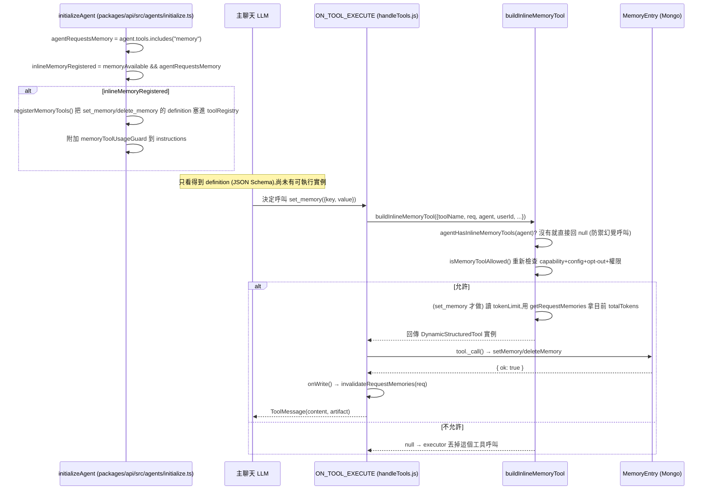
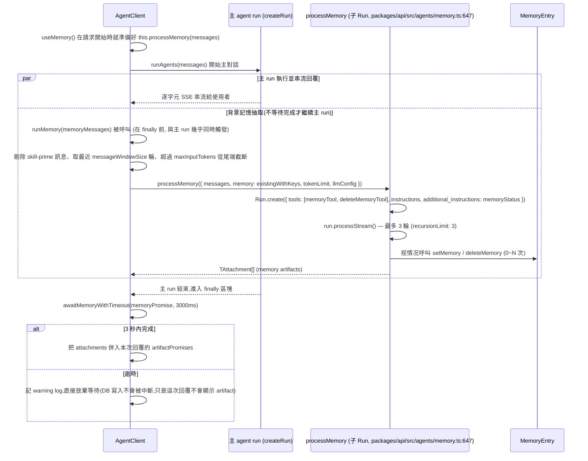

# 12. 記憶系統

## 定位

記憶系統(Memory System)解決的問題是:**跨對話(cross-conversation)的使用者長期事實該存在哪、怎麼寫入、怎麼在下一次對話開始時餵回給 LLM**。它與「單一對話內的上下文管理」(訊息視窗、summarization、context pruning)是兩個不同的子系統——後者管的是「這次對話塞得下多少 token」,記憶系統管的是「使用者說過『記住我喜歡用 TypeScript』之後,三天後開新對話 LLM 還記不記得」。

LibreChat 的記憶系統本質上是一個**極簡的 key-value 事實庫**(每個使用者一組 `key → value` 字串),不是向量資料庫、不做語意檢索(semantic search)。它刻意選擇「顯式、人類可讀、可編輯」的儲存模型,而不是走 embedding + RAG 的路線。這個選擇決定了後面所有的設計:沒有 vector store、沒有 similarity search,寫入/讀取都是普通的 Mongo 文件查詢。

在整體架構中,記憶系統橫跨兩個 workspace,並與工具系統(見 `07-tool-system.md`)、agent 初始化管線(`packages/api/src/agents/initialize.ts`)緊密耦合:

- **寫入路徑一(inline tools)**:記憶被建模成兩個**一般工具**——`set_memory` / `delete_memory`。LLM 在對話進行中主動判斷「使用者要求我記住/忘記某件事」,像呼叫其他工具一樣呼叫它們。這條路徑走的是 07-tool-system.md 描述的「兩階段載入」(definitions-only → event-driven 執行)管線,`memory` 是一個 capability 字串,在 agent 初始化時展開成這兩個工具的 definition。
- **寫入路徑二(background memory agent)**:一個**獨立的、對使用者不可見的子 agent**,在每次主對話回覆產生後,把最近幾輪對話丟給一個(通常較小/便宜的)LLM,要求它主動判斷要不要呼叫 `set_memory`/`delete_memory` 來抽取記憶。這是「自動記憶」,不需要使用者明講「記住」。
- **讀取路徑**:每次建構新一輪的 system context 時,把使用者現有的記憶格式化成一段文字,注入 agent 的 `additional_instructions`(動態 system 尾巴)。

兩條寫入路徑共用同一個資料模型(`MemoryEntry`)、同一組底層 CRUD 方法(`MemoryMethods`)、同一種「工具回傳格式」(`content_and_artifact`),但生命週期完全不同:一個是「使用者這次對話裡當下決定」,一個是「回覆送出後背景異步分析」。理解這個雙路徑設計是理解整份文件的關鍵。

---

## 核心概念

### MemoryEntry:扁平 key-value,不是向量記憶

每個使用者的記憶是若干筆 `{ userId, key, value, tokenCount, updated_at }` 文件(`packages/data-schemas/src/schema/memory.ts:4`)。`key` 是語意分類(例如 `preferences`、`work_info`),`value` 是一句完整的自然語言描述。**同一個 `key` 只會有一筆記錄**——`setMemory` 用 `findOneAndUpdate(..., { upsert: true })` 做 upsert(`packages/data-schemas/src/methods/memory.ts:63`),所以呼叫 `set_memory` 兩次同一個 key 是「覆蓋」而非「新增」。這個特性直接影響 token 額度計算(見下文陷阱)。

### 兩種格式化輸出:`withKeys` / `withoutKeys`

`getFormattedMemories`(`packages/data-schemas/src/methods/memory.ts:130`)把使用者的所有記憶格式化成兩種字串:

- **`withoutKeys`**:`1. [2026-06-01]. 使用者喜歡用 TypeScript`——只有日期 + 內容,給**一般聊天 agent**看,讓它知道使用者背景但不暴露內部 key 結構。
- **`withKeys`**:`1. [2026-06-01]. ["key": "preferences"] [12 tokens]. ["value": "..."]`——多了 key 與 token 數,只給**掛了 inline 記憶工具的 agent**看,因為它要能對 `delete_memory`/`set_memory` 精準指定 key。

這個分流發生在 `api/server/controllers/agents/client.js:588-595`:`agentHasInlineMemoryTools(agent)` 為真的 agent 拿 `keyedMemoryContext`,其餘拿 `memoryContext`(unkeyed)。

### Inline tools vs Background agent 的心智模型

| 面向 | Inline tools(`set_memory`/`delete_memory`) | Background memory agent |
|---|---|---|
| 觸發者 | 主對話 LLM 自己判斷後呼叫 | 系統在回覆結束後強制呼叫一次背景子 run |
| 依附的 LLM | 就是使用者選的那個聊天模型 | 獨立設定的模型(`memory.agent`),預設 `gpt-4.1-mini` |
| 何時執行 | 對話進行中,佔用主 run 的一個 tool round |
| 是否阻塞回覆 | 是(工具呼叫是主 run 的一部分) | 否,異步跑,3 秒 timeout 內若沒完成就直接放棄等待,已寫入的記憶仍會生效(fire-and-forget) |
| 開關 | agent 的 `tools` 陣列裡有 `"memory"` marker + admin capability + 使用者權限 | `memory.agent.enabled: true`(顯式 opt-in,見下) |
| 使用者能否觀察 | 可以,對話裡看到「記憶已更新」的 artifact | 也可以,同一種 artifact 事件,使用者分不出是哪條路徑寫入的 |

### `Tools.memory` 是雙重身份的字串

`Tools.memory = 'memory'`(`packages/data-provider/src/types/assistants.ts:25`)在程式碼中同時扮演兩個角色,容易混淆:

1. **Agent capability 觸發標記**:`agent.tools` 陣列裡若含有字串 `"memory"`,代表這個 agent 想要 inline 記憶工具。它**不是**真正的工具名稱,執行期永遠不會有一個叫 `memory` 的 tool 被呼叫——`registerMemoryTools`(`packages/api/src/agents/memory.ts:400`)會把它展開成兩個真正的工具 `set_memory` / `delete_memory`。
2. **Artifact 的資料鍵**:任何工具的回傳可以夾帶 `artifact[Tools.memory]`,前端用這個鍵去判斷「這是一則記憶更新事件」(`packages/data-provider/src/schemas.ts:838-861`)。

`agentHasInlineMemoryTools`(`packages/api/src/agents/memory.ts:446`)特別註解:這個判斷「絕不會」因為某個 MCP 工具剛好也叫 `set_memory`/`delete_memory` 而誤判——因為它檢查的是 capability marker,不是工具名稱字串比對。

### `content_and_artifact` 回傳格式:雙通道輸出

`set_memory`/`delete_memory` 都用 `@librechat/agents` 的 `tool()`(LangChain 風格)包裝,並宣告 `responseFormat: 'content_and_artifact'`(`packages/api/src/agents/memory.ts:253`)。工具函式回傳一個 tuple `[content, artifact]`:

- `content`:一句給 **LLM 看**的簡短字串(如 `Memory set for key "preferences" (12 tokens)`),塞進 `ToolMessage.content`,會影響下一步 LLM 的推理。
- `artifact`:給 **應用層/前端看**的結構化資料(`{ [Tools.memory]: MemoryArtifact }`),不會進 LLM 的 context,只透過 `ON_TOOL_END` 事件流出,轉成 SSE `attachment` 事件推給前端。

這個雙通道設計把「LLM 該知道什麼」與「UI 該渲染什麼」徹底解耦,是整個工具系統(不只記憶)的通用模式。

### 權限與 opt-out:三層閘門

記憶系統疊了三層獨立的「能不能用」判斷,任何一層擋下就不生效:

1. **Admin capability**:`AgentCapabilities.memory` 有沒有列在 `librechat.yaml` 的 `endpoints.agents.capabilities`(預設有,見 `defaultAgentCapabilities`,`packages/data-provider/src/config.ts:691`)。
2. **功能設定**:`memory.disabled` 是否為 `true`(`isMemoryEnabled`,`packages/data-schemas/src/app/memory.ts:33`)。
3. **RBAC 權限**:角色是否有 `PermissionTypes.MEMORIES` 底下的 `USE`/`CREATE`/`UPDATE`/`READ`/`OPT_OUT`(`packages/data-provider/src/permissions.ts:164`)。
4. **使用者個人 opt-out**:`user.personalization.memories === false`(`packages/data-schemas/src/schema/user.ts:134`),使用者自己在設定裡關掉「引用已儲存記憶」。

第 4 層是使用者專屬開關,與角色權限正交——即使角色允許,使用者個人仍可關閉。三處各自獨立檢查這四層(`isMemoryToolAllowed`、`memoryAvailable`、`useMemory()`),沒有共用單一 gate 函式,這是刻意的「執行期重驗證」設計(見〈陷阱〉一節)。

---

## 架構與流程

### 讀取路徑:記憶如何被注入對話

```
使用者發送訊息
    │
    ▼
AgentClient.buildMessages()  (api/server/controllers/agents/client.js)
    │
    ├─ useMemory()
    │    ├─ 權限檢查 (USE) + opt-out 檢查 + memory.disabled 檢查
    │    ├─ getRequestMemories(req, userId)  ← per-request 快取 (WeakMap)
    │    │      → db.getFormattedMemories({ userId })
    │    │      → { withKeys, withoutKeys, totalTokens }
    │    └─ isMemoryAgentEnabled(memoryConfig)?
    │           true  → 順便 initializeAgent(memory.agent) 準備背景抽取用的 processMemory()
    │           false → 只回傳格式化字串,不準備背景抽取
    │
    ▼
buildMemoryContext(text) = "memoryInstructions\n\n# Existing memory...\n" + text
    │
    ├─ agent 有 inline 記憶工具? → keyedMemoryContext (withKeys)
    └─ 其他 agent              → memoryContext (withoutKeys)
    │
    ▼
applyContextToAgent()  (packages/api/src/agents/context.ts:139)
    → agent.additional_instructions = 舊值 + "\n\n" + sharedRunContext(含記憶文字)
    │
    ▼
Graph/Run 執行,LLM 在 system prompt 尾巴看到「# Existing memory about the user: ...」
```

關鍵:記憶**不是**存成一則歷史訊息,也**不會**被摘要/裁剪邏輯動到——它每次請求都是即時從 DB 重新查詢、重新格式化、重新拼進 `additional_instructions`,屬於 06-llm-providers.md/上下文管理文件描述的「動態 system 尾巴」機制的一部分。

### 寫入路徑一:Inline tools(event-driven 執行)

這條路徑完全複用 07-tool-system.md 描述的「definitions-only → ON_TOOL_EXECUTE 才實例化」管線,記憶只是眾多工具之一,但多了兩層閘門:



**為什麼要在執行期(`buildInlineMemoryTool`)重新驗證,而不是只在 `initializeAgent` 驗證一次就好?** 因為 event-driven 執行器是「按 LLM 回報的工具名稱」現查現建(`loadToolsForExecution`,見 07-tool-system.md),不是重放初始化時決定好的清單。理論上一個惡意/被劫持的 provider 回應可以「幻覆」出一個 `set_memory` 呼叫,即使該 agent 從未在 definitions 註冊過這個工具;`agentHasInlineMemoryTools` + `isMemoryToolAllowed` 的雙重再檢查就是防這種情況(`packages/api/src/agents/memory.ts:497-537`)。

### 寫入路徑二:Background memory agent(異步抽取)



要點:

- `useMemory()` 在請求一開始就決定「這次要不要跑背景抽取」,並把 `processMemory` 閉包存在 `this.processMemory` 供稍後呼叫(`api/server/controllers/agents/client.js:782-797`)。
- 真正觸發抽取是在 `runAgents` 內、與主 LLM 呼叫**幾乎同時**發起(`client.js:1541-1543`),不是等主回覆完全結束才開始——這樣才能在主回覆完成的瞬間就已經有進度,把「使用者等待時間」降到最低。
- 背景抽取有自己獨立的 `Run`(`Run.create`,`packages/api/src/agents/memory.ts:825`),掛的是 `memory.agent` 設定的模型與 instructions,`recursionLimit: 3` 限制最多跑 3 輪 tool loop,避免抽取 agent 失控迴圈。
- 逾時(3 秒)只是「這次 HTTP 回應不等它了」,`setMemory`/`deleteMemory` 本身的 DB 寫入 promise 不會被取消,寫入通常仍會完成,只是這次回覆的 SSE 流裡看不到 artifact 事件(下次刷新記憶面板才看得到)。

### 記憶如何顯示在對話裡:artifact → attachment → SSE

不論走哪條寫入路徑,只要工具呼叫回傳了 `artifact[Tools.memory]`,`ON_TOOL_END` callback 就會把它轉成統一的 `TAttachment`(`type: Tools.memory`)並用 SSE `event: attachment` 推給前端(`api/server/controllers/agents/callbacks.js:731-751` 給主 run 用;`packages/api/src/agents/memory.ts:928-969` 的 `handleMemoryArtifact` 給背景 run 用——兩份程式碼刻意同構,只是分屬「主工具集」與「獨立記憶子 run」兩個 callback 注冊點)。前端 `MemoryArtifacts.tsx` 只認 `attachment[Tools.memory]`,完全不知道也不需要知道這是 inline 呼叫還是背景抽取寫入的。

---

## 關鍵資料結構

### `MemoryEntry`(MongoDB collection,`packages/data-schemas/src/schema/memory.ts`)

| 欄位 | 型別 | 用途 |
|---|---|---|
| `userId` | `ObjectId`(ref `User`, indexed) | 記憶擁有者,所有查詢都以此為主鍵前綴 |
| `key` | `String`,`validate: /^[a-z_]+$/` | 記憶分類鍵,**schema 層強制只能小寫字母+底線**(見陷阱) |
| `value` | `String` | 記憶內容,一句完整自然語言描述 |
| `tokenCount` | `Number`,預設 `0` | 寫入當下用 `o200k_base` tokenizer 算好存起來,避免每次讀取都重算 |
| `updated_at` | `Date`,預設 `Date.now` | 排序依據(`getFormattedMemories` 依此升冪排序);沒有 `created_at` |
| `tenantId` | `String`,indexed(optional) | 多租戶隔離用,由 `applyTenantIsolation` mongoose plugin 注入(企業版特性) |

沒有 `_id` 以外的複合唯一索引——`(userId, key)` 唯一性是靠應用層邏輯(`findOneAndUpdate` upsert / `createMemory` 先 `findOne` 再擋)保證,不是 DB 層 unique index。

### `TMemoryConfig`(`librechat.yaml` 的 `memory:` 區塊,`packages/data-provider/src/config.ts:1700`)

| 欄位 | 型別 | 預設 | 用途 |
|---|---|---|---|
| `disabled` | `boolean?` | `undefined`(視為啟用) | 整體關閉記憶系統(讀取+兩種寫入路徑全關) |
| `validKeys` | `string[]?` | 不限制 | 白名單化允許的 `key`;為空則任意字串皆可(仍受 schema regex 限制) |
| `tokenLimit` | `number?` | 不限制 | 全體記憶 value 的 token 上限(inline 與 background 兩路徑共用同一個總量計算) |
| `charLimit` | `number` | `10000` | 單筆 `value` 字元數上限,inline 工具與 REST route 都會檢查 |
| `maxInputTokens` | `number` | `12000`(`DEFAULT_MEMORY_MAX_INPUT_TOKENS`) | 背景抽取送進記憶 LLM 的「本輪對話」最多幾個 token(超過從尾端保留、從頭截斷) |
| `personalize` | `boolean` | `true` | 是否顯示個人化設定(schema 預設值存在,但目前前端可觀察到的顯示邏輯實際是走角色的 `OPT_OUT` 權限,見陷阱) |
| `messageWindowSize` | `number` | `5` | 背景抽取只看最近幾則訊息(且盡量從 user turn 切齊窗口起點) |
| `agent` | `{ enabled?, id }` \| `{ enabled?, provider, model, instructions?, model_parameters? }` | `undefined` | 背景抽取代理設定;`enabled` 必須顯式 `true`,否則就算給了合法 `id`/`provider`+`model` 也視為「只開讀取/inline,不跑背景抽取」 |

### 執行期資料結構(`packages/api/src/agents/memory.ts`)

| 名稱 | 型別 | 用途 |
|---|---|---|
| `MemoryArtifact` | `{ key, value?, tokenCount?, type: 'update'\|'delete'\|'error' }` | 工具回傳的結構化資料,`type: 'error'` 用於 token 超限等錯誤,攜帶 `errorType`/`tokenCount`/`totalTokens`/`tokenLimit` 的 JSON 字串塞進 `value` |
| `FormattedMemoriesResult` | `{ withKeys, withoutKeys, totalTokens? }` | `getFormattedMemories` 的回傳,分別餵給一般 agent 與 inline 記憶 agent |
| `MemoryConfig`(run-time) | `{ validKeys?, instructions?, llmConfig?, tokenLimit? }` | 傳給 `createMemoryProcessor`,是從 `TMemoryConfig` + 背景 agent 文件組出的執行期子集 |
| `requestMemoriesCache` | `WeakMap<object /* req */, Promise<FormattedMemoriesResult>>` | request-scoped 快取,同一請求內多個 agent/多次呼叫共用一次 DB 查詢 |

### REST API(`api/server/routes/memories.js`,掛載於 `/api/memories`)

| Method & Path | 權限 | 說明 |
|---|---|---|
| `GET /` | `USE + READ` | 回傳全部記憶(依 `updated_at` 新到舊)+ `totalTokens`/`tokenLimit`/`usagePercentage` |
| `POST /` | `USE + CREATE` | 新增(key 已存在回 409);做 `charLimit`/`tokenLimit`/1000 字元 key 上限檢查 |
| `PATCH /preferences` | `USE + OPT_OUT` | 切換 `user.personalization.memories`(**不是**改記憶內容,是切換「是否引用已存記憶」) |
| `PATCH /:key` | `USE + UPDATE` | 更新 value,或改名(換 key 走「先建新後刪舊」兩步,非原子) |
| `DELETE /:key` | `USE + UPDATE`(注意:刪除用的是 `UPDATE` 權限,不是額外的 `DELETE`) | 刪除單筆記憶 |

---

## 關鍵實作細節與陷阱

### 1. `writeChain`:序列化併發 `set_memory` 寫入以保護 token 額度

`createMemoryTool` 內部維護一個 `writeChain: Promise<unknown>`(`packages/api/src/agents/memory.ts:140`)。當一次 LLM 回應在 event-driven 模式下「並行」呼叫多次 `set_memory`(同一輪多個 tool_call),若各自獨立檢查 `tokenLimit`,會用同一份「舊的」`currentTotalTokens` 各自判斷「還沒超限」,結果兩筆加總後其實已經超限——典型的 check-then-act race condition。LibreChat 的解法是把每次呼叫串成一條 promise chain,強制序列執行、每次都用**最新**的 `currentTotalTokens` 判斷。同時用 `writtenTokensByKey`(`Map<key, tokenCount>`)追蹤「這個 instance 這輪已經寫過哪些 key、貢獻了多少 token」,確保同 key 覆寫是「置換」而非「疊加」計算。這是這份程式碼裡最精緻的併發控制,移植時務必保留這個語意,否則多工具並行呼叫下 tokenLimit 形同虛設。

### 2. Schema 的 `key` 正則與 `validKeys` 設定可能互相打架

`MemoryEntrySchema` 的 `key` 欄位有 Mongoose `validate: /^[a-z_]+$/`(`packages/data-schemas/src/schema/memory.ts:15`),但 `librechat.yaml` 的 `validKeys` 只是 `z.array(z.string())`,**不限制字元集**。如果 admin 在 `validKeys` 填了 `"work-info"`(連字號)或 `"workInfo"`(駝峰)這種不符合 schema 正則的字串,LLM 照著 valid keys 提示去呼叫 `set_memory`,`createMemoryTool` 的驗證會過(因為它只檢查 key 是否在 `validKeys` 清單裡),但底層 `setMemory` 對 Mongoose 做 `findOneAndUpdate` 時會觸發 schema validation 錯誤,被 try/catch 吞掉變成「Failed to set memory」回給 LLM——現象是「這個 key 永遠存不進去,但錯誤訊息看不出為什麼」。移植時建議要嘛把 key 格式限制上移到 `validKeys`/工具 schema 的驗證層並保持與儲存層一致,要嘛乾脆不限制字元集。

### 3. `set_memory` 與 `delete_memory` 的邊界檢查不對稱

`set_memory` 檢查 `key` 長度(`MEMORY_KEY_CHAR_LIMIT = 1000`)、`value` 長度(`charLimit`)、token 額度;`delete_memory`(`createDeleteMemoryTool`,`packages/api/src/agents/memory.ts:275`)只檢查 `validKeys`,不檢查 key 長度。實務影響不大(刪除本來就是查找操作),但如果移植時把「輸入驗證」抽成共用中介層,注意不要一刀切套用同一組規則。

### 4. `key.toLowerCase() === 'nothing'` 的隱藏保留字

`createMemory`/`setMemory`(`packages/data-schemas/src/methods/memory.ts:34,70`)都硬編碼:如果 `key` 小寫後等於 `'nothing'`,直接回 `{ ok: false }` 且**不寫入、不報錯**。這是防禦「LLM 誤用工具、把『沒有要記的東西』當成 key 傳進來」的守門判斷,但完全沒有文件或常數化,是一個容易被忽略、也容易被誤觸(使用者剛好想存一個叫 `nothing` 的 key)的魔術字串。

### 5. 背景抽取的「輸入視窗」是雙重截斷

`runMemory`(`api/server/controllers/agents/client.js:851`)對送進記憶 LLM 的內容做兩層限制:先用 `messageWindowSize`(預設 5)取最近幾則訊息(且盡量讓視窗起點對齊 user turn),再用字元估算(`MEMORY_INPUT_CHARS_PER_TOKEN = 8`)搶先粗篩一次避免組出過大字串,最後才用真正的 tokenizer(`processTextWithTokenLimit`)做精確截斷,`preserve: 'end'` 保留字串尾端(最新內容)。三層是為了性能(先用便宜的字元估算擋掉離譜過大的輸入,才進行昂貴的精確 tokenize)。移植時如果偷懶只做一層精確 tokenize,在超長對話下每次背景抽取都要跑一次完整 tokenizer,累積起來是可觀的 CPU 成本。

### 6. `personalize` 設定欄位目前未被前端直接讀取

`memorySchema.personalize` 預設 `true`,YAML 註解宣稱「設 `false` 使用者看不到 Personalization tab」,但實際追蹤程式碼,前端「是否顯示個人化功能」是由角色權限 `PermissionTypes.MEMORIES.OPT_OUT` 決定(`client/src/hooks/usePersonalizationAccess.ts`),不是直接讀這個 YAML 欄位。移植時如果要重現這個開關,记得让它真正接到前端可見性判斷,不要只停留在 schema 定義。

### 7. Background agent 是「顯式 opt-in」,這是一個近期的行為變更

`loadMemoryConfig`(`packages/data-schemas/src/app/memory.ts:19`)特別檢查:如果 admin 設了 `memory.agent`(給了 `id` 或 `provider`+`model`)卻沒寫 `enabled: true`,會印一條 warning log 提醒「自動記憶抽取現在是 opt-in」。也就是說單純填好 `memory.agent.id` **不會**自動啟用背景抽取——這是刻意的行為改變(可能是為了避免 admin 誤以為配了 agent 就會自動抽取,結果每輪對話都在偷偷呼叫一個額外的 LLM 產生費用)。這是一個「文件容易寫錯、使用者容易設錯」的地雷,值得在自己的系統設計時參考——**任何會產生額外 LLM 呼叫成本的自動化行為,預設值應該是關閉**。

### 8. `getRequestMemories` 的 WeakMap 快取用 `req` 物件本身當 key

`requestMemoriesCache = new WeakMap<object, Promise<FormattedMemoriesResult>>()`(`packages/api/src/agents/memory.ts:468`)用 Express 的 `req` 物件當 key。這只在**單一 Node process、同步的 request 生命週期**內有意義——`req` 物件一旦離開作用域被 GC,WeakMap entry 自動消失,不需要手動清理,設計本身沒問題。但這意味著它**天生不能跨 process/跨 serverless function instance 共享**,移植到 serverless(Vercel Functions)環境時,每個 function invocation 是全新記憶體空間,這個快取模式自動失效(也不需要特別処理,因為請求本來就是隔離的)——只是不要誤以為它是「效能優化用的分散式快取」,它只是同一請求內部避免重複查詢。

### 9. 3 秒逾時是「使用者體驗妥協」,不是「資料一致性保證」

`awaitMemoryWithTimeout`(`api/server/controllers/agents/client.js:622`)存在的理由是背景記憶 LLM 呼叫可能比主對話回應慢,若無限期等待會拖慢使用者感知的回覆時間。3 秒後放棄等待只影響「這次回覆要不要把 memory artifact 塞進 SSE 流」,`setMemory`/`deleteMemory` 的 Mongo 寫入 promise 早已獨立在背景繼續跑(`processMemory` 內的 `Run.processStream` 沒有被 abort)。換句話說,使用者可能看不到這次回覆下方的「記憶已更新」提示,但下次打開記憶面板(`GET /memories`)資料其實已經寫進去了——這是一個「使用者體感」與「後端真實狀態」短暫不一致的視窗,務必在移植時保留一致的心智模型说明(否则容易被误判成 bug)。

### 10. Bedrock / Anthropic / GPT-5 的 provider-specific 補丁集中在 `processMemory`

背景抽取共用一個 `LLMConfig`,但要相容多個 provider 的怪癖(`packages/api/src/agents/memory.ts:709-768`):Bedrock Converse API 不接受對話以 system message 開頭,所以 instructions 被塞進第一則 user message;Bedrock/Anthropic 開啟 thinking 時 temperature 必須是特定值或整個拿掉;GPT-5 系列拿掉 `temperature`、把 `maxTokens` 搬到 `modelKwargs.max_completion_tokens`/`max_output_tokens`。這些都是**與記憶功能本身無關、純粹是「這個 LLM 呼叫路徑剛好也要相容多 provider」**的技術債,說明了 LibreChat 選擇用同一份 `@librechat/agents` LLM 抽象貫穿全站(聊天 + 背景記憶 + 其他子 agent),好處是一套相容邏輯到處用,壞處是這些 provider 特例程式碼會一直增生、且分散在多個呼叫點(聊天路徑與記憶路徑各自都要處理一次)。

### 11. `tenantId` 是企業版隔離機制,單租戶自架不需要

`MemoryEntrySchema.tenantId` 由 `applyTenantIsolation` mongoose plugin 自動注入查詢/寫入條件(`packages/data-schemas/src/models/plugins/tenantIsolation.ts`),行為受 `TENANT_ISOLATION_STRICT` 環境變數控制。純自架/單租戶部署不會用到,但如果你的新平台一開始就要多租戶,這是一個「用 Mongoose middleware 全域攔截 query」的實作模式,搬到 Postgres 上更適合用 Row-Level Security(RLS)取代應用層攔截。

---

## 設計決策分析

### 為什麼是扁平 key-value,不是向量記憶(embedding + similarity search)?

**優點**:實作極簡(一張表、幾個 CRUD 函式)、使用者完全可讀可編輯(記憶面板能直接看到「AI 記得我什麼」並手動修正/刪除)、沒有 embedding model 依賴與相似度門檻調參問題、沒有「檢索到不相關記憶污染 context」的風險。**缺點**:無法處理「語意相近但字面不同」的查詢與去重(LLM 可能對同一件事用不同 key 存了兩次)、無法做大量記憶下的「相關性篩選」(目前是**全部記憶都塞進 context**,沒有 top-k 檢索,記憶一多就會把 system prompt 撐大)、`validKeys` 這種白名單機制本質上是用「人工設計分類體系」取代「語意聚類」,擴展性有限。

若重做:這是一個典型的「先求正確可控,再談智能」設計。對於一個新平台,如果記憶量體預期會成長到幾十上百筆,值得引入**混合模式**——保留 key-value 的顯式可編輯層(給使用者信任感與可控性),同時對 `value` 做 embedding 存進向量欄位(Postgres 用 `pgvector`),讀取時用「顯式 key 優先 + embedding top-k 補充」的兩段式檢索,而不是無條件全塞。這樣使用者仍能看懂、能刪、能改,但記憶量大時不會無限膨脹 context。

新專案的 AI 框架目前**尚未定案**(候選:LangGraph、LangChain、deepagents、Vercel AI SDK,完整比較見 `19-framework-options.md`),而框架選擇會直接影響「這個混合模式要不要自己組裝」:LangGraph 原生提供 `Store`/`BaseStore` 抽象——支援 cross-thread 的 key-value 記憶,部分實作還能掛語意索引做 similarity search,等於上面說的「混合模式」有現成的執行期基礎可以直接搭;LangChain(`createAgent`)底層就是 LangGraph,同樣能掛同一套 `Store`,只是需要自己組裝進 agent 的記憶讀寫邏輯;deepagents 更進一步,內建以檔案系統為介面的持久記憶(`AGENTS.md` 風格)與 `createMemoryMiddleware`,語意上更接近「筆記式」記憶而非嚴格的 key-value schema,若採用它,`validKeys`/`tokenLimit` 這類 LibreChat 現有的結構化約束需要自行在 middleware 層補上才能對齊本文件描述的行為。反觀 Vercel AI SDK 沒有對應的框架內建記憶抽象——這反而代表本文件現有的、框架中立的 DB key-value 設計(見下方「移植到新技術棧的建議」)幾乎可以照抄,不需要額外適配。換句話說,選 LangGraph 系框架時,「要不要用框架原生 `Store`/檔案系統取代自建 CRUD」是一個值得在選型階段就決定的架構問題;選 ai-sdk 時則沒有這個選項,本文件的設計就是最終形態。

### 為什麼 inline tools 與 background agent 是兩套獨立機制,而非合一?

如果只有 inline tools,使用者必須明確說「幫我記住」,系統才會寫入——這對「使用者隨口提到的重要資訊」(如「我下週要去東京出差」)完全捕捉不到,除非使用者自己意識到要求 AI 記住。如果只有 background agent,則失去了使用者「主動、確定性地要求記住/忘記」的即時回饋與控制感(而且背景 agent 抽取有 3 秒逾時的不確定性,不適合當作使用者唯一的記憶控制手段)。兩者並存讓使用者路徑(高信任、確定)與自動路徑(低摩擦、機率性)互補,而且刻意共用同一套底層 CRUD 與同一種 artifact 呈現,讓使用者不需要理解背後有兩套機制。

代價是複雜度:同一份邏輯(token 限制、`validKeys` 驗證、artifact 產生)要在兩個呼叫路徑(`buildInlineMemoryTool` vs `createMemoryProcessor`/`processMemory`)各自維護一份 gate 檢查,程式碼裡看得出刻意 DRY(共用 `createMemoryTool`/`createDeleteMemoryTool` 本體),但「什麼時候該跑」「跑之前要過哪些權限檢查」這兩層還是各自獨立實作了一次。若重做,可以考慮把「權限+設定 gate」抽成單一個 `resolveMemoryAccess(req)` 純函式,兩條路徑都呼叫它,減少三處(`isMemoryToolAllowed`、`memoryAvailable`、`useMemory`)幾乎相同但獨立維護的判斷式。

### 為什麼執行期還要重新驗證權限,而不是信任初始化階段的結果?

這是 event-driven 工具執行模型(07-tool-system.md)的必然結果:工具「定義」與「實例」分離載入,執行器收到的是 LLM 回報的工具名稱字串,必須假設這個輸入不可信(可能是模型幻覺、可能是被工程化的 prompt injection 誘導呼叫未授權工具)。這個「執行期零信任重驗證」模式值得整份工具系統統一採用,記憶只是其中一個例子。

---

## 移植到新技術棧的建議

> 新專案的 AI 框架尚未定案(LangGraph / LangChain / deepagents / Vercel AI SDK 四個候選,完整比較見 `19-framework-options.md`)。以下 PostgreSQL、Hono、Redis、Next.js 的建議與框架選擇無關,可直接採用;框架相關的差異集中在「依候選框架而異的移植做法」一節。

### PostgreSQL Schema 草案

```sql
CREATE TABLE memory_entries (
  id            uuid PRIMARY KEY DEFAULT gen_random_uuid(),
  user_id       uuid NOT NULL REFERENCES users(id) ON DELETE CASCADE,
  tenant_id     uuid,                          -- 多租戶時使用,單租戶可省略此欄 + RLS
  key           text NOT NULL,
  value         text NOT NULL,
  token_count   integer NOT NULL DEFAULT 0,
  -- embedding    vector(1536),                -- 若採混合檢索模式,見「設計決策分析」
  updated_at    timestamptz NOT NULL DEFAULT now(),
  created_at    timestamptz NOT NULL DEFAULT now(),
  UNIQUE (user_id, key)                        -- 直接在 DB 層保證唯一,比 LibreChat 的應用層 upsert 更安全
);

CREATE INDEX idx_memory_entries_user_updated ON memory_entries (user_id, updated_at DESC);

-- 用 CHECK constraint 或 app 層 zod 驗證 key 格式,兩邊務必保持同一份規則
-- 避免 LibreChat 「validKeys 允許但 schema 正則拒絕」的陷阱 (見陷阱#2)
ALTER TABLE memory_entries ADD CONSTRAINT memory_key_format
  CHECK (key ~ '^[a-z0-9_]+$');
```

若要支援使用者 opt-out 與角色權限,對應 LibreChat 的 `user.personalization.memories` 與 `role.permissions.MEMORIES`:

```sql
ALTER TABLE users ADD COLUMN memories_enabled boolean NOT NULL DEFAULT true;

-- 角色權限走既有的 role_permissions jsonb 設計(參考其他文件的角色權限章節)
-- role_permissions->'memories' = {"use": true, "create": true, "update": true, "read": true, "opt_out": true}
```

### Hono route / middleware 對應

```ts
const memories = new Hono();
memories.get('/', requireMemoryPermission(['use', 'read']), listMemoriesHandler);
memories.post('/', requireMemoryPermission(['use', 'create']), createMemoryHandler);
memories.patch('/preferences', requireMemoryPermission(['use', 'opt_out']), updatePreferencesHandler);
memories.patch('/:key', requireMemoryPermission(['use', 'update']), updateMemoryHandler);
memories.delete('/:key', requireMemoryPermission(['use', 'update']), deleteMemoryHandler);
```

- `requireMemoryPermission` 是一個 middleware 工廠,對應 `generateCheckAccess`,內部同時檢查:admin capability(`memory.disabled`)、角色權限(全部列出的 permission 都要為真,AND 語意)、使用者 opt-out(`memories_enabled`)。**強烈建議把這三層 gate 合成一個函式**(對應〈設計決策分析〉裡的 `resolveMemoryAccess` 建議),LibreChat 分散在三處實作是技術債,不必照抄。
- 注意路由順序:`/preferences` 這種靜態路徑必須排在 `/:key` 動態路徑**之前**注冊,否則會被 `:key` 吃掉(Hono 與 Express 都有這個坑,LibreChat 的路由檔案順序已經是對的,照抄順序即可)。

### 依候選框架而異的移植做法

四個候選框架對記憶系統的影響程度不對稱:LangGraph 系(LangGraph 本身、LangChain 的 `createAgent`、deepagents)因為 `@librechat/agents` 本就是 LangGraph 封裝,`tool()`、`content_and_artifact`、`recursionLimit` 這些 LibreChat 現有機制幾乎可以直接照抄;選 Vercel AI SDK 則要自建較多能力。以下只列與記憶系統直接相關的差異,完整框架比較見 `19-framework-options.md`。

| 面向 | LangGraph | LangChain(`createAgent`) | deepagents | Vercel AI SDK |
|---|---|---|---|---|
| 跨對話記憶抽象 | 原生 `Store`/`BaseStore`(cross-thread key-value,可選語意索引),需自行組裝成符合 `validKeys`/`tokenLimit` 的語意 | 同 LangGraph,`createAgent` 回傳的圖可直接掛同一顆 `Store` | 內建 `AGENTS.md` 風格檔案記憶 + `createMemoryMiddleware`,語意偏「筆記」而非嚴格 key-value,需在 middleware 補上結構化約束 | 無框架內建,需完全自建——正好對應本文件現有、框架中立的 Postgres key-value 設計,可直接照抄前文 SQL/Hono 段落 |
| 工具的雙通道回傳(`content_and_artifact`) | `@langchain/core` 的 `tool()` 原生支援,與 LibreChat 現有 `set_memory`/`delete_memory` 實作幾乎一比一對應 | 同 LangGraph | 同 LangGraph(`createDeepAgent` 底層也是同一套 `tool()`) | `ai` 套件的 `tool()` 沒有 `content_and_artifact` 概念,需自行在 `execute` 回傳物件裡切出「LLM 看的內容」與「UI 用的 artifact」兩個欄位,前端從 `toolInvocations`/`fullStream` 的 tool result part 裡自己拆 |
| 並行寫入的 `writeChain` 序列化保護 | 需要,`Store`/`tool()` 都不會自動處理併發 race condition | 同左 | 同左 | 同左——不論選哪個框架,`set_memory` 的 token 額度序列化寫入邏輯都要自己保留,可用 per-request mutex/queue,或資料庫層 `SELECT ... FOR UPDATE` 悲觀鎖 |
| Agent loop 步數上限 | `recursionLimit`,可直接照抄 LibreChat 現有的 `recursionLimit: 3` | 同 LangGraph | 同 LangGraph | `stopWhen: stepCountIs(3)` 限制背景抽取 agent 的最大步數,語意等價但 API 不同 |
| 工具載入模型 | definitions-only → 執行期才實例化(即 07-tool-system.md 描述的兩階段管線),與 LibreChat 現制一致 | 同 LangGraph | 同 LangGraph | `tool()` 天生「定義即實例」,沒有原生的兩階段分離;若要重現 07-tool-system.md 的 deferred tools 優化需自建 |

範例(以 ai-sdk 為例,因為這是四者中需要自建最多的):

```ts
const setMemory = tool({
  description: 'Saves important information about the user into memory.',
  parameters: z.object({
    key: z.string().describe(validKeys ? `Must be one of: ${validKeys.join(', ')}` : '...'),
    value: z.string().describe('A complete sentence describing the user information.'),
  }),
  execute: async ({ key, value }) => {
    // 對應 createMemoryTool 的 charLimit / tokenLimit / writeChain 序列化邏輯,
    // 在 streamText 的同一個 tool-call 批次裡可能被並行呼叫,序列化寫入的問題
    // 依然存在,仍需要類似 writeChain 的機制。
    const result = await db.upsertMemory({ userId, key, value, tokenCount });
    return { content: `Memory set for key "${key}"`, artifact: { key, value, type: 'update' } };
  },
});
```

若選 LangGraph 系框架,對應的寫法是把 `set_memory`/`delete_memory` 用 `@langchain/core` 的 `tool()` 包裝、宣告 `responseFormat: 'content_and_artifact'`,基本上就是把 `packages/api/src/agents/memory.ts` 的 `createMemoryTool`/`createDeleteMemoryTool` 原樣搬過去,再視情況決定要不要改用 `Store` 取代自建的 Postgres CRUD。

**背景抽取的執行模型**與框架選擇無關,但與部署平台有關:本專案採 docker-compose 自架、Hono 提供長駐 Node process,不像 Vercel Serverless/Edge Functions 有「回應送出後 function 隨時可能被凍結」的限制,因此 LibreChat 現有的「fire-and-forget + 3 秒 timeout」模式可以直接沿用,四個候選框架都不受影響。仍建議採用 Redis 佇列(見下)取代 in-process fire-and-forget,理由是更容易觀測與重試,而不是因為平台強制要求。若日後改採 serverless 部署,才需要框架各自的 durable 方案(例如 ai-sdk 的 `WorkflowAgent`、或 LangGraph 系的 checkpointer 存 thread 狀態供異步恢復)。

### Redis 的用途

- **背景記憶抽取佇列**(見上):取代 LibreChat 的「HTTP response 內 fire-and-forget promise」,用 Redis 佇列 + worker 是新架構下更可靠的等價設計。
- **per-request 記憶快取**:LibreChat 用 `WeakMap<req, Promise>`(陷阱#8),在單一 request 生命週期內去重查詢。若新平台的 request handler 本來就是單次函式呼叫(沒有跨多個 handler 共享 `req` 物件的機制),可以直接用一個簡單的 in-memory `Map` 或請求層 context 變數達到同樣效果,不需要引入 Redis;只有當「同一次使用者互動需要跨多個獨立 serverless invocation 共享」時才需要 Redis 快取(例如 SSE 串流拆成多個短連線的场景)。
- **rate limiting**:記憶寫入本身沒有 LibreChat 內建的 rate limit,但 `POST /memories`、`PATCH /:key` 這類使用者可直接觸發的寫入端點,建議在 Redis 加一個簡單的 sliding-window rate limiter,防止惡意/失控的客戶端狂寫。

### Next.js 前端考量

- **記憶面板**(對應 `MemoryPanel.tsx`/`MemoryList.tsx`):用 React Query 掛 `GET /memories`,CRUD mutation 後做樂觀更新或直接 invalidate。
- **SSE artifact 合併**(對應 `client/src/utils/memory.ts` 的 `handleMemoryArtifact`):對話進行中收到 `attachment` 事件且 `type === Tools.memory` 時,用同一份純函式邏輯把 `update`/`delete` 兩種 artifact 合併進記憶面板的 React Query cache,不必等下次 `GET /memories` 才刷新——這個「串流事件直接 patch 查詢快取」模式值得原樣保留,是很典型的「即時性 + 一致性」折衷解法,用 `queryClient.setQueryData` 對應 LibreChat 的 Recoil/Query cache 更新。
- **對話內顯示**(對應 `MemoryArtifacts.tsx`):在訊息下方渲染一個可展開的「記憶已更新」徽章,`type: 'error'` 時變成紅色錯誤態。驅動方式依框架而異:選 Vercel AI SDK 時可直接用 `useChat` 的 `toolInvocations`/UIMessage stream part(四個候選中前端串流協定最完整,見 `19-framework-options.md`);選 LangGraph 系框架時沒有對應的前端 hook,需要像 LibreChat 現制一樣自建 SSE `attachment` 事件解析與 React Query cache 合併。邏輯上兩者是等價的可展開摺疊 UI,差別只在事件來源怎麼接。
- **個人化設定 tab 的可見性**:對應角色權限的 `opt_out` 位元,不要照抄 LibreChat「schema 有欄位但前端沒接上」的半成品(陷阱#6),移植時把「要不要顯示個人化設定」明確接到同一組角色權限判斷。

### 建議捨棄或簡化的部分

- **`Tools.memory` 雙重身份的字串 overload**(capability marker 又是 artifact key):新平台用兩個不同名稱(如 `agent.capabilities` 陣列裡用 `'memory'`,artifact 型別用獨立的 `'memory_update'`)避免未來維護者混淆。
- **三處各自獨立實作的權限 gate**(`isMemoryToolAllowed`/`memoryAvailable`/`useMemory`):合併成單一 `resolveMemoryAccess()`,見上文設計決策分析。
- **`'nothing'` 魔術字串保留字**:不要沿用這種無文件的隱藏行為,若要防禦「LLM 誤呼叫」,用工具 description/schema 層面的更明確約束(如 `key` 加 `minLength` 或直接讓 LLM 回傳「不需要記憶」時完全不呼叫工具,而不是呼叫工具傳一個哨兵值)。

---

## 出處索引(關鍵行號)

- 核心邏輯(TS):`packages/api/src/agents/memory.ts` — `createMemoryTool:118`、`createDeleteMemoryTool:275`、`memoryToolUsageGuard:339`、`getMemoryToolDefinitions:350`、`registerMemoryTools:400`、`agentHasInlineMemoryTools:446`、`getRequestMemories:470`/`invalidateRequestMemories:493`、`isMemoryToolAllowed:504`、`buildInlineMemoryTool:545`、`processMemory:647`、`createMemoryProcessor:874`、`handleMemoryArtifact:928`、`createMemoryCallback:979`。
- 資料模型(TS):`packages/data-schemas/src/schema/memory.ts`、`models/memory.ts`、`methods/memory.ts`(`setMemory:63`、`createMemory:27`、`deleteMemory:99`、`getFormattedMemories:130`、`deleteAllUserMemories:173`)、`types/memory.ts`、`app/memory.ts`(`loadMemoryConfig:15`、`isMemoryEnabled:33`、`isMemoryAgentEnabled:37`)。
- 設定 schema:`packages/data-provider/src/config.ts:1698-1725`(`memorySchema`、`DEFAULT_MEMORY_MAX_INPUT_TOKENS`)、`:691`(`defaultAgentCapabilities` 含 `memory`)。
- 權限:`packages/data-provider/src/permissions.ts`(`PermissionTypes.MEMORIES:22`、`Permissions` enum:`129`、`memoryPermissionsSchema:164`)、`packages/api/src/middleware/access.ts:85`(`checkAccess`)。
- Agent 初始化整合:`packages/api/src/agents/initialize.ts:1102-1116`(inline memory 展開)、`packages/api/src/agents/context.ts:139`(`applyContextToAgent`)。
- Express/JS 整合層:`api/app/clients/tools/util/handleTools.js:363-373`(inline tool 註冊到 executor)、`api/server/services/Endpoints/agents/initialize.js:162-171`(`memoryAvailable` 閘門)、`api/server/controllers/agents/client.js`(`useMemory:647`、`runMemory:851`、`awaitMemoryWithTimeout:622`、記憶 context 注入 `530-611`、背景抽取觸發 `1541-1543`、finally 中 await `1715-1719`)、`api/server/controllers/agents/callbacks.js:647-751`(`createToolEndCallback`,memory 分支在 `731`)。
- REST API:`api/server/routes/memories.js`(完整 CRUD + preferences)。
- 使用者/角色:`packages/data-schemas/src/schema/user.ts:134`(`personalization.memories`)、`methods/user.ts:339`(`toggleUserMemories`)、`packages/data-schemas/src/models/plugins/tenantIsolation.ts`(多租戶隔離)。
- 前端:`client/src/components/SidePanel/Agents/Memory.tsx`(agent builder 勾選 `memory` capability)、`client/src/components/Nav/Settings/MemoryToggle.tsx`(opt-out 開關)、`client/src/hooks/Roles/useHasMemoryAccess.ts`、`client/src/hooks/usePersonalizationAccess.ts`、`client/src/utils/memory.ts`(`handleMemoryArtifact` 前端快取合併)、`client/src/components/Chat/Messages/Content/MemoryArtifacts.tsx`/`MemoryInfo.tsx`、`client/src/components/SidePanel/Memories/*`(記憶面板 CRUD UI)。
- 型別:`packages/data-provider/src/schemas.ts:838-861`(`MemoryArtifact`、`TAttachmentMetadata`)、`packages/data-provider/src/types/assistants.ts:25`(`Tools.memory`)。
- 設定範例:`librechat.example.yaml:844-869`。
