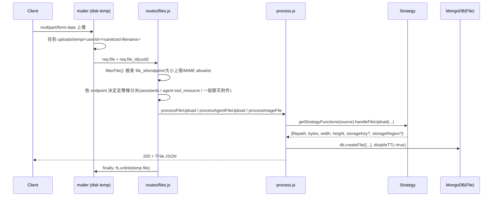
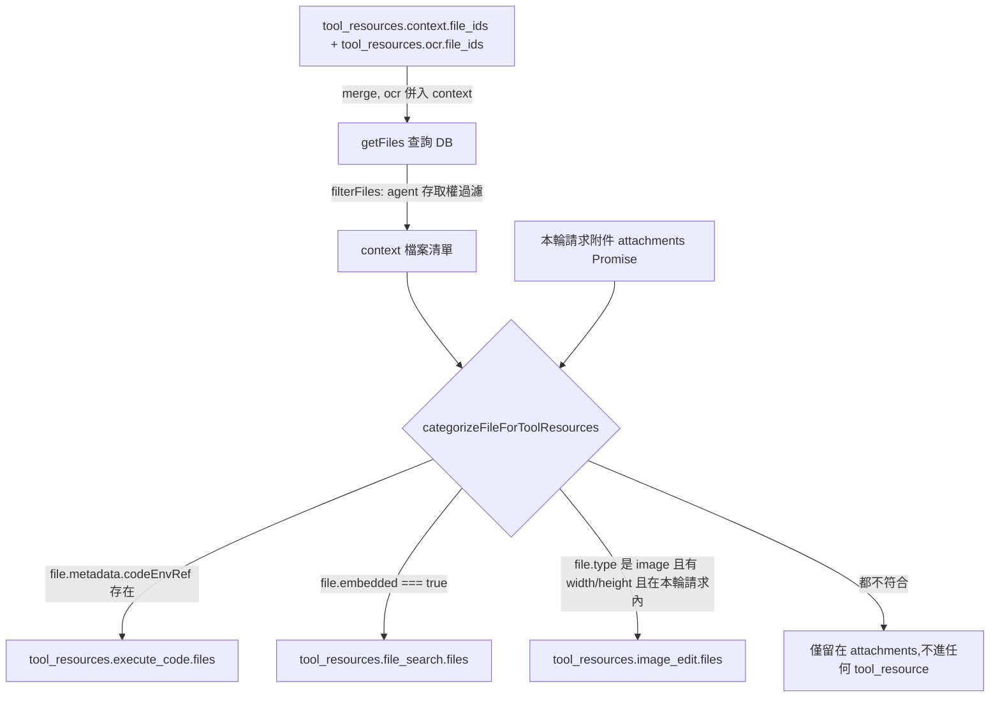
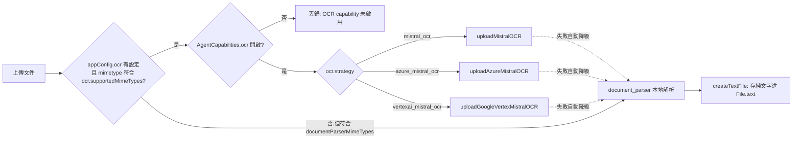
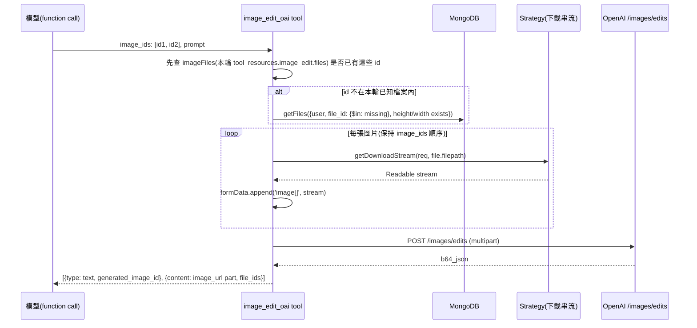

# 13. 檔案與多模態

## 定位

一個 AI agent 平台除了純文字對話,幾乎必然要處理「檔案」這個維度:使用者上傳圖片/PDF/Office 文件、模型輸出圖片(image generation/image edit)、程式碼直譯器產生的輸出檔、RAG 用的向量化文件、語音輸入輸出等。這些需求彼此耦合但關注點不同:

- **儲存**:檔案二進位內容要放哪裡(本地磁碟、物件儲存、第三方 API)。
- **中介資料**:每個檔案在 DB 裡要有一筆記錄,記住它是誰的、屬於哪個對話/agent/tool_resource、多大、什麼類型。
- **格式轉換**:給人看(縮圖、預覽)與給模型看(base64/URL/provider 專屬格式)是兩種完全不同的資料形狀。
- **工具路由**:同一個檔案，依照使用情境要餵給不同的工具(code interpreter 的沙箱、RAG 的向量庫、image_edit 的視覺輸入),不能讓每個工具各自寫一套判斷邏輯。
- **生命週期**:上傳的暫存檔案何時該過期、模型生成的圖片放多久、被刪除的 agent 遺留檔案怎麼清。
- **存取控制**:檔案下載/刪除要驗證擁有者身份,還要處理「透過分享的 agent 間接取得檔案存取權」這種間接授權。

LibreChat 把這一整塊放在 `api/server/services/Files/`(舊版 JS,已大量拆到 `packages/api/src/files/` 與 `packages/api/src/storage/` 的 TypeScript 實作)+ `api/server/routes/files/`(HTTP 層)+ `packages/api/src/agents/resources.ts`(agent 執行前的檔案分流)。本文件涵蓋這整條鏈路:儲存策略模式、上傳管線、圖片處理與編碼、OCR 三策略、tool_resources 檔案分流、image_edit 圖生圖、以及檔案存取權與 TTL。

不在本文件範圍:agent 工具呼叫本身的 loop 機制(見另一份工具/agent 文件)、code interpreter 沙箱協定細節(見 code-execution 相關文件)、RAG 向量庫索引策略(見 RAG 文件)。這裡只談「檔案」這個橫切關注點如何被這些子系統共用。

## 核心概念

| 名詞 | 說明 |
|---|---|
| `FileSources` | 儲存後端列舉:`local` / `s3` / `cloudfront` / `azure_blob` / `firebase` / `openai` / `azure`(OpenAI 相容) / `vectordb` / `execute_code` / `mistral_ocr` / `azure_mistral_ocr` / `vertexai_mistral_ocr` / `document_parser` / `text`。注意:除了真正的「儲存後端」,OCR 服務、code 沙箱、向量庫也被建模成「假的儲存來源」,因為它們同樣需要「upload/delete/download」這組操作,套用同一個策略介面最省工。 |
| Strategy Functions | 每個 `FileSources` 對應一組函式:`handleFileUpload` / `saveURL` / `getFileURL` / `saveBuffer` / `deleteFile` / `prepareImagePayload` / `processAvatar` / `handleImageUpload` / `getDownloadStream` / `getDownloadURL`。不支援的操作明確給 `null`,呼叫端要自己檢查。 |
| `FileContext` | 檔案的「用途」標籤:`avatar` / `agents` / `assistants` / `execute_code` / `image_generation` / `assistants_output` / `message_attachment` / `skill_file` 等。決定要用哪一種儲存策略(`getFileStrategy`)、要不要套用保留期限。 |
| `EToolResources` | agent 的 `tool_resources` 底下的分類鍵:`code_interpreter` / `execute_code` / `file_search` / `image_edit` / `context` / `ocr`。同一份使用者上傳的檔案,依照它的「性質」(有沒有 embedding、有沒有 codeEnvRef、是不是有寬高的圖片)被分派到不同的鍵下,再組成 prompt 給模型或工具消費。 |
| `TFile` / `IMongoFile` | 檔案的中介資料模型(`packages/data-provider/src/types/files.ts` + `packages/data-schemas/src/schema/file.ts`)。一筆記錄同時扛「儲存位置」「業務語意(context/tool_resource 關聯)」「生命週期(expiresAt/expiredAt)」三種資訊。 |
| `encodeAndFormat` | 把一組 `MongoFile` 轉成「模型能吃的格式」(base64 data URL、外部 URL、或 provider 專屬的 `inlineData`/`source` 結構)的核心函式,`api/server/services/Files/images/encode.js:100`。 |
| OCR 三策略 | `mistral_ocr`(官方 Mistral API)、`azure_mistral_ocr`(Azure AI Foundry 上的 Mistral 模型)、`vertexai_mistral_ocr`(GCP Vertex AI 上的 Mistral 模型)。三者共用同一份「上傳文件 → 取得可存取 URL/base64 → 呼叫 OCR endpoint → 解析 markdown+images」邏輯,差異只在認證方式與 endpoint 組裝。 |
| `document_parser` | 非 OCR、純本地解析的 fallback 策略(docx/xlsx/odt via mammoth/LibreOffice,純文字/html 直接讀),不需要外部 API、不需要視覺模型,用於使用者沒設定 OCR 或檔案類型不需要 OCR 的情況。 |
| `image_edit` | agent 的「圖生圖」工具資源:被歸類進 `tool_resources.image_edit.files` 的圖片,會被 `image_edit_oai`/`gemini_image_gen` 等工具當作輸入影像下載並塞進 multipart 請求。 |

## 架構與流程

### 13.1 整體分層

```
┌───────────────────────────────────────────────────────────────────────┐
│ HTTP 層  api/server/routes/files/*.js                                  │
│  multer(disk) → filterFile() → files.js / images.js 分派                │
└───────────────────────────────────────────────────────────────────────┘
                    │
                    ▼
┌───────────────────────────────────────────────────────────────────────┐
│ 業務邏輯層  api/server/services/Files/process.js                        │
│  processFileUpload / processImageFile / processAgentFileUpload /        │
│  processFileURL / saveBase64Image / processDeleteRequest / sweep        │
└───────────────────────────────────────────────────────────────────────┘
                    │  getStrategyFunctions(source)
                    ▼
┌───────────────────────────────────────────────────────────────────────┐
│ 儲存策略層  api/server/services/Files/strategies.js                     │
│  local / s3 / cloudfront / azure_blob / firebase / openai / azure /     │
│  vectordb / execute_code / mistral_ocr / azure_mistral_ocr /            │
│  vertexai_mistral_ocr / document_parser                                 │
│  → 實作大多在 packages/api/src/storage/**、packages/api/src/files/**    │
└───────────────────────────────────────────────────────────────────────┘
                    │
                    ▼
┌───────────────────────────────────────────────────────────────────────┐
│ DB 層  packages/data-schemas/src/schema/file.ts (Mongoose)              │
│  一個 File collection,用 context/source/tool_resource 欄位區分用途       │
└───────────────────────────────────────────────────────────────────────┘

agent 執行前:packages/api/src/agents/resources.ts::primeResources
  把上面 DB 記錄依照「性質」重新分流進 tool_resources.{execute_code,file_search,image_edit,context}
```

### 13.2 儲存策略模式(strategies.js)

`getStrategyFunctions(fileSource)` 是一個純粹的 switch/工廠函式,回傳一組**函式指標的物件**(不是 class 實例),`api/server/services/Files/strategies.js:310-344`:

```js
const s3Strategy = () => ({
  handleFileUpload: uploadFileToS3,
  saveURL: saveURLToS3WithMetadata,
  getFileURL: getS3URL,
  deleteFile: deleteFileFromS3,
  saveBuffer: saveBufferToS3,
  prepareImagePayload: prepareImageURLS3,
  processAvatar: processS3Avatar,
  handleImageUpload: uploadImageToS3,
  getDownloadStream: getS3FileStream,
  getDownloadURL: getS3DownloadURL,
});
```

重點設計:

1. **介面不是強制的 TypeScript interface,而是「約定俗成」的欄位集合**。JS 端沒有編譯期檢查,靠 JSDoc `@type {typeof X | null}` 註記哪些操作「這個來源不支援」(例如 `vectordb`/`openai`/`execute_code`/三種 OCR 策略都沒有 `saveURL`/`getFileURL`/`prepareImagePayload`,因為它們不是「可以被當圖片顯示」的儲存後端)。呼叫端必須自行判斷函式是否存在,否則會拿到 `undefined is not a function`。
2. **OCR/code/vectordb 被建模成「儲存策略」而非獨立子系統**,是為了讓 `processAgentFileUpload`、`processDeleteRequest`、`encodeAndFormat` 能用同一套 `getStrategyFunctions(source)` 呼叫模式處理它們的上傳/刪除,不用為每個特例寫 if/else。
3. **圖片型策略(S3/CloudFront)用一個共用的 `ImageService` class 消除重複**(`packages/api/src/storage/images.ts:37`):`resize → 格式轉換 → saveBuffer → 更新 DB` 這段邏輯只寫一次,S3 與 CloudFront 策略只是注入不同的 `saveBufferToS3`/`saveBufferToCloudFront` 函式:

   ```js
   const s3ImageService = new ImageService(saveBufferToS3, imageServiceDeps);
   const uploadImageToS3 = (params) => s3ImageService.uploadImage(params);
   ```

   這是全庫少數用 class 做依賴注入的地方,對比其餘策略是純函式組合——顯示這是後期重構補上的 DRY,而非最初設計。
4. **`getFileStrategy(appConfig, { isAvatar, isImage, context })`**(`api/server/utils/getFileStrategy.js`)允許依「檔案種類」而非全域單一設定選儲存後端:例如頭像固定放 local、一般文件放 S3、圖片走另一組設定(`fileStrategies.avatar/document/image/skills`),同時保留舊版「單一 `fileStrategy` 設定全部檔案」的相容路徑。

### 13.3 上傳管線(HTTP → DB)



關鍵節點:

- **`multer.diskStorage`** 一律先落地到本機暫存目錄(`uploads/temp/<userId>/`),即使最終策略是 S3——這是因為多個下游策略(OCR 上傳、sharp 轉檔)都用 `fs.createReadStream`/`fs.readFile` 消費本地檔案,統一經過磁碟可以簡化程式碼,代價是每次上傳都多一次磁碟 I/O、且伺服器必須有暫存空間與清理保證(`process.js` 的 route handler 用 `try/finally` 確保 `fs.unlink` 一定執行,見 `api/server/routes/files/files.js:612-669`)。
- **`filterFile`**(`api/server/services/Files/process.js:1267`)是唯一的大小/型別/圖片尺寸驗證入口,同時服務一般檔案與圖片上傳(images.js 呼叫時多帶 `image: true`)。驗證用的上限來自 `mergeFileConfig(appConfig.fileConfig)` + `getEndpointFileConfig({ endpoint, endpointType })`,亦即**同一份原始檔案大小上限設定,依 endpoint 可以有不同值**(例如 OpenAI Assistants 與一般 agent chat 上限不同)。
- **`processFileUpload` vs `processAgentFileUpload`**:前者處理 legacy Assistants API 上傳(走 OpenAI/Azure `files` API,並且圖片會二次轉檔存本地/物件儲存做「可預覽版本」);後者是現行 Agents 架構的主要入口,依 `tool_resource`(`execute_code`/`file_search`/`context`/一般附件)分流到完全不同的處理路徑,見 13.5。
- **檔名處理有兩層**:`multer` 的 `filename` callback 先做一次 `sanitizeFilename` + `decodeURIComponent`(處理路徑穿越、控制字元);`createSanitizedUploadWrapper`(`process.js:55`)在把檔案交給儲存策略前,再包一層確保**所有策略**(即使有第三方 SDK 自己處理檔名)都拿到已消毒過的 `originalname`——避免只靠單點防禦被繞過。

### 13.4 圖片處理:resize → convert → encode

三個獨立階段,分別對應「上傳時瘦身」「格式標準化」「餵給模型前的最終編碼」:

1. **`resizeImageBuffer(buffer, resolution, endpoint)`**(`api/server/services/Files/images/resize.js:16`)——依模型 vision 的解析度需求縮圖,`fit: 'inside', withoutEnlargement: true`(絕不放大):
   - `'low'`:最大 512×512。
   - `'high'`:短邊最大 768px,長邊最大 2000px(**Anthropic 例外是 1568px**,因為 Claude 官方文件建議的最佳輸入解析度上限與其他 provider 不同——這是少數「provider 特例硬編碼在通用工具函式裡」的地方)。
   - 自訂 `{ percentage }` 或 `{ px }`:給前端「自訂縮放比例」的彈性。
   - 一律先 `.rotate()` 消除 EXIF 方向造成的顯示錯誤,再 resize。
2. **`convertImage` / `resizeAndConvert`**(`convert.js`、`resize.js:102`)——resize 完再用 `sharp().toFormat(appConfig.imageOutputType)` 統一轉成站台設定的輸出格式(`png`/`webp`/`jpeg`),讓所有圖片(不論原始上傳格式)在儲存層有一致的 MIME type,方便下游快取與轉發。
3. **`encodeAndFormat(req, files, { provider, endpoint }, mode)`**(`api/server/services/Files/images/encode.js:100`)——把一批 `MongoFile` 轉成 provider 能接受的 content parts。核心分支邏輯:

```js
const base64Only = new Set([google, anthropic, 'Ollama', 'ollama', bedrock]);
const blobStorageSources = new Set([azure_blob, s3, firebase, cloudfront]);

if (blobStorageSources.has(source)) {
  // 不論目的 provider 是否支援 URL,一律下載整個檔案轉 base64
  base64Data = await runGuardedEncode(bytes, () => streamToBase64(await getDownloadStream(...)));
} else if (source !== local && base64Only.has(effectiveEndpoint)) {
  // local 以外、且目的 provider 只吃 base64:抓 URL 再轉一次 base64
} 
// 其餘情況(local 儲存,或非 base64Only provider 且非 blob storage):
// preparePayload 通常已回傳可直接使用的資料(local 一律回 base64,其他回可用 URL)
```

   之後依 `effectiveEndpoint` 組出各家專屬格式:OpenAI 系走 `image_url: { url, detail }`;Google generative 模式改用 `inlineData: { mimeType, data }`;Anthropic 改成 `{ type: 'image', source: { type: 'base64', media_type, data } }`。`mode === VisionModes.agents` 時額外拆出 `image_urls` 陣列供 agent runnable 使用(而不是塞進單一 message content)。

### 13.5 tool_resources 檔案分流(`resources.ts`)

`primeResources()`(`packages/api/src/agents/resources.ts:157`)是 agent 執行前的關鍵一步:把「使用者這輪對話上傳的附件」+「agent 設定裡預先綁定的 context/OCR 檔案」統一整理成 agent 執行 runnable 需要的 `tool_resources` 形狀。



分流規則(`categorizeFileForToolResources`,`packages/api/src/agents/resources.ts:92-136`)是**單一 if/else 鏈,依序判斷、命中即回傳**,優先序為:

1. `file.metadata?.codeEnvRef != null` → `execute_code`(code 沙箱的既有檔案引用)。
2. `file.embedded === true` → `file_search`(已完成向量化的 RAG 檔案)。
3. `requestFileSet.has(file.file_id) && file.type.startsWith('image') && file.height && file.width` → `image_edit`(**必須是本輪請求裡的圖片,且有實際尺寸**——OCR 產生的純文字檔或沒有走過 resize 流程的檔案不會有 width/height,因此天然被排除在 image_edit 之外)。

`context`/`ocr` 兩個 tool_resource 鍵在流程一開始就被合併(`resources.ts:240-248`):

```ts
const fileIds = tool_resources[EToolResources.context]?.file_ids ?? [];
const ocrFileIds = tool_resources[EToolResources.ocr]?.file_ids;
if (ocrFileIds != null) {
  fileIds.push(...ocrFileIds);
  delete tool_resources[EToolResources.ocr];
}
```

`ocr` 是舊版留下的鍵名,現在統一併入 `context` 處理(context 能力涵蓋所有「把檔案文字/內容塞進 system context」的用途,OCR 只是取得文字的其中一種手段)。這裡也是 access-control 檢查點:`filterFiles`(即 `filterFilesByAgentAccess`)會依 `agentId` 過濾使用者是否真的有權存取這批 context 檔案(見 13.7)。

去重與冪等性靠兩個 `Set`:`processedResourceFiles`(`"${resourceType}:${file_id}"` 複合鍵,避免同一檔案被塞進同一分類兩次)與 `attachmentFileIds`(避免同一檔案同時出現在 `attachments` 與某個 `tool_resources.*.files` 造成 prompt 重複)。整份 `tool_resources` 在函式一開始會被 deep-copy(陣列淺拷貝),確保 mutate 不會污染呼叫端傳入的原始 agent 設定物件。

### 13.6 OCR 三策略 + document_parser fallback



三個策略(`packages/api/src/files/mistral/crud.ts`)共用同一個「OCR 語意」:上傳文件 → 取得模型可讀的 URL 或 base64 → 呼叫 OCR endpoint → 把回傳的多頁 `markdown` 聚合成一段文字(`processOCRResult`),差異只在認證/傳輸細節:

| 策略 | 認證方式 | 文件傳輸方式 | Endpoint 組裝 |
|---|---|---|---|
| `mistral_ocr` | Bearer API Key(可設定自訂 `baseURL`) | 先上傳到 Mistral `/files`,拿 `getSignedUrl` 產生的臨時 URL 傳給 `/ocr` | `https://api.mistral.ai/v1` 或自訂 |
| `azure_mistral_ocr` | Bearer API Key(Azure AI Foundry) | 直接讀本地檔案轉 base64 data URL,塞進 `/ocr` request body(不經過額外上傳步驟) | 使用者設定的 `baseURL` |
| `vertexai_mistral_ocr` | Google Service Account JWT → OAuth2 access token(手刻 RS256 簽章,不依賴 `google-auth-library`) | 同樣 base64 data URL 直傳 | `https://{location}-aiplatform.googleapis.com/.../publishers/mistralai/models/{model}:rawPredict` |

三者都用 `loadAuthConfig`/`resolveConfigValue` 這組共用 helper 解析設定值是「寫死」還是「`${ENV_VAR}` 樣式的環境變數參照」(`envVarRegex`/`extractVariableName`),並透過 `loadAuthValues`(使用者層級的憑證儲存)取得實際值——這讓同一份 `librechat.yaml` 設定在自架環境與多租戶環境都能運作(多租戶時每個使用者可以有自己的 OCR API Key)。

`document_parser` 不是 OCR(不呼叫視覺模型),是本地的結構化文件解析(`packages/api/src/files/documents/crud.ts`):依 MIME type 選擇 mammoth(docx)/xlsx 解析/LibreOffice 轉檔(odt)等純文字抽取。`processAgentFileUpload` 的邏輯是:**先判斷設定的 OCR 是否覆蓋這個 MIME type,若是則呼叫 OCR;OCR 呼叫失敗則自動降級到 `document_parser` 重試一次**(`api/server/services/Files/process.js:796-827`),避免 OCR 服務暫時性故障導致整個上傳失敗。

### 13.7 圖生圖(image_edit)



- 圖片來源有兩層查找:先看是否已在本輪 `tool_resources.image_edit.files`(13.5 分流出來的)裡,沒有的話才回 DB 補查——並在補查條件裡強制 `height: {$exists: true}, width: {$exists: true}`,確保拿到的一定是「已完成 resize、有實際尺寸」的圖片,不會誤把純文字檔或未處理完的檔案當圖片下載(`api/app/clients/tools/structured/OpenAIImageTools.js:277-293`)。
- 下載串流是「依 `imageFile.source` 動態選策略」,同一次呼叫可能混合本地/S3 來源的圖片(例如一張是使用者本輪上傳、一張是上輪模型生成的圖,兩者儲存策略可能不同),`streamMethods` 做了 per-source 快取避免重複呼叫 `getStrategyFunctions`。
- 生成結果不落地成 `MongoFile` 記錄(工具回傳的是 `{content, file_ids}`,`file_ids` 只是本輪對話裡用來讓模型後續引用的臨時 id),真正落地存檔案記錄是在上層訊息處理管線把 `content` 裡的 `image_url` base64 轉存(`saveBase64Image`,見 13.8)。這代表 image_edit 工具本身**不直接依賴** `process.js` 的上傳管線,是等訊息完成後由外層統一落地。
- `buildImageToolContext`(`packages/api/src/tools/toolkits/imageContext.ts`)在系統提示裡把可用的 `file_id` 列出來,明確告訴模型「把這些 id 放進 `image_ids` 參數」——這是把「工具可用資源」透過 prompt engineering 注入的典型做法,而非依賴 function calling schema 本身表達「這個工具有哪些檔案可用」。

### 13.8 base64 落地與模型輸出圖片

`saveBase64Image`(`api/server/services/Files/process.js:1203`)是所有「模型生成圖片」(image_gen/image_edit 工具、Gemini 圖片輸出等)共用的落地路徑:解析 `data:image/...;base64,...` → `resizeImageBuffer`(依 `resolution` 參數,預設吃 `appConfig.fileConfig.imageGeneration ?? 'high'`)→ 依站台圖片儲存策略 `saveBuffer` → `db.createFile`。這確保**不論生成圖片的工具是誰寫的,落地後的儲存位置、resize 規則、DB schema 都一致**,工具作者不需要自己碰儲存層。

### 13.9 下載與存取控制

```
GET /api/files/download/:userId/:file_id
  → requireJwtAuth
  → fileAccess middleware:
      1. 查 File by file_id
      2. tenantId 比對(跨租戶直接 403,不看擁有者/agent 權限)
      3. file.user === req.user.id ? 放行
      4. 否則:檢查是否有「持有這個檔案的 agent」且該 agent 的作者就是檔案擁有者,
         且目前使用者對該 agent 至少有 VIEW 權限 → 放行
      5. 都不成立 → 403
  → 依 file.source 選 getDownloadStream 或 getDownloadURL(S3/CloudFront 可退化成 302 導頁到 presigned URL)
```

`fileAccess`(`api/server/middleware/accessResources/fileAccess.js:79`)把「檔案存取權」明確建模成**兩種來源**:直接擁有(`file.user`)、或透過「有權限查看的 agent 剛好把這個檔案掛在 tool_resources 上,且該 agent 的作者就是檔案原始擁有者」間接取得——這避免了「檔案擁有者把檔案掛到分享的 agent 上之後,協作者也需要能下載/引用它」這個常見需求,同時不允許任意使用者把別人的檔案 id 硬塞進 agent 設定來繞過權限(agent 作者身份必須等於檔案擁有者)。刪除操作(`DELETE /api/files`)複用同一套 `hasAccessToFilesViaAgent`,但額外要求 `EDIT` 權限而非 `VIEW`。

## 關鍵資料結構

### `TFile` / `IMongoFile`(File collection,`packages/data-schemas/src/schema/file.ts`)

| 欄位 | 型別 | 用途 |
|---|---|---|
| `user` | ObjectId (indexed) | 擁有者;所有權判斷的第一道防線 |
| `tenantId` | String (indexed) | 多租戶隔離;`fileAccess` 中間件會先比對這個欄位再看擁有者 |
| `file_id` | String (indexed) | 對外可見的 UUID/`file-xxx` id,與 Mongo `_id` 解耦 |
| `temp_file_id` | String | 前端樂觀上傳時產生的暫時 id,落地後保留供前端狀態機比對 |
| `conversationId` / `messageId` | String (indexed) | 關聯到對話/訊息,`execute_code` 的唯一索引靠這個做去重 |
| `bytes` / `width` / `height` | Number | 檔案大小、圖片尺寸;`width`/`height` 同時是 13.5 image_edit 分流的判斷依據 |
| `filepath` | String | 依儲存策略而異:本地是相對 URL 路徑、S3 是簽名 URL 或可推導 key 的 URL、OpenAI 是虛擬路徑字串 |
| `storageKey` / `storageRegion` | String | S3/CloudFront 專用,讓 URL 過期後可以重新簽,不必反解析舊 URL(見 13.11) |
| `source` | String(`FileSources`) | 決定要用哪個 strategy 下載/刪除這個檔案 |
| `context` | String(`FileContext`) | 業務用途標籤,決定保留期限規則、決定要不要出現在一般檔案列表 |
| `embedded` | Boolean | 是否已完成向量化(`file_search` 分流依據) |
| `metadata.codeEnvRef` | `{kind, id, storage_session_id, file_id, version?}` | code 沙箱裡的檔案引用(`execute_code` 分流依據);`kind` 區分是 `user`/`agent`/`skill` 級別的沙箱身分 |
| `text` / `textFormat` | String | OCR/STT/文件解析抽出的純文字(或安全的 HTML 預覽),`context` tool_resource 直接把這個當作要塞進 system context 的內容 |
| `expiresAt` | Date (Mongo TTL, 3600s) | **安全網用**的 1 小時原生 TTL;所有正式落地呼叫都傳 `disableTTL=true` 跳過它,只有「建立後未被顯式確認」的記錄會被這個機制清掉 |
| `expiredAt` | Date | **業務保留期限**,由應用層 sweep 讀取並先刪雲端物件再刪這筆記錄 |
| `status` / `previewError` / `previewRevision` | String | 延遲預覽產生(deferred preview)的生命週期欄位,與本文件主題關聯較弱,略 |

索引(`file.ts:161-166`):`{ expiredAt: 1 }`(sweep 查詢)、`{ createdAt: 1, updatedAt: 1 }`、以及對 `execute_code` context 的唯一複合索引 `{filename, conversationId, context, tenantId}`,用來讓同一個沙箱檔案在併發寫入時收斂成單一記錄(`claimCodeFile` 用 `findOneAndUpdate` + `$setOnInsert`)。

### Strategy Functions 介面(概念上的形狀,`packages/api/src/types/files.ts:175`)

| 函式 | 簽章 | 必要性 |
|---|---|---|
| `handleFileUpload` | `(params) => Promise<{filepath, bytes, ...}>` | 幾乎所有策略都需要 |
| `saveURL` | `({userId, URL, fileName, basePath}) => Promise<...>` | 僅「可從外部 URL 落地」的策略需要(local/firebase/s3/azure/cloudfront) |
| `saveBuffer` | `({userId, buffer, fileName, tenantId}) => Promise<filepath>` | image 落地、code 沙箱結果落地共用 |
| `deleteFile` | `(req, file) => Promise<void>` | 除了唯讀的 OCR 策略,幾乎都需要 |
| `prepareImagePayload` | `(req, file) => Promise<[TFile, string]>` | 僅圖片可顯示的儲存策略需要(供 `encodeAndFormat` 用) |
| `getDownloadStream` | `(req, filepath) => Promise<Readable>` | 下載/串流轉發用 |
| `getDownloadURL` | `(params) => Promise<string>` | 僅 S3/CloudFront 支援簽名 URL 直接導頁 |
| `processAvatar` | `(params) => Promise<string>` | 頭像專用 |
| `handleImageUpload` | `(params) => Promise<{filepath, bytes, width, height}>` | 圖片上傳專用(resize+convert 已內含) |

### OCR 結果型別

| 型別 | 欄位 | 說明 |
|---|---|---|
| `OCRResult` | `pages: OCRResultPage[]` | Mistral OCR API 原始回應 |
| `OCRResultPage` | `markdown`, `images?: OCRImage[]` | 單頁的 markdown 文字 + 頁內圖片(base64) |
| `MistralOCRUploadResult` | `filename, bytes, filepath(=FileSources.*), text, images` | 三個 OCR 策略統一的回傳形狀,`filepath` 借用來標記「這段文字是哪個 OCR 策略產生的」 |

### `EToolResources` × 分流條件對照

| Tool Resource | 分流條件(`categorizeFileForToolResources`) | 消費者 |
|---|---|---|
| `execute_code` | `file.metadata.codeEnvRef != null` | code interpreter 沙箱 priming |
| `file_search` | `file.embedded === true` | RAG 向量檢索 |
| `image_edit` | 本輪請求內、`type` 是 image、且有 `width`/`height` | `image_edit_oai` / `gemini_image_gen` 工具 |
| `context`(含舊版 `ocr`) | 顯式設定在 agent `tool_resources.context.file_ids` | 直接把 `file.text` 塞進 system context |

## 關鍵實作細節與陷阱

1. **base64 編碼是有界的併發資源,不是隨手 await 就好。** `runGuardedEncode`(`packages/api/src/files/encode/memoryGuard.ts:56`)用「併發數上限(3)+ in-flight bytes 上限(256MB)」的組合限流所有 blob storage 的下載轉 base64操作。原因:一次多模態訊息可能同時帶多張大圖,若每個都無限併發下載+整包讀進記憶體轉 base64,單一請求就可能把 Node process 記憶體打爆(尤其 base64 編碼本身還會再放大體積約 33%)。**這個限流是 in-process 的**(module-level singleton),多實例部署時每個實例各自有自己的配額,無法達到「全站」限流效果——移植時這是要特別注意的地方(見移植建議)。

2. **Blob storage 來源一律整包下載轉 base64,不管目的 provider 是否支援 URL。** `encode.js:136-150` 對 `s3/azure_blob/firebase/cloudfront` 四種來源,不論 `effectiveEndpoint` 是誰,永遠先嘗試下載整個檔案轉 base64,只有下載失敗才 fallback 回傳可能是 presigned URL 的字串。這是刻意的安全/相容性取捨(不對外洩漏內部 storage 的簽名 URL 給第三方模型 API、確保所有 provider 都能吃到內容),代價是即使目的 provider(如 OpenAI)原生支援直接丟圖片 URL,LibreChat 仍會走一次「下載到自己伺服器 → base64 → 塞進 payload」的完整路徑,對大圖/高流量場景是明顯的頻寬與延遲成本。

3. **Provider 專屬的檔案大小/格式驗證分散在 `validation.ts` 裡,而且會隨模型世代改變。** 例如 Bedrock 文件預設 4.5MB 上限,但 Claude 4+ 系列與 Nova 系列的 PDF 被官方文件豁免、放寬到 32MB(`packages/api/src/files/validation.ts:159-167`,用正規表示式匹配含 cross-region inference profile 前綴的 model id);Anthropic 圖片上限 5MB、PDF 100 頁與加密偵測(檢查 `/Encrypt`/`/U (`/`/O (` 字串,不是正式的 PDF parser,對非標準編碼的 PDF 可能有誤判風險);Google/Vertex 圖片與影片 20MB。這些數字**沒有一個共用來源**,是各自寫死在 validate 函式裡,新增/調整 provider 限制時必須到對應函式裡改,沒有集中設定表。

4. **兩層 TTL 是刻意分工,不是冗餘。** `expiresAt`(Mongo 原生 TTL index,3600 秒)只在 `createFile(data, disableTTL=false/undefined)` 時生效,但**現行所有生產程式碼路徑都傳 `disableTTL=true`**——也就是說這個原生 TTL 目前形同「未使用的安全網」,防的是未來有人漏寫 `disableTTL: true` 而不小心讓臨時記錄永久存在。真正在用的是 `expiredAt` + 應用層 sweep(`sweepExpiredFiles`,`packages/api/src/files/sweep.ts:206`):**必須先刪雲端物件、確認成功後才刪 DB 記錄**,因為 Mongo TTL index 只會刪 DB 文件,不會、也不可能連動呼叫 S3/Firebase/OpenAI 的刪除 API——這是任何「資料庫記錄 + 外部儲存」的系統都會踩的坑:資料庫層的自動過期機制無法清理資料庫外的資源。

5. **`sweepExpiredFiles` 用 `setInterval` + 單機記憶體旗標防重入**(`sweep.ts:259-289`),`isSweeping` 布林值只存在單一 process 記憶體裡。多實例水平擴展時,每個實例都會各自跑自己的 sweep timer,對同一批到期檔案重複嘗試刪除——目前靠 `processDeleteRequest` 對「storage 已經不存在」的錯誤(`isMissingStorageError`,判斷 404/`NoSuchKey`/`ENOENT` 等)當作成功處理來吸收這個重複性,而不是用分散式鎖預先避免競爭。

6. **`filterFile` 對圖片維度的驗證依賴前端誠實回報。** `width`/`height` 是從 `req.body` 讀出來的(前端在上傳前用 ``/Canvas 量出來的),後端只檢查「有沒有給值」,不會用 `sharp` 重新量測驗證是否與實際圖片相符(`process.js:1320-1326`)。真正權威的尺寸是**上傳處理完之後**由 `resizeImageBuffer`/`handleImageUpload` 用 sharp 重新量出來寫回 DB 的——`filterFile` 階段的 width/height 只是「有沒有帶」的存在性檢查,不是信任邊界。

7. **檔名/路徑穿越防護是多層的,且各層防的攻擊面不同。** `sanitizeFilename`(multer 階段)防止檔名本身含惡意字元;`assertPathSegment`/`assertS3FileName`(`packages/api/src/storage/validation.ts`)在組裝 S3 key 時逐段檢查 `.`/`..`/斜線/控制字元,並且是**在組 key 的當下檢查每一段**(userId、basePath、fileName 分開檢查),而不是只檢查最終組出來的完整路徑字串——這樣可以擋掉「某一段本身合法,但拼接後產生穿越」的邊界情況(例如 basePath 是 `..` 這種只在某一段出現才有意義的攻擊)。

8. **`execute_code` 的檔案身份(`codeEnvRef`)刻意區分 `user`/`agent`/`skill` 三種 kind**,對應沙箱 session 的隔離邊界:聊天附件用 `kind: 'user'` + `id: userId`(每個使用者共用一個沙箱身份,不分 agent),agent 設定檔用 `kind: 'agent'` + `id: agentId`(同一 agent 的所有使用者共用)。這個設計決定了「同一使用者在不同對話裡上傳到 code 沙箱的檔案是否互通」——目前是互通的(同一 `kind:'user'` session)。上傳到沙箱時用的檔名必須是**消毒過的**檔名(不能用原始 `originalname`),因為沙箱內部路徑是 `/mnt/data/<filename>`,若消毒前後檔名不一致,模型看到的檔名會跟沙箱實際檔名不同,導致模型引用檔案時找不到(`process.js:702-717` 有詳細註解說明這是修過的一個真實 bug)。

9. **OCR 設定(`OCRStrategy` 列舉,`config.ts`)與儲存策略(`FileSources` 列舉)是兩份獨立的列舉**,`document_parser`/`mistral_ocr`/`azure_mistral_ocr`/`vertexai_mistral_ocr` 兩邊都有對應值,但 `OCRStrategy.CUSTOM_OCR` 在 `FileSources` 裡沒有對應項——`getStrategyFunctions(appConfig.ocr.strategy)` 若真的拿到 `'custom_ocr'` 會落到 switch 的 `else` 丟出 `Invalid file source`。新增 OCR provider 時,兩份列舉与對照表要同步維護,是常見的遺漏點。

## 設計決策分析

**策略模式用「函式物件 + null 佔位」而非 TS interface + class。** 優點是新增一個儲存後端只要寫一個回傳物件的工廠函式,不需要處理 class 繼承/多型的儀式感,JS 生態下心智負擔低;缺點是「這個策略到底支不支援某個操作」只能靠執行期檢查或翻 JSDoc 註解,編譯期完全抓不到。考慮到 `/api` 目前是 legacy JS、公司規範也明說新程式碼要往 `packages/api`(TS)遷移,這其實是過渡期的合理妥協——`ImageService` class(TS)已經是往正確方向重構的訊號:把「共用邏輯多、需要依賴注入」的部分先抽出來變成型別安全的 class,其餘薄策略仍留在 JS 函式物件形式。若從零開始用 TS 重做,應該直接用一個 `interface FileStorageStrategy { upload?, download?, delete?, ... }`,讓「不支援」在編譯期就是 `undefined`(可選欄位)而非執行期的 `null`。

**把 OCR/向量庫/code 沙箱也塞進「儲存策略」這個抽象。** 好處是複用了 `processDeleteRequest`/`getStrategyFunctions` 這條刪除與分派管線,不用為每種「檔案的下游服務」各寫一套生命週期程式碼;壞處是這個抽象被拉得有點過度泛化——OCR 策略沒有 `deleteFile`(OCR 產生的是文字,不是需要清理的持久物件),語意上跟「儲存」已經沒什麼關係,只是借用了同一個 `handleFileUpload` 函式簽章。這是典型的「為了複用既有管線,寧可讓抽象稍微失真」的權衡,團隊顯然認為維護一致的呼叫慣例比抽象的純粹性更重要。

**兩層 TTL(Mongo 原生 + 應用層 sweep)而非只用其中一種。** 只用 Mongo TTL 的問題前面已說明(無法連動外部儲存刪除)。只用應用層 sweep 的問題是:如果應用完全不啟動(例如維護中),不會有任何東西被清理,暫存記錄可能無限累積在 DB 裡——保留一層 Mongo 原生 TTL 作為「即使應用邏輯完全失效,至少未確認的暫存記錄還是會被清掉」的最後防線,是合理的雙重保險設計,只是目前因為所有正式路徑都繞過它而顯得像是「準備好但沒真的在用」的保險絲。

**Blob storage 一律整包下載轉 base64、不做 provider-aware 的 URL passthrough。** 這是「正確性優先於效能」的選擇:URL passthrough 需要對每個 provider 個別驗證「這個 provider 真的能存取這個 URL」(私有 bucket 的簽名 URL 給第三方 API 呼叫是否可行、CORS、URL 有效期是否夠長給模型服務端抓取),風向多、坑多;整包下載轉 base64 雖然貴,但永遠正確且行為一致。若要重做,值得引入「per-endpoint capability flag」(例如 OpenAI Responses API 明確支援公開圖片 URL 時就不必轉 base64),但要接受這是一項需要持續維護 provider 能力矩陣的工程投資,不是一次性決定。

## 移植到新技術棧的建議

> 以下 PostgreSQL / Hono / Redis / Next.js 部分已定案;AI 框架則尚未定案,候選為 LangGraph、LangChain(1.x createAgent)、deepagents、Vercel AI SDK,四者對本文涉及的能力(多模態訊息組裝、工具呼叫迴圈、動態 system context)差異見下方「AI 框架層對應」小節,完整選型比較另見 19-framework-options.md。

### PostgreSQL schema

沿用 `TFile`/`IMongoFile` 的欄位語意,拆成「檔案主表」+「agent 綁定關聯表」(Mongo 的 `tool_resources.*.file_ids` 內嵌陣列在關聯式資料庫應該正規化成 join table,而不是塞 JSON 陣列硬找):

```sql
CREATE TYPE file_source AS ENUM (
  'local', 's3', 'cloudfront', 'azure_blob', 'firebase',
  'openai_files', 'vectordb', 'execute_code',
  'mistral_ocr', 'azure_mistral_ocr', 'vertexai_mistral_ocr',
  'document_parser', 'text'
);

CREATE TYPE file_context AS ENUM (
  'avatar', 'agents', 'assistants', 'execute_code', 'image_generation',
  'assistants_output', 'message_attachment', 'skill_file'
);

CREATE TABLE files (
  id               UUID PRIMARY KEY DEFAULT gen_random_uuid(),
  user_id          UUID NOT NULL REFERENCES users(id),
  tenant_id        UUID,                          -- 多租戶隔離,對應 RLS policy
  conversation_id  UUID REFERENCES conversations(id),
  message_id       UUID,
  bytes            BIGINT NOT NULL,
  width            INTEGER,
  height           INTEGER,
  filename         TEXT NOT NULL,
  filepath         TEXT NOT NULL,
  storage_key      TEXT,                          -- S3 key,供簽名 URL 重簽
  storage_region   TEXT,
  source           file_source NOT NULL DEFAULT 'local',
  context          file_context,
  mime_type        TEXT NOT NULL,
  embedded         BOOLEAN NOT NULL DEFAULT FALSE, -- file_search 分流依據
  code_env_ref     JSONB,                          -- {kind, id, storage_session_id, file_id}
  extracted_text   TEXT,                           -- OCR/parse 結果(考慮搬到獨立表,避免大文字拖慢主表掃描)
  status           TEXT,
  created_at       TIMESTAMPTZ NOT NULL DEFAULT now(),
  updated_at       TIMESTAMPTZ NOT NULL DEFAULT now(),
  expired_at       TIMESTAMPTZ                      -- 業務保留期限,由排程 job 清理
);

CREATE INDEX idx_files_expired_at ON files (expired_at) WHERE expired_at IS NOT NULL;
CREATE INDEX idx_files_user ON files (user_id);
CREATE INDEX idx_files_tenant ON files (tenant_id);
CREATE UNIQUE INDEX idx_files_code_dedup ON files (filename, conversation_id, tenant_id)
  WHERE context = 'execute_code';

-- agent 的 tool_resources.*.files 正規化成關聯表,取代 Mongo 內嵌陣列
CREATE TYPE tool_resource_kind AS ENUM ('execute_code', 'file_search', 'image_edit', 'context');
CREATE TABLE agent_tool_resource_files (
  agent_id      UUID NOT NULL REFERENCES agents(id) ON DELETE CASCADE,
  resource_kind tool_resource_kind NOT NULL,
  file_id       UUID NOT NULL REFERENCES files(id) ON DELETE CASCADE,
  created_at    TIMESTAMPTZ NOT NULL DEFAULT now(),
  PRIMARY KEY (agent_id, resource_kind, file_id)
);
```

PostgreSQL **沒有原生 TTL index**,所以不會有 Mongo `expiresAt` 那種「資料庫自動刪除」的安全網,兩個選擇:(a) 用 `pg_cron` 排程執行 `DELETE FROM files WHERE expired_at IS NOT NULL AND expired_at <= now() AND <storage 已確認清空>`;(b) 用外部排程(見下方 Redis/BullMQ)驅動同樣「先刪 storage、成功才刪記錄」的兩階段刪除,邏輯與 LibreChat 的 `sweepExpiredFiles` 完全對應,只是觸發器換掉。多租戶場景建議直接上 **Row-Level Security**(`tenant_id = current_setting('app.tenant_id')`),比在每個 middleware 手動比對 `tenantId` 字串更難漏。

### Hono route / middleware 對應

- 上傳路由不需要 `multer`——Hono 原生 `c.req.formData()` 拿到 `File`,可以直接用 Web Streams 讀進記憶體或串流寫暫存檔(視檔案大小策略而定,大檔案仍建議先落地暫存再處理,理由同 LibreChat:多個下游步驟需要可重複讀取的檔案)。
- `fileAccess` middleware 邏輯可以原樣搬:寫成 Hono middleware,`c.set('file', file)` 供後續 handler 使用,權限判斷(擁有者 / agent 間接授權)邏輯不變,只是查詢從 Mongoose 換成 Drizzle/Kysely。
- `filterFile` 這種「依 endpoint 讀不同大小上限」的邏輯,建議做成一個純函式 + Hono middleware factory,吃 zod schema 驗證 `Content-Length`/mimetype,失敗直接 `c.json({error}, 413/415)`。
- 檔案下載路由的「S3 直接 302 導頁 vs 後端代理串流」兩種模式都值得保留:內部/私有檔案走後端代理(可以做存取控制稽核),公開性質高、流量大的走 302 到 presigned URL 省後端頻寬——這正是 LibreChat `getDownloadURL` + `?direct=true` query param 的設計,值得原樣保留這個「可選擇代理或導頁」的彈性。

### AI 框架層對應(LangGraph / LangChain / deepagents / ai-sdk)

框架尚未定案,四個候選對本文涉及的三個能力有不同程度的內建支援;若最終選 LangGraph 系(LangGraph/LangChain/deepagents),LibreChat 現有的 `@librechat/agents`(本質就是 LangGraph 封裝)做法可高度直接參考,底層訊息型別與 encode 邏輯幾乎可以照抄;若選 ai-sdk,以下能力多數要自建。完整選型比較見 19-framework-options.md。

- **多模態訊息 parts 建構**(對應 `encodeAndFormat` 的職責):

  | 框架 | 對應機制 |
  |---|---|
  | LangGraph | `@langchain/core` 訊息的 content array(`{type:'image_url', image_url:{url}}` 等);LibreChat 的 `@librechat/agents` 本身就是這層封裝,現有 encode 邏輯的 message-part 組裝方式可直接沿用 |
  | LangChain | 底層訊息型別同 LangGraph,做法相同 |
  | deepagents | 同 LangGraph/LangChain |
  | Vercel AI SDK | `experimental_attachments` 或(新版)`FileUIPart`/`ImagePart`,把 `TFile` 轉成 `{ type: 'image', image: url | base64 }` / `{ type: 'file', data, mediaType }` |

  四個框架都**不會**幫你決定「這個 provider 只吃 base64 還是吃 URL」——LibreChat 這段 provider-aware 分流邏輯(`base64Only` set、`blobStorageSources` set)無論選哪個框架都要自己維護一份對照表。

- **`image_edit`/`image_gen` 這類工具的執行與落地**:不論選哪個框架,工具的 `execute`/`func` 內部都要自己處理「從 DB/storage 抓圖片、組 multipart 呼叫 image API、把結果落地成新檔案記錄」——這段完全是 LibreChat「策略模式 + 落地函式」的邏輯,四者都不提供檔案儲存本身。差異只在包住這個工具的 agent loop 怎麼跑:

  | 框架 | agent loop / 步數上限 |
  |---|---|
  | LangGraph | 自建 StateGraph + `recursionLimit`(LibreChat 現制) |
  | LangChain | `createAgent` 內建 tool loop,底層同樣是 LangGraph 的 `recursionLimit` |
  | deepagents | `createDeepAgent` 預組好完整 loop,回傳編譯好的 LangGraph 圖 |
  | Vercel AI SDK | `tool()` + `streamText`/`Agent`,`stopWhen: stepCountIs(N)`(預設 20)+ `prepareStep` 每步調整 |

- **依 tool_resources 動態組 system context**(`buildImageToolContext` 這種「告訴模型有哪些檔案可用」的模式):

  | 框架 | 對應機制 |
  |---|---|
  | LangGraph | 自建:進 agent 節點前的 pre-process 節點動態組 system message |
  | LangChain | 同左,或用 middleware 在模型呼叫前修改 messages |
  | deepagents | 同 LangChain(middleware 機制) |
  | Vercel AI SDK | `prepareStep`,或呼叫 `streamText` 前自行組裝 system prompt 字串 |

  四個框架都不提供內建的「工具可用資源清單」機制,一律要手刻。

### Redis 的用途

- **取代 in-process 的 `runGuardedEncode` 併發限流**,改用 Redis 實作的 token bucket / semaphore(例如 `redis` + `Lua` script 做原子扣減,或用 BullMQ 的 concurrency 控制),讓限流在多實例水平擴展下仍然是「全站」有效,而不是每個 instance 各自為政。
- **S3 presigned URL 快取**:LibreChat 的 `needsRefresh`/`refreshS3FileUrls` 目前靠比對 URL 裡的 `X-Amz-Date`/`X-Amz-Expires` 參數判斷是否快過期,並把新 URL 寫回 DB(`storageKey` 用來重簽);用 Redis 存「`file_id` → 目前有效的 presigned URL + 過期時間」可以省掉這次資料庫寫回,GET 請求量大時效果更明顯。
- **上傳速率限制**:LibreChat 用 `fileUploadIpLimiter`/`fileUploadUserLimiter`(見 `routes/files/index.js:32`),這類 limiter 在多實例部署下本來就該用 Redis-backed(如 `rate-limiter-flexible` 的 Redis storage),不是新增能力,是把既有作法在新技術棧延續。
- **取代 `setInterval` 驅動的 sweep**,改用 BullMQ 排程 job(`repeat` option)跑過期檔案清理,天然支援分散式鎖(job 同時只有一個 worker 拿到),不需要 LibreChat 那種「靠 storage-not-found 錯誤吸收重複刪除」的容錯手法。

### Next.js 前端考量

- **上傳前的客戶端 resize**(LibreChat 有 `fileConfig.clientImageResize` 設定 `maxWidth/maxHeight/quality`)值得保留:在瀏覽器用 Canvas/OffscreenCanvas 先把超大圖片壓小再上傳,省頻寬也省後端的 sharp 處理負載,是「兩端都做一次」的合理防禦式設計(前端做粗略壓縮、後端仍要做權威性的 resize+驗證,不能只信前端)。
- 大檔案上傳建議評估**直接 PUT 到 S3(presigned PUT URL)**取代「先傳到 Next.js API route 再轉傳 S3」的兩段式上傳——LibreChat 因為要在伺服器端做 sharp 處理(resize/convert)所以檔案必須先落地伺服器,但如果新架構把「resize」這一步搬到上傳完成後的非同步 job(例如靠 S3 event trigger 或 Redis queue 觸發),前端就可以直接對 S3 發 presigned PUT,略過伺服器頻寬瓶頸。這是與 LibreChat 不同、可以做得更好的地方,值得在移植時重新評估。
- 檔案預覽/下載 UI 需要處理與 LibreChat 相同的「非同步狀態機」:上傳中 → 處理中(OCR/resize)→ 就緒 → 失敗,建議用 React Query 的 polling(對應 LibreChat 的 `/files/:file_id/preview` 輪詢模式)或 Server-Sent Events/WebSocket 推播狀態變化,避免像 LibreChat 那樣需要「lazy sweep 判斷 pending 記錄是否已經卡住太久」這種靠輪詢方推斷失敗的補救機制。

---

延伸閱讀:agent 工具呼叫與執行迴圈見「工具與 Agent Loop」相關文件;RAG 向量化與檢索見「RAG / 檔案搜尋」相關文件;code interpreter 沙箱協定見「程式碼執行」相關文件。
