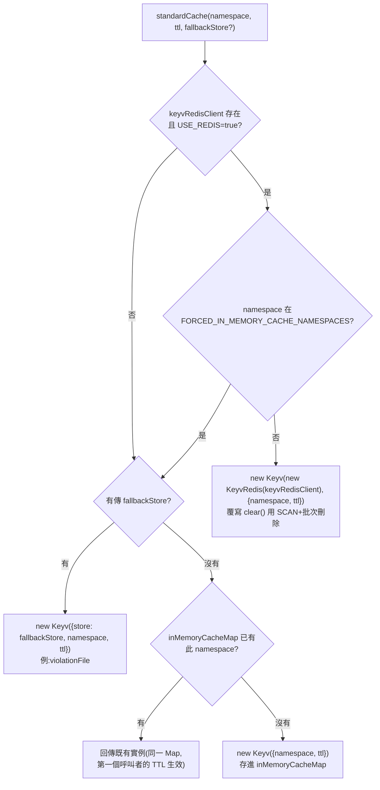

# 18. 快取與 Redis

## 定位

LibreChat 的每一個「暫存狀態」需求——一般快取、rate limiting、session、違規計數、封鎖名單、分散式鎖、resumable stream job——最終都要回答同一個問題:**這份資料要不要在多副本(multi-instance)部署下共享?** 這個子系統就是回答這個問題的地方。

它做兩件事:

1. **提供一個統一的 cache 存取入口**(`getLogStores(key)`),讓呼叫端不用關心背後是 Redis、行程內記憶體、MongoDB 還是本地檔案。
2. **把「有沒有 Redis」這個環境差異,收斂成一組可預期的行為切換**:同一份程式碼,單機開發時全部退化成記憶體/檔案,正式多副本部署時透過 `USE_REDIS=true` 切換成 Redis-backed,而不需要改動呼叫端的程式碼。

在整體分層中,本文件涵蓋 `api/cache/*`(Express 側的薄 JS wrapper)與 `packages/api/src/cache/*`(實際的 TypeScript 實作)這一層,以及建立在它之上的 rate limiter(`api/server/middleware/limiters/`)、違規/封鎖系統(`api/cache/logViolation.js`、`banViolation.js`、`api/server/middleware/checkBan.js`)、併發控制(`packages/api/src/middleware/concurrency.ts`)、cluster leader election(`packages/api/src/cluster/`)與維運工具(`config/flush-cache.js`)。

**與其他文件的分工**:01-architecture-overview.md 已有 Redis 用途總覽表與部署拓撲說明;02-config-system.md 已深入 `APP_CONFIG` namespace 的快取/失效機制;14-streaming-resumability.md 已完整說明 `RedisJobStore`/`RedisEventTransport` 的 resumable stream 機制;08-mcp-integration.md 涵蓋 MCP registry 的獨立快取層。本文件的範圍是**快取抽象層本身**——它怎麼被設計出來、CacheKeys 的完整盤點、Redis client 的組態細節、以及跨這些子系統共通的實作陷阱與設計取捨。上述四份文件的細節不在此重複,只在必要處點出關聯。

---

## 核心概念

| 概念 | 說明 |
|---|---|
| **Keyv** | LibreChat 用來統一 get/set/delete/clear 介面的第三方套件(`keyv`)。背後可以插不同的 storage adapter(記憶體 Map、Redis、MongoDB、JSON 檔案),呼叫端只認得 Keyv 的 API。 |
| **`getLogStores(key)`** | 單一入口的 registry lookup(`api/cache/getLogStores.js:219`)。傳入 `CacheKeys` 或 `ViolationTypes` 列舉值,回傳對應的 Keyv 實例(或 `express-session` store / rate-limit store,視 namespace 而定)。找不到對應 key 直接 `throw`。 |
| **cacheFactory 四種建構器** | `standardCache` / `violationCache` / `sessionCache` / `limiterCache`(`packages/api/src/cache/cacheFactory.ts`),分別對應「一般快取」「違規計數」「`express-session` 儲存」「`express-rate-limit` 儲存」四種下游套件各自要求的介面形狀。 |
| **雙 Redis client** | 專案同時維護 `ioredisClient`(套件 `ioredis`)與 `keyvRedisClient`(套件 `@keyv/redis`,底層是官方 `redis`/`@redis/client`)兩條獨立連線(`packages/api/src/cache/redisClients.ts`)。原因見下方「架構與流程」。 |
| **`FORCED_IN_MEMORY_CACHE_NAMESPACES`** | 即使全域啟用 Redis,特定 namespace(預設 `CONFIG_STORE`、`APP_CONFIG`)仍強制走行程內記憶體——這是「per-container 設定」與「跨副本共享狀態」的手動切分點(`cacheConfig.ts:28-49`)。 |
| **三種不同的 TTL 語意** | Keyv 的 `ttl` 參數在記憶體 store 上是「讀取時惰性檢查 + 每 30 秒背景清除一次」;在 Redis 上是原生 `EXPIRE`;在 MongoDB(`keyvMongo`)上**完全不強制**,只是多存一個 `expiresAt` 欄位,實際過期要靠呼叫端自己判斷並刪除。 |
| **Violation / Ban** | 建立在 cache 抽象之上的一個獨立子系統:計數違規次數(`logViolation`)→ 達門檻觸發封鎖(`banViolation`)→ 之後的請求被 `checkBan` middleware 攔截。它不是資料庫表格,是完全活在 cache 層的「暫時性安全狀態」。 |
| **Lua CAS(compare-and-set)模式** | 三個獨立子系統(併發限制、leader election、resumable stream job store)不約而同地用「單一 Redis `EVAL` 呼叫」取代「GET-檢查-SET 多次往返」,消除競態視窗。這是本文件中反覆出現的一個工程手法。 |

---

## 架構與流程

### 分層與 Redis client 選型

```
api/cache/*.js  (Express 側薄 wrapper:getLogStores / logViolation / banViolation / clearPendingReq)
        │  require('@librechat/api')
        ▼
packages/api/src/cache/
 ├─ cacheConfig.ts    ── 讀 process.env,產出型別化的 cacheConfig 物件(單例)
 ├─ redisClients.ts   ── 依 cacheConfig 建立兩條 Redis 連線
 │    ├─ ioredisClient   (ioredis)      → Lua eval、pub/sub、Streams、
 │    │                                    rate-limit-redis、connect-redis
 │    └─ keyvRedisClient (@keyv/redis)  → 只給 Keyv 的 Redis adapter 用
 ├─ redisUtils.ts     ── batchDeleteKeys / scanKeys(cluster-safe 批次操作)
 ├─ keyvMongo.ts       ── 自製 Keyv-相容的 MongoDB adapter(不強制 TTL)
 ├─ keyvFiles.ts       ── KeyvFile(logFile / violationFile,本地 JSON 檔)
 └─ cacheFactory.ts    ── standardCache / violationCache / sessionCache / limiterCache
        │
        ▼
api/cache/getLogStores.js  ── 把上述 builder 組成一張 CacheKeys → Keyv 的對照表(namespaces）
```

**為什麼要維護兩條 Redis 連線?** `@keyv/redis`(Keyv 的官方 Redis adapter)只支援 Node.js 官方 `redis` client(`@redis/client`),不支援 `ioredis`;但 `rate-limit-redis`、`connect-redis` 這兩個下游套件的設計又假設一個 ioredis-like 的 `sendCommand`/client 介面,而 Lua script、Redis Streams(`XADD`/`XREADGROUP`)、pub/sub 這些進階操作也是用 `ioredis` API 撰寫的(見 `RedisJobStore.ts`、`RedisEventTransport.ts`)。於是專案選擇「兩個 client 各自負責各自的套件生態」,而不是為了統一而各種轉接層(`redisClients.ts:1-223`)。兩條連線共用同一組 `REDIS_URI`/重試/TLS 設定,但**參數要在兩處分別維護**(見下方陷阱)。

### `standardCache` 的後端選擇決策



（`cacheFactory.ts:44-98`)。`violationCache`、`sessionCache`(`express-session` 的 `MemoryStore`/`connect-redis`)、`limiterCache`(`rate-limit-redis`/`undefined`)都是同一套判斷邏輯的變形,差別只在「Redis 不可用時退化成什麼」。

### 流程一:一般讀寫快取(以 `TOOL_CACHE` 為例)

1. `api/server/services/Config/getCachedTools.js` 呼叫 `getLogStores(CacheKeys.TOOL_CACHE)`。
2. `getLogStores` 從 `namespaces` 物件(`getLogStores.js:41`)取出 `standardCache(CacheKeys.TOOL_CACHE)` 建立的 Keyv 實例(namespace 本身即快取鍵前綴,無 TTL)。
3. `cache.get('tools:global')` / `cache.set('tools:mcp:{userId}:{serverName}', tools)`——不管背後是 Redis 還是記憶體 Map,呼叫端程式碼完全一樣。

### 流程二:違規計數 → 封鎖生命週期

```
使用者觸發限流(例如登入失敗) → loginLimiter 的 handler
        │
        ▼
logViolation(req, res, ViolationTypes.LOGINS, errorMessage, score)   (api/cache/logViolation.js:15)
   ├─ violationLogs = getLogStores(ViolationTypes.LOGINS)  → violationCache() 建的 Keyv
   ├─ 讀出目前計數、+score、寫回                                    (見「陷阱」:key 格式依 USE_REDIS 而不同)
   ├─ 呼叫 banViolation(req, res, errorMessage)             (api/cache/banViolation.js:31)
   │     ├─ 檢查 violation_count 是否跨過 BAN_INTERVAL 的整數倍門檻
   │     ├─ deleteAllUserSessions() + 清除 refreshToken/openid cookies
   │     └─ banLogs.set(userId, {...}, duration)  ── banLogs = getLogStores(ViolationTypes.BAN)
   │                                                   （= keyvMongo,namespace: BANS)
   └─ 一般違規歷史寫進 ViolationTypes.GENERAL(= 本地 logFile,恆常如此,見陷阱)

後續請求 → checkBan middleware (api/server/middleware/checkBan.js:54)
   ├─ 先查一個記憶化的 banCache(仍是 keyvMongo,只是 key 多加 "ban_cache:" 前綴)
   ├─ 沒命中則查權威來源 banLogs(BANS namespace)
   ├─ 過期就刪除放行;未過期就 403/429 短路請求，並把結果寫回 banCache
```

### 流程三:併發訊息數限制(Redis 原子 CAS vs. 記憶體 racy fallback)

`packages/api/src/middleware/concurrency.ts` 在**有 Redis** 時用一支 Lua script 把「INCR → 檢查上限 → 超過就 DECR 退回」包進單一 `EVAL` 呼叫(`CHECK_AND_INCREMENT_SCRIPT`,`concurrency.ts:18-29`),徹底消除 INCR/檢查/DECR 之間的競態視窗;**沒 Redis** 時退回到「GET → 判斷 → SET」的非原子操作,註解明白寫著「race condition possible but acceptable for in-memory」(`concurrency.ts:146`)——因為單一行程內記憶體不會真的併發到需要嚴格互斥的程度。

### 流程四:cluster leader election(不是快取,但共用同一條 Redis 連線)

`LeaderElection`(`packages/api/src/cluster/LeaderElection.ts`)用 `SET key value NX EX <lease>` 搶佔一支全域 key,搶到的副本每 10 秒用 Lua script「檢查自己還持有鎖才續租」來延長 25 秒的租約;沒開 Redis 時 `isLeader()` 恆為 `true`(單副本本來就是唯一的領導者)。這支機制被 `MCPServersInitializer`(見 08 文件)用來確保「MCP registry 同步」這種只該跑一份的背景工作在多副本部署下不會被每個副本各跑一次。

### 流程五:`flush-cache` 維運工具

`config/flush-cache.js` 是一支獨立可執行的 Node script(`npm run flush-cache`),**刻意不 import** `packages/api` 的編譯產物,而是自己重新用 `dotenv` + `ioredis` 建一條連線(邏輯刻意仿照 `redisClients.ts` 但手動複製一份)。偵測到 `USE_REDIS`/`REDIS_URI` 就對整個 Redis DB 執行 `FLUSHDB`(cluster 模式則對每個 master node 各執行一次),否則直接刪除 `./data/logs.json`、`./data/violations.json` 兩個檔案。這支工具**不區分 namespace**,是「全部炸掉重來」的粗粒度工具,不是精細的快取失效機制。

---

## 關鍵資料結構

### `CacheKeys` 完整盤點(`packages/data-provider/src/config.ts:2239-2333`,實際掛載見 `api/cache/getLogStores.js:13-60`)

| CacheKeys | 後端 | TTL | 用途 |
|---|---|---|---|
| `CONFIG_STORE` | `standardCache`(預設強制記憶體) | 無 | 雜項設定快取 |
| `TOOL_CACHE` | `standardCache` | 無 | 工具/外掛/MCP 工具定義快取(`getCachedTools.js`) |
| `ROLES` | `standardCache` | 無 | 角色/權限快取(`packages/data-schemas/src/methods/role.ts`) |
| `GEN_TITLE` | `standardCache` | 2 分鐘 | 對話標題產生的去重/進行中狀態 |
| `APP_CONFIG` | `standardCache`(預設強制記憶體) | base 無 TTL；per-principal override 60 秒 | YAML+DB 合併後的 `AppConfig`,細節見 02 文件 |
| `ABORT_KEYS` | `standardCache` | 10 分鐘 | 標記可中止的生成任務 |
| `TOKEN_CONFIG` | `standardCache` | 30 分鐘 | 模型 token 定價/上限設定 |
| `S3_EXPIRY_INTERVAL` | `standardCache` | 30 分鐘 | 每使用者的 S3 URL 檢查節流 |
| `MODEL_QUERIES` | `standardCache` | 無 | 端點模型清單查詢快取 |
| `AUDIO_RUNS` | `standardCache` | 10 分鐘 | TTS run id 快取 |
| `MESSAGES` | `standardCache` | 1 分鐘 | 進行中訊息狀態 |
| `FLOWS` | `standardCache` | 10 分鐘 | 非同步流程(OAuth callback 等)等待狀態,見下方 |
| `PENDING_REQ` | `standardCache` | 呼叫端自訂(併發限制用 1 分鐘) | 併發訊息數的記憶體 fallback（Redis 模式改用 Lua CAS,不經過這個 Keyv） |
| `OPENID_EXCHANGED_TOKENS` | `standardCache` | 10 分鐘 | OpenID token 交換快取 |
| `ADMIN_OAUTH_EXCHANGE` | `standardCache` | 30 秒 | 後台 OAuth one-time code |
| `BANS` | `keyvMongo`（MongoDB,非 Redis） | `BAN_DURATION`（預設 2 小時） | 封鎖記錄,細節見上文流程二 |
| `ENCODED_DOMAINS` | `keyvMongo`（MongoDB） | 無 | Azure OpenAI Assistants 用的網域編碼快取 |
| `OPENID_SESSION` / `SAML_SESSION` | `sessionCache` | — | `express-session` store |
| `TOOLS` / `MODELS_CONFIG` / `STARTUP_CONFIG` / `ENDPOINT_CONFIG` | — | — | **列舉存在但未被 `getLogStores` 掛載**,呼叫 `getLogStores()` 會直接 throw；屬於歷史遺留、目前未使用的 key（見下方陷阱） |

`violationCache()` 額外建立的 namespace 一律以 `violations:{ViolationTypes 值}` 命名(例如 `violations:logins`),涵蓋 `LOGINS`、`CONCURRENT`、`NON_BROWSER`、`MESSAGE_LIMIT`、`REGISTRATIONS`、`TOKEN_BALANCE`、`TTS_LIMIT`、`STT_LIMIT`、`CONVO_ACCESS`、`TOOL_CALL_LIMIT`、`FILE_UPLOAD_LIMIT`、`VERIFY_EMAIL_LIMIT`、`RESET_PASSWORD_LIMIT`、`ILLEGAL_MODEL_REQUEST` 共 14 種,再加上不經過 `violationCache()` 的 `GENERAL`(恆走本地檔案 `logFile`)與 `BAN`(恆走 `keyvMongo`)。

### `cacheConfig` 主要欄位(`packages/api/src/cache/cacheConfig.ts`)

| 欄位 | 對應 env var | 預設值 | 用途 |
|---|---|---|---|
| `USE_REDIS` | `USE_REDIS` | `false` | 總開關；開啟時 `REDIS_URI` 必填,否則啟動時直接丟錯 |
| `USE_REDIS_STREAMS` | `USE_REDIS_STREAMS` | 跟隨 `USE_REDIS` | 是否讓 resumable stream job store 也走 Redis（可與一般快取分開控制） |
| `REDIS_URI` | `REDIS_URI` | — | 支援逗號分隔多個 URI(cluster 模式) |
| `USE_REDIS_CLUSTER` | `USE_REDIS_CLUSTER` | `false` | 用單一 URI 連 cluster 時的顯式開關 |
| `REDIS_CLUSTER_SAFE_DELETE` | `REDIS_CLUSTER_SAFE_DELETE` | `false` | 讓「單節點模式」也走逐鍵刪除,應付 ElastiCache Serverless 這類表面單一 endpoint、內部仍分片的服務 |
| `REDIS_KEY_PREFIX` / `REDIS_KEY_PREFIX_VAR` | 兩者互斥 | `''` | 部署隔離前綴(例如 Cloud Run 的 `K_REVISION`),常設成從環境變數動態帶入,支援藍綠部署 |
| `GLOBAL_PREFIX_SEPARATOR` | 固定值 | `'::'` | 前綴與 namespace 之間的分隔符 |
| `REDIS_RETRY_MAX_DELAY` / `REDIS_RETRY_MAX_ATTEMPTS` | 同名 | 3000ms / 10 次 | 指數退避 + 隨機抖動的重連策略(兩個 client 各自實作一份，邏輯相同) |
| `REDIS_CONNECT_TIMEOUT` | 同名 | 10000ms | 連線逾時 |
| `REDIS_ENABLE_OFFLINE_QUEUE` | 同名 | `true` | 斷線時是否把指令排隊等重連 |
| `REDIS_USE_ALTERNATIVE_DNS_LOOKUP` | 同名 | `false` | AWS ElastiCache TLS cluster 需要的 DNS lookup workaround |
| `REDIS_DELETE_CHUNK_SIZE` / `REDIS_UPDATE_CHUNK_SIZE` / `REDIS_SCAN_COUNT` | 同名 | 1000 | 批次刪除/更新/SCAN 的分批大小 |
| `FORCED_IN_MEMORY_CACHE_NAMESPACES` | 同名(逗號分隔) | `[CONFIG_STORE, APP_CONFIG]` | 強制走記憶體的 namespace 白名單，設成空字串代表全部走 Redis |
| `BAN_DURATION` | `BAN_DURATION` | 7200000（2 小時） | 封鎖持續時間 |
| `MCP_REGISTRY_CACHE_TTL` | `MCP_REGISTRY_CACHE_TTL` | 5000ms | MCP registry 本地快照 TTL,細節見 08 文件 |

### Redis key 命名格式

```
ioredisClient 的 keyPrefix:     {REDIS_KEY_PREFIX}{GLOBAL_PREFIX_SEPARATOR}{原始 key}
standardCache（keyvRedisClient）: {REDIS_KEY_PREFIX}{GLOBAL_PREFIX_SEPARATOR}{namespace}:{key}
resumable stream（RedisJobStore）: stream:{streamId}:job / stream:{streamId}:chunks / stream:{streamId}:runsteps
                                  （用 {} hash tag 讓同一 stream 的所有 key 落在同一 cluster slot）
```

`standardCache` 把 `@keyv/redis` 內部自帶的 `namespace` 屬性(它原本設計拿來當 key 前綴用)**重新挪用**成承載 `REDIS_KEY_PREFIX`(`cacheFactory.ts:49-50`),跟 Keyv 本身的 `namespace` option（用來分隔不同快取用途,如 `CONFIG_STORE`、`TOOL_CACHE`）是兩個不同層級的「namespace」概念——兩者疊加才拼出最終的 Redis key。這個雙層命名容易讓人一開始誤讀成「同一件事寫兩次」。

---

## 關鍵實作細節與陷阱

1. **`GENERAL` 違規歷史永遠走本地檔案,不受 `USE_REDIS` 影響**(`getLogStores.js:14`):`new Keyv({ store: logFile, namespace: 'violations' })` 完全繞過 `cacheFactory`,不管 Redis 有沒有開都寫進 `./data/logs.json`。多副本部署下,這個 namespace 的紀錄天生就是「每個副本各自一份、互不同步」，跟同一批違規事件在 `violationCache()` 建的其他 namespace 上會走 Redis 形成不一致。

2. **`keyvMongo`（`BANS`、`ENCODED_DOMAINS`）沒有真正的 TTL**（`keyvMongo.ts` 的 `get()` 只按 `key` 查詢,完全不比對 `expiresAt`；也沒有對應的 MongoDB TTL index）。`set()` 雖然接受 `ttl` 參數並算出 `expiresAt` 存進文件,但**過期判斷與清除完全靠呼叫端自己做**——`checkBan.js:106-124` 讀到記錄後手動比對 `expiresAt` 是否已過,過了才 `delete`。如果一支 ban 記錄被寫入之後從此沒人再讀它(例如使用者從此不再連線),這筆文件會**永遠留在 Mongo 裡**,不會自動消失。這是「lazy expiry」而非「active expiry」，跟 Keyv 對記憶體/Redis store 的行為語意不同,容易誤判成「有 TTL 保障」。

3. **`checkBan.js` 額外維護的 `banCache` 記憶化層,底層 store 仍是同一個 `keyvMongo`**（`checkBan.js:10`）。它用不同的 key 前綴(`ban_cache:ip:*`/`ban_cache:user:*`)把查詢結果「快取」起來，本意是減少重複查詢，但因為 store 本身就是 Mongo、又沒有真正的 TTL 過期（同陷阱 2），這一層「快取」實質上只是把同一份資料用不同 key 又寫了一份到 Mongo，並不會替換掉一次真正的資料庫往返，也會讓 collection 隨時間持續累積。

4. **Rate limiter 在沒開 Redis 時完全退化成 per-instance**：`limiterCache(prefix)` 沒有 Redis 時直接回傳 `undefined`（`cacheFactory.ts:145-147`），`express-rate-limit` 拿到 `store: undefined` 會退回它內建的、行程內記憶體的 `MemoryStore`。多副本部署若忘了開 `USE_REDIS`，登入限流、訊息限流等**每個副本各算各的**，實際上限是「單一副本上限 × 副本數」，很容易被誤以為是全域限流。

5. **`standardCache` 的記憶體記憶化是「先到先贏」的 TTL**（`cacheFactory.ts:35-37` 註解明講）：同一個 namespace 在沒有 Redis 時只會建立一個共用的 Keyv 實例（存進 module-level 的 `inMemoryCacheMap`），如果程式碼中不同地方對同一 namespace 傳了不同的 `ttl`，只有**第一個呼叫到的地方**的 TTL 生效，之後的呼叫拿到的是已經建好的實例，傳入的 `ttl` 參數會被忽略。

6. **Redis 模式下的 `cache.clear()` 需要手動覆寫**（`cacheFactory.ts:56-80`）：Keyv 預設的 `clear()` 不知道「`REDIS_KEY_PREFIX` + 分隔符 + namespace」這種組合式前綴規則，直接呼叫會清錯範圍（見程式碼註解引用的 issue #10487）。`standardCache` 因此覆寫 `clear` 方法，改用 `SCAN` 找出符合 pattern 的 key 再批次 `DEL`。

7. **Cluster 模式下的多鍵操作要避開 `CROSSSLOT`**：所有牽涉多個 key 的操作（陣列 `DEL`、`MULTI`/`EXEC` pipeline）在 Redis Cluster 下若 key 分散在不同 slot 會直接報錯。`batchDeleteKeys`（`redisUtils.ts:22-86`）因此區分「cluster/cluster-safe：逐 key 平行刪除」vs.「單節點：批次陣列刪除」兩條路徑；`RedisJobStore`/`RedisEventTransport` 則是從 key 命名下手，統一用 `{streamId}` 這種 hash tag 把同一個 stream 的所有相關 key 綁進同一個 slot，讓 pipeline/Lua 操作維持原子性。

8. **`FORCED_IN_MEMORY_CACHE_NAMESPACES` 是執行期字串比對，不是編譯期型別檢查**：它用逗號分隔的字串陣列比對 `CacheKeys` enum 值，拼錯字只有啟動時的執行期檢查（`cacheConfig.ts:40-49`）會抓到，IDE 不會提示。

9. **`CacheKeys` 列舉與 `getLogStores` 的掛載並非一一對應**：`TOOLS`、`MODELS_CONFIG`、`STARTUP_CONFIG`、`ENDPOINT_CONFIG` 四個列舉值目前完全沒有被 `getLogStores.js` 的 `namespaces` 物件掛載，屬於未使用的歷史殘留；對這幾個 key 呼叫 `getLogStores()` 會直接 `throw new Error('Invalid store key')`。新增一個 cache namespace 必須同時改 `packages/data-provider/src/config.ts`（定義列舉）與 `api/cache/getLogStores.js`（實際掛載），兩者目前**沒有任何機制保證同步**。

10. **`flush-cache.js` 是獨立維護的一份 Redis 連線邏輯**：因為它是純 Node script（走 `dotenv`，不經過 TS build/bundle），沒有 import `packages/api` 的編譯產物，而是照抄 `redisClients.ts` 的連線參數又手寫了一份。兩處的 retry/TLS/cluster 判斷邏輯必須手動保持同步，是容易漂移的技術債。它也用 `redis.keys('*')`（阻塞式全量掃描）而非 `SCAN`，只適合維運場景的一次性操作，不該被搬進任何熱路徑。

11. **`FLOWS` namespace 用輪詢而非 pub/sub 等待外部事件完成**（`packages/api/src/flow/manager.ts`）：OAuth callback、MCP 授權等「等某個外部動作完成」的場景，是靠 `setInterval` 反覆讀 cache 直到值出現，不是即時推播。這跟 resumable stream（見 14 文件）用 Redis pub/sub 做到近乎即時通知形成對比——是刻意的複雜度取捨：OAuth 完成頻率低、對延遲不敏感，不值得為它建一整套 pub/sub。

12. **Redis 故障時的策略不一致**：`concurrency.ts` 在 Lua `EVAL` 失敗時選擇「fail-open」（放行請求，`concurrency.ts:139-143`），避免 Redis 掛掉直接鎖死聊天功能；但這代表 Redis 故障期間併發限制形同虛設。`limiterCache` 沒有等效的容錯層，行為取決於 `rate-limit-redis`/底層 `ioredis` 對連線錯誤的預設處理。這是「可用性優先於精確限流」的設計選擇，但兩個子系統的容錯行為並不對稱，移植時要重新明確定義每個限流點各自的 fail-open/fail-closed 策略。

---

## 設計決策分析

**為什麼選 Keyv 而不是自己包一層 interface？** Keyv 是 Node 生態系裡標準的「storage-agnostic key-value 快取」抽象，有現成的 Redis/MongoDB/File adapter，省去重新造輪子。但 Keyv 的 API 面對「需要原子性/高效能的進階操作」（`SCAN`、pipeline、Lua、Streams）力有未逮，所以像併發限制、leader election、resumable stream job store 這幾個真正需要跨副本協調正確性的地方，全部**繞過 Keyv 直接用原生 `ioredis` client**。這是清楚的分層取捨：簡單快取用 Keyv 換開發速度；複雜協調用原生 client 換正確性與效能。

**為什麼兩個 Redis client 並存？** 純粹是套件生態限制（`@keyv/redis` 只支援官方 `redis` client），不是刻意設計。代價是兩條連線各自的重試/TLS/cluster 設定要手動保持同步（見陷阱），維運時也要意識到「Redis 連線數是兩倍」。如果從零重做，值得只選一個 client library 貫穿全部場景。

**為什麼 `CacheKeys` 是一個集中 enum + 一張 `namespaces` 對照表，而不是每個模組各自管理自己的 cache 實例？** 集中式的 `getLogStores` 讓「有哪些 namespace」「TTL 多少」「該不該強制記憶體」一個檔案看完，也方便寫 `flush-cache`/audit 這類遍歷所有 store 的工具。代價是新增 namespace 要同步改兩個檔案且沒有編譯期檢查（陷阱 9），且所有模組共用一份全域可變狀態（`namespaces` 物件在模組載入時就建好，不能延遲初始化）。

**為什麼 ban/violation 選擇存 MongoDB 而非 Redis（即使已經開了 Redis）？** Ban 是需要長期保存、不該因為 Redis 被清空/重啟就失效的懲罰紀錄；Redis 在這個專案的心智模型裡是「可拋棄的暫存層」（`flush-cache` 工具的存在本身就說明了這點），而 ban 記錄更接近「需要審計的安全事件」。犧牲一點效能（Mongo 比 Redis 慢）換取資料持久性語意，是合理的取捨——但配套的 TTL 沒有真正落實（陷阱 2），是這個決策沒有走完的部分。

**resumable stream 為什麼不共用 `cacheFactory` 的 `standardCache`，而是獨立一套 `IJobStore`/`IEventTransport`？** 因為需求形態完全不同：job store 需要「跨副本原子狀態機轉換」「append-only 事件序列（Redis Streams）」「近即時 pub/sub 推播」，這些是 Keyv 的 get/set/delete 語意完全表達不了的操作。獨立設計介面、提供 Redis 與記憶體兩種實作，只共用底層的 `ioredisClient` 連線與 `cacheConfig.USE_REDIS_STREAMS` 旗標，是「不要為了複用既有抽象而削足適履」的示範（細節見 14 文件）。

**若重做會怎麼選？** 保留「Lua CAS 取代樂觀鎖重試」「pub/sub 給即時通知、append log 給可重播事件」「持久性資料不進 Redis」這幾個核心思路；但會合併成單一 Redis client library，並把 `FORCED_IN_MEMORY_CACHE_NAMESPACES` 這種執行期字串陣列改成型別化、每個 cache 定義自帶 `scope` 標記的設定物件。

---

## 移植到新技術棧的建議

目標棧：**PostgreSQL + Hono + Next.js + pnpm + Redis + docker-compose**（已定案）；AI 框架尚未定案，候選為 **LangGraph**、**LangChain**（1.x `createAgent`，底層同為 LangGraph）、**deepagents**（建於 LangGraph 之上）、**Vercel AI SDK**（輕量 agent loop），完整比較見 19-framework-options.md。本文件的快取/rate limiting/ban/session 這層與框架選型無關，下方僅在少數涉及 agent 狀態持久化與串流的段落標註框架差異。

### 總體對應

| LibreChat | 新技術棧建議 |
|---|---|
| Keyv + `getLogStores` | 不需要 Keyv 本身；直接包一個型別化的 `CacheClient`（薄封裝 `ioredis` + 行程內 `Map` fallback），用一個 `const CACHE_NAMESPACES = { ... } as const` 取代字串 enum，換取編譯期檢查 |
| `keyvMongo`（`BANS`/`ENCODED_DOMAINS`） | PostgreSQL 表（見下方 DDL）+ Redis 短 TTL 查詢快取 |
| `keyv-file`（`logFile`/`violationFile`） | 不需要；容器化 + Redis-by-default 的環境沒有理由留檔案系統這條第三路徑（多副本下各自 volume 不共享，等於資料會遺失） |
| `connect-redis`（session） | 若採用 JWT/stateless auth（Hono 常見做法）可能完全不需要 server-side session store；若仍要 session，用 Hono 對應的 session middleware + Redis adapter |
| `rate-limit-redis` | Hono 生態的 rate limit middleware（有現成的 Redis store 實作），或自己用 `INCR`+`EXPIRE`/Lua 包一支 20 行的 sliding-window limiter |
| `RedisJobStore`/`RedisEventTransport` | 見 14 文件，核心結論相同：Redis Streams 做事件重播、pub/sub 做即時推送；LangGraph 系（含 LangChain/deepagents）另有官方 checkpointer 可部分取代自建（見下方「AI 框架對這一層快取的影響」），ai-sdk 系仍需比照本文件自建 |
| MCP registry cache | 見 08 文件 |
| `LeaderElection` | 概念可以整包搬（`SET NX` + Lua 續租）；但目標棧已經有 Postgres，也可以改用 `pg_try_advisory_lock`省掉一個 Redis 依賴，看這個鎖是否只在單一資料庫連線池情境下夠用 |
| `FORCED_IN_MEMORY_CACHE_NAMESPACES` | 概念保留（設定類快取預設留在 process 記憶體 + 版本號機制，見 02 文件的具體建議），但改成型別化設定而非字串陣列 |

### PostgreSQL schema 草案（ban / violation，取代 `keyvMongo`）

```sql
create table user_violations (
  id bigserial primary key,
  tenant_id uuid not null,
  principal_type text not null check (principal_type in ('user', 'ip')),
  principal_key text not null,          -- userId 或 IP
  violation_type text not null,         -- 對應 ViolationTypes
  score integer not null default 1,
  metadata jsonb not null default '{}',
  created_at timestamptz not null default now()
);
create index idx_violations_lookup
  on user_violations (tenant_id, principal_type, principal_key, violation_type);

create table user_bans (
  id bigserial primary key,
  tenant_id uuid not null,
  principal_type text not null check (principal_type in ('user', 'ip')),
  principal_key text not null,
  violation_type text not null,
  violation_count integer not null,
  reason jsonb not null default '{}',
  created_at timestamptz not null default now(),
  expires_at timestamptz not null
);
create index idx_bans_active
  on user_bans (tenant_id, principal_type, principal_key)
  where expires_at > now();
```

查 ban 狀態時，前面掛一層 Redis 短 TTL 快取（例如 `GET ban:{tenant}:{type}:{key}`，TTL 30 秒），miss 才查 Postgres——這才是真正發揮 Redis「加速層」語意的地方，而不是像 LibreChat 的 `banCache` 那樣把記憶化快取指回同一個資料庫（陷阱 3）。真正的過期靠 Postgres 的 `expires_at` 判斷（`where expires_at > now()`），不需要額外的排程清除；要清理歷史資料表大小可以另外排一個定期刪除已過期超過 N 天記錄的 job。

### Hono route / middleware 對應

- 用一個 middleware 把 `CacheClient` 掛進 Hono 的 `Context`（例如 `c.set('cache', cacheClient)`），取代 `getLogStores` 這種全域 import 的用法，方便測試時注入假的 client。
- Rate limiter：對照 `limiterCache`，寫一支泛用的 Hono middleware factory，內部用 Redis `INCR`+`EXPIRE` 或 Lua 腳本，介面上跟 `express-rate-limit` 的 `store` 概念類似，但直接暴露成 Hono middleware 而不假裝相容 Express 的 store 介面。
- Ban check：對照 `checkBan.js`，寫成一支早期短路的 Hono middleware，查詢順序是「Redis 快取 → miss 才查 Postgres」。

### AI 框架對這一層快取的影響

不管最終選哪個框架，本文件涵蓋的 rate limiting、ban/violation、session、一般查詢快取都是框架無關的基礎設施，可直接沿用上述 Hono middleware 設計，不受框架選型影響。框架差異只出現在「agent 迴圈狀態要不要用 checkpointer 持久化」與「串流斷線重連要不要用框架官方套件」這兩點，Redis 在兩邊都會用到，但用法不同：

| 面向 | LangGraph | LangChain | deepagents | Vercel AI SDK |
|---|---|---|---|---|
| 相同 prompt 短時間內去重（對應 `GEN_TITLE`） | 需自建（`hash(prompt)` 當 Redis key，短 TTL），與框架無關 | 同左 | 同左 | 同左；`streamText`/`generateText`/`generateObject` 皆為無狀態呼叫 |
| Agent 迴圈狀態持久化（checkpoint） | 官方 `@langchain/langgraph-checkpoint-redis`(RedisSaver)/`-postgres`(PostgresSaver) 可直接掛，做法與 LibreChat 現制高度一致 | 同 LangGraph（`createAgent` 回傳的即是 LangGraph 圖，直接掛 checkpointer） | 同 LangGraph（`createDeepAgent` 回傳編譯好的圖） | 無 checkpointer 抽象；messages 陣列即狀態，需自行存進上方 Postgres schema |
| 可恢復串流（斷線重連） | 需自建 job store + replay，可照抄本文件流程五與 14 文件的 `RedisJobStore`/`RedisEventTransport` | 同左 | 同左 | 官方 `resumable-stream` 套件 + Redis + `useChat({resume})`，開箱即用但粒度較粗，status/active 查詢仍要自建（比照 14 文件） |

完整框架能力對照見 19-framework-options.md，此處不重複展開選型討論。

### Redis 用途總結（給新專案的具體建議）

1. **Rate limiting**：短 TTL counter + `INCR`/`EXPIRE` 或 Lua，比照 `limiterCache`。
2. **Session/token 快取**：若有 server session 需求。
3. **Resumable stream job store + pub/sub**：Redis Streams 做事件記錄、pub/sub 做即時推播，見 14 文件；若選 LangGraph 系框架，這塊有官方 Redis checkpointer（`@langchain/langgraph-checkpoint-redis`）可評估直接取代部分自建邏輯，若選 ai-sdk 則對應官方 `resumable-stream` 套件 + Redis，兩者都仍落在「Redis 做狀態/事件儲存」這個共通用途上。
4. **分散式鎖 / leader election**：只在有真正「同一時間只能一個副本執行」的排程任務時才需要；也可以用 Postgres advisory lock 取代，減少一個 Redis 依賴面。
5. **短 TTL 查詢結果快取**：ban 查詢、config 查詢、tool schema 這類「查資料庫較貴、但可以接受幾十秒內舊資料」的場景，搭配版本號或顯式失效機制，不要只靠 `SCAN` 做批次清除（陷阱 6 的教訓）。
6. **不要**把「需要長期審計」的資料（ban 記錄、違規歷史）主存放在 Redis——用 Postgres,Redis 只做加速層,這樣 TTL 也能交給資料庫的查詢條件而非「靠呼叫端記得檢查」。
7. **是否需要 BullMQ？**——如果有真正的背景任務佇列需求（embedding 產生、批次匯出、定期清理），BullMQ（基於 ioredis）是成熟的選擇；但「一次聊天生成」這種長生命週期、需要跨副本恢復的任務**不適合**塞進 BullMQ 的 job 佇列模型（重試/優先權/worker pool 的語意跟「單一物件的狀態機 + 事件重播」不同），應該延續 LibreChat 的做法：Redis Streams + hash 狀態機，而不是佇列。

### Next.js 前端考量

前端不直接碰 Redis，但要處理兩件事：(1) rate limit / ban 觸發的 429/403 需要對應的 UI（倒數計時、友善訊息），這部分的錯誤結構最好在後端統一（例如都回傳 `{ type, retryAfterMs }`），前端才能寫成通用元件；(2) resumable stream 的重連/顯示邏輯屬於 14 文件範圍，不在此重複。

### 沒有對應、建議直接捨棄的部分

- **`keyv-file` 本地檔案 fallback**：在容器化 + Redis-by-default 的新環境沒有存在必要，直接二選一（Redis 或 Postgres），不要保留檔案系統這第三種狀態。
- **雙 Redis client 共存**：新專案沒有 Keyv 相容性包袱，只選一個 client library（建議 `ioredis`，Lua/Cluster/pipeline API 較完整）。
- **`FORCED_IN_MEMORY_CACHE_NAMESPACES` 的字串陣列設計**：對一個型別優先的 TS 專案來說太動態（拼錯字不會在編譯期被抓到），改成每個 cache 定義直接標注 `scope: 'process' | 'cluster'` 的型別化設定物件。
- **`CacheKeys` 列舉與實際掛載表分離維護**（陷阱 9）：改成單一 source of truth——例如一個 `as const` 的設定物件，型別直接從物件的 key 推導，而不是額外維護一份 enum。
